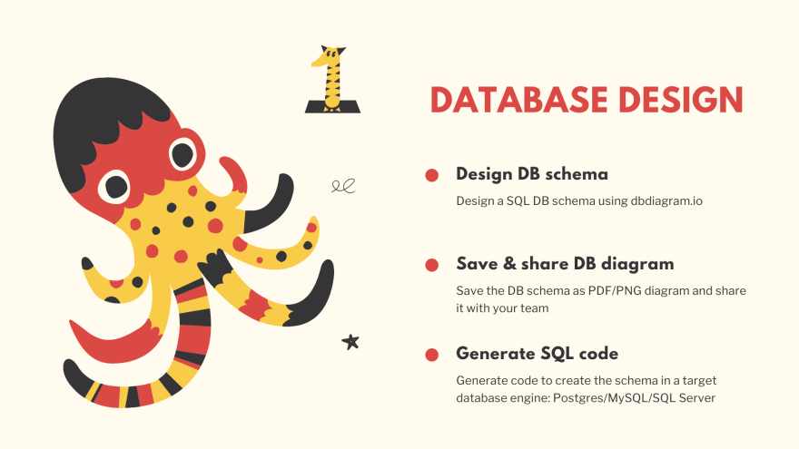
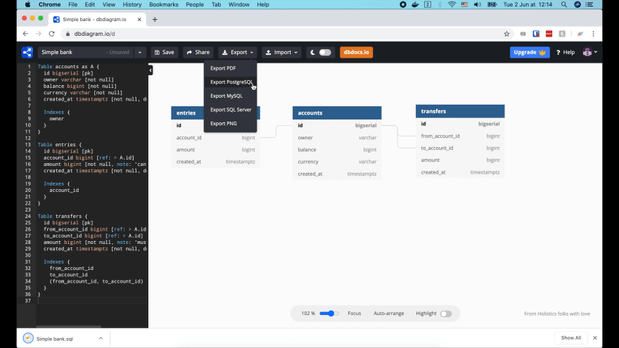
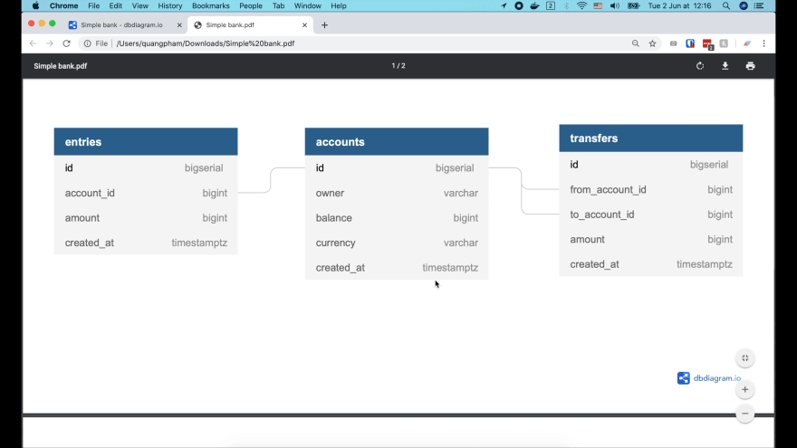
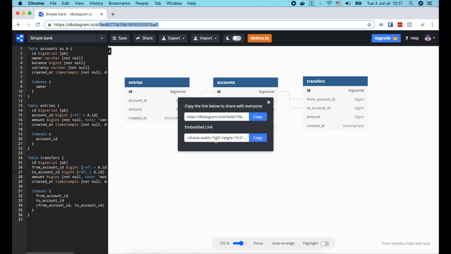

# Проектируем схему БД и генерируем SQL код с помощью dbdiagram.io

[Оригинал](https://dev.to/techschoolguru/design-db-schema-and-generate-sql-code-with-dbdiagram-io-4ko5)

## Мастер-класс по бэкенду

Привет и добро пожаловать в Tech School!

В этом мастер-классе по бэкенду мы узнаем всё о том как спроектировать, разработать
и развернуть полностью законченную бэкенд систему с нуля, используя PostgreSQL, 
Golang и Docker.

Сервис, который мы собираемся создать, — это простой пример банковской системы. 
Он предоставит API-интерфейсы для фронтенда, чтобы выполнять следующие действия:

* Во-первых, создавать и управлять банковскими счетами, состоящими из имени 
  владельца, баланса и валюты.
* Во-вторых, записывать все изменения баланса для каждой счета. Таким 
  образом, каждый раз, когда на счет добавляются или списываются деньги, будет 
  создаваться запись об изменении состояния счёта.
* И, в-третьих, выполнять денежный перевод между двумя счетами. Это должно 
  происходить внутри транзакции, чтобы либо баланс обоих счетов был успешно 
  обновлен, либо не изменился ни один из них.


## Лекция 1: проектирование базы данных

На первой лекции мы узнаем как спроектировать базу данных. Я покажу вам, как:

* Создать схему базы данных SQL с помощью [dbdiagram.io](https://dbdiagram.io/home)
* Сохранить схему в виде PDF или PNG, чтобы поделиться ею со своей командой.
* И, наконец, сгенерируем SQL коды для создания схемы в конкретной системе 
  управления базой данных, которую вы выберите, например, PostgreSQL, MySQL 
  или SQL сервер.
  


## Проектируем схему БД

Хорошо, давайте перейдём на сайт dbdiagram.io и нажмём на Go to app.


Это пример схемы БД. Слева мы определяем структуру таблицы с помощью простого 
синтаксиса. Соответствующая ей диаграмма появится справа.

Мы можем использовать инструмент «Экспорт» вверху, чтобы сохранить эту 
диаграмму в виде файла PDF или PNG или сгенерировать коды SQL для Postgres, 
MySQL или SQL сервера.

Хорошо, теперь давайте изменим эту схему, чтобы она соответствовала нашей базе 
данных. Я собираюсь изменить название этой диаграммы на «Simple bank».

### Таблица accounts

Сначала создадим таблицу `accounts`. Мы используем ключевое слово `Table` для
определения таблицы и `as`, чтобы задать для неё короткий псевдоним.

Допустим, мы хотим, чтобы каждая учетная запись имела уникальный идентификатор, 
поэтому я буду использовать для этого поле `id` с автоинкрементом.

```
Table accounts as A {
  id bigserial [pk]
}
```

В скрипте примера для этой цели используется ключевое слово `increment`. Но в
Postgres мы можем также использовать тип `bigserial`. Это означает больший 
диапазон для автоматически инкрементирующихся целых чисел (8-байт/64-бит).

Мы используем ключевое слово `pk`, чтобы обозначить, что это поле является 
первичным ключом этой таблицы.

В следующем поле — `owner`, хранится имя владельца счёта. Таким образом, его тип 
может быть `text` или `varchar`.

```
Table accounts as A {
  id bigserial [pk]
  owner varchar
  balance bigint
}
```

Поле `balance` используется для хранения суммы доступных денег на счете. Для
простоты я просто использую здесь тип `bigint`. На самом деле не все валюты
можно представить в виде целых чисел, поэтому вам следует использовать вместо
этого тип `decimal`.

Теперь добавим еще одно поле для хранения названия валюты (`currency`). И, наконец, 
стандартное поле `created_at`, чтобы знать, когда была создан счёт.

Мы должны использовать тип `timestamptz` вместо просто `timestamp`, потому что 
он также включает информацию о часовом поясе. И мы хотим, чтобы он автоматически 
устанавливался базой данных, поэтому давайте установим для него значение по 
умолчанию с помощью ключевого слова `default`.

В Postgres есть функция `now()` для получения текущего времени. Мы можем 
просто поместить его в обратные кавычки, чтобы использовать в качестве 
значения по умолчанию.

```
Table accounts as A {
  id bigserial [pk]
  owner varchar
  balance bigint
  currency varchar
  created_at timestamptz [default: `now()`]
}
```

Это всё что нужно сделать. Таблица `accounts` готова.

## Таблица entries

Следующая таблица — `entries`. В эту таблицу будут записываться все изменения 
баланса счета. Она также имеет столбец идентификатора с автоинкрементом, который 
является первичным ключом.

И у него есть внешний ключ `account_id` типа `bigint`, который ссылается на столбец 
`id` таблицы `account`. Мы используем ключевое слово `ref` для объявления этой 
ссылки.

Как вы, возможно, знаете, это является отношением «один ко многим» между 
таблицами `accounts` и `entries`, потому что у 1 счёта может быть множество 
записей изменения его баланса.

```
Table entries {
  id bigserial [pk]
  account_id bigint [ref: > A.id]
  amount bigint
  created_at timestamptz [default: `now()`]
}
```

Ещё одно необходимое нам поле — это сумма (`amount`), которая добавляется 
к балансу счета. Она может быть положительной или отрицательной в зависимости
от того поступают ли деньги на счёт или уходят со счёта.

И, наконец, поле `created_at`, чтобы зафиксировать, когда запись была создана.

## Таблица transfers

Последняя таблица - transfers. В неё записываются все денежные переводы 
между двумя счетами. Для примера в нашем курсе нас будут интересовать только 
внутренние переводы между счетами в создаваемом банковском приложении.

Таким образом, эта таблица будет иметь следующие столбцы:

* Первичный ключ `id` с автоинкрементом
* Внешний ключ `from_account_id` и ещё один внешний ключ `to_account_id` ссылаются 
  на столбец `id` таблицы `accounts`.
* Затем сумма денег, которая перемещается с одного счета на другой. Но в отличие 
  от суммы в таблице `entries`, это значение суммы **должно быть положительным**.
* И, наконец, поле `created_at`, как и в других таблицах.

```
Table transfers {
  id bigserial [pk]
  from_account_id bigint [ref: > A.id]
  to_account_id bigint [ref: > A.id]
  amount bigint
  created_at timestamptz [default: `now()`]
}
```

## Добавляем ограничения

Хорошо, наша схема БД почти готова. Теперь давайте посмотрим на оставшуюся часть 
примера, чтобы увидеть, можем ли мы что-то ещё добавить.


Это еще один способ объявить ссылку на внешний ключ.

И мы также можем добавить ненулевое (`not null`) или уникальное (`unique`) 
ограничение для некоторых полей в наших таблицах.

Я не думаю, что в нас в таблицах должны быть уникальные поля за исключением 
первичных ключей, которые уже уникальны.

Я собираюсь добавить ограничения `not null` для:

* столбцов `owner`, `balance`, `currency` и `created_at` таблицы `accounts`.
* столбцов `amount` и `created_at` таблицы `entries`.
* для столбцов таблицы `transfers` по аналогии с таблицей `entries`.

```
Table accounts as A {
  id bigserial [pk]
  owner varchar [not null]
  balance bigint [not null]
  currency varchar [not null]
  created_at timestamptz [not null, default: `now()`]
}

Table entries {
  id bigserial [pk]
  account_id bigint [ref: > A.id, not null]
  amount bigint [not null, note: 'can be negative or positive']
  created_at timestamptz [not null, default: `now()`]
}

Table transfers {
  id bigserial [pk]
  from_account_id bigint [ref: > A.id, not null]
  to_account_id bigint [ref: > A.id, not null]
  amount bigint [not null, note: 'must be positive']
  created_at timestamptz [not null, default: `now()`]
}
```

## Добавляем комментарии

Мы также можем добавить некоторые комментарии к столбцам. Итак, давайте добавим
комментарий к столбцу `amount` таблицы `entries`, в котором говорится, что он
может быть отрицательным или положительным. И еще один комментарий к столбцу
`amount` в таблице `transfers`, о том, что он должен быть положительным.

```
Table entries {
  ...
  amount bigint [not null, note: 'can be negative or positive']
}

Table transfers {
  ...
  amount bigint [not null, note: 'must be positive']
}
```

## Определяем тип enum

Мы даже можем определить пользовательский тип enum для нашего столбца. Например,
мы можем задать `Currency` enum с двумя возможными значениями: USD и EUR и 
использовать его в качестве типа столбца `account.currency`, например:

```
enum Currency {
    USD
    EUR
}

Table accounts as A {
  ...
  currency Currency [not null]
}
```

Однако, я предпочитаю использовать здесь встроенный тип varchar и позволить коду
приложения выполнять проверку значений.

## Добавляем индексы

Хорошо, последнее, что нам нужно сделать, это добавить индексы к нашим 
таблицам. Для этого мы будем использовать ключевое слово `Indexes`.

В таблице `accounts` нам может понадобиться искать счета по имени владельца, 
поэтому давайте добавим `owner` в список индексов.

Если мы захотим вывести все операции по перемещению средств
для определенного счёта, нужно добавить `account_id` в индекс для таблицы 
`entries`.

Таблица `transfers` самая сложная:

* Мы можем захотеть найти все переводы, выполненные со счёта. Таким образом, 
  `from_account_id` должен быть первым индексом.
* Точно так же мы можем захотеть найти все переводы, поступившие на счет. Так 
  что `to_account_id` должен быть ещё одним индексом.
* И, наконец, если мы хотим найти все переводы между двумя конкретными 
  аккаунтами, нам нужен составной индекс, включающий как `from_account_id`, так 
  и `to_account_id`.

```
Table accounts as A {
  id bigserial [pk]
  owner varchar [not null]
  balance bigint [not null]
  currency varchar [not null]
  created_at timestamptz [not null, default: `now()`]

  Indexes {
    owner
  }
}

Table entries {
  id bigserial [pk]
  account_id bigint [ref: > A.id, not null]
  amount bigint [not null, note: 'can be negative or positive']
  created_at timestamptz [not null, default: `now()`]

  Indexes {
    account_id
  }
}

Table transfers {
  id bigserial [pk]
  from_account_id bigint [ref: > A.id, not null]
  to_account_id bigint [ref: > A.id, not null]
  amount bigint [not null, note: 'must be positive']
  created_at timestamptz [not null, default: `now()`]

  Indexes {
    from_account_id
    to_account_id
    (from_account_id, to_account_id)
  }
}
```

На этом всё! Наше определение схемы завершено.

## Просматриваем диаграмму БД

Теперь справа мы можем щелкнуть на Auto-arrange, чтобы реорганизовать диаграмму
БД, которая была автоматически сгенерирована для нас.


Как видите из таблицы `accounts` в таблицу `entries` существуют ссылки 1-ко-многим.
И есть две ссылки 1-ко-многим из таблицы `accounts` в `transfers`.

## Генерируем SQL код

Теперь давайте попробуем сгенерировать PostgreSQL код, используя инструмент 
экспорта в верхней части страницы.



Файл создан. Давайте откроем его!

В нём вы увидите красивый код коды, готовый для запуска в PostgreSQL для 
создания схемы базы данных.

```
CREATE TABLE "accounts" (
  "id" bigserial PRIMARY KEY,
  "owner" varchar NOT NULL,
  "balance" bigint NOT NULL,
  "currency" varchar NOT NULL,
  "created_at" timestamptz NOT NULL DEFAULT (now())
);

CREATE TABLE "entries" (
  "id" bigserial PRIMARY KEY,
  "account_id" bigint NOT NULL,
  "amount" bigint NOT NULL,
  "created_at" timestamptz NOT NULL DEFAULT (now())
);

CREATE TABLE "transfers" (
  "id" bigserial PRIMARY KEY,
  "from_account_id" bigint NOT NULL,
  "to_account_id" bigint NOT NULL,
  "amount" bigint NOT NULL,
  "created_at" timestamptz NOT NULL DEFAULT (now())
);

ALTER TABLE "entries" ADD FOREIGN KEY ("account_id") REFERENCES "accounts" ("id");

ALTER TABLE "transfers" ADD FOREIGN KEY ("from_account_id") REFERENCES "accounts" ("id");

ALTER TABLE "transfers" ADD FOREIGN KEY ("to_account_id") REFERENCES "accounts" ("id");

CREATE INDEX ON "accounts" ("owner");

CREATE INDEX ON "entries" ("account_id");

CREATE INDEX ON "transfers" ("from_account_id");

CREATE INDEX ON "transfers" ("to_account_id");

CREATE INDEX ON "transfers" ("from_account_id", "to_account_id");

COMMENT ON COLUMN "entries"."amount" IS 'can be negative or positive';

COMMENT ON COLUMN "transfers"."amount" IS 'must be positive';
```

* В этом файле три запроса `CREATE TABLE`, чтобы создать таблицу `accounts`,
`entries` и `transfers`.
* Три запроса `ALTER TABLE`, чтобы добавить внешние ключи в таблицы.
* Пять запросов `CREATE INDEX`, чтобы создать все индексы.
* И, наконец, два запроса для добавления комментариев к столбцам `amount`.

## Экспорт в другой формат

Теперь давайте попробуем экспортировать диаграмму в PDF файл.



Нажмите на пункт меню Export PDF и диаграмма успешно сохранится в виде файла 
PDF, который можно совместно использовать в команде.

Вы также можете экспортировать в другие форматы. Например, это сгенерированный
MySQL код.

```mysql
CREATE TABLE `accounts` (
  `id` bigserial PRIMARY KEY,
  `owner` varchar(255) NOT NULL,
  `balance` bigint NOT NULL,
  `currency` varchar(255) NOT NULL,
  `created_at` timestamptz NOT NULL DEFAULT (now())
);

CREATE TABLE `entries` (
  `id` bigserial PRIMARY KEY,
  `account_id` bigint NOT NULL,
  `amount` bigint NOT NULL COMMENT 'can be negative or positive',
  `created_at` timestamptz NOT NULL DEFAULT (now())
);

CREATE TABLE `transfers` (
  `id` bigserial PRIMARY KEY,
  `from_account_id` bigint NOT NULL,
  `to_account_id` bigint NOT NULL,
  `amount` bigint NOT NULL COMMENT 'must be positive',
  `created_at` timestamptz NOT NULL DEFAULT (now())
);

ALTER TABLE `entries` ADD FOREIGN KEY (`account_id`) REFERENCES `accounts` (`id`);

ALTER TABLE `transfers` ADD FOREIGN KEY (`from_account_id`) REFERENCES `accounts` (`id`);

ALTER TABLE `transfers` ADD FOREIGN KEY (`to_account_id`) REFERENCES `accounts` (`id`);

CREATE INDEX `accounts_index_0` ON `accounts` (`owner`);

CREATE INDEX `entries_index_1` ON `entries` (`account_id`);

CREATE INDEX `transfers_index_2` ON `transfers` (`from_account_id`);

CREATE INDEX `transfers_index_3` ON `transfers` (`to_account_id`);

CREATE INDEX `transfers_index_4` ON `transfers` (`from_account_id`, `to_account_id`);
```

Отлично, всё что нам осталось сделать - это сохранить (`Save`) этот проект и 
нажать `Share`, чтобы получить ссылку, которой можно поделиться с другими. 
Вы можете использоваться также строку с URL адресом, чтобы добавить эту ссылку на 
другие страницы. 



И это все, чем я хочу поделиться с вами в этой первой лекции курса. Я надеюсь, 
что она была полезна вам. Спасибо за время, потраченное на чтение, и до
встречи на следующей лекции!

