# Как настроить Github Actions для Go + Postgres, чтобы запускать автоматические тесты

[Оригинал](https://dev.to/techschoolguru/how-to-setup-github-actions-for-go-postgres-to-run-automated-tests-81o)

**Непрерывная интеграция (CI)** — это важная часть процесса разработки программного 
обеспечения, когда общий репозиторий кода постоянно изменяется из-за внедрения 
в него новой сделанной работы члена команды.

Чтобы обеспечить высокое качество кода и уменьшить количество потенциальных 
ошибок, каждая интеграция обычно проверяется с помощью автоматизированного 
процесса сборки и тестирования.

В этой статье мы узнаем, как настроить этот процесс с помощью **Github Action** для 
автоматической сборки и запуска модульных тестов для нашего простого 
банковского приложения, который написан на **Golang** и использует **PostgreSQL** в 
качестве основной базы данных.

Ниже:
* Ссылка на [плейлист с видео лекциями на Youtube](https://bit.ly/backendmaster)
* И на [Github репозиторий](https://github.com/techschool/simplebank)

## Как работает Github Actions

**Github Action** — это сервис, предоставляемый **Github**, который имеет аналогичную 
функциональность, как и другие инструменты CI, такие как **Jenkins**, **Travis** или 
**CircleCI**.

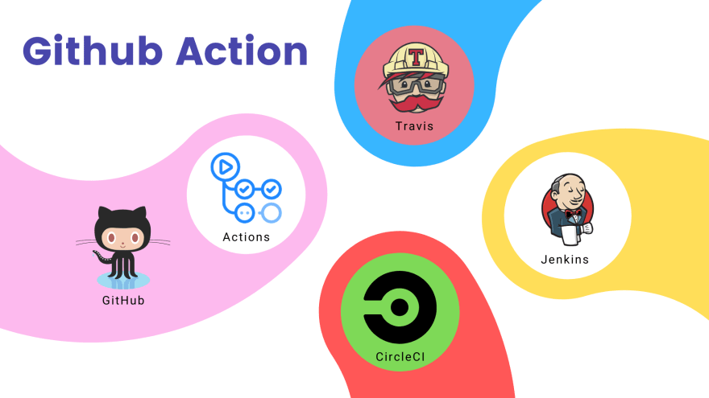

## Рабочий процесс

Чтобы использовать Github Actions, мы должны определить рабочий процесс. Рабочий 
процесс — это, по сути, автоматизированная процедура, состоящая из одного или 
нескольких заданий. Его можно запустить на выполнение тремя различными 
способами:

* По событию, которое происходит в Github репозитории
* Установив повторяющийся график
* Или вручную нажав кнопку запуска рабочего процесса в пользовательском 
  интерфейсе репозитория.
  
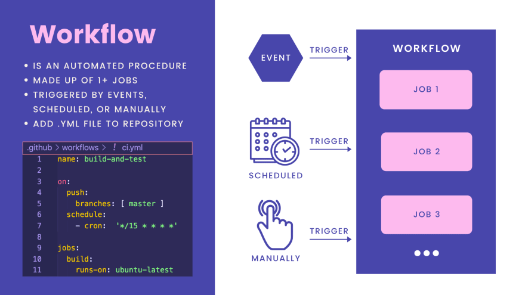

Чтобы создать рабочий процесс, нам просто нужно добавить файл `.yml` в папку 
`.github/workflows` в нашем репозитории. Например, это простой файл рабочего 
процесса `ci.yml`:

```yaml
name: build-and-test

on:
  push:
    branches: [ master ]
  schedule:
    - cron:  '*/15 * * * *'

jobs:
  build:
    runs-on: ubuntu-latest
```

Название этого рабочего процесса — `build-and-test`. Мы можем определить, каким
образом он будет запускаться, используя ключевое слово `on`.

В этом примере запуск рабочего процесса производится по событию, когда изменения 
отправляются в ветку `master`, а также по расписанию каждые 15 минут.

Затем мы определяем список заданий, которые необходимо запустить, в разделе
`jobs` файла `yaml` рабочего процесса.

## Исполнитель

Чтобы запустить задания, мы должны указать исполнителя для каждого из них.
Исполнитель — это просто сервер, который просматривает доступные задания, и 
запускает по одному заданию за раз.

Мы можем использовать исполнитель, находящийся на Github, непосредственно или 
указать применять свой собственный исполнитель.

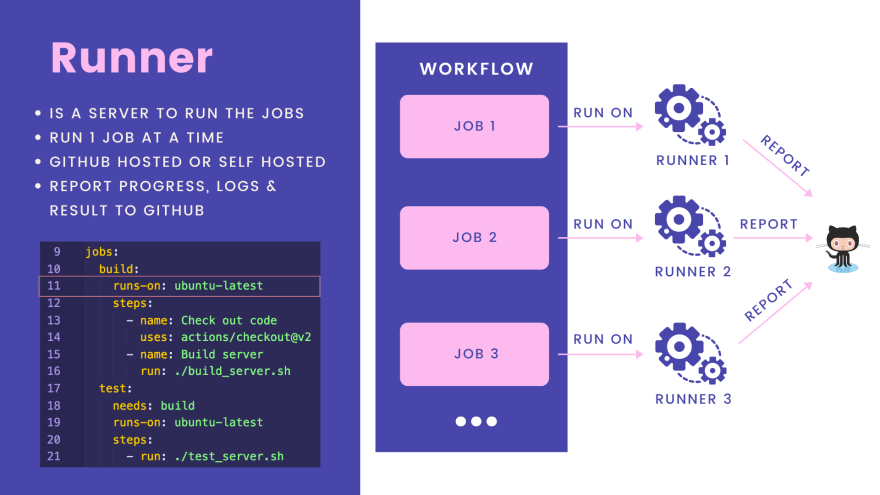

Исполнители будут запускать задания, а затем сообщать о своем ходе выполнения,
логах и результатах обратно в Github, чтобы мы могли легко проверить его
текущее состояние в пользовательском интерфейсе репозитория.

Мы используем ключевое слово `run-on`, чтобы указать исполнителя, который мы 
хотим использовать.

```yaml
jobs:
  build:
    runs-on: ubuntu-latest
```

В этом примере рабочего процесса мы используем расположенный на Github 
исполнитель, на который установлена последняя версия Ubuntu.

## Задания

Теперь поговорим о **Заданиях**. Задание — это последовательность шагов, 
которые будут выполняться на одном и том же исполнителе.

Обычно все задания в рабочем процессе выполняются параллельно, за исключением 
случаев, когда некоторые задания зависят друг от друга, тогда они будут 
выполняться последовательно.

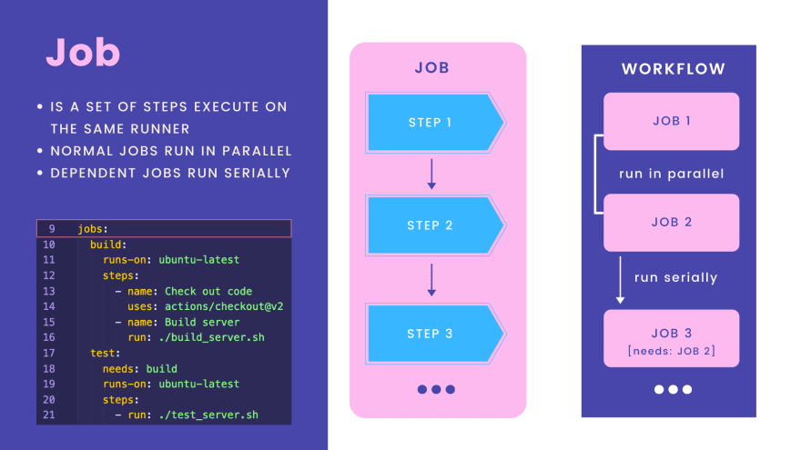

Задания перечисляются внутри рабочего процесса под ключевым словом `jobs`.

```yaml
jobs:
  build:
    runs-on: ubuntu-latest
    steps:
      - name: Check out code
        uses: actions/checkout@v2
      - name: Build server
        run: ./build_server.sh
  test:
    needs: build
    runs-on: ubuntu-latest
    steps:
      - run: ./test_server.sh
```

В этом примере у нас существует 2 задания:

* Первое — `build` (сборка), состоящая из двух шагов: проверка кода и сборка сервера.
* Второе задание — `test` (тест), которое будет запускать тесты приложения.

Здесь мы используем ключевое слово `need`, чтобы указать, что задание `test`
зависит от задания `build`, поэтому его можно запустить только после того, как 
наше приложение будет успешно создано.

Это задание `test` содержит только 1 шаг, на котором выполняется сценарий 
`test_server.sh`.

## Шаги

Шаги — это отдельные задачи, которые выполняются последовательно одна за 
другой внутри задания. Шаг может содержать одно или несколько действий.

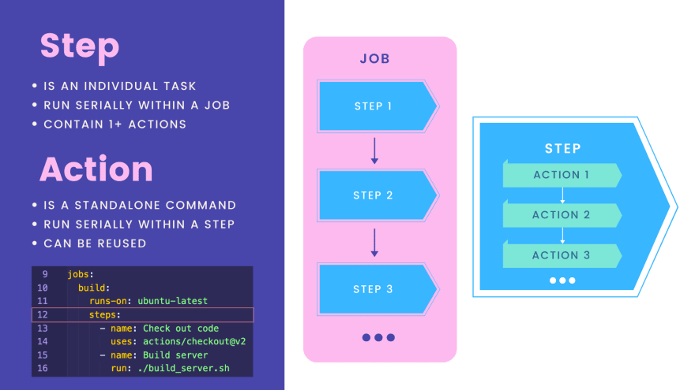

Действие — это, по сути, отдельная команда, подобная той, которая запускает 
сценарий `test_server.sh`, показанный выше. Если шаг содержит несколько 
действий, они будут выполняться последовательно.

Интересной особенностью действия является то, что его можно использовать 
повторно. Поэтому, если кто-то уже написал нужное нам действие на Github, мы 
можем использовать его в нашем рабочем процессе.

Давайте посмотрим на этот пример.

```yaml
jobs:
  build:
    runs-on: ubuntu-latest
    steps:
      - name: Check out code
        uses: actions/checkout@v2
      - name: Build server
        run: ./build_server.sh
```

Здесь мы используем ключевое слово `steps`, чтобы перечислить все шаги, которые 
мы хотим выполнить в нашем задании.

Первый шаг — загрузить код с Github на нашу машину-исполнитель. Для этого мы 
просто используем действие Github `checkout@v2`, которое уже было написано 
командой Github, отвечающей за действия.

Второй шаг — создать наш сервер с приложением. В этом случае мы используем своё
собственное действие, которое просто запускает скрипт `build_server.sh`, 
созданный нами в репозитории.

Вот и все!

## Заключение

Прежде чем перейти к написанию кода, давайте подведем краткие итоги:

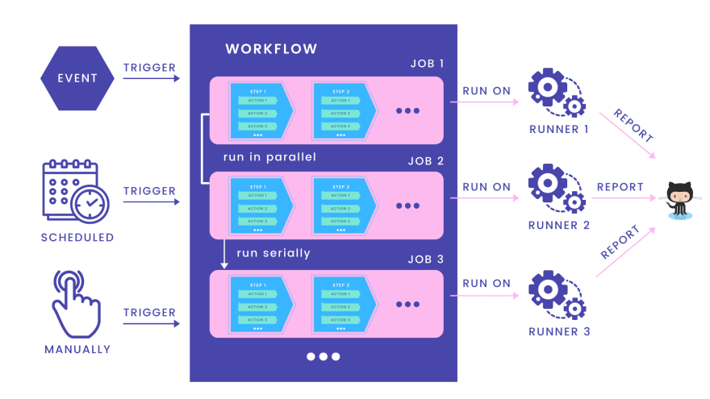

* Мы можем запустить рабочий процесс тремя способами: по событию, по расписанию 
  или вручную.
* Рабочий процесс состоит из одного или нескольких заданий.
* Задание состоит из нескольких шагов.
* Каждый шаг может содержать одно или несколько действий.
* Все задания внутри рабочего процесса обычно выполняются параллельно, если 
  только они не зависят друг от друга, то в этом случае они выполняются 
  последовательно.
* Каждое задание будет выполняться отдельно конкретным исполнителем.
* Исполнители будут сообщать о прогрессе, логах и результатах заданий обратно в 
  Github. И мы можем просмотреть их прямо в пользовательском интерфейсе
  Github репозитория.
  
## Настраиваем рабочий процесс для Golang и Postgres

Хорошо, теперь давайте узнаем, как настроить реальный рабочий процесс для 
нашего приложения Golang, чтобы оно могло подключаться к Postgres и запускать 
все unit тесты, которые мы написали в предыдущих лекциях, всякий раз, когда 
новые изменения отправляются на Github.

## Используем шаблонный рабочий процесс

В нашем [репозитории приложения simple bank](https://github.com/techschool/simplebank) на Github выберем вкладку **Actions**.

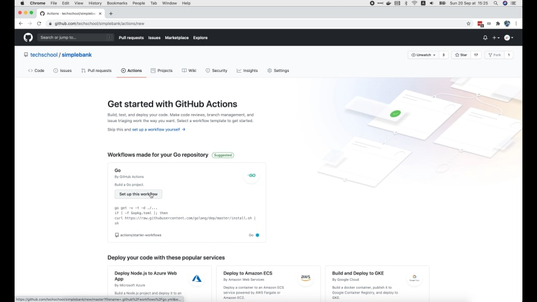

Github знает, что наш проект написан в основном на `Go`, поэтому предлагает 
настроить рабочий процесс для `Go`. Давайте нажмем эту кнопку настройки.

Как видите, создается новый файл `go.yml` в папке `.github/workflows` нашего 
репозитория, используя следующий шаблон:

```yaml
name: Go

on:
  push:
    branches: [ master ]
  pull_request:
    branches: [ master ]

jobs:

  build:
    name: Build
    runs-on: ubuntu-latest
    steps:

    - name: Set up Go 1.x
      uses: actions/setup-go@v2
      with:
        go-version: ^1.13
      id: go

    - name: Check out code into the Go module directory
      uses: actions/checkout@v2

    - name: Get dependencies
      run: |
        go get -v -t -d ./...
        if [ -f Gopkg.toml ]; then
            curl https://raw.githubusercontent.com/golang/dep/master/install.sh | sh
            dep ensure
        fi

    - name: Build
      run: go build -v .

    - name: Test
      run: go test -v .
```

Мы можем редактировать этот файл непосредственно здесь, используя 
редактор Github. Однако я предпочитаю сначала добавить файл в наш локальный 
репозиторий, а затем отредактировать его локально с помощью Visual Studio Code
перед отправкой обратно на Github.

## Создаём файл yaml рабочего процесса

Итак, давайте откроем папку нашего простого банковского приложения в 
терминале. Я собираюсь создать новую папку `.github/workflows`.

```shell
❯ cd ~/Projects/techschool/simplebank
❯ mkdir -p .github/workflows
```

Затем создайте новый файл Yaml для нашего рабочего процесса внутри этой папки. 
Вы можете назвать его как хотите, просто убедитесь, что он имеет расширение 
`yml`. Я буду использовать название `ci.yml` для простоты.

```shell
❯ touch .github/workflows/ci.yml 
```

Теперь давайте откроем этот проект в Visual Studio Code.

Там мы увидим файл `ci.yml` в папке `.github/workflows`. Вернемся на Github и 
скопируем содержимое файла `go.yml`, а затем вставим его в наш файл `ci.yml`.

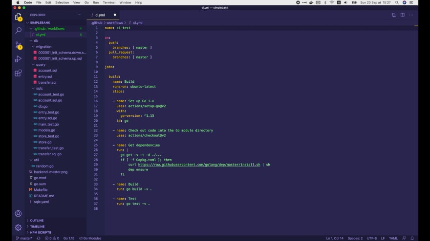

Сначала нам нужно задать имя для этого рабочего процесса, например: 
`ci-test`. Это имя будет отображаться на странице `Actions` нашего Github 
репозитория.

```yaml
name: ci-test
```

## Настраиваем события, при которых происходит запуск рабочего процесса

Затем мы определяем события, которые могут запускать этот рабочий процесс. 
Обычно мы хотели бы запускать тесты всякий раз, когда в ветку `master` 
отправляются изменения или когда есть запрос на слияние с веткой `master`.

```yaml
on:
  push:
    branches: [ master ]
  pull_request:
    branches: [ master ]
```

Существует много других событий, которые вы можете использовать. Пожалуйста, 
воспользуйтесь [документацией Github Actions](https://docs.github.com/en/free-pro-team@latest/actions/reference/events-that-trigger-workflows), 
чтобы узнать о них больше.

## Настраиваем задания

Далее мы настроим задания. В этом шаблоне, который нам предоставляет Github, 
у нас существует только одно задание.

Оно называется `build` и запускается с помощью исполнителя, на котором 
установлена Ubuntu. Я думаю, нам следует переименовать это задание в `test`, 
потому что это его основная цель.

```yaml
jobs:

  test:
    name: Test
    runs-on: ubuntu-latest
```

Это задание состоит из нескольких шагов.

* Шаг 1: Установить Go
  Первый шаг — настроить или установить Go на исполнителе. На этом этапе нам 
  просто нужно использовать существующее действие Github с именем `setup-go@v2`.
  
```yaml
    steps:

    - name: Set up Go 1.x
    uses: actions/setup-go@v2
    with:
        go-version: ^1.15
    id: go
```

  Мы используем ключевое слово `with`, чтобы передать входные параметры в это 
  действие. В этом конкретном случае мы можем попросить его использовать 
  определенную версию Go, например версию `1.15`.
  Поле id — это просто уникальный идентификатор этого шага. Нам оно может 
  понадобиться, если мы хотим обратиться к этому шагу в другом месте.
* Шаг 2. Загрузить код 
  Второй шаг — загрузить код этого репозитория в исполнитель. Для этого мы 
  также повторно используем существующее действие: `checkout@v2`.
  
```yaml
    - name: Check out code into the Go module directory
    uses: actions/checkout@v2
```

* Шаг 3: Установить зависимости
  Следующим шагом будет установка всех зависимостей или внешних пакетов, 
  которые использует наш проект.
  
```yaml
    - name: Get dependencies
    run: |
        go get -v -t -d ./...
        if [ -f Gopkg.toml ]; then
            curl https://raw.githubusercontent.com/golang/dep/master/install.sh | sh
            dep ensure
        fi
```

  На самом деле нам не нужен этот шаг, потому что `go mod` автоматически загрузит 
  недостающие библиотеки, когда мы собираем приложение или запускаем тесты. Так 
  что давайте его удалим!
  Шаг `build` также не нужен, потому что приложение будет собрано автоматически, 
  когда мы запустим тесты.
  
```yaml
    - name: Build
    run: go build -v .
```

* Шаг 4: Запустить тесты
  Итак, последний оставшийся шаг — запустить наши unit тесты. Для этой цели у 
  нас уже есть команда `make test`, определенная в Makefile. Поэтому все, что 
  нам нужно сделать на этом шаге, это вызвать её:
  
```yaml
    - name: Test
    run: make test
```

## Оправляем файл на Github

Итак, мы закончили с первой базовой версией нашего CI рабочего процесса:

```yaml
name: ci-test

on:
  push:
    branches: [ master ]
  pull_request:
    branches: [ master ]

jobs:

  test:
    name: Test
    runs-on: ubuntu-latest

    steps:

    - name: Set up Go 1.x
      uses: actions/setup-go@v2
      with:
        go-version: ^1.15
      id: go

    - name: Check out code into the Go module directory
      uses: actions/checkout@v2

    - name: Test
      run: make test
```

Он может не работать, потому что мы не настроили базу данных Postgres. Но 
давайте просто отправим файл на Github, чтобы посмотреть, как это всё работает:

```shell
❯ git status
❯ git add .
❯ git commit -m "init CI workflow"
```

Здесь мы сначала запускаем `git status`, чтобы проверить состояние нашего 
локального репозитория. После этого запускаем `git add .`, чтобы добавить все 
новые изменения в наш коммит.

Затем выполняем `git commit` с сообщением об инициализации CI рабочего 
процесса, чтобы зафиксировать его в нашем локальном репозитории. И, наконец, 
мы запускаем `git push origin master`, чтобы отправить это изменение в наш 
удаленный репозиторий на **Github**.

Теперь вернемся на страницу **Github** репозитория и выберем вкладку **Actions**.

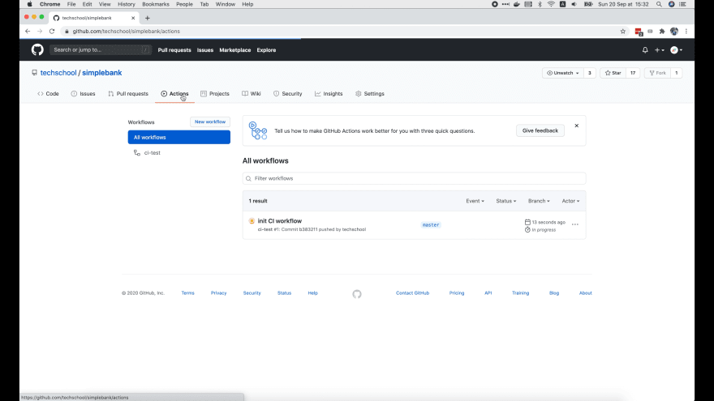

Теперь мы видим здесь файл с нашим рабочим процессом `ci-test` и его новый запуск
после нашего коммита. Когда мы открываем его, то видим, что выполняется первое 
задание: `Test`.

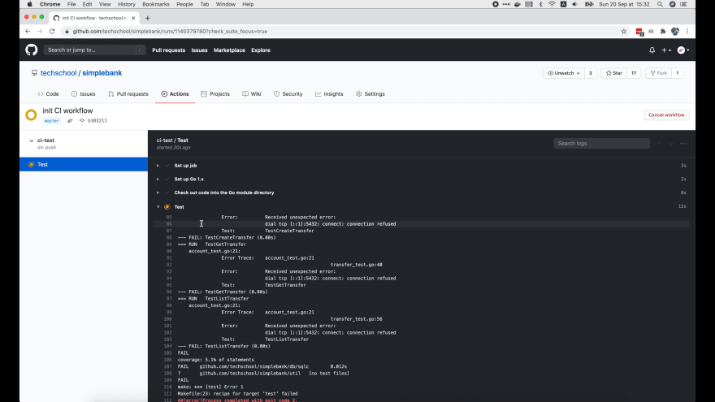

Все шаги перечислены справа. Шаги `Setup job`, `Setup Go` и `Checkout` завершены 
успешно, потому что перед ними стоит зеленая галочка. Шаг `Test` все еще 
выполняется, потому что перед ним стоит желтый кружок.

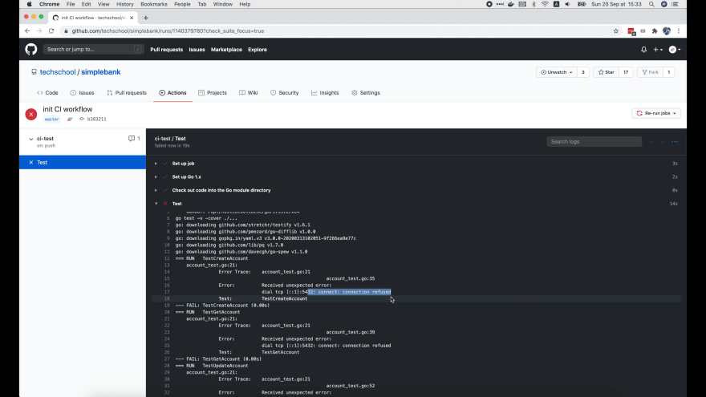

Шаг `Test` в конце концов завершается, но неудачно. Мы понимаем это из-за 
красного значка `x` рядом с ним.

Этого следовало ожидать, поскольку как мы видим в логах, код не может 
подключиться к порту `5432` Postgres, так как мы еще не настроили его в нашем 
рабочем процессе. Итак, давайте сделаем это сейчас!

## Добавляем сервис Postgres 

Давайте поищем информацию по ключевым словам `github action postgres` и 
откроем [официальную страницу документации Github Action](https://docs.github.com/en/free-pro-team@latest/actions/guides/creating-postgresql-service-containers) о создании сервисных 
контейнеров Postgres.

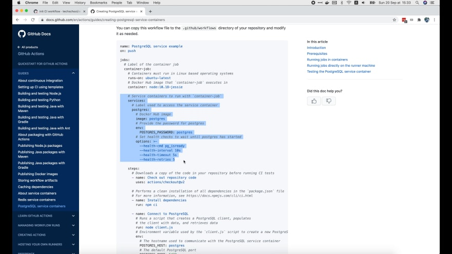

Здесь, в этом разделе, мы видим, что Postgres объявлен как внешний сервис для
этого задания. Давайте скопируем этот блок кода и вставим его в наш файл 
рабочего процесса.

Итак, мы используем ключевое слово `services`, чтобы указать список внешних 
сервисов, которые мы хотим запускать вместе с нашим заданием. В этом случае нам 
нужен только один сервис — Postgres.

А поскольку в нашем проекте мы используем Postgres версии 12, давайте поменяем 
имя этого docker образа на `postgres:12`. Вы можете просмотреть доступные версии 
и теги этого образа Postgres на [Docker Hub](https://hub.docker.com/_/postgres).

```yaml
    services:
      postgres:
        image: postgres:12
        env:
          POSTGRES_USER: root
          POSTGRES_PASSWORD: secret
          POSTGRES_DB: simple_bank
        options: >-
          --health-cmd pg_isready
          --health-interval 10s
          --health-timeout 5s
          --health-retries 5
```

Далее мы настроим некоторые переменные окружения для доступа к базе данных.

Если вы еще помните, мы используем `user = «root»`, `password = «secret»` и 
`database = «simple_bank»` в нашем локальном контейнере Postgres. Итак, давайте 
установим здесь такое же значение для нашего CI рабочего процесса.

Параметр проверки работоспособности (health check) очень важен, потому что он 
используется исполнителем для проверки успешного запуска **Postgres**, чтобы 
знать, когда можно выполнять следующие шаги рабочего процесса.

Это здорово, потому что мы хотим, чтобы наши тесты запускались только после 
запуска **Postgres**. В противном случае тесты все равно не пройдут, потому что он 
не сможет подключиться к базе данных, не так ли?

## Добавляем шаг для запуска миграций

Хорошо, теперь сервис Postgres определен, но для успешного выполнения наших 
тестов нам также необходимо выполнить миграцию базы данных, чтобы создать 
правильную схему базы данных для нашего приложения.

Итак, давайте определим новый шаг здесь, после шага проверки кода. Он будет 
называться «Run migrations» (Выполнить миграции). И единственное действие, 
которое он будет сделать — запускать `make migrateup`.

```yaml
      - name: Run migrations
      run: make migrateup
```

Хорошо, теперь давайте попробуем отправить эти новые изменения рабочего 
процесса на Github, чтобы посмотреть, что произойдет.

Итак, теперь на странице «Actions» нашего репозитория мы можем увидеть новый 
запуск для нашего нового коммита. Здесь задание `Test` все еще выполняется. 
Оно настроено успешно, и теперь инициализирует контейнеры.

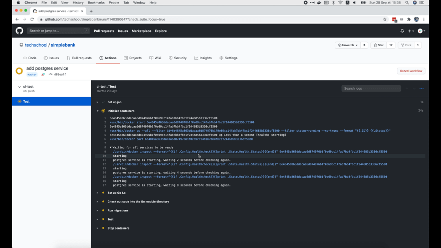

Из логов мы видим, что задание все еще ожидает готовности сервиса Postgres. Как 
только Postgres запущен, все последующие шаги выполняются немедленно.

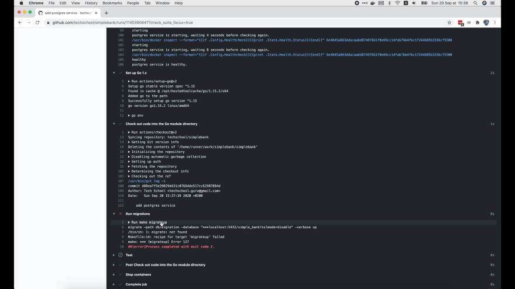

На рисунке мы видим лог, в котором говорится, что 
`Postgres service is healthy` (сервис Postgres работоспособен). Шаг Setup Go 
также выполнен успешно. Затем он проверяет новый код.

Теперь шаг миграции завершается ошибкой, потому что команда migrate не 
найдена. Мы забыли установить golang-migrate, работающий через командную строку, 
для запуска миграции.

## Устанавливаем golang-migrate, работающий через командную строку

Итак, давайте поищем по ключевым словам `golang migrate` в браузере и откроем 
эту [Github страницу с документацией](https://github.com/golang-migrate/migrate/tree/master/cmd/migrate).

Доступно несколько вариантов в зависимости от используемой ОС. Мы используем 
Ubuntu в нашем исполнителе, поэтому я собираюсь скопировать эту команду `curl`, 
чтобы загрузить предварительно созданный двоичный файл `golang migrate`.

```shell
❯ curl -L https://github.com/golang-migrate/migrate/releases/download/$version/migrate.$platform-amd64.tar.gz | tar xvz
```

Теперь давайте добавим в рабочий процесс новый шаг установки `golang migrate`. 
Затем в `run` части, давайте вставим curl команду.

Мы должны указать правильный URL-адрес для версии golang-migrate, работающей 
через командную строку и платформы, которую мы хотим использовать. Итак, 
давайте нажмем на эту [ссылку для загрузки правильной версии](https://github.com/golang-migrate/migrate/releases).

Последняя версия - `4.12.2`. И поскольку на нашем исполнителе стоит Ubuntu - разновидность
Linux, давайте скопируем адрес ссылки `migrate.linux-amd64.tar.gz`, а затем 
вставим его в нашу curl команду.

```yaml
      - name: Install golang-migrate
      run: curl -L https://github.com/golang-migrate/migrate/releases/download/v4.12.2/migrate.linux-amd64.tar.gz | tar xvz
```

Команда загрузит zip-файл и разархивирует его, после чего у нас будет
двоичный файл `golang migrate` под названием migrate.linux-amd64. Теперь, чтобы 
команда миграции работала, мы должны переместить этот двоичный файл в папку 
`/usr/bin`.

Таким образом, этот шаг будет включать в себя не только одну curl команду. Мы
используем этот символ вертикальной черты |, чтобы указать, что команда является
многострочной. Давайте добавим эту команду перемещения к шагу:

```yaml
      - name: Install golang-migrate
      run: |
        curl -L https://github.com/golang-migrate/migrate/releases/download/v4.12.2/migrate.linux-amd64.tar.gz | tar xvz
        sudo mv migrate.linux-amd64 /usr/bin/
        which migrate
```

Обратите внимание, что только суперпользователь может изменить содержимое 
папки `/usr/bin`, поэтому мы должны запустить эту команду с помощью `sudo`.

Мы также добавляем еще одну команду: `which migrate`, чтобы проверить, успешно 
ли установлен двоичный файл CLI миграции и готов ли он к использованию в 
исполнителе или нет.

Теперь давайте зафиксируем новое изменение нашего рабочего процесса и отправим 
его на **Github**. Затем перейдите на страницу Actions нашего репозитория.

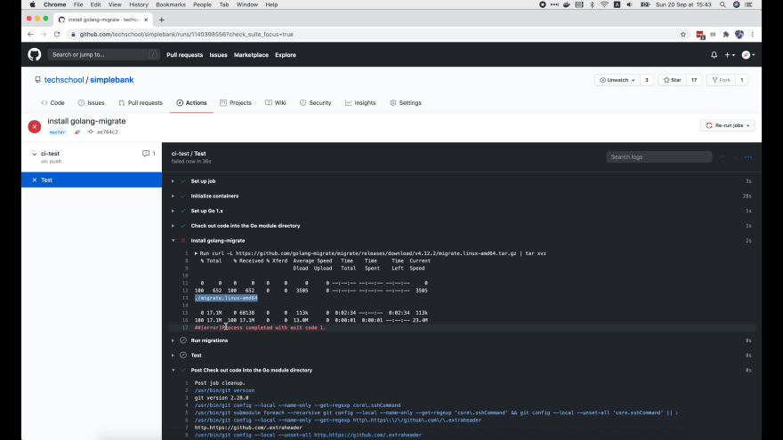

Задание по-прежнему не выполняется, но на этот раз оно завершается ошибкой на 
шаге `Install golang-migrate`.

Из логов можно сказать, что бинарный файл был успешно скачан. Таким образом, 
сбой мог произойти из-за команды `move` или команды `which migrate`.

Я понял почему возникла ошибка! Мы просто перемещаем файл `migrate.linux-amd64` 
в `/usr/bin`, но не переименовываем его в `migrate`. Поэтому, когда мы 
запускаем `which migrate`, она не может найти ни одного двоичного файла с таким 
именем.

Все, что нам нужно сделать сейчас, это добавить migrate в конец команды `move`, 
чтобы двоичный файл был перемещен в `/usr/bin` с новым именем: `migrate`.

```yaml
      - name: Install golang-migrate
      run: |
        curl -L https://github.com/golang-migrate/migrate/releases/download/v4.12.2/migrate.linux-amd64.tar.gz | tar xvz
        sudo mv migrate.linux-amd64 /usr/bin/migrate
        which migrate
```

Это гарантирует, что при выполнении команды `make migrateup` будет использоваться 
правильный двоичный файл `migrate`, работающий через командную строку.

Хорошо, давайте добавим это новое изменение, зафиксируем его и отправим на 
Github. Затем вернёмся на страницу Action нашего репозитория, чтобы проверить 
статус задания.

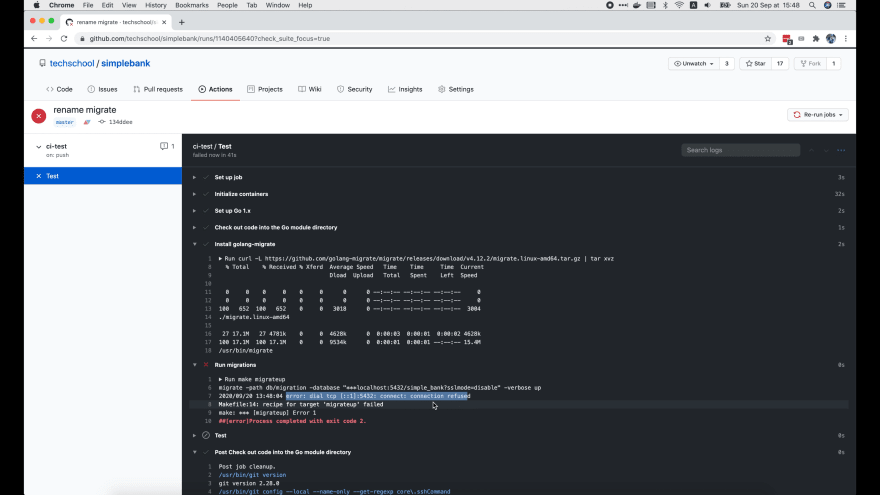

Оно всё ещё завершается ошибкой. Однако на этот раз шаг `Install golang-migrate` 
выполнен успешно. Ошибка возникла на шаге - `Run migrations`.

И причина в том, что исполнитель всё ещё не может подключиться к порту `5432` нашего 
контейнера Postgres. Почему? Мы же уже добавили **Postgres** в список сервисов?

Да, но мы еще не открыли его локальный порт внешнему хосту. Вот почему наш код 
до сих пор не может подключиться к порту.

## Добавляем сопоставление портов в Postgres сервис

Мы можем использовать ключевое слово `ports`, чтобы указать порты, которые мы 
хотим открыть для внешнего хоста, точно так же, как мы обычно делаем в нашем 
файле docker-compose. Давайте добавим его в наш CI рабочий процесс.

```yaml
    services:
      postgres:
        image: postgres:12
        env:
          POSTGRES_USER: root
          POSTGRES_PASSWORD: secret
          POSTGRES_DB: simple_bank
        ports:
          - 5432:5432
        options: >-
          --health-cmd pg_isready
          --health-interval 10s
          --health-timeout 5s
          --health-retries 5
```

Порт Postgres по умолчанию `5432` теперь доступен нашему исполнителю заданий.

Давайте добавим это новое изменение, зафиксируем его и отправим его на 
Github. Надеюсь, на этот раз всё получится.

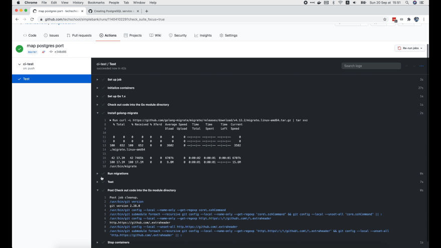

Задание успешно выполнено! Все галочки зелёные. Итак, наконец, наш CI рабочий 
процесс для теста выполняется успешно.

После того, как все шаги в нашем рабочем процессе завершены, Github выполняет 
некоторые шаги по очистке и останавливает контейнеры.

Вот и все! Мы узнали о непрерывной интеграции, написав наш первый рабочий 
процесс Github Action для запуска unit тестов Golang, которым необходимо 
подключиться к внешней службе Postgres.

Ниже приведён весь файл рабочего процесса `.github/workflows/ci.yml`:

```yaml
name: ci-test

on:
  push:
    branches: [ master ]
  pull_request:
    branches: [ master ]

jobs:

  test:
    name: Test
    runs-on: ubuntu-latest

    services:
      postgres:
        image: postgres:12
        env:
          POSTGRES_USER: root
          POSTGRES_PASSWORD: secret
          POSTGRES_DB: simple_bank
        ports:
          - 5432:5432
        options: >-
          --health-cmd pg_isready
          --health-interval 10s
          --health-timeout 5s
          --health-retries 5

    steps:

    - name: Set up Go 1.x
      uses: actions/setup-go@v2
      with:
        go-version: ^1.15
      id: go

    - name: Check out code into the Go module directory
      uses: actions/checkout@v2

    - name: Install golang-migrate
      run: |
        curl -L https://github.com/golang-migrate/migrate/releases/download/v4.12.2/migrate.linux-amd64.tar.gz | tar xvz
        sudo mv migrate.linux-amd64 /usr/bin/migrate
        which migrate

    - name: Run migrations
      run: make migrateup

    - name: Test
      run: make test
```

Это далеко не все возможности Github Action. Я рекомендую вам ознакомиться с 
[официальной документацией](https://docs.github.com/en/free-pro-team@latest/actions), 
чтобы узнать о них больше.

И на этом я хочу закончить сегодняшнюю лекцию. Большое спасибо за время, 
потраченное на чтение, и увидимся на следующей лекции!