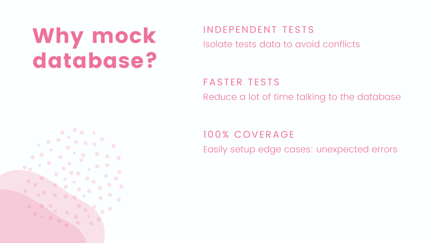

# Имитируем работу БД для тестирования HTTP API в Go и достижения 100% покрытия

[Оригинал](https://dev.to/techschoolguru/mock-db-for-testing-http-api-in-go-and-achieve-100-coverage-4pa9)

Если у вас возникают проблемы, связанные с изоляцией данных при unit тестировании,
для избежания конфликтов, подумайте о фиктивной реализации базе данных! В этой статье мы 
узнаем, как использовать [Gomock](https://github.com/golang/mock) для создания 
заглушек интерфейса БД, что поможет нам писать unit тесты API быстрее, понятнее и 
легко достигать 100% покрытия.

Ниже:
* Ссылка на [плейлист с видео лекциями на Youtube](https://bit.ly/backendmaster)
* И на [Github репозиторий](https://github.com/techschool/simplebank)

## Зачем имитировать работу БД

В предыдущих лекциях мы узнали, как реализовать RESTful HTTP API в Go. Когда 
дело доходит до тестирования этих API, кто-то захочет использовать подключение 
к реальной базе данных, в то время как другие могут предпочесть просто 
имитировать работу с ней. Итак, какой подход мы должны использовать?



Ну, я бы сказал, что всё зависит от вас. Но я считаю имитацию лучшим подходом 
по следующим причинам:

* Во-первых, это облегчает нам написание независимых тесты, потому что каждый 
  тест будет использовать свою собственную отдельную имитацию БД для хранения 
  данных, поэтому между ними не будет конфликтов. Если вы используете 
  настоящую БД, все тесты будут считывать и записывать данные в одно и то же 
  место, поэтому будет сложнее избежать конфликтов, особенно в большом проекте 
  с большой кодовой базой.
* Во-вторых, наши тесты будут работать намного быстрее, поскольку им не нужно 
  тратить время на взаимодействие с БД и ожидание выполнения запросов. Все 
  действия будут выполняться в памяти и внутри одного и того же процесса.
* Третья и очень важная причина имитации работы БД: это позволяет нам писать 
  тесты, которые достигают 100% покрытия. Имитируя БД, мы можем легко 
  настроить и протестировать некоторые граничные случаи, такие как 
  непредвиденная ошибка или потеря соединения, чего было бы невозможно 
  достичь, если бы мы использовали настоящую БД.

Хорошо, это звучит здорово. Но достаточно ли будет протестировать 
наш API, используя только имитацию БД? Можем ли мы быть уверены, что наш код 
по-прежнему будут работать правильно, когда он подключиться к настоящей 
БД?


Да, конечно! Потому что наш код, который взаимодействует с настоящей БД, уже 
был тщательно протестирован в [предыдущей лекции](https://dev.to/techschoolguru/write-go-unit-tests-for-db-crud-with-random-data-53no).

Итак, все, что нам нужно сделать: убедиться, что имитация БД реализует тот 
же интерфейс, что и реальная БД. Тогда все будет работать нормально при переходе
от имитации к реальной БД.

## Как имитировать БД

Существует два способа имитации работы БД.

Первый — реализовать фиктивную БД, которая хранит данные в памяти. Если вы 
проходили мой [курс по gRPC](https://dev.to/techschoolguru/implement-unary-grpc-api-in-go-4cdj),
то наверняка уже знаете об этом.


Например, тут у нас есть интерфейс `Store`, определяющий список действий, которые 
мы можем выполнять с реальной БД.

Затем мы создаём структуру `MemStore` для работы с фиктивной БД, которая 
реализует все действия интерфейса `Store`, но использует карту для 
чтения и записи данных.

Этот подход с использованием фиктивной базы данных очень прост и легко 
реализуем. Однако это требует от нас написания гораздо большего количества 
кода, который будет использоваться только для тестирования, что требует 
много времени как для разработки, так и для последующего обслуживания.

Итак, сегодня я покажу вам лучший способ имитировать работу БД, который использует 
**заглушки** вместо **фиктивной** БД.

Идея заключается в том, чтобы использовать пакет [Gomock](https://github.com/golang/mock) 
для генерации и создания заглушек, возвращающие жестко закодированные 
значения для каждого случая, который мы хотим протестировать.


В этом примере Gomock уже сгенерировал для нас `MockStore`. Итак, всё, что 
нам нужно сделать, это вызвать его функцию EXPECT() для создания заглушки, 
которая сообщает Gomock, что функция `GetAccount()` должна вызываться ровно 
1 раз, используя в качестве входной переменной идентификатор счёта
`accountID`, и возвращать объект `account` в качестве результата.

Вот и все! После настройки заглушки мы можем просто использовать этот 
фиктивный `Store` для тестирования API.

Не волнуйтесь, если вы не до конца понимаете это прямо сейчас. Давайте 
перейдем к написанию кода, чтобы увидеть, как это работает на самом деле!

## Устанавливаем Gomock

Во-первых, нам нужно установить Gomock. Давайте откроем браузер и осуществим
поиск по ключевому слову `Gomock`. Затем откройте его [страницу на Github](https://github.com/golang/mock).

Скопируйте эту команду `go get` и запустите ее в терминале, чтобы установить 
пакет:

```shell
❯ go get github.com/golang/mock/mockgen@v1.4.4
```

После этого бинарный файл `mockgen` будет доступен в папке `go/bin`.

```shell
❯ ls -l ~/go/bin
total 341344
...
-rwxr-xr-x  1 quangpham  staff  10440388 Oct 17 18:27 gotests
-rwxr-xr-x  1 quangpham  staff   8914560 Oct 17 18:27 guru
-rwxr-xr-x  1 quangpham  staff   5797544 Oct 17 18:27 impl
-rwxr-xr-x  1 quangpham  staff   7477056 Nov  2 09:21 mockgen
```

Мы будем использовать этот инструмент для создания имитации базы данных, 
поэтому важно убедиться, что он может выполняться из любого места. Мы 
проверим это, запустив:

```shell
❯ which mockgen
mockgen not found
```

Здесь написано, что `mockgen` не найден. Это потому, что папка `go/bin` в 
данный момент отсутствует в переменной окружения `PATH`.

Чтобы добавить его в `PATH`, я отредактирую файл `.zshrc`, так как я использую 
`zsh`. Если вы используете оболочку `bash`, вместо этого вам следует 
отредактировать файл `.bash_profile` или `.bashrc`.

```shell
❯ vi ~/.zshrc
```

Я использую vim, поэтому давайте нажмем i, чтобы войти в режим вставки. Затем 
добавьте эту команду экспорта в начало файла:

```shell
export PATH=$PATH:~/go/bin
```

Нажмите `Esc`, чтобы выйти из режима вставки, затем `:wq`, чтобы сохранить файл 
и выйти из vim.

Затем мы должны запустить команду `source`, чтобы перезагрузить файл 
`.zshrc`:

```shell
❯ source ~/.zshrc
```

Теперь, если мы снова запустим `which mockgen`, то увидим, что он теперь 
доступен в папке `go/bin`.

```shell
❯ which mockgen
/Users/quangpham/go/bin/mockgen
```

Обратите внимание, что файл `.zshrc` будет автоматически загружен при запуске 
нового окна терминала. Поэтому нам не нужно запускать команду `source` каждый 
раз, когда мы открываем терминал.

## Определяем интерфейс Store

Хорошо, теперь, чтобы использовать `mockgen` для создания фиктивной БД, нам 
нужно немного обновить наш код.

На данный момент в файле `api/server.go` функция `NewServer()` принимает 
объект `db.Store`:

```go
type Server struct {
    store  *db.Store
    router *gin.Engine
}

func NewServer(store *db.Store) *Server {
    ...
}
```

Этот `db.Store` определен в файле `db/sqlc/store.go`. Это структура, которая 
всегда будет подключаться к реальной базе данных:

```go
type Store struct {
    db *sql.DB
    *Queries
}
```

Поэтому, чтобы использовать фиктивную БД в тестах API сервера, мы должны 
заменить этот объект `Store` интерфейсом. Я продублирую определение этой 
структуры `Store` и изменю ее тип на `interface`.

```go
type Store interface {
    // TODO: добавить функции в этот интерфейс
}

type SQLStore struct {
    db *sql.DB
    *Queries
}
```

Затем старую структуру `Store` переименуем в `SQLStore`. Это будет реальная 
реализация интерфейса `Store`, которая взаимодействует с SQL базой данных, в 
данном случае c PostgreSQL.

Тогда функция `NewStore()` должна возвращать не указатель, а только 
интерфейс `Store`. И внутри она должна вернуть реальную реализацию 
интерфейса БД, то есть `SQLStore`.

```go
func NewStore(db *sql.DB) Store {
    return &SQLStore{
        db:      db,
        Queries: New(db),
    }
}
```

Мы также должны изменить тип переменной `store` метода `execTx()` и 
метода `TransferTx()` на `*SQLStore` следующим образом:

```go
func (store *SQLStore) execTx(ctx context.Context, fn func(*Queries) error) error {
    ...
}

func (store *SQLStore) TransferTx(ctx context.Context, arg TransferTxParams) (TransferTxResult, error) {
}
```

Хорошо, теперь нам нужно определить список действий, которым должен 
удовлетворять интерфейс `Store`.

По сути, он должен иметь все функции структуры `Queries` и еще одну функцию 
для выполнения транзакции, связанной с переводом денег.

Итак, сначала я скопирую сигнатуру этой функции `TransferTx()` и вставлю ее в 
интерфейс `Store`:

```go
type Store interface {
    TransferTx(ctx context.Context, arg TransferTxParams) (TransferTxResult, error)
}
```

Для функций структуры `Queries`, конечно, мы можем сделать то же самое, 
например, просмотреть их все и скопировать-вставить одну за другой. Однако 
это займет слишком много времени, потому что эта структура может содержать 
множество функций.

К счастью для нас, пакет [sqlc](https://github.com/kyleconroy/sqlc), который 
мы использовали для [генерации CRUD кода](https://dev.to/techschoolguru/generate-crud-golang-code-from-sql-and-compare-db-sql-gorm-sqlx-sqlc-560j), 
также может создавать интерфейс, содержащий все функции структуры `Queries`.

Все, что нам нужно сделать, это изменить этот параметр `emit_interface` в 
файле `sqlc.yaml` на `true`:

```yaml
version: "1"
packages:
  - name: "db"
    path: "./db/sqlc"
    queries: "./db/query/"
    schema: "./db/migration/"
    engine: "postgresql"
    emit_json_tags: true
    emit_prepared_queries: false
    emit_interface: true
    emit_exact_table_names: false
    emit_empty_slices: true
```

Затем запустите эту команду в терминале, чтобы повторно сгенерировать код:

```shell
❯ make sqlc
```

После этого в папке `db/sqlc` мы увидим новый файл с названием `querier.go`. Он 
содержит сгенерированный интерфейс `Querier` со всеми функциями для вставки и 
извлечения данных из базы данных:

```go
type Querier interface {
    AddAccountBalance(ctx context.Context, arg AddAccountBalanceParams) (Account, error)
    CreateAccount(ctx context.Context, arg CreateAccountParams) (Account, error)
    CreateEntry(ctx context.Context, arg CreateEntryParams) (Entry, error)
    CreateTransfer(ctx context.Context, arg CreateTransferParams) (Transfer, error)
    DeleteAccount(ctx context.Context, id int64) error
    GetAccount(ctx context.Context, id int64) (Account, error)
    GetAccountForUpdate(ctx context.Context, id int64) (Account, error)
    GetEntry(ctx context.Context, id int64) (Entry, error)
    GetTransfer(ctx context.Context, id int64) (Transfer, error)
    ListAccounts(ctx context.Context, arg ListAccountsParams) ([]Account, error)
    ListEntries(ctx context.Context, arg ListEntriesParams) ([]Entry, error)
    ListTransfers(ctx context.Context, arg ListTransfersParams) ([]Transfer, error)
    UpdateAccount(ctx context.Context, arg UpdateAccountParams) (Account, error)
}

var _ Querier = (*Queries)(nil)
```

И здесь вы видите, что объявляется пустую переменную `var _ Querier`, чтобы 
гарантировать, что структура `Queries` будет реализовывать все функции этого 
интерфейса `Querier`.

Теперь нам нужно просто встроить этот `Querier` в интерфейс `Store`. Это 
позволило бы интерфейсу `Store` иметь все свои функции в дополнение к 
функции `TransferTx()`, которую мы добавили ранее:

```go
type Store interface {
    Querier
    TransferTx(ctx context.Context, arg TransferTxParams) (TransferTxResult, error)
}
```

Затем вернёмся к файлу `api/server.go` и удалить `*` из типа 
`*db.Store`, потому что это больше не указатель на структуру, а интерфейс:

```go
func NewServer(store db.Store) *Server {
    ...
}
```

Обратите внимание: хотя мы изменили тип `Store` со `struct` на `interface`, 
наш код по-прежнему будет работать, и нам не нужно ничего менять в файле 
`main.go`, поскольку функция `db.NewStore()` теперь также возвращает
интерфейс `Store` с фактической реализацией `SQLStore`, которая подключается 
к реальной базе данных SQL.

```go
func main() {
    config, err := util.LoadConfig(".")
    if err != nil {
        log.Fatal("cannot load config:", err)
    }

    conn, err := sql.Open(config.DBDriver, config.DBSource)
    if err != nil {
        log.Fatal("cannot connect to db:", err)
    }

    store := db.NewStore(conn)
    server := api.NewServer(store)

    err = server.Start(config.ServerAddress)
    if err != nil {
        log.Fatal("cannot start server:", err)
    }
}
```

## Генерируем имитацию БД

Итак, теперь, когда у нас есть интерфейс `db.Store`, мы можем использовать 
Gomock для создания его имитации.

Сначала я создам новую папку `mock` внутри пакета `db`. Затем давайте откроем 
терминал и запустим:

```shell
❯ mockgen -help
mockgen has two modes of operation: source and reflect.

Source mode generates mock interfaces from a source file.
It is enabled by using the -source flag. Other flags that
maybe useful in this mode are -imports and -aux_files.
Example:
    mockgen -source=foo.go [other options]

Reflect mode generates mock interfaces by building a program
that uses reflection to understand interfaces. It is enabled
by passing two non-flag arguments: an import path, and a
comma-separated list of symbols.
Example:
    mockgen database/sql/driver Conn,Driver

    -aux_files string
        (source mode) Comma-separated pkg=path pairs of auxiliary Go source files.
    -build_flags string
        (reflect mode) Additional flags for go build.
    -copyright_file string
        Copyright file used to add copyright header
    -debug_parser
        Print out parser results only.
    -destination string
        Output file; defaults to stdout.
    -exec_only string
        (reflect mode) If set, execute this reflection program.
    -imports string
        (source mode) Comma-separated name=path pairs of explicit imports to use.
    -mock_names string
        Comma-separated interfaceName=mockName pairs of explicit mock names to use. Mock names default to 'Mock'+ interfaceName suffix.
    -package string
        Package of the generated code; defaults to the package of the input with a 'mock_' prefix.
    -prog_only
        (reflect mode) Only generate the reflection program; write it to stdout and exit.
    -self_package string
        The full package import path for the generated code. The purpose of this flag is to prevent import cycles in the generated code by trying to include its own package. This can happen if the mock's package is set to one of its inputs (usually the main one) and the output is stdio so mockgen cannot detect the final output package. Setting this flag will then tell mockgen which import to exclude.
  -source string
        (source mode) Input Go source file; enables source mode.
  -version
        Print version.
  -write_package_comment
        Writes package documentation comment (godoc) if true. (default true)
```

`mockgen` позволяет нам генерировать имитации двумя способами. `source mode`
будет генерировать имитационные интерфейсы из одного исходного файла.

Все было бы сложнее, если бы этот исходный файл импортировал пакеты из других 
файлов, что часто бывает, когда мы работаем над реальным проектом.

В этом случае лучше использовать `reflect mode`, где нам нужно указать 
только имя пакета и интерфейс, и пусть `mockgen` использует рефлексию, чтобы 
автоматически понять, что делать.

Итак, я выполню команду:

```shell
❯ mockgen github.com/techschool/simplebank/db/sqlc Store
```

Первый аргумент — это путь импортируемому файлу, в котором находится интерфейс
`Store`. По сути, это простое название модуля банковского приложения 
`github.com/techschool/simplebank`, за которым следует `/db/sqlc`, потому что 
наш интерфейс `Store` определен внутри папки `db/sqlc`.

Второй аргумент, который нам нужно передать этой команде, — это название 
интерфейса, в данном случае `Store`.

Мы также должны указать место, куда будет сгенерирован выходной файл. В 
противном случае `mockgen` по умолчанию будет выдавать сгенерированный 
код в стандартный вывод. Итак, давайте воспользуемся ключом `-destination`, 
чтобы сообщить ему о необходимости записи имитационного кода для `Store` в файл 
`db/mock/store.go`:

```shell
❯ mockgen -destination db/mock/store.go github.com/techschool/simplebank/db/sqlc Store
```

Затем нажмите Enter, чтобы запустить эту команду.

Теперь вернемся в Visual Studio Code. Мы видим, что внутри папки 
`db/mock` создался новый файл `store.go`:

```go
// Code generated by MockGen. DO NOT EDIT.
// Source: github.com/techschool/simplebank/db/sqlc (interfaces: Store)

// Package mock_sqlc is a generated GoMock package.
package mock_sqlc

import (
    context "context"
    gomock "github.com/golang/mock/gomock"
    db "github.com/techschool/simplebank/db/sqlc"
    reflect "reflect"
)

// MockStore is a mock of Store interface
type MockStore struct {
    ctrl     *gomock.Controller
    recorder *MockStoreMockRecorder
}

// MockStoreMockRecorder is the mock recorder for MockStore
type MockStoreMockRecorder struct {
    mock *MockStore
}

// NewMockStore creates a new mock instance
func NewMockStore(ctrl *gomock.Controller) *MockStore {
    mock := &MockStore{ctrl: ctrl}
    mock.recorder = &MockStoreMockRecorder{mock}
    return mock
}

// EXPECT returns an object that allows the caller to indicate expected use
func (m *MockStore) EXPECT() *MockStoreMockRecorder {
    return m.recorder
}

...
```

В этом файле две важные структуры: `MockStore` и `MockStoreMockRecorder`.

`MockStore` — это структура, реализующая все необходимые функции интерфейса 
`Store`. Например, функция `AddAccountBalance()` `MockStore` принимает 
контекст и `AddAccountBalanceParams` в качестве входных данных и возвращает
`Account` и ошибку:

```go
// AddAccountBalance mocks base method
func (m *MockStore) AddAccountBalance(arg0 context.Context, arg1 db.AddAccountBalanceParams) (db.Account, error) {
    m.ctrl.T.Helper()
    ret := m.ctrl.Call(m, "AddAccountBalance", arg0, arg1)
    ret0, _ := ret[0].(db.Account)
    ret1, _ := ret[1].(error)
    return ret0, ret1
}
```

`MockStoreMockRecorder` также содержит функцию с таким же именем и таким же 
количеством аргументов. Однако типы этих аргументов различны. Это просто 
общий тип `interface`:

```go
// AddAccountBalance indicates an expected call of AddAccountBalance
func (mr *MockStoreMockRecorder) AddAccountBalance(arg0, arg1 interface{}) *gomock.Call {
    mr.mock.ctrl.T.Helper()
    return mr.mock.ctrl.RecordCallWithMethodType(mr.mock, "AddAccountBalance", reflect.TypeOf((*MockStore)(nil).AddAccountBalance), arg0, arg1)
}
```

Позже мы увидим, как эта функция используется для создания заглушек. Идея 
такова: мы можем указать, сколько раз должна вызываться функция 
`AddAccountBalance()` и с какими значениями аргументов.

Аналогично генерируются все остальные функции интерфейса `Store`.

Обратите внимание, что текущее название пакета, сгенерированное для нас 
Gomock, — `mock_sqlc` не очень идиоматично, поэтому я хочу изменить его на 
что-то другое, например `mockdb`.

Мы можем указать `mockgen` сделать это с помощью параметра `-package`. Все, 
что нам нужно сделать, это добавить `-package`, а затем `mockdb` к этой 
команде:

```shell
❯ mockgen -package mockdb -destination db/mock/store.go github.com/techschool/simplebank/db/sqlc Store
```

Теперь в коде название пакета было изменено на `mockdb`, как мы и хотели:

```go
// Code generated by MockGen. DO NOT EDIT.
// Source: github.com/techschool/simplebank/db/sqlc (interfaces: Store)

// Package mockdb is a generated GoMock package.
package mockdb

import (
  context "context"
  gomock "github.com/golang/mock/gomock"
  db "github.com/techschool/simplebank/db/sqlc"
  reflect "reflect"
)

// MockStore is a mock of Store interface
type MockStore struct {
  ctrl     *gomock.Controller
  recorder *MockStoreMockRecorder
}

// MockStoreMockRecorder is the mock recorder for MockStore
type MockStoreMockRecorder struct {
  mock *MockStore
}

...
```

Хорошо, прежде чем начать писать тесты API с использованием нового 
сгенерированного `MockStore`, я добавлю новую команду `mock` в `Makefile`, 
чтобы мы могли легко повторно сгенерировать код, когда захотим.

```makefile
...

mock:
    mockgen -package mockdb -destination db/mock/store.go github.com/techschool/simplebank/db/sqlc Store

.PHONY: postgres createdb dropdb migrateup migratedown sqlc test server mock
```

Теперь всякий раз, когда мы хотим повторно сгенерировать имитацию, мы можем 
просто запустить `make mock` в терминале.

## Пишем unit тест для API получения счёта

Хорошо, теперь, когда мы сгенерировали `MockStore`, мы можем начать писать 
тесты для наших API.

Я создам новый файл `account_test.go` внутри пакета `api`.

В нашем приложении есть несколько API для управления банковскими счетами. 
Но для этой лекции мы напишем тесты только для самого важного: API для
получения счёта. Вы можете легко на основе их написать тесты для 
других API, если хотите.

В файле `api/account_test.go` я определю новую функцию `TestGetAccountAPI()` с 
входным параметром `testing.T`.

```go
func TestGetAccountAPI(t *testing.T) {
}
```

Чтобы протестировать этот API, нам сначала нужно иметь счёт. Итак, 
давайте напишем отдельную функцию для создания случайного счёта.

Она вернет объект `db.Account`, где `ID` — это случайное целое число от 1 до 
1000, `Owner` — `util.RandomOwner()`, `Balance` — `util.RandomMoney()`, а
`Currency` — `util.RandomCurrency()`.

```go
func randomAccount() db.Account {
    return db.Account{
        ID:       util.RandomInt(1, 1000),
        Owner:    util.RandomOwner(),
        Balance:  util.RandomMoney(),
        Currency: util.RandomCurrency(),
    }
}
```

Теперь вернемся к тесту и вызовем функцию `randomAccount()` для создания 
нового счёта.

```go
func TestGetAccountAPI(t *testing.T) {
    account := randomAccount()
}
```

Далее нам нужно создать новую имитацию `Store`, используя сгенерированную 
функцию `mockdb.NewMockStore()`. Она ожидает объект `gomock.Controller` в 
качестве входных данных, поэтому мы должны создать этот контроллер, вызвав 
`gomock.NewController` и передав туда объект `testing.T`.

```go
func TestGetAccountAPI(t *testing.T) {
    account := randomAccount()

    ctrl := gomock.NewController(t)
    defer ctrl.Finish()
}
```

Мы должны отложить вызов метода `Finish` этого контроллера. Это очень важно, 
потому что он проверит, были ли вызваны все методы, которые должны 
были быть вызваны.

Мы увидим, как это работает чуть позже. А пока давайте создадим новый
`Store`, вызвав `mockdb.NewMockStore()` с этим контроллером в качестве 
входного параметра.

```go
func TestGetAccountAPI(t *testing.T) {
    account := randomAccount()

    ctrl := gomock.NewController(t)
    defer ctrl.Finish()

    store := mockdb.NewMockStore(ctrl)
}
```

Следующим шагом будет создание заглушек для этой имитации `Store`.
В данном случае нас интересует только метод `GetAccount()`, так как это 
единственный метод, который должен вызываться обработчиком API для 
получения счёта.

Итак, давайте создадим заглушку для этого метода, вызвав 
`store.EXPECT().GetAccount()`. Эта функция ожидает два входных аргумента
типа `interface`.

Почему два входных аргумента? Это связано с тем, что метод `GetAccount()` 
нашего интерфейса `Store` требует два входных параметра: контекст и 
ID счёта.

```go
type Querier interface {
    GetAccount(ctx context.Context, id int64) (Account, error)
    ...
}
```

Таким образом, для определения этой заглушки мы должны указать с какими 
значениями этих двух параметров функция будет вызываться.

Первый аргумент (контекст) может быть любым, поэтому мы используем для 
него значение `gomock.Any()`. Второй аргумент должен равняться идентификатору 
случайной учетной записи, которую мы создали выше. Поэтому мы используем: 
`gomock.Eq()` и передаем ему `account.ID`.

```go
func TestGetAccountAPI(t *testing.T) {
    account := randomAccount()

    ctrl := gomock.NewController(t)
    defer ctrl.Finish()

    store := mockdb.NewMockStore(ctrl)
    store.EXPECT().
        GetAccount(gomock.Any(), gomock.Eq(account.ID)).
        Times(1).
        Return(account, nil)
}
```

Теперь это определение заглушки может прочитать как: я ожидаю, что 
функция `GetAccount()` будет вызываться с любым контекстом и с этим 
конкретным аргументом ID счёта.

Мы также можем указать, сколько раз эта функция должна вызываться с 
помощью `Times()`. Здесь `Times(1)` означает, что мы ожидаем, что эта 
функция будет вызвана ровно один раз.

Более того, мы можем использовать функцию `Return()`, чтобы указать 
Gomock возвращать определенные значения всякий раз, когда вызывается 
функция `GetAccount()`. Например, в этом случае мы хотим, чтобы он 
возвращал объект счёта и `nil` ошибку.

Обратите внимание, что входные аргументы этой функции `Return()` должны 
совпадать с возвращаемыми значениями функции `GetAccount`, как определено 
в интерфейсе `Querier`.

Итак, теперь заглушка для нашей имитации `Store` создана. Мы можем 
использовать её для запуска тестового HTTP-сервера и отправки запроса 
`GetAccount`. Давайте создадим сервер, вызвав функцию `NewServer()` с
имитацией `Store`.

```go
func TestGetAccountAPI(t *testing.T) {
...

    server := NewServer(store)
    recorder := httptest.NewRecorder()
}
```

Для тестирования HTTP API в Go нам не нужно запускать настоящий HTTP 
сервер. Вместо этого мы можем просто использовать функцию записи 
пакета `httptest` для записи ответа на запрос к API. Итак, здесь мы 
вызываем `httptest.NewRecorder()`, чтобы создать новый `ResponseRecorder`.

Далее мы объявим URL-адрес API, который мы хотим вызвать, равный 
`/accounts/{ID счёта, который мы хотим получить}`.

Затем мы создаем новый HTTP запрос с методом `GET` для этого URL-адреса. 
А так как это `GET` запрос, мы можем использовать `nil` для тела запроса.

```go
func TestGetAccountAPI(t *testing.T) {
    ...

    server := NewServer(store)
    recorder := httptest.NewRecorder()

    url := fmt.Sprintf("/accounts/%d", account.ID)
    request, err := http.NewRequest(http.MethodGet, url, nil)
    require.NoError(t, err)
}
```

Эта функция `http.NewRequest` возвращает объект запроса или ошибку. Мы 
проверяем, что не возникло ошибок.

Затем мы вызываем функцию `server.router.ServeHTTP()` с созданными
объектами `recorder` и `request`.

```go
func TestGetAccountAPI(t *testing.T) {
    account := randomAccount()

    ctrl := gomock.NewController(t)
    defer ctrl.Finish()

    store := mockdb.NewMockStore(ctrl)
    store.EXPECT().
        GetAccount(gomock.Any(), gomock.Eq(account.ID)).
        Times(1).
        Return(account, nil)

    server := NewServer(store)
    recorder := httptest.NewRecorder()

    url := fmt.Sprintf("/accounts/%d", account.ID)
    request, err := http.NewRequest(http.MethodGet, url, nil)
    require.NoError(t, err)

    server.router.ServeHTTP(recorder, request)
    require.Equal(t, http.StatusOK, recorder.Code)
}
```

По сути, это отправит наш запрос API через маршрутизатор сервера и 
запишет его ответ в `recorder`. Все, что нам нужно сделать, это 
проверить этот ответ.

Самое простое, что мы можем проверить, это код HTTP состояния. При успешном 
выполнении запроса он должно быть равен `http.StatusOK`. Этот код 
состояния записывается в поле `Code` `recorder`.

Вот и все! Запустим тест.


Он успешно пройден. Отлично!

Теперь я покажу вам, что произойдет, если в функции-обработчике 
`getAccount()` файла `api/account.go` мы не вызовем функцию 
`store.GetAccount`. Давайте закомментируем этот блок кода и просто 
запишем в `account` пустой объект.

```go
func (server *Server) getAccount(ctx *gin.Context) {
    var req getAccountRequest
    if err := ctx.ShouldBindUri(&req); err != nil {
        ctx.JSON(http.StatusBadRequest, errorResponse(err))
        return
    }

    // account, err := server.store.GetAccount(ctx, req.ID)
    // if err != nil {
    //     if err == sql.ErrNoRows {
    //         ctx.JSON(http.StatusNotFound, errorResponse(err))
    //         return
    //     }

    //     ctx.JSON(http.StatusInternalServerError, errorResponse(err))
    //     return
    // }
    account := db.Account{}

    ctx.JSON(http.StatusOK, account)
}
```

Сохраните этот файл и перезапустите unit тест.


На этот раз тест завершился с ошибкой. А причина в отсутствующем вызове 
функции `store.GetAccount`. Мы ожидаем, что эта функция будет вызвана 
ровно один раз, но в реализации она не вызывается.

Итак, теперь вы понимаете всю мощь пакета Gomock. Он упрощает написание 
unit тестов и экономит массу времени на реализацию имитационного интерфейса.

А что, если мы хотим проверить не только код состояния HTTP? Чтобы сделать 
тест более надёжным, мы также должны проверить тело ответа.

Тело ответа хранится в поле `recorder.Body`, которое на самом деле 
является просто указателем на `bytes.Buffer`.

Мы ожидаем, что оно будет соответствовать счёту, который мы создали в 
начале теста. Поэтому для этой цели я напишу новую функцию: 
`requireBodyMatchAccount()`.

Он будет иметь три входных аргумента: `testing.T`, тело ответа — 
указатель на `byte.Buffer` и объект `account`, с которым будет проводиться 
сравнения.

```go
func requireBodyMatchAccount(t *testing.T, body *bytes.Buffer, account db.Account) {
    data, err := ioutil.ReadAll(body)
    require.NoError(t, err)

    var gotAccount db.Account
    err = json.Unmarshal(data, &gotAccount)
    require.NoError(t, err)
    require.Equal(t, account, gotAccount)
}
```

Сначала мы вызываем `ioutil.ReadAll()`, чтобы прочитать все данные из 
тела ответа и сохранить их в переменной `data`. Мы проверяем,
что не возникло ошибок.

Затем мы объявляем новую переменную `gotAccount` для хранения объекта 
типа `db.Account`, полученного из данных тела ответа.

Затем мы вызываем `json.Unmarshal` для преобразования данных в объект 
`gotAccount`. Требуем отсутствия ошибок, а затем, чтобы `gotAccount` 
был равен входному объекту `account`.

На этом всё. Теперь вернемся к модульному тесту и вызовем функцию 
`requireBodyMatchAccount` с `testing.T`, `recorder.Body` и сгенерированным 
счётом в качестве входных аргументов.

```go
func TestGetAccountAPI(t *testing.T) {
    account := randomAccount()

    ctrl := gomock.NewController(t)
    defer ctrl.Finish()

    store := mockdb.NewMockStore(ctrl)
    store.EXPECT().
        GetAccount(gomock.Any(), gomock.Eq(account.ID)).
        Times(1).
        Return(account, nil)

    server := NewServer(store)
    recorder := httptest.NewRecorder()

    url := fmt.Sprintf("/accounts/%d", account.ID)
    request, err := http.NewRequest(http.MethodGet, url, nil)
    require.NoError(t, err)

    server.router.ServeHTTP(recorder, request)
    require.Equal(t, http.StatusOK, recorder.Code)
    requireBodyMatchAccount(t, recorder.Body, account)
}
```

Затем повторно запустите тест.


Он успешно пройден! Превосходно!

Итак, unit тест GetAccount API работает хорошо. Но пока это 
касается только успешного осуществления запроса.

Далее я покажу вам, как преобразовать этот тест в табличный набор 
тестов, чтобы охватить все возможные ситуации, возникающие при выполнении
запроса к API GetAccount и получить 100% покрытие.

## Достигаем 100% покрытия

Во-первых, нам нужно определить список тестовых случаев. Я буду 
использовать анонимный класс для хранения тестовых данных.

Каждый тестовый случай будет иметь уникальное имя, чтобы отличать его 
от других. Затем у него должен быть ID счёта, который мы 
хотим получить.

```go
func TestGetAccountAPI(t *testing.T) {
    account := randomAccount()

    testCases := []struct {
        name          string
        accountID     int64
        buildStubs    func(store *mockdb.MockStore)
        checkResponse func(t *testing.T, recoder *httptest.ResponseRecorder)
    }{
        // TODO: add test data
    }
    ...
}
```

Более того, заглушка GetAccount для каждого случая будет отличаться, 
поэтому здесь у меня есть поле `buildStubs`, которое на самом деле является 
функцией, принимающей на вход имитацию `Store`. Мы можем использовать эту
имитацию `Store` для создания соответствующей заглушки, подходящий под 
каждый тестовый случай.

Точно так же у нас есть функция `checkResponse` для проверки возвращаемых
API результатов. Она имеет два входных аргумента: объект `testing.T` и 
объект `httptest.ResponseRecorder`.

Теперь, используя это определение структуры, давайте добавим первый случай — 
успешное выполнение запроса.

```go
func TestGetAccountAPI(t *testing.T) {
    account := randomAccount()

    testCases := []struct {
        name          string
        accountID     int64
        buildStubs    func(store *mockdb.MockStore)
        checkResponse func(t *testing.T, recoder *httptest.ResponseRecorder)
    }{
        {
            name:      "OK",
            accountID: account.ID,
            buildStubs: func(store *mockdb.MockStore) {
                store.EXPECT().
                    GetAccount(gomock.Any(), gomock.Eq(account.ID)).
                    Times(1).
                    Return(account, nil)
            },
            checkResponse: func(t *testing.T, recorder *httptest.ResponseRecorder) {
                require.Equal(t, http.StatusOK, recorder.Code)
                requireBodyMatchAccount(t, recorder.Body, account)
            },
        },
    }
    ...
}
```

Он будет называться «ОК». ID счёта должен быть равен `account.ID`. Затем я 
скопирую сигнатуру для функции `buildStubs`. Переместите команду `store.EXPECT` в 
эту функцию.

Сделайте то же самое для функции checkResponse. Скопируем её сигнатуру. Затем
переместим в неё две команды `require`.

Позже мы добавим в этот список больше тестовых случаев. А пока давайте немного 
отрефакторим код, чтобы он работал для нескольких случаев.

Мы используем простой цикл `for` для перебора списка тестовых случаев. Затем 
внутри цикла мы объявляем новую переменную `tc` для хранения данных текущего 
теста.

Мы будем запускать каждый случай как отдельный подтест этого unit теста, 
поэтому давайте вызовем функцию `t.Run()`, передадим имя этого тестового 
случая и функцию, которая принимает объект `testing.T` в качестве входных 
данных. Затем я перенесу все эти операторы в эту функцию.

```go
func TestGetAccountAPI(t *testing.T) {
    ...

    for i := range testCases {
        tc := testCases[i]

        t.Run(tc.name, func(t *testing.T) {
            ctrl := gomock.NewController(t)
            defer ctrl.Finish()

            store := mockdb.NewMockStore(ctrl)
            tc.buildStubs(store)

            server := NewServer(store)
            recorder := httptest.NewRecorder()

            url := fmt.Sprintf("/accounts/%d", tc.accountID)
            request, err := http.NewRequest(http.MethodGet, url, nil)
            require.NoError(t, err)

            server.router.ServeHTTP(recorder, request)
            tc.checkResponse(t, recorder)
        })
    }
}
```

Обратите внимание, что `url` должен быть создан с помощью `tc.accountID`, 
чтобы он использовал идентификатор счёта, определенный для каждого 
тестового случая.

Мы вызываем функцию `tc.buildStubs()` с имитацией `Store` перед отправкой 
запроса и, наконец, вызываем функцию `tc.checkResponse()` в конце, чтобы 
проверить результат.

Хорошо, давайте повторно запустим тест, чтобы убедиться, что наш 
случай успешного выполнения запроса все ещё работает.


Ура, он успешно пройден! Итак, пора добавить больше тестовых случаев.

Я продублирую тестовые данные для случая успешного выполнения запроса. Второй
случай, который мы хотим проверить, — это когда счёт не найден. Поэтому он
будет называться «NotFound».

Здесь мы можем использовать тот же `accountID`, потому что 
имитация `Store` создаётся отдельно для каждого тестового случая. Но нам 
нужно немного изменить нашу функцию `buildStubs`.

```go
func TestGetAccountAPI(t *testing.T) {
    account := randomAccount()

    testCases := []struct {
        name          string
        accountID     int64
        buildStubs    func(store *mockdb.MockStore)
        checkResponse func(t *testing.T, recoder *httptest.ResponseRecorder)
    }{
        {
            name:      "OK",
            accountID: account.ID,
            buildStubs: func(store *mockdb.MockStore) {
                store.EXPECT().
                    GetAccount(gomock.Any(), gomock.Eq(account.ID)).
                    Times(1).
                    Return(account, nil)
            },
            checkResponse: func(t *testing.T, recorder *httptest.ResponseRecorder) {
                require.Equal(t, http.StatusOK, recorder.Code)
                requireBodyMatchAccount(t, recorder.Body, account)
            },
        },
        {
            name:      "NotFound",
            accountID: account.ID,
            buildStubs: func(store *mockdb.MockStore) {
                store.EXPECT().
                    GetAccount(gomock.Any(), gomock.Eq(account.ID)).
                    Times(1).
                    Return(db.Account{}, sql.ErrNoRows)
            },
            checkResponse: func(t *testing.T, recorder *httptest.ResponseRecorder) {
                require.Equal(t, http.StatusNotFound, recorder.Code)
            },
        },
    }

    ...
}
```

Здесь вместо того, чтобы возвращать конкретный счёт мы должны вернуть пустой 
объект `Account{}` вместе с ошибкой `sql.ErrNoRows`. Это связано с тем, что в 
реальной реализации `Store`, который подключается к Postgres, пакет `db/sql` 
вернет эту ошибку, если при выполнении запроса `SELECT` не будет найдена 
запись.

Мы также должны изменить функцию `checkResponse`, потому что в этом случае 
мы ожидаем, что вместо этого сервер вернет `http.StatusNotFound`. А поскольку 
запись не найдена, мы можем удалить вызов `requireBodyMatchAccount`.

Хорошо, давайте снова запустим тест.


Превосходно! Оба теста успешно пройдены.

Давайте запустим тест всего пакета, чтобы увидеть покрытие кода.


В файле `account.go` мы видим, что этот обработчик `getAccount` не покрыт 
на 100%.

На данный момент покрыты только случай, когда запись не найдена, и случай 
успешного выполнения запроса. Нам осталось протестировать еще два случая: 
`InternalServerError` и `BadRequest`.

Еще раз скопирую данные теста и изменю его название на `«InternalError»`.

```go
func TestGetAccountAPI(t *testing.T) {
    account := randomAccount()

    testCases := []struct {
        name          string
        accountID     int64
        buildStubs    func(store *mockdb.MockStore)
        checkResponse func(t *testing.T, recoder *httptest.ResponseRecorder)
    }{
        ...
        {
            name:      "InternalError",
            accountID: account.ID,
            buildStubs: func(store *mockdb.MockStore) {
                store.EXPECT().
                    GetAccount(gomock.Any(), gomock.Eq(account.ID)).
                    Times(1).
                    Return(db.Account{}, sql.ErrConnDone)
            },
            checkResponse: func(t *testing.T, recorder *httptest.ResponseRecorder) {
                require.Equal(t, http.StatusInternalServerError, recorder.Code)
            },
        },
    }

    ...
}
```

Теперь в функции `buildStubs` вместо возврата `sql.ErrNoRows` я возвращаю 
`sql.ErrConnDone`, что, по сути, является одной из возможных ошибок, отдаваемой 
пакетом `db/sql`, когда запрос выполняется для соединения, которое уже было 
возвращено в пул соединений.

В этом случае это следует считать внутренней ошибкой, поэтому в функции 
`checkResponse` мы должны потребовать, чтобы `recorder.Code` был равен 
`http.StatusInternalServerError`.

Давайте перезапустим пакетный тест.


Все тесты успешно пройдены. И теперь мы видим, что ветвь `InternalServerError` 
в коде теперь покрыта.

Последний случай, который мы должны протестировать, это `BadRequest`, что 
означает, что клиент отправил некоторые недопустимые параметры в этот API.

Итак, я вернусь к файлу теста, скопирую эти данные теста еще раз, 
изменю название на `InvalidID` и изменю этот `accountID` на 0, что является 
недопустимым значением, поскольку минимальный идентификатор должен быть 
равен 1.

В этом случае мы должны изменить второй параметр вызова функции `GetAccount` 
на `gomock.Any()`.

```go
func TestGetAccountAPI(t *testing.T) {
    account := randomAccount()

    testCases := []struct {
        name          string
        accountID     int64
        buildStubs    func(store *mockdb.MockStore)
        checkResponse func(t *testing.T, recoder *httptest.ResponseRecorder)
    }{
        ...
        {
            name:      "InvalidID",
            accountID: 0,
            buildStubs: func(store *mockdb.MockStore) {
                store.EXPECT().
                    GetAccount(gomock.Any(), gomock.Any()).
                    Times(0)
            },
            checkResponse: func(t *testing.T, recorder *httptest.ResponseRecorder) {
                require.Equal(t, http.StatusBadRequest, recorder.Code)
            },
        },
    }

    ...
}
```

А поскольку ID неправильный, функция `GetAccount` не должна вызываться 
обработчиком. Следовательно, мы должны изменить `Times(1)` на `Times(0)` и 
удалить вызов функции `Return`.

Для проверки ответа мы должны изменить код состояния на `http.StatusBadRequest`.

На этом всё. Давайте перезапустим тесты всего пакета!


Все они успешно пройдены. Здорово! И глядя на код обработчика `getAccount`, мы 
видим, что он покрыт на 100%. Итак, наша цель достигнута!

Однако лог тестов в настоящее время содержит слишком много информации.


Существует множество повторяющихся логов отладки, написанных [Gin](https://github.com/gin-gonic/gin), что 
затрудняет чтение результатов теста.

Причина в том, что Gin по умолчанию работает в режиме `Debug`. Итак, давайте 
создадим новый файл `main_test.go` внутри пакета `api` и настроим Gin 
использовать режим `Test`.

Содержимое этого файла будет очень похоже на содержимое файла `main_test.go` 
в пакете `db`, поэтому я скопирую оттуда функцию `TestMain` и вставлю ее в наш 
новый файл. Затем удалим все команды внутри этой функции, кроме последней.

Теперь все, что нам нужно сделать, это вызвать `gin.SetMode`, чтобы изменить 
его на `gin.TestMode`.

```go
func TestMain(m *testing.M) {
    gin.SetMode(gin.TestMode)
    os.Exit(m.Run())
}
```

Вот и всё! Всё готово. Теперь вернемся к нашему файлу с тестами и запустим 
тесты всего пакета.


Все тесты успешно пройдены. И теперь логи выглядят намного чище и легче 
читаются, чем раньше.

## Заключение

Итак, сегодня мы узнали, как использовать Gomock для создания имитации 
нашего интерфейса БД и использовать его для написания unit тестов для API 
Get Account, чтобы достичь 100% покрытия. Это действительно помогает нам 
писать тесты быстрее, проще, чище, безопаснее и намного надежнее.

Вы можете применить эти знания для написания тестов для других HTTP API в 
нашем простом банковском приложении, например, `Create Account` или `Delete 
Account` API.

Я отправлю код на [Github](https://github.com/techschool/simplebank/blob/master/api/account_test.go), чтобы у вас была ссылка на образец, если вы захотите 
на него взглянуть.

Большое спасибо за время, потраченное на чтение, и до скорой встречи на 
следующей лекции.