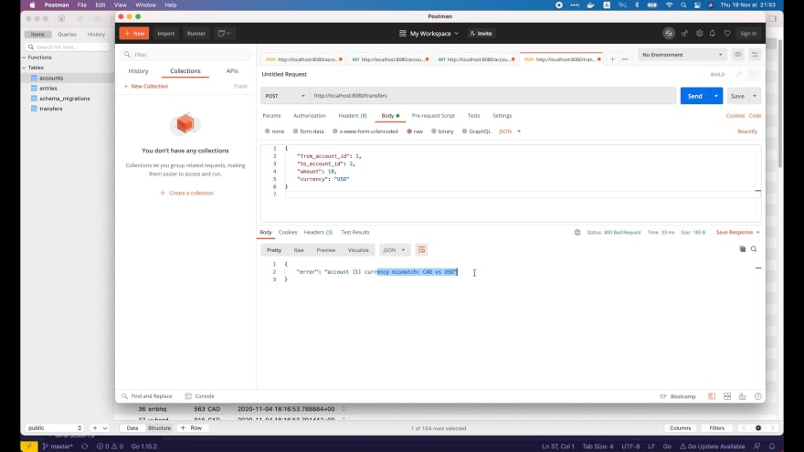

# Реализуем API перевода денег со своим пользовательским валидатором параметров в Go

[Оригинал](https://dev.to/techschoolguru/implement-transfer-money-api-with-a-custom-params-validator-in-go-2op2)

В предыдущих лекциях мы внедрили и протестировали HTTP API для управления 
счетами для нашего простого банковского приложения.

Сегодня мы еще немного попрактикуемся, реализовав самый важный API нашего 
приложения: `transfer money API` (API для перевода денег).

При этом я покажу вам, как написать свой собственный, пользовательский валидатор 
для проверки входных параметров этого API.

Ниже:
* Ссылка на [плейлист с видео лекциями на Youtube](https://bit.ly/backendmaster)
* И на [Github репозиторий](https://github.com/techschool/simplebank)

## Реализуем обработчик API для перевода денег

Сначала я создам новый файл `transfer.go` внутри пакета `api`. Реализация API 
для перевода денег будет очень похожа на API для создания счёта.

Структуру для хранения входных параметров этого API назовём `transferRequest`. 
В ней будет несколько полей:

```go
type transferRequest struct {
    FromAccountID int64  `json:"from_account_id" binding:"required,min=1"`
    ToAccountID   int64  `json:"to_account_id" binding:"required,min=1"`
    Amount        int64  `json:"amount" binding:"required,gt=0"`
    Currency      string `json:"currency" binding:"required,oneof=USD EUR CAD"`
}
```

* `FromAccountID` типа `int64` — это ID счёта, на который уходят деньги. Это 
  поле является обязательным, и его минимальное значение должно быть равно 1.
* Точно так же `ToAccountID`, также тип `int64`, является ID счёта, на который 
  поступают деньги.
* Затем у нас есть поле «Сумма» для хранения суммы перевода между двумя 
  счётами. Для простоты здесь я просто использую целочисленный тип. Но на 
  самом деле это может быть вещественное число, в зависимости от валюты. Поэтому 
  вы должны помнить об этом и выбирать подходящий тип для своих данных. Это 
  поле также является обязательным и должно быть больше 0.
* Последнее поле — `Currency` — тип валюты, которую мы используем для перевода. 
  На данный момент мы разрешаем использовать только `USD`, `EUR` or `CAD`. И 
  обратите внимание, что эта валюта должна совпадать с валютой обоих аккаунтов. 
  Мы проверим это в функции-обработчике API.

Хорошо, название функции-обработчика будет `createTransfer`. И тип переменной 
запроса должен быть `transferRequest`.

Мы свяжем входные параметры с объектом запроса и возвращаем 
`http.StatusBadRequest` клиенту, если какой-либо из параметров не пройдёт 
валидацию.

```go
func (server *Server) createTransfer(ctx *gin.Context) {
    var req transferRequest
    if err := ctx.ShouldBindJSON(&req); err != nil {
        ctx.JSON(http.StatusBadRequest, errorResponse(err))
        return
    }

    arg := db.TransferTxParams{
        FromAccountID: req.FromAccountID,
        ToAccountID:   req.ToAccountID,
        Amount:        req.Amount,
    }

    result, err := server.store.TransferTx(ctx, arg)
    if err != nil {
        ctx.JSON(http.StatusInternalServerError, errorResponse(err))
        return
    }

    ctx.JSON(http.StatusOK, result)
}
```

Затем нам нужно создать объект `db.TransferTxParam`, где `FromAccountID` — это 
`request.fromAccountID`, `ToAccountID` — это `request.toAccountID`, а `Amount` — 
это `request.Amount`.

Используя этот аргумент, мы вызываем `server.store.TransferTx()` для 
выполнения транзакции перевода денег. Эта функция вернет объект `TransferTxResult` 
или ошибку. В конце нам просто нужно вернуть этот результат клиенту, если 
ошибок не возникло.

Итак, этот обработчик для создания перевода почти готов, за исключением того, 
что мы не учли последний входной параметр: `request.Currency`.

Что нам нужно сделать, так это сравнить эту валюту с валютой `fromAccountID` и
`ToAccountID`, чтобы убедиться, что они все одинаковы. Для этого я собираюсь 
определить новую функцию с названием `validAccount()` для структуры `Server`.

Эта функция проверит, действительно ли существует счёт с определенным 
ID, и что её валюта соответствует входной валюте. Следовательно, у неё 
будет три входных аргумента: `gin.Context`, `accountID` и строка `currency`. 
И она вернет значение типа `bool`.

```go
func (server *Server) validAccount(ctx *gin.Context, accountID int64, currency string) bool {
    account, err := server.store.GetAccount(ctx, accountID)
    if err != nil {
        if err == sql.ErrNoRows {
            ctx.JSON(http.StatusNotFound, errorResponse(err))
            return false
        }

        ctx.JSON(http.StatusInternalServerError, errorResponse(err))
        return false
    }

    if account.Currency != currency {
        err := fmt.Errorf("account [%d] currency mismatch: %s vs %s", account.ID, account.Currency, currency)
        ctx.JSON(http.StatusBadRequest, errorResponse(err))
        return false
    }

    return true
}
```

Сначала мы вызываем `server.store.GetAccount()`, чтобы извлечь счёт из базы 
данных. Эта функция вернет объект `account` или ошибку. Если ошибка не равна
nil, то возможны две ситуации:

* Первая ситуация — когда записи не существует, мы отправляем клиенту 
  `http.StatusNotFound` и возвращаем `false`.
* Вторая ситуация — это когда возникают неожиданные ошибки, поэтому мы просто 
  отправляем `http.StatusInternalServerError` и возвращаем `false`.

В противном случае, если ошибки нет, мы проверим, совпадает ли валюта счета с 
входной валютой или нет. Если не совпадает, выдаём новую ошибку: несоответствие 
с валютой счета. Затем мы вызываем `ctx.JSON()` с `http.StatusBadRequest`, 
чтобы отправить этот ответ об ошибке клиенту и вернуть `false`.

Наконец, если всё прошло нормально, счёт существует и его валюта совпадает с
входной, мы возвращаем `true` в конце этой функции.

Теперь вернемся к обработчику `createTransfer`.

```go
func (server *Server) createTransfer(ctx *gin.Context) {
    var req transferRequest
    if err := ctx.ShouldBindJSON(&req); err != nil {
        ctx.JSON(http.StatusBadRequest, errorResponse(err))
        return
    }

    if !server.validAccount(ctx, req.FromAccountID, req.Currency) {
        return
    }

    if !server.validAccount(ctx, req.ToAccountID, req.Currency) {
        return
    }

    arg := db.TransferTxParams{
        FromAccountID: req.FromAccountID,
        ToAccountID:   req.ToAccountID,
        Amount:        req.Amount,
    }

    result, err := server.store.TransferTx(ctx, arg)
    if err != nil {
        ctx.JSON(http.StatusInternalServerError, errorResponse(err))
        return
    }

    ctx.JSON(http.StatusOK, result)
}
```

Мы вызываем `server.validAccount()`, чтобы проверить правильность 
`request.fromAccountID` и `currency`. Если проверка возвращает `false`, то 
мы просто немедленно выходим из функции. Мы делаем то же самое для 
`request.toAccountID`.

Вот и все! Обработчик `createTransfer` готов. Затем мы должны зарегистрировать 
новый API на сервере для маршрутизации запросов к этому обработчику.

## Регистрируем маршрут к API для перевода денег

Откроем файл `api/server.go`.

Я скопирую строчку с `router.POST` API для создания счёта. Затем измените путь 
на `/transfers` и название обработчика на `server.createTransfer`.

```go
func NewServer(store db.Store) *Server {
    server := &Server{store: store}
    router := gin.Default()

    router.POST("/accounts", server.createAccount)
    router.GET("/accounts/:id", server.getAccount)
    router.GET("/accounts", server.listAccounts)
    router.POST("/transfers", server.createTransfer)

    server.router = router
    return server
}
```

Это всё что нужно сделать. Откроем терминал и выполним команду:

```shell
❯ make server
```

## Тестируем API для перевода денег

Затем я собираюсь использовать [Postman](https://www.postman.com/) для 
тестирования нового API денежных переводов.

Давайте создадим новый запрос с методом `POST` и URL-адресом 
`http://localhost:8080/transfers`.

Для тела запроса давайте выберем raw и формат JSON. Я буду использовать 
такое тело JSON в качестве примера:

```json
{
    "from_account_id": 1,
    "to_account_id": 2,
    "amount": 10,
    "currency": "USD"
}
```

Идентификатор `fromAccount` равен `1`, идентификатор `toAccount` равен `2`, сумма 
равна `10`, а валюта — `USD`.

Давайте откроем [TablePlus](https://tableplus.com/), чтобы увидеть чему равны 
текущие значения для этих двух записей.


Здесь мы видим, что их валюты разные. Валюта счёта с ID `2` — `USD`, а валюта 
счета с ID `1` — `CAD`.

Поэтому, если мы отправим этот запрос к API, мы получим ошибку несоответствия 
валюты для счёта с ID `1`.



Чтобы этого не произошло я изменю валюту счёта с ID `1` на `USD` в TablePlus. 
Сохраню запись и вернусь в Postman, чтобы послать запрос ещё раз.


На этот раз запрос выполнен успешно.

```json
{
    "transfer": {
        "id": 110,
        "from_account_id": 1,
        "to_account_id": 2,
        "amount": 10,
        "created_at": "2020-12-07T19:57:09.61222Z"
    },
    "from_account": {
        "id": 1,
        "owner": "ojkelz",
        "balance": 734,
        "currency": "USD",
        "created_at": "2020-11-28T15:22:13.419691Z"
    },
    "to_account": {
        "id": 2,
        "owner": "ygmlfb",
        "balance": 824,
        "currency": "USD",
        "created_at": "2020-11-28T15:22:13.435304Z"
    },
    "from_entry": {
        "id": 171,
        "account_id": 1,
        "amount": -10,
        "created_at": "2020-12-07T19:57:09.61222Z"
    },
    "to_entry": {
        "id": 172,
        "account_id": 2,
        "amount": 10,
        "created_at": "2020-12-07T19:57:09.61222Z"
    }
}
```

И в ответе у нас есть запись о переводе с ID 110 со счёта `1` на счет `2` и 
суммой `10`. Новый баланс счета `1` составляет `734 USD`. В то время как на 
счете `2` - `824 USD`.

Давайте проверим записи из базы данных в `TablePlus`. Перед транзакцией 
исходные значения балансов счета `1` и счета `2` составляли `744` и `814 USD`.

Когда я нажимаю команду R, чтобы обновить данные, мы видим, что баланс счета 
`1` уменьшился на `10`, а баланс счета `2` увеличился на `10`.


Более того, в ответе мы также видим 2 объекта из таблицы `entries`:

* Первая запись информирует о том, что `10 USD` были вычтены со счёта `1`.
* А вторая запись — что `10 USD` были добавлены на счёт `2`.

Эти две записи находятся в конце таблицы `entries` в базе данных. Аналогично 
запись о переводе денег расположена в нижней части таблицы `transfers`, 
которая соответствует объекту `transfer`, возвращаемому в ответе JSON.

Итак, API для передачи отлично работает. Но я бы хотел показать вам ещё 
кое-что.

## Реализуем свой собственный, пользовательский валидатор для валюты

Сейчас в правиле проверки валюты мы жестко запрограммировали три константы для
USD, EUR и CAD.

```go
type transferRequest struct {
    FromAccountID int64  `json:"from_account_id" binding:"required,min=1"`
    ToAccountID   int64  `json:"to_account_id" binding:"required,min=1"`
    Amount        int64  `json:"amount" binding:"required,gt=0"`
    Currency      string `json:"currency" binding:"required,oneof=USD EUR CAD"`
}
```

Что, если в будущем мы захотим поддерживать 100 различных типов валюты? Было 
бы очень трудно прочитать и легко ошибиться, если бы мы поместили 100 
значений валюты в этот дескриптор `oneof`.

Кроме того, может возникать дублирование кода, потому что параметр `currency` 
может появляться во многих разных API. На данный момент у нас уже есть один 
дубль в запросе на создание счёта.

```go
type createAccountRequest struct {
    Owner    string `json:"owner" binding:"required"`
    Currency string `json:"currency" binding:"required,oneof=USD EUR CAD"`
}
```

Чтобы этого избежать, я покажу вам, как написать свой собственный валидатор для 
поля `currency`.

Давайте создадим новый файл `validator.go` внутри папки `api`. Затем объявите 
новую переменную `validCurrency` типа `validator.Func`.

```go
package api

import (
    "github.com/go-playground/validator/v10"
    "github.com/techschool/simplebank/util"
)

var validCurrency validator.Func = func(fieldLevel validator.FieldLevel) bool {
    if currency, ok := fieldLevel.Field().Interface().(string); ok {
        return util.IsSupportedCurrency(currency)
    }
    return false
}
```

Visual Studio Code автоматически импортировал для нас пакет [validator](https://github.com/go-playground/validator).
Однако мы должны добавить `/v10` в конце этого пути импорта, потому что мы
хотим использовать 10 версию этого пакета.

По сути, `validator.Func` — это функция, которая принимает интерфейс 
`validator.FieldLevel` в качестве входных данных и возвращает `true`, когда 
проверка проходит успешно. Это интерфейс содержит всю информацию и 
вспомогательные функции для проверки поля.

Что нам нужно сделать, так это вызвать `fieldLevel.Field()`, чтобы получить 
значение поля. Обратите внимание, что это рефлексия, поэтому мы 
должны вызвать `.Interface()`, чтобы получить его значение в виде `interface{}`. 
Затем мы пытаемся преобразовать это значение в строку.

Преобразование вернет строку `currency` и логическое значение `ok`. Если 
`ok` равно `true`, то `currency` является допустимой строкой. В этом случае 
нам нужно будет проверить, поддерживается ли эта валюта. В противном случае, 
если `ok` равно `false`, то поле не является строкой. Поэтому мы просто 
возвращаем `false`.

Хорошо, теперь я создам новый файл `currency.go` внутри пакета `util`. Мы 
реализуем функцию `IsSupportedCurrency()`, чтобы проверить, поддерживается 
ли валюта нашим приложением, в этом файле.

Сначала я объявлю некоторые константы для валют, которые мы хотим 
поддерживать в нашем приложении. Пока допустим, что мы поддерживаем только
`USD`, `EUR` and `CAD`. Мы всегда можем добавить больше валют в будущем, 
если захотим.

Затем давайте напишем новую функцию `IsSupportedCurrency()`, которая 
принимает строку `currency` в качестве входных данных и возвращает 
значение типа `bool`. Она вернет `true`, если валюта, подаваемая на вход,
поддерживается, и `false` в противном случае.

```go
package util

// Константы для всех поддерживаемых валю
const (
	USD = "USD"
	EUR = "EUR"
	CAD = "CAD"
)

// IsSupportedCurrency возвращает true, если валюта поддерживается
func IsSupportedCurrency(currency string) bool {
	switch currency {
	case USD, EUR, CAD:
		return true
	}
	return false
}
```

В этой функции мы просто используем простой оператор `switch case`. Если 
выбрана валюта `USD`, `EUR` или `CAD`, мы возвращаем `true`. В противном 
случае - `false`.

Вот и все! Наш свой собственный, пользовательский валидатор `validCurrency` 
готов. Затем мы должны зарегистрировать этот пользовательский валидатор в 
[Gin](https://github.com/gin-gonic/gin).

## Регистрируем свой собственный валидатор валюты

Откроем файл `server.go`.

```go
package api

import (
    "github.com/gin-gonic/gin"
    "github.com/gin-gonic/gin/binding"
    "github.com/go-playground/validator/v10"
)

func NewServer(store db.Store) *Server {
    server := &Server{store: store}
    router := gin.Default()

    if v, ok := binding.Validator.Engine().(*validator.Validate); ok {
        v.RegisterValidation("currency", validCurrency)
    }

    router.POST("/accounts", server.createAccount)
    router.GET("/accounts/:id", server.getAccount)
    router.GET("/accounts", server.listAccounts)

    router.POST("/transfers", server.createTransfer)

    server.router = router
    return server
}
```

Здесь, после создания Gin `router`, мы вызываем `binding.Validator.Engine()`, 
чтобы получить текущий движок валидации, который использует Gin 
(`binding` — это подпакет Gin).

Обратите внимание, что эта функция вернет обобщенный интерфейсный тип, которым 
по умолчанию является указатель на объект валидатора пакета 
`go-playground/validator/v10`.

Итак, здесь мы должны преобразовать результат, возвращаемый функцией, в 
указатель объекта `validator.Validate`. Если все в порядке, мы можем 
вызвать `v.RegisterValidation()`, чтобы зарегистрировать нашу собственную, 
пользовательскую функцию валидации.

Первый аргумент — это название дескриптора: `currency`. А вторым аргументом 
должна быть функция `validCurrency`, которую мы реализовали ранее.

## Используем свой собственный валидатор валюты

Хорошо, теперь, когда этот новый валидатор зарегистрирован, мы можем начать 
его использовать.

Здесь, в структуре `createAccountRequest`, мы можем заменить дескриптор 
`oneof=USD EUR CAD` просто дескриптором `currency`:

```go
type createAccountRequest struct {
    Owner    string `json:"owner" binding:"required"`
    Currency string `json:"currency" binding:"required,currency"`
}
```

И по аналогии для этого поля `Currency` структуры `TransferRequest`:

```go
type transferRequest struct {
    FromAccountID int64  `json:"from_account_id" binding:"required,min=1"`
    ToAccountID   int64  `json:"to_account_id" binding:"required,min=1"`
    Amount        int64  `json:"amount" binding:"required,gt=0"`
    Currency      string `json:"currency" binding:"required,currency"`
}
```

Хорошо, давайте перезапустим сервер и протестируем его.

```shell
❯ make server
```

Я поменяю валюту на `EUR` и отправлю Postman запрос.


Это допустимая поддерживаемая валюта, но она не совпадает с валютой аккаунтов, 
поэтому мы получили статус `400 Bad Request` с ошибкой несоответствия валюты 
(`currency mismatch`).

Если я поменяю её обратно на `USD`, запрос снова выполнится успешно:


Теперь давайте попробуем передать неподдерживаемую валюту, такую как `AUD`:


На этот раз мы также получаем статус `400 Bad Request`, но ошибка связана с 
тем, что проверка поля для валюты завершилась с ошибкой, чего мы 
и ожидали.

Так что наш собственный валидатор валюты работает очень хорошо!

Итак, сегодня мы узнали, как реализовать API для перевода денег со своим
пользовательским валидатором. Надеюсь, что информация, которую вы
узнали из лекции, пригодится вам.

Я не показал вам как написать unit тесты для этого нового API в лекции.
Они были бы очень похожи на те, что мы реализовали в [предыдущей лекции](https://dev.to/techschoolguru/mock-db-for-testing-http-api-in-go-and-achieve-100-coverage-4pa9). 
На самом деле я все ещё в процессе создания для него множества unit тестов и 
постепенно отправляю их на Github.

Я рекомендую вам просмотреть их в [репозитории simple bank](https://github.com/techschool/simplebank),
чтобы увидеть, как они были реализованы.

Большое спасибо за время, потраченное на чтение этой лекции, и до скорой встречи
на следующей!