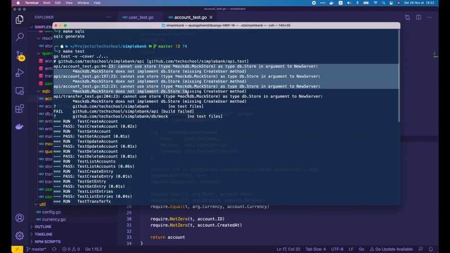

# Как правильно обрабатывать ошибки БД в Golang

[Оригинал](https://dev.to/techschoolguru/how-to-handle-db-errors-in-golang-correctly-11ek)

Привет, ребята, рад снова видеть вас!

На [последней лекции](https://dev.to/techschoolguru/add-users-table-with-unique-foreign-key-constraints-in-postgresql-1i29) 
мы добавили новую таблицу `users` в схему базы данных. Сегодня давайте модифицируем 
наш код на Golang для работы с этой таблицей.

При этом мы также узнаем, как правильно обрабатывать некоторые конкретные 
ошибки, возвращаемые Postgres.

Ниже:
* Ссылка на [плейлист с видео лекциями на Youtube](https://bit.ly/backendmaster)
* И на [Github репозиторий](https://github.com/techschool/simplebank)

Итак, давайте начнём!

## Генерируем код для создания и получения пользователя

Сначала я создам новый файл `user.sql` в папке `db/query`. В этом файле мы 
напишем два SQL запроса для создания и получения пользователей.

Они должны быть похожи на те, которые мы использовали для создания и получения 
банковских счетов, поэтому я скопирую эти два запроса из файла `account.sql` и 
вставлю их в файл `user.sql`.

```postgresql
-- name: CreateAccount :one
INSERT INTO accounts (
  owner,
  balance,
  currency
) VALUES (
  $1, $2, $3
) RETURNING *;

-- name: GetAccount :one
SELECT * FROM accounts
WHERE id = $1 LIMIT 1;
```

Затем давайте изменим имя функции на `CreateUser`, имя таблицы на `users` и 
имена полей на: `username`, `hashed_password`, `full_name` и `email`.

Нам не нужно указывать поля `password_changed_at` и `created_at`, потому что 
Postgres автоматически заполнит их значением по умолчанию.

Тут вставляются четыре поля в таблицу, поэтому нам нужно добавить еще один 
параметр в список значений.

```postgresql
-- name: CreateUser :one
INSERT INTO users (
  username,
  hashed_password,
  full_name,
  email
) VALUES (
  $1, $2, $3, $4
) RETURNING *;
```

Далее функцию `GetAccount` следует изменить на `GetUser`, а запрос — на
`SELECT * FROM users`.

Обратите внимание, что у нас нет столбца `ID` в таблице `users`. Её 
первичным ключом является `username`, поэтому вместо этого мы должны получить 
пользователя по `username`.

```postgresql
-- name: GetUser :one
SELECT * FROM users
WHERE username = $1 LIMIT 1;
```

Хорошо, теперь запросы написаны, давайте откроем терминал и запустим эту 
команду, чтобы сгенерировать для них код на Golang.

```shell
❯ make sqlc
sqlc generate
```

Теперь вернемся в Visual Studio Code. В файл `db/sqlc/models.go` добавлена 
новая структура `User`:

```go
type User struct {
    Username          string    `json:"username"`
    HashedPassword    string    `json:"hashed_password"`
    FullName          string    `json:"full_name"`
    Email             string    `json:"email"`
    PasswordChangedAt time.Time `json:"password_changed_at"`
    CreatedAt         time.Time `json:"created_at"`
}
```

И появился новый файл `db/sqlc/user.sql.go`, который содержит две функции для 
создания и получения пользователя из базы данных:

```go
// Code generated by sqlc. DO NOT EDIT.
// source: user.sql

package db

import (
    "context"
)

const createUser = `-- name: CreateUser :one
INSERT INTO users (
  username,
  hashed_password,
  full_name,
  email
) VALUES (
  $1, $2, $3, $4
) RETURNING username, hashed_password, full_name, email, password_changed_at, created_at
`

type CreateUserParams struct {
    Username       string `json:"username"`
    HashedPassword string `json:"hashed_password"`
    FullName       string `json:"full_name"`
    Email          string `json:"email"`
}

func (q *Queries) CreateUser(ctx context.Context, arg CreateUserParams) (User, error) {
    row := q.db.QueryRowContext(ctx, createUser,
        arg.Username,
        arg.HashedPassword,
        arg.FullName,
        arg.Email,
    )
    var i User
    err := row.Scan(
        &i.Username,
        &i.HashedPassword,
        &i.FullName,
        &i.Email,
        &i.PasswordChangedAt,
        &i.CreatedAt,
    )
    return i, err
}

const getUser = `-- name: GetUser :one
SELECT username, hashed_password, full_name, email, password_changed_at, created_at FROM users
WHERE username = $1 LIMIT 1
`

func (q *Queries) GetUser(ctx context.Context, username string) (User, error) {
    row := q.db.QueryRowContext(ctx, getUser, username)
    var i User
    err := row.Scan(
        &i.Username,
        &i.HashedPassword,
        &i.FullName,
        &i.Email,
        &i.PasswordChangedAt,
        &i.CreatedAt,
    )
    return i, err
}
```

Далее мы напишем тесты для этих двух функций, чтобы убедиться, что они работают 
как ожидается.

## Пишем тесты для сгенерированных функций

Мы уже научились это делать на пятой лекции курса.

Итак, я собираюсь создать новый файл `user_test.go` в папке `db/sqlc`. Затем я 
скопирую тесты, которые мы написали для функции создания и получения 
банковского счёта, и вставлю их в этот файл.

Затем давайте изменим название функции на `createRandomUser`. Переменная-аргумент 
будет иметь тип `CreateUserParams`.

Первое поле — это `username`, которое мы можем определить с помощью функции
`util.RandomOwner()`.

Второе поле — `hashed_password`. Стандартное решение — сгенерировать случайный 
пароль и хешировать его с помощью `bcrypt`, но мы это сделаем в другой 
лекции. Сейчас я буду просто использовать здесь простое текстовое значение 
`"secret"`.

```go
func createRandomUser(t *testing.T) User {
    arg := CreateUserParams{
        Username:       util.RandomOwner(),
        HashedPassword: "secret",
        FullName:       util.RandomOwner(),
        Email:          util.RandomEmail(),
    }

    ...
}
```

Следующее поле — `full_name`. Для него мы можем использовать ту же функцию 
`util.RandomOwner()`.

И последнее поле — `email`. Нам нужно будет добавить новую функцию 
`RandomEmail()` в пакет `util`. Итак, давайте откроем файл `util/random.go` и 
реализуем её.

```go
// RandomEmail генерирует случайный email
func RandomEmail() string {
    return fmt.Sprintf("%s@email.com", RandomString(6))
}
```

Эта функция `RandomEmail` вернет строку, которая будет случайно 
сгенерированным адресом электронной почты. Здесь я упрощаю, используя 
`fmt.Sprintf` для создания электронного письма в виде: какая-то случайная 
строка плюс `@email.com`.

Хорошо, теперь вернёмся к тесту. Мы должны изменить вызов этой функции, 
на `testQueries.Create User()`, и в результате должны получить 
объект `user`.

```go
func createRandomUser(t *testing.T) User {
    ...

    user, err := testQueries.CreateUser(context.Background(), arg)
    require.NoError(t, err)
    require.NotEmpty(t, user)

    require.Equal(t, arg.Username, user.Username)
    require.Equal(t, arg.HashedPassword, user.HashedPassword)
    require.Equal(t, arg.FullName, user.FullName)
    require.Equal(t, arg.Email, user.Email)
    require.NotZero(t, user.CreatedAt)
    require.True(t, user.PasswordChangedAt.IsZero())

    return user
}
```

Мы требуем, чтобы этот пользователь не был равен пустому объекту. Затем мы 
сравниваем каждое поле возвращённого пользователя с полем входного аргумента:

* `arg.Username` должен быть равен `user.Username`
* `arg.HashedPassword` должен быть равен `user.HashedPassword`
* `arg.Fullname` должен быть равен `user.Fullname`
* `arg.Email` должен быть равен `user.Email`

Затем поле `user.CreatedAt` не должно быть равно нулю, так как мы ожидаем, что 
база данных заполнит его текущей меткой времени.

Последнее поле, которое мы должны проверить, это `user.PasswordChangedAt`. 
Когда пользователь создается впервые, мы ожидаем, что это поле будет заполнено 
значением по умолчанию с нулевой меткой времени. Для проверки этого условия 
используется функция `IsZero()`.

Затем, в конце, мы должны вернуть созданного пользователя (`user`) вызывающей 
стороне. Хорошо, теперь давайте использовать эту функцию в тестах!

Во-первых, для `TestCreateUser` мы просто вызываем `createRandomUser` с 
входным объектом `testing.T`.

```go
func TestCreateUser(t *testing.T) {
    createRandomUser(t)
}
```

Следующий тест — `GetUser`. Мы вызываем функцию `createRandomUser()` для 
создания случайного пользователя `user1`. Затем мы вызываем 
`testQueries.GetUser`, чтобы получить пользователя с `user1.Username` из 
базы данных.

```go
func TestGetUser(t *testing.T) {
    user1 := createRandomUser(t)
    user2, err := testQueries.GetUser(context.Background(), user1.Username)
    require.NoError(t, err)
    require.NotEmpty(t, user2)

    require.Equal(t, user1.Username, user2.Username)
    require.Equal(t, user1.HashedPassword, user2.HashedPassword)
    require.Equal(t, user1.FullName, user2.FullName)
    require.Equal(t, user1.Email, user2.Email)
    require.WithinDuration(t, user1.PasswordChangedAt, user2.PasswordChangedAt, time.Second)
    require.WithinDuration(t, user1.CreatedAt, user2.CreatedAt, time.Second)
}
```

Возвращенный `user2` из этого запроса должен совпадать с входным `user1`. 
Поэтому мы сравниваем каждое поле в них, чтобы убедиться, что они равны:
`username`, `hashed_password`, `full_name` и `email`.

Для поля метки времени, такого как `created_at` и `password_changed_at`, я 
часто использую `require.WithinDuration` для сравнения значений, потому что 
иногда может быть очень небольшая разница.

Итак, тесты готовы. Давайте запустим их!

Сначала `TestCreateUser`.


Он успешно пройден!

Затем `TestGetUser`.


Также успешно пройден!

Теперь, если мы откроем базу данных с помощью [Table Plus](https://tableplus.com/), 
то увидим, что в таблице `users` сейчас две записи.


Итак, две функции, сгенерированные [sqlc](https://dev.to/techschoolguru/how-to-handle-db-errors-in-golang-correctly-11ek), 
отработали правильно.

Давайте попробуем запустить тест всего пакета!


На этот раз многие тесты `CRUD` функций для `accounts` завершились с 
ошибкой. И причина в нарушении ограничения внешнего ключа (`foreign key 
constraint violation`).

Это ожидаемо, поскольку на момент написания этих тестов ограничения внешнего 
ключа (`foreign key constraint`) для поля `owner` еще не существовало.

## Исправляем тесты, которые завершились с ошибкой

Как видите в файле `db/sql/account _test.go`, мы просто генерируем 
случайного владельца, и он не связан ни с какими существующими пользователями:

```go
func createRandomAccount(t *testing.T) Account {
    arg := CreateAccountParams{
        Owner:    util.RandomOwner(),
        Balance:  util.RandomMoney(),
        Currency: util.RandomCurrency(),
    }

    account, err := testQueries.CreateAccount(context.Background(), arg)
    require.NoError(t, err)
    require.NotEmpty(t, account)

    require.Equal(t, arg.Owner, account.Owner)
    require.Equal(t, arg.Balance, account.Balance)
    require.Equal(t, arg.Currency, account.Currency)

    require.NotZero(t, account.ID)
    require.NotZero(t, account.CreatedAt)

    return account
}

func TestCreateAccount(t *testing.T) {
    createRandomAccount(t)
}
```

Чтобы исправить это, мы должны сначала создать пользователя в базе данных.
Затем вместо случайного владельца мы будем использовать `username` 
созданного пользователя в качестве владельца банковского счёта:

```go
func createRandomAccount(t *testing.T) Account {
    user := createRandomUser(t)

    arg := CreateAccountParams{
        Owner:    user.Username,
        Balance:  util.RandomMoney(),
        Currency: util.RandomCurrency(),
    }

    ...
}
```

Итак, теперь тесты должны выполняться без ошибок. Давайте перезапустим тесты 
всего пакета.


В этот раз все они успешно пройдены! Превосходно!

Но обратите внимание, что здесь запускают только все тесты в пакете `db`. У нас 
также есть дополнительные тесты в пакете `api`.

Итак, давайте откроем терминал и выполним команду `make test`, чтобы запустить 
их все.



Мы получили ошибку, потому что наш `MockStore` не реализует интерфейс `db.Store`. 
Не хватает реализации некоторых функций.

Это связано с тем, что когда мы запустили ранее `make sqlc` для генерации кода, в 
интерфейс `Querier` добавились две новые функции: `CreateUser` и `GetUser`. А 
интерфейс `Querier` является частью интерфейса `db.Store`.


Чтобы исправить эту ошибку, нам нужно перегенерировать код для `MockStore`:

```shell
❯ make mock
mockgen -package mockdb -destination db/mock/store.go github.com/techschool/simplebank/db/sqlc Store
```

После этого мы видим, что в файл `db/mock/store.go` добавлена реализация 
функций `GetUser` и `CreateUser`:

```go
// CreateUser имитирует реальный метод
func (m *MockStore) CreateUser(arg0 context.Context, arg1 db.CreateUserParams) (db.User, error) {
    m.ctrl.T.Helper()
    ret := m.ctrl.Call(m, "CreateUser", arg0, arg1)
    ret0, _ := ret[0].(db.User)
    ret1, _ := ret[1].(error)
    return ret0, ret1
}

// CreateUser определяет как будет вызываться CreateUser
func (mr *MockStoreMockRecorder) CreateUser(arg0, arg1 interface{}) *gomock.Call {
    mr.mock.ctrl.T.Helper()
    return mr.mock.ctrl.RecordCallWithMethodType(mr.mock, "CreateUser", reflect.TypeOf((*MockStore)(nil).CreateUser), arg0, arg1)
}

// GetUser имитирует реальный метод
func (m *MockStore) GetUser(arg0 context.Context, arg1 string) (db.User, error) {
    m.ctrl.T.Helper()
    ret := m.ctrl.Call(m, "GetUser", arg0, arg1)
    ret0, _ := ret[0].(db.User)
    ret1, _ := ret[1].(error)
    return ret0, ret1
}

// GetUser определяет как будет вызываться GetUser
func (mr *MockStoreMockRecorder) GetUser(arg0, arg1 interface{}) *gomock.Call {
    mr.mock.ctrl.T.Helper()
    return mr.mock.ctrl.RecordCallWithMethodType(mr.mock, "GetUser", reflect.TypeOf((*MockStore)(nil).GetUser), arg0, arg1)
}
```

Итак, теперь unit тесты для API должны работать. Повторно запустим `make test` 
в терминале.


Все тесты успешно пройдены! Идеально!

## Обрабатываем различные типы ошибок БД

Хорошо, теперь давайте попробуем запустить HTTP-сервер.

```go
❯ make server
go run main.go
[GIN-debug] [WARNING] Creating an Engine instance with the Logger and Recovery middleware already attached.

[GIN-debug] [WARNING] Running in "debug" mode. Switch to "release" mode in production.
 - using env:   export GIN_MODE=release
 - using code:  gin.SetMode(gin.ReleaseMode)

[GIN-debug] POST   /users                    --> github.com/techschool/simplebank/api.(*Server).createUser-fm (3 handlers)
[GIN-debug] POST   /accounts                 --> github.com/techschool/simplebank/api.(*Server).createAccount-fm (3 handlers)
[GIN-debug] GET    /accounts/:id             --> github.com/techschool/simplebank/api.(*Server).getAccount-fm (3 handlers)
[GIN-debug] GET    /accounts                 --> github.com/techschool/simplebank/api.(*Server).listAccounts-fm (3 handlers)
[GIN-debug] POST   /transfers                --> github.com/techschool/simplebank/api.(*Server).createTransfer-fm (3 handlers)
[GIN-debug] Listening and serving HTTP on 0.0.0.0:8080
```

Затем откройте Postman, чтобы протестировать существующий API и создать новый
банковский счёт.

Во-первых, я попытаюсь создать счёт для владельца, которого нет в базе данных.


Как видите, у нас возникла ошибка, потому что нарушено ограничение 
внешнего ключа (`foreign key constraint`) для владельца учетной записи. Это 
ожидаемо, так как записи с таким именем пользователя в базе пока нет.

Однако код состояния HTTP ответа — `500 Internal Server Error`. Этот статус не 
очень подходит в данном случае, так как ошибка на стороне клиента, потому что 
он пытается создать новый банковский счёт для несуществующего пользователя.

Вместо этого лучше вернуть что-то вроде статуса `403 Forbidden`. Для этого нам 
нужно обработать ошибку, возвращаемую Postgres.

Здесь, в обработчике создания банковского счёта, файл `api/account.go`, после 
вызова `store.CreateAccount`, если возвращается ошибка, мы попытаемся 
преобразовать её в тип `pq.Error` и присвоить результат переменной `pqErr`:

```go
func (server *Server) createAccount(ctx *gin.Context) {
    ...

    account, err := server.store.CreateAccount(ctx, arg)
    if err != nil {
        if pqErr, ok := err.(*pq.Error); ok {
            log.Println(pqErr.Code.Name())
        }
        ctx.JSON(http.StatusInternalServerError, errorResponse(err))
        return
    }

    ctx.JSON(http.StatusOK, account)
}
```

Если преобразование прошло без ошибок, давайте выведем здесь лог, чтобы увидеть
строковое значение этого кода ошибки.

Теперь я перезапущу сервер. Затем вернитесь к Postman и повторно отправьте 
тот же запрос.


Теперь в логе мы видим строковое значение кода ошибки — `foreign_key_violation`. 
Мы можем использовать его для классификации ошибки позднее.

Но перед этим я попытаюсь создать новый банковский счёт для существующего 
пользователя. Давайте скопируем какое-то имя пользователя из таблицы
`users` и вставим его в значение поля `owner`, а затем отправим запрос.


На этот раз запрос выполнен успешно, и создался новый банковский счёт. Но 
что, если мы отправим этот же запрос ещё раз?


Теперь мы получили другую ошибку: повторяющееся значение ключа нарушает 
ограничение по уникальности `owner_currency_key`. Ошибка связана с тем, что мы
пытаемся создать более одного счёта с одной и той же валютой для одного и того 
же владельца.

В этом случае мы также хотим вернуть статус `403 Forbidden` вместо 
`500 Internal Server Error`. Итак, давайте посмотрим в лог, чтобы увидеть строковое
значение кода ошибки.


Она называется `unique_violation`. Хорошо, теперь используя эту информацию, 
давайте вернемся к коду и обновим его.

```go
func (server *Server) createAccount(ctx *gin.Context) {
    ...

    account, err := server.store.CreateAccount(ctx, arg)
    if err != nil {
        if pqErr, ok := err.(*pq.Error); ok {
            switch pqErr.Code.Name() {
            case "foreign_key_violation", "unique_violation":
                ctx.JSON(http.StatusForbidden, errorResponse(err))
                return
            }
        }
        ctx.JSON(http.StatusInternalServerError, errorResponse(err))
        return
    }

    ctx.JSON(http.StatusOK, account)
}
```

Здесь я использую простой оператор `switch case` для проверки строкового 
значения кода ошибки. В случае если оно равно `foreign_key_violation` или 
`unique_violation`, мы отправим эту ошибку в качестве ответа сервера с кодом 
состояния `http.StatusForbidden`.

Итак, давайте перезапустим сервер! Затем повторно отправим запрос.


Как видите, возвращенный код состояния теперь равен `403 Forbidden`, как мы и 
ожидали.

Давайте попробуем изменить значение поля `owner` на несуществующее имя 
пользователя, как мы делали раньше, и повторно отправить запрос.


В этом случае мы также получаем код состояния `403 Forbidden`. Таким 
образом, всё работает как мы хотели!

И последнее, но не менее важное: я попытаюсь создать для этого пользователя 
второй банковский счёт, но в другой валюте, например в `EUR`.


Запрос выполнен успешно. И в базе данных мы видим два новых банковских счёта, 
связанные с одним и тем же именем пользователя, одна учетная запись в `EUR`, а 
другая - в `USD`.


Итак, на этом закончим сегодняшнюю лекцию. Я надеюсь, что вы научились чему-то
полезному благодаря ей.

Спасибо за время, потраченное на чтение, и до встречи на следующей!