# Как безопасно хранить пароли?

[Оригинал](https://dev.to/techschoolguru/how-to-securely-store-passwords-3cg7)

Всем привет, рад снова видеть вас на мастер-классе по бэкенду!

На этой лекции мы узнаем, как безопасно хранить пароли пользователей в 
базе данных.

Ниже:
* Ссылка на [плейлист с видео лекциями на Youtube](https://bit.ly/backendmaster)
* И на [Github репозиторий](https://github.com/techschool/simplebank)

## Как хранить пароль

Как вы уже знаете, мы никогда не должны хранить пароли в открытом виде! 
Итак, идея состоит в том, чтобы сначала хешировать его и сохранять только это 
хеш-значение.

Чаще всего пароль хешируется с использованием функции хеширования `brypt` для 
получения хеш-значения.

Входным параметром кроме пароля для `bcrypt` является параметр `cost`, который 
определяет количество раундов расширения ключа или итераций алгоритма.

Bcrypt также генерирует случайную соль (`salt`), которая будет использоваться в 
этих итерациях, что поможет защититься от [атаки с помощью радужной таблицы](https://en.wikipedia.org/wiki/Rainbow_table). 
Из-за этой случайной соли (`salt`) алгоритм выдаст вам совершенно другое 
значение выходного хэша, даже если будет передан тот же пароль на вход.

`cost` и `salt` также будут добавлены к хэшу, чтобы получить окончательную 
хеш-строку, которая выглядит примерно следующим образом:

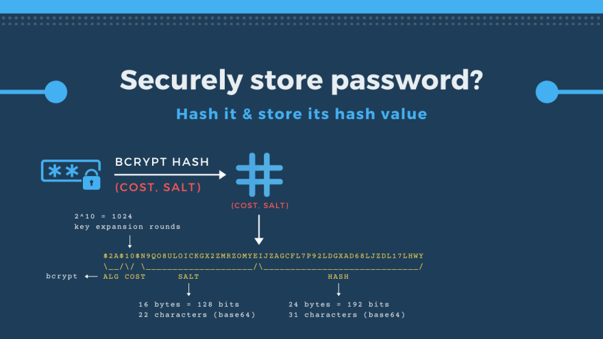

Эта хеш-строка состоит из четырёх компонентов:

* Первая часть — это идентификатор алгоритма хеширования (`hash algorithm identifier`). 
  `2A` — идентификатор алгоритма `bcrypt`.
* Вторая часть – `cost`. В этом случае `cost` равен `10`, что означает, что 
  будет `2^10 = 1024` раундов расширения ключа.
* Третья часть — это соль (`salt`) длиной 16 байт или 128 бит. Она закодирована 
  в формате `base64`, который генерирует строку из `22` символов.
* Наконец, последняя часть — это хеш-значение размером `24 байта`, закодированное 
  в виде `31` символа.

Все эти 4 части объединяются в одну хэш-строку, и именно эту строку мы будем 
хранить в базе данных.

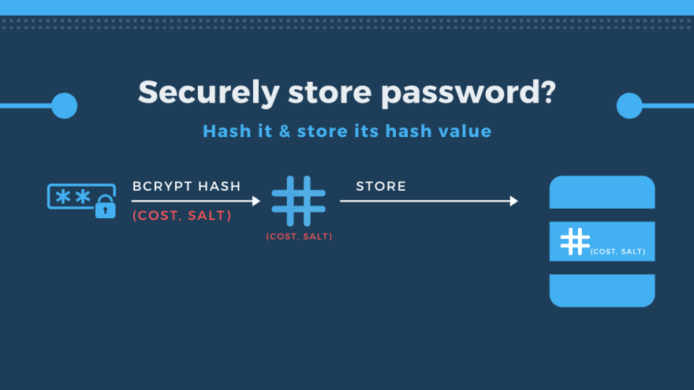

Так реализован процесс хэширования паролей пользователей!

Но когда пользователи входят в систему, как мы можем проверить правильность 
введенного ими пароля?

Что ж, сначала нам нужно найти `hashed_password`, хранящийся в БД по имени 
пользователя (`username`).

Затем мы используем `cost` и `salt` этого `hashed_password` в качестве 
аргументов для хэширования введенного пользователем незашифрованного пароля 
`nude_password` с помощью `bcrypt`. В результате получим другое хеш-значение.

Затем все, что нам нужно сделать, это сравнить два значения хеш-функции. Если 
они совпадают, то пароль правильный.

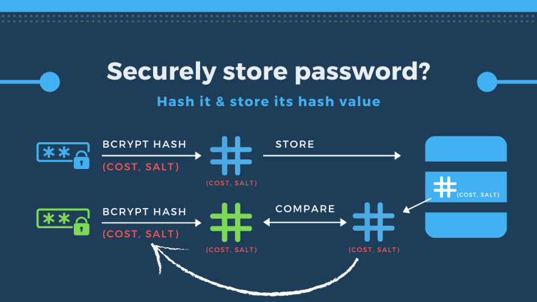

Хорошо, теперь давайте посмотрим, как реализовать эту логику в `Golang`.

## Реализуем функции для хеширования и сравнения паролей

На [предыдущей лекции](https://dev.to/techschoolguru/how-to-handle-db-errors-in-golang-correctly-11ek) мы сгенерировали код для создания нового пользователя в 
базе данных. А `hashed_password` — это один из входных параметров функции 
`CreateUser()`.

```go
type CreateUserParams struct {
    Username       string `json:"username"`
    HashedPassword string `json:"hashed_password"`
    FullName       string `json:"full_name"`
    Email          string `json:"email"`
}

func (q *Queries) CreateUser(ctx context.Context, arg CreateUserParams) (User, error) {
    row := q.db.QueryRowContext(ctx, createUser,
        arg.Username,
        arg.HashedPassword,
        arg.FullName,
        arg.Email,
    )
    var i User
    err := row.Scan(
        &i.Username,
        &i.HashedPassword,
        &i.FullName,
        &i.Email,
        &i.PasswordChangedAt,
        &i.CreatedAt,
    )
    return i, err
}
```

Кроме того, в этой функции `createRandomUser()` unit теста в 
`db/sqlc/user_test.go` мы используем простую строку `"secret"` для поля 
`hash_password`, не отражающую реальных правильных значений, 
которые должно содержать это поле.

```go
func createRandomUser(t *testing.T) User {
    arg := CreateUserParams{
        Username:       util.RandomOwner(),
        HashedPassword: "secret",
        FullName:       util.RandomOwner(),
        Email:          util.RandomEmail(),
    }

    ...
}
```

Итак, сегодня мы собираемся обновить его, чтобы использовать настоящую 
хеш-строку.

## Функция для хеширования пароля

Во-первых, давайте создадим новый файл `password.go` внутри пакета `util`. В 
этом файле я определю новую функцию: `HashPassword()`.

Она принимает строку `password` в качестве входных данных и вернет строку 
(`string`) или ошибку (`error`). Эта функция будет вычислять хэш-строку 
`bcrypt` для входного пароля (`password`).

```go
// HashPassword возвращает bcrypt хэш пароля
func HashPassword(password string) (string, error) {
    hashedPassword, err := bcrypt.GenerateFromPassword([]byte(password), bcrypt.DefaultCost)
    if err != nil {
        return "", fmt.Errorf("failed to hash password: %w", err)
    }
    return string(hashedPassword), nil
}
```

В этой функции мы вызываем `bcrypt.GenerateFromPassword()`. Он требует двух 
входных параметров: `password` - срез типа `[]byte` и `cost` типа `int`.

Итак, мы должны преобразовать входной пароль (`password`) из 
строки (`string`) в срез `[]byte`.

Для cost я использую значение `bcrypt.DefaultCost`, равное `10`.

Результатом этой функции будет `hashedPassword` и `error`. Если ошибка не 
равна `nil`, то мы просто возвращаем пустую хешированную строку и оборачиваем 
ошибку (`error`) сообщением: «не удалось хешировать пароль» (`"failed 
to hash password"`).

В противном случае мы преобразуем `hashedPassword` из среза `[]byte` в строку 
и возвращаем его с ошибкой равной `nil`.

## Функция сравнения паролей

Затем мы напишем еще одну функцию для проверки правильности пароля: 
`CheckPassword()`.

Эта функция будет принимать 2 входных аргумента: пароль (`password`) для 
проверки и `hashedPassword` для сравнения. Он возвращает ошибку (`error`) в качестве 
результата.

По сути, эта функция проверяет правильность введенного пароля (`password`), 
сравнивая его с предоставленным `hashedPassword`.

Поскольку стандартный пакет bcrypt уже реализовал эту функцию, все, что нам 
нужно сделать, это вызвать функцию `bcrypt.CompareHashAndPassword()` и передать 
`hashedPassword` и незашифрованный пароль (`password`), преобразовав их из 
строки (`string`) в срезы типа `[]byte`.

```go
// CheckPassword проверяет правильность предоставленного пароля
func CheckPassword(password string, hashedPassword string) error {
    return bcrypt.CompareHashAndPassword([]byte(hashedPassword), []byte(password))
}
```

Это всё что нужно сделать. Всё готово к работе!

## Пишем unit тесты для функций HashPassword и CheckPassword

Теперь давайте напишем несколько unit тестов, чтобы убедиться, что эти две 
функции работают должным образом.

Я собираюсь создать новый файл `password_test.go` внутри пакета `util`. Затем 
давайте определим функцию `TestPassword()`, передавая в неё объект `testing.T` 
в качестве входных данных.

Сначала я сгенерирую новый пароль в виде случайной строки из 6 символов. Затем 
мы получаем `hashedPassword` (хешированный пароль), вызывая функцию 
`HashPassword()` со случайно сгенерированным паролем.

Мы проверяем, что не возникло ошибок, и строка `hashedPassword` не пустая.

```go
func TestPassword(t *testing.T) {
    password := RandomString(6)
    
    hashedPassword, err := HashPassword(password)
    require.NoError(t, err)
    require.NotEmpty(t, hashedPassword)
    
    err = CheckPassword(password, hashedPassword)
    require.NoError(t, err)
}
```

Далее мы вызываем функцию `CheckPassword()` с параметрами `password` и 
`hashedPassword`.

Поскольку это тот же пароль, который мы использовали для создания 
`hashedPassword`, эта функция не должна возвращать ошибок, то есть
проверка успешно пройдена.

Давайте также проверим случай, когда указан неверный пароль (`incorrect 
password`)!

Я сгенерирую новую случайную строку для неправильного пароля (`wrongPassword`) 
и снова вызову `CheckPassword()` с этим аргументом `wrongPassword`. На этот раз 
мы ожидаем, что будет возвращена ошибка (`error`), поскольку предоставлен 
неверный пароль.

```go
func TestWrongPassword(t *testing.T) {
    password := RandomString(6)
    
    hashedPassword, err := HashPassword(password)
    require.NoError(t, err)
    require.NotEmpty(t, hashedPassword)
    
    wrongPassword := RandomString(6)
    err = CheckPassword(wrongPassword, hashedPassword)
    require.EqualError(t, err, bcrypt.ErrMismatchedHashAndPassword.Error())
}
```

А точнее, мы использовали `require.EqualError()` для проверки возвращённой 
ошибки. Она должна быть равна `bcrypt.ErrMismatchedHashAndPassword`.

Итак, теперь тест готов. Давайте запустим его!

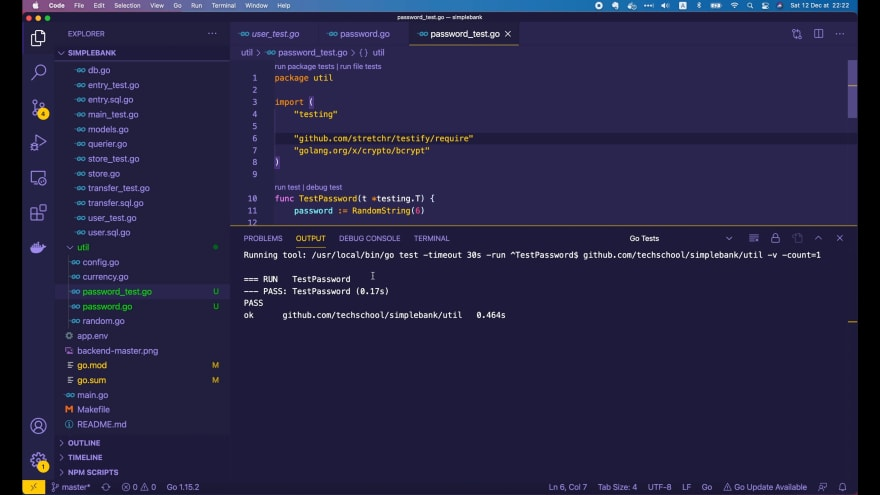

Он успешно пройден! Превосходно!

## Обновляем существующий код, чтобы использовать функцию HashPassword

Итак, функция `HashPassword()` работает правильно. Вернемся к файлу 
`user_test.go` и используем её в функции `createRandomUser()`.

Здесь я создам новое значение `hashedPassword`, вызвав функцию 
`util.HashPassword()` со случайной строкой из 6 символов.

Мы проверяем, что не возникло ошибок, а затем меняем константу `"secret"` на
`hashedPassword`:

```go
func createRandomUser(t *testing.T) User {
    hashedPassword, err := util.HashPassword(util.RandomString(6))
    require.NoError(t, err)

    arg := CreateUserParams{
        Username:       util.RandomOwner(),
        HashedPassword: hashedPassword,
        FullName:       util.RandomOwner(),
        Email:          util.RandomEmail(),
    }

    ...
}
```

Хорошо, давайте запустим тест для всего пакета `db`!

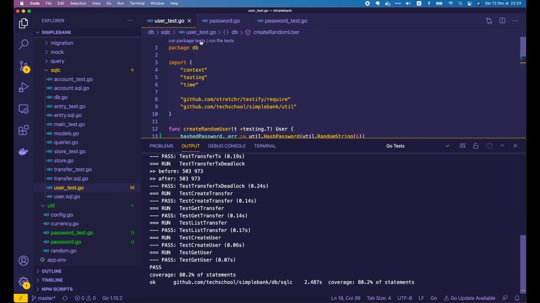

Всё они успешно пройдены!

Теперь, если мы откроем базу данных в Table Plus и просмотрим содержимое таблицы 
`users`, то увидим, что столбец `hashed_password` сейчас содержит правильную 
строку, хэшированную `bcrypt`.


Они похожи на пример хэшированной строки, который я показал вам в начале лекции.

## Убеждаемся, что все хэшированные пароли разные

Мы хотим убедиться в одном: если `один и тот же пароль` хэшируется дважды, 
должны быть созданы `2 разных хэш значения`.

Итак, вернемся к функции `TestPassword()`. Я изменю имя 
переменной `hashPassword` на `hashedPassword1`.

Затем давайте скопируем блок кода, отвечающий за создание хеш-пароля, и 
изменим имя переменной на `hashedPassword2`.

```go
func TestPassword(t *testing.T) {
    password := RandomString(6)

    hashedPassword1, err := HashPassword(password)
    require.NoError(t, err)
    require.NotEmpty(t, hashedPassword1)

    err = CheckPassword(password, hashedPassword1)
    require.NoError(t, err)

    wrongPassword := RandomString(6)
    err = CheckPassword(wrongPassword, hashedPassword1)
    require.EqualError(t, err, bcrypt.ErrMismatchedHashAndPassword.Error())

    hashedPassword2, err := HashPassword(password)
    require.NoError(t, err)
    require.NotEmpty(t, hashedPassword2)
    require.NotEqual(t, hashedPassword1, hashedPassword2)
}
```

Мы ожидаем, что значение `hashedPassword2` будет отличаться от 
`hashedPassword1`. Итак, здесь я использую `require.NotEqual()` для проверки 
этого условия.

Хорошо, давайте повторно запустим тест.

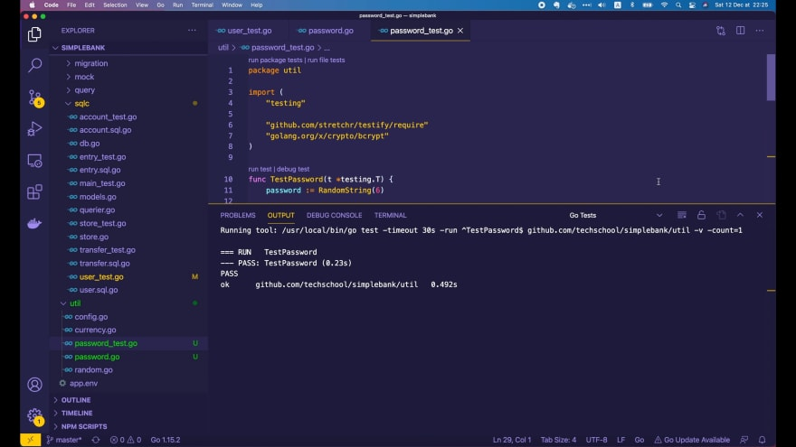

Он успешно пройден! Превосходно!

Чтобы действительно понять, почему он был успешно пройден, нам нужно открыть 
реализацию функции `bcrypt.GenerateFromPassword()`.

```go
func GenerateFromPassword(password []byte, cost int) ([]byte, error) {
    p, err := newFromPassword(password, cost)
    if err != nil {
        return nil, err
    }
    return p.Hash(), nil
}

func newFromPassword(password []byte, cost int) (*hashed, error) {
    if cost < MinCost {
        cost = DefaultCost
    }
    p := new(hashed)
    p.major = majorVersion
    p.minor = minorVersion

    err := checkCost(cost)
    if err != nil {
        return nil, err
    }
    p.cost = cost

    unencodedSalt := make([]byte, maxSaltSize)
    _, err = io.ReadFull(rand.Reader, unencodedSalt)
    if err != nil {
        return nil, err
    }

    p.salt = base64Encode(unencodedSalt)
    hash, err := bcrypt(password, p.cost, p.salt)
    if err != nil {
        return nil, err
    }
    p.hash = hash
    return p, err
}
```

Как вы видите, в функции `newFromPassword()` генерируется случайное значение 
соли, которое используется в функции `bcrypt()` для генерации хэша.

Итак, теперь вы знаете, что из-за этой случайной соли сгенерированное значение 
хеш-функции каждый раз будет разным.

## Реализуем API для создания пользователя

Теперь я воспользуюсь функцией `HashPassword()`, которую мы написали, чтобы 
реализовать API для создания пользователя в нашем простом банковском приложении.

Давайте создадим новый файл `user.go` внутри пакета `api`.

Этот API будет очень похож на API для создания счёта, который мы [реализовали 
ранее](https://dev.to/techschoolguru/implement-restful-http-api-in-go-using-gin-4ap1), 
поэтому я просто скопирую его из файла `api/account.go`.

Затем давайте изменим структуру `createAccountRequest` на `createUserRequest`.

Первый параметр — `username`. Это обязательное (`required`) поле.

Допустим, мы не разрешаем, чтобы в нём содержались какие-либо специальные 
символы, поэтому здесь я буду использовать тег `alphanum`, который уже 
реализован [пакетом validator](https://github.com/go-playground/validator). По сути это означает, что это поле должно 
содержать только буквенно-цифровые символы ASCII.

Второе поле — `password`. Оно также обязательное (`required`). И обычно мы не 
хотим, чтобы пароль был слишком коротким, потому что в этом случае его очень 
легко взломать. Итак, давайте используем дескриптор `min`, чтобы указать, что 
длина пароля должна быть не менее `6` символов.

```go
type createUserRequest struct {
    Username string `json:"username" binding:"required,alphanum"`
    Password string `json:"password" binding:"required,min=6"`
    FullName string `json:"full_name" binding:"required"`
    Email    string `json:"email" binding:"required,email"`
}
```

Третье поле — `full_name` пользователя. Для этого поля нет особых требований, 
за исключением того, что оно обязательно (`required`).

Затем последнее поле — электронная почта, которое очень важно, поскольку это 
будет основной канал связи между пользователями и нашей системой. Мы можем 
использовать дескриптор `email`, предоставляемый пакетом validator, чтобы 
убедиться, что значение этого поля является правильным адресом 
электронной почты.

Существует множество других полезных встроенных тегов, которые уже были 
реализованы пакетом validator, вы можете просмотреть их в его 
[документации](https://pkg.go.dev/github.com/go-playground/validator/v10) или 
на [странице Github](https://github.com/go-playground/validator).

Теперь вернемся к коду, чтобы закончить реализацию этой функции 
`createUser()`.

```go
func (server *Server) createUser(ctx *gin.Context) {
    var req createUserRequest
    if err := ctx.ShouldBindJSON(&req); err != nil {
        ctx.JSON(http.StatusBadRequest, errorResponse(err))
        return
    }

    hashedPassword, err := util.HashPassword(req.Password)
    if err != nil {
        ctx.JSON(http.StatusInternalServerError, errorResponse(err))
        return
    }

    arg := db.CreateUserParams{
        Username:       req.Username,
        HashedPassword: hashedPassword,
        FullName:       req.FullName,
        Email:          req.Email,
    }

    ...   
}
```

Здесь мы используем функцию `ctx.ShouldBindJSON()` для привязки входных 
параметров из контекста к объекту `createUserRequest`.

Если какой-либо из параметров не проходит проверку, мы просто возвращаем клиенту 
статус `400 Bad Request`. В противном случае мы будем использовать их для 
создания объекта `db.CreateUserParams`.

Необходимо присвоить значения четырём полям: `Username`, `HashedPassword`, 
`Fullname` и `Email`.

Итак, сначала мы вычисляем `hashedPassword`, вызывая функцию 
`util.HashPassword()` и передаём входное значение `request.Password`.

Если эта функция выдаёт ошибку не равную `nil`, мы просто возвращаем 
клиенту статус `500 Internal Server Error`.

В противном случае мы создадим объект `CreateUserParams`, где `Username` — это 
`request.Username`, `HashedPassword` — это вычисленный `hashedPassword`, 
`FullName` — `request.FullName`, а `Email` — `request.Email`.

```go
func (server *Server) createUser(ctx *gin.Context) {
    ...

    user, err := server.store.CreateUser(ctx, arg)
    if err != nil {
        if pqErr, ok := err.(*pq.Error); ok {
            switch pqErr.Code.Name() {
            case "unique_violation":
                ctx.JSON(http.StatusForbidden, errorResponse(err))
                return
            }
        }
        ctx.JSON(http.StatusInternalServerError, errorResponse(err))
        return
    }

    ctx.JSON(http.StatusOK, user)
}
```

Затем мы вызываем `server.store.CreateUser()` с этим входным аргументом. Он 
вернет созданный объект `user` или ошибку (`error`).

Как и в API для создания счёта, если ошибка не равна `nil`, возможны 
несколько случаев. Имейте в виду, что в таблице `users` у нас есть два 
уникальных ограничения (`unique constraints`):

* одно из них для первичного ключа `username`,
* а второе — для столбца `email`.

У нас нет внешнего ключа (`foreign key`) в этой таблице, поэтому здесь нам нужно оставить только 
строковое значение кода ошибки `unique_violation` для возврата статуса 
`403 Forbidden` в случае, если пользователь с таким же `username` или
`email` уже существует.

Наконец, если ошибок не возникает, мы просто возвращаем клиенту статус 
`200 OK` с созданным `user`.

Хорошо, теперь обработчик `createUser` API готов к работе. Последнее, что нам 
нужно сделать, это зарегистрировать для него маршрут в файле `api/server.go`.

Здесь, в функции `NewServer()`, я добавлю новый маршрут с помощью 
метода `POST`. Его путь равен `/users`, а функция-обработчик — 
`server.createUser`.

```go
// NewServer создаёт новый HTTP сервер и настраивает маршрутизацию.
func NewServer(store db.Store) *Server {
    server := &Server{store: store}
    router := gin.Default()

    if v, ok := binding.Validator.Engine().(*validator.Validate); ok {
        v.RegisterValidation("currency", validCurrency)
    }

    router.POST("/users", server.createUser)

    router.POST("/accounts", server.createAccount)
    router.GET("/accounts/:id", server.getAccount)
    router.GET("/accounts", server.listAccounts)

    router.POST("/transfers", server.createTransfer)

    server.router = router
    return server
}
```

На этом всё! Всё готово к работе!

## Тестируем API для создания пользователя

Давайте откроем терминал и запустим `make server`, чтобы запустить сервер.

Я собираюсь использовать [Postman](https://www.postman.com/) для тестирования 
нового API.

Давайте выберем метод `POST` и перейдём по URL: 
[http://localhost:8080/users](http://localhost:8080/users)

Для тела запроса давайте выберем `raw` и формат `JSON`. Я буду использовать 
следующие JSON с данными:

```json
{
    "username": "quang1",
    "full_name": "Quang Pham",
    "email": "quang@email.com",
    "password": "secret"
}
```

Хорошо, давайте отправим этот запрос!


Он прошёл успешно! Мы получили созданный объект `user`, где значения полей,
совпадают с переданными в запросе.

Давайте откроем базу данных, чтобы найти этого пользователя.


Вот эта запись! Так что наш API хорошо работает в случае удачного выполнения 
запроса.

Теперь давайте посмотрим, что произойдет, если я отправлю этот же запрос во 
второй раз.

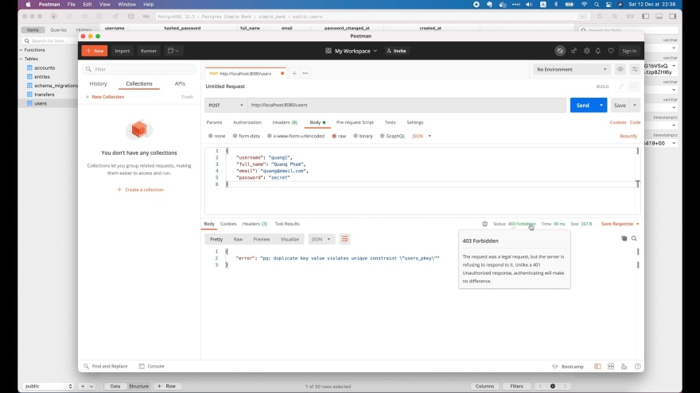

Мы получили код состояния `403 Forbidden`. И причина в том, что уникальное 
ограничение (`unique constraint`) для `username` нарушено.

Мы пытаемся создать другого пользователя с таким же `username`, так 
что это ясно, что это не должно быть разрешено!

Теперь давайте попробуем изменить `username` на `quang2`, но оставим
`email` прежним и снова отправим запрос.

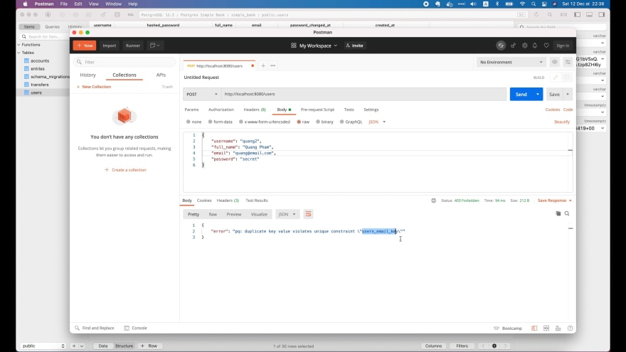

Мы опять получили ошибку 403 Forbidden. Но на этот раз она связана с 
нарушением уникального ограничения для `email`. Именно то, что мы ожидали!

Если я изменю `email` на `quang2@email.com`, то запрос 
выполнится успешно, так как этот адрес электронной почты не принадлежит другим 
пользователям.

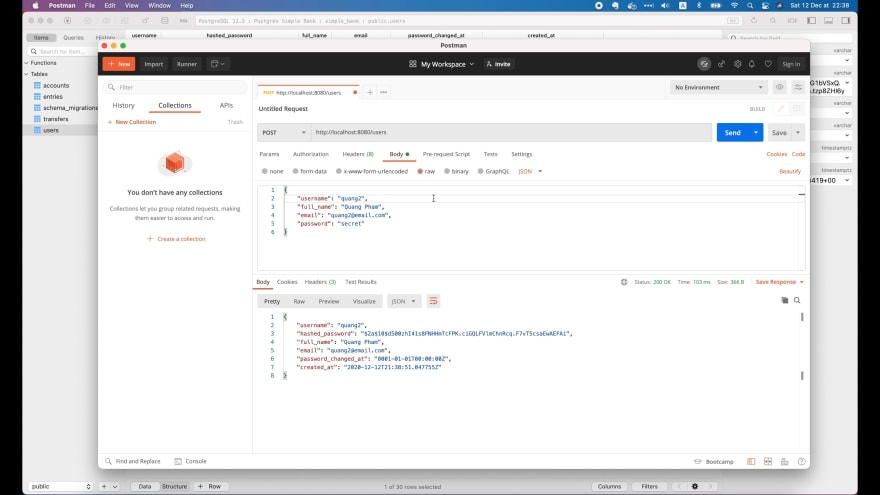

Хорошо, теперь попробуем ввести недопустимое `username`, например, 
`quang#2`:

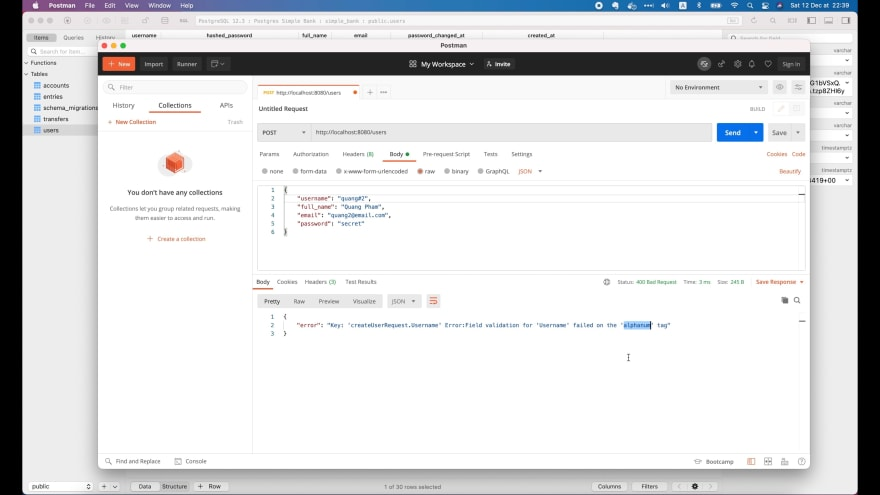

На этот раз код состояния — `400 Bad Request`. И причина в том, что проверка 
поля для username завершилась с ошибкой из-за дескриптора `alphanum`. В 
`username` есть специальный символ `#`, который не является буквенно-цифровым.

Затем попробуем отправить неверный адрес электронной почты. Я собираюсь 
изменить имя пользователя на `quang3` и адрес электронной почты на 
`quang3email.com` без символа `@`.

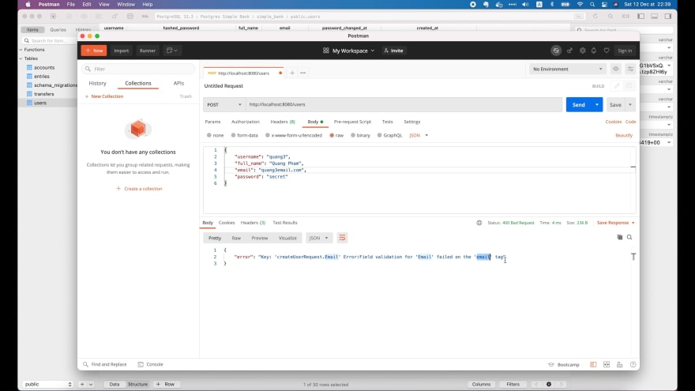

Мы снова получили код состояния `400 Bad Request`. И ошибку о том, что проверка 
поля `email` не удалась из-за дескриптора `email`, а это именно то, что нам 
нужно.

Хорошо, теперь давайте исправим `email` на правильный и сделаем пароль очень 
коротким, например `«123»`. Затем отправьте запрос еще раз.

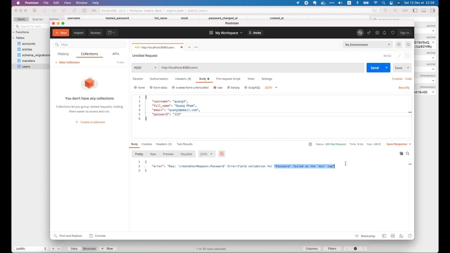

На этот раз мы получили ошибку, потому что при проверке поля `password` не 
выполняется условие для дескриптора `min`. Он не удовлетворяет минимальному 
ограничению длины в `6` символов.

## API не должно возвращать хэшированный пароль

Прежде чем мы закончим, я хочу рассказать вам вот ещё о чём. Давайте исправим 
значение в поле `password` и снова отправим запрос.

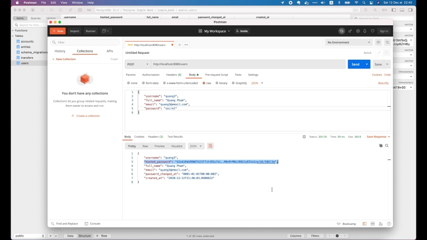

Теперь он успешно выполнен. Но как видите в ответе от сервера также возвращается 
значение `hashed_password`, что в корне неверно, потому что клиенту 
никогда не потребуется использовать это значение для чего-либо.

И это может привести к некоторые проблемы с безопасностью, поскольку эта 
конфиденциальная информация находится в открытом доступе.

Давайте удалим это поле из тела ответа.

Для этого я объявлю новую структуру `createUserResponse` в файле `api/user.go`. 
Она будет содержать почти все поля структуры `db.User`, за исключением поля 
`HashedPassword`, которое следует удалить.

```go
type createUserResponse struct {
    Username          string    `json:"username"`
    FullName          string    `json:"full_name"`
    Email             string    `json:"email"`
    PasswordChangedAt time.Time `json:"password_changed_at"`
    CreatedAt         time.Time `json:"created_at"`
}
```

Затем здесь, в конце функции-обработчика `createUser()`, мы создаем новый 
объект `createUserResponse`, где `Username` — это `user.Username`, `FullName` — 
`user.FullName`, `Email` — `user.Email`, `PasswordChangedAt` — 
`user.PasswordChangedAt`, а `CreatedAt` — `user.CreatedAt`.

```go
func (server *Server) createUser(ctx *gin.Context) {
    ...

    user, err := server.store.CreateUser(ctx, arg)
    if err != nil {
        if pqErr, ok := err.(*pq.Error); ok {
            switch pqErr.Code.Name() {
            case "unique_violation":
                ctx.JSON(http.StatusForbidden, errorResponse(err))
                return
            }
        }
        ctx.JSON(http.StatusInternalServerError, errorResponse(err))
        return
    }

    rsp := createUserResponse{
        Username:          user.Username,
        FullName:          user.FullName,
        Email:             user.Email,
        PasswordChangedAt: user.PasswordChangedAt,
        CreatedAt:         user.CreatedAt,
    }
    ctx.JSON(http.StatusOK, rsp)
}
```

Наконец, мы возвращаем объект `rsp` вместо `user`. Это всё что нужно сделать!

Давайте перезапустим сервер. Затем вернитесь в Postman, поменяйте `username` и 
`email`, чтобы они не совпадали со значениями, которые уже существуют в базе, 
и отправьте запрос.

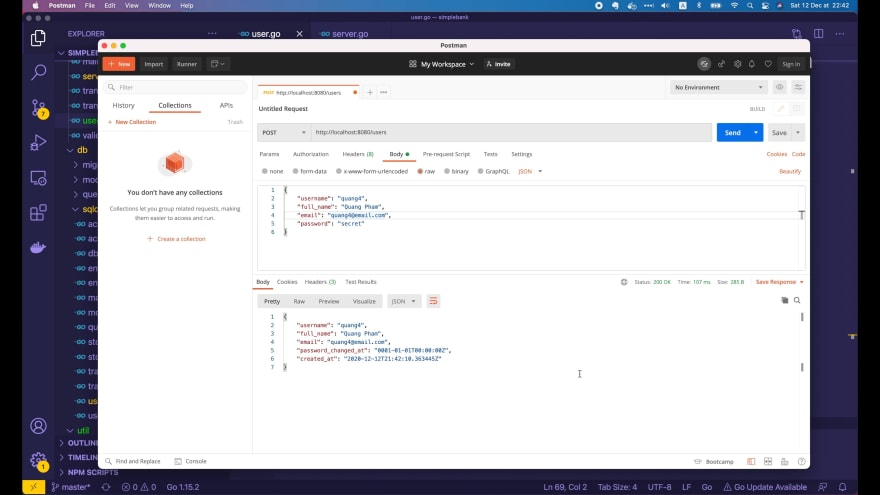

Он успешно выполнен. И теперь в теле ответа больше нет поля `hashed_password`. 
Идеально!

Итак, на этом мы закончим эту лекцию. Я надеюсь, что вы научились чему-то
полезному благодаря ей.

Спасибо за время, потраченное на чтение, и до встречи на следующей!