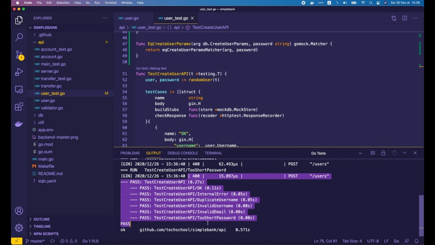

# Как написать усиленную версию unit тестов, используя свой пользовательский go-mock сопоставитель

[Оригинал](https://dev.to/techschoolguru/how-to-write-stronger-unit-tests-with-a-custom-go-mock-matcher-55pc)

Всем привет!

На этой лекции мы узнаем, как написать собственный Gomock сопоставитель, чтобы 
улучшить наши unit тесты на Golang.

Ниже:
* Ссылка на [плейлист с видео лекциями на Youtube](https://bit.ly/backendmaster)
* И на [Github репозиторий](https://github.com/techschool/simplebank)

## Ослабленная версия unit тестов

На прошлой лекции мы узнали, как безопасно хранить пароли пользователей с 
помощью `bcrypt`. Мы также внедрили API для создания нового пользователя в 
наше простое банковское приложение.

```go
func (server *Server) createUser(ctx *gin.Context) {
    var req createUserRequest
    if err := ctx.ShouldBindJSON(&req); err != nil {
        ctx.JSON(http.StatusBadRequest, errorResponse(err))
        return
    }

    hashedPassword, err := util.HashPassword(req.Password)
    if err != nil {
        ctx.JSON(http.StatusInternalServerError, errorResponse(err))
        return
    }

    arg := db.CreateUserParams{
        Username:       req.Username,
        HashedPassword: hashedPassword,
        FullName:       req.FullName,
        Email:          req.Email,
    }

    user, err := server.store.CreateUser(ctx, arg)
    if err != nil {
        if pqErr, ok := err.(*pq.Error); ok {
            switch pqErr.Code.Name() {
            case "unique_violation":
                ctx.JSON(http.StatusForbidden, errorResponse(err))
                return
            }
        }
        ctx.JSON(http.StatusInternalServerError, errorResponse(err))
        return
    }

    rsp := createUserResponse{
        Username:          user.Username,
        FullName:          user.FullName,
        Email:             user.Email,
        PasswordChangedAt: user.PasswordChangedAt,
        CreatedAt:         user.CreatedAt,
    }
    ctx.JSON(http.StatusOK, rsp)
}
```

Я не показал вам как написать модульные тесты для этого API. Алгоритм их
написания практически не отличался бы, от того, который мы использовали в 
тринадцатой лекции курса. С помощью Go-mock можно легко создать любые 
модульные тесты API.

Однако, если вы пытались самостоятельно написать unit тесты API для создания
пользователя, у вас могли возникнуть сложности из-за того, что входной параметр
`password` хэшируется перед сохранением в базе данных.

Чтобы понять почему, давайте посмотрим на простейшую версию тестов, которую я уже 
писал ниже.

```go
func TestCreateUserAPI(t *testing.T) {
    user, password := randomUser(t)

    testCases := []struct {
        name          string
        body          gin.H
        buildStubs    func(store *mockdb.MockStore)
        checkResponse func(recoder *httptest.ResponseRecorder)
    }{
        {
            name: "OK",
            body: gin.H{
                "username":  user.Username,
                "password":  password,
                "full_name": user.FullName,
                "email":     user.Email,
            },
            buildStubs: func(store *mockdb.MockStore) {
                store.EXPECT().
                    CreateUser(gomock.Any(), gomock.Any()).
                    Times(1).
                    Return(user, nil)
            },
            checkResponse: func(recorder *httptest.ResponseRecorder) {
                require.Equal(t, http.StatusOK, recorder.Code)
                requireBodyMatchUser(t, recorder.Body, user)
            },
        },
        {
            name: "InternalError",
            body: gin.H{
                "username":  user.Username,
                "password":  password,
                "full_name": user.FullName,
                "email":     user.Email,
            },
            buildStubs: func(store *mockdb.MockStore) {
                store.EXPECT().
                    CreateUser(gomock.Any(), gomock.Any()).
                    Times(1).
                    Return(db.User{}, sql.ErrConnDone)
            },
            checkResponse: func(recorder *httptest.ResponseRecorder) {
                require.Equal(t, http.StatusInternalServerError, recorder.Code)
            },
        },
        {
            name: "DuplicateUsername",
            body: gin.H{
                "username":  user.Username,
                "password":  password,
                "full_name": user.FullName,
                "email":     user.Email,
            },
            buildStubs: func(store *mockdb.MockStore) {
                store.EXPECT().
                    CreateUser(gomock.Any(), gomock.Any()).
                    Times(1).
                    Return(db.User{}, &pq.Error{Code: "23505"})
            },
            checkResponse: func(recorder *httptest.ResponseRecorder) {
                require.Equal(t, http.StatusForbidden, recorder.Code)
            },
        },
        {
            name: "InvalidUsername",
            body: gin.H{
                "username":  "invalid-user#1",
                "password":  password,
                "full_name": user.FullName,
                "email":     user.Email,
            },
            buildStubs: func(store *mockdb.MockStore) {
                store.EXPECT().
                    CreateUser(gomock.Any(), gomock.Any()).
                    Times(0)
            },
            checkResponse: func(recorder *httptest.ResponseRecorder) {
                require.Equal(t, http.StatusBadRequest, recorder.Code)
            },
        },
        {
            name: "InvalidEmail",
            body: gin.H{
                "username":  user.Username,
                "password":  password,
                "full_name": user.FullName,
                "email":     "invalid-email",
            },
            buildStubs: func(store *mockdb.MockStore) {
                store.EXPECT().
                    CreateUser(gomock.Any(), gomock.Any()).
                    Times(0)
            },
            checkResponse: func(recorder *httptest.ResponseRecorder) {
                require.Equal(t, http.StatusBadRequest, recorder.Code)
            },
        },
        {
            name: "TooShortPassword",
            body: gin.H{
                "username":  user.Username,
                "password":  "123",
                "full_name": user.FullName,
                "email":     user.Email,
            },
            buildStubs: func(store *mockdb.MockStore) {
                store.EXPECT().
                    CreateUser(gomock.Any(), gomock.Any()).
                    Times(0)
            },
            checkResponse: func(recorder *httptest.ResponseRecorder) {
                require.Equal(t, http.StatusBadRequest, recorder.Code)
            },
        },
    }

    ...
}
```

По сути, мы сначала создаем случайного пользователя, который будет сохранён в 
базе.

Затем мы объявляем таблицу тестовых случаев, где мы можем определить входные параметры,
передаваемые в запросе, и две функции для создания заглушки для `Store` и проверки
API ответа.

Существует несколько различных случаев, которые мы можем протестировать, 
например:

* Случай, когда запрос успешно выполнен 
* Случай, когда произошла внутренняя ошибка сервера
* Случай, когда переданное `username` уже существует в базе
* Случай, когда переданное имя пользователя, адрес электронной почты или 
  пароль не удовлетворяют правилам валидации

Мы в цикле перебираем все эти случаи и запускаем отдельный подтест для 
каждого из них.

```go
func TestCreateUserAPI(t *testing.T) {
    ...

    for i := range testCases {
        tc := testCases[i]

        t.Run(tc.name, func(t *testing.T) {
            ctrl := gomock.NewController(t)
            defer ctrl.Finish()

            store := mockdb.NewMockStore(ctrl)
            tc.buildStubs(store)

            server := NewServer(store)
            recorder := httptest.NewRecorder()

            // Marshal body data to JSON
            data, err := json.Marshal(tc.body)
            require.NoError(t, err)

            url := "/users"
            request, err := http.NewRequest(http.MethodPost, url, bytes.NewReader(data))
            require.NoError(t, err)

            server.router.ServeHTTP(recorder, request)
            tc.checkResponse(recorder)
        })
    }
}
```

В каждом подтесте мы создаем новый Gomock контроллер и используем его для 
создания новой имитации `Store`.

Затем мы вызываем функцию `buildStubs()` тестового случая, чтобы инициализировать 
заглушки для этого `Store`.

После этого мы создаем новый сервер, используя имитацию `Store`, и 
новый `recorder` HTTP ответов для записи результата вызова API.

Затем мы преобразуем тело входного запроса в JSON и делаем новый POST запрос 
(`request`) к конечной точке API create-user с этими JSON данными.

Мы вызываем функцию `server.router.ServeHTTP()`, передавая объект `recorder` 
и `request`. И, наконец, используем функцию `tc.checkResponse()`, чтобы 
проверить получившийся результат.

Ничего сложного и мало чем отличается от того, чему мы научились на 
[тринадцатой лекции](https://dev.to/techschoolguru/mock-db-for-testing-http-api-in-go-and-achieve-100-coverage-4pa9).

Я настоятельно рекомендую вам сначала прочитать её и убедиться, что вы 
полностью понимаете код, а затем продолжить.

Пока что для сегодняшней лекции сосредоточимся только на первом случае: успешном
выполнении запроса.

```go
func TestCreateUserAPI(t *testing.T) {
    user, password := randomUser(t)

    testCases := []struct {
        name          string
        body          gin.H
        buildStubs    func(store *mockdb.MockStore)
        checkResponse func(recoder *httptest.ResponseRecorder)
    }{
        {
            name: "OK",
            body: gin.H{
                "username":  user.Username,
                "password":  password,
                "full_name": user.FullName,
                "email":     user.Email,
            },
            buildStubs: func(store *mockdb.MockStore) {
                store.EXPECT().
                    CreateUser(gomock.Any(), gomock.Any()).
                    Times(1).
                    Return(user, nil)
            },
            checkResponse: func(recorder *httptest.ResponseRecorder) {
                require.Equal(t, http.StatusOK, recorder.Code)
                requireBodyMatchUser(t, recorder.Body, user)
            },
        },
        ...
    }

    ...
}
```

Как видите, все параметры тела запроса валидны.

В функции `buildStubs` мы ожидаем, что функция `CreateUser()` `Store` будет 
вызываться с двумя параметрами. В этой простой версии мы используем 
сопоставитель `Gomock.Any()` для каждого из них.

Обратите внимание, что первый аргумент функции `store.CreateUser()` — это 
контекст, значение которого нам не важно, поэтому имеет смысл использовать 
любой сопоставитель.

Однако использование того же сопоставителя для второго аргумента ослабит тест, 
поскольку он не сможет определить, является ли объект `createUserParams`, 
переданный в функцию `CreateUser()`, валидным или нет. Я покажу вам почему
чуть ниже. А пока давайте просто продолжим использовать этот сопоставитель 
`gomock.Any()`.

Ожидается, что эта функция `CreateUser` будет вызываться ровно один раз, и она 
вернет объект `user` без ошибок, так как это случай успешного выполнения запроса.

В функции `checkResponse` мы просто проверяем, что HTTP код состояния равен 
`200 OK`, и что тело ответа соответствует созданному объекту `user`.

Вот и все! Давайте запустим тест.


Все тесты успешно пройдены. Значит всё в порядке?

Ну, не совсем!

Как я уже говорил, этот сопоставитель `gomock.Any()` сделает тест слабее.

Почему?

Давайте посмотрим, что произойдет, если в этом обработчике `createUser()` я 
присвою переменной `arg` пустой объект `CreateUserParam{}`.

```go
func (server *Server) createUser(ctx *gin.Context) {
    ...

    arg := db.CreateUserParams{}

    user, err := server.store.CreateUser(ctx, arg)
    if err != nil {
        if pqErr, ok := err.(*pq.Error); ok {
            switch pqErr.Code.Name() {
            case "unique_violation":
                ctx.JSON(http.StatusForbidden, errorResponse(err))
                return
            }
        }
        ctx.JSON(http.StatusInternalServerError, errorResponse(err))
        return
    }

    ...
}
```

При этом неважно какие входные параметры будут переданы в запросе, а в базе
данных будет создан совершенно пустой пользователь. Так что этого нельзя 
допускать, и мы ожидаем, что тест провалится, не так ли?

Однако, если мы снова запустим тест:


Он всё равно успешно пройден!

И это плохо, потому что реализация обработчика в корне неверная, а тест не 
смог её обнаружить!

Другой случай, который этот тест не смог бы обнаружить, выглядит следующим 
образом:

Давайте удалим этот оператор присваивания пустому объекту, но я проигнорирую 
введенный пользователем пароль и вместо него здесь буду использовать какое-то
постоянное строковое значение, например «xyz».

```go
func (server *Server) createUser(ctx *gin.Context) {
    ...

    hashedPassword, err := util.HashPassword("xyz")
    if err != nil {
        ctx.JSON(http.StatusInternalServerError, errorResponse(err))
        return
    }

    arg := db.CreateUserParams{
        Username:       req.Username,
        HashedPassword: hashedPassword,
        FullName:       req.FullName,
        Email:          req.Email,
    }

    user, err := server.store.CreateUser(ctx, arg)
    if err != nil {
        if pqErr, ok := err.(*pq.Error); ok {
            switch pqErr.Code.Name() {
            case "unique_violation":
                ctx.JSON(http.StatusForbidden, errorResponse(err))
                return
            }
        }
        ctx.JSON(http.StatusInternalServerError, errorResponse(err))
        return
    }

    ...
}
```

Затем опять откройте файл с тестом и запустите его снова.


Как видите, он снова был успешно пройден!

Этого нельзя допускать! Использование сопоставителя `Gomock.Any()` слишком 
ослабляет тест, который мы написали! Нам нужно это исправить!

## Попробуем использовать gomock.Eq

У вас может возникнуть мысль, что если вместо использования сопоставителя 
`gomock.Any()` мы будем использовать что-то другое, например, сопоставитель 
`gomock.Eq()`? Давай попробуем!

Сначала я объявлю новую переменную `arg` типа `db.CreateUserParams`, где `username` — 
`user.Username`.

Для поля `HashedPassword` нам нужно хешировать введенный незашифрованный пароль, 
поэтому давайте вернёмся к началу теста. Здесь, после создания случайного 
объекта пользователя, мы вызываем `util.HashPassword` и передаем 
сгенерированное значение пароля.

Эта функция вернет значение `hashedPassword` и ошибку, поэтому мы должны 
убедиться, что ошибка равна `nil`, используя `require.NoError()`.

```go
func TestCreateUserAPI(t *testing.T) {
    user, password := randomUser(t)

    hashedPassword, err := util.HashPassword(password)
    require.NoError(t, err)

    testCases := []struct {
        name          string
        body          gin.H
        buildStubs    func(store *mockdb.MockStore)
        checkResponse func(recoder *httptest.ResponseRecorder)
    }{
        {
            name: "OK",
            body: gin.H{
                "username":  user.Username,
                "password":  password,
                "full_name": user.FullName,
                "email":     user.Email,
            },
            buildStubs: func(store *mockdb.MockStore) {
                arg := db.CreateUserParams{
                    Username: user.Username,
                    HashedPassword: hashedPassword,
                    FullName: user.FullName,
                    Email: user.Email,
                }
                store.EXPECT().
                    CreateUser(gomock.Any(), gomock.Eq(arg)).
                    Times(1).
                    Return(user, nil)
            },
            checkResponse: func(recorder *httptest.ResponseRecorder) {
                require.Equal(t, http.StatusOK, recorder.Code)
                requireBodyMatchUser(t, recorder.Body, user)
            },
        },
        ...
    }

    ...
}
```

Затем `FullName` должен быть равен `user.FullName`, и, наконец, `Email` - 
`user.Email`.

Теперь с помощью этого объекта мы можем заменить сопоставитель `gomock.Any()` на 
`gomock.Eq(arg)`.

Хорошо, теперь давайте попробуем протестировать случай, когда все входные 
параметры отбрасываются.

```go
func (server *Server) createUser(ctx *gin.Context) {
    ...

    arg := db.CreateUserParams{}

    user, err := server.store.CreateUser(ctx, arg)
    if err != nil {
        if pqErr, ok := err.(*pq.Error); ok {
            switch pqErr.Code.Name() {
            case "unique_violation":
                ctx.JSON(http.StatusForbidden, errorResponse(err))
                return
            }
        }
        ctx.JSON(http.StatusInternalServerError, errorResponse(err))
        return
    }

    ...
}
```

Поскольку здесь мы использовали более сильный сопоставитель `Eq()`, тест 
должен провалиться, не так ли? Давайте запустим его, чтобы подтвердить это!


Да все верно! Тест завершился с ошибкой, как и ожидалось.

Логи говорят нам, что это ошибка связана с вызовом функции с неправильными 
аргументами. И это действительно так, потому что, хотя функция `CreateUser` 
была вызвана, она не была вызвана с правильным входным аргументом, каким 
мы хотели.

На этом всё? Удалось ли нам решить проблему?

К сожалению нет! Посмотрим, что произойдет, если я удалю эту строку 
`arg := db.CreateUserParams{}`.

```go
func (server *Server) createUser(ctx *gin.Context) {
    ...

    arg := db.CreateUserParams{
        Username:       req.Username,
        HashedPassword: hashedPassword,
        FullName:       req.FullName,
        Email:          req.Email,
    }

    user, err := server.store.CreateUser(ctx, arg)
    if err != nil {
        if pqErr, ok := err.(*pq.Error); ok {
            switch pqErr.Code.Name() {
            case "unique_violation":
                ctx.JSON(http.StatusForbidden, errorResponse(err))
                return
            }
        }
        ctx.JSON(http.StatusInternalServerError, errorResponse(err))
        return
    }

    ...
}
```

Теперь функция-обработчик для создания пользователя правильно учитывает все 
входные параметры, так что мы ожидаем, что тест будет успешно пройдет, верно? 
Давайте запустим его, чтобы подтвердить это!


К сожалению, тест завершился с ошибкой и она всё ещё связана с вызовом функции 
с неправильными аргументами.

И настоящая причина в том, что функция `CreateUser()` вызывается с входным 
аргументом, не совпадающим с тем, который мы ожидаем.

В логе мы хорошо видно, какое значение получила имитация `Store` по сравнению 
с тем, что она ожидала получить.

Похоже, что `Username`, `FullName` и `Email` совпадают. Отличаются только 
значения `HashedPassword`. Знаете почему?

Ну, если вы еще помните, на [прошлой лекции](https://dev.to/techschoolguru/how-to-securely-store-passwords-3cg7)
мы узнали, что `bcrypt` использует случайную соль при хешировании пароля, 
чтобы предотвратить атаку с помощью радужной таблицы.

Таким образом, даже если мы передадим одно и то же значение пароля в 
хеш-функцию, она всегда будет каждый раз создавать новое хэшированное 
значение.

Из-за этого хэш-значение, которое мы создали в тесте, и значение в обработчике 
при создании пользователя всегда будут отличаться. Таким образом, мы не можем 
просто использовать встроенный сопоставитель `gomock.Eq()` для сравнения 
аргумента.

В этом случае единственный способ правильно решить проблему — реализовать новый 
пользовательский сопоставитель самостоятельно. Хотя это может показаться чем-то
трудоёмким, на самом деле его очень легко реализовать. И я думаю, эти знания 
могут вам пригодиться, если вы когда-нибудь столкнетесь с какими-то особыми 
случаями, подобными этому, в вашем реальном проекте.

Хорошо, давайте посмотрим как это делать!

## Реализуем пользовательский Gomock сопоставитель

Сначала я удалю `hashedPassword`, потому что он не нужен в пользовательском 
сопоставителе, который мы собираемся реализовать.

Нам придется заменить сопоставитель `gomock.Eq` нашим собственным, пользовательским. 
Поэтому давайте откроем реализацию `gomock.Eq`.

```go
func Eq(x interface{}) Matcher { return eqMatcher{x} }

type Matcher interface {
    // Matches returns whether x is a match.
    Matches(x interface{}) bool

    // String describes what the matcher matches.
    String() string
}
```

Это просто функция, которая принимает ожидаемый аргумент `x` в качестве входных 
данных и возвращает интерфейс `Matcher`. В этом конкретном случае он возвращает 
реализацию сопоставления, которая выдаёт `true` при равенстве: `eqMatcher`.

Для нашего пользовательского сопоставителя нам придется написать аналогичную 
реализацию интерфейса `Matcher`, который имеет всего 2 метода:

* Первый — `Matches()`, определяющий совпадает ли вводное значение `x` 
  с тем, что мы ожидаем.
* И второй — `String()`, который просто описывает, что сопоставляет с чем 
  сопоставитель для удобства логирования.

Существует несколько встроенных реализаций интерфейса `Matcher`. Например, 
`anyMatcher`, который всегда будет возвращать `true` независимо от входного 
аргумента.

```go
type anyMatcher struct{}

func (anyMatcher) Matches(interface{}) bool {
    return true
}

func (anyMatcher) String() string {
    return "is anything"
}
```

Также `Eq` сопоставитель, который мы используем:

```go
type eqMatcher struct {
    x interface{}
}

func (e eqMatcher) Matches(x interface{}) bool {
    return reflect.DeepEqual(e.x, x)
}

func (e eqMatcher) String() string {
    return fmt.Sprintf("is equal to %v", e.x)
}
```

Он использует `Reflect.DeepEqual` для сравнения фактического входного аргумента 
с ожидаемым.

Пользовательский сопоставитель, который мы собираемся реализовать, будет 
очень похож на него, поэтому я скопирую все эти функции и вставлю их в начало 
файла `user_test.go`.

Затем давайте изменим название этой структуры на `eqCreateUserParamsMatcher`. 
Чтобы правильно сравнивать входные аргументы, нам нужно будет хранить 2 поля в 
этой структуре:

* Во-первых, поле `arg` типа `db.CreateUserParams`
* И, во-вторых, поле password для хранения незашифрованного значения пароля.

```go
type eqCreateUserParamsMatcher struct {
    arg      db.CreateUserParams
    password string
}
```

Хорошо, теперь давайте реализуем функцию `Matches()`. Поскольку входной 
параметр `x` является интерфейсом, мы должны преобразовать его в объект 
`db.CreateUserParams`.

Если преобразование завершилось с ошибкой, то мы просто возвращаем `false`. В 
противном случае мы проверим, совпадает ли хешированный пароль с ожидаемым 
паролем или нет, вызвав функцию `util.CheckPassword()` с `e.password` и 
`arg.HashedPassword`.

```go
func (e eqCreateUserParamsMatcher) Matches(x interface{}) bool {
    arg, ok := x.(db.CreateUserParams)
    if !ok {
        return false
    }

    err := util.CheckPassword(e.password, arg.HashedPassword)
    if err != nil {
        return false
    }

    e.arg.HashedPassword = arg.HashedPassword
    return reflect.DeepEqual(e.arg, arg)
}
```

Если эта функция возвращает ошибку, то мы вернём `false`. В противном случае 
мы установим для поля `hashedPassword` ожидаемого аргумента `e.arg` то же 
значение, что и для входного `arg.HashPassword`.

И мы используем `Reflect.DeepEqual` для сравнения ожидаемого аргумента 
`e.arg` с входным аргументом `arg`.

На этом все! Довольно просто, не так ли?

Хорошо, теперь давайте обновим сообщение в функции `String`, добавив в него 
ожидаемый аргумент и значения незашифрованного пароля.

```go
func (e eqCreateUserParamsMatcher) String() string {
    return fmt.Sprintf("matches arg %v and password %v", e.arg, e.password)
}
```

После этого наш пользовательский сопоставитель готов к работе.

Затем мы добавим функцию для возврата экземпляра этого сопоставителя, точно 
так же, как функция `Eq()` возвращает экземпляр `EqMatcher`.

Я изменю название этой функции на `EqCreateUserParams()`, и у нее будет 2 
входных аргумента: объект `db.CreateUserParams` и незашифрованная строка 
`password`.

Эта функция вернет интерфейс `Matcher`, который в нашем случае является 
объектом `eqCreateUserParamsMatcher` с входным аргументом и паролем.

```go
func EqCreateUserParams(arg db.CreateUserParams, password string) gomock.Matcher {
    return eqCreateUserParamsMatcher{arg, password}
}
```

Итак, теперь у нас есть всё необходимое для нового пользовательского 
сопоставителя. Давайте используем его в unit тесте, чтобы посмотреть, как это 
работает.

Я собираюсь изменить `gomock.Eq()` на `EqCreateUserParams()`, затем передать в 
него аргумент `arg` типа `CreateUserParams` и незашифрованный `password`.

```go
func TestCreateUserAPI(t *testing.T) {
    user, password := randomUser(t)

    testCases := []struct {
        name          string
        body          gin.H
        buildStubs    func(store *mockdb.MockStore)
        checkResponse func(recoder *httptest.ResponseRecorder)
    }{
        {
            name: "OK",
            body: gin.H{
                "username":  user.Username,
                "password":  password,
                "full_name": user.FullName,
                "email":     user.Email,
            },
            buildStubs: func(store *mockdb.MockStore) {
                arg := db.CreateUserParams{
                    Username: user.Username,
                    FullName: user.FullName,
                    Email:    user.Email,
                }
                store.EXPECT().
                    CreateUser(gomock.Any(), EqCreateUserParams(arg, password)).
                    Times(1).
                    Return(user, nil)
            },
            checkResponse: func(recorder *httptest.ResponseRecorder) {
                require.Equal(t, http.StatusOK, recorder.Code)
                requireBodyMatchUser(t, recorder.Body, user)
            },
        },
        ...
    }

    ...
}
```

Вот так вот просто и у нас всё готово. Давайте повторно запустим тест!



Он успешно пройден!

Теперь давайте исследуем случай, когда мы присвоили аргументу `arg` пустой 
объект `db.CreateUserParams{}`.

```go
func (server *Server) createUser(ctx *gin.Context) {
    ...

    arg := db.CreateUserParams{}

    user, err := server.store.CreateUser(ctx, arg)
    if err != nil {
        if pqErr, ok := err.(*pq.Error); ok {
            switch pqErr.Code.Name() {
            case "unique_violation":
                ctx.JSON(http.StatusForbidden, errorResponse(err))
                return
            }
        }
        ctx.JSON(http.StatusInternalServerError, errorResponse(err))
        return
    }

    ...
}
```

Мы ожидаем, что тест завершиться с ошибкой.


И так действительно происходит, потому что входной аргумент не соответствует 
ожидаемому.

Хорошо, а как насчет случая, когда мы игнорируем входной пароль и просто 
хешируем не изменяющееся строковое значение: `xyz`.

```go
func (server *Server) createUser(ctx *gin.Context) {
    ...

    hashedPassword, err := util.HashPassword("xyz")
    if err != nil {
        ctx.JSON(http.StatusInternalServerError, errorResponse(err))
        return
    }

    ...
}
```

Давайте запустим тест!


Он завершился с ошибкой как мы и ожидали.

Итак, теперь наш unit тест стал намного сильнее, по сравнению с тем каким был 
раньше. Благодаря новому пользовательскому сопоставителю, который мы только 
что внедрили.

И на этом закончим сегодняшнюю лекцию. Надеюсь вам она показалась интересной
и полезной.

Спасибо за время, потраченное на чтение, и увидимся на следующей!