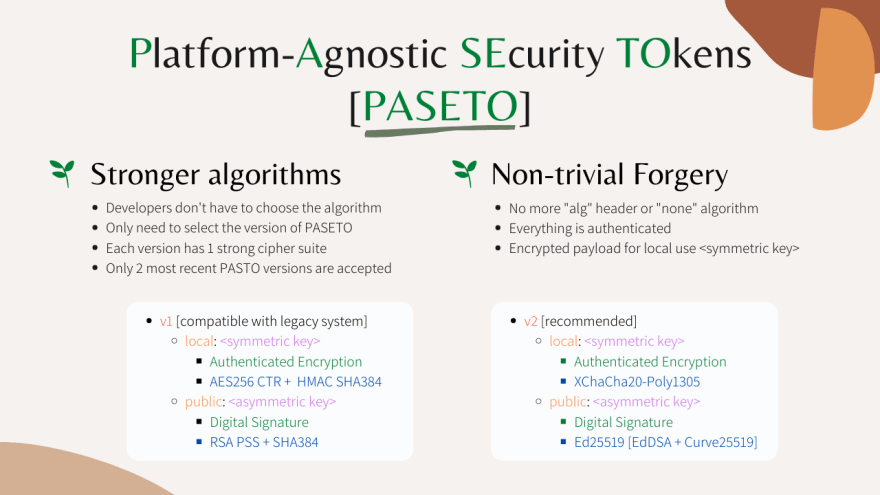

# Почему PASETO лучше JWT для аутентификации с использованием токенов?

[Оригинал](https://dev.to/techschoolguru/why-paseto-is-better-than-jwt-for-token-based-authentication-1b0c)

## JWT или PASETO

В настоящее время аутентификация с использованием токенов становится все 
более популярной при разработке веб и мобильных приложений.

Существует множество различных типов токенов, но среди них JSON веб-токен 
(или JWT) является одним из наиболее широко используемых.

Однако за последние несколько лет мы также обнаружили несколько проблем, 
связанных с безопасностью JSON веб-токена, в основном из-за плохо 
разработанного стандарта.

Поэтому в последнее время люди начали переходить на другие типы токенов, такие 
как PASETO, которые обещают повысить безопасность приложения.

В этой лекции мы узнаем всё о проблемах, связанных с безопасностью JWT, и о 
том, как PASETO решает все эти проблемы.

Ниже:
* Ссылка на [плейлист с видео лекциями на Youtube](https://bit.ly/backendmaster)
* И на [Github репозиторий](https://github.com/techschool/simplebank)

## Аутентификация с использованием токенов

Во-первых, давайте немного поговорим об аутентификации с использованием 
токенов.

По сути, в этом механизме аутентификации клиент делает первый запрос для входа 
пользователя в систему, где он предоставляет серверу имя пользователя и пароль.


Сервер проверяет правильность имени пользователя и пароля. Если да, он создаст 
и подпишет токен своим секретным или приватным ключом, а затем отправит обратно 
клиенту ответ `200 OK` вместе с подписанным токеном доступа.

Он называется токеном доступа, потому что позже клиент будет использовать этот 
токен для доступа к другим ресурсам на сервере.

Например, предположим, что клиент хочет получить список банковских счетов, 
принадлежащих вошедшему в систему пользователю. Затем он сделает `GET` запрос по 
адресу `/accounts` к серверу, встраивая токен доступа пользователя в 
заголовок запроса.


Получив этот запрос, сервер проверит, является ли переданный токен 
валидным или нет. Если он валиден, запрос будет авторизован, и клиенту будет 
отправлен ответ `200 OK` со списком банковских счетов пользователя.

Обратите внимание, что токен доступа обычно имеет срок действия, после которого 
он истекает. И в течении этого срока клиент может использовать один и тот же 
токен для отправки множества запросов на сервер.

Вот как работает аутентификация с использованием токенов.

## JSON веб-токен

Теперь давайте поговорим о JSON веб-токенах! Вот пример JSON веб-токена:


Это строка в кодировке base64, состоящая из 3 основных частей, разделенных 
точкой.

Первая часть (выделена красным) — это заголовок токена. Когда мы декодируем 
эту часть, мы получаем объект JSON, который содержит тип токена (`JWT`) и 
алгоритм, используемый для подписи токена: в данном случае `HS256`.

Вторая часть (фиолетового цвета) токена — это данные полезной нагрузки. В 
этой части мы храним информацию о вошедшем в систему пользователе, например, 
имя пользователя, а также временную метку, после которой этот токен будет
считаться не валидным.


Вы можете изменять на свой вкус эту полезную нагрузку в формате JSON для 
хранения любой другой информации, которую вы хотите. В примере на рисунке 
у нас также есть поле ID для уникальной идентификации токена. Оно 
пригодится, если мы хотим отозвать доступ по этому токену в случае его утечки.

Имейте в виду, что все данные, хранящиеся в JWT, закодированы только в 
`base64`, и не зашифрованы. Таким образом, вам не нужен секретный/приватный 
ключ сервера для декодирования его содержимого.

Это также означает, что мы можем легко кодировать данные заголовка и 
полезной нагрузки без ключа. Так как же сервер может проверить 
подлинность токена доступа?

Ну для этого как раз используется третья часть токена: цифровая подпись 
(выделена синим). Если вы не знаете, как работает алгоритм цифровой подписи, 
то я рекомендую вам прочитать [мой пост о SSL/TLS](https://dev.to/techschoolguru/a-complete-overview-of-ssl-tls-and-its-cryptographic-system-36pd), 
прежде чем продолжить.


Идея проста, только у сервера есть секретный/приватный ключ для подписи 
токена. Поэтому, если хакер попытается создать поддельный токен без 
правильного ключа, то это будет легко обнаружено сервером в процессе проверки.

Стандарты JWT предоставляют множество различных типов алгоритмов цифровой 
подписи, но их можно разделить на 2 основные категории.

## Алгоритм с симметричным ключом

Первый — это алгоритм с симметричным ключом, в котором один и тот же 
секретный ключ используется как для подписи, так и для проверки токенов.


А так как ключ всего один, то его следует держать в секрете. Таким образом, 
этот алгоритм подходит только для локального использования или, другими 
словами, для внутренних сервисов, где секретный ключ может использоваться в 
общем доступе.

К этой категории симметричных ключей относятся некоторые конкретные 
алгоритмы: `HS256`, `HS384` и `HS512`.

Здесь `HS256` — это комбинация `HMAC` и `SHA-256`. `HMAC` означает [код 
аутентификации сообщений, использующий хеш-функции](https://en.wikipedia.org/wiki/HMAC), а `SHA` — [алгоритм 
криптографического хеширования](https://en.wikipedia.org/wiki/Secure_Hash_Algorithms). 
В то время как `256/384/512` - это количество бит в результате.


Алгоритм с симметричным ключом очень эффективен и подходит для большинства 
приложений.

Однако мы не можем использовать этот алгоритм, если существует внешний 
сторонний сервис, который хочет проверить токен, потому что в этом случае мы 
должны предоставить ему наш секретный ключ.

В этом случае мы должны использовать вторую категорию: алгоритм с 
асимметричным ключом.

## Алгоритм с асимметричным ключом

В этом случае вместо одного секретного ключа используется пара ключей.


Приватный ключ используется для подписи токена, а публичный ключ используется
только для его проверки.

Поэтому мы можем легко поделиться нашим открытым ключом с любыми внешними 
сторонними сервисами, не беспокоясь об утечке нашего приватного ключа.

В этой категории асимметричных ключей существует несколько групп алгоритмов, 
например, `RS` группа, `PS` группа или `ES` группа.


Здесь `RS256` по сути представляет собой алгоритм `RSA` с `PKCSv1.5` и `SHA256`.

`PS256` также является алгоритмом `RSA`, но с вероятностной схемой подписи и 
`SHA256`. Он является более безопасным по сравнению `PKCSv1.5`.

И, наконец, `ES256` — это просто алгоритм цифровой подписи на эллиптических кривых 
с `SHA256`.

## Проблемы, связанные с JWT

Итак, пока кажется, что JWT — хороший стандарт, и он предоставляет нам 
большую гибкость в выборе любых алгоритмов подписи, которые мы захотим. 
Так в чем заключаются проблемы, связанные с ним?

## Криптографически не стойкие алгоритмы

Итак, первая проблема — слабая криптографическая стойкость алгоритмов 
подписи. JWT предоставляет разработчикам слишком много алгоритмов на выбор, 
включая алгоритмы, которые уже известны своей уязвимостью, например:

* `RSA` с `PKCSv1.5` подвержена атакам, связанным с дополнениями (padding 
  oracle attack).
* Или `ECDSA` подвержена атаке с использованием неправильной кривой 
  (invalid-curve attack).


Разработчикам, не имеющим большого опыта в области безопасности, будет сложно 
понять, какой алгоритм лучше всего использовать.

Тот факт, что JWT предоставляет разработчикам слишком большую гибкость в 
выборе алгоритма, — это все равно что выстрел себе в ногу.

## Очень легко подделать токен

Но это ещё не самое плохое. Использование JSON веб-токенов настолько упрощает 
подделку токенов, что, если вы не будете тщательно всё продумывать в своей 
реализации или выберете плохо реализованную библиотеку для своего проекта, 
ваша система легко станет уязвимой целью.

Один из недостатков JWT заключается в том, что он включает алгоритм подписи 
в заголовок токена.

Из-за этого, как мы видели в прошлом, злоумышленник может просто установить 
для заголовка `alg` значение `none`, чтобы обойти процесс проверки подписи.

Конечно, эта проблема была обнаружена и исправлена во многих библиотеках, но 
вам следует проверить, что этой уязвимости нет в библиотеке, разработанной 
сообществом, которую вы выбрали для вашего проекта.


Еще одна более опасная потенциальная атака — намеренно установить в заголовке 
алгоритма заголовок с симметричным ключом, например `HS256`, зная при этом, что 
сервер на самом деле использует алгоритм с асимметричным ключом, например `RSA`, 
для подписи и проверки токена.

Давайте я объясню, что имею в виду!

Понятно, что публичный `RSA` ключ сервера будет доступен общественности, потому 
что это публичный ключ.

Таким образом, хакер может просто создать фальшивый токен 
пользователя-администратора, где он намеренно задал в заголовке алгоритм 
`HS256`, который является алгоритмом с симметричным ключом.

Затем он просто подписывает этот токен публичным ключом сервера и использует 
его для доступа к ресурсам на сервере.


Теперь имейте в виду, что сервер обычно использует алгоритм `RSA`, такой как 
`RS256`, для подписи и проверки токена, поэтому он будет использовать публичный
`RSA` ключ в качестве ключа для проверки подписи токена.

Однако, поскольку в заголовке алгоритма токена указано `HS256`, сервер 
проверит подпись с помощью этого симметричного алгоритма `HS256` вместо `RSA`.

А поскольку хакер использует тот же ключ для подписи полезной нагрузки токена, 
этот процесс проверки подписи будет успешным, и запрос хакера будет авторизован.

Это очень простой вид атаки, но в то же время настолько мощный и опасный, что
такое действительно случалось в прошлом, потому что разработчики не проверяли 
заголовок алгоритма перед проверкой подписи токена.

Таким образом, чтобы предотвратить эту атаку, крайне важно, чтобы в коде 
вашего сервера вы проверяли заголовок алгоритма токена, чтобы убедиться, что 
он совпадает с тем, который ваш сервер использует для подписи и проверки токенов.


Итак, теперь вы знаете, почему JSON веб-токен не является хорошо проработанным 
стандартом. Он открывает двери для многих потенциальных угроз.

Поэтому многие люди стараются держаться от него подальше и перейти на что-то 
более надежное.

## PASETO — токен безопасности, не зависящий от платформы (Platform Agnostic Security Token)

PASETO или Platform Agnostic Security Token, — это одна из самых успешных 
разработок, широко признанная сообществом как наиболее защищенная альтернатива 
JWT.

## Криптографически стойкие алгоритмы

Он решает все проблемы JSON веб-токена, во-первых, предоставляя криптографически 
стойкие алгоритмы подписи из коробки.

Разработчикам больше не нужно выбирать алгоритм. Вместо этого им нужно только 
выбрать версию PASETO, которую они хотят использовать.


Каждая версия `PASETO` уже реализована с одним набором надежных шифров. И в 
любой момент будут активны не более 2 последних версий `PASETO`.

На данный момент две активные версии `PASETO` — это версия 1 и версия 2.

## PASETO версия 1

Версия 1 устарела и должна использоваться только для устаревших систем, 
которые не могут использовать современную криптографию.

Подобно JWT, PASETO также содержит две категории алгоритмов для двух 
основных вариантов использования.

Для локальных или внутренних сервисов мы используем алгоритм с симметричным 
ключом.


Но в отличие от JWT, который только кодирует полезную нагрузку с помощью 
base64 и подписывает токен, PASETO фактически шифрует и аутентифицирует все 
данные в токене с помощью секретного ключа, используя криптографически
стойкий алгоритм аутентифицированного шифрования с присоединёнными данными 
(или `AEAD`). Если вы не знаете, что такое AEAD, можете посмотреть [мое видео 
о SSL/TLS](https://dev.to/techschoolguru/why-paseto-is-better-than-jwt-for-token-based-authentication-1b0c).

Алгоритм `AEAD`, используемый в `PASETO` версии 1, представляет собой `AES256 CTR` 
с `HMAC SHA384`.

Для общедоступных случаев, когда существуют внешние сервисы, которым необходимо 
проверить токен, мы должны использовать алгоритм с асимметричным ключом.

В этом случае `PASETO` использует тот же подход, что и `JWT`, что означает, что 
он не шифрует данные токена, а только кодирует их в base64 и использует 
приватный ключ для подписи содержимого цифровой подписью.


В `PASETO` версии 1 выбран алгоритм асимметричного ключа — `RSA PSS` с 
`SHA384`.

## PASETO версия 2

В последней версии `PASETO` (версия 2) используются два более безопасных и 
современных алгоритма.

Для случая с локальным симметричным ключом используется `XChacha20` с 
алгоритмом `Poly1305`.


А для случая с открытым асимметричным ключом используется алгоритм цифровой 
подписи кривой Эдварда с кривой `25519`.

Этот выбор связан с повышением безопасности, так же как по аналогии `TLS 1.3` 
был разработан вместо старой версии `TLS 1.2`, а также одновременного упрощения 
и сокращения количества наборов шифров TLS.


## Сложно подделать токен

Из-за структуры PASETO, подделать токен становится не просто.

Поскольку заголовка с алгоритмом больше нет, злоумышленник не может задать 
для него значение `none` или заставить сервер использовать алгоритм, который 
он выбрал в этом заголовке.



Всё в токене также аутентифицируется с помощью `AEAD`, поэтому его невозможно 
подделать.

Более того, если вы используете локальный алгоритм с симметричным ключом, 
полезная нагрузка теперь зашифрована, а не просто закодирована, поэтому 
хакеры не могут прочитать или изменить данные, хранящиеся в токене, не зная 
секретного ключа сервера.

Звучит потрясающе, не правда ли?

На следующей лекции я покажу вам, как реализовать `JWT` и `PASETO` токены 
с помощью Golang.

Вы увидите, что `PASETO` не только делает токен более безопасным, но также проще 
и его намного легче реализовать по сравнению с `JWT`.

А пока давайте посмотрим на структуру `PASETO` токена.


Это `PASETO` токен версии 2 для локального использования. Токен состоит из 4 
основных частей, разделенных точкой.

Первая часть — это версия `PASETO` (обозначена красным), то есть `version 2`.

Вторая часть — назначение токена, предназначается ли он для локального (`local`) или 
общедоступного (`public`) использования? В данном случае он является локальным, 
что (`local`) означает применение симметричного алгоритма шифрования с 
проверкой подлинности.

Третья часть (зеленого цвета) — это основное содержимое или полезная 
нагрузка токена. Обратите внимание, что он зашифрован, поэтому, если мы 
расшифруем его с помощью секретного ключа, то результат будет состоять из трёх 
частей:


* Во-первых, тела полезной нагрузки. В этом случае мы просто храним простое 
  сообщение и время истечения срока действия токена.
* Во-вторых, значение `nonce`, которое используется как в процессе 
  шифрования, так и в процессе аутентификации сообщения.
* И, наконец, тег проверки подлинности сообщения для проверки подлинности 
  зашифрованного сообщения и связанных с ним незашифрованных данных.


В нашем случае незашифрованными данными являются версия, назначение и футер 
токена (выделен фиолетовым цветом).

Вы можете хранить любую общедоступную информацию в футере, потому что она не 
будет зашифрована, как тело полезной нагрузки, а будет только закодирована в 
`base64`. Таким образом, любой, у кого есть токен, может декодировать его, 
чтобы прочитать данные в футере.


В данном случае, если раскодировать футер, то получим строку Paragon Initiative 
Enterprises - название команды, которая изобрела `PASETO`.

Обратите внимание, что футер не является обязательным, поэтому у вас может быть
`PASETO` токен без футера. Например, это другой пример PASETO токен для случая 
публичного использования:


Он состоит всего из 3 частей, без футера. Первая часть — это версия `PASETO`, то 
есть `version 2`.

Вторая часть — это его назначение: в данном случае публичное (`public`) 
использование, то есть для подписи токена используется алгоритм цифровой 
подписи с асимметричным ключом, а его полезные данные не будут зашифрованы, а 
будут только закодированы в `base64`.

Как видите зеленая часть полезной нагрузки на самом деле является 
закодированным телом, которое мы можем легко декодировать, чтобы получить 
следующий объект JSON.

```json
{
  "data": "this is a signed message",
  "exp": "2039-01-01T00:00:00+00:00"
}
```


В то время как синяя часть полезной нагрузки — это подпись токена, созданная 
алгоритмом цифровой подписи с использованием приватного ключа.

Сервер будет использовать свой парный публичный ключ для проверки подлинности 
этой подписи.


И на этом закончим сегодняшнюю лекцию об аутентификации с использованием 
токенов.

Мы узнали о недостатках при проектировании `JSON Web Token`, которые в прошлом 
приводили к множеству проблем с безопасностью, и о том, как был изобретен 
`PASETO`, чтобы исправить все эти проблемы и, таким образом, значительно 
облегчить жизнь нашим разработчикам.

Надеюсь, вам понравилась эта статья, и до встречи в следующей, где мы напишем 
код для создания и проверки `JWT` и `PASETO` токенов в Golang.