# Устанавливаем и используем Docker + Postgres + TablePlus для создания схема БД

[Оригинал](https://dev.to/techschoolguru/install-use-docker-postgres-table-plus-to-create-db-schema-44he)

Добро пожаловать на мастер-класс по бэкенду!

На [предыдущей лекции](https://dev.to/techschoolguru/design-db-schema-and-generate-sql-code-with-dbdiagram-io-4ko5) мы узнали, как спроектировать схему базы данных с 
помощью [dbdiagram.io](https://dbdiagram.io/home).

Сегодня мы узнаем, как установить `Docker Desktop` на локальный компьютер, а 
затем загрузить и запустить контейнер `PostgreSQL`.

Мы также узнаем, как настроить и использовать `TablePlus` для подключения и 
взаимодействия с Postgres, а также использовать его для запуска SQL скрипта, 
созданного нами в предыдущей лекции, для создания схемы базы данных нашего 
приложения Simple Bank.

Вот ссылка на [плейлист с видео лекциями на Youtube](https://bit.ly/backendmaster).

## Устанавливаем docker desktop

Хорошо, давайте начнем с установки docker. На Mac это сделать очень просто! Нам 
просто нужно открыть [этот сайт с docker](https://www.docker.com/products/docker-desktop) и 
нажать «Загрузить».

После загрузки установщика открываем его, и перетаскиваем Docker в папку 
Applications. Вот и все! Docker desktop успешно установлен.

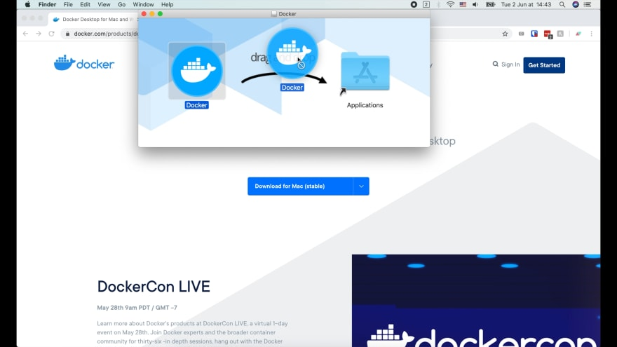

Давайте откроем приложение! Запуск docker desktop займет некоторое время, вы 
можете увидеть его статус, нажав на этот значок.

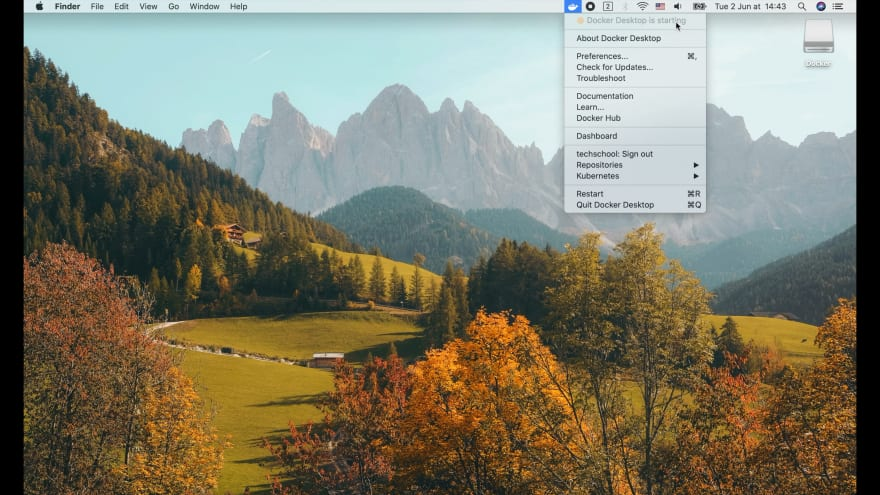

Прямо сейчас там отображается желтый кружок, что означает, что Docker desktop 
все еще запускается. Когда круг станет зеленым, это сигнал, что Docker desktop 
запущен и готов к работе.

Теперь давайте откроем терминал и попробуем выполнить команду. Мы воспользуемся 
командой `docker ps` для вывода списка всех запущенных контейнеров. На данный 
момент это пустой список, потому что мы еще не запускали никаких контейнеров.

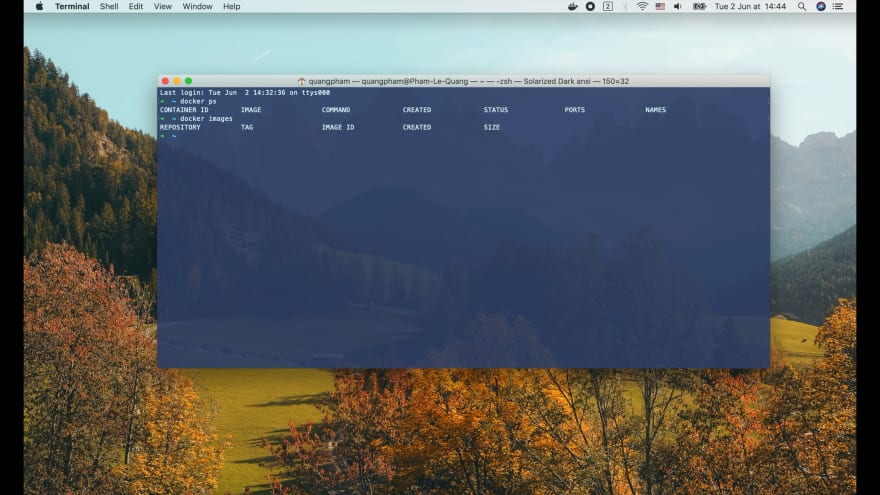

Если мы запустим `docker images`, то будет выведен список всех доступных docker 
образов. Он тоже пока пустой. Итак, давайте попробуем вытянуть наш первый образ.

## Вытягиваем образ Postgres

В этом курсе мы будем использовать PostgreSQL в качестве движка базы данных для
нашего приложения. Итак, давайте перейдём в Docker Hub, чтобы найти его образ.

Выдало несколько результатов. Но мы будем использовать первый, потому что это
официальный образ Postgres.

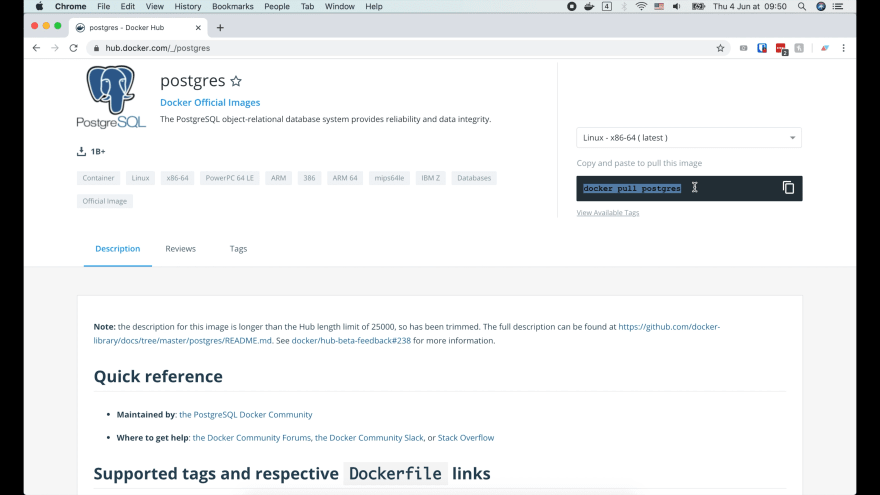

Как видите, мы можем просто выполнить команду `docker pull postgres`, чтобы 
получить этот образ. Эта команда вытянет образ с тегом `latest`. В нашем 
случае с версией 12.

Существует множество других версий с другими тегами. Я часто использую alpine 
образ, так как его размер очень маленький. Благодаря облегченному дистрибутиву 
Alpine Linux.

Итак, давайте откроем терминал и выполним команду:

```shell
docker pull postgres:12-alpine
```

Синтаксис извлечения образа следующий: `docker pull <image_name>:<tag>`.

Мы используем `:` для разделения имени образа и его тега (или версии). Вы 
можете использовать его для загрузки любых других образов любой версии, которую 
вы захотите.

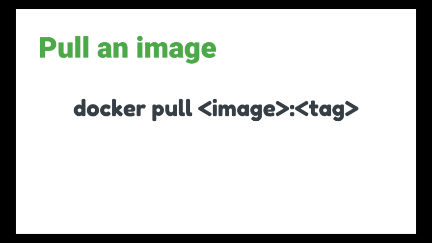

Итак, изображение успешно загружено. Теперь, если мы запустим `docker images`, 
то увидим в окне терминала образ `postgres`.

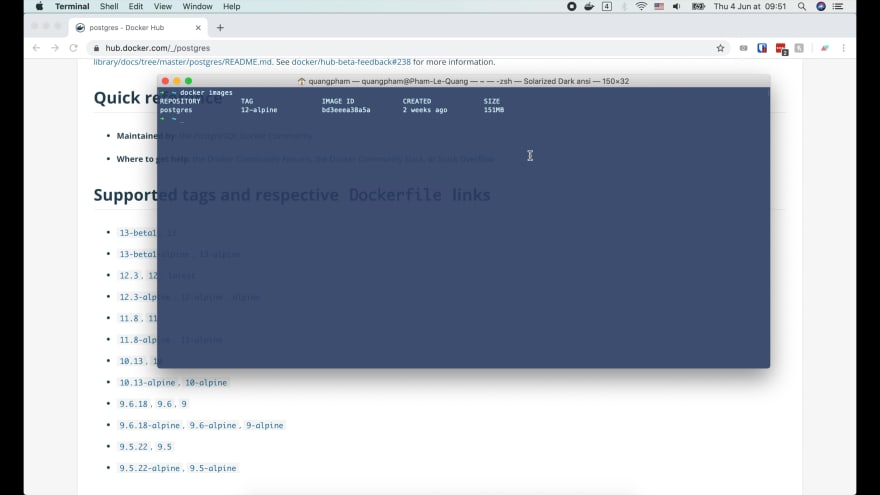

Его тег `12-alpine`. Ему также присваивается уникальный идентификатор образа.
И посмотрите на размер этого образа, всего около `150 МБ`, что довольно мало.

## Запускаем Postgres контейнер

Итак, теперь у нас есть Postgres образ, давайте узнаем, как запустить его, 
чтобы стартовал контейнер сервера базы данных Postgres. Для этого мы используем 
команду `docker run`.

Вот её синтаксис:

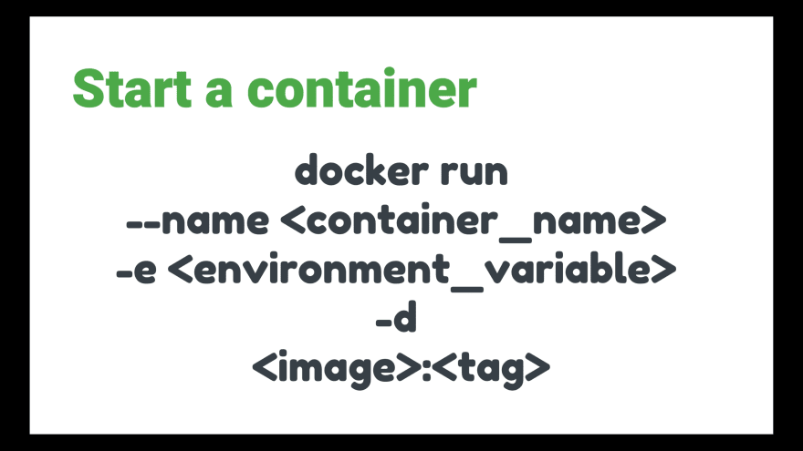

* Она начинается с `docker run`.
* Затем мы используем флаг `--name`, чтобы указать имя контейнера.
* Флаг `-e` используется для настройки переменной окружения контейнера. Для этого 
  конкретного случая мы можем определить пароль для подключения к Postgres.
* Затем используется флаг `-d`, чтобы сообщить Docker, что нужно запустить этот 
  контейнер в фоновом режиме (или в detached mode (режиме, когда терминал 
  отсоединён от запущенного контейнера)).
* Наконец, последний аргумент — это имя образа: `postgres`.

## Сравнение Docker образа и контейнера

Если вы новичок в Docker, важно различать два термина: `image` (образ) и `container`
(контейнер).

По сути, контейнер — это один экземпляр приложения, содержащегося в образе, 
который запускается командой `docker run`.

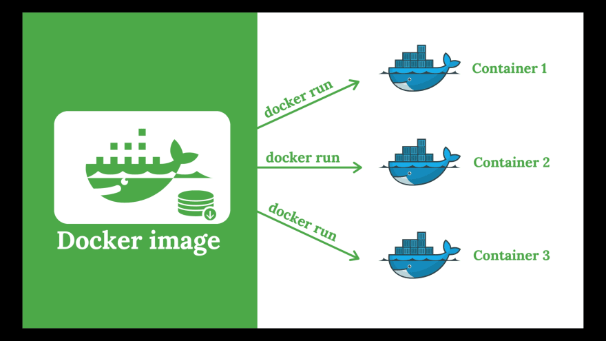

Мы можем запустить несколько контейнеров, используя один образ.

## Переменные окружения Docker

Мы можем также изменить настройки контейнера, поменяв некоторые его переменные 
окружения.

Например, с помощью переменной `POSTGRES_USER` мы можем задать имя пользователя 
суперпользователя для входа в Postgres. Если оно не указано, будет использоваться 
имя пользователя по умолчанию: `postgres`.

Точно так же переменная `POSTGRES_DB` позволяет нам установить имя базы данных по 
умолчанию, которая будет создана при запуске контейнера. В противном случае имя 
базы данных по умолчанию будет таким же, как `POSTGRES_USER`.

Итак, теперь давайте запустим эту команду в терминале:

```shell
docker run --name postgres12 -e POSTGRES_USER=root -e POSTGRES_PASSWORD=secret -d postgres:12-alpine
```

* Здесь я использую имя образа `postgres:12-alpine`, потому что мы хотим 
  запустить эту конкретную версию Postgres.
* В качестве пароля, чтобы не усложнять, я просто использую `secret`.
* Затем я задал имя суперпользователя root с помощью переменной окружения `POSTGRES_USER`.
* Я использую `postgres12` в качестве имени контейнера.

Наконец, последний важный аргумент, который мы должны добавить к этой команде, —
`port mapping` (сопоставление портов).

## Сопоставление портов в Docker

Что это означает?

По сути, контейнер Docker запускается в отдельной виртуальной сети, отличающейся 
от сети компьютера, на котором он работает.

Таким образом, мы не можем просто подключиться к серверу Postgres, работающему 
на порту `5432` в сети контейнера, если только мы не укажем Docker создать некий 
«мост» между нашей localhost сетью и сетью контейнера.

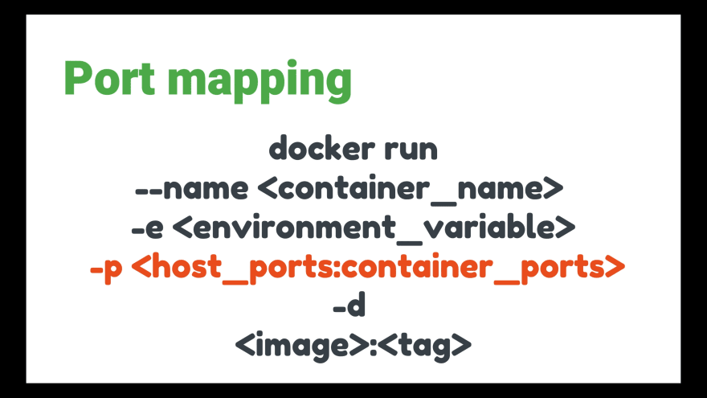

Для этого мы используем флаг `-p`, затем указываем порт хост-сети, двоеточие и 
соответствующий порт контейнера. Они могут быть не одинаковыми, но 
я часто использую один и тот же порт, чтобы его было легче запомнить.

```shell
docker run --name postgres12 -e POSTGRES_USER=root -e POSTGRES_PASSWORD=secret -p 5432:5432 -d postgres:12-alpine
```

Теперь, когда мы нажмем Enter, Docker запустит контейнер Postgres и вернет его 
длинный уникальный идентификатор. Мы можем вывести список всех запущенных 
контейнеров с помощью команды `docker ps`.


* Как видно на рисунке идентификатор контейнера в списке - это короткий префикс
  длинного, который Docker вернул в предыдущей команде.
* Имя образа - `postgres` с тегом `12-alpine`. Если мы запустим команду 
  `docker images`, то увидим, что это тот же самый образ, который мы извлекли 
  ранее с помощью команды `docker pull`.
* В списке приводится и другая информация, такая как время создания контейнера 
  или статус контейнера.
* И сопоставление портов, как и следовало ожидать, сопоставляет порт 5432 на
  localhost с тем же портом в контейнере.
* И, наконец, имя контейнера, `postgres12`, которое мы задали в команде 
  `docker run`.
  
## Получаем доступ к консоли Postgres

Хорошо, теперь когда сервер Postgres готов к работе, давайте попробуем 
подключиться к нему и получить доступ к его консоли.

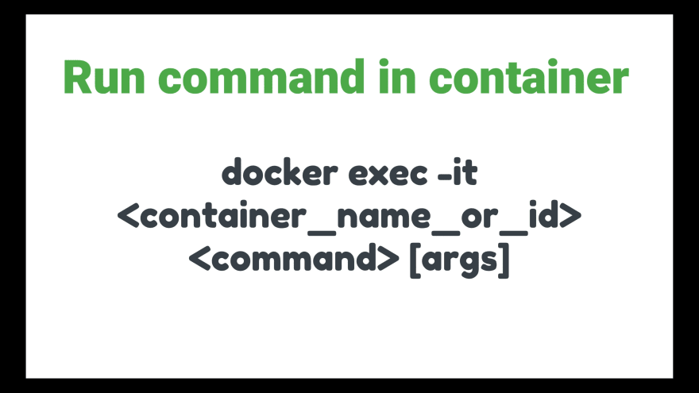

Для этого мы можем использовать команду `docker exec`. Это позволяет нам запускать 
одну конкретную команду внутри работающего контейнера.

```shell
docker exec -it postgres12 psql -U root
```

* Мы используем флаг -it, чтобы указать докеру запустить команду в виде 
  интерактивного сеанса TTY.
* Затем указываем имя контейнера - `postgres12`.
* И, наконец, команда, которую мы хотим запустить внутри `postgres12`. В этом 
  случае мы хотели бы запустить команду `psql` для доступа к консоли Postgres. 
  И здесь мы используем флаг `-U`, чтобы указать `psql`, что мы хотим 
  подключиться под пользователем `root`.

И вуаля, теперь мы внутри консоли Postgres.


Здесь вы могли бы обратить внимание на то, что: Postgres не запрашивает пароль, 
хотя мы установили его при запуске контейнера. Это связано с тем, что по умолчанию 
контейнер Postgres устанавливает доверительную аутентификацию локально, поэтому 
пароль не требуется при подключении с локального хоста (внутри контейнера).

Мы можем попробовать выполнить простой запрос, такой как `select now()`, чтобы 
получить текущее время. И выйти из консоли, нажав `\q` и Enter.

## Просматриваем логи контейнера

Ещё я хотел бы рассказать о том как просмотреть логи контейнера.

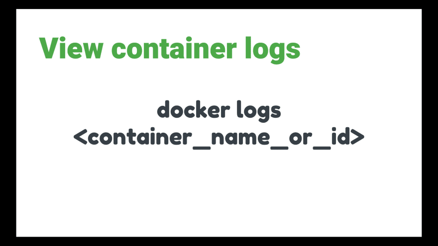

Мы используем команду `docker logs`, после которой следует имя контейнера.
Вы также можете использовать уникальный идентификатор контейнера. Но я 
предпочитаю имя, потому что его легче запомнить.

```shell
docker logs postgres12
```

Благодаря этой команде мы можем легко проверить, что происходит внутри контейнера 
приложения.

Итак, теперь вы знаете, как использовать некоторые основные команды Docker для 
взаимодействия с контейнером Postgres и доступа к его консоли для выполнения 
SQL-запросов.

## Устанавливаем Table Plus

Я покажу вам еще один более простой способ управления базой данных и работы с 
ней с помощью Table Plus.

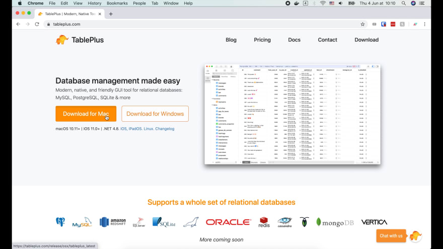

Table Plus — это инструмент с графическим интерфейсом, который может 
взаимодействовать со многими типами СУБД, такими как PostgreSQL, MySQL, Mongo, 
Redis и т. д. Он очень прост в использовании и сильно ускорит 
разработку.

Итак, давайте перейдем на сайт [tableplus.com](https://tableplus.com/), чтобы 
загрузить его. Затем откройте программу установки и перетащите Table Plus в 
папку «Приложения».

## Создаём новое соединение

Теперь давайте откроем приложение. Соединения с базой данных пока нет, поэтому 
давайте создадим новое!


Существует множество вариантов выбора движка базы данных, но в нашем случае мы 
используем PostgreSQL.

* Теперь вводим имя соединения. Я назову его `postgres12`.
* Хост — `localhost` (или `127.0.0.1`), а порт `5432` — по умолчанию.
* Имя пользователя — `root`, а пароль — `secret`, как мы настроили при запуске 
  контейнера postgres.
* Имя базы данных по умолчанию — `root`, такое же, как и имя пользователя, 
  поскольку мы не настроили его явно при запуске контейнера.

Хорошо, давайте нажмем на кнопку Test, чтобы проверить соединение.

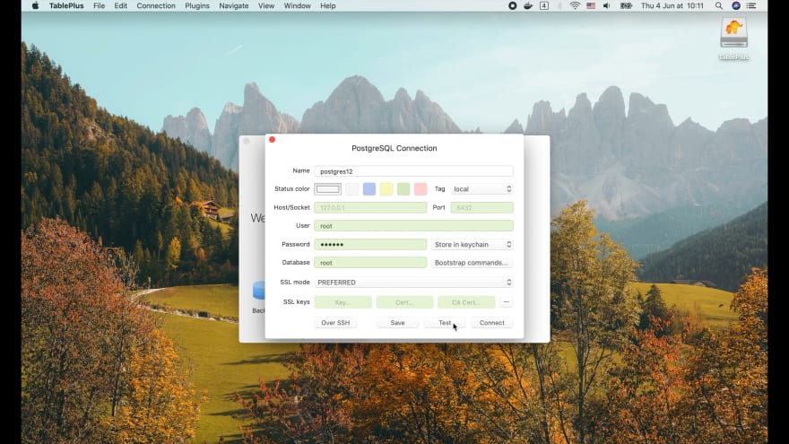

Всё подсвечено зелёным! Итак, теперь мы можем нажать Connect, чтобы подключиться 
к серверу базы данных.

На данный момент там ничего нет, потому что мы еще не создали схему. Но мы все 
равно можем выполнить некоторые запросы, щелкнув значок SQL. Давайте попробуем
запустить команду `select now();`

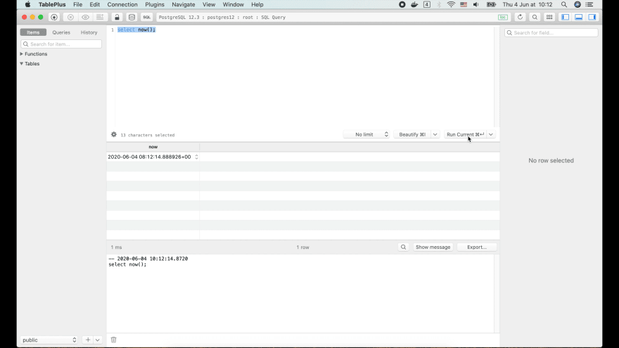

Затем нажмите кнопку `Run current` или просто нажмите `Command Enter`. Результат 
появится в окне ниже.

## Создаём схему для приложения Simple Bank

Теперь давайте откроем файл `simple_bank.sql`, который мы создали в предыдущей 
лекции. Затем выделите все запросы в этом файле и нажмите `Command Enter`, чтобы 
запустить их.

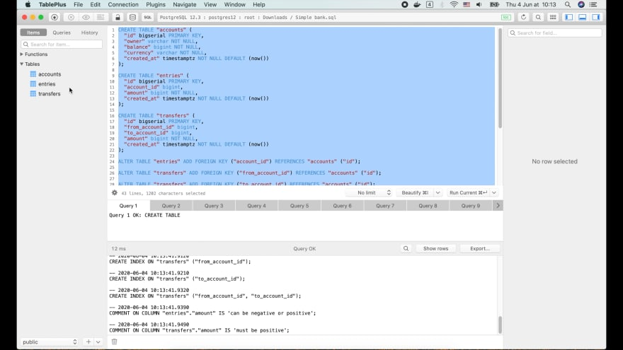

Все команды успешно выполнились!

Теперь, когда мы нажмем `Command R` для обновления информации, слева появятся 3 
таблицы: `accounts`, `entries` и `transfers`.

Мы можем щелкнуть на их имена, чтобы увидеть данные, или выбрать вкладку
`Structure`, чтобы увидеть структуру их схемы.

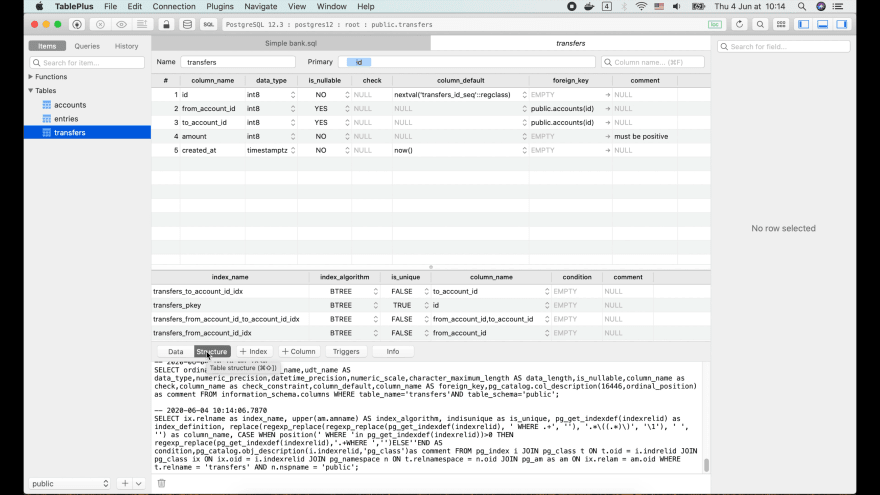

Тут приводится много полезной информации, такой как имя столбца, тип данных, 
значение по умолчанию, внешний ключ, может ли быть столбец равен NULL или нет.

Похоже, что некоторые столбцы внешних ключей теперь могут принимать значения 
NULL, но это не то, что нам нужно, потому что каждая строка в таблицах
`entries` или `transfers` должны быть связаны с соответствующими счетами.

Итак, давайте перейдем на сайт [dbdiagram.io](https://dbdiagram.io/home), чтобы 
исправить это.

## Исправляем определение схемы

Я собираюсь добавить ненулевое ограничение в столбец `account_id` таблицы `entries` 
и столбцы `from_account_id` и `to_account_id` таблицы `transfers`. Затем 
экспортируйте их в PostgreSQL.

```
Table accounts as A {
  id bigserial [pk]
  owner varchar [not null]
  balance bigint [not null]
  currency varchar [not null]
  created_at timestamptz [not null, default: `now()`]

  Indexes {
    owner
  }
}

Table entries {
  id bigserial [pk]
  account_id bigint [ref: > A.id, not null]
  amount bigint [not null, note: 'can be negative or positive']
  created_at timestamptz [not null, default: `now()`]

  Indexes {
    account_id
  }
}

Table transfers {
  id bigserial [pk]
  from_account_id bigint [ref: > A.id, not null]
  to_account_id bigint [ref: > A.id, not null]
  amount bigint [not null, note: 'must be positive']
  created_at timestamptz [not null, default: `now()`]

  Indexes {
    from_account_id
    to_account_id
    (from_account_id, to_account_id)
  }
}
```

Теперь давайте удалим старый файл и изменим имя этого нового файла. Затем 
откройте его с помощью Table Plus.

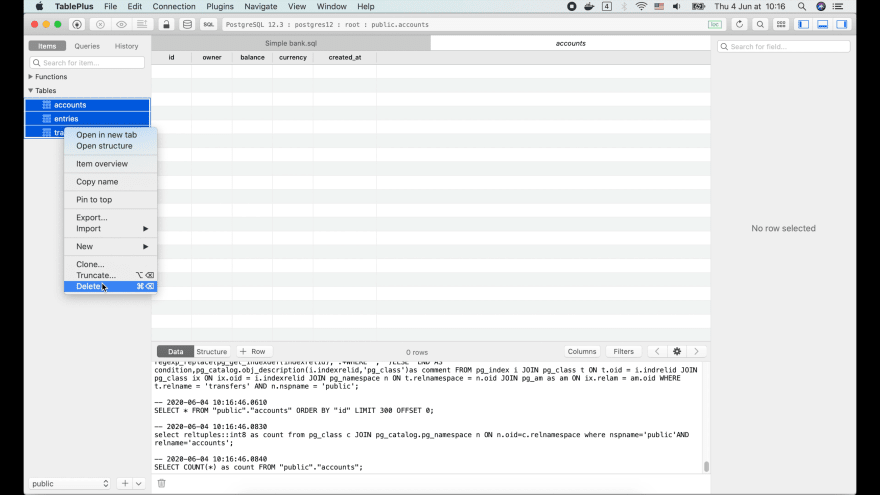

Я выберу все 3 таблицы. Щелкните правой кнопкой мыши и нажмите `Delete`. 
Выберите `Cascade`, чтобы убедиться, что ссылки на другие таблицы будут удалены. 
Затем нажмите `ОК`.

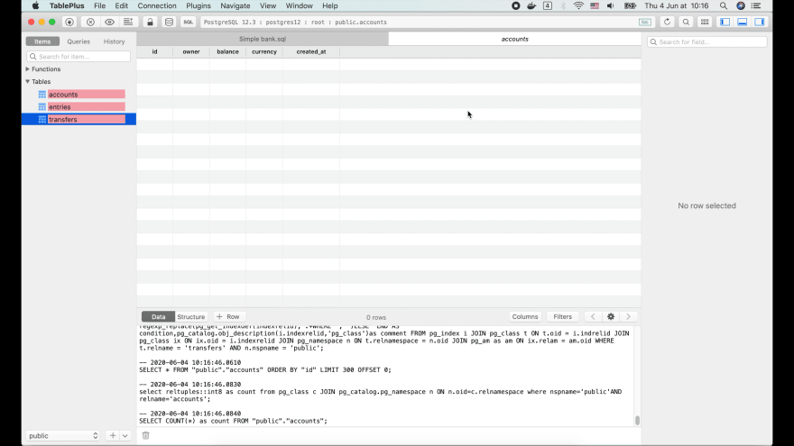

Теперь вы видите, что таблицы все еще на месте, но они отмечены красным. Если 
мы нажмем Command S, чтобы сохранить это состояние, будут выполнены команды 
`DELETE TABLE`, и все таблицы будут удалены.

Хорошо, теперь давайте выберем все запросы в этом новом файле схемы БД 
`simple_bank.sql`. Запустите их на выполнение и обновите окно приложения.

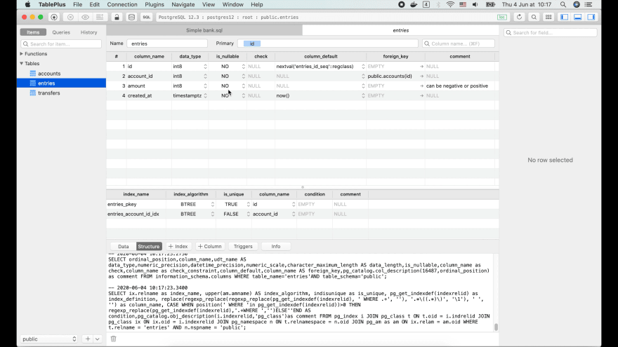

Три таблицы появились снова. Но в этот раз для всех столбцов в таблице `entries`
`is_nullable` равно NO. Это именно то, чего мы добивались.

Также видно комментарий для столбцов `amount`, который мы написали в скрипте с 
определением схемы БД. Отлично!

На этом закончим сегодняшнюю лекцию. Надеюсь, она была интересной и полезной 
для вас.

Большое спасибо за время, потраченное на чтение, и до встречи!