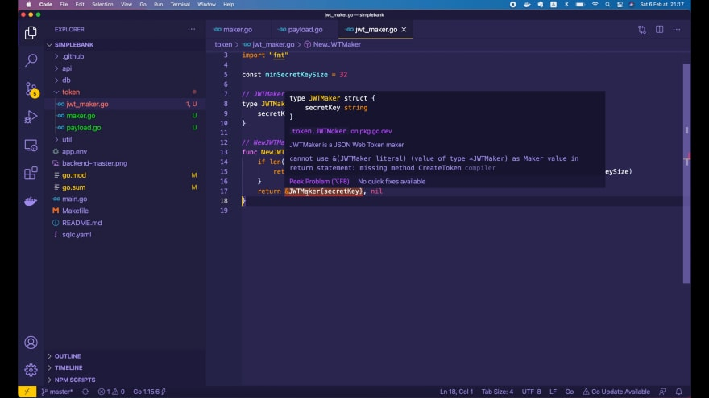
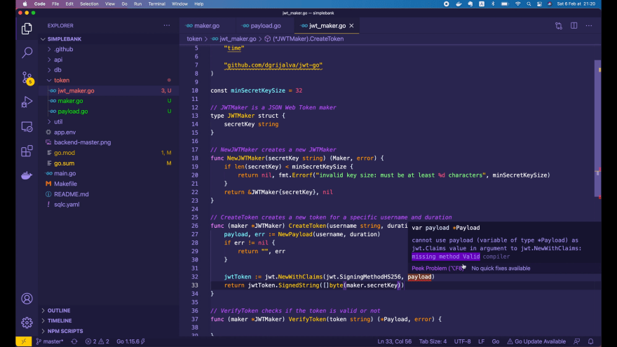
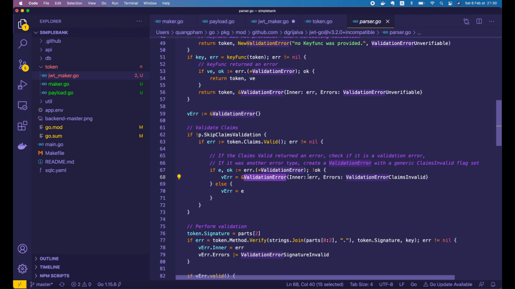
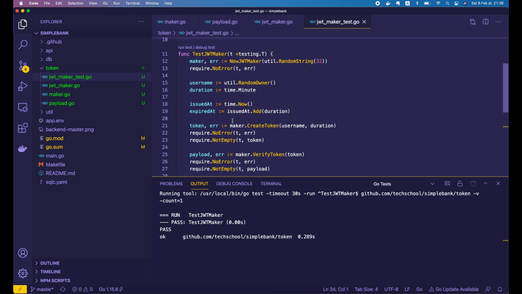
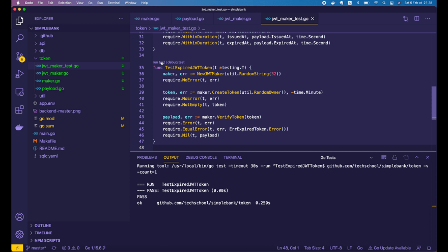
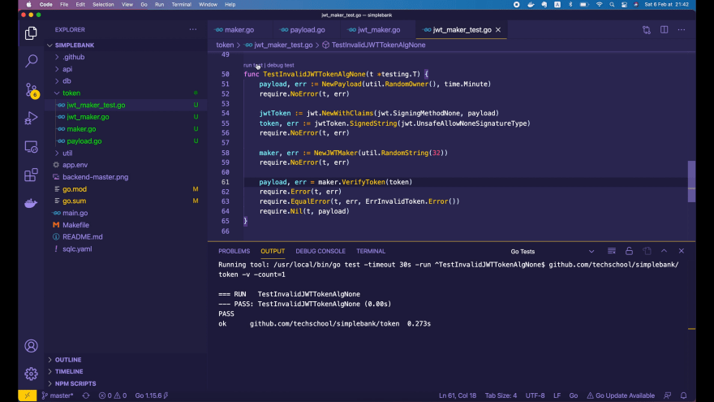
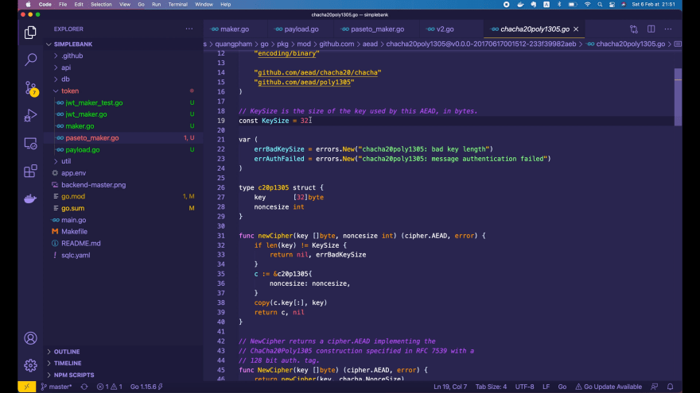
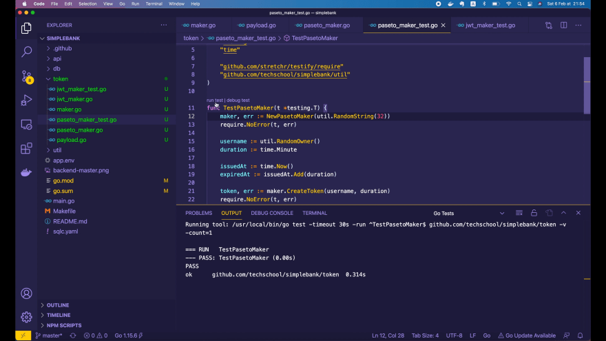
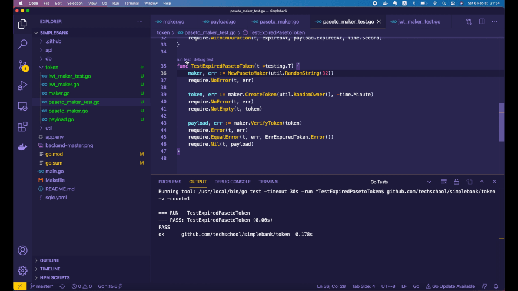

# Как создать и проверить JWT и PASETO токен в Golang

[Оригинал](https://dev.to/techschoolguru/how-to-create-and-verify-jwt-paseto-token-in-golang-1l5j)

Всем привет!

На [предыдущей лекции](https://dev.to/techschoolguru/why-paseto-is-better-than-jwt-for-token-based-authentication-1b0c) 
мы узнали об аутентификации с использованием токенов и о том, почему PASETO лучше, 
чем JWT, с точки зрения практики безопасности.

Сегодня мы узнаем, как их реализовать в Golang, чтобы понять, почему PASETO 
также намного легче и проще в реализации по сравнению с JWT.

Ниже:
* Ссылка на [плейлист с видео лекциями на Youtube](https://bit.ly/backendmaster)
* И на [Github репозиторий](https://github.com/techschool/simplebank)

## Объявляем интерфейс для создания токенов Maker

Итак, давайте начнём!

Во-первых, я собираюсь создать новый пакет под названием `token`. Затем 
создайте внутри этого пакета новый файл `maker.go`.

Идея заключается в том, чтобы задать общий интерфейс `token.Maker`, 
управляющий созданием и проверкой токенов. Позже мы напишем структуры `JWTMaker` 
и `PasetoMaker`, реализующую этот интерфейс. Таким образом, мы можем легко 
переключаться между различными типами токенов, когда захотим.

Таким образом, этот интерфейс будет иметь 2 метода:

```go
type Maker interface {
    CreateToken(username string, duration time.Duration) (string, error)
    VerifyToken(token string) (*Payload, error)
}
```

Метод `CreateToken()` принимает в качестве входных данных строку `username` 
(имя пользователя) и корректный срок действия (`duration`). Он возвращает 
подписанную строку токена или ошибку. По сути, этот метод создаст и подпишет 
новый токен для определенного имени пользователя и корректного срока действия.

Второй метод — `VerifyToken()`, который принимает в качестве входных данных 
строку токена и возвращает объект `Payload` или ошибку. Мы объявим эту 
структуру `Payload` чуть позже. Роль этого метода `VerifyToken()` заключается 
в проверке того, является ли входной токен корректным или нет. Если он 
корректен, метод вернет данные полезной нагрузки, хранящиеся внутри тела 
токена.

## Объявляем структуру Payload для токена

Хорошо, теперь давайте создадим новый файл `payload.go` и определим в нем 
структуру `Payload`. Эта структура будет содержать данные полезной нагрузки 
токена.

Наиболее важным полем является имя пользователя (`Username`), которое 
используется для идентификации владельца токена.

Затем следует поле `IssuedAt`, определяющее время создания токен.

При применении аутентификации с использованием токенов очень важно убедиться, 
что каждый токен доступа имеет короткий срок действия. Поэтому нам нужно 
поле `ExpiredAt` для хранения времени, после которого истечёт срок действия 
токена.

```go
type Payload struct {
    ID        uuid.UUID `json:"id"`
    Username  string    `json:"username"`
    IssuedAt  time.Time `json:"issued_at"`
    ExpiredAt time.Time `json:"expired_at"`
}
```

Обычно этих трех полей должно быть достаточно. Однако, если мы хотим иметь 
механизм для аннулирования некоторых конкретных токенов в случае их утечки, 
нам нужно добавить поле `ID` для уникальной идентификации каждого токена.

Здесь я использую тип UUID для этого поля. Тип определяется в пакете 
[google/uuid](https://github.com/google/uuid), поэтому нам нужно запустить 
команду `go get`, чтобы загрузить и добавить его в проект.

```shell
go get github.com/google/uuid
```

Далее я собираюсь определить функцию `NewPayload()`, которая принимает имя 
пользователя (`username`) и срок действия (`duration`) в качестве входных 
аргументов и возвращает объект `Payload` или ошибку. Эта функция создаст 
новую полезную нагрузку токена с определенным именем пользователя и сроком
действия.

```go
func NewPayload(username string, duration time.Duration) (*Payload, error) {
    tokenID, err := uuid.NewRandom()
    if err != nil {
        return nil, err
    }

    payload := &Payload{
        ID:        tokenID,
        Username:  username,
        IssuedAt:  time.Now(),
        ExpiredAt: time.Now().Add(duration),
    }
    return payload, nil
}
```

Во-первых, мы должны вызвать `uuid.NewRandom()` для создания уникального 
идентификатора токена. Если возникает ошибка, мы просто возвращаем нулевую 
полезную нагрузку и саму ошибку.

В противном случае мы создаем полезную нагрузку, где `ID` — это сгенерированный 
случайный `UUID` токена, `Username` — входное имя пользователя (`username`), 
`IssuedAt` — это `time.Now()`, а `ExpiredAt` — это `time.Now().Add(duration)`.

Затем мы просто возвращаем этот объект полезной нагрузки и нулевую (`nil`)
ошибку. После этого всё готово к работе!

## Реализуем JWT Maker

Сейчас мы собираемся реализовать `JWTMaker`. Нам понадобится пакет JWT для 
Golang, поэтому давайте откроем браузер и поищем по ключевым словам 
`jwt golang`.

В поиске может отобразиться много различных пакетов, но я думаю, что этот 
самый популярный: [https://github.com/dgrijalva/jwt-go](https://github.com/dgrijalva/jwt-go). 
Итак, давайте скопируем его URL-адрес и запустим `go get` в терминале, чтобы 
установить пакет:

```shell
go get github.com/dgrijalva/jwt-go
```

ОК, пакет установлен. Теперь вернемся в Visual Studio Code.

Я собираюсь создать новый файл `jwt_maker.go` внутри пакета `token`. Затем 
объявите структуру `JWTMaker`. Эта структура представляет собой средство для
создания JSON веб токенов, которое реализует интерфейс `token.Maker`.

В этом мастер-классе, я буду использовать алгоритм с симметричным ключом для 
подписи токенов, поэтому в этой структуре будет поле для хранения секретного 
ключа.

```go
type JWTMaker struct {
    secretKey string
}
```

Далее давайте добавим функцию `NewJWTMaker()`, которая принимает строку 
`secretKey` в качестве входных данных и возвращает интерфейс `token.Maker` или 
ошибку в качестве результата.

Возвращая интерфейс, мы гарантируем, что наш `JWTMaker` должен реализовать 
интерфейс `token.Maker`. Вскоре мы увидим, как go компилятор проверит это 
за нас.

Теперь, хотя алгоритм, который мы собираемся использовать, нет требований к 
длине секретного ключа, все же рекомендуется убедиться, что ключ не слишком 
короткий для большей безопасности. Поэтому я объявлю константу 
`minSecretKeySize = 32` (секретный ключ не должен быть меньше 32 символов).

```go
const minSecretKeySize = 32

func NewJWTMaker(secretKey string) (Maker, error) {
    if len(secretKey) < minSecretKeySize {
        return nil, fmt.Errorf("invalid key size: must be at least %d characters", minSecretKeySize)
    }
    return &JWTMaker{secretKey}, nil
}
```

Затем внутри этой функции мы проверяем, меньше ли длина секретного ключа 
`minSecretKeySize` или нет. Если да, то мы просто возвращаем `nil` объект и 
ошибку, сообщающую о том, что ключ должен состоять не менее чем из 32 символов.

В противном случае мы возвращаем новый объект `JWTMaker`, который использует 
входной `secretKey`, и `nil` ошибку.



На рисунке вы видно красное подчеркивание, потому что созданный нами объект 
`JWTMaker` не реализует требуемые методы интерфейса `token.Maker`, который 
является возвращаемым типом этой функции.

Итак, чтобы исправить эту ошибку, мы должны добавить в структуру методы 
`CreateToken()` и `VerifyToken()`.

Давайте скопируем их из интерфейса `token.Maker` и вставим сюда. Затем добавим 
`JWTMaker` перед каждым методом.

```go
func (maker *JWTMaker) CreateToken(username string, duration time.Duration) (string, error) {}

func (maker *JWTMaker) VerifyToken(token string) (*Payload, error) {}
```

Хорошо, теперь красного подчеркивания больше нет! Давайте реализуем метод 
`CreateToken()`!

## Реализуем метод JWT CreateToken

Сначала мы создаем новую полезную нагрузку токена, вызывая 
NewPayload(), и передав в качестве входных параметров имя пользователя 
(`username`) и корректный срок действия (`duration`).

Если ошибка не равна `nil`, мы возвращаем пустую строку вместо токена и ошибку. 
В противном случае мы создаем новый `jwtToken`, вызывая функцию 
`jwt.NewWithClaims()` пакета jwt-go.

Эта функция ожидает два входных аргумента:

* Во-первых, метод подписи (или алгоритм). Я собираюсь использовать `HS256` в 
  этом случае.
* И claims, которые на самом деле будут равны нашей созданной полезной 
  нагрузке.
  
```go
func (maker *JWTMaker) CreateToken(username string, duration time.Duration) (string, error) {
    payload, err := NewPayload(username, duration)
    if err != nil {
        return "", err
    }

    jwtToken := jwt.NewWithClaims(jwt.SigningMethodHS256, payload)
    return jwtToken.SignedString([]byte(maker.secretKey))
}
```

Наконец, чтобы сгенерировать строку с токеном, мы вызываем 
`jwtToken.SignedString()` и передаём `secretKey` после преобразования его в 
срез байт `[]byte`.



Здесь у нас возникла ошибка, поскольку наша структура `Payload` не реализует 
интерфейс `jwt.Claims`. В ней отсутствует один метод - `Valid()`.

Этот метод нужен пакету jwt-go для проверки корректности полезной нагрузки 
токена. Итак, давайте откроем `payload.go`, чтобы добавить этот метод.

Сигнатура этого метода очень проста. Он не принимает никаких входных аргументов 
и возвращает ошибку только в том случае, если токен недействителен. Вы можете 
легко найти этот метод в реализации пакета jwt-go.

```go
var ErrExpiredToken = errors.New("token has expired")

func (payload *Payload) Valid() error {
    if time.Now().After(payload.ExpiredAt) {
        return ErrExpiredToken
    }
    return nil
}
```

Проще всего, но в то же время важнее всего проверить не истёк ли срок действия
токена.

Если `time.Now()` больше `payload.ExpiredAt`, то это означает, что срок действия
токена истёк. Поэтому мы просто возвращаем новую ошибку: срок действия токена 
истек (`errors.New("token has expired")`).

Мы должны объявить эту ошибку как общедоступную константу: `ErrExpiredToken`, 
чтобы можно было проверить тип ошибки извне.

Если срок действия токена не истек, то мы просто возвращаем `nil`. Всё готово! 
Функция Valid завершена.

Теперь вернемся к нашему файлу `jwt_maker.go`. Мы видим, что красное 
подчеркивание под объектом `payload` исчезло.

Поскольку мы импортировали пакет `jwt-go`, мы должны запустить 
`go mod tidy` в терминале, чтобы добавить его в файл `go.mod`.

```
module github.com/techschool/simplebank

go 1.15

require (
    github.com/dgrijalva/jwt-go v3.2.0+incompatible
    github.com/gin-gonic/gin v1.6.3
    github.com/go-playground/validator/v10 v10.4.1
    github.com/golang/mock v1.4.4
    github.com/google/uuid v1.1.4
    github.com/lib/pq v1.9.0
    github.com/o1egl/paseto v1.0.0
    github.com/spf13/viper v1.7.1
    github.com/stretchr/testify v1.6.1
    golang.org/x/crypto v0.0.0-20201221181555-eec23a3978ad
)
```

Я использую версию jwt-go 3.2.0. Возможно, в будущем вы будете использовать 
более новую версию, например 4.0, тогда сигнатуры функций и интерфейса могут 
отличаться. Однако реализация будет более или менее похожей.

Хорошо, теперь метод `CreateToken()` готов. Перейдем к методу `VerifyToken()`.

## Реализуем метод JWT VerifyToken

Его реализовать чуть сложнее. Во-первых, мы должны проанализировать токен, 
вызвав `jwt.ParseWithClaims` и передав входную строку с токеном `token`, 
пустой объект `Payload` и ключевую функцию.

Что такое ключевая функция? Ну, по сути, это функция, которая получает 
проанализированный, но непроверенный токен. Вы должны проверить его заголовок, 
чтобы убедиться, что алгоритм подписи соответствует тому, который вы
используете для подписи токенов.

Затем, если он совпадает, вы возвращаете ключ, чтобы jwt-go мог использовать 
его для проверки токена. Этот шаг очень важен для предотвращения тривиального 
механизма атаки, о котором я рассказал в [предыдущей лекции](https://dev.to/techschoolguru/why-paseto-is-better-than-jwt-for-token-based-authentication-1b0c).

Итак, я скопирую сигнатуру этой ключевой функции и вставлю в файл. Давайте 
поменяем имя его входного аргумента на `token`, а тип — на `jwt.Token`. Затем 
мы просто передаем `keyFunc` в `ParseWithClaims()`.

```go
func (maker *JWTMaker) VerifyToken(token string) (*Payload, error) {
    keyFunc := func(token *jwt.Token) (interface{}, error) {
        _, ok := token.Method.(*jwt.SigningMethodHMAC)
        if !ok {
            return nil, ErrInvalidToken
        }
        return []byte(maker.secretKey), nil
    }

    jwtToken, err := jwt.ParseWithClaims(token, &Payload{}, keyFunc)
    ...
}
```

В ключевой функции мы можем получить алгоритм подписи через поле 
`token.Method`. Обратите внимание, что его тип — это `SigningMethod`, который 
является просто интерфейсом. Поэтому мы должны попытаться преобразовать его в 
конкретную реализацию.

В нашем случае мы конвертируем его в `SigningMethodHMAC`, потому что 
используем `HS256`, который является экземпляром структуры `SigningMethodHMAC`.

Это преобразование может быть успешным или нет. Если нет, то это означает, что 
алгоритм токена не совпадает с нашим алгоритмом подписи, поэтому токен явно 
недействителен.

Мы должны вернуть `nil` с ошибкой `ErrInvalidToken`. Я объявлю эту новую 
ошибку внутри файла `payload.go`, там же, где и `ErrExpiredToken`. Это разные 
типы ошибок, которые будут возвращены нашей функцией `VerifyToken()`.

```go
var (
    ErrInvalidToken = errors.New("token is invalid")
    ErrExpiredToken = errors.New("token has expired")
)
```

Хорошо, вернемся к `JWTMaker`. Если преобразование прошло успешно, значит, 
алгоритм совпал. Мы можем просто вернуть секретный ключ, который будем 
использовать для подписи токена после преобразования его в срез байт `[]byte`, и 
`nil` ошибку.

Итак, теперь ключевая функция готова. Затем вызовем функцию `ParseWithClaims`.
Если он возвращает ошибку не равную `nil`, то возможны две разных ситуации: либо 
токен недействителен, либо срок его действия истек.

Но теперь всё становится сложнее, когда мы хотим различать эти две ситуации. 
Если мы проследим за реализацией пакета jwt-go, то увидим, что он 
автоматически вызывает функцию `token.Claims.Valid()` под капотом.



И в нашей реализации этой функции мы возвращаем ошибку `ErrExpiredToken`. 
Однако jwt-go скрывает эту исходную ошибку внутри своего собственного объекта 
`ValidationError`.

Поэтому, чтобы определить настоящий тип ошибки, мы должны преобразовать 
возвращаемую функцией `ParseWithClaims()` ошибку в `jwt.ValidationError`.

```go
func (maker *JWTMaker) VerifyToken(token string) (*Payload, error) {
    ...

    jwtToken, err := jwt.ParseWithClaims(token, &Payload{}, keyFunc)
    if err != nil {
        verr, ok := err.(*jwt.ValidationError)
        if ok && errors.Is(verr.Inner, ErrExpiredToken) {
            return nil, ErrExpiredToken
        }
        return nil, ErrInvalidToken
    }

    ...
}
```

Здесь я присваиваю преобразованную ошибку переменной `verr`. Если 
преобразование прошло успешно, мы используем функцию `errors.Is()`, чтобы 
проверить, действительно ли `verr.Inner` является `ErrExpiredToken` или нет.

Если да, то просто возвращаем `nil` вместо полезной нагрузки и 
`ErrExpiredToken`. В противном случае мы возвращаем `nil` и `ErrInvalidToken`.

Если всё прошло без ошибок и токен успешно разобран и проверен, мы попытаемся 
получить данные о его полезной нагрузке, преобразовав `jwtToken.Claims` в 
объект `Payload`.

```go
func (maker *JWTMaker) VerifyToken(token string) (*Payload, error) {
    keyFunc := func(token *jwt.Token) (interface{}, error) {
        _, ok := token.Method.(*jwt.SigningMethodHMAC)
        if !ok {
            return nil, ErrInvalidToken
        }
        return []byte(maker.secretKey), nil
    }

    jwtToken, err := jwt.ParseWithClaims(token, &Payload{}, keyFunc)
    if err != nil {
        verr, ok := err.(*jwt.ValidationError)
        if ok && errors.Is(verr.Inner, ErrExpiredToken) {
            return nil, ErrExpiredToken
        }
        return nil, ErrInvalidToken
    }

    payload, ok := jwtToken.Claims.(*Payload)
    if !ok {
        return nil, ErrInvalidToken
    }

    return payload, nil
}
```

Если `ok` не равно `true`, то просто возвращаем `nil` и `ErrInvalidToken`. В 
противном случае мы возвращаем объект полезной нагрузки и `nil` ошибку.

На этом всё! `JWTMaker` готов. Теперь давайте напишем для него unit тест!

## Тестируем JWT Maker

Я собираюсь создать новый файл `jwt_maker_test.go` внутри пакета `token`. 
Затем добавим новую функцию `TestJWTMaker()`, которая принимает на вход объект 
`testing.T`.

Во-первых, мы должны создать новый объект, вызвав функцию `NewJWTMaker()` и 
передав случайный секретный ключ из 32 символов. Мы проверяем, что не возникло
ошибок.

Затем генерируем имя пользователя (`username`) с помощью функции 
`util.RandomOwner()`, и пусть срок действия (`duration`) токена будет равен 
одной минуте.

Давайте также объявим две переменные, чтобы потом сравнить результат:

* время создания токена `issuedAt` будет равно `time.Now()`
* И мы добавляем срок действия (`duration`) к этому времени `issuedAt`, чтобы 
  получить момент времени `expiredAt`, когда токен истечёт.
  
```go
func TestJWTMaker(t *testing.T) {
    maker, err := NewJWTMaker(util.RandomString(32))
    require.NoError(t, err)

    username := util.RandomOwner()
    duration := time.Minute

    issuedAt := time.Now()
    expiredAt := issuedAt.Add(duration)

    token, err := maker.CreateToken(username, duration)
    require.NoError(t, err)
    require.NotEmpty(t, token)

    payload, err := maker.VerifyToken(token)
    require.NoError(t, err)
    require.NotEmpty(t, token)

    require.NotZero(t, payload.ID)
    require.Equal(t, username, payload.Username)
    require.WithinDuration(t, issuedAt, payload.IssuedAt, time.Second)
    require.WithinDuration(t, expiredAt, payload.ExpiredAt, time.Second)
}
```

Хорошо, теперь мы генерируем токен, вызывая функцию `maker.CreateToken`, и 
передав имя пользователя (`username`) и срок действия (`duration`).
Мы проверяем, что не возникло ошибок, и что возвращённый функцией токен не 
пустой.

Затем мы вызываем `maker.VerifyToken`, чтобы убедиться, что токен 
действителен, а также получить данные полезной нагрузки. Мы проверяем, что не 
возникло ошибок, и что объект полезной нагрузки не пустой.

После этого нам нужно проверить все поля объекта полезной нагрузки.

* Во-первых, `payload.ID` не должен быть равен нулю.
* Затем `payload.Username` должно совпадать с входным именем пользователя 
  (`username`).
* Мы используем `require.WithinDuration` для сравнения поля `payload.IssuedAt` 
  с ожидаемым временем создания `issuedAt`, которое мы сохранили выше. Они не 
  должны отличаться более чем на 1 секунду.
* Таким же образом мы сравниваем поле `payload.ExpiredAt` с ожидаемым моментом
  времени `expiredAt`.
  
Всё готово! Давайте запустим этот unit тест!



Он успешно пройден. Здорово! Так мы можем протестировать вариант успешного 
создания токена.

Теперь давайте добавим еще один тест для проверки случая, когда у JWT токена
истек срок действия.

Как и раньше, сначала нам нужно создать новый `JWTMaker`. Затем мы создадим 
токен с истекшим сроком действия, вызвав `maker.CreateToken()`, передав 
случайное имя пользователя (`username`) и отрицательный срок действия 
(`negative duration`).

```go
func TestExpiredJWTToken(t *testing.T) {
    maker, err := NewJWTMaker(util.RandomString(32))
    require.NoError(t, err)

    token, err := maker.CreateToken(util.RandomOwner(), -time.Minute)
    require.NoError(t, err)
    require.NotEmpty(t, token)

    payload, err := maker.VerifyToken(token)
    require.Error(t, err)
    require.EqualError(t, err, ErrExpiredToken.Error())
    require.Nil(t, payload)
}
```

Мы проверяем, что не возникло ошибок, и что токен не пустой. После этого 
проверяем этот возвращенный функцией токен.

На этот раз мы ожидаем, что функция вернёт ошибку. А точнее, она должна 
быть равна `ErrExpiredToken`. Наконец, возвращаемая полезная нагрузка должна 
быть равна `nil`.

Хорошо, давайте запустим тест!



Он успешно пройден. Превосходно!

Последний тест, который мы собираемся написать, — это проверка случая 
недопустимого токена, когда в заголовке для поля алгоритма используется 
`None`. Это хорошо известная методика атаки, о которой я рассказал вам в 
предыдущей лекции.

Сначала я создам новую полезную нагрузку со случайным именем пользователя 
и `username` сроком действия `duration` в одну минуту. Мы проверяем, что не 
возникло ошибок. Затем давайте создадим новый токен, вызвав 
`jwt.NewWithClaims()` с `jwt.SigningMethodNone` и созданной `payload`.

Теперь нам нужно подписать этот токен с помощью метода `SignedString()`. Но 
мы не можем просто использовать здесь любой случайный секретный ключ, потому 
что библиотека jwt-go полностью запретила использовать алгоритм `None` для 
подписи токена.

Мы можем использовать этот метод для тестирования, только когда передаем эту 
специальную константу: `jwt.UnsafeAllowNoneSignatureType` в качестве 
секретного ключа.

Если вы откроете реализацию этого значения, то увидите, что обычно метод подписи
`None` запрещен, за исключением случая, когда ввода входной параметр key 
равен этой специальной константе. Это означает, что вы понимаете, что делаете. 
Убедитесь, что вы используете его только для тестирования, а не в 
продакшен коде.

```go
func TestInvalidJWTTokenAlgNone(t *testing.T) {
    payload, err := NewPayload(util.RandomOwner(), time.Minute)
    require.NoError(t, err)

    jwtToken := jwt.NewWithClaims(jwt.SigningMethodNone, payload)
    token, err := jwtToken.SignedString(jwt.UnsafeAllowNoneSignatureType)
    require.NoError(t, err)

    maker, err := NewJWTMaker(util.RandomString(32))
    require.NoError(t, err)

    payload, err = maker.VerifyToken(token)
    require.Error(t, err)
    require.EqualError(t, err, ErrInvalidToken.Error())
    require.Nil(t, payload)
}
```

Хорошо, давайте вернемся к нашему коду. Мы должны создать новый `JWTMaker`, как 
и в других тестах. И теперь мы вызываем `maker.VerifyToken()` для проверки 
токена, который мы подписали выше.

На этот раз функция также должна вернуть ошибку, и ошибка должна быть 
равна `ErrInvalidToken`. Возвращаемая функцией полезная нагрузка также 
должна быть равна `nil`.

Хорошо, теперь давайте запустим тест!



Он успешно пройден! Превосходно!

Итак, теперь вы знаете, как реализовать и протестировать JWT в Go.

Хотя я думаю, что пакет jwt-go был достаточно хорошо реализован с точки 
зрения предотвращения ошибок безопасности, он все ещё немного сложен и труден 
в использовании, более, чем хотелось бы, особенно часть, которая связана с 
проверкой токена.

## Реализуем PASETO Maker

Теперь я покажу вам, как реализовать тот же интерфейс для создания токенов, 
но с использованием PASETO. Сделать это будет намного проще и понятнее, чем 
для JWT.

Хорошо, давайте откроем браузер и поищем по ключевым словам `paseto golang`. 
Откройте его страницу Github и скопируйте URL-адрес: 
[https://github.com/o1egl/paseto](https://github.com/o1egl/paseto). Затем 
выполните команду `go get`, используя этот URL-адрес, чтобы загрузить пакет:

```go
go get github.com/o1egl/paseto
```

Теперь вернемся к нашему проекту, я создам новый файл: `paseto_maker.go` 
внутри папки `token`.

По аналогии с тем, что мы делали для JWT, давайте объявим структуру 
`PasetoMaker`, которая будет реализовывать тот же интерфейс `token.Maker`, но 
использовать PASETO вместо JWT.

Мы собираемся использовать последнюю версию PASETO на данный момент, то есть 
версию 2. Таким образом, структура `PasetoMaker` будет иметь поле `paseto` типа 
`paseto.V2`.

```go
type PasetoMaker struct {
    paseto       *paseto.V2
    symmetricKey []byte
}
```

И поскольку я просто хочу использовать токен локально для нашего банковского 
API, мы будем использовать симметричное шифрование для шифрования полезной 
нагрузки токена. Поэтому здесь нам нужно поле для хранения симметричного ключа.

Хорошо, теперь давайте добавим функцию `NewPasetoMaker()`, которая принимает 
на вход строку `symmetricKey` и возвращает интерфейс `token.Maker` или ошибку. 
Эта функция создаст новый экземпляр `PasetoMaker`.

Paseto версии 2 использует алгоритм [Chacha20 Poly1305](https://tools.ietf.org/html/rfc7539) 
для шифрования полезной нагрузки. Итак, здесь мы должны проверить длину 
симметричного ключа, чтобы убедиться, что он того размер, который 
требуется алгоритму.

```go
import (
    "github.com/aead/chacha20poly1305"
    "github.com/o1egl/paseto"
)

func NewPasetoMaker(symmetricKey string) (Maker, error) {
    if len(symmetricKey) != chacha20poly1305.KeySize {
        return nil, fmt.Errorf("invalid key size: must be exactly %d characters", chacha20poly1305.KeySize)
    }

    maker := &PasetoMaker{
        paseto:       paseto.NewV2(),
        symmetricKey: []byte(symmetricKey),
    }

    return maker, nil
}
```

Если длина ключа неправильная, мы просто возвращаем `nil` объект и ошибку, 
говорящую о недопустимом размере ключа. Он должен содержать `chacha20poly1305.KeySize` 
количество символов.

В противном случае мы просто создаем новый объект `PasetoMaker`, который 
содержит `paseto.NewV2()` и входной симметричный ключ, преобразованный в срез 
байт `[]byte`.

Затем мы возвращаем этот объект `maker` и `nil` ошибку.

Опять же, здесь мы видим красное подчеркивание под объектом `maker`, потому 
что он еще не реализует интерфейс `token.Maker`. Итак, давайте сделаем то же 
самое, что мы сделали для `JWTMaker`.

Я скопирую эти 2 обязательных метода интерфейса `maker` и добавлю перед ними 
`PasetoMaker`.

```go
func (maker *PasetoMaker) CreateToken(username string, duration time.Duration) (string, error) {}

func (maker *PasetoMaker) VerifyToken(token string) (*Payload, error) {}
```

Хорошо, теперь красного подчеркивание больше нет. Давайте реализуем метод 
`CreateToken()`.

## Реализуем метод PASETO CreateToken

Как и раньше, мы сначала должны создать новую полезную нагрузку (`payload`),
передавая на вход имя пользователя (`username`) и срок действия (`duration`). 
Если ошибка не равна `nil`, мы возвращаем пустую строку и ошибку вызывающей 
стороне.

В противном случае мы возвращаем `maker.paseto.Encrypt()` и передаем 
`maker.symmetricKey` и объект `payload`. Последний аргумент — 
необязательный футер, который нам не нужен, поэтому я передаю 
здесь `nil`.

```go
func (maker *PasetoMaker) CreateToken(username string, duration time.Duration) (string, error) {
    payload, err := NewPayload(username, duration)
    if err != nil {
        return "", err
    }

    return maker.paseto.Encrypt(maker.symmetricKey, payload, nil)
}
```

На этом всё! Код получился компактным и простым, не так ли?

Если мы проследим за реализацией этой функции `Encrypt()`, то увидим, что она 
использует алгоритм шифрования `Chacha Poly`.



И внутри функции `newCipher()` она также проверяет `размер входного ключа`, 
чтобы убедиться, что он равен `32 байтам`.

## Реализуем метод PASETO VerifyToken

Хорошо, теперь вернемся к нашему коду и реализуем метод `VerifyToken()`. Это 
очень просто!

Нам просто нужно объявить пустой объект `payload` для хранения расшифрованных 
данных. Затем вызовите `maker.paseto.Decrypt()`, передавая на вход `token`,
`symmetricKey`, `payload` и `nil` футер.

```go
func (maker *PasetoMaker) VerifyToken(token string) (*Payload, error) {
    payload := &Payload{}

    err := maker.paseto.Decrypt(token, maker.symmetricKey, payload, nil)
    if err != nil {
        return nil, ErrInvalidToken
    }

    err = payload.Valid()
    if err != nil {
        return nil, err
    }

    return payload, nil
}
```

Если ошибка не равна `nil`, мы возвращаем нулевую полезную нагрузку 
`ErrInvalidToken`. В противном случае мы проверим, действителен ли токен, 
вызвав `payload.Valid()`.

Если возникла ошибка, мы просто возвращаем `nil` вместо полезной нагрузки и саму 
ошибку. В противном случае мы возвращаем `payload` и `nil` ошибку.

На этом всё! Очень лаконично и гораздо проще, чем JWT, не так ли?

## Тестируем PASETO Maker

Хорошо, теперь давайте напишем несколько unit тестов!

Я собираюсь создать новый файл: `paseto_maker_test.go` внутри пакета `token`. 
На самом деле тест будет почти идентичен тому, который мы написали для JWT, 
поэтому я просто скопирую его сюда.

Измените его название на `TestPasetoMaker`. Тогда здесь вместо 
`NewJWTMaker()` мы вызываем `NewPasetoMaker()`.

Больше ничего менять не нужно, потому что `PasetoMaker` реализует тот же 
интерфейс `token.Maker`, что и `JWTMaker`.

Давайте запустим тест!



Он успешно пройден!

Теперь давайте скопируем тест для случая токена с истекшим сроком действия! 
Измените его имя на `TestExpiredPasetoToken` и вызов `NewJWTMaker()` на 
`NewPasetoMaker()`.

```go
func TestExpiredPasetoToken(t *testing.T) {
    maker, err := NewPasetoMaker(util.RandomString(32))
    require.NoError(t, err)

    token, err := maker.CreateToken(util.RandomOwner(), -time.Minute)
    require.NoError(t, err)
    require.NotEmpty(t, token)

    payload, err := maker.VerifyToken(token)
    require.Error(t, err)
    require.EqualError(t, err, ErrExpiredToken.Error())
    require.Nil(t, payload)
}
```

Затем запустите тест!



Он тоже успешно пройден. Превосходно!

Нам не нужен последний тест, потому что алгоритма `None` просто не существует в 
`PASETO`. Вы можете написать еще один тест, чтобы проверить случай 
недопустимого токена, если хотите. Я оставляю его в качестве упражнения для 
вас, чтобы вы могли попрактиковаться.

И на этом закончим сегодняшнюю лекции. Мы узнали, как осуществить создание и 
проверку JWT и PASETO токенов доступа, используя Go.

В следующей статье я покажу вам, как использовать их в API входа в систему, 
где пользователи указывают свое имя пользователя и пароль, а сервер 
возвращает токен доступа, если предоставленные учетные данные верны.

Большое спасибо за время, потраченное на чтение, и до скорой встречи на 
следующей лекции!