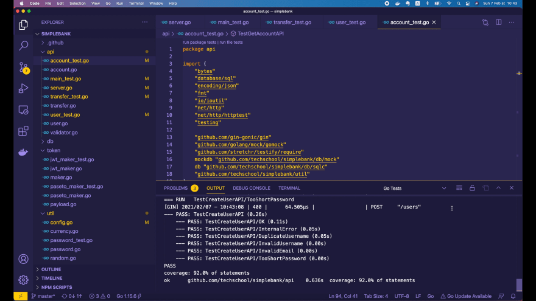
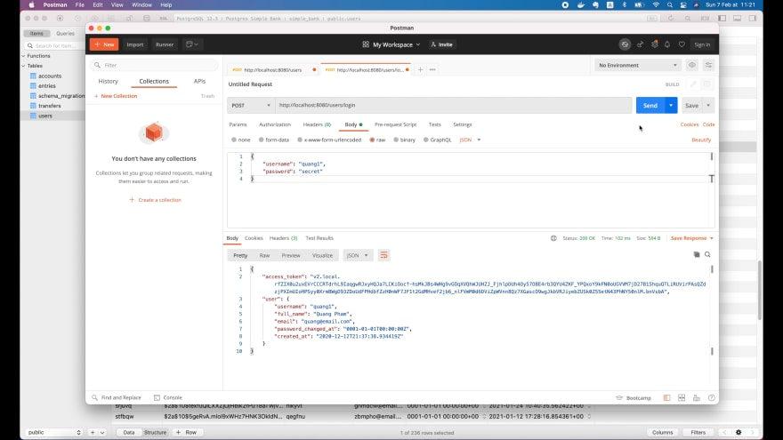
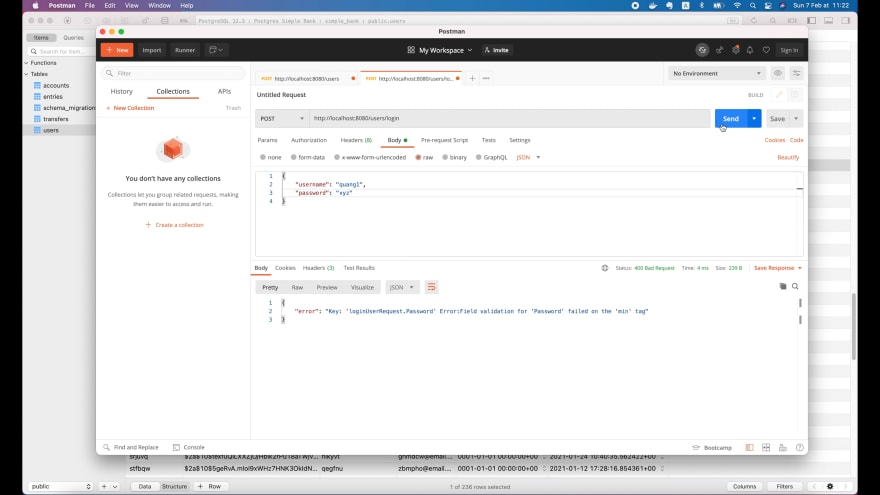
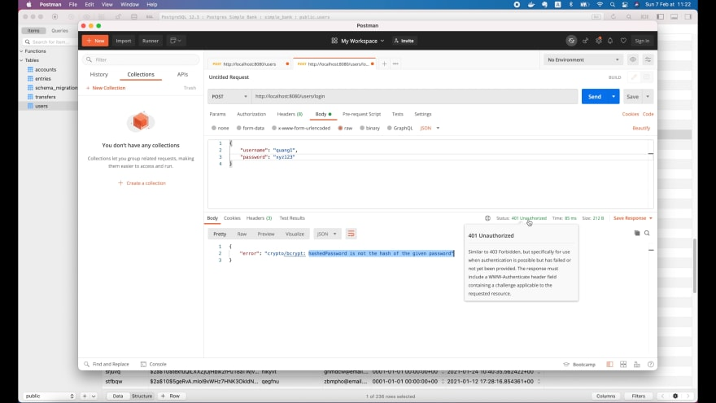
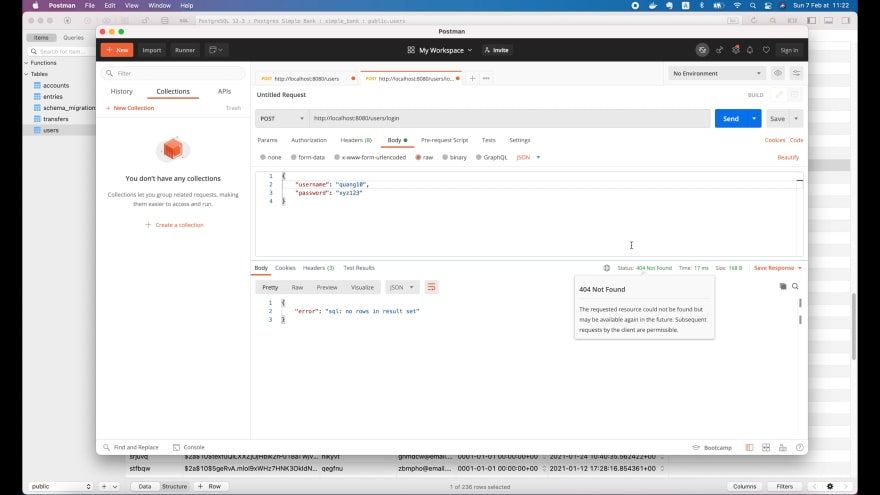
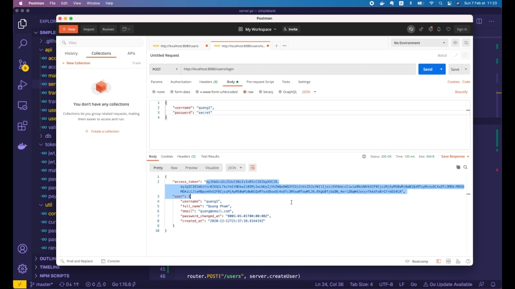

# Реализуем API для входа пользователя в систему, который возвращает PASETO или JWT токен доступа на Go

[Оригинал](https://dev.to/techschoolguru/implement-login-user-api-that-returns-paseto-or-jwt-access-token-in-go-5b1p)

Всем привет! Рад снова видеть вас на мастер-классе по бэкенду!

На [предыдущей лекции](https://dev.to/techschoolguru/how-to-create-and-verify-jwt-paseto-token-in-golang-1l5j)
мы реализовали интерфейс `Maker`, используя JWT и PASETO. Он предоставляет 2 
метода для создания и проверки токенов.

Итак, сегодня мы узнаем, как использовать его для реализации API входа в 
систему, где имя пользователя и пароль предоставляются клиентом, а сервер 
возвращает токен доступа, если эти учетные данные верны.

Ниже:
* Ссылка на [плейлист с видео лекциями на Youtube](https://bit.ly/backendmaster)
* И на [Github репозиторий](https://github.com/techschool/simplebank)

Хорошо, давайте начнем!

## Добавляем Maker в сервер

Первым шагом является добавление `Maker` в API на наш сервер. Итак, давайте 
откроем файл `api/server.go`!

В структуру `Server` я добавлю поле `tokenMaker` типа `token.Maker`.

```go
type Server struct {
    store      db.Store
    tokenMaker token.Maker
    router     *gin.Engine
}
```

Затем давайте инициализируем это поле внутри функции `NewServer()`! Сначала 
нам нужно создать новый объект `maker`. Мы можем использовать для токенов 
либо `JWT`, либо `PASETO`, они оба реализуют один и тот же интерфейс 
`token.Maker`.

Я думаю, что лучше использовать PASETO, поэтому давайте вызовем 
`token.NewPasetoMaker()`. В функцию нужно передать строку с симметричным ключом, 
поэтому нам нужно будет загрузить её из переменной среды. А пока давайте 
просто передадим туда пустую строку в качестве временного значения для подстановки.

Если возвращаемая ошибка не равна `nil`, мы возвращаем `nil` сервер и 
сообщение об ошибке «невозможно создать maker для токенов». `%w` используется 
для обертывания исходной ошибки.

```go
func NewServer(store db.Store) (*Server, error) {
    tokenMaker, err := token.NewPasetoMaker("")
    if err != nil {
        return nil, fmt.Errorf("cannot create token maker: %w", err)
    }

    server := &Server{
        store:      store,
        tokenMaker: tokenMaker,
    }

    ...

    return server, nil
}
```

Итак, теперь нам нужно изменить тип возвращаемого значения функции 
`NewServer()`, чтобы он также включал ошибку (`error`). Затем в команду для
создания объекта `Server` мы добавляем только что созданный объект `tokenMaker`.

Хорошо, теперь вернемся к параметру симметричного ключа. Я собираюсь добавить 
новую переменную среды в файл `app.env`. Назовем его `TOKEN_SYMMETRIC_KEY`.

И поскольку мы используем версию 2 PASETO, в которой используется алгоритм 
`ChachaPoly`, размер этого симметричного ключа должен составлять ровно 
32 байта.

```
TOKEN_SYMMETRIC_KEY=12345678901234567890123456789012
ACCESS_TOKEN_DURATION=15m
```

Мы также должны добавить еще одну переменную для хранения 
срока действия токена доступа. Хорошей практикой является использование очень 
короткого срока действия, например, около 15 минут.

Во-первых, `TokenSymmetricKey` типа `string`. Мы должны указать для него дескриптор 
`mapstructure`, потому что [viper](https://github.com/spf13/viper) использует 
пакет [mapstructure](https://github.com/mitchellh/mapstructure) для считывания 
данных с настройками. Пожалуйста, обратитесь [к лекции 12 курса](https://dev.to/techschoolguru/load-config-from-file-environment-variables-in-golang-with-viper-2j2d), если вы не 
знаете, как использовать viper.

```go
type Config struct {
    ...
    TokenSymmetricKey   string        `mapstructure:"TOKEN_SYMMETRIC_KEY"`
    AccessTokenDuration time.Duration `mapstructure:"ACCESS_TOKEN_DURATION"`
}
```

Следующее поле — `AccessTokenDuration` типа `time.Duration`. И его дескриптор
`mapstructure` должен быть равен названию этой переменной среды: 
`ACCESS_TOKEN_DURATION`.

Как видите, когда тип поля в `Config` — `time.Duration`, мы можем указать 
значение в удобном для человека формате, например: `15m`.

Итак, теперь когда мы загрузили секретный ключ и срок действия токена в 
`Config`, давайте вернемся к файлу `server.go` и используем их. Мы должны 
добавить параметр `config` в функцию `NewServer()`. Затем в вызове 
`token.NewPasetoMaker()` мы передаем `config.TokenSymmetricKey`.

Мы также должны добавить поле `config` в структуру `Server` и сохранить его 
здесь при инициализации объекта `Server`. Мы будем использовать `TokenDuration` 
в этом объекте `config` позже при создании токенов.

```go
type Server struct {
    config     util.Config
    store      db.Store
    tokenMaker token.Maker
    router     *gin.Engine
}

func NewServer(config util.Config, store db.Store) (*Server, error) {
    tokenMaker, err := token.NewPasetoMaker(config.TokenSymmetricKey)
    if err != nil {
        return nil, fmt.Errorf("cannot create token maker: %w", err)
    }
    
    server := &Server{
        config:     config,
        store:      store,
        tokenMaker: tokenMaker,
    }
    
    if v, ok := binding.Validator.Engine().(*validator.Validate); ok {
        v.RegisterValidation("currency", validCurrency)
    }
    
    server.setupRouter()
    return server, nil
}
```

В конце этой функции мы должны вернуть `nil` ошибку. И после этого функция будет
готова к использованию!

Однако, поскольку мы добавили новый параметр конфигурации в функцию 
`NewServer()`, некоторые unit тесты, которые мы написали ранее, перестали
работать. Так что давайте их исправим!

## Исправляем переставшие работать unit тесты

В файле `api/main_test.go` я определю функцию `newTestServer()`, которая 
создаст новый сервер для тестирования. Он принимает объект `testing.T` и 
интерфейс `db.Store` в качестве входных данных. И он вернет объект `Server` 
в качестве результата.

В этой функции давайте создадим новый объект `config` с `TokenSymmetricKey`
равный `util.RandomString` из 32 символов и `AccessTokenDuration` — одной 
минуте.

```go
func newTestServer(t *testing.T, store db.Store) *Server {
    config := util.Config{
        TokenSymmetricKey:   util.RandomString(32),
        AccessTokenDuration: time.Minute,
    }

    server, err := NewServer(config, store)
    require.NoError(t, err)

    return server
}
```

Затем мы создаем новый сервер с этим объектом `config` и интерфейсом 
`store`. Мы проверяем, что не возникло ошибок, и, наконец, возвращаем 
созданный `server`.

Теперь вернитесь к файлу `api/transfer_test.go`. Здесь вместо `NewServer()` мы 
будем вызывать `newTestServer` и передавать объект `testing.T` и имитацию 
`Store`.

```go
func TestTransferAPI(t *testing.T) {
    ...

    for i := range testCases {
        tc := testCases[i]

        t.Run(tc.name, func(t *testing.T) {
            ...

            server := newTestServer(t, store)
            recorder := httptest.NewRecorder()

            ...
        })
    }
}
```

Мы делаем то же самое для сервера в файле `api/user_test.go`, а также в 
файле `api/account_test.go`. В этих файлах есть несколько вызовов 
`NewServer()`, поэтому мы должны изменить их все на `newTestServer()`.

Хорошо, теперь код везде обновлён. Давайте запустим все тесты пакета `api`!



Всё они успешно пройдены! Превосходно! Таким образом, тесты теперь хорошо 
работают с новой структурой `Server`.

Но есть еще одно место, которое нам нужно обновить, это главная точка входа 
нашего сервера: `main.go`.

```go
func main() {
    config, err := util.LoadConfig(".")
    if err != nil {
        log.Fatal("cannot load config:", err)
    }

    conn, err := sql.Open(config.DBDriver, config.DBSource)
    if err != nil {
        log.Fatal("cannot connect to db:", err)
    }

    store := db.NewStore(conn)
    server, err := api.NewServer(config, store)
    if err != nil {
        log.Fatal("cannot create server:", err)
    }

    err = server.Start(config.ServerAddress)
    if err != nil {
        log.Fatal("cannot start server:", err)
    }
}
```

Здесь, в этой функции main(), мы должны добавить `config` к вызову 
`api.NewServer()`. И этот вызов вернет `server` и `error`.

Если `error` не `nil`, мы просто пишем лог, сообщая, что 
"невозможно создать сервер" и завершаем работу. Вот и всё и мы на этом 
закончили!

Теперь пришло время создать API для входа в систему!

## Реализуем обработчик для входа пользователя в систему

Давайте откроем файл `api/user.go`!

Полезная нагрузка запроса к API для входа в систему должна содержать имя 
пользователя (`username`) и пароль (`password`), что очень похоже на 
`createUserRequest`:

```go
type createUserRequest struct {
    Username string `json:"username" binding:"required,alphanum"`
    Password string `json:"password" binding:"required,min=6"`
    FullName string `json:"full_name" binding:"required"`
    Email    string `json:"email" binding:"required,email"`
}
```

Итак, я скопирую эту структуру и вставлю ее в конец этого файла. Затем 
давайте изменим название структуры на `loginUserRequest` и удалим поля 
`FullName` и `Email`, просто оставив `Username` и `Password`.

```go
type loginUserRequest struct {
    Username string `json:"username" binding:"required,alphanum"`
    Password string `json:"password" binding:"required,min=6"`
}
```

Затем давайте определим структуру `loginUserResponse`. Наиболее важным полем, 
которое должно быть возвращено клиенту, является строка 
`AccessToken`. Это токен, который мы создадим с помощью интерфейса `Maker`.

```go
type loginUserResponse struct {
    AccessToken string       `json:"access_token"`
}
```

Помимо токена доступа, мы также можем захотеть вернуть некоторую информацию 
о вошедшем в систему пользователе, как и ту, которую мы вернули в API 
создания пользователя:

```go
type createUserResponse struct {
    Username          string    `json:"username"`
    FullName          string    `json:"full_name"`
    Email             string    `json:"email"`
    PasswordChangedAt time.Time `json:"password_changed_at"`
    CreatedAt         time.Time `json:"created_at"`
}
```

Итак, чтобы эту структуру можно было использовать повторно, я изменю ее 
название на `userResponse`. Это будет тип для поля `User` в этой структуре 
`loginUserResponse`:

```go
type userResponse struct {
    Username          string    `json:"username"`
    FullName          string    `json:"full_name"`
    Email             string    `json:"email"`
    PasswordChangedAt time.Time `json:"password_changed_at"`
    CreatedAt         time.Time `json:"created_at"`
}

type loginUserResponse struct {
    AccessToken string       `json:"access_token"`
    User        userResponse `json:"user"`
}
```

Затем давайте скопируем объект userResponse из обработчика `createUser()` и 
определим функцию `newUserResponse()` в верхней части файла.

```go
func newUserResponse(user db.User) userResponse {
    return userResponse{
        Username:          user.Username,
        FullName:          user.FullName,
        Email:             user.Email,
        PasswordChangedAt: user.PasswordChangedAt,
        CreatedAt:         user.CreatedAt,
    }
}
```

Роль этой функции заключается в преобразовании входного объекта 
`db.User` в `userResponse`. Мы это делаем, потому что внутри структуры 
`db.User` есть конфиденциальные данные, а именно `hashed_password`, которые 
мы не хотим раскрывать клиенту.

Итак, теперь в обработчике `createUser()` мы можем просто вызвать функцию 
`newUserResponse()` для создания объекта ответа сервера.

```go
func (server *Server) createUser(ctx *gin.Context) {
    ...

    user, err := server.store.CreateUser(ctx, arg)
    ...

    rsp := newUserResponse(user)
    ctx.JSON(http.StatusOK, rsp)
}
```

Функция `newUserResponse()` также будет полезна для нашего нового 
обработчика `loginUser()`.

Хорошо, теперь давайте добавим в структуру сервера новый метод: 
`loginUser()`. Как и в других обработчиках API, эта функция будет принимать 
объект `gin.Context` в качестве входных данных.

Внутри мы объявляем объект запроса (`request`) типа `loginUserRequest` и 
вызываем функцию `ctx.ShouldBindJSON()` с указателем на этот объект запроса 
(`request`). Это позволит извлечь все необходимые параметры для API из объекта
запроса (`request`).

```go
func (server *Server) loginUser(ctx *gin.Context) {
    var req loginUserRequest
    if err := ctx.ShouldBindJSON(&req); err != nil {
        ctx.JSON(http.StatusBadRequest, errorResponse(err))
        return
    }

    ...
}
```

Если ошибка (`error`) не `nil`, мы отправляем клиенту ответ со статусом `400 Bad 
Request` вместе с телом `errorResponse()`, чтобы пояснить, почему она 
произошла.

Если ошибки нет, мы найдем пользователя из базы данных, вызвав 
`server.store.GetUser()`, передавая `ctx` и `req.Username`.

```go
func (server *Server) loginUser(ctx *gin.Context) {
    ...

    user, err := server.store.GetUser(ctx, req.Username)
    if err != nil {
        if err == sql.ErrNoRows {
            ctx.JSON(http.StatusNotFound, errorResponse(err))
            return
        }
        ctx.JSON(http.StatusInternalServerError, errorResponse(err))
        return
    }

    ...
}
```

Если ошибка, возвращаемая этим вызовом, не `nil`, то возможны 2 случая:

* Первый случай — когда такого имени пользователя (`username`) не существует, 
  значит ошибка равна `sql.ErrNoRows`. В этом случае мы отправляем ответ 
  со статусом `404 Not Found` клиенту и сразу выходим из функции.
* Второй случай — если возникает непредвиденная ошибка при обращении к базе 
  данных. В этом случае мы отправляем клиенту статус `500 Internal Server 
  Error` и также сразу же выходим из функции.

Если все прошло гладко и ошибок не возникло, нам придется проверить, верен 
ли пароль, предоставленный клиентом. Поэтому мы вызываем `util.CheckPassword()`, 
передавая в неё `req.Password` и `user.HashedPassword`.

```go
func (server *Server) loginUser(ctx *gin.Context) {
    ...

    err = util.CheckPassword(req.Password, user.HashedPassword)
    if err != nil {
        ctx.JSON(http.StatusUnauthorized, errorResponse(err))
        return
    }

    ...
}
```

Если эта функция возвращает не `nil` ошибку, это означает, что предоставленный 
пароль неверен. Мы отправим клиенту ответ со статусом `401 Unauthorized` и 
выходим из функции.

Только когда пароль правильный, мы создаём новый токен доступа для этого 
пользователя.

Давайте вызовем `server.tokenMaker.CreateToken()`, передадим `user.Username` и 
`server.config.AccessTokenDuration` в качестве входных аргументов.

```go
func (server *Server) loginUser(ctx *gin.Context) {
    ...

    accessToken, err := server.tokenMaker.CreateToken(
        user.Username,
        server.config.AccessTokenDuration,
    )
    if err != nil {
        ctx.JSON(http.StatusInternalServerError, errorResponse(err))
        return
    }

    rsp := loginUserResponse{
        AccessToken: accessToken,
        User:        newUserResponse(user),
    }
    ctx.JSON(http.StatusOK, rsp)
}
```

Если возникает непредвиденная ошибка, мы просто возвращаем код состояния 
`500 Internal Server Error`.

В противном случае мы создаём объект `loginUserResponse`, где `AccessToken` — 
это созданный токен доступа, а `User` — это `newUserResponse(user)`. Затем мы 
отправляем этот ответ клиенту с кодом состояния `200 OK`.

И это по сути всё! Функция-обработчик `loginUser()` готова:

```go
func (server *Server) loginUser(ctx *gin.Context) {
    var req loginUserRequest
    if err := ctx.ShouldBindJSON(&req); err != nil {
        ctx.JSON(http.StatusBadRequest, errorResponse(err))
        return
    }

    user, err := server.store.GetUser(ctx, req.Username)
    if err != nil {
        if err == sql.ErrNoRows {
            ctx.JSON(http.StatusNotFound, errorResponse(err))
            return
        }
        ctx.JSON(http.StatusInternalServerError, errorResponse(err))
        return
    }

    err = util.CheckPassword(req.Password, user.HashedPassword)
    if err != nil {
        ctx.JSON(http.StatusUnauthorized, errorResponse(err))
        return
    }

    accessToken, err := server.tokenMaker.CreateToken(
        user.Username,
        server.config.AccessTokenDuration,
    )
    if err != nil {
        ctx.JSON(http.StatusInternalServerError, errorResponse(err))
        return
    }

    rsp := loginUserResponse{
        AccessToken: accessToken,
        User:        newUserResponse(user),
    }
    ctx.JSON(http.StatusOK, rsp)
}
```

## Добавляем маршрут для API входа в систему на сервер

Следующим шагом является добавление на сервер новой конечной точки API, 
которая будет направлять запрос на вход в обработчик `loginUser()`.

Я добавлю его рядом с маршрутом создания пользователя. Итак, `router.POST()`, 
путь должен быть `/users/login`, а функция-обработчик — `server.loginUser()`.

```go
func NewServer(config util.Config, store db.Store) (*Server, error) {
    ...

    router := gin.Default()

    router.POST("/users", server.createUser)
    router.POST("/users/login", server.loginUser)

    ...
}
```

И на этом всё!

Однако эта функция `NewServer()` становится слишком длинной, что затрудняет 
её чтение.

Поэтому я выделю часть с маршрутизацией в отдельный метод структуры `server`. 
Назовем его `setupRouter()`. Затем вставьте туда весь код, связанный с 
маршрутизацией.

```go
func (server *Server) setupRouter() {
    router := gin.Default()

    router.POST("/users", server.createUser)
    router.POST("/users/login", server.loginUser)

    router.POST("/accounts", server.createAccount)
    router.GET("/accounts/:id", server.getAccount)
    router.GET("/accounts", server.listAccounts)

    router.POST("/transfers", server.createTransfer)

    server.router = router
}
```

Мы также должны переместить сюда переменную `router` маршрутизатора Gin. И в 
конце мы должны сохранить этот `router` в поле `server.router`.

Затем все, что нам нужно сделать в функции `NewServer()`, — это вызвать 
`server.setupRouter()`.

```go
func NewServer(config util.Config, store db.Store) (*Server, error) {
    tokenMaker, err := token.NewPasetoMaker(config.TokenSymmetricKey)
    if err != nil {
        return nil, fmt.Errorf("cannot create token maker: %w", err)
    }

    server := &Server{
        config:     config,
        store:      store,
        tokenMaker: tokenMaker,
    }

    if v, ok := binding.Validator.Engine().(*validator.Validate); ok {
        v.RegisterValidation("currency", validCurrency)
    }

    server.setupRouter()
    return server, nil
}
```

И после этого мы действительно завершили реализацию API для входа 
пользователя в систему. Сделать это было довольно легко и просто, не так ли?

## Запускаем сервер и отправляем запрос для входа пользователя в систему

Давайте запустим сервер и отправим несколько запросов, чтобы посмотреть, как 
он работает!

```
❯ make server
go run main.go
[GIN-debug] [WARNING] Creating an Engine instance with the Logger and Recovery middleware already attached.

[GIN-debug] [WARNING] Running in "debug" mode. Switch to "release" mode in production.
 - using env:   export GIN_MODE=release
 - using code:  gin.SetMode(gin.ReleaseMode)

[GIN-debug] POST   /users                    --> github.com/techschool/simplebank/api.(*Server).createUser-fm (3 handlers)
[GIN-debug] POST   /users/login              --> github.com/techschool/simplebank/api.(*Server).loginUser-fm (3 handlers)
[GIN-debug] POST   /accounts                 --> github.com/techschool/simplebank/api.(*Server).createAccount-fm (4 handlers)
[GIN-debug] GET    /accounts/:id             --> github.com/techschool/simplebank/api.(*Server).getAccount-fm (4 handlers)
[GIN-debug] GET    /accounts                 --> github.com/techschool/simplebank/api.(*Server).listAccounts-fm (4 handlers)
[GIN-debug] POST   /transfers                --> github.com/techschool/simplebank/api.(*Server).createTransfer-fm (4 handlers)
[GIN-debug] Listening and serving HTTP on 0.0.0.0:8080
```

Как вы видите, API для входа в систему запущен и работает.

Теперь я открою [Postman](https://www.postman.com/), создам новый запрос и 
установлю для него метод `POST`. URL-адрес должен быть 
`http://localhost:8080/users/login`, затем выберите body, raw и формат JSON.

Тело JSON будет иметь 2 поля: имя пользователя (`username`) и пароль 
(`password`). В базе есть 4 пользователя, которых мы уже создали на 
предыдущих лекциях. Поэтому я буду использовать первого пользователя с 
именем пользователя `quang1` и паролем - `secret`.

Хорошо, давайте отправим этот запрос:



Вуаля! Он выполнен успешно!

Здесь мы получили токен локального доступа PASETO v2. И всю информацию о 
вошедшем в систему пользователе в этом объекте. Таким образом, всё 
работает как мы и планировали!

Давайте попробуем войти с неверным паролем: `xyz`. Отправьте запрос.



Теперь мы получили `400 Bad Request`, потому что отправленный нами пароль 
был слишком коротким. Это из-за того, что у нас прописано правило проверки 
для поля пароля, которое должно содержать не менее 6 символов:

```go
type loginUserRequest struct {
    ...
    Password string `json:"password" binding:"required,min=6"`
}
```

Итак, давайте изменим это значение на `xyz123`. И отправить запрос еще раз.



На этот раз мы получили код состояния `401 Unauthorized`, и ошибку: 
«хешированный пароль не является хэшем данного пароля», или, другими 
словами, переданный пароль неверен.

Теперь давайте протестируем случай, когда переданного имени пользователя 
не существует. Я изменю имя пользователя на `quang10` и снова отправлю запрос.



На этот раз код состояния равен `404 Not Found`. Это именно то, что мы 
ожидали! Таким образом, API пользователя для входа в систему работает 
очень хорошо.

Прежде чем мы закончим, я покажу вам, как легко изменить тип токенов.

## Изменяем тип токена

Сейчас мы используем `PASETO`, но, поскольку он реализует тот же интерфейс 
`Maker`, что и JWT, будет очень легко переключиться на `JWT`.

Все, что нам нужно сделать, это просто изменить вызов 
`token.NewPasetoMaker()` на `token.NewJWTMaker()` в файле `api/server.go`:

```go
func NewServer(config util.Config, store db.Store) (*Server, error) {
    tokenMaker, err := token.NewJWTMaker(config.TokenSymmetricKey)
    if err != nil {
        return nil, fmt.Errorf("cannot create token maker: %w", err)
    }

    ...
}
```

Вот и все! Давайте перезапустим сервер, затем вернемся в Postman и еще раз 
отправим запрос на вход в систему.



Как видите, запрос выполнен успешно. И теперь токен доступа выглядит иначе, 
потому что это JWT токен, а не PASETO токен, который использовался раньше.

Хорошо, теперь, когда мы убедились в возможности использования JWT токенов, я 
поменяю тип токена обратно на PASETO, потому что, на мой взгляд, они лучше, 
чем JWT.

```go
func NewServer(config util.Config, store db.Store) (*Server, error) {
    tokenMaker, err := token.NewPasetoMaker(config.TokenSymmetricKey)
    if err != nil {
        return nil, fmt.Errorf("cannot create token maker: %w", err)
    }

    ...
}
```

На этом завершим лекцию о реализации API для входа пользователя в систему на 
Go.

Я надеюсь, что информация, которую вы узнали из неё, пригодится вам. Большое 
спасибо за время, потраченное на чтение, и скорой встречи на следующей лекции!