# Implement authentication middleware and authorization rules in Golang using Gin

[Original video](https://www.youtube.com/watch?v=p1dwLKAxUxA)

Hello everyone! Welcome back to the backend master class!

In the previous lecture we've implemented the login API to authenticate user
and return an access token to the client. However, until now, all of our
APIs don't require any kind of authentication and authorization yet.

As you can see here, I'm using No Authorization in this List accounts request, 
but it's still successful, which means, anyone can actually see all existing
bank accounts in the system, even if they are not the owner of those accounts.

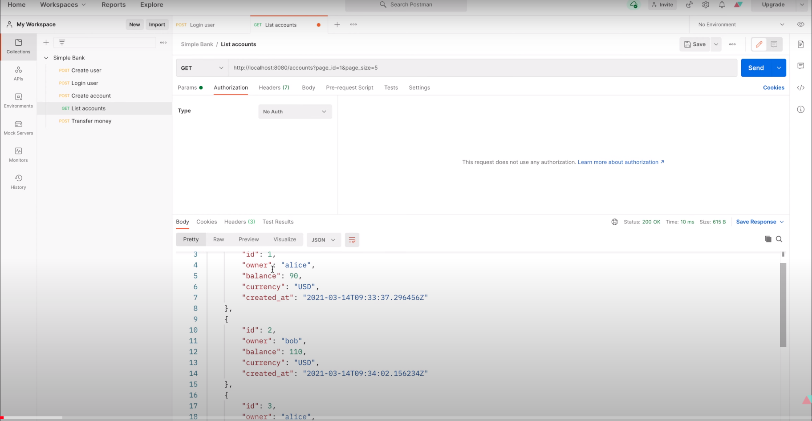

So it's very bad, right?

## Add authorization layer to the API

What we want to achieve is to add a bearer-token based authorization layer
to the API, where users must provide their access token via the Authorization
header of the request like this.

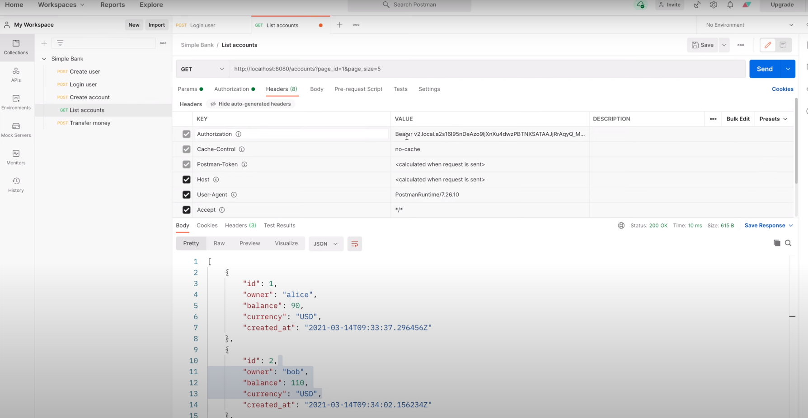

Then the server will validate this access token, and will only return the list
of accounts that are owned by the corresponding user. For example, in this 
case, the access token was generated for user Alice. So the list accounts API
should only return the accounts owned by Alice. All accounts that belong to
Bob or other users should not be returned.

Basically all of our APIs except create-user and login-user must be protected
in the same manner. Especially the transfer money API. Right now, we can
freely transfer money between any accounts. What we want to achieve is, users
must provide their access token in order for this transfer money API to go 
through. And if the access token belongs to Alice, then she can only send money
from the account that belongs to her. Or in the other words, the from account
should belong to Alice. She should not be able to send money from the account
owned by Bob or other users, like what we're doing here.

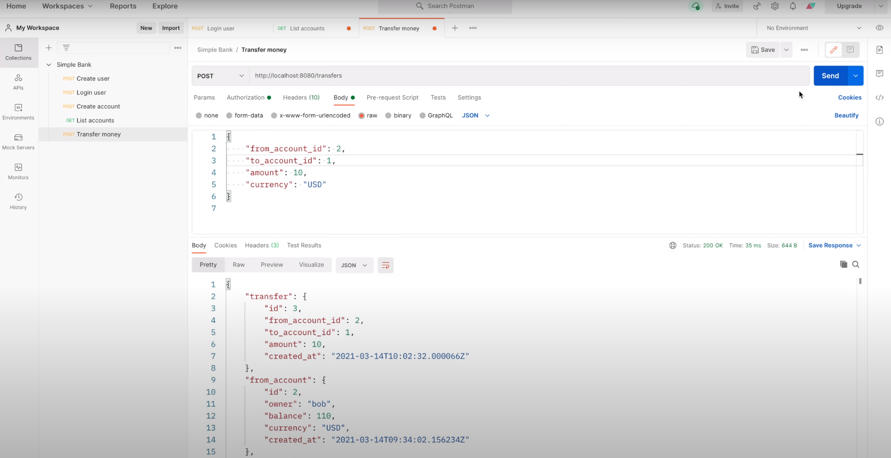

It's the scenario where Alice tries to move money from Bob's account into her
own account. This must be completely prohibited. OK, so that's what we're
gonna do in this lecture. We will learn how to implement a Gin authentication
middleware to authorize API requests.

## Authentication middleware

But, what is a middleware and how does it work? Well, it's pretty simple. 
Basically, the client sends a request to a specific API route on the server.
The request will go through the middlewares first, such as Logger middleware,
or authentication middleware. They're basically very similar to handler
functions that we've implemented in previous lectures. In the sense that they
also accept a single `gin.Context` input argument. The only difference is that,
within a middleware, we're able to abort the request and send response to the
client without forwarding it to the real handler function.

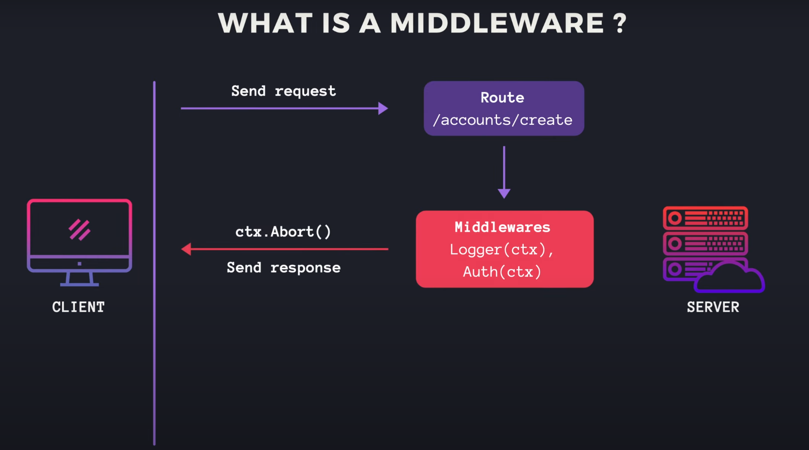

For example, in the authentication middleware, we can parse and check if the 
access token is valid or not. If it's invalid or expired, then we can call 
`ctx.Abort()` to stop the request and send `401 Unauthorized` status code to 
the client. Else if the token is valid, we can store the parsed token payload 
in the context, then call `ctx.Next()` to forward it to the real handler, or 
possibly the next middleware in the chain if it's available. The real handler 
will read the token payload from the context to know which user is calling, 
and based on that information to know which action can be done by this user, 
and what data can be returned to the client.


Alright, so now you know how middleware works, let's jump into coding to see
how to actually implement it!

First, I'm gonna create a new file `middleware.go` inside the `api` package.
Then let's declare a new function `authMiddleware`, which takes a `tokenMaker`
interface as input argument and returns a `gin.HandlerFunc` as output.

```go
func authMiddleware(tokenMaker token.Maker) gin.HandlerFunc {

}
```

So this function itself, is not the middleware, but actually just a 
higher-order function that will return the authentication middleware function.
As you can see here, the `gin.HandlerFunc` type is a function that takes a 
context as input.

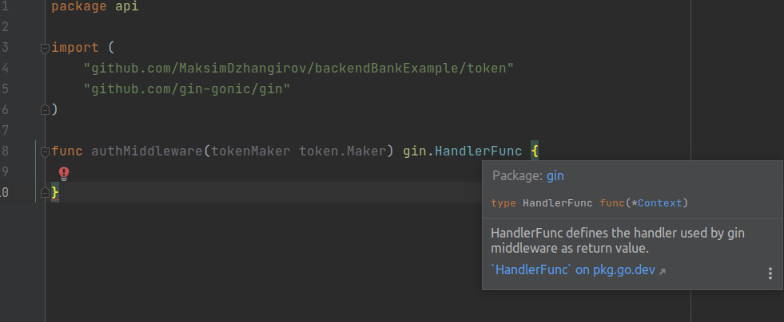

So I'm gonna return an anonymous function with the same required signature 
here. This anonymous function is in fact the authentication middleware
function that we want to implement. In order to authorize user to perform
the request, we first have to extract the authorization header from the 
request. So let's declare a constant authorization header key at the top. 

```go
const (
	authorizationHeaderKey = "authorization"
)

func authMiddleware(tokenMaker token.Maker) gin.HandlerFunc {

}
```

Then in this function, we get its value by calling `ctx.GetHeader` and pass
in the authorization header key. If the authorization header is empty, or in 
the other words, its length is `0`, then it means that the client doesn't 
provide this header. In this case, we create a new error with this message:
"authorization header is not provided". Then we call `ctx.AbortWithStatusJSON`.
This function allows us to abort the request and send a JSON response to the
client with a specific status code. In this case, we send `401 Unauthorized` 
status code, and the error response body with the error we've just created to
the client. Then return immediately.

```go
func authMiddleware(tokenMaker token.Maker) gin.HandlerFunc {
	return func(ctx *gin.Context) {
		authorizationHeader := ctx.GetHeader(authorizationHeaderKey)
		if len(authorizationHeader) == 0 {
			err := errors.New("authorization header is not provided")
			ctx.AbortWithStatusJSON(http.StatusUnauthorized, errorResponse(err))
			return
		}
	}
}
```

If the authorization header is provided, then it should be of this form: 
a Bearer prefix, followed by a space, and the access token. The purpose of
this Bearer prefix is to let the server know the type of authorization, because
in reality, the server might support multiple types of authorization schemes,
such as OAuth, Digest, AWS signature, or many more.

OK, so here we should call `strings.Fields()` function to split the 
authorization header by space. We expect the result fields to have at least 2
elements. If it doesn't, then we return an error: "invalid authorization 
header format" to the client. Otherwise, the authorization type is the first
element of the fields slice. Here we use `strings.ToLower` to convert it to
lower case to make it easier to compare.

```go
func authMiddleware(tokenMaker token.Maker) gin.HandlerFunc {
	return func(ctx *gin.Context) {
        ...

		fields := strings.Fields(authorizationHeader)
		if len(fields) < 2 {
			err := errors.New("invalid authorization header format")
			ctx.AbortWithStatusJSON(http.StatusUnauthorized, errorResponse(err))
			return
		}

		authorizationType := strings.ToLower(fields[0])

	}
}
```

Let's say at the moment our bank only supports 1 type of authorization, 
which is `Bearer` token. So I will declare a constant for the authorization 
type `Bearer`.

```go
const (
	authorizationHeaderKey = "authorization"
	authorizationTypeBearer = "bearer"
)
```

Then here, we compare the `authorizationType` with `authorizationTypeBearer`.
If they're different, then we should return an error to the client saying this
authorization type is not supported by the server.

```go
func authMiddleware(tokenMaker token.Maker) gin.HandlerFunc {
	return func(ctx *gin.Context) {
		...

		authorizationType := strings.ToLower(fields[0])
		if authorizationType != authorizationTypeBearer {
			err := fmt.Errorf("unsupported authorization type %s", authorizationType)
			ctx.AbortWithStatusJSON(http.StatusUnauthorized, errorResponse(err))
			return
		}
	}
}
```

In case the authorization type is indeed Bearer token, then the access token 
should be the second element of the `fields` slice. Now it's time to parse
and verify this access token to get the payload. We call 
`tokenMaker.VerifyToken()`, and pass in the access token. This function returns
a payload and an error. If error is not nil, we just return `Unauthorized` 
status code with the error itself.

```go
func authMiddleware(tokenMaker token.Maker) gin.HandlerFunc {
	return func(ctx *gin.Context) {
		...

		accessToken := fields[1]
		payload, err := tokenMaker.VerifyToken(accessToken)
		if err != nil {
			ctx.AbortWithStatusJSON(http.StatusUnauthorized, errorResponse(err))
			return
		}
	}
}
```

Otherwise, the token is valid, so we should store the payload in the context
before passing it to the next handler. To do that, I'm gonna declare a new
constant: authorization payload key.

```go
const (
	authorizationHeaderKey = "authorization"
	authorizationTypeBearer = "bearer"
	authorizationPayloadKey = "authorization_payload"
)
```

The payload value will be stored in the `gin.Context` with this specific key.
So that, later in the handler function, we can easily take it out using the
same key. OK, now to store the payload to the context, we just need to call
`ctx.Set`, and pass in a key-value pair. In our case, it is 
`authorizationPayloadKey` and the token payload itself. Then the last step is 
to call `ctx.Next()` to forward the request to the next handler.

```go
func authMiddleware(tokenMaker token.Maker) gin.HandlerFunc {
	return func(ctx *gin.Context) {
		...
		
		ctx.Set(authorizationPayloadKey, payload)
		ctx.Next()
	}
}
```

So that's basically it! The authMiddleware is completed.

There's a warning here because this middleware function is unused at the 
moment. It will be gone once we add the middleware to the server. But, before
doing that, let's write some unit tests for this authentication middleware!

## Write unit tests for authentication middleware

I'm gonna create a new file: `middleware_test.go` inside the same `api` 
package. Then let's add a new function `TestAuthMiddleware()`, which takes
a `testing.T` object as input. There are multiple cases we need to test, so
let's use table-driven test strategy.

```go
func TestAuthMiddleware(t *testing.T) {
	
}
```

First, I'm gonna list out all of the test cases with this anonymous struct. 
Each test should have a `name` of type `string`, a `setupAuth()` function to
setup the authorization header of the request. This function should have 3
input arguments: the `testing.T` object, the HTTP request object, and the
token maker interface to create the access token. Each test case should also 
have a separate function to check the response. This function will takes a
`testing.T` object and a `httptest.ResponseRecorder` object as input. OK, so
that's how the test case struct looks like. We will come back to add the actual
test cases later.

```go
func TestAuthMiddleware(t *testing.T) {
	testCases := []struct{
		name string
		setupAuth func(t *testing.T, request *http.Request, tokenMaker token.Maker)
		checkResponse func(t *testing.T, recorder *httptest.ResponseRecorder)
	}{}
}
```

Now, let's iterate through the `testCases` slice, and store the current test 
case in the `tc` variable. We call `t.Run` function to generate a sub-test.
Pass in `tc.name` as name of the sub-test and a function with `testing.T`
object as input. This function contains the main content of the sub-test. So
first, we create a new test server using the `newTestServer()` function we
wrote in previous lecture. In this middleware test, we don't need to access
the `Store`, so here I use `nil` for the `db.Store` parameter. Next, we will
add a simple API route and handler just for the sake of testing the 
middleware. Let's say the path is `/auth` and we declare the route with 
`server.router.GET` with the `authPath`. Then create the `authMiddleware()`
with `server.tokenMaker` and add it to this route. Finally, the handler 
function, which takes a `gin.Content` as input. To be simple, in this function,
we will just send a status `200 OK` with an empty body to the client.

```go
for i := range testCases {
    tc := testCases[i]
    
    t.Run(tc.name, func(t *testing.T) {
        server := newTestServer(t, nil)
        
        authPath := "/auth"
        server.router.GET(
            authPath,
            authMiddleware(server.tokenMaker),
            func(ctx *gin.Context) {
                ctx.JSON(http.StatusOK, gin.H{})
            },
        )
    })
}
```

OK, now the API is added to the server. Next step, we will send request to 
this API. Let's create a new HTTP test recorder to record the call. Then 
create a new request with `http.NewRequest` function. The method should be 
`GET`, the path is `authPath` and the request body is `nil`. We require no
errors. Then we call `tc.setupAuth` function with `t`, `request` and 
`server.tokenMaker` to add authorization header to the request. After that, we 
call `server.router.ServeHTTP` with the response `recorder` and `request` 
object. Finally, we call `tc.checkResponse` to verify the result.

```go
for i := range testCases {
		tc := testCases[i]

		t.Run(tc.name, func(t *testing.T) {
			...

			recorder := httptest.NewRecorder()
			request, err := http.NewRequest(http.MethodGet, authPath, nil)
			require.NoError(t, err)

			tc.setupAuth(t, request, server.tokenMaker)
			server.router.ServeHTTP(recorder, request)
			tc.checkResponse(t, recorder)
		})
	}
```

OK, now let's go back here to add test cases to this table. The first case
is the happy case. So I'm gonna name it `OK`. Then let's copy these 2 function
signatures to this case. For the `setupAuth` function, what we need to do is
to create a new access token and add it to the `Authorization` header of the
request.

```go
func TestAuthMiddleware(t *testing.T) {
	testCases := []struct{
		name string
		setupAuth func(t *testing.T, request *http.Request, tokenMaker token.Maker)
		checkResponse func(t *testing.T, recorder *httptest.ResponseRecorder)
	}{
		{
			name: "OK",
			setupAuth: func(t *testing.T, request *http.Request, tokenMaker token.Maker) {
				
			},
			checkResponse: func(t *testing.T, recorder *httptest.ResponseRecorder) {
				
			},
		},
	}
	...
}
```

As this step will be used in multiple cases with different configurations, 
I'm gonna create a separate function to do that. Let's call it function 
`addAuthorization`, which takes following input arguments: first the 
`testing.T` object, second, the HTTP `request` object, third the `tokenMaker` 
interface, then the `authorizationType` string, the `username` string, and 
finally the `duration` of the access token. In this function, we create a new
token by calling `tokenMaker.CreateToken`, with the input `username` and 
`duration`. Require no errors. Then we create the authorization header value 
with this string format. It should be 2 string values separated by a space. 
The first string is the `authorizationType` and the second one is the access
token. Now we set the header of the request using `request.Header.Set` 
function, pass in the `authorizationHeaderKey` constant, and the 
`authorizationHeader` value that we've just created. And that will be it!

```go
func addAuthorization(
	t *testing.T,
	request *http.Request,
	tokenMaker token.Maker,
	authorizationType string,
	username string,
	duration time.Duration,
) {
	token, err := tokenMaker.CreateToken(username, duration)
	require.NoError(t, err)

	authorizationHeader := fmt.Sprintf("%s %s", authorizationType, token)
	request.Header.Set(authorizationHeaderKey, authorizationHeader)
}
```

Now let's go back to the test. In this happy case's setup auth function, we
just call `addAuthorization()` with the following arguments: `t`, `request`,
`tokenMaker`, then the `authorizationTypeBearer` constant. We can use any 
`username` here, let's say "user" and the token valid duration, let's say
1 minute.

In the `checkResponse` function we just require the recorded response status 
code to be `200 OK`. 

```go
func TestAuthMiddleware(t *testing.T) {
	testCases := []struct{
		name string
		setupAuth func(t *testing.T, request *http.Request, tokenMaker token.Maker)
		checkResponse func(t *testing.T, recorder *httptest.ResponseRecorder)
	}{
		{
			name: "OK",
			setupAuth: func(t *testing.T, request *http.Request, tokenMaker token.Maker) {
				addAuthorization(t, request, tokenMaker, authorizationTypeBearer, "user", time.Minute)
			},
			checkResponse: func(t *testing.T, recorder *httptest.ResponseRecorder) {
				require.Equal(t, http.StatusOK, recorder.Code)
			},
		},
	}
}
```

Now I'm gonna duplicate this case to make the second one. Let's say this case
is no authorization, which means the client doesn't provide any kind of 
authorization header. So I'm gonna remove this `addAuthorization` call. And
the expected response status code should be `401 Unauthorized`. The third case
we want to test is unsupported authorization. As I said before, it's possible
that the server can support multiple types of authorization. In Postman, you 
can see a list of authorization types here.

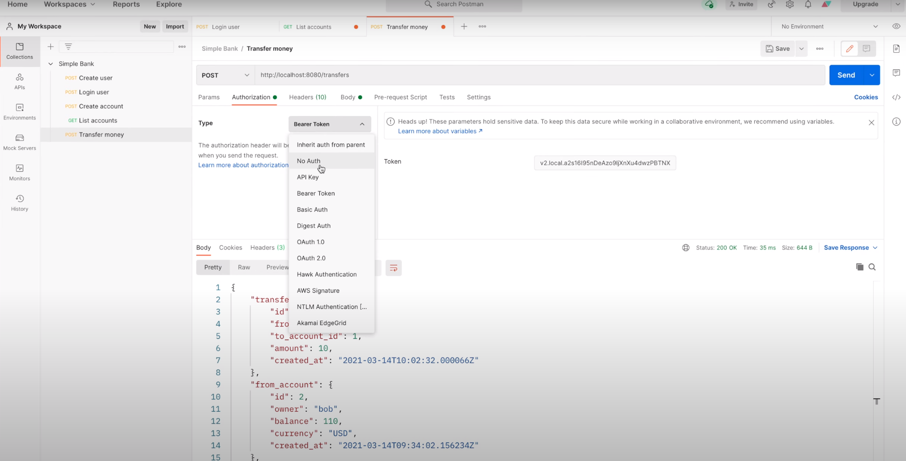

In our case, we choose `Bearer Token` type. So basically, Postman will add an
`Authorization` header with prefix `Bearer` and the access token suffix to
the request.

Now for the unsupported authorization type we will call `addAuthorization` 
function just like in the `OK` case, but this time, instead of passing in 
`authorizationTypeBearer` we will just pass in "unsupported" as the 
authorization type. And because of this, the expected response status code
should be `Unauthorized`.

```go
func TestAuthMiddleware(t *testing.T) {
	testCases := []struct{
		name string
		setupAuth func(t *testing.T, request *http.Request, tokenMaker token.Maker)
		checkResponse func(t *testing.T, recorder *httptest.ResponseRecorder)
	}{
		...
		{
			name: "NoAuthorization",
			setupAuth: func(t *testing.T, request *http.Request, tokenMaker token.Maker) {
			},
			checkResponse: func(t *testing.T, recorder *httptest.ResponseRecorder) {
				require.Equal(t, http.StatusUnauthorized, recorder.Code)
			},
		},
		{
			name: "UnsupportedAuthorization",
			setupAuth: func(t *testing.T, request *http.Request, tokenMaker token.Maker) {
				addAuthorization(t, request, tokenMaker, "unsupported", "user", time.Minute)
			},
			checkResponse: func(t *testing.T, recorder *httptest.ResponseRecorder) {
				require.Equal(t, http.StatusUnauthorized, recorder.Code)
			},
		},
	}
	...
}
```

The next case we can test is invalid authorization format. Let's say the client
doesn't provide the authorization type prefix, so here I just pass in an empty
string as the authorization type. And the expected status code will still be
`401 Unauthorized`. The last but very important case is when the access token 
is expired. In this case, we will send the correct `authorizationTypeBearer`,
but with a negative token duration, let's say minus 1 minute. By doing so,
the created token will always be expired. So the response status code should
also be Unauthorized as in other failure cases.

```go
func TestAuthMiddleware(t *testing.T) {
	testCases := []struct{
		name string
		setupAuth func(t *testing.T, request *http.Request, tokenMaker token.Maker)
		checkResponse func(t *testing.T, recorder *httptest.ResponseRecorder)
	}{
		...
		{
			name: "InvalidAuthorizationFormat",
			setupAuth: func(t *testing.T, request *http.Request, tokenMaker token.Maker) {
				addAuthorization(t, request, tokenMaker, "", "user", time.Minute)
			},
			checkResponse: func(t *testing.T, recorder *httptest.ResponseRecorder) {
				require.Equal(t, http.StatusUnauthorized, recorder.Code)
			},
		},
		{
			name: "ExpiredToken",
			setupAuth: func(t *testing.T, request *http.Request, tokenMaker token.Maker) {
				addAuthorization(t, request, tokenMaker, authorizationTypeBearer, "user", -time.Minute)
			},
			checkResponse: func(t *testing.T, recorder *httptest.ResponseRecorder) {
				require.Equal(t, http.StatusUnauthorized, recorder.Code)
			},
		},
	}
}
```

Alright, now I think all the cases are declared. Let's run the test to see 
how it goes.

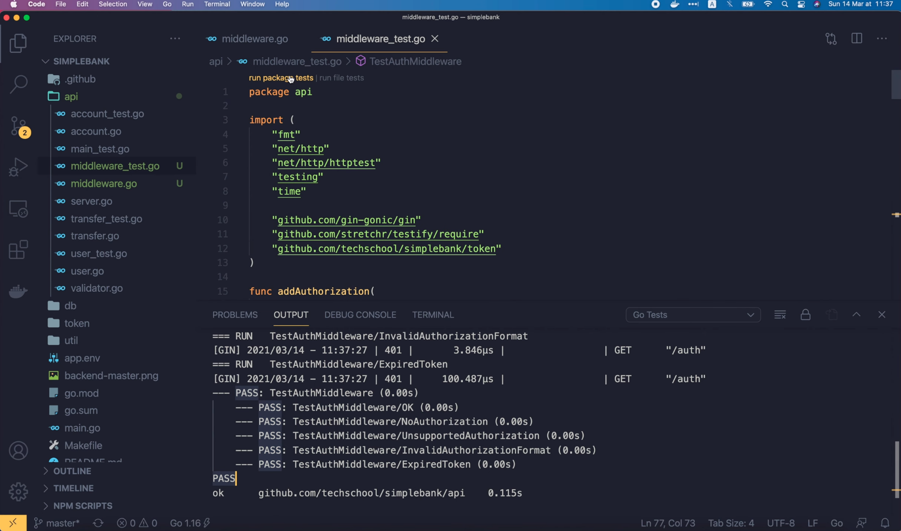

Cool! All of them passed.

Let's try running the whole package test to see the code coverage. In the 
`middleware.go` file you can see that the whole `authMiddleware` function
is covered.

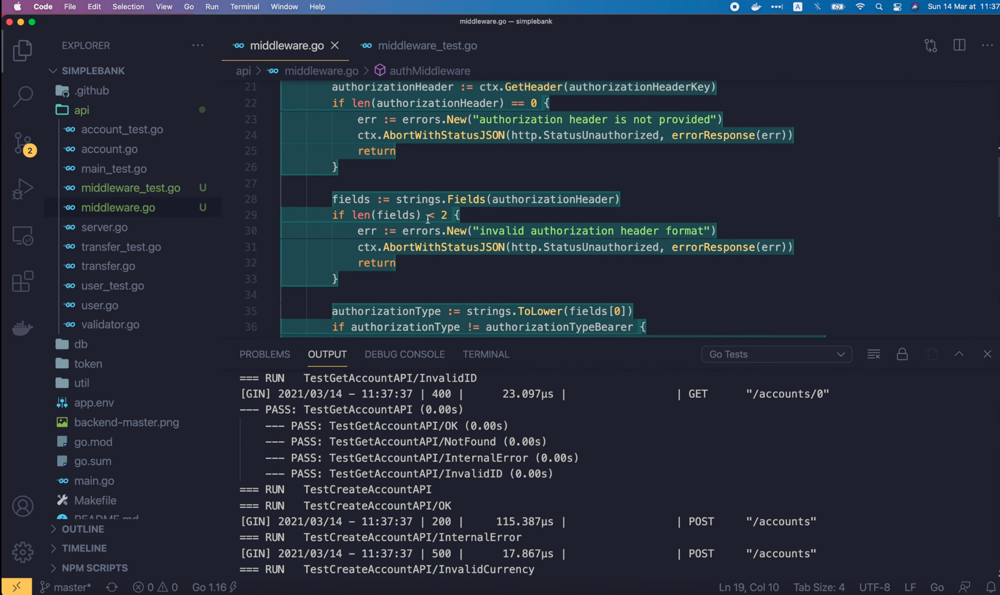

So, that's how you unit test a middleware.

## Add auth middleware to the server

Now as we confirmed that it's working well, let's add this auth middleware 
to the server. I'm gonna open the `api/server.go` file. We will add the new
middleware to the server in the `setupRouter` function. The `createUser` and 
`loginUser` routes don't need any kind of authorization because we want 
everyone to be able to freely create a new user and login. All the other APIs,
on the other hand, must be protected by the auth middleware. To do that, I'm 
gonna create a group of routes called `authRoutes` using the `router.Group()`
method. This slash is the path prefix of all routes in this group. And we call
`.Use()` function to add the `authMiddleware` to the group. We pass the 
`server.tokenMaker` interface to this higher order function that creates the 
auth middleware, just like what we've done in the unit test. Now for all of 
the remaining routes, instead of using router, we will use `authRoutes` to add
them to the group. By doing so, all of the routes in this group will share
the same auth middleware. That we've just added to the group before. So 
basically, every request to these routes must go through the auth middleware 
first. And that's exactly what we want to achieve to authorize the API 
requests. Now a lot of our API unit tests will fail because of this change.
For example, if we run the `TestGetAccountAPI`, it will fail because the API
is now returning 401 instead of 200.

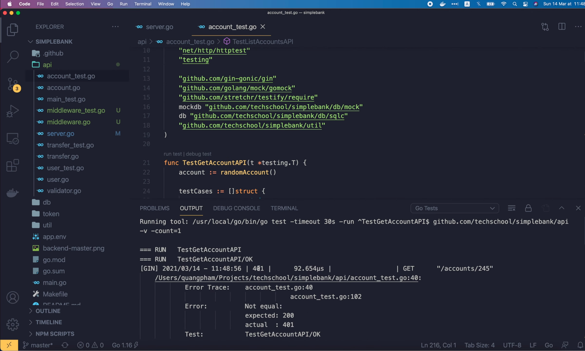

In order to make this test pass, we will have to add authorization header 
to the request. Like what we've done in the middleware unit tests. But before
doing that, there's something more important that we must do. Keep in mind
that all the auth middleware does is only authenticating requests, which 
means that it only requires the client to provide an access token in order to
pass the request to the real handler. But it doesn't care if the user who owns
the token really has enough permissions to perform the action or not. This
important part, which still missing, is called authorization.

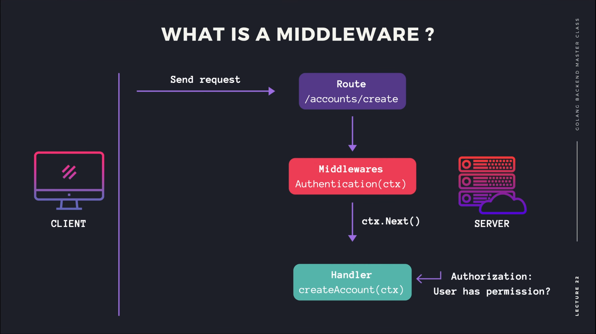

Authorization is often API specific, or in other words, the authorization 
rules are different for each API, so normally we would implement the 
authorization logic inside each of the handler.


For example, in the create account API, we don't want a user to be able to 
create an account that belongs to other user. The rule is: a user can only
create an account for him/herself. So here we should get rid of the `owner`
field of the `createAccountRequest` struct. The `owner` should be the 
`username` of the logged-in user, stored in the authorization payload. 
Therefore, in this `createAccount` handler, we will get the authorization 
payload by calling `ctx.MustGet()` and pass in the `authorizationPayloadKey`
constant. Note that this call will return a general interface, so we have to
cast it to `token.Payload` object. Then here, the `owner` field of the 
`createAccountParams` struct should be change to `authPayload.Username`. Just
like that! We've just added authorization to the create account handler.

```go
type createAccountRequest struct {
	Currency string `json:"currency" binding:"required,currency"`
}

func (server *Server) createAccount(ctx *gin.Context) {
	var req createAccountRequest
	if err := ctx.ShouldBindJSON(&req); err != nil {
		ctx.JSON(http.StatusBadRequest, errorResponse(err))
		return
	}

	authPayload := ctx.MustGet(authorizationPayloadKey).(*token.Payload)
	arg := db.CreateAccountParams{
		Owner:    authPayload.Username,
		Currency: req.Currency,
		Balance:  0,
	}
	...
}
```

Next, let's move to the Get Account API. The authorization rule for this API
is simple. A user should only be able to get the account that he or she owns.
So, similar as before, I'm gonna copy this statement to get the authorization
payload from the context. Then before returning the account to the client, 
here we should check if the `account.Owner` is the same as the 
`authPayload.Username` or not. If they're different, then we will create
a new error: "Account doesn't belong to authenticated user". Then we send this
error with a HTTP status code Unauthorized to the client. And return right away.
And that's it for the Get Account API.

```go
func (server *Server) getAccount(ctx *gin.Context) {
	...

	authPayload := ctx.MustGet(authorizationPayloadKey).(*token.Payload)
	if account.Owner != authPayload.Username {
		err := errors.New("account doesn't belong to authenticated user")
		ctx.JSON(http.StatusUnauthorized, errorResponse(err))
		return
	}

	ctx.JSON(http.StatusOK, account)
}
```

How about the List Accounts API? Well, as I said at the beginning of the video,
a user should only be able to list all accounts that belong to him or her. In
this case, our SQL query doesn't support filtering accounts by owner yet. So
we have to update it first. In the ListAccounts query of the `account.sql` 
file, I'm gonna add a condition: `WHERE owner = $1` and change the parameter
index of `LIMIT` and `OFFSET` to `$2` and `$3` respectively. 

```
-- name: ListAccounts :many
SELECT * FROM accounts
WHERE owner = $1
ORDER BY id
LIMIT $2
OFFSET $3;
```

Then let's run `make sqlc` in the terminal to regenerate the Golang code for 
the `ListAccounts` function. Let's also run `make mock` to regenerate the mock 
store for API unit tests.

Now go back to the code, here in the `account.sql.go` file, we can see that
the list accounts query has been updated, and a new `Owner` field has been added
to the `ListAccountsParam` struct.

```go
type ListAccountsParams struct {
	Owner  string `json:"owner"`
	Limit  int32  `json:"limit"`
	Offset int32  `json:"offset"`
}
```

This change will break our db test of the `ListAccounts` function. So let's
open `account_test.go` file to fix it. In `TestListAccounts` function we're
creating multiple random accounts, each associates with a different random
user. So to make it simple, I'm just gonna filter by the owner of the last 
account. I will declare a lastAccount variable to store the information of the
last generated account in the `for` loop. And here we just assign the 
`createRandomAccount` to the `lastAccount` variable. Then I will add the 
`Owner` field to this `ListAccountParams` object. It's value should be 
`lastAccount.Owner`. And since each account belongs to different random owner,
there won't be many accounts with the same owner as the last account. So,
we should change the offset to 0 instead of 5, so that we will have at least
1 record in the result list. Then here instead of require the list to have
5 records, we just require it to be not empty. And in this `for` loop we will
add 1 more check to make sure that the result account owner is the same as the
lsat account owner.

```go
func TestListAccounts(t *testing.T) {
	var lastAccount Account
	for i := 0; i < 10; i++ {
		lastAccount = createRandomAccount(t)
	}

	arg := ListAccountsParams{
		Owner: lastAccount.Owner,
		Limit:  5,
		Offset: 0,
	}

	accounts, err := testQueries.ListAccounts(context.Background(), arg)
	require.NoError(t, err)
	require.NotEmpty(t, accounts)

	for _, account := range accounts {
		require.NotEmpty(t, account)
		require.Equal(t, lastAccount.Owner, account.Owner)
	}
}
```

OK, let's run this test.

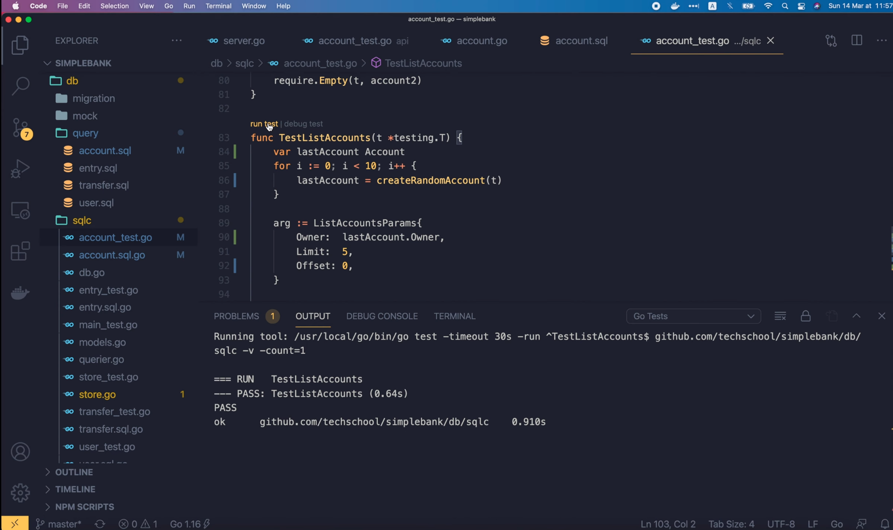

It passed. So we're good now. I'm gonna close all of these files, and go back
to the api/account.go file to add authorization logic to the list account 
handler. Same as in the create and get account handler, I'm gonna add a 
statement to get the authorization payload from the context. Then let's add
the owner filter field with value `authPayload.Username` to this 
`ListAccountsParams` struct. And that should be it.

```go
func (server *Server) listAccount(ctx *gin.Context) {
	var req listAccountRequest
	if err := ctx.ShouldBindQuery(&req); err != nil {
		ctx.JSON(http.StatusBadRequest, errorResponse(err))
		return
	}

	authPayload := ctx.MustGet(authorizationPayloadKey).(*token.Payload)
	arg := db.ListAccountsParams{
		Owner: authPayload.Username,
		Limit:  req.PageSize,
		Offset: (req.PageID - 1) * req.PageSize,
	}

	accounts, err := server.store.ListAccounts(ctx, arg)
	if err != nil {
		ctx.JSON(http.StatusInternalServerError, errorResponse(err))
		return
	}

	ctx.JSON(http.StatusOK, accounts)
}
```

We've just added authorization rules to all of the account management APIs. 
The only remaining API that requires authorization and also the most important
one, is the transfer money API. The rule is that a user can only send money 
from his or her own account. So basically we have to compare the owner of the
`fromAccount` with the authenticated username. To do that, we must have the
`fromAccount` object in the handler function. So I'm gonna add `db.Account`
to the return value list of the `validAccount` function. And we have to add
`account` to all return statements inside this function.

```go
func (server *Server) validAccount(ctx *gin.Context, accountID int64, currency string) (db.Account, bool) {
	account, err := server.store.GetAccount(ctx, accountID)
	if err != nil {
		if err == sql.ErrNoRows {
			ctx.JSON(http.StatusNotFound, errorResponse(err))
			return account, false
		}

		ctx.JSON(http.StatusInternalServerError, errorResponse(err))
		return account, false
	}

	if account.Currency != currency {
		err := fmt.Errorf("account [%d] currency mismatch: %s vs %s", account.ID, account.Currency, currency)
		ctx.JSON(http.StatusBadRequest, errorResponse(err))
		return account, false
	}

	return account, true
}
```

OK, now go back to the `createTransfer` handler. Here we will store the 
result of the `validAccount` function call in the `fromAccount` and `valid`
variables. If the account is not valid, we just return as before. We do 
similarly for the toAccountID. But, we don't need to store the account object
in an actual variable because we don't need it for the authorization rule. So
I just use an underscore here as a placeholder. Now for the authorization 
logic, we first get the auth payload from the context just like in other
APIs. Then we check if `fromAccount.Owner` equals to `authPayload.Username`
or not. If they're not the same, then we create a new error: from account 
doesn't belong to the authenticated user. And we just send this error to the 
client with status code `401 Unauthorized`. And we should remove this colon
becaouse valid is not a new variable. And that will be it!

```go
func (server *Server) createTransfer(ctx *gin.Context) {
	var req transferRequest
	if err := ctx.ShouldBindJSON(&req); err != nil {
		ctx.JSON(http.StatusBadRequest, errorResponse(err))
		return
	}

	fromAccount, valid := server.validAccount(ctx, req.FromAccountID, req.Currency)
	if !valid {
		return
	}

	authPayload := ctx.MustGet(authorizationPayloadKey).(*token.Payload)
	if fromAccount.Owner != authPayload.Username {
		err := errors.New("from account doesn't belong to the authenticated user")
		ctx.JSON(http.StatusUnauthorized, errorResponse(err))
		return
	}

	_, valid = server.validAccount(ctx, req.ToAccountID, req.Currency)
	if !valid {
		return
	}

	arg := db.TransferTxParams{
		FromAccountID: req.FromAccountID,
		ToAccountID:   req.ToAccountID,
		Amount:        req.Amount,
	}

	result, err := server.store.TransferTx(ctx, arg)
	if err != nil {
		ctx.JSON(http.StatusInternalServerError, errorResponse(err))
		return
	}

	ctx.JSON(http.StatusOK, result)
}
```

The authorization logic is now added to all of the required APIs.

## Update API unit tests

Now it's time to update our API unit tests to adapt with the new authentication 
middleware and authorization logics. First, the `TestGetAccountAPI`. At the
moment, we are generating a random owner inside the `randomAccount` function, 
but to make it easier to test the authentication and authorization logic, I'm
gonna change this function a bit. It will take an `owner` string as input and
use it as the account owner instead of generating a random value as before.

```go
func randomAccount(owner string) db.Account {
	return db.Account{
		ID:       util.RandomInt(1, 1000),
		Owner:    owner,
		Balance:  util.RandomMoney(),
		Currency: util.RandomCurrency(),
	}
}
```

Now in the `TestGetAccountAPI` function, we first call `randomUser()` to 
generate a random user, then we pass that `user.Username` into the function
to generate a random account.

```go
func TestGetAccountAPI(t *testing.T) {
	user, _ := randomUser(t)
	account := randomAccount(user.Username)
	...
}
```

OK, now we will do similar to what we've done in the auth middleware test. 
Let's copy the `setupAuth` function signature, and paste it to the 
`TestGetAccountAPI` test case struct. Then also copy the implementation of it
for the OK case. This time, instead of using a constant string as username here,
we must use the account owner's username, which is `user.Username`. This
`setupAuth()` function should be added to all of the existing test cases.

```go
func TestGetAccountAPI(t *testing.T) {
	user, _ := randomUser(t)
	account := randomAccount(user.Username)

	testCases := []struct {
		name          string
		accountID     int64
		setupAuth     func(t *testing.T, request *http.Request, tokenMaker token.Maker)
		buildStubs    func(store *mockdb.MockStore)
		checkResponse func(t *testing.T, recoder *httptest.ResponseRecorder)
	}{
		{
			name:      "OK",
			accountID: account.ID,
			setupAuth: func(t *testing.T, request *http.Request, tokenMaker token.Maker) {
				addAuthorization(t, request, tokenMaker, authorizationTypeBearer, user.Username, time.Minute)
			},
			buildStubs: func(store *mockdb.MockStore) {
				store.EXPECT().
					GetAccount(gomock.Any(), gomock.Eq(account.ID)).
					Times(1).
					Return(account, nil)
			},
			checkResponse: func(t *testing.T, recorder *httptest.ResponseRecorder) {
				require.Equal(t, http.StatusOK, recorder.Code)
				requireBodyMatchAccount(t, recorder.Body, account)
			},
		},
		{
			name:      "NotFound",
			accountID: account.ID,
			setupAuth: func(t *testing.T, request *http.Request, tokenMaker token.Maker) {
				addAuthorization(t, request, tokenMaker, authorizationTypeBearer, user.Username, time.Minute)
			},
			buildStubs: func(store *mockdb.MockStore) {
				store.EXPECT().
					GetAccount(gomock.Any(), gomock.Eq(account.ID)).
					Times(1).
					Return(db.Account{}, sql.ErrNoRows)
			},
			checkResponse: func(t *testing.T, recorder *httptest.ResponseRecorder) {
				require.Equal(t, http.StatusNotFound, recorder.Code)
			},
		},
		{
			name:      "InternalError",
			accountID: account.ID,
			setupAuth: func(t *testing.T, request *http.Request, tokenMaker token.Maker) {
				addAuthorization(t, request, tokenMaker, authorizationTypeBearer, user.Username, time.Minute)
			},
			buildStubs: func(store *mockdb.MockStore) {
				store.EXPECT().
					GetAccount(gomock.Any(), gomock.Eq(account.ID)).
					Times(1).
					Return(db.Account{}, sql.ErrConnDone)
			},
			checkResponse: func(t *testing.T, recorder *httptest.ResponseRecorder) {
				require.Equal(t, http.StatusInternalServerError, recorder.Code)
			},
		},
		{
			name:      "InvalidID",
			accountID: 0,
			setupAuth: func(t *testing.T, request *http.Request, tokenMaker token.Maker) {
				addAuthorization(t, request, tokenMaker, authorizationTypeBearer, user.Username, time.Minute)
			},
			buildStubs: func(store *mockdb.MockStore) {
				store.EXPECT().
					GetAccount(gomock.Any(), gomock.Any()).
					Times(0)
			},
			checkResponse: func(t *testing.T, recorder *httptest.ResponseRecorder) {
				require.Equal(t, http.StatusBadRequest, recorder.Code)
			},
		},
	}
	
	...
}
```

Then in the main body of the test, before calling `server.router.ServeHTTP` we
should call `tc.setupAuth` with `t`, `request` and `server.tokenMaker`.
And we're done!

```go
func TestGetAccountAPI(t *testing.T) {
	...
	
    for i := range testCases {
		tc := testCases[i]

		t.Run(tc.name, func(t *testing.T) {
			...

			tc.setupAuth(t, request, server.tokenMaker)

			server.router.ServeHTTP(recorder, request)
			tc.checkResponse(t, recorder)
		})
	}
}
```

But before we can run the test, we should fix all errors in other unit tests,
because of the change we made to the `randomAccount()` function. So let's
copy this 2 statements from the `TestGetAccountAPI`, and paste them to this
`TestCreateAccountAPI` function.

```go
func TestCreateAccountAPI(t *testing.T) {
    user, _ := randomUser(t)
    account := randomAccount(user.Username)
	
	...
}
```

For the `TestListAccountsAPI`, let's say we will use the same user for all
accounts. So we just create the user at the top of the function. Then use 
that user's username for all accounts inside the `for` loop.

```go
func TestListAccountsAPI(t *testing.T) {
	user, _ := randomUser(t)

	n := 5
	accounts := make([]db.Account, n)
	for i := 0; i < n; i++ {
		accounts[i] = randomAccount(user.Username)
	}
	
	...
	
}
```

OK, we still have errors in the `transfer_test.go` file. In this 
`TestTransferAPI`, we have 3 different accounts, so let's create 3 different
users for each of them. To create `account1`, we pass in `user1.Username`, 
for `account2` we pass in `user2.Username` and similarly, `account3`'s owner
will be `user3.Username`. Alright, now all errors are fixed.

```go
func TestTransferAPI(t *testing.T) {
	amount := int64(10)

	user1, _ := randomUser(t)
	user2, _ := randomUser(t)
	user3, _ := randomUser(t)

	account1 := randomAccount(user1.Username)
	account2 := randomAccount(user2.Username)
	account3 := randomAccount(user3.Username)
	
	...
}
```

Let's run the Get Account API unit tests.

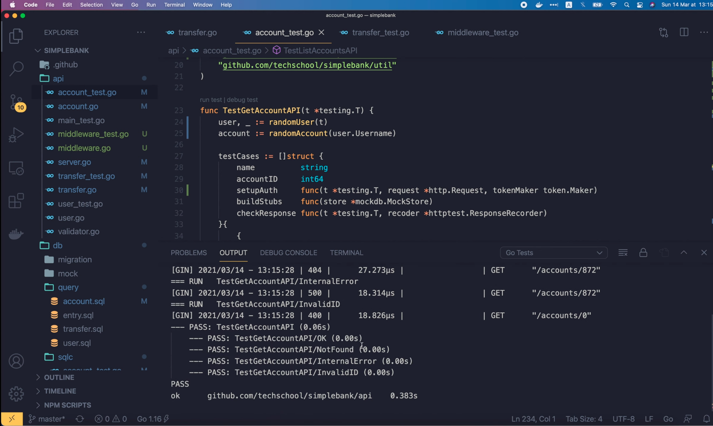

They're all passed! Awesome!

Now to make it more rebust, I'm gonna add some more test cases to the list.

First, the UnauthorizedUser case, where we use a token of a different user
who's not the owner of the account. Let's say the username is 
"unauthorized_user" for example. In this case, we expect the response status
code to be `http.StatusUnauthorized` instead of `OK`. And we can remove
this `requireBodyMatchAccount` check.

```go
func TestGetAccountAPI(t *testing.T) {
	...
    testCases := []struct {
        name          string
        accountID     int64
        setupAuth     func(t *testing.T, request *http.Request, tokenMaker token.Maker)
        buildStubs    func(store *mockdb.MockStore)
        checkResponse func(t *testing.T, recoder *httptest.ResponseRecorder)
    }{
    	...
        {
            name:      "UnauthorizedUser",
            accountID: account.ID,
            setupAuth: func(t *testing.T, request *http.Request, tokenMaker token.Maker) {
                addAuthorization(t, request, tokenMaker, authorizationTypeBearer, "unauthorized_user", time.Minute)
            },
            buildStubs: func(store *mockdb.MockStore) {
                store.EXPECT().
                    GetAccount(gomock.Any(), gomock.Eq(account.ID)).
                    Times(1).
                    Return(account, nil)
            },
            checkResponse: func(t *testing.T, recorder *httptest.ResponseRecorder) {
                require.Equal(t, http.StatusUnauthorized, recorder.Code)
            },
        },
        ...
    }
}
```

Let's add one more case: `No Authorization`. In this case, the client won't
provide the access token to authenticate the request, so we will remove this
`addAuthorization` function call. In this case, the request should be aborted
in the authentication middleware, so it will not reach the handler. Therefore,
in the `buildStubs` function, we should expect the `GetAccount` function to 
not be called at all. To verify that, we just need to change the second 
parameter `GetAccount` stub to `gomock.Any()`, the number of times this 
function should be called to `0`, and remove the return account call here.
The expected response status code will be `Unauthorized` as in the previous
case.

```go
func TestGetAccountAPI(t *testing.T) {
	...
    testCases := []struct {
        name          string
        accountID     int64
        setupAuth     func(t *testing.T, request *http.Request, tokenMaker token.Maker)
        buildStubs    func(store *mockdb.MockStore)
        checkResponse func(t *testing.T, recoder *httptest.ResponseRecorder)
    }{
    	...
        {
            name:      "NoAuthorization",
            accountID: account.ID,
            setupAuth: func(t *testing.T, request *http.Request, tokenMaker token.Maker) {
            },
            buildStubs: func(store *mockdb.MockStore) {
                store.EXPECT().
                    GetAccount(gomock.Any(), gomock.Any()).
                    Times(0)
            },
            checkResponse: func(t *testing.T, recorder *httptest.ResponseRecorder) {
                require.Equal(t, http.StatusUnauthorized, recorder.Code)
            },
        },
        ...
    }
}
```

OK, now let's run the test Get Account API again.

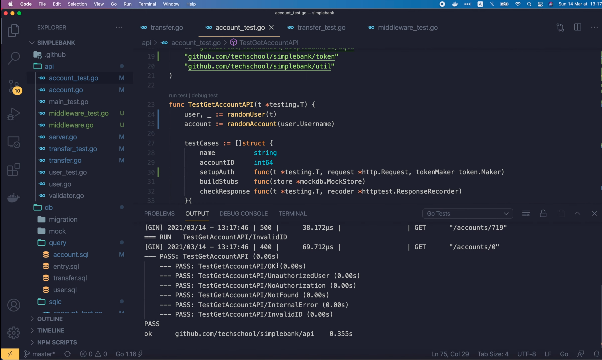

All passed! Including the 2 cases we've just added. OK, so now you know how
to update the Get Account API unit tests to satisfy the new authentication
middleware and authorization logic.

You can apply the same method to update the rest of the API unit tests for
the Create Account, List Account and Transfer money API. I leave that as
an exercise for you to practice. And if you want to take a look at how I
implement them, feel free to check out the [Github repository](https://github.com/techschool/simplebank) 
of the course.

## Send requests to the API using Postman

Now before we finish, let's start server. And send some real API calls in 
Postman to see how it goes. First, let's try this List Accounts API.

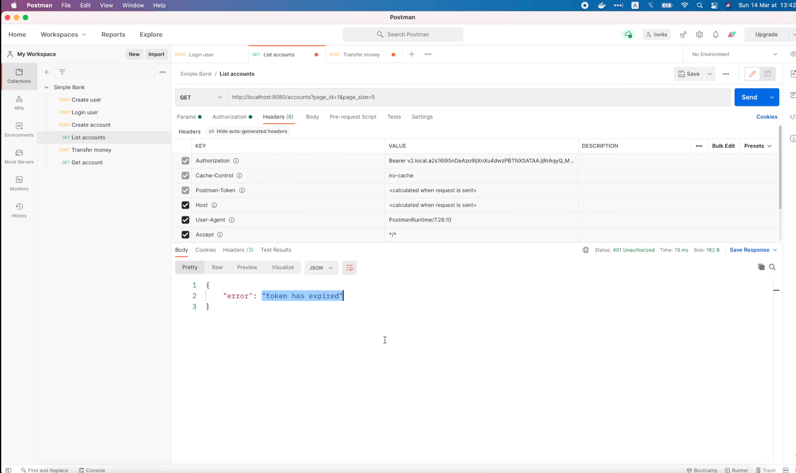

We've got `401 Unauthorized` status code, because the access token we use in 
the beginning of the video has been expired. So let's send this login request
to get a new one.


OK, it's successful, so I'm gonna copy this new access token. Go back to the
List account request, open the Authorization tab and paste in the new access
token in this box.


Then click Send again. This time the request is successful. And look at the
response data, we have a list of 3 accounts, all belongs to Alice.

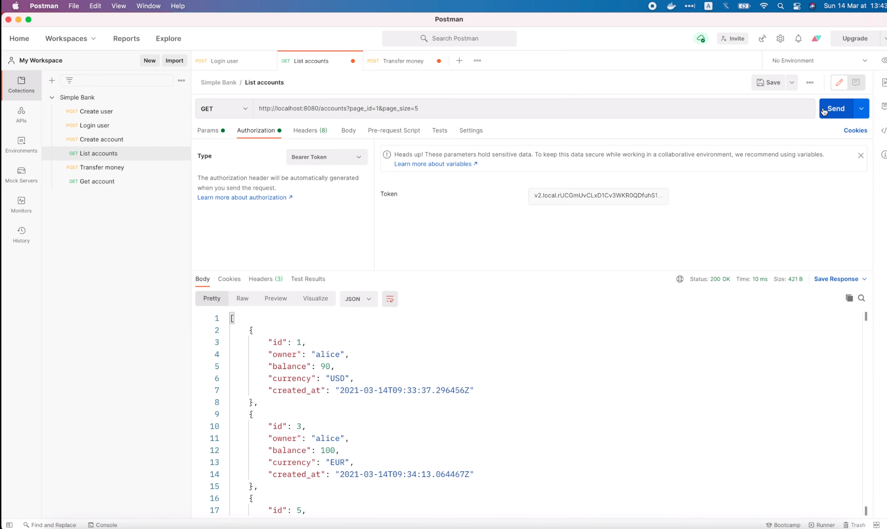

So that's exactly what we want to achieve. Alice can only see her own accounts.
She can no longer see the accounts of other users as before. Now let's try
the Transfer money API.

First, I'm gonna try sending money from Alice's account to Bob's. So the 
`from_account_id` should be 1, and `to_account_id` should be 2. Let's send 
the request. Token has expired.

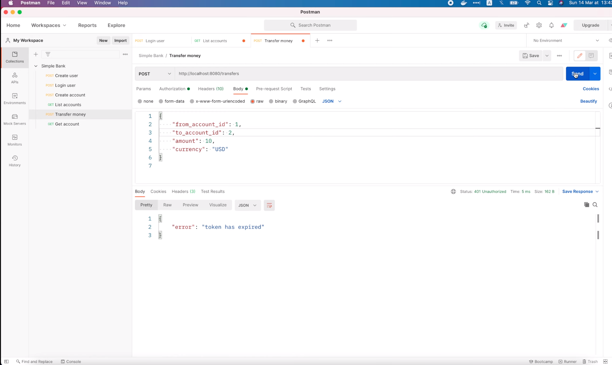

That's because this request is still using the old access token. Let's 
change to the Authorization tab, and paste in the new one. Then send the 
request again.

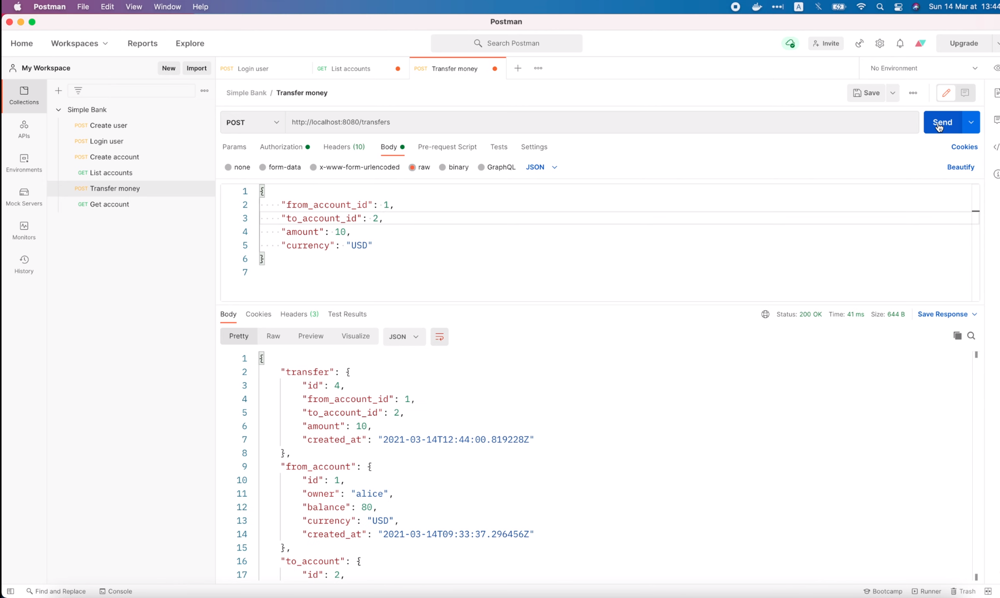

This time it succeeded. 10 dollars has been transfered from account 1 of 
Alice to account 2 of Bob.

OK, now let's see what will happen if we try to move money from account 2 to
account 1. This is the case when Alice tries to steal money from Bob's 
account into her own account.

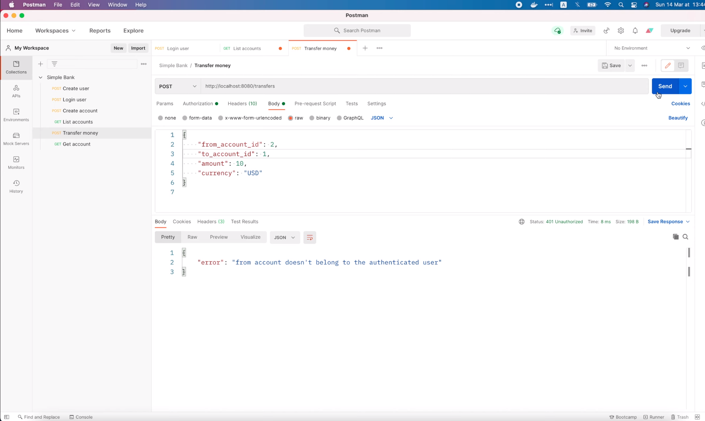

As you can see, the request is prevented. We've got `401 Unauthorized` status
code because the `from_account` doesn't belong to the authenticated user, which
is Alice in this case. So the transfer money API is very well protected by the
authentication middleware and authorization rules.

And with this, I'm gonna wrap up this lecture here. You can try calling the
rest of the APIs on your own if you like. I hope you enjoy the video. Thank
you for watching! Happy learning, and see you in the next lecture!