# Реализуем middleware для аутентификации и правил авторизации в Golang с помощью Gin

[Оригинал](https://www.youtube.com/watch?v=p1dwLKAxUxA)

Всем привет! Рад вас снова видеть на мастер-классе по бэкенду!

На [предыдущей лекции](part21.md) мы реализовали API входа в систему, 
которая аутентифицировала пользователя и возвращала токен доступа клиенту.
Однако до сих пор все наши API пока не требуют какой-либо аутентификации и 
авторизации.

Как показано ниже на рисунке, я использую заголовок `No Authorization`
в этом запросе списка банковских счетов и он успешно выполняется, а это 
значит, что любой может увидеть все существующие банковские счета в системе,
даже если они не являются владельцами этих счетов.


Это серьёзная проблема и такого не должно быть в реальной системе, не так
ли?

## Добавляем слой для аутентификации к API

Мы хотим добавить слой аутентификации с использованием токенов к API, куда
пользователи будут передавать свой токен доступа в заголовке `Authorization`
запроса следующим образом.


Затем сервер проверит этот токен доступа и вернёт список из только тех
банковских счетов, которые принадлежат соответствующему пользователю.
Например, для случая на рисунке токен доступа был сгенерирован для 
пользователя Алиса. Таким образом, API, выдающий список счетов должен
вернуть только банковские счета, принадлежащие Алисе. Остальные счета, 
принадлежащие Бобу или другим пользователям, не должны быть возвращены.

По сути, все наши API, кроме `create-user` и `login-user`, должны быть 
защищены таким образом. Особенно API перевода денег. Пока что мы можем 
свободно переводить деньги между любыми счетами. Чего мы хотим добиться, так 
это того, что пользователи должны предоставить свой токен доступа, чтобы этот 
перевод денег произошёл. И если токен доступа принадлежит Алисе, то она может
отправлять деньги только с того счета, который ей принадлежит. Или другими 
словами, банковский счёт `from` должна принадлежать Алисе. Она не должна 
иметь возможности отправлять деньги со счета, принадлежащего Бобу или 
другим пользователям, как мы делаем здесь.

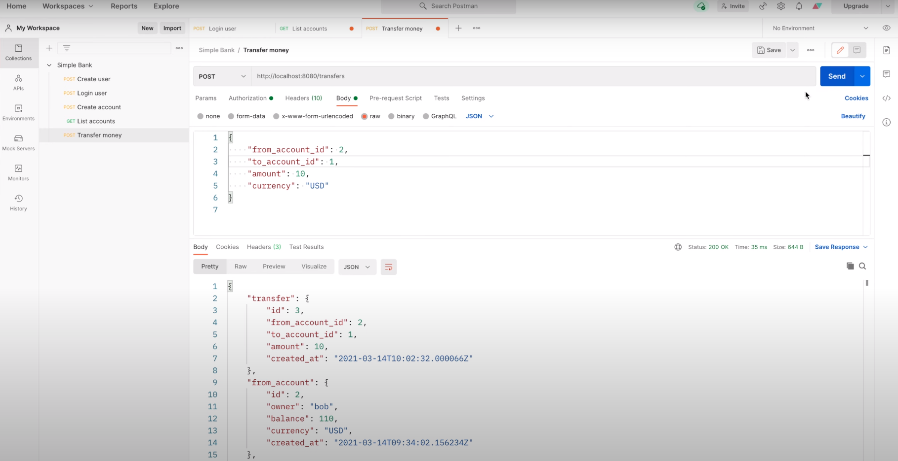

На рисунке выше показан случай, когда Алиса пытается перевести деньги со 
счета Боба на свой собственный счет. Такой возможности вообще не должно
быть. Таким образом, именно этой теме будет посвящена лекция. Мы узнаем, как 
реализовать Gin middleware аутентификации для авторизации запросов к API.

## Middleware для аутентификации

Но что такое middleware и как оно работает? На самом деле очень просто.
По сути, клиент отправляет запрос по конкретному API маршруту на сервере.
Запрос будет проходить сначала через middleware, такое как middleware для
логирования или аутентификации. В основном они очень похожи на 
функции-обработчики, которые мы реализовали в предыдущих лекциях. В том 
смысле, что они также принимают один входной аргумент `gin.Context`. 
Единственное отличие заключается в том, что в middleware, мы можем прервать
обработку запроса отправить ответ клиенту, без перенаправления его в реальную 
функцию-обработчик.

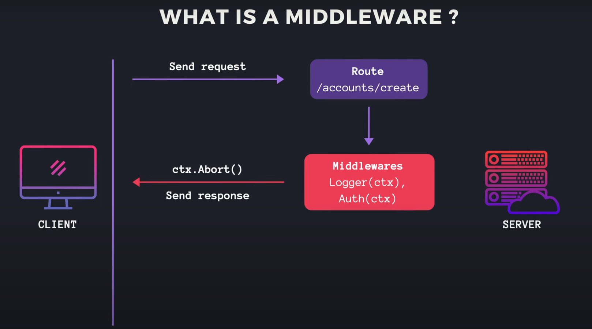

Например, в middleware аутентификации мы можем проанализировать и проверить,
является ли токен доступа валидным или нет. Если он не валидный или срок 
его действия истек, то мы можем вызвать `ctx.Abort()`, чтобы остановить 
обработку запроса и отправить клиенту код состояния `401 Unauthorized`.
В противном случае, если токен валиден, мы можем сохранить проанализированные 
полезные данные токена в контексте, а затем вызвать `ctx.Next()`, чтобы 
перенаправить его реальному обработчику или, возможно, следующему middleware
в цепочке, если таковая имеется. Реальный обработчик считает полезную
нагрузку токена из контекста, чтобы узнать какой пользователь его вызвал,
и на основе этой информации определяет, какое действие может выполнить этот 
пользователь и какие данные могут быть возвращены клиенту.

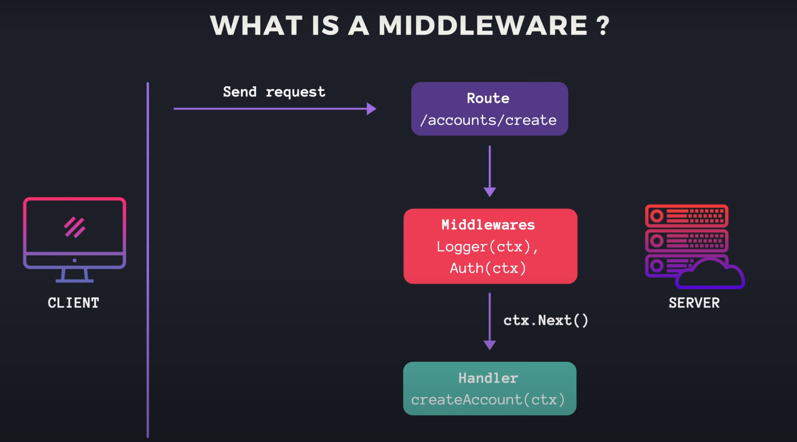

Итак, теперь когда вы знаете как работает middleware, давайте перейдём к 
написанию кода, чтобы увидеть, как его реализовать!

Во-первых, я создам новый файл `middleware.go` внутри пакета `api`.
Затем давайте объявим новую функцию `authMiddleware`, которая принимает 
интерфейс `tokenMaker` в качестве входного аргумента и возвращает 
`gin.HandlerFunc` в качестве результата.

```go
func authMiddleware(tokenMaker token.Maker) gin.HandlerFunc {

}
```

Сама по себе эта функция не является middleware, а на самом деле просто
функция более высокого порядка, возвращающая функцию-middleware
аутентификации. Как вы можете увидеть на рисунке, тип `gin.HandlerFunc` — это
функция, которая принимает контекст в качестве входных данных.

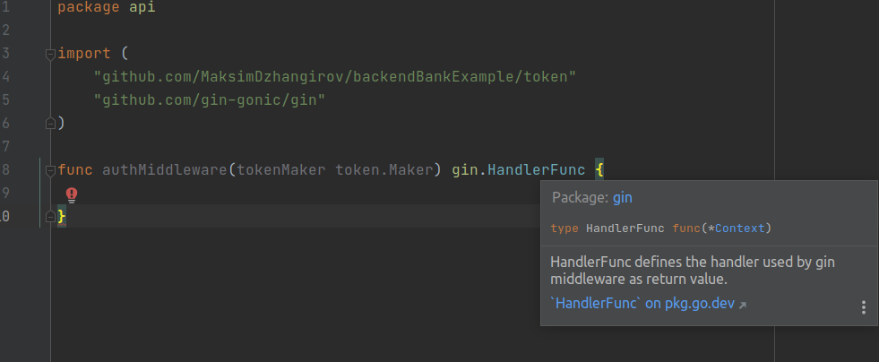

Таким образом, я планирую вернуть здесь анонимную функцию с такой же 
сигнатурой. Эта анонимная функция на самом деле является функцией-middleware
аутентификации, которую мы хотим реализовать. Чтобы авторизовать пользователя,
выполняющего запрос, мы сначала должны извлечь из запроса заголовок 
авторизации. Итак, давайте объявим вверху константу `authorizationHeaderKey`.

```go
const (
	authorizationHeaderKey = "authorization"
)

func authMiddleware(tokenMaker token.Maker) gin.HandlerFunc {

}
```

Затем в этой функции мы получаем его значение, вызывая ctx.GetHeader, и 
передавая `authorizationHeaderKey`. Если заголовок авторизации пустой, или, 
другими словами, его длина равна `0`, то это означает, что клиент не 
предоставляет этот заголовок. В этом случае мы создаем новую ошибку с таким 
сообщением: "authorization header is not provided" («заголовок авторизации 
не предоставлен»). Затем мы вызываем `ctx.AbortWithStatusJSON`. Эта функция 
позволяет нам прервать обработку запроса и отправить ответ JSON клиенту с 
определенным кодом состояния. В этом случае мы отправляем код состояния
`401 Unauthorized` и тело ответа об ошибке с ошибкой, которую мы только что 
создали, клиенту. Затем немедленно выходим из функции.

```go
func authMiddleware(tokenMaker token.Maker) gin.HandlerFunc {
	return func(ctx *gin.Context) {
		authorizationHeader := ctx.GetHeader(authorizationHeaderKey)
		if len(authorizationHeader) == 0 {
			err := errors.New("authorization header is not provided")
			ctx.AbortWithStatusJSON(http.StatusUnauthorized, errorResponse(err))
			return
		}
	}
}
```

Если заголовок авторизации передан, то он должен иметь следующий вид:
префикс Bearer, за которым следует пробел, и токен доступа. Назначение 
префикса сообщить серверу тип авторизации, поскольку на самом деле сервер 
может поддерживать несколько способов авторизации, такие как OAuth, Digest,
AWS подпись и т. д.

Итак, здесь мы должны вызвать функцию `strings.Fields()`, чтобы разделить 
заголовок авторизации по пробелам. Мы ожидаем, что результат `fields` будет 
содержать как минимум 2 элемента. Если нет, то мы возвращаем клиенту ошибку:
"invalid authorization header format" («недопустимый формат заголовка 
авторизации»). В противном случае тип авторизации является первым элементом 
среза `fields`. Здесь мы используем `strings.ToLower`, чтобы преобразовать 
его в нижний регистр и упростить сравнение.

```go
func authMiddleware(tokenMaker token.Maker) gin.HandlerFunc {
	return func(ctx *gin.Context) {
        ...

		fields := strings.Fields(authorizationHeader)
		if len(fields) < 2 {
			err := errors.New("invalid authorization header format")
			ctx.AbortWithStatusJSON(http.StatusUnauthorized, errorResponse(err))
			return
		}

		authorizationType := strings.ToLower(fields[0])

	}
}
```

Пусть на данный момент наше банковское приложение поддерживает только 1 тип 
авторизации, `Bearer` токен. Поэтому я объявлю константу для типа авторизации 
`Bearer`.

```go
const (
	authorizationHeaderKey = "authorization"
	authorizationTypeBearer = "bearer"
)
```

Затем мы сравниваем `authorizationType` с `authorizationTypeBearer`. Если они
отличаются, то мы должны вернуть клиенту ошибку о том, что этот тип 
авторизации не поддерживается сервером.

```go
func authMiddleware(tokenMaker token.Maker) gin.HandlerFunc {
	return func(ctx *gin.Context) {
		...

		authorizationType := strings.ToLower(fields[0])
		if authorizationType != authorizationTypeBearer {
			err := fmt.Errorf("unsupported authorization type %s", authorizationType)
			ctx.AbortWithStatusJSON(http.StatusUnauthorized, errorResponse(err))
			return
		}
	}
}
```

В случае, если способ авторизации действительно `Bearer` токен, то токен
доступа должен быть вторым элементом среза `fields`. Теперь пора 
проанализировать и проверить этот токен доступа, чтобы извлечь полезную 
нагрузку. Мы вызываем `tokenMaker.VerifyToken()`, и передаём токен доступа.
Эта функция возвращает полезную нагрузку и ошибку. Если ошибка не равна `nil`,
мы просто возвращаем код состояния `Unauthorized` и саму ошибку.

```go
func authMiddleware(tokenMaker token.Maker) gin.HandlerFunc {
	return func(ctx *gin.Context) {
		...

		accessToken := fields[1]
		payload, err := tokenMaker.VerifyToken(accessToken)
		if err != nil {
			ctx.AbortWithStatusJSON(http.StatusUnauthorized, errorResponse(err))
			return
		}
	}
}
```

В противном случае токен валиден, поэтому мы должны сохранить полезную 
нагрузку в контексте, прежде чем передавать ее следующему обработчику. Для 
этого я объявлю новую константу: `authorizationPayloadKey`.

```go
const (
	authorizationHeaderKey = "authorization"
	authorizationTypeBearer = "bearer"
	authorizationPayloadKey = "authorization_payload"
)
```

Значение полезной нагрузки будет храниться в `gin.Context`, используя
этот конкретный ключ. Чтобы потом в функции-обработчике мы могли легко 
извлечь его с помощью того же ключа. Хорошо, теперь, чтобы сохранить полезную 
нагрузку в контексте, нам просто нужно вызвать `ctx.Set` и передать пару 
ключ-значение. В нашем случае это `authorizationPayloadKey` и сама полезная 
нагрузка токена. Затем последний шаг — вызвать `ctx.Next()`, чтобы 
перенаправить запрос следующему обработчику.

```go
func authMiddleware(tokenMaker token.Maker) gin.HandlerFunc {
	return func(ctx *gin.Context) {
		...
		
		ctx.Set(authorizationPayloadKey, payload)
		ctx.Next()
	}
}
```

На этом в принципе всё! authMiddleware готово.

Здесь мы получили предупреждение, потому что эта middleware функция в 
данный момент не используется. Оно исчезнет как только мы добавим middleware
к серверу. Но прежде чем сделать это, давайте напишем несколько unit 
тестов для этого middleware аутентификации!

## Пишем unit тесты для middleware аутентификации

Я собираюсь создать новый файл: `middleware_test.go` внутри того же 
пакета `api`. Затем давайте добавим новую функцию `TestAuthMiddleware()`, 
которая принимает объект `testing.T` в качестве входных данных. Нам нужно 
протестировать несколько случаев, поэтому давайте воспользуемся табличной 
методикой тестирования.

```go
func TestAuthMiddleware(t *testing.T) {
	
}
```

Во-первых, я перечислю все тестовые случаи с помощью этой анонимной 
структуры. Каждый тест должен иметь `name` типа `string`, функцию 
`setupAuth()` для задания заголовка авторизации запроса. Эта функция должна 
иметь три входных аргумента: объект `testing.T`, объект HTTP-запроса и 
интерфейс `token.Maker` для создания токена доступа. Каждый тестовый случай 
также должен иметь отдельную функцию для проверки ответа. Эта функция 
принимает в качестве входных данных объект `testing.T` и объект 
`httptest.ResponseRecorder`. Итак, вот как должна выглядеть структура для
тестового случая. Позже мы вернёмся к ней, чтобы добавить конкретные 
тестовые случаи.

```go
func TestAuthMiddleware(t *testing.T) {
	testCases := []struct{
		name string
		setupAuth func(t *testing.T, request *http.Request, tokenMaker token.Maker)
		checkResponse func(t *testing.T, recorder *httptest.ResponseRecorder)
	}{}
}
```

Теперь давайте пройдемся по срезу `testCases` и сохраним текущий тестовый 
пример в переменной `tc`. Мы вызываем функцию `t.Run` для создания подтеста.
Передайте `tc.name` как имя подтеста и функцию с объектом `testing.T` в 
качестве входных данных. В этой функции находится основное содержимое 
подтеста. Итак, сначала мы создаем новый тестовый сервер, используя функцию 
`newTestServer()`, которую мы написали в предыдущей лекции. Для тестирования
этого middleware нам не нужен доступ к `Store`, поэтому здесь я использую 
`nil` для параметра `db.Store`. Далее мы добавим простой маршрут к API и 
обработчик только для тестирования middleware. ДОпустим путь равен `/auth`
и мы объявляем маршрут, используя `server.router.GET` с `authPath`.
Затем создайте `authMiddleware()` с `server.tokenMaker` и добавьте его к 
этому маршруту. Наконец, определите функцию-обработчик, которая принимает 
`gin.Content` в качестве входных данных. Для простоты в этой функции мы 
просто отправим клиенту статус `200 OK` с пустым телом.

```go
for i := range testCases {
    tc := testCases[i]
    
    t.Run(tc.name, func(t *testing.T) {
        server := newTestServer(t, nil)
        
        authPath := "/auth"
        server.router.GET(
            authPath,
            authMiddleware(server.tokenMaker),
            func(ctx *gin.Context) {
                ctx.JSON(http.StatusOK, gin.H{})
            },
        )
    })
}
```

Итак, теперь API добавлен к серверу. Далее мы отправим запрос к 
этому API. Давайте создадим новый тестовый регистратор HTTP для записи 
вызова от клиента. Затем создайте новый запрос с помощью функции 
`http.NewRequest`. Метод должен быть `GET`, путь — `authPath`, а тело 
запроса — `nil`. Мы проверяем, что не возникло ошибок. Затем вызываем 
функцию `tc.setupAuth` с параметрами `t`, `request` и `server.tokenMaker`, 
чтобы добавить к запросу заголовок авторизации. После этого вызываем 
`server.router.ServeHTTP`, передавая `recorder`, записывающий ответ,
и объект `request`. Наконец, мы вызываем `tc.checkResponse` для проверки 
результата.

```go
for i := range testCases {
		tc := testCases[i]

		t.Run(tc.name, func(t *testing.T) {
			...

			recorder := httptest.NewRecorder()
			request, err := http.NewRequest(http.MethodGet, authPath, nil)
			require.NoError(t, err)

			tc.setupAuth(t, request, server.tokenMaker)
			server.router.ServeHTTP(recorder, request)
			tc.checkResponse(t, recorder)
		})
	}
```

Хорошо, теперь давайте добавим тестовые случаи в таблицу. Первый случай -
успешный случай. Поэтому я назову его `OK`. Затем давайте скопируем эти две 
сигнатуры функций в этот случай. Для функции `setupAuth` нам нужно создать 
новый токен доступа и добавить его в заголовок `Authorization` запроса.

```go
func TestAuthMiddleware(t *testing.T) {
	testCases := []struct{
		name string
		setupAuth func(t *testing.T, request *http.Request, tokenMaker token.Maker)
		checkResponse func(t *testing.T, recorder *httptest.ResponseRecorder)
	}{
		{
			name: "OK",
			setupAuth: func(t *testing.T, request *http.Request, tokenMaker token.Maker) {
				
			},
			checkResponse: func(t *testing.T, recorder *httptest.ResponseRecorder) {
				
			},
		},
	}
	...
}
```

Поскольку эта последовательность действий будет использоваться в нескольких 
тестовых случаях с разными конфигурациями, я собираюсь создать отдельную 
функцию для этого. Назовём эту функцию `addAuthorization`, которая принимает 
следующие входные аргументы: во-первых, объект `testing.T`, во-вторых, 
объект HTTP-запроса, в-третьих, интерфейс `tokenMaker`, затем строку 
`authorizationType`, строку `username` и, наконец, `duration` («срок 
действия») токена доступа. В этой функции мы создаём новый токен,
вызывая `tokenMaker.CreateToken` и передавая `username` и `duration`. Мы 
проверяем, что не возникло ошибок. Затем мы создаем значение заголовка 
авторизации в виде строки. Она должна состоять из двух значений, разделённых
пробелом. Первая значение — это `authorizationType`, а второе — токен 
доступа. После этого мы устанавливаем заголовок запроса с помощью функции 
`request.Header.Set`, передав константу `authorizationHeaderKey` и 
значение `authorizationHeader`, которое мы только что создали. На этом всё!

```go
func addAuthorization(
	t *testing.T,
	request *http.Request,
	tokenMaker token.Maker,
	authorizationType string,
	username string,
	duration time.Duration,
) {
	token, err := tokenMaker.CreateToken(username, duration)
	require.NoError(t, err)

	authorizationHeader := fmt.Sprintf("%s %s", authorizationType, token)
	request.Header.Set(authorizationHeaderKey, authorizationHeader)
}
```

Теперь вернемся к тесту. В `setupAuth` функции для этого успешного случая,
мы просто вызываем `addAuthorization()` со следующими аргументами: `t`, 
`request`, `tokenMaker`, и константой `authorizationTypeBearer`. Мы 
можем использовать любое `username` здесь, например, "user", и срок действия 
токена, скажем равный одной минуте.

В функции `checkResponse` мы просто потребуем, чтобы записанный код состояния 
ответа был равен `200 OK`.

```go
func TestAuthMiddleware(t *testing.T) {
	testCases := []struct{
		name string
		setupAuth func(t *testing.T, request *http.Request, tokenMaker token.Maker)
		checkResponse func(t *testing.T, recorder *httptest.ResponseRecorder)
	}{
		{
			name: "OK",
			setupAuth: func(t *testing.T, request *http.Request, tokenMaker token.Maker) {
				addAuthorization(t, request, tokenMaker, authorizationTypeBearer, "user", time.Minute)
			},
			checkResponse: func(t *testing.T, recorder *httptest.ResponseRecorder) {
				require.Equal(t, http.StatusOK, recorder.Code)
			},
		},
	}
}
```

Теперь я скопирую код для этого случай, чтобы создать второй. Допустим,
в этом случае авторизация не выполняется, то есть клиент не предоставляет 
какой-либо заголовок авторизации. Поэтому я удалю этот вызов 
`addAuthorization`. И ожидаемый код состояния ответа должен быть равен 
`401 Unauthorized`. Третий случай, который мы хотим протестировать, — это 
неподдерживаемая авторизация. Как я уже говорил, сервер может поддерживать 
несколько способов авторизации. В Postman вы можете увидеть список способов 
авторизации здесь, как показано на рисунке.


В нашем случае мы выбрали способ `Bearer Token`. Таким образом, Postman 
добавит к запросу заголовок `Authorization` с префиксом `Bearer` и суффиксом 
равным токену доступа.

Теперь для случая неподдерживаемого способа авторизации мы будем вызывать 
функцию `addAuthorization` так же, как и в случае `OK`, но на этот раз вместо 
передачи `authorizationTypeBearer` мы просто передадим строку "unsupported"
в качестве способа авторизации. По этой причине, ожидаемый код состояния 
ответа должен быть равен `Unauthorized`.

```go
func TestAuthMiddleware(t *testing.T) {
	testCases := []struct{
		name string
		setupAuth func(t *testing.T, request *http.Request, tokenMaker token.Maker)
		checkResponse func(t *testing.T, recorder *httptest.ResponseRecorder)
	}{
		...
		{
			name: "NoAuthorization",
			setupAuth: func(t *testing.T, request *http.Request, tokenMaker token.Maker) {
			},
			checkResponse: func(t *testing.T, recorder *httptest.ResponseRecorder) {
				require.Equal(t, http.StatusUnauthorized, recorder.Code)
			},
		},
		{
			name: "UnsupportedAuthorization",
			setupAuth: func(t *testing.T, request *http.Request, tokenMaker token.Maker) {
				addAuthorization(t, request, tokenMaker, "unsupported", "user", time.Minute)
			},
			checkResponse: func(t *testing.T, recorder *httptest.ResponseRecorder) {
				require.Equal(t, http.StatusUnauthorized, recorder.Code)
			},
		},
	}
	...
}
```

Следующий случай, который мы можем протестировать, — это неверный формат 
авторизации. Допустим клиент не передал префикс способа авторизации, поэтому 
здесь в `addAuthorization` я просто передаю пустую строку в качестве 
способа авторизации. И ожидаемый код состояния по-прежнему будет равен
`401 Unauthorized`. Последний, но очень важный случай — это когда срок 
действия токена доступа истек. В этом случае мы отправим правильный 
`authorizationTypeBearer`, но с отрицательной сроком действия токена, скажем, 
минус 1 минута. В этом случае созданный токен будет всегда с истекшим сроком
действия. Таким образом, код состояния также должен быть равен `Unauthorized`
как и в других неудачных случаях.

```go
func TestAuthMiddleware(t *testing.T) {
	testCases := []struct{
		name string
		setupAuth func(t *testing.T, request *http.Request, tokenMaker token.Maker)
		checkResponse func(t *testing.T, recorder *httptest.ResponseRecorder)
	}{
		...
		{
			name: "InvalidAuthorizationFormat",
			setupAuth: func(t *testing.T, request *http.Request, tokenMaker token.Maker) {
				addAuthorization(t, request, tokenMaker, "", "user", time.Minute)
			},
			checkResponse: func(t *testing.T, recorder *httptest.ResponseRecorder) {
				require.Equal(t, http.StatusUnauthorized, recorder.Code)
			},
		},
		{
			name: "ExpiredToken",
			setupAuth: func(t *testing.T, request *http.Request, tokenMaker token.Maker) {
				addAuthorization(t, request, tokenMaker, authorizationTypeBearer, "user", -time.Minute)
			},
			checkResponse: func(t *testing.T, recorder *httptest.ResponseRecorder) {
				require.Equal(t, http.StatusUnauthorized, recorder.Code)
			},
		},
	}
}
```

Хорошо, теперь я думаю, что определены все тестовые случаи. Давайте запустим
тест и посмотрим будет ли он успешно пройден.

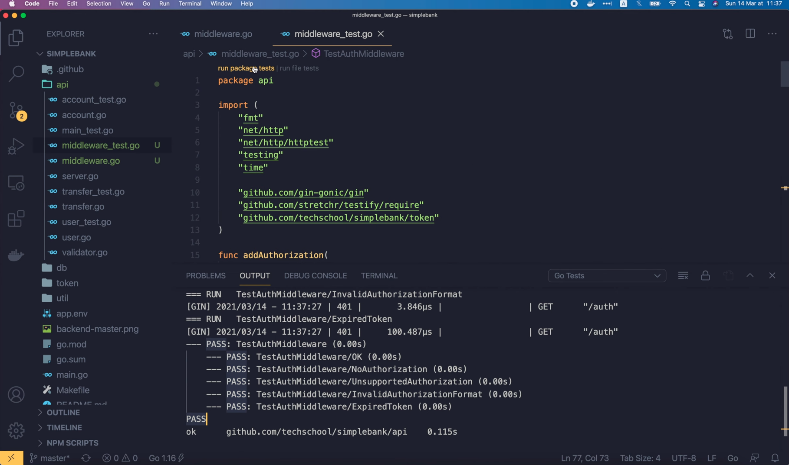

Здорово! Все тесты успешно пройдены.

Давайте попробуем запустить тест для всего пакета, чтобы увидеть покрытие 
кода. В файле `middleware.go` можно увидеть, что вся функция 
`authMiddleware` покрыта.


Итак, вот образец того как нужно писать unit тест для middleware.

## Добавляем middleware для аутентификации к серверу

Теперь когда мы убедились, что middleware для аутентификации работает 
правильно, давайте добавим его к серверу. Я открою файл `api/server.go`.
Мы добавим новое middleware к серверу в функции `setupRouter`. Для
маршрутов `createUser` и `loginUser` не нужно никакой авторизации,
поскольку мы хотим, чтобы каждый мог свободно создать нового пользователя и 
войти в систему. С другой стороны, все остальные API должны быть защищены
middleware для аутентификации. Для этого я создам группу маршрутов с именем 
`authRoutes`, используя метод `router.Group()`. Здесь слеш является префиксом 
пути для всех маршрутов в этой группе. И мы вызываем функцию `.Use()`, чтобы 
добавить `authMiddleware` в группу. Мы передаем интерфейс `server.tokenMaker` 
этой функции более высокого порядка, которая создает middleware для 
аутентификации, точно так же, как мы делали это в unit тесте. Теперь для 
всех оставшихся маршрутов вместо маршрутизатора мы будем использовать 
`authRoutes`, чтобы добавить их в группу. Таким образом, все маршруты в этой 
группе будут использовать одно и то же middleware для аутентификации, которое
мы только что добавили в группу. Таким образом, каждый запрос к этим 
маршрутам должен сначала проходить через middleware для аутентификации. И 
это именно то, чего мы хотим добиться, чтобы авторизовать запросы к API.
Теперь многие наши unit тесты для API не будут работать из-за этого 
изменения. Например, если мы запустим `TestGetAccountAPI`, он закончится
с ошибкой, потому что теперь API возвращает `401` вместо `200`.

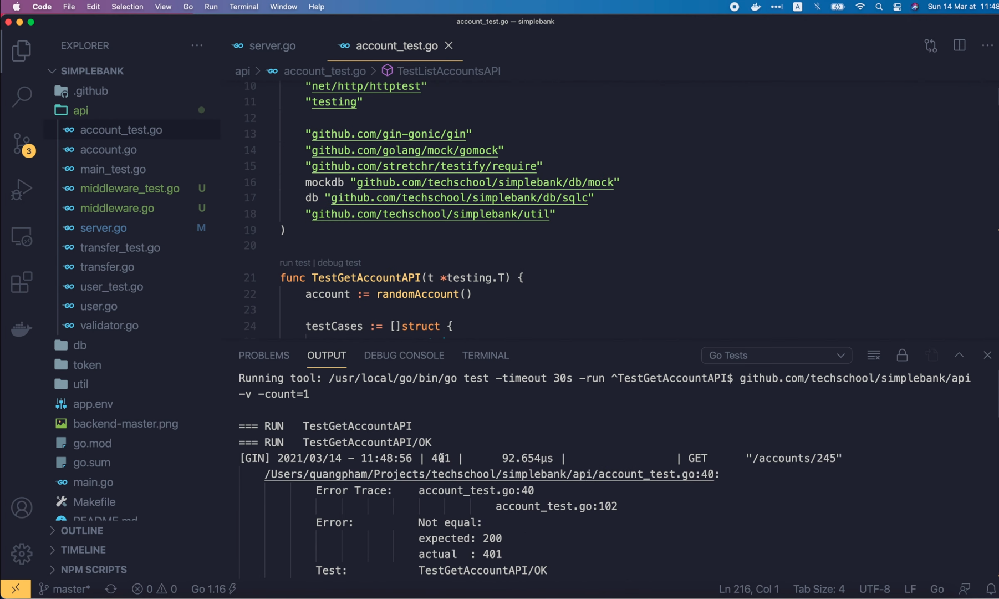

Чтобы этот тест был успешно пройден, нам нужно будет добавить заголовок 
авторизации в запрос. По аналогии с тем, что мы сделали в unit тестах
для middleware. Но прежде чем сделать это, мы должны сделать кое-что 
более важное. Имейте в виду, что все, что делает middleware для 
аутентификации, — это только аутентификация запросов, а это означает, что от 
клиента требуется только предоставить токен доступа, чтобы запрос передался 
реальному обработчику. Но ему все равно, действительно ли у пользователя, 
владеющего токеном, достаточно прав для выполнения действия или нет.
Эта важная часть, которая до сих пор отсутствует, называется авторизацией.

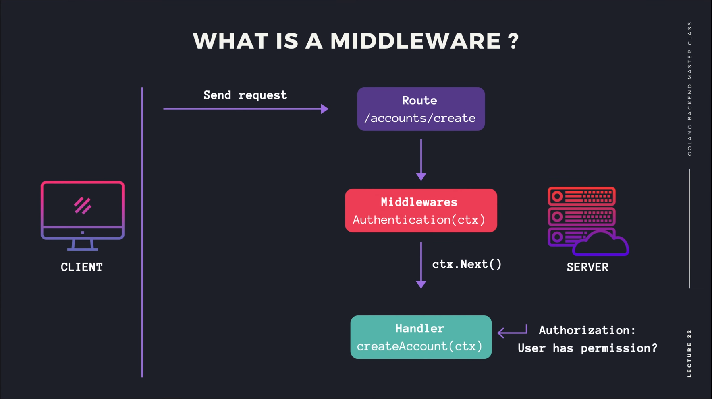

Авторизация часто зависит от API, или, другими словами, правила авторизации 
различны для каждого API, поэтому обычно мы реализуем логику авторизации 
внутри каждого обработчика.

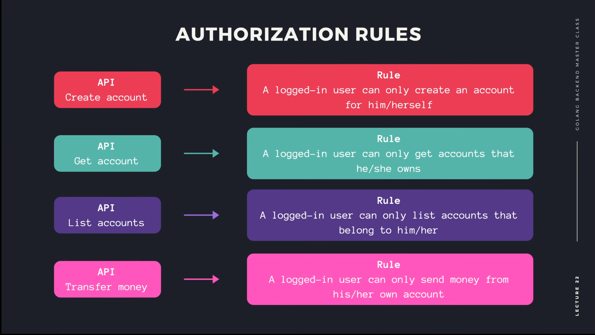

Например, в API для создания банковского счёта мы не хотим, чтобы 
пользователь мог создать банковский счёт, принадлежащую другому пользователю.
Правило таково: пользователь может создать банковский счёт только для себя.
Поэтому здесь мы должны избавиться от поля `owner` («владелец») в структуре
`createAccountRequest`. Значение для поля «владелец» должен браться из
поля `username` вошедшего в систему пользователя, сохраненного в полезной 
нагрузке авторизации. Следовательно, в этом обработчике `createAccount` мы 
получим полезную нагрузку авторизации, вызвав `ctx.MustGet()` и передав 
константу `authorizationPayloadKey`. Обратите внимание, что этот вызов 
вернет обобщенный интерфейс, поэтому мы должны привести его к объекту 
`token.Payload`. Затем поле `owner` структуры `createAccountParams`
должно быть изменено на `authPayload.Username`. Вот так просто мы только 
что добавили авторизацию в обработчик создания банковского счёта. 

```go
type createAccountRequest struct {
	Currency string `json:"currency" binding:"required,currency"`
}

func (server *Server) createAccount(ctx *gin.Context) {
	var req createAccountRequest
	if err := ctx.ShouldBindJSON(&req); err != nil {
		ctx.JSON(http.StatusBadRequest, errorResponse(err))
		return
	}

	authPayload := ctx.MustGet(authorizationPayloadKey).(*token.Payload)
	arg := db.CreateAccountParams{
		Owner:    authPayload.Username,
		Currency: req.Currency,
		Balance:  0,
	}
	...
}
```

Затем давайте перейдём к API для получения банковского счёта. Правило 
авторизации для этого API простое. Пользователь должен иметь возможность 
получить только тот банковский счёт, которой он владеет. Итак, как и раньше, 
я скопирую эту команду

```go
authPayload := ctx.MustGet(authorizationPayloadKey).(*token.Payload)
```

чтобы получить полезную нагрузку авторизации из контекста. Затем, прежде чем 
вернуть банковский счёт клиенту, здесь мы должны проверить, совпадает ли
`account.Owner` с `authPayload.Username` или нет. Если они отличаются, то
мы создадим новую ошибку "Account doesn't belong to authenticated user"
(«Банковский счёт не принадлежит аутентифицированному пользователю»). Затем
мы отправим эту ошибку с HTTP кодом состояния Unauthorized клиенту. И сразу
выходим из функции. Вот и все, что касается API для получения банковского 
счёта.

```go
func (server *Server) getAccount(ctx *gin.Context) {
	...

	authPayload := ctx.MustGet(authorizationPayloadKey).(*token.Payload)
	if account.Owner != authPayload.Username {
		err := errors.New("account doesn't belong to authenticated user")
		ctx.JSON(http.StatusUnauthorized, errorResponse(err))
		return
	}

	ctx.JSON(http.StatusOK, account)
}
```

Как насчет API для списка банковских счётов? Ну, как я сказал в начале лекции
пользователь должен иметь возможность получать список только тех банковских 
счётов, которые принадлежат ему или ей. В настоящее время наш SQL-запрос
ещё не поддерживает фильтрацию банковских счетов по владельцу. Поэтому мы 
должны сначала обновить его. В запрос `ListAccounts` из файла `account.sql`
я добавлю условие: `WHERE owner = $1` и изменю индекс параметров `LIMIT` и 
`OFFSET` на `$2` и `$3` соответственно.

```
-- name: ListAccounts :many
SELECT * FROM accounts
WHERE owner = $1
ORDER BY id
LIMIT $2
OFFSET $3;
```

Затем давайте запустим `make sqlc` в терминале, чтобы перегенерировать Golang 
код для функции `ListAccounts`. Давайте также запустим `make mock`, чтобы 
заново сгенерировать имитацию хранилища для unit тестов API.

Теперь вернемся к коду, здесь, в файле `account.sql.go`, мы видим, что запрос,
возвращающий список банковских счетов был обновлен, и новое поле `Owner` было 
добавлено в структуру `ListAccountsParam`.

```go
type ListAccountsParams struct {
	Owner  string `json:"owner"`
	Limit  int32  `json:"limit"`
	Offset int32  `json:"offset"`
}
```

Это изменение нарушит наш БД тест для функции `ListAccounts`. Итак, давайте 
откроем файл `account_test.go`, чтобы это исправить. В функции 
`TestListAccounts` мы создаем несколько случайных банковских счетов, каждый 
из которых связан с другим случайным пользователем. Поэтому для простоты я
просто найду в базе счет, принадлежащий владельцу последнего созданного
счёта. Я объявлю переменную `lastAccount` для хранения информации о 
последнем сгенерированном банковском счёте в цикле `for`. А в нём мы просто
присвоим `createRandomAccount` переменной `lastAccount`. Затем я добавлю
поле `Owner` к объекту `ListAccountParams`. Его значение должно быть равно 
`lastAccount.Owner`. А поскольку каждый банковский счёт принадлежит разным 
случайным владельцам, не будет много банковских счетов с тем же владельцем, 
что и у последнего. Итак, мы должны изменить `Offset` на 0 вместо 5, чтобы 
у нас была хотя бы 1 запись в списке результатов. Тогда здесь вместо того, 
чтобы требовать, чтобы список содержал 5 записей, мы просто требуем, чтобы 
он не был пустым. И в этом цикле for мы добавим еще одну проверку, чтобы 
убедиться, что владелец банковского счёта, полученного из БД, совпадает с
владельцем `lastAccount`. 

```go
func TestListAccounts(t *testing.T) {
	var lastAccount Account
	for i := 0; i < 10; i++ {
		lastAccount = createRandomAccount(t)
	}

	arg := ListAccountsParams{
		Owner: lastAccount.Owner,
		Limit:  5,
		Offset: 0,
	}

	accounts, err := testQueries.ListAccounts(context.Background(), arg)
	require.NoError(t, err)
	require.NotEmpty(t, accounts)

	for _, account := range accounts {
		require.NotEmpty(t, account)
		require.Equal(t, lastAccount.Owner, account.Owner)
	}
}
```

Хорошо, давайте запустим этот тест.


Он успешной пройден. Так что теперь у нас с тестами всё в порядке. Я закрою 
все эти файлы и вернусь к файлу `api/account.go`, чтобы добавить логику 
авторизации в обработчик списка банковских счетов. Как и в обработчике 
создания и получения банковского счёта, я добавлю команду для получения полезной 
нагрузки авторизации из контекста. Затем давайте добавим поле `Owner` для 
поиска по владельцу со значением `authPayload.Username` в эту структуру 
`ListAccountsParams`. И этого должно быть достаточно.

```go
func (server *Server) listAccount(ctx *gin.Context) {
	var req listAccountRequest
	if err := ctx.ShouldBindQuery(&req); err != nil {
		ctx.JSON(http.StatusBadRequest, errorResponse(err))
		return
	}

	authPayload := ctx.MustGet(authorizationPayloadKey).(*token.Payload)
	arg := db.ListAccountsParams{
		Owner: authPayload.Username,
		Limit:  req.PageSize,
		Offset: (req.PageID - 1) * req.PageSize,
	}

	accounts, err := server.store.ListAccounts(ctx, arg)
	if err != nil {
		ctx.JSON(http.StatusInternalServerError, errorResponse(err))
		return
	}

	ctx.JSON(http.StatusOK, accounts)
}
```

Мы только что добавили правила авторизации во все API управления 
банковскими счетами. Единственный оставшийся API, который требует авторизации, 
а также самый важный, — это API для денежных переводов. Правило заключается в 
том, что пользователь может отправлять деньги только со своего собственного 
счета. Таким образом, по сути мы должны сравнить владельца `fromAccount` 
с аутентифицированным именем пользователя. Для этого у нас должен быть объект
`fromAccount` в функции-обработчике. Поэтому я добавлю `db.Account` в список
возвращаемых значений функции `validAccount`. И мы должны добавить `account` 
ко всем операторам возврата внутри этой функции.

```go
func (server *Server) validAccount(ctx *gin.Context, accountID int64, currency string) (db.Account, bool) {
	account, err := server.store.GetAccount(ctx, accountID)
	if err != nil {
		if err == sql.ErrNoRows {
			ctx.JSON(http.StatusNotFound, errorResponse(err))
			return account, false
		}

		ctx.JSON(http.StatusInternalServerError, errorResponse(err))
		return account, false
	}

	if account.Currency != currency {
		err := fmt.Errorf("account [%d] currency mismatch: %s vs %s", account.ID, account.Currency, currency)
		ctx.JSON(http.StatusBadRequest, errorResponse(err))
		return account, false
	}

	return account, true
}
```

Хорошо, теперь вернитесь к обработчику createTransfer. Здесь мы будем хранить 
результат вызова функции `validAccount` в переменных `fromAccount` и `valid`.
Если банковский счёт невалиден, мы просто выходим из функции, как и раньше. 
Аналогично поступаем с `toAccountID`. Но нам не нужно хранить объект 
банковского счёта в какой-то переменной, потому что он нам не нужен для 
проверки правила авторизации. Поэтому я просто использую здесь символ 
подчеркивания в качестве переменной. Теперь, что касается логики авторизации,
мы сначала получаем полезную нагрузку из контекста, как и в других API. Затем
проверяем равен ли `fromAccount.Owner` `authPayload.Username` или нет. Если
они не совпадают, то мы создаём новую ошибку: "from account
doesn't belong to the authenticated user" (банковский счёт `fromAccount` не
принадлежит аутентифицированному пользователю). И мы просто отправляем эту 
ошибку клиенту с кодом состояния `401 Unauthorized`. Также нужно удалить
двоеточие здесь

```go
_, valid = server.validAccount(ctx, req.ToAccountID, req.Currency)
```

потому что `valid` не является новой переменной. И этого будет достаточно!

```go
func (server *Server) createTransfer(ctx *gin.Context) {
	var req transferRequest
	if err := ctx.ShouldBindJSON(&req); err != nil {
		ctx.JSON(http.StatusBadRequest, errorResponse(err))
		return
	}

	fromAccount, valid := server.validAccount(ctx, req.FromAccountID, req.Currency)
	if !valid {
		return
	}

	authPayload := ctx.MustGet(authorizationPayloadKey).(*token.Payload)
	if fromAccount.Owner != authPayload.Username {
		err := errors.New("from account doesn't belong to the authenticated user")
		ctx.JSON(http.StatusUnauthorized, errorResponse(err))
		return
	}

	_, valid = server.validAccount(ctx, req.ToAccountID, req.Currency)
	if !valid {
		return
	}

	arg := db.TransferTxParams{
		FromAccountID: req.FromAccountID,
		ToAccountID:   req.ToAccountID,
		Amount:        req.Amount,
	}

	result, err := server.store.TransferTx(ctx, arg)
	if err != nil {
		ctx.JSON(http.StatusInternalServerError, errorResponse(err))
		return
	}

	ctx.JSON(http.StatusOK, result)
}
```

Логика авторизации теперь добавлена ко всем необходимым API.

## Обновляем unit тесты API

Теперь пришло время обновить наши unit тесты API, чтобы адаптировать их к 
новому middleware для аутентификации и логике авторизации. Во-первых,
`TestGetAccountAPI`. На данный момент мы генерируем случайного владельца 
внутри функции `randomAccount`, но чтобы упростить тестирование логики 
аутентификации и авторизации, я немного изменю эту функцию. Она будет 
принимать строку `owner` в качестве входных данных и использовать ее в 
качестве владельца банковского счёта вместо генерации случайного значения, 
как она делала ранее.

```go
func randomAccount(owner string) db.Account {
	return db.Account{
		ID:       util.RandomInt(1, 1000),
		Owner:    owner,
		Balance:  util.RandomMoney(),
		Currency: util.RandomCurrency(),
	}
}
```

Теперь в функции `TestGetAccountAPI` мы сначала вызываем `randomUser()` для 
создания случайного пользователя, затем мы передаем `user.Username` в 
функцию для создания случайного банковского счёта.

```go
func TestGetAccountAPI(t *testing.T) {
	user, _ := randomUser(t)
	account := randomAccount(user.Username)
	...
}
```

Хорошо, теперь мы сделаем то же самое, что и в тесте middleware для
аутентификации. Давайте скопируем сигнатуру функции `setupAuth` и вставим ее 
в структуру тестового случая функции  `TestGetAccountAPI`. Затем также 
скопируйте её реализацию для случая `ОК`. На этот раз вместо использования 
константной строки в качестве имени пользователя здесь мы должны подставить 
имя пользователя владельца банковского счёта, то есть `user.Username`.
Эта функция `setupAuth()` должна быть добавлена ко всем существующим 
тестам.

```go
func TestGetAccountAPI(t *testing.T) {
	user, _ := randomUser(t)
	account := randomAccount(user.Username)

	testCases := []struct {
		name          string
		accountID     int64
		setupAuth     func(t *testing.T, request *http.Request, tokenMaker token.Maker)
		buildStubs    func(store *mockdb.MockStore)
		checkResponse func(t *testing.T, recoder *httptest.ResponseRecorder)
	}{
		{
			name:      "OK",
			accountID: account.ID,
			setupAuth: func(t *testing.T, request *http.Request, tokenMaker token.Maker) {
				addAuthorization(t, request, tokenMaker, authorizationTypeBearer, user.Username, time.Minute)
			},
			buildStubs: func(store *mockdb.MockStore) {
				store.EXPECT().
					GetAccount(gomock.Any(), gomock.Eq(account.ID)).
					Times(1).
					Return(account, nil)
			},
			checkResponse: func(t *testing.T, recorder *httptest.ResponseRecorder) {
				require.Equal(t, http.StatusOK, recorder.Code)
				requireBodyMatchAccount(t, recorder.Body, account)
			},
		},
		{
			name:      "NotFound",
			accountID: account.ID,
			setupAuth: func(t *testing.T, request *http.Request, tokenMaker token.Maker) {
				addAuthorization(t, request, tokenMaker, authorizationTypeBearer, user.Username, time.Minute)
			},
			buildStubs: func(store *mockdb.MockStore) {
				store.EXPECT().
					GetAccount(gomock.Any(), gomock.Eq(account.ID)).
					Times(1).
					Return(db.Account{}, sql.ErrNoRows)
			},
			checkResponse: func(t *testing.T, recorder *httptest.ResponseRecorder) {
				require.Equal(t, http.StatusNotFound, recorder.Code)
			},
		},
		{
			name:      "InternalError",
			accountID: account.ID,
			setupAuth: func(t *testing.T, request *http.Request, tokenMaker token.Maker) {
				addAuthorization(t, request, tokenMaker, authorizationTypeBearer, user.Username, time.Minute)
			},
			buildStubs: func(store *mockdb.MockStore) {
				store.EXPECT().
					GetAccount(gomock.Any(), gomock.Eq(account.ID)).
					Times(1).
					Return(db.Account{}, sql.ErrConnDone)
			},
			checkResponse: func(t *testing.T, recorder *httptest.ResponseRecorder) {
				require.Equal(t, http.StatusInternalServerError, recorder.Code)
			},
		},
		{
			name:      "InvalidID",
			accountID: 0,
			setupAuth: func(t *testing.T, request *http.Request, tokenMaker token.Maker) {
				addAuthorization(t, request, tokenMaker, authorizationTypeBearer, user.Username, time.Minute)
			},
			buildStubs: func(store *mockdb.MockStore) {
				store.EXPECT().
					GetAccount(gomock.Any(), gomock.Any()).
					Times(0)
			},
			checkResponse: func(t *testing.T, recorder *httptest.ResponseRecorder) {
				require.Equal(t, http.StatusBadRequest, recorder.Code)
			},
		},
	}
	
	...
}
```

Затем в основной части теста перед `server.router.ServeHTTP` мы 
должны вызвать `tc.setupAuth` с `t`, `request` и `server.tokenMaker`. На 
этом всё!

```go
func TestGetAccountAPI(t *testing.T) {
	...
	
    for i := range testCases {
		tc := testCases[i]

		t.Run(tc.name, func(t *testing.T) {
			...

			tc.setupAuth(t, request, server.tokenMaker)

			server.router.ServeHTTP(recorder, request)
			tc.checkResponse(t, recorder)
		})
	}
}
```

Но перед тем как запустить тест, мы должны исправить все ошибки в других 
unit тестах из-за изменения, которое внесли в функцию `randomAccount()`.
Итак, давайте скопируем эти две команды из `TestGetAccountAPI` и вставим
их в функцию `TestCreateAccountAPI`.

```go
func TestCreateAccountAPI(t *testing.T) {
    user, _ := randomUser(t)
    account := randomAccount(user.Username)
	
	...
}
```

Допустим, для `TestListAccountsAPI` мы будем использовать одного и того же 
пользователя для всех банковских счетов. Поэтому мы просто создаем 
пользователя в верхней части функции. Затем используем имя этого 
пользователя для всех банковских счетов внутри цикла `for`.

```go
func TestListAccountsAPI(t *testing.T) {
	user, _ := randomUser(t)

	n := 5
	accounts := make([]db.Account, n)
	for i := 0; i < n; i++ {
		accounts[i] = randomAccount(user.Username)
	}
	
	...
	
}
```

Итак, ошибки ещё остались в файле `transfer_test.go`. В `TestTransferAPI` у 
нас три разных банковских счёта, поэтому давайте создадим 3 разных 
пользователя для каждой из них. Чтобы создать `account1`, мы передаем 
`user1.Username`, для `account2` мы передаем `user2.Username`, и аналогично, 
владельцем `account3` будет `user3.Username`. Хорошо, теперь все ошибки 
исправлены.

```go
func TestTransferAPI(t *testing.T) {
	amount := int64(10)

	user1, _ := randomUser(t)
	user2, _ := randomUser(t)
	user3, _ := randomUser(t)

	account1 := randomAccount(user1.Username)
	account2 := randomAccount(user2.Username)
	account3 := randomAccount(user3.Username)
	
	...
}
```

Давайте запустим unit тесты Get Account API.

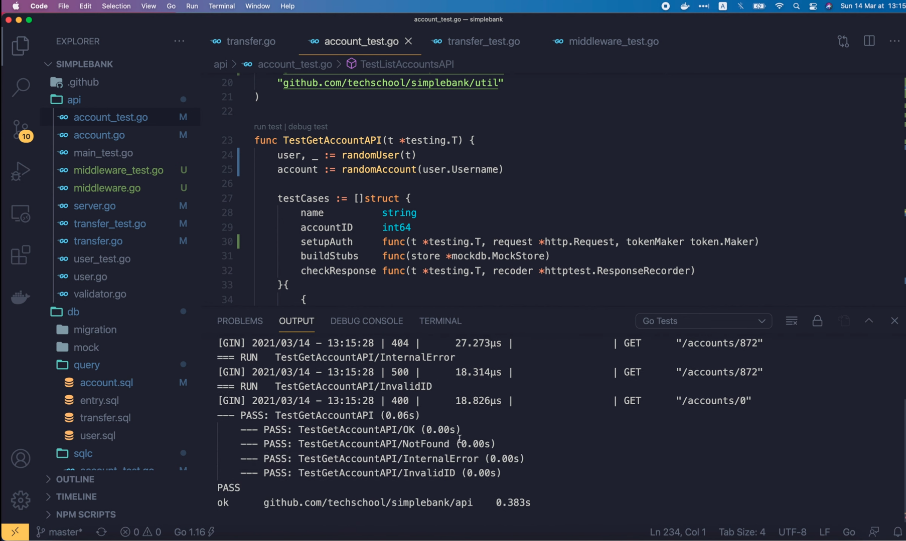

Они все успешно пройдены! Потрясающе! 

Теперь, чтобы ещё больше повысить надежность, я добавлю в список еще 
несколько тестовых случаев.

Во-первых, случай `UnauthorizedUser`, когда мы используем токен другого 
пользователя, который не является владельцем учетной записи. 
Скопируйте код для тестового случая `OK` и измените поле `name` на
"UnauthorizedUser". Пусть имя пользователя равно, например, 
"unauthorized_user". В этом случае мы ожидаем, что код состояния ответа 
будет `http.StatusUnauthorized` вместо `OK`. И мы можем удалить эту 
проверку `requireBodyMatchAccount`.

```go
func TestGetAccountAPI(t *testing.T) {
	...
    testCases := []struct {
        name          string
        accountID     int64
        setupAuth     func(t *testing.T, request *http.Request, tokenMaker token.Maker)
        buildStubs    func(store *mockdb.MockStore)
        checkResponse func(t *testing.T, recoder *httptest.ResponseRecorder)
    }{
    	...
        {
            name:      "UnauthorizedUser",
            accountID: account.ID,
            setupAuth: func(t *testing.T, request *http.Request, tokenMaker token.Maker) {
                addAuthorization(t, request, tokenMaker, authorizationTypeBearer, "unauthorized_user", time.Minute)
            },
            buildStubs: func(store *mockdb.MockStore) {
                store.EXPECT().
                    GetAccount(gomock.Any(), gomock.Eq(account.ID)).
                    Times(1).
                    Return(account, nil)
            },
            checkResponse: func(t *testing.T, recorder *httptest.ResponseRecorder) {
                require.Equal(t, http.StatusUnauthorized, recorder.Code)
            },
        },
        ...
    }
}
```

Добавим ещё один случай: `No Authorization`. Скопируйте код для тестового 
случая `OK` и измените поле `name` на "NoAuthorization". В этом случае 
клиент не предоставит токен доступа для аутентификации запроса, поэтому мы 
удалим этот вызов функции `addAuthorization`. В этом случае запрос должен 
быть прерван в middleware для аутентификации, чтобы он не достиг обработчика.
Поэтому в функции `buildStubs` мы ожидаем, что функция `GetAccount` 
вообще не будет вызываться. Чтобы убедиться в этом, нам просто нужно изменить 
второй параметр-заглушку в `GetAccount` на `gomock.Any()`, количество 
вызовов этой функции на `0`, и убрать здесь возврат банковского счёта.
Ожидаемый код состояния ответа будет `Unauthorized`, как и в предыдущем случае.

```go
func TestGetAccountAPI(t *testing.T) {
	...
    testCases := []struct {
        name          string
        accountID     int64
        setupAuth     func(t *testing.T, request *http.Request, tokenMaker token.Maker)
        buildStubs    func(store *mockdb.MockStore)
        checkResponse func(t *testing.T, recoder *httptest.ResponseRecorder)
    }{
    	...
        {
            name:      "NoAuthorization",
            accountID: account.ID,
            setupAuth: func(t *testing.T, request *http.Request, tokenMaker token.Maker) {
            },
            buildStubs: func(store *mockdb.MockStore) {
                store.EXPECT().
                    GetAccount(gomock.Any(), gomock.Any()).
                    Times(0)
            },
            checkResponse: func(t *testing.T, recorder *httptest.ResponseRecorder) {
                require.Equal(t, http.StatusUnauthorized, recorder.Code)
            },
        },
        ...
    }
}
```

Хорошо, теперь давайте снова запустим тест Get Account API.


Все тесты успешно пройдены! Включая два случая, которые мы только что 
добавили. Итак, теперь вы знаете, как обновить unit тесты Get Account 
API, чтобы они успешно выполнялись с новым middleware аутентификации и
добавленной логикой авторизации.

Вы можете использовать эту же методику для обновления остальных unit тестов 
API для создания банковского счёта, списка банковских счётов и перевода 
денег. Я оставлю это вам в качестве упражнения, чтобы вы могли 
попрактиковаться. И если вы захотите посмотреть, как я их реализовал,
не стесняйтесь просмотреть [Github репозиторий] (https://github.com/techschool/simplebank)
курса.

## Отправляем запросы к API, используя Postman

Теперь, прежде чем мы закончим, давайте запустим сервер. И отправим
несколько реальных запросов к API в Postman, чтобы проверить правильность
их работы. Во-первых, давайте проверим List Accounts API.


Мы получили ответ от сервера с кодом состояния `401 Unauthorized`, поскольку
срок действия токена доступа, который мы использовали в начале лекции, истёк.
Итак, давайте отправим ещё один запрос на вход в систему, чтобы получить 
новый.

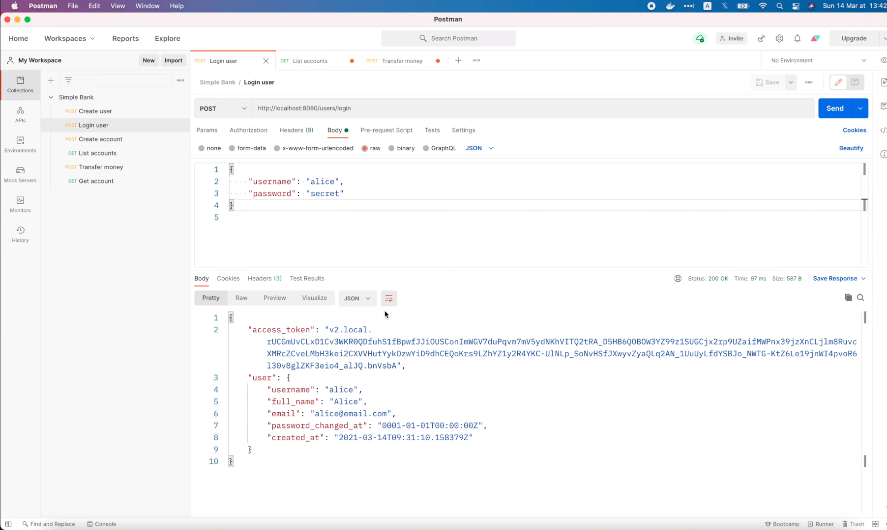

Отлично, он прошёл успешно, поэтому я скопирую этот новый токен доступа.
Вернитесь к запросу списка банковских счётов, откройте вкладку `Authorization` 
и вставьте новый токен доступа в это поле.

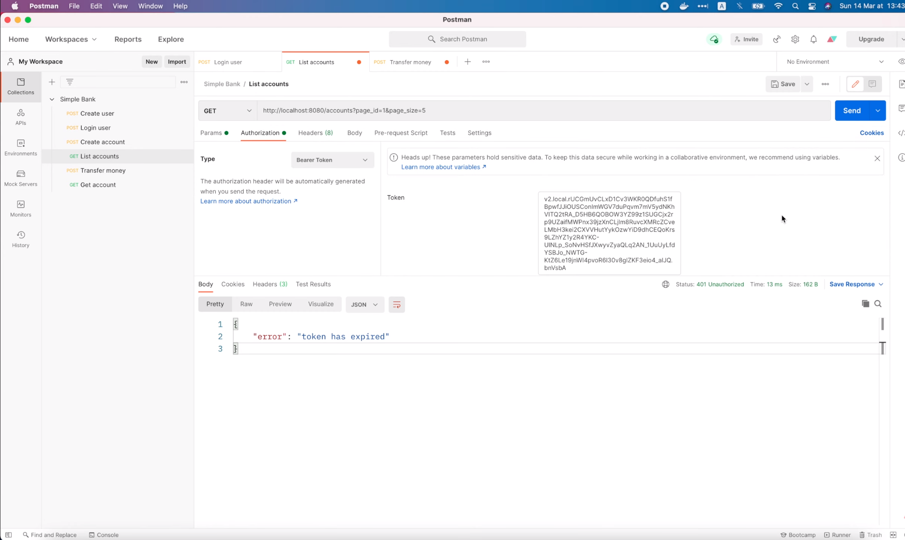

Затем снова нажмите `Send`. На этот раз запрос выполнен успешно. И посмотрите 
на данные ответа, мы получили список из трёх аккаунтов, каждый из 
которых принадлежит Алисе. 

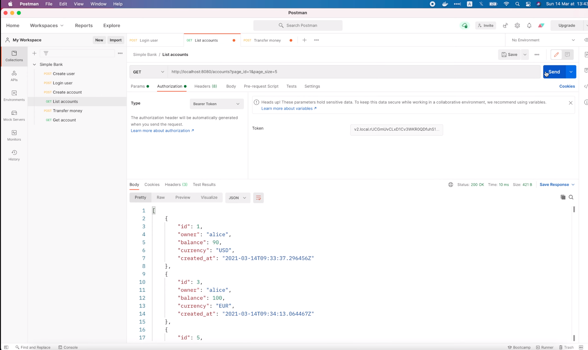

Таким образом, это именно то, чего мы хотели достичь. Алиса может 
просматривать только свои банковские счета. Ей больше не доступны счета 
других пользователей, как раньше. Теперь давайте протестируем работу 
API для перевода денег.

Во-первых, я попытаюсь отправить деньги со счета Алисы на счет Боба.
Таким образом, `from_account_id` должно быть равен 1, а `to_account_id` - 2. 
Давайте отправим запрос. Опять срок действия токена истек.

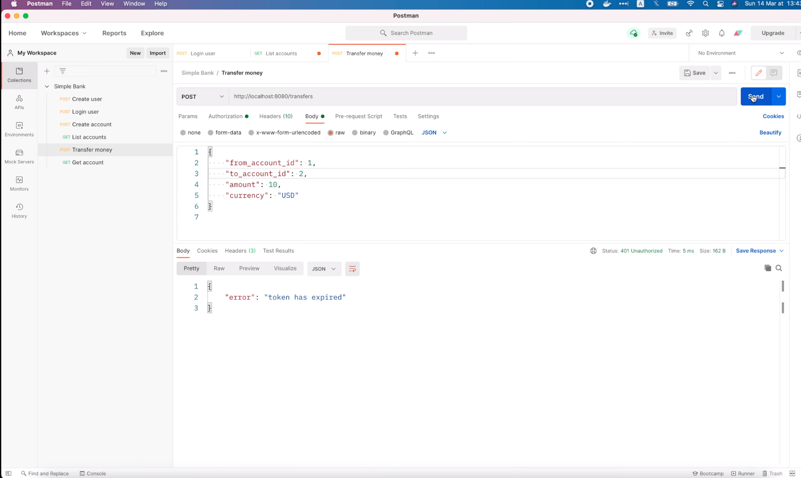

Это связано с тем, что запрос всё ещё использует старый токен доступа. 
Перейдем на вкладку `Authorization` и вставим новый. Затем отправьте запрос 
ещё раз.

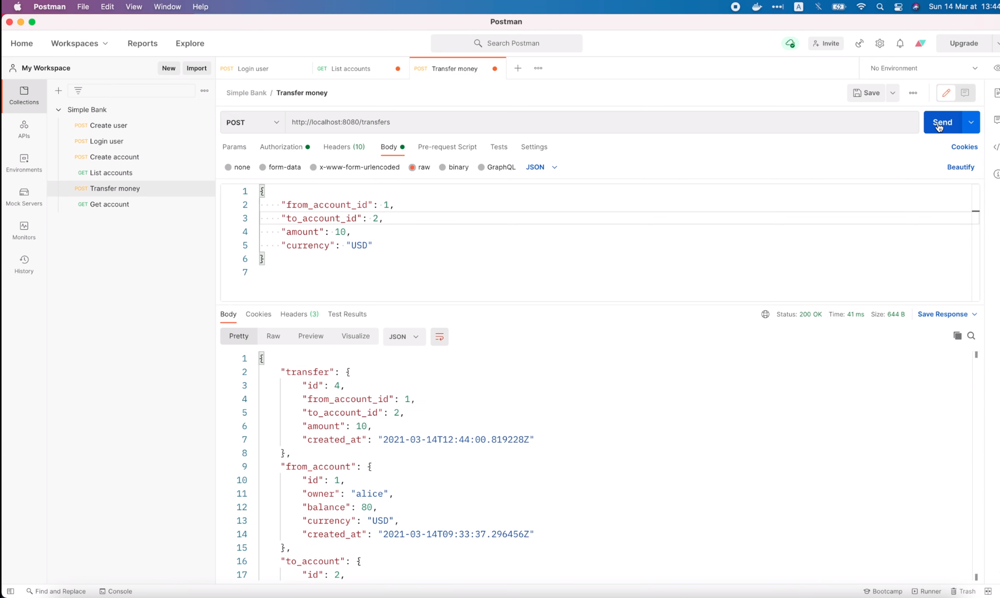

В этот раз он успешно выполнился. 10 долларов были переведены со счета 1 
Алисы на счет 2 Боба.

Хорошо, теперь давайте посмотрим, что произойдет, если мы попытаемся перевести 
деньги со счета 2 на счет 1. Это случай, когда Алиса пытается украсть деньги 
со счета Боба на свой собственный счет.

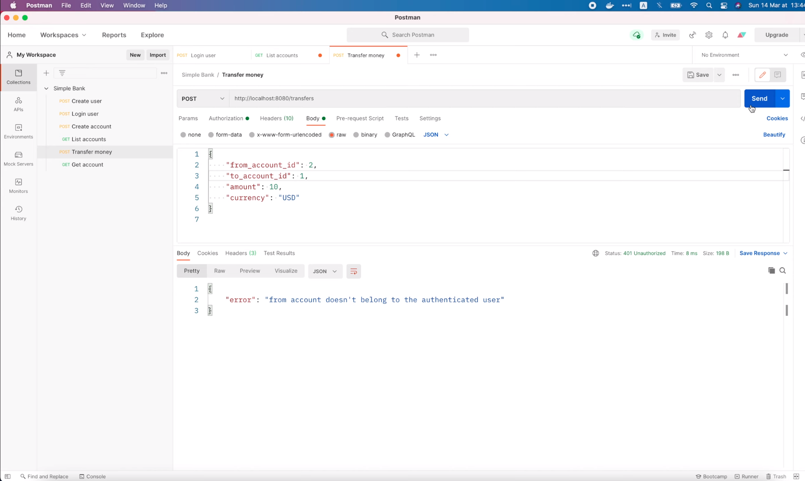

Как видите, запрос не был выполнен. Мы получили код состояния 
`401 Unauthorized`, потому что `from_account` не принадлежит 
аутентифицированному пользователю, которым в данном случае является Алиса.
Таким образом, API перевода денег хорошо защищен middleware для аутентификации
и правилами авторизации.

На этом я закончу эту лекцию. Вы можете попробовать вызывать остальные API 
самостоятельно, если хотите. Надеюсь, вам понравилась лекция. Спасибо за 
время потраченное на чтение! Желаю вам получать удовольствие от обучения и
до встречи на следующей лекции!