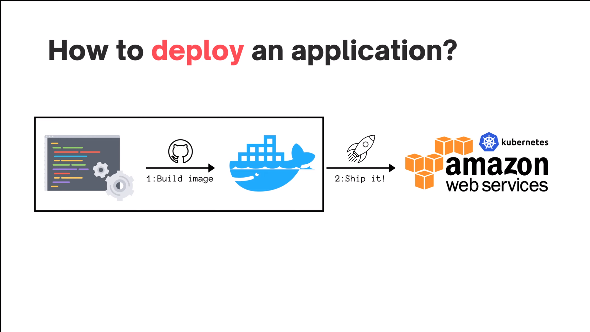
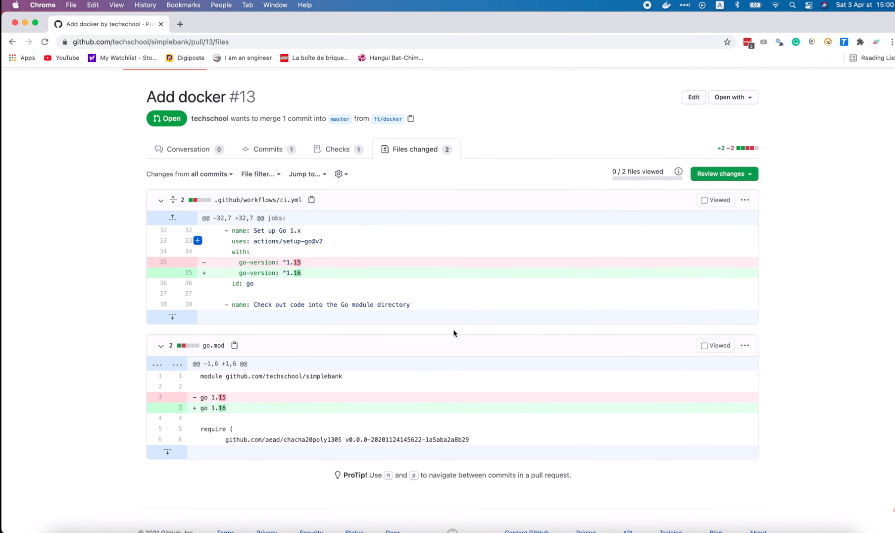
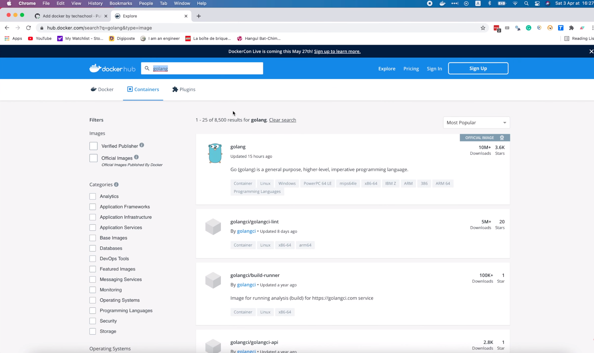
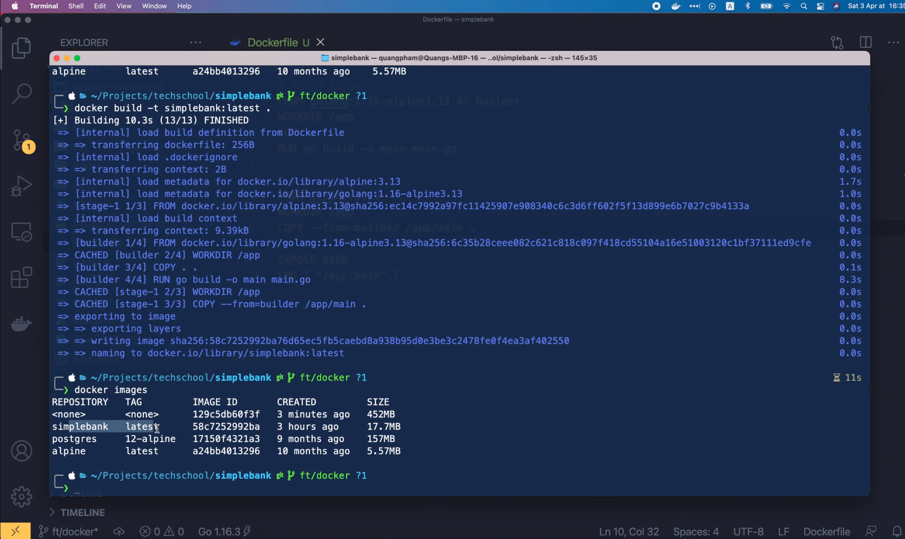
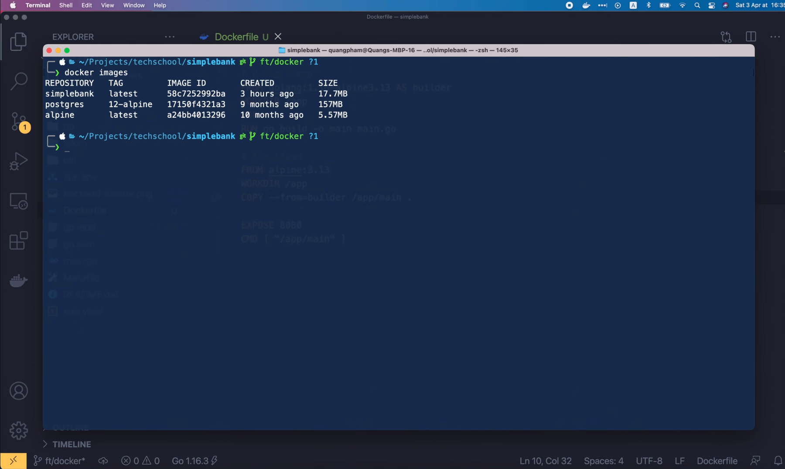

# Build a minimal Golang Docker image with a multistage Dockerfile

[Original video](https://www.youtube.com/watch?v=p1dwLKAxUxA)

Hello everyone and welcome back to the backend master class.

So far we have built quite a number of APIs for our simple bank application
using Golang. There are still some more advanced features I want to add, but 
for now I think the app has reached the state where it can be deployed to 
production.

## How to deploy an application?

So I will make several videos to show you how to automatically
package and deploy the app to Amazon web services (AWS). In this lecture, we
will start with the first step: dockerize the application.



Since it is a pretty simple thing to do, I will take this opportunity to 
also show you how to apply simple git branching flow in your development 
process. OK, let's start!

Here you can see that we're on the `master` branch of our simple bank project.


A rule of thumb is: never push changes directly to the master branch. When 
start working on a new feature, we should create a new separate branch from 
master, and only merge it back after the new code is properly tested and 
reviewed. To create a new branch, we run: `git checkout -b` followed by the 
name of the branch we want to create. In this case, I'm gonna name it 
ft/docker. Here, `ft` stands for `feature`. Now as you can see, the current 
git branch has been changed to `ft/docker`.


In Visual Studio Code, you can also see the current branch at the bottom left
corner. Recently I've updated Golang to the latest version 1.16.3, so before
writing the Dockerfile, let's update our project to make sure it is compatible 
with this new version. First in the `go.mod` file, we should change the go
version from 1.15 to 1.16. Then in the github workflow `ci.yaml` file scroll
down to the setup Go step. We have to update this Go version to 1.16 as well.
OK, now let's open the terminal and commit this change.

First we run `git status` to see the list of changes. We've changed 2 files,
but they're not staged for commit yet, so let's run `git add .` to stage them
for commit. Then run `git commit -m` to create a new commit. Finally, we push
it to Github by running: 

```shell
`git push origin ft/docker`
```


OK, our changes are pushed to Github, and we can use this link 
(`https://github.com/techschool/simplebank/pull/new/ft/docker`) to create a
new pull request to merge it to master. So let's copy and paste it to the 
browser. We can write the name of the pull request in this box, let's say `Add 
docker` and click `Create pull request`.


After the PR is created, we can see all the changes in this tab.



Now back to the `Conversation` tab we can see that the CI unit test is 
triggered and running. You can click on the link to see its progress.


The tests are very important to make sure that our code still work well with 
Go 1.16. OK, the tests finished successfully. But, there's one thing I notice
in this ci.yaml file. The golang-migrate version I'm using here, 4.12.2, might
be different from the one running on my mac. Let's run `migrate -version` to
check it.

```shell
migrate -version
```

Indeed, the current golang migrate version on my mac is older: version 4.11.0.
So let's try updating it to the latest version. I'm gonna copy the "brew 
install golang-migrate" command from the README file. To update golang-migrate
instead of `brew install` we should run `brew upgrade`. Note that it is 
`upgrade` and not `update`. The `brew update` command will update brew itself.

Alright, golang-migrate has been updated to the latest version: 4.14.1. Let's
run `make migrateup` to make sure it's still working well. It's successful!

So let's go back to the ci.yaml file, and replace this download link with this
latest version. Then let's add this new change. Commit it. And push the change
to Github, just like what we did before. The CI test is running again, so let's 
wait a bit for it to finish. OK, the test passed.

Now the app is really ready for the first release!

Let's learn how to write a Dockerfile to package it for shipping!

I'm gonna create a new file: `Dockerfile` with a capital D at the root of our 
project. The first step is to define the base image to build our application.
As our app is developed in Golang, we will need a golang base image to build
it. So let's search for it on Docker Hub. OK, this one is the official docker
image for Golang.



If we scroll down a bit, we can see a list of supported tags, corresponding
to different version of Golang and its base OS. In order to produce a small
output image, we should use the alpine version. In the `Dockerfile`, we use
the `FROM` instruction to specify the base image. In this case we will use
`golang:1.16-alpine3.13`.

```dockerfile
FROM golang:1.16-alpine3.13
```

Next, we use the `WORKDIR` instruction to declare the current working directory
inside the image. To be simple, I'm gonna use `/app` here.

```dockerfile
WORKDIR /app
```

We will then copy all necessary files to this folder using the `COPY` 
instruction. The first dot means that copy everything from current folder,
where we run the `docker build` command to build the image. In this case,
we will build from the root of our project, so everything under the `simple
bank` folder will be copied to the image. The second dot is the current working
directory inside the image, where the files and folders are being copied to.
As we've already stated that the current `WORKDIR` is `/app` before, that will
be the place to store the copied data.

```dockerfile
COPY . .
```

Alright, next step, we will build our app to a single binary executable file.
We do that with the `RUN` instruction. So `RUN go build -o`, which stands for
output. Then the name of the output binary file, let's say `main`. And 
finally, pass in the main entrypoint file of our application, which is 
`main.go`. It's right here, at the root of the project.

```dockerfile
RUN go build -o main main.go
```

It's also a best practice to use the `EXPOSE` instruction to inform Docker 
that the container listens on the specified network port at runtime. In our 
case, it's port `8080` as we declared in the `app.env` file. It's worth noting 
that the `EXPOSE` instruction doesn't actually publish the port. It only
functions as a documentation between the person who builds the image, and the
person who runs the container, about which ports are intended to be published.

```dockerfile
EXPOSE 8080
```

Alright, now the last step we need to do is to define the default command to
run when the container starts. We use the `CMD` instruction for this purpose.
It's an array of command-line arguments. In our case, we just need to run the
executable file that we've built in the previous step. So there's only 1 single
argument: `/app/main`.

```dockerfile
CMD ["/app/main"]
```

And that's basically it! The Dockerfile is completed. Now to build the image,
we will run the `docker build` command in the terminal.


It has a number of options. For example, the `file` option is used to specify
the name of the `Dockerfile`, if it is different from the default name, which 
is `Dockerfile` with a capital D. Our `Dockerfile` already has this default
name, so we don't have to use this option. But, we will need another option,
the `tag`. This option is used to specify the name and tag for the output 
image. OK, let's run `docker build -t`. The image tag will be 
`simplebank:latest`, separated by a colon and finally the path to the 
`Dockerfile` is dot, which is the current folder.

```shell
docker build -t simplebank:latest .
```

It will take a while to complete. OK, the image is built. We can run 
`docker images` to list all images. Here's the `simplebank` image that we've
just created.


Its name is `simplebank`, and its tag is `latest`. So it worked! However, this
image size is pretty large: 452 MB. It's 80 times heavier than the alpine 
linux image. So is it possible to reduce the size of the output image? The 
answer is yes! We can use multi-stage build to achieve it. The reason for the
heavy output image is that it contains Golang and all packages that are 
required by our project. But, the only thing we need to be able to run the app
is just the output binary file after running `go build` command. We don't 
need anything else, even the original Golang code. So, if we can produce an
image with just the binary file, then its size would be very small. To do that,
I'm gonna convert this Dockerfile into multistage. The first stage will be the
build stage, where we just build the binary file. All we have to do is to add
the `AS` keyword to the end of the `FROM` instruction, followed by the name
of the stage, let's say `builder` in this case.

```dockerfile
# Builds stage
FROM golang:1.16-alpine3.13 AS builder
```

Then after the binary file is produced, we will build the second stage, which 
is the final `Run` stage. Just like in the build stage, we use `FROM` 
instruction to specify the base image from this run stage. And since we want
the output image size to be small, let's use alpine linux as the base image. 
Here I use the alpine version `3.13`, same as the build stage to make sure 
everything is compatible. And similar as before, we set the current working
directory of the image to be `/app`. Now we need to copy the executable
binary file from the builder stage to this run stage image.

```dockerfile
# Run stage
FROM alpine3.13
WORKDIR /app
```

How can we do that? Well, we just use the same `COPY` command as before, but 
this time, we use the `--from` argument to tell Docker, where to copy the file
from. In this case, it should copy from the builder stage, so we put the name
of that stage here. Then the path to the file we want to copy, which is 
`/app/main` and finally the target location in the final image to copy that 
file to, which should be the current working folder. This dot represents the
`WORKDIR` that we set above: `/app`. And that will be it!

```dockerfile
COPY --from=builder /app/main .
```

The multistage build Dockerfile is completed. Let's run `docker build` again
to see how it goes!


OK, the build finished. Let's list all docker images. Here we go!



The new `simplebank` latest image has been created. And its new size is just 
`17.7MB`, 25 times smaller than the previous image. Awesome! Now you can see
the previous image here, but its repository name and tag have changed to 
`<none>`. That's because we use the same tag `simplebank:latest` to tag the
new output image. So naturally the old image's tag should be removed to
prevent having 2 different images with the same tag. We can use `docker rmi`
command to remove the old image.

```shell
docker rmi 129c5db60f3f
```

Now if we list the images again, the old one is gone.



So today we have successfully learned how to write a multi-stage Docker file
to build a very light-weight docker image for our application. We will 
continue in the next lecture, where I'm gonna show you how to run the app 
using the docker image that we built today and connect it to an existing 
Postgres container via a user-defined docker network.

Thanks a lot for watching, happy learning, and see you soon in the next 
lecture!