# Создаём минимизированный Golang Docker образ с помощью Dockerfile с многоступенчатой сборкой 

[Оригинал](https://www.youtube.com/watch?v=p1dwLKAxUxA)

Всем привет и рад вас снова видеть на мастер-классе по бэкенду.

На данный момент мы создали довольно много API-интерфейсов для нашего простого 
банковского приложения с использованием Golang. Есть еще несколько более 
сложных тем, которые я бы хотел добавить, но на данный момент я думаю, что 
приложение достигло состояния, когда его можно развернуть на продакшене.

## Как развернуть приложение?

Поэтому я создам несколько видео, чтобы показать вам, как автоматически 
упаковать и развернуть приложение в веб-сервисах Amazon (AWS). В этой лекции 
мы начнем с первого шага: докеризации приложения.

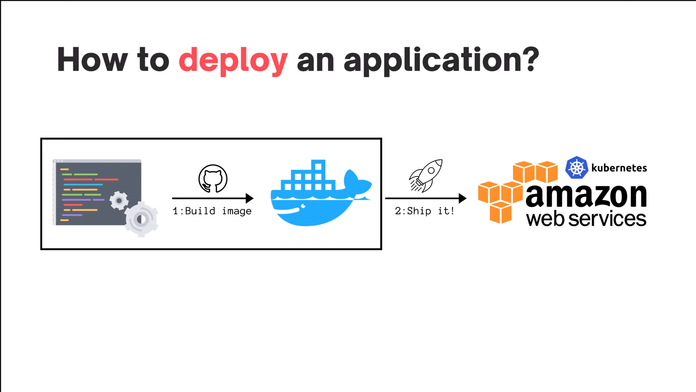

Поскольку это довольно просто сделать, я также покажу вам как применять 
ветвление в Git в ходе процесса разработки. Хорошо, давайте начнем!

Здесь на рисунке видно, что мы находимся на ветке `master` нашего проекта 
простого банковского приложения.

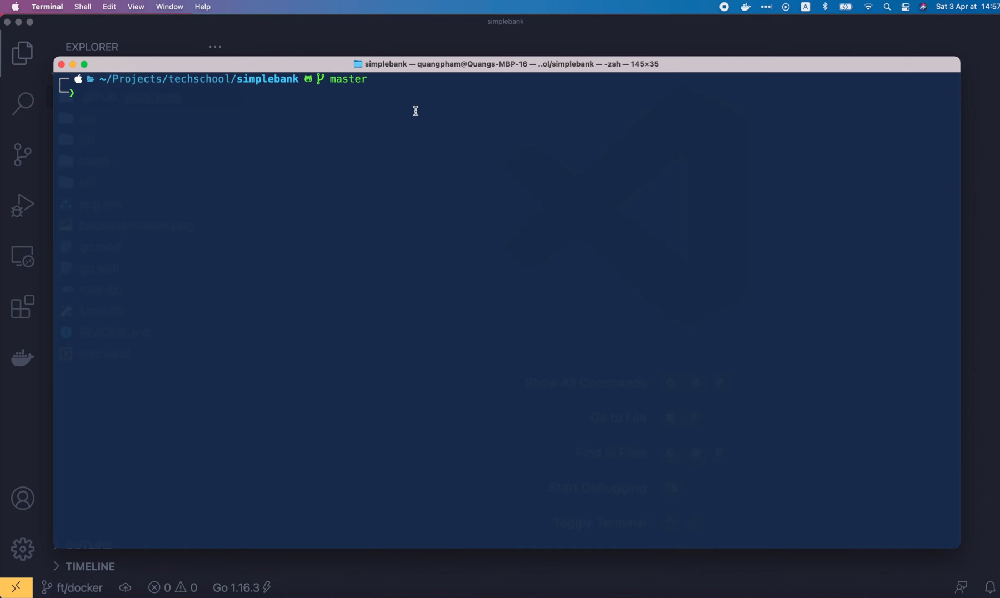

Правильно хорошего тона: никогда не отправляйте изменения непосредственно в 
ветку `master`. Когда мы начинаем работать над новым функционалом, мы должны 
создать новую отдельную ветку от `master` и объединить ее обратно с ней 
только после того, как новый код будет должным образом протестирован и 
проверен. Чтобы создать новую ветку, мы вводим в терминале: `git checkout -b`, 
а затем название ветки, которую мы хотим создать. В нашем случае я назову 
его `ft/docker`. Здесь `ft` это сокращение от `feature` (новый функционал).
После выполнения команды как видно на рисунке, текущая ветка в Git была
изменена на `ft/docker`.

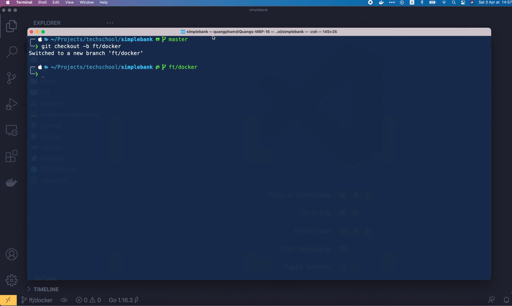

В Visual Studio Code вы также можете увидеть текущую ветку в левом нижнем 
углу. Недавно я обновил Golang до последней версии 1.16.3, поэтому, прежде
чем создать `Dockerfile`, давайте обновим наш проект, чтобы убедиться, что он 
совместим с этой новой версией. Сначала в файле «go.mod» мы должны изменить 
версию Go с `1.15` на `1.16`. Затем в файле `ci.yaml` рабочего процесса для
Github прокрутите вниз до шага настройки Go. Мы также должны обновить эту 
версию Go до `1.16`. Хорошо, теперь давайте откроем терминал и зафиксируем 
это изменение.

Сначала мы запускаем `git status`, чтобы увидеть список изменений. Мы 
изменили 2 файла, но они еще не подготовлены для фиксации, поэтому давайте 
запустим `git add .`, чтобы сделать это. Затем запустите `git commit -m`, 
чтобы создать новый коммит. Наконец, мы отправляем его в Github, выполнив
в терминале команду:

```shell
`git push origin ft/docker`
```

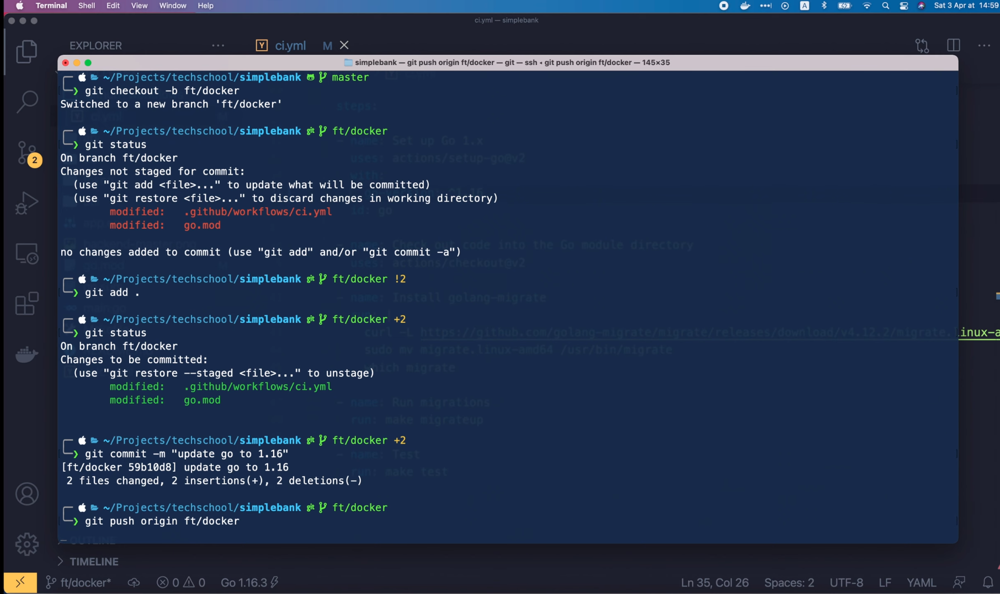

Хорошо, наши изменения отправлены на Github, и мы можем использовать эту 
ссылку (`https://github.com/techschool/simplebank/pull/new/ft/docker`)
чтобы создать новый запрос на слияние, чтобы объединить ветку с `master`.
Итак, давайте скопируем и вставим её в браузер. Мы можем написать название 
запроса на слияние в это поле, показанное на рисунке, скажем, `Add
docker` («Добавляем докер») и нажать `Create pull request` («Создать запрос 
на слияние»).

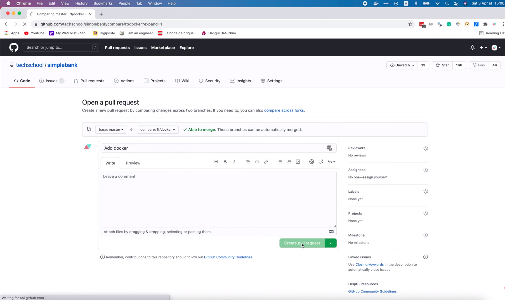

После создания PR (запроса на слияние), мы можем увидеть все изменения в 
этой вкладке.

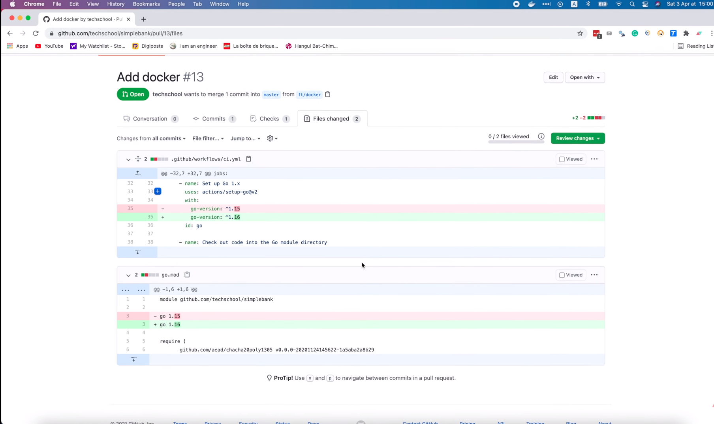

Теперь вернувшись на вкладку «Обсуждение», и мы увидим, что CI unit тест
запущен и работает. Вы можете нажать на ссылку, показанную на рисунке, чтобы 
увидеть его прогресс.

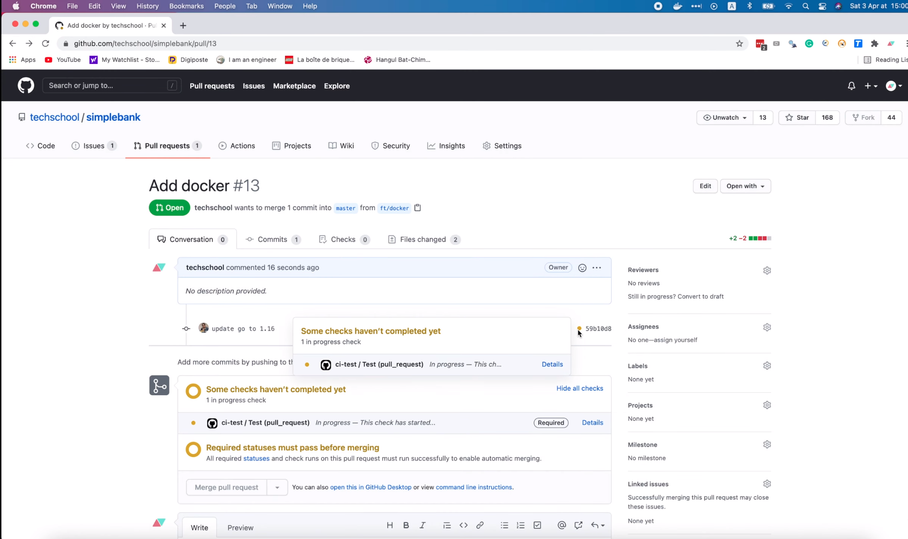

Тесты очень важны, чтобы убедиться, что наш код все ещё хорошо работает с 
Go `1.16`. Хорошо, тесты были успешно пройдены. Но я заметил кое-что в этом 
файле `ci.yaml`. Версия `golang-migrate`, которую я использую здесь, `4.12.2`, 
может отличаться от той, которая установлена на моем Mac. Давайте запустим 
`migrate -version`, чтобы проверить это.

```shell
migrate -version
```

Действительно, текущая версия `golang-migrate` на моем Mac старее: `4.11.0`.
Итак, давайте попробуем обновить её до последней версии. Я скопирую команду
"brew install golang-migrate" из файла README. Чтобы обновить `golang-migrate`
вместо `brew install`, мы должны выполнить `brew upgrade`. Обратите внимание, 
что надо ввести `upgrade`, а не `update`. Команда `brew update` обновит сам 
`brew`.

Хорошо, после выполнения команды `golang-migrate` обновился до последней 
версии: `4.14.1`. Давайте запустим `make migrateup`, чтобы убедиться, что
всё работает как надо. Всё в порядке, миграции успешно выполнились!

Итак, давайте вернёмся к файлу `ci.yaml` и заменим в этой ссылке для 
скачивания

```yaml
  - name: Install golang-migrate
    run: |
      curl -L https://github.com/golang-migrate/migrate/releases/download/v4.12.2/migrate.linux-amd64.tar.gz | tar xvz
      sudo mv migrate.linux-amd64 /usr/bin/migrate
      which migrate
```

версию на последнюю.

```yaml
  - name: Install golang-migrate
    run: |
      curl -L https://github.com/golang-migrate/migrate/releases/download/v4.14.1/migrate.linux-amd64.tar.gz | tar xvz
      sudo mv migrate.linux-amd64 /usr/bin/migrate
      which migrate
```

Затем давайте добавим это новое изменение в Git. Зафиксируйте его и отправьте
изменения на GitHub, как мы это делали раньше. CI тест снова запустится, 
поэтому давайте немного подождём до его завершения. Тест должен быть успешно
пройден.

Теперь приложение действительно готово к первому релизу!

Давайте узнаем, как написать Dockerfile, в который упакуем его для отправки 
на продакшен!

Я собираюсь создать новый файл: `Dockerfile` с заглавной `D` в корне нашего 
проекта. Первым шагом является выбор базового образа для создания нашего 
приложения. Поскольку наше приложение разработано на Golang, для его создания 
нам понадобится базовый образ Golang. Итак, давайте поищем его на Docker 
Hub. Вот на рисунке показан официальный Docker образ для Golang.

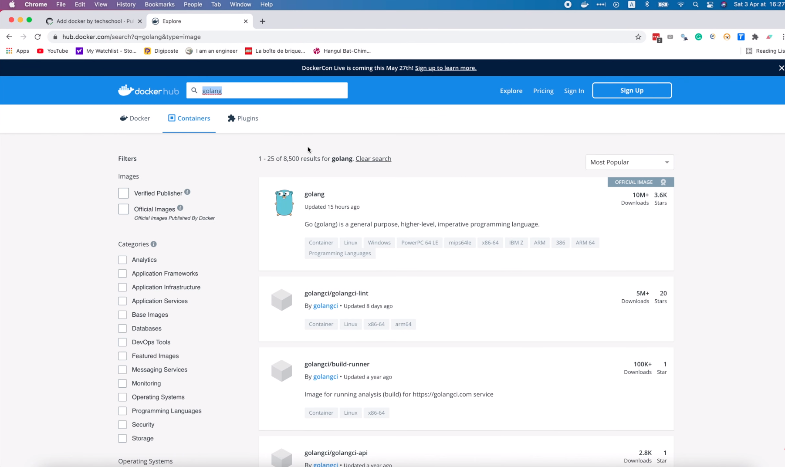

Если мы прокрутим немного вниз, то увидим список поддерживаемых тегов, 
соответствующих разным версиям Golang и его базовой ОС. Чтобы размер 
получившегося образа был небольшим, мы должны использовать версию `alpine`.
В `Dockerfile`, мы используем инструкцию «FROM», чтобы указать базовый образ.
В нашем случае мы будем использовать `golang:1.16-alpine3.13`.

```dockerfile
FROM golang:1.16-alpine3.13
```

Затем мы воспользуемся инструкцией `WORKDIR`, чтобы указать текущий рабочий 
каталог внутри образа. Для простоты я буду использовать здесь `/app`.

```dockerfile
WORKDIR /app
```

Затем мы скопируем все необходимые файлы в эту папку с помощью инструкции 
`COPY`. Первая точка означает, что нужно скопировать всё из текущей папки, 
где мы запускаем команду `docker build` для сборки образа. В нашем случае
мы собираем образ из корня проекта, поэтому все, что находится в папке
`simple_bank`, будет туда скопировано. Вторая точка — это текущий рабочий 
каталог внутри образа, куда копируются файлы и папки. Как мы уже сказали, 
текущий `WORKDIR` - это `/app`, и он будет местом для хранения скопированных 
данных.

```dockerfile
COPY . .
```

Хорошо, следующий шаг - мы соберём наше приложение в один двоичный исполняемый
файл. Для этого воспользуемся инструкцией `RUN`. Итак, вводим `RUN go build 
-o`, где ключ `-o` означает `output` (выходной файл). Затем название 
выходного бинарного файла, скажем, `main`. И, наконец, передаём точку входа
нашего приложения, которым является файл `main.go`. Он находится 
непосредственно здесь, в корне проекта.

```dockerfile
RUN go build -o main main.go
```

Также рекомендуется использовать инструкцию `EXPOSE`, чтобы сообщить Docker, 
что контейнер должен прослушивать указанный сетевой порт во время своего 
выполнения. В нашем случае это порт `8080`, как мы указали в файле `app.env`.
Стоит отметить, что инструкция `EXPOSE` на самом деле не делает порт доступным
извне. Она просто служит документацией между тем, кто создал образ, и тем,
кто будет запускать образ, о том, какие порты должны быть сделаны доступными
извне.

```dockerfile
EXPOSE 8080
```

Хорошо, остался сделать последний шаг — это определить команду по умолчанию, 
которая будет запускаться при запуске контейнера. Для этой цели мы используем 
инструкцию `CMD`. В неё передаём массив аргументов командной строки. В нашем 
случае нам просто нужно запустить исполняемый файл, который мы создали на 
предыдущем шаге. Таким образом, необходимо только один единственный аргумент: 
`/app/main`.

```dockerfile
CMD ["/app/main"]
```

И это практически всё что нужно сделать. `Dockerfile` готов. Теперь, чтобы 
собрать образ, мы запустим команду `docker build` в терминале.

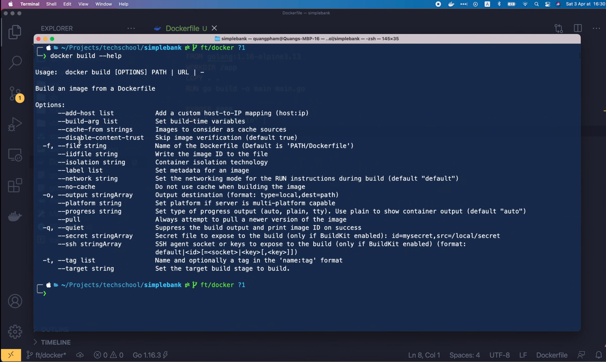

Она может принимать ряд параметров. Например, параметр `file` используется,
чтобы указать название `Dockerfile`, если оно отличается от имени по 
умолчанию, то есть `Dockerfile` с заглавной буквы `D`. Наш `Dockerfile` уже 
имеет это название по умолчанию, поэтому нам не нужно использовать этот 
параметр. Но нам понадобится другой параметр, `tag`. Этот параметр 
используется для указания имени и тега получившегося образа. Итак, давайте 
запустим команду `docker build -t`. Тег образа будет равен 
`simplebank:latest`, разделенный двоеточием и, наконец, путь к
`Dockerfile` равен точке, что соответствует текущему каталогу.

```shell
docker build -t simplebank:latest .
```

Сборка займёт некоторое время. Итак, когда образ создан, мы можем запустить
команду `docker images`, чтобы просмотреть список всех образов. Здесь на
рисунке показан образ `simplebank`, который мы только что создали.

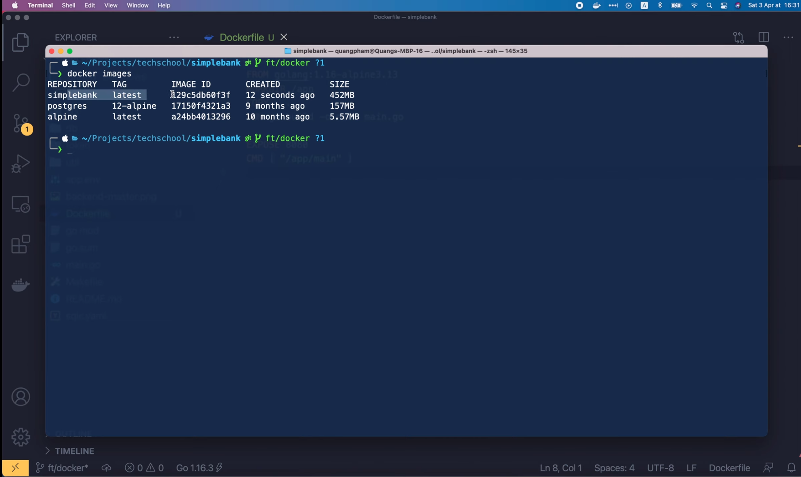

Он называется `simplebank`, а его тег - `latest`. Как мы и ожидали!

## Многоступенчатый Dockerfile

Однако размер этого образа довольно большой: 452 МБ. Он в 80 раз больше, 
чем образ Alpine Linux. Так можно ли уменьшить размер получившегося образа?
Ответ - да! Для этого мы можем использовать многоступенчатую сборку. Причина
большого размера получившегося образа в том, что он содержит Golang и все 
пакеты, которые требуются для нашего проекта. Но единственное, что нам 
нужно для запуска приложения, — это двоичный файл, созданный после запуска 
команды `go build`. Нам больше ничего не нужно, даже исходный код Golang.
Итак, если мы можем создать образ, используя только двоичный файл, то его 
размер будет очень маленьким. Для этого я преобразую этот Dockerfile в 
многоступенчатый. Первой ступенью или этапом будет этап сборки, на котором мы 
просто создадим двоичный файл. Все, что нам нужно сделать, это добавить 
ключевое слово `AS` в конец инструкции `FROM`, за которым следует название 
этапа, скажем, в данном случае `builder`.

```dockerfile
# Builds stage
FROM golang:1.16-alpine3.13 AS builder
```

Затем, после создания двоичного файла, мы перейдём ко второму этапу запуска 
`Run`, который будет последним и запустит приложение. Как и на этапе сборки, 
мы используем инструкцию `FROM` для указания базового образа на этом этапе 
`Run`. И поскольку мы хотим, чтобы размер получившегося образа был небольшим,
давайте использовать Alpine Linux в качестве базового образа. Здесь я 
использую версию Alpine `3.13`, такую же, что и на этапе сборки, чтобы
гарантировать совместимость. Как и раньше, мы задаём текущий рабочий каталог
образа равным `/app`. Теперь нам нужно скопировать исполняемый двоичный файл 
из этапа сборки в этот образ этапа запуска.

```dockerfile
# Run stage
FROM alpine3.13
WORKDIR /app
```

Как мы можем сделать это? Что ж, мы просто используем ту же команду «COPY», 
что и раньше, но на этот раз с параметром `--from` , чтобы сообщить Docker, 
откуда копировать файл. В нашем случае он должен копироваться со стадии
`builder`, поэтому мы указываем здесь название этой стадии. Затем путь к 
файлу, который мы хотим скопировать, т. е. `/app/main`, и, наконец, куда
нужно скопировать этот файл, то есть в нашем случае в текущий рабочий каталог.
Эта точка в конце команды означает `WORKDIR`, который мы задали ранее: `/app`.
И на этом всё!

```dockerfile
COPY --from=builder /app/main .
```

Многоступенчатая сборка Dockerfile готова. Давайте снова запустим `docker 
build`, чтобы посмотреть, как это работает!

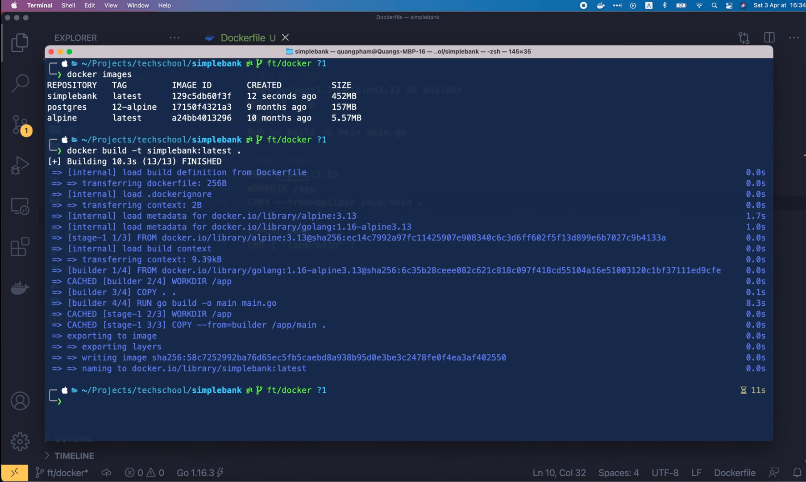

Как видим, сборка завершена. Давайте выведем список всех Docker образов. 
Вот он!

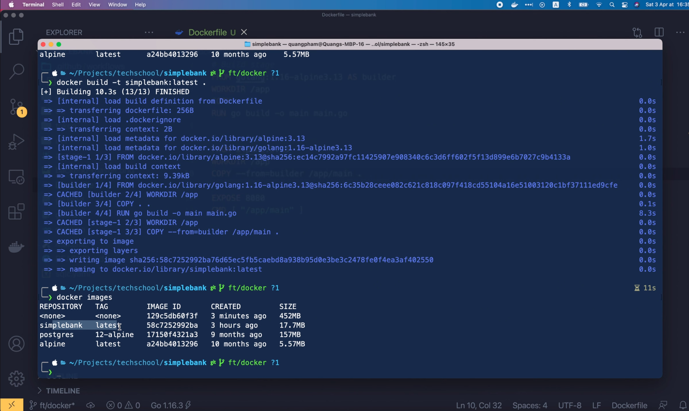

Был создан новый образ `simplebank` с тегом `latest`. И его новый размер 
составляет всего 17,7 МБ, что в 25 раз меньше, чем у предыдущего. Потрясающе! 
Рядом с ним вы увидите предыдущий образ, но его название и тег изменились на
`<none>`. Это произошло потому, что мы используем тот же тег 
`simplebank:latest` для нового образа. Поэтому, естественно, тег старого 
образа следует удалить, чтобы не было двух разных образов с одним и тем же
тегом. Мы можем воспользоваться командой `docker rmi`, чтобы удалить старый 
образ.

```shell
docker rmi 129c5db60f3f
```

Теперь если мы опять выведем список образов, то старый пропадёт.

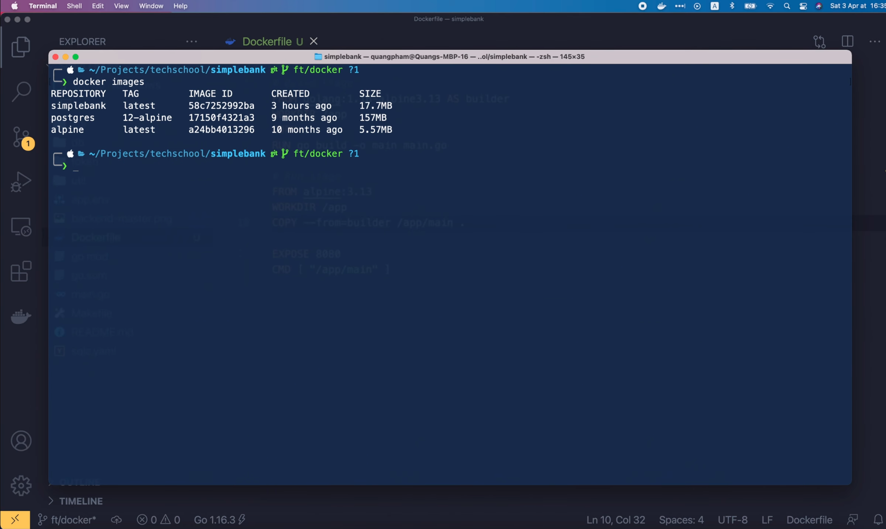

Итак, сегодня мы научились создавать многоступенчатый Docker файл для 
создания легковесного Docker образа нашего приложения. Мы продолжим работу с
Docker на следующей лекции, где я покажу вам, как запустить приложение,
используя Docker образ, который мы создали сегодня и подключить его к 
существующему контейнеру Postgres через определяемую пользователем
Docker сеть.

Большое спасибо за время потраченное на чтение, желаю вам получать удовольствие
от обучения и до скорой встречи на следующей лекции!