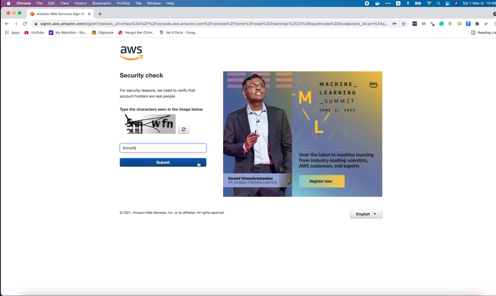

# How to create a free tier AWS account

[Original video](https://www.youtube.com/watch?v=4UqN1P8pIkM)

Hi and welcome to the backend master class.

In this lecture, I'm gonna show you how to create a free tier AWS account
to deploy your applications. AWS is one of the biggest cloud service
provider at the moment. They provide a very wide range of infrastructures 
and services, which make deploying and managing applications super easy.
And one great thing about AWS is that they give everyone a Free Tier offer
to use some of their services for free, of course, with some specific
constraints. You can learn more about it by going to [aws.amazon.com/free](http://aws.amazon.com/free)

## Free tier details 

There are 3 types of free offers, depending on the product. Some of the 
services are always free, most of the services are free for 12 months
following your initial sign-up date, and the rest of the services are 
short-term free trial only. You can use this filter to list only the 
services with some specific tier types you want.

And on the right hand side, you can see the list of services with their
free tier constraint. For example, you're given 750 hours per month for
`EC2` instance of type `t2.micro` or `t3.micro`, 5 GB of `S3` standard 
storage, 750 hours per month of Relational Database Service. These services 
are free for 12 months. While for `DynamoDB`, it's always free, but with 
only `25GB` of storage. And for `SageMaker`, it's only free trial for 
2 months. There are many many more services you can try for free. Pretty 
awesome, isn't it?

Now let's learn how to create a new account and take advantages of this
free tier offer.

In this sign up form, let's fill in the email, the password, confirm 
password, and the AWS account name. Then click `Continue`.

Next step, we have to fill in more info. First, how do you plan to use
AWS? Let's say for business. Then you must provide your contact 
information. Your full name, your organization, your phone number, your
country, your address, your city, your state, your postal code, check box to agree
to the terms, and click `Continue`.

Now comes the most important step, we have to provide the billing information
to pay for the service. But for free tier, we won't be charged for usage
below the limit. And for now, they will temporarily hold 1 dollar as a 
pending transaction for a few days just to verify the identity. So let's 
go ahead and fill in the card number, the expiration date, the card 
holder's name, and the billing address. Then let's click `Verify and Continue`.

I guess 1 dollar has just been subtracted from your account. In the next
step, we must verify our phone number. You can choose to receive the 
verification code either by SMS or voice call. Select the country or region 
code. And fill in your phone number. We have to type the security check
captcha characters as well. Then click `Send SMS`.

Now you should have received a message with the verification code on your 
phone. All you need to do is to fill that code in this box and click 
`Continue`.

That brings us to the last step, select a support plan, either a free basic 
support plan, a `Developer support` plan from 29 dollars per month, or a 
`Business support` plan from 100 dollars per month. For this demo, I'm gonna
select `Basic support`, and finally click `Complete sign up`.

And that's it! We've successfully created a new AWS account. It will be 
activated in a few minutes, and we will receive a confirmation email once it
is complete. Now let's press this button to go the AWS management console.

We will sign in as root user. Let's fill in the email address we used to sign 
up here and click `Next`.

Then we must fill in the captcha text. It's to verify that a real person is
trying to sign-in, not some kind of bot. Now click `Submit`.

Fill in your account's password and click `Sign in`.

And voilà, we're now inside the AWS management console. On the top left menu, 
you can find a long list of all AWS services.

Or you can search for 1 specific service in this box.

## AWS EC2

Let's try EC2. Oh, looks like the service is not fully activated.

So we will need to wait a little bit more. Usually it takes just a few minutes
for an account to be fully activated, but sometimes it can be longer than 
that.

Alright, let's go back to the console and try to access S3.

Cool! We can access S3, so I guess the account has been fully activated.

Let's try EC2 again. Awesome, we can access EC2 service now.

On the left side menu, you can list all instances,

or search for some EC2 instance types in this page.

There are many different types of instance with different configurations and
prices. For example, the `t2.medium` instance will have 2 virtual CPUs, 4 GB
of memory, and here is its price. You should keep in mind that not all 
instances are available for free tier.

So let's use this filter to find the free one.

Here you can see, only `t2.micro` instance with 1 virtual CPU and 1 GB of 
memory is eligible for free tier. So you should be very careful when choosing
the resources for your system, otherwise, you might find out someday that
they're not free as you expected.

Alright, so today we have learned how to create a free AWS account to prepare
for the deployment of our application.

In the up coming lectures, I will gradually show you how to use some of the
most important AWS services, such as ECR, RDS and EKS to deploy the simple
bank web application that we've been working on during the course.

Thanks a lot for watching this video.

Happy learning, and see you soon in the next one!