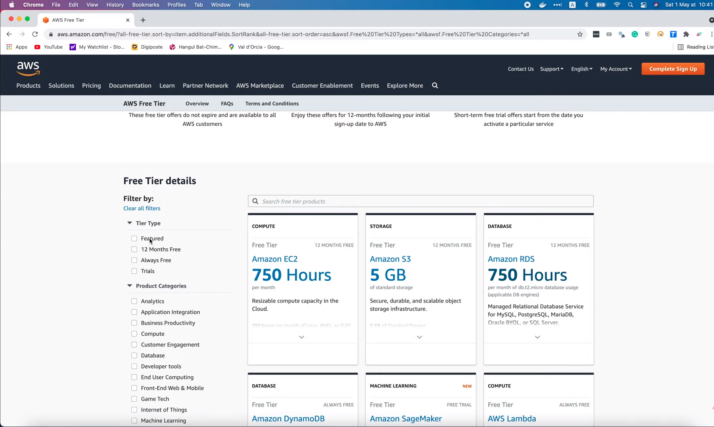
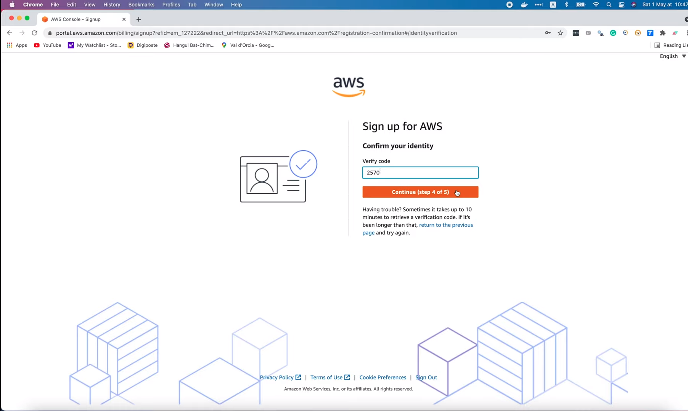
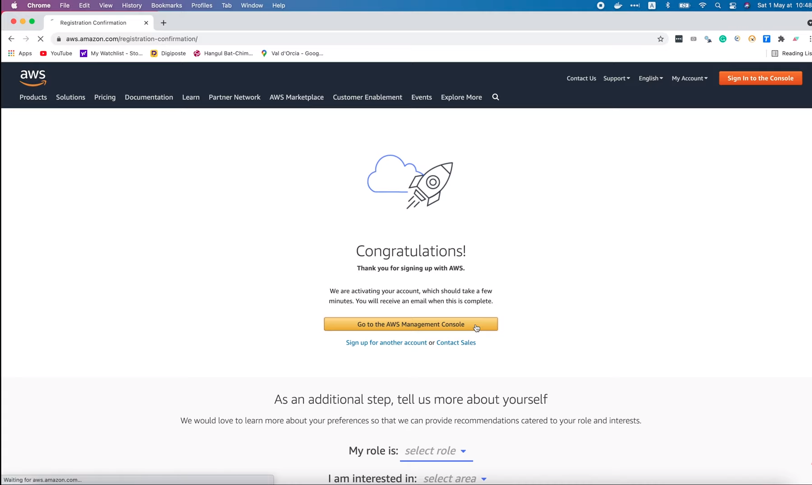
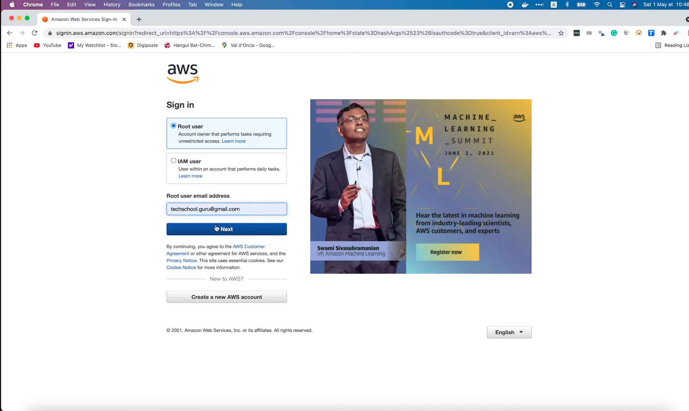
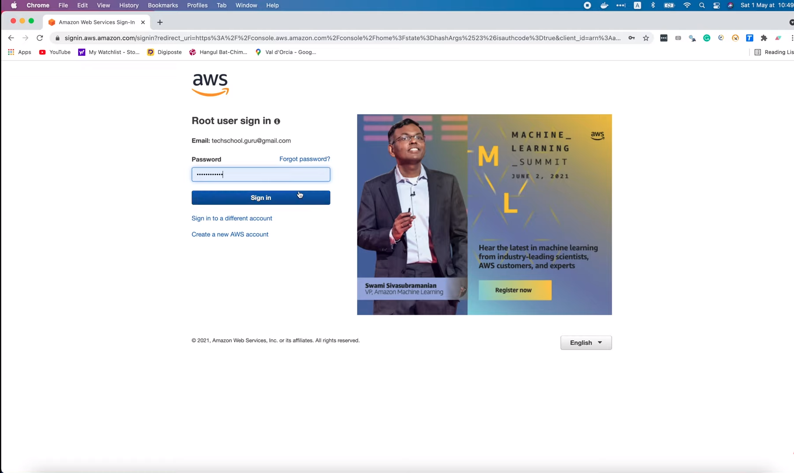
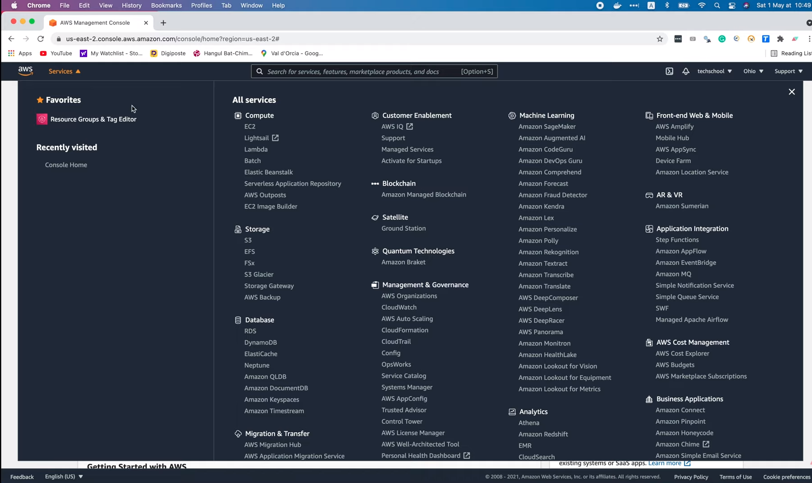
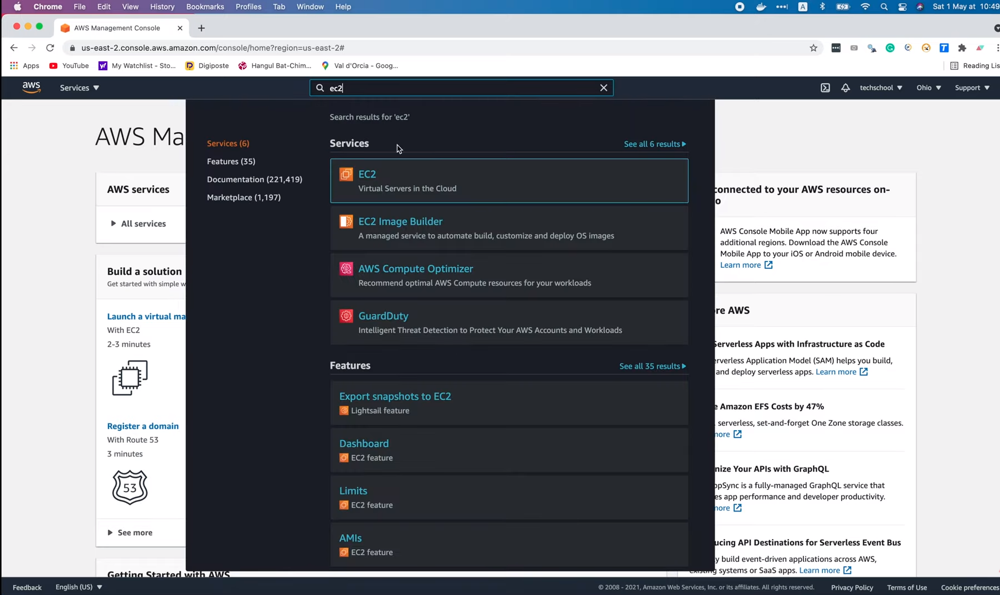
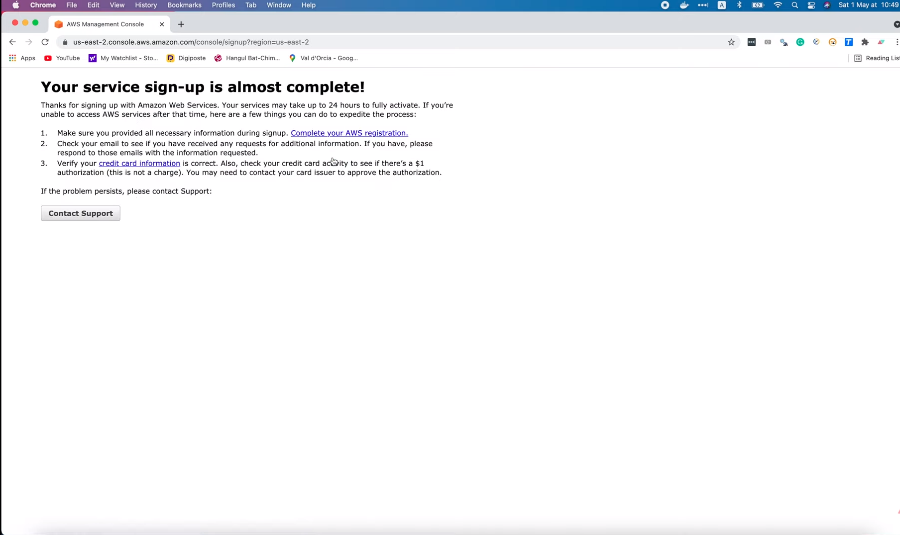
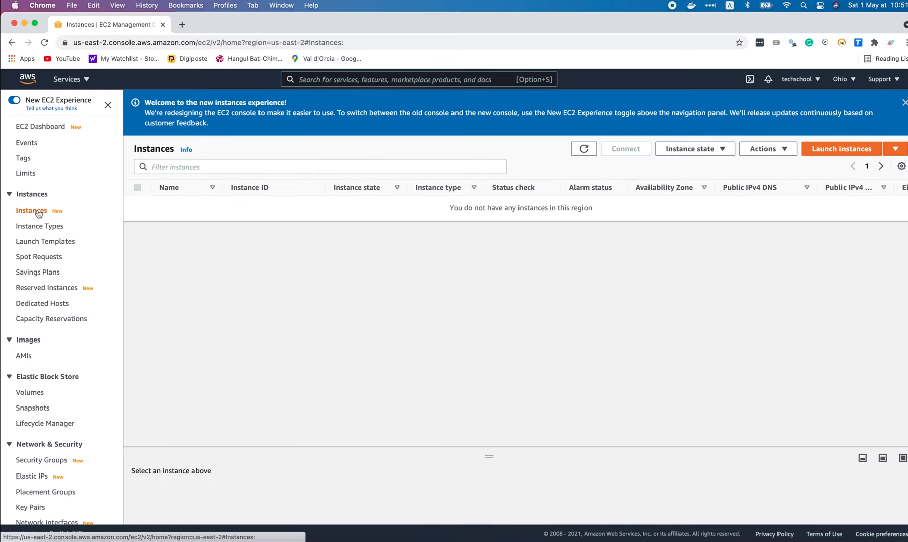
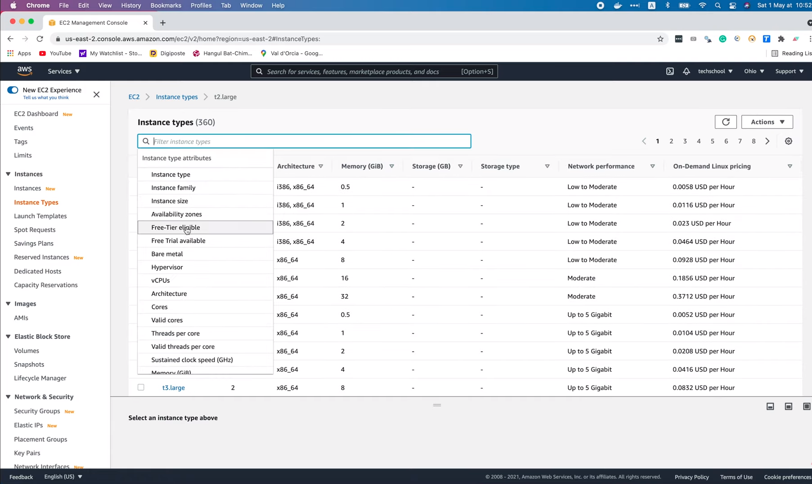

# Как создать бесплатную учётную запись AWS

[Оригинал](https://www.youtube.com/watch?v=4UqN1P8pIkM)

Привет и добро пожаловать на мастер-класс по бэкенду.

На этой лекции я покажу вам, как создать бесплатную учетную запись AWS для 
развертывания ваших приложений. На данный момент AWS является одним из 
крупнейших провайдеров облачных услуг. Он предоставляет широкий спектр 
инфраструктур и сервисов, которые упрощают развертывание приложений и 
управление ими. И одна замечательная особенность AWS заключается в том, что 
он предлагает каждому бесплатно использовать некоторые из своих сервисов, 
конечно, с некоторыми конкретными ограничениями. Вы можете узнать больше об 
этом, перейдя по адресу [aws.amazon.com/free](http://aws.amazon.com/free).

## Более подробно о бесплатной учетной записи

Существует три вида бесплатных предложений, в зависимости от услуги. 
Некоторые сервисы всегда бесплатны (Always Free), большинство сервисов 
бесплатны в течение 12 месяцев после даты первоначальной регистрации (12 
Months Free), а остальные - доступны только в течение краткосрочного 
пробного периода (Trials). Вы можете использовать этот фильтр, показанный 
на рисунке, чтобы отобразить только сервисы определенного типа, которые 
вам нужны.

А в правой части рисунка вы видите список сервисов с их ограничениями в
случае бесплатного использования. Например, вам предоставляется 750 часов 
в месяц для экземпляра `EC2` типа `t2.micro` или `t3.micro`, 5 ГБ стандартного
хранилища `S3`, 750 часов в месяц сервиса реляционной базы данных. Эти 
сервисы бесплатны в течение 12 месяцев. В то время как сервис `DynamoDB` 
бесплатен всегда, но с ограничением только в `25GB` для хранилища. А для
`SageMaker` даётся только бесплатная пробная версия на 2 месяца. Существует 
множество других сервисов, которые вы можете попробовать бесплатно. 
Довольно круто, не так ли?

Теперь давайте узнаем, как создать новую учетную запись и воспользоваться 
преимуществами этого бесплатного использования.

В этой регистрационной форме давайте заполним адрес электронной почты, 
пароль, подтвердим пароль и имя учетной записи AWS. Затем нажмите `Continue`.

На следующем шаге мы должны заполнить ещё несколько полей. Во-первых, как вы 
планируете использовать AWS? Пусть будет для бизнеса. Затем необходимо указать 
свои контактные данные. Ваше имя и фамилию (Full name), организацию 
(Organization name), номер телефона (Phone number), страну (Country or 
Region), адрес (Address), город (City), штат (State, Province, or Region), 
почтовый индекс (Postal code), установить флажок, что вы согласны с условиями 
использования, и нажать `Continue` (смотри рисунок).

Теперь наступает самый важный шаг, мы должны предоставить платежную 
информацию для оплаты услуги. Но для бесплатных сервисов с нас не будет 
взиматься плата за использование, если мы не превышаем лимит. Пока что они 
временно удержат один доллар в виде транзакции в статусе ожидания в течение 
нескольких дней только для проверки личности. Итак, давайте продолжим и 
заполним номер карты (Credit or Debit card number), срок действия (Expiration
date), имя владельца карты (Cardholder's name) и платежный адрес (Billing 
address). Затем давайте нажмем `Verify and Continue`.

После перехода на следующий шаг, я полагаю, что один доллар был вычтен с 
вашего банковского счёта. На следующем шаге мы должны подтвердить наш номер 
телефона. Вы можете выбрать получение кода подтверждения в виде SMS (Text 
message (SMS)) или голосового звонка (Voice call). Выберите код страны или 
региона (Country or region code). И заполните свой номер телефона (Mobile 
Phone Number). Введите символы, показанные в поле `Security check`, чтобы 
пройти проверку. Затем нажмите `Send SMS`.

После этого вы должны будете получить сообщение с кодом подтверждения на 
свой телефон. Всё что вам нужно сделать, это ввести этот код в это
поле (Verify code) на рисунке и нажать `Continue`.

Это приведёт нас к последнему шагу: выберите тип поддержки: бесплатный 
базовый тип поддержки, тип `Developer support` от 29 долларов в месяц или
тип `Business support` от 100 долларов в месяц. Поскольку учётная запись
создаётся в демонстрационных целях, я выберу `Basic support` и, наконец,
нажму `Complete sign up`.

Вот и всё! Мы успешно создали новую учетную запись AWS. Она будет 
активирована через несколько минут, и мы получим электронное письмо с 
подтверждением, как только процесс будет завершен. Теперь давайте нажмем эту 
кнопку, показанную на рисунке, чтобы перейти в консоль управления AWS.

Мы войдем в систему как `Root user` (смотри рисунок). Давайте заполним адрес 
электронной почты, который мы использовали для регистрации, и нажмём
`Next`.

Затем мы должны заполнить текст капчи. Это необходимо для того, чтобы 
убедиться, что реальный человек пытается войти в систему, а не какой-то бот.
Теперь нажмите `Submit`.

Введите пароль от своей учётной записи и нажмите `Sign in`.

И вуаля, теперь мы внутри консоли управления AWS. В верхнем левом меню вы 
сможете найти длинный список всех сервисов AWS.

Или вы можете поискать какой-то конкретный сервис в этом поле (смотри 
рисунок).

## AWS EC2

Давайте попробуем воспользоваться EC2. О, похоже, учётная запись ещё не 
полностью активирована.

Так что нам придется подождать еще немного. Обычно для полной активации 
учётной записи требуется всего несколько минут, но иногда это может занять 
больше времени.

Хорошо, вернемся в консоль и попробуем получить доступ к S3.

Здорово! Мы смогли получить доступ к S3, так что, я думаю, учётная запись 
теперь полностью активирована. 

Давайте попробуем воспользоваться EC2 снова. Отлично, теперь мы можем 
получить доступ к сервису EC2.

В левом боковом меню перечислен список всех инстансов (Instances),

или можно поискать конкретный тип EC2 инстанса на этой странице (пункт меню
Instance Types), показанной на рисунке.

Существует множество различных типов инстансов с различными конфигурациями 
и ценами. Например, инстанс `t2.medium` будет иметь 2 виртуальных процессора, 
4 ГБ памяти и его цена, показана ниже на рисунке. Следует помнить, что не все 
инстансы доступны для бесплатного использования.

Итак, давайте воспользуемся этим фильтром, чтобы найти бесплатные.

Здесь вы видите, что только экземпляр `t2.micro` с 1 виртуальным процессором 
и 1 ГБ памяти доступен бесплатно. Поэтому вы должны быть очень осторожны 
при выборе ресурсов для вашей системы, иначе в какой-то момент вы можете 
обнаружить, что они не бесплатны, как вы ожидали.

Итак, сегодня мы узнали, как создать бесплатную учетную запись AWS, чтобы 
подготовиться к развертыванию нашего приложения.

В последующих лекциях я постепенно покажу вам, как использовать некоторые из 
наиболее важных сервисов AWS, такие как ECR, RDS и EKS, для развертывания 
простого банковского веб-приложения, над которым мы работали в ходе курса.

Большое спасибо за время, потраченное на чтение.

Желаю вам получать удовольствие от обучения и до скорой встречи в следующей
лекции!