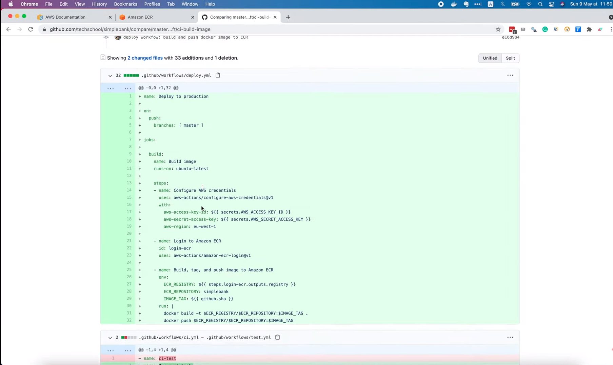

# Auto build & push Docker image to AWS ECR with GitHub Actions

[Original video](https://www.youtube.com/watch?v=3M4MPmSWt9E)

Hello everyone and welcome to the backend master class.

In this lecture, we will learn how to use Github Action to automatically
build and push Docker image to AWS ECR. First, we have to create a 
repository to store our Docker images.

## AWS ECR

So let's open the AWS console, and select the region.


I'm in Europe, so I'm gonna choose Ireland ECR, or Amazon Elastic Container
Registry is a fully-managed Docker container registry that makes it easy
to store, manage and deploy Docker container images.

You can look for it in the search box at the top of the page.


If it's the first time you use ECR, you can click on this `Get Started`
button to create a new repository.


Or we can expand the left-hand side menu, and choose `Repositories`.

Right now, there're no repositories yet. So let's click this button to
create a new one.


You can set the visibility of the repository to either `Private` or `Public`.
If you choose `Private`, then no one can push or pull image in this 
repository, unless they're given access permissions. Next, we have to fill
in the name of the repository in this box. I'm gonna use `simplebank`.
Note that we must follow naming convention. You can also config the `Tag
immutability`. If enabled then it will prevent image tags from being
overwritten by subsequent image pushes using the same tag. I will leave
it as disabled by default.


Another setting is `Scan on push`. If enabled, Amazon ECR will do a security
scan on the image to help identify software vulnerabilities. I will leave
it as disabled for now. The last setting is `KMS encryption`, which allows
us to use AWS Key Management Service to encrypt images instead of using
the default encryption setting: `AES 256`. For now, let's just use the 
default one. So I'm gonna click `Create repository`.


And voila, the `simplebank` repository is successfully created. Here's the
URI of this repository, which we can use to push and pull images later.


If you're using AWS CLI tool, you can take a look at this page to see 
commands to push Docker images to this repository.


Basically, you will have to authenticate your Docker client, build your
Docker image, tag your image, and finally push it to the repository.
However, normally we don't push the image directly from our development
machine. Instead, we will use GitHub Actions to automatically build, tag
and push the image for us whenever new codes are merged to the `master`
branch.

## Workflow for deploy

So let's open our simple bank project in Visual Studio Code. First, I'm
gonna rename our existing `ci.yml` file to `test.yml` and change its 
name to "Run unit tests", because that's the main responsibility of 
this workflow. Let's copy the content of this workflow.

Then, I'm gonna create a new workflow named `deploy.yml`. We will use this
workflow to build Docker image and later deploy it to production. Now
let's paste in the content of the test workflow and change its name to
"Deploy to production". This workflow will only be triggered when there's
a push on `master` branch, so I'm gonna remove the pull request event from
the list. Then, in the jobs section, we will declare the first one to 
build and push Docker image to Amazon ECR. It will run on `ubuntu-latest`
as normal.

```yaml
name: Deploy to production

on:
  push:
    branches: [ release ]

jobs:

  build:
    name: Build image
    runs-on: ubuntu-latest
```

Next, we have to write the steps to perform this job. For this, I'm gonna
use some existing GitHub Actions. On [github.com](https://github.com/marketplace),
let's open `Marketplace`, select `Actions` type and search for `AWS ECR`. 
There are many results, but this `Amazon ECR Login Action` is the official
one, written by AWS.


So let's open it. Here in this page, we can see how to use it.


I'm gonna copy this template

```yaml
    - name: Login to Amazon ECR
      id: login-ecr
      uses: aws-actions/amazon-ecr-login@v1

    - name: Build, tag, and push image to Amazon ECR
      env:
        ECR_REGISTRY: ${{ steps.login-ecr.outputs.registry }}
        ECR_REPOSITORY: my-ecr-repo
        IMAGE_TAG: ${{ github.sha }}
      run: |
        docker build -t $ECR_REGISTRY/$ECR_REPOSITORY:$IMAGE_TAG .
        docker push $ECR_REGISTRY/$ECR_REPOSITORY:$IMAGE_TAG
```

and paste it to our deploy workflow file. Now, as you can see, the first
step is to login to Amazon ECR. And the `amazon-ecr-login` action is
used for this purpose. But in order for it to work, we have to provide
some credentials to access our AWS account. In `Credentials and Region`
section of the documentation we can see how to do it with another Github
action: `configure-aws-credentials`. So let's copy this template

```yaml
    - name: Configure AWS credentials
      uses: aws-actions/configure-aws-credentials@v1
      with:
        aws-access-key-id: ${{ secrets.AWS_ACCESS_KEY_ID }}
        aws-secret-access-key: ${{ secrets.AWS_SECRET_ACCESS_KEY }}
        aws-region: us-east-2
```

and paste it here, as the first step of our workflow. Now we need to 
provide 2 secrets: AWS access key ID and AWS secret access key. Note that
we won't write them directly in this file as plaintext, but they should
be encrypted and stored in the GitHub Secrets. Then will be loaded later
as environment variables when the workflow is run. We will learn how to
do that in a moment.

Now, besides the secret, we must also provide the `aws-region` we want
to access. As I'm using AWS Ireland, or `eu-west-1`, I'm gonna copy its
name from the URL of this page. And paste it to our workflow here.

```yaml
    - name: Configure AWS credentials
      uses: aws-actions/configure-aws-credentials@v1
      with:
        aws-access-key-id: ${{ secrets.AWS_ACCESS_KEY_ID }}
        aws-secret-access-key: ${{ secrets.AWS_SECRET_ACCESS_KEY }}
        aws-region: us-east-1
```

Alright, now let's create some credentials to allow GitHub to access 
our AWS account. In the console, I'm gonna search for IAM


## AWS IAM

Here it is. You can read more about it in this [documentation page](https://docs.aws.amazon.com/IAM/latest/UserGuide/introduction.html).
Basically, IAM stands for Identity and Access Management. It is a web
service that helps you securely control access to AWS resources. You 
can use it to control who is authenticated and authorized to use your
AWS resources. There are several kinds of identities you can set up, you
can see them in the `Identities` section of the left-hand side menu.


The first one is `User`, which represents 1 single person or application.
The second one is `User Group`, which let you specify the same set of
permissions for multiple users at once.

As you can see in the picture,


you can create groups for different team, with different permissions, 
such as: `Admins`, `Developers` and `Testers`.

Then another identity type is [IAM roles](https://docs.aws.amazon.com/IAM/latest/UserGuide/id_roles.html). 
It is pretty similar to IAM user, but instead of being uniquely associated 
with 1 single person or application, a role can be assumable by anyone 
who needs it. You can learn all bout it by reading the documentation.

For the purpose of this lecture, we're just gonna use IAM user. So 
let's go back to the AWS console. Select `Users` section on the left 
menu. And click `Add user`. First, we have to choose a username for it.
Let's say `github-ci`. Then in the access type section, we should choose
`Programmatic access`, since this is not a human user, but an 
application instead. This will enable an access key ID and secret access
key for the AWS API, CLI, SDK and other development tools. Alright, now
let's click `Next: Permissions`.


Here,


we will be able to set some permissions for the user we're gonna
create. There are several options: either `Add user to group`, `Copy 
permissions from existing user`, or `Attach existing policies directly`.

I'm gonna create a new group and add user to it. For the `Group name`, 
let's call it `deployment`. Then in the `Filter policies` box, let's 
search for Elastic Container Registry.


In the result list, we can see the `Full Access` policies, which allows
all administrative access to Amazon ECR resources. The `PowerUser` 
access provides all access except deletion or the `ReadOnly` access
that only allows reading data from the ECR repositories. 

In our case, we want to push (or write data) to the repo, so we can 
choose either `Full Access` or `Power User`. I'm gonna use `Full Access`.
And click `Create Group`.


Now you can see the `deployment` group is created, and the `github-ci` 
user will be added to this group. Let's click `Next: Tags`.


IAM tags are key-value pairs you can add to your user, which can help
you better organize, track or control access for this user. It is 
optional, so I'm not gonna add any tags for now. Let's click 
`Next: Review`.


In this page, we can review all user details before creating it. One 
thing we haven't talked about is the permission boundary. If you go
back to the previous step, where we set up user's group and 
permissions, you can see the `Set permissions boundary` section at the
bottom. Basically, it is a way for us to control the maximum 
permissions this user can have.


Note that this setting doesn't grant permissions by itself, but it just
limits the maximum permissions can be granted to the user. It is also 
optional, so I'm just gonna create user without a permissions' boundary
for now. Alright, everything looks good, let's click `Create user`!


And voilà, the `github-ci` user has been successfully created. It is 
added to the `deployment` group, and the access key for programmatic 
access is also available. We can now copy and add it to GitHub 
Secrets.


So let's open our `Simple bank` GitHub repository. Open the `Settings` tab,
and select `Secrets` section on the left-hand side menu. GitHub Secrets are
environment variables that are encrypted, and can be used to provide some
sensitive input data to GitHub Actions. There are 2 types of secret. First,
the environment secrets, which will only be available to one specific 
environment. It is used when you want to have different secret values for
different environments, such as testing, staging, or production... And the 
second type is repository secrets, whose values will be available for the 
whole repository. And this will be the one we're gonna use today.


So let's click `New repository secret`. For the secret name, let's copy it
from our workflow. The first secret is `AWS_ACCESS_KEY_ID`. And we can get 
its value from the AWS console. Let's copy, and paste it in this box. Then 
click `Add secret`.


OK, now let's do the same for the second secret: its name should be
`AWS_SECRET_ACCESS_KEY`. And in the AWS console, let's click `Show` to see
its value. Copy it, and go back to Github to paste in the value. 
Then click `Add secret`. Alright, now the AWS access key and secret are 
ready.

Let's go back to the GitHub workflow. In the second step, the key will be 
used to login to Amazon ECR and its output will be used in the third step.
Here you can see that, the `ECR_REGISTRY` variable will take the output
`registry` from the previous step.

```yaml
    - name: Login to Amazon ECR
      id: login-ecr
      uses: aws-actions/amazon-ecr-login@v1

    - name: Build, tag, and push image to Amazon ECR
        env:
          ECR_REGISTRY: ${{ steps.login-ecr.outputs.registry }}
          ECR_REPOSITORY: my-ecr-repo
          IMAGE_TAG: ${{ github.sha }}
        run: |
          docker build -t $ECR_REGISTRY/$ECR_REPOSITORY:$IMAGE_TAG .
          docker push $ECR_REGISTRY/$ECR_REPOSITORY:$IMAGE_TAG
```

We also define another variable for the ECR repository. In our case, it
should be `simplebank`, as we're created before. So let's paste in the name
here.

```yaml
          ECR_REPOSITORY: simplebank
```

The last variable we define here is the `IMAGE TAG`. Basically, we will use
the GitHub SHA of the commit to tag the image. It's reasonable, because
each push to `master` will have different commit hash, so naturally, we 
would want to tag the image with a new version associated with that commit.
Now in the `run` section, we will run 2 commands: the first one is `docker 
build`, which will build and tag the image locally. And the second one is 
`docker push` to push the output image to ECR. All the variables we 
declared above are used in these 2 commands.

And I think that will be it! Let's push this new workflow to Github to see
how it goes.

In the terminal, let's run 

```shell
git status
```

to see the change.

Run

```shell
git add .
```

to stage everything, `git status` again to see what's gonna be committed.
Then run `git commit` with a message saying "deploy workflow: build and
push Docker image to ECR". Finally, run `git push origin master` to push it 
to GitHub. Oops, the push is rejected. That's because the `master` branch
is protected, so we cannot push changes to it directly, and a pull request
must be created if we want to merge to `master`. You can add protection
rules in the `Settings` tab, `Branches` section.


Here you can see my `master` branch protection rule. Basically, I just require
the status check to pass before merging, which means that the unit test 
workflow must be successful. You can also require the number of pull-request
reviews approvals if you want.


OK, now because of the protection rule, we have to create a new branch. Let's
call it `ft-/ci-build-image`. Then push this branch to Github. Now in the
`simplebank` repo, let's open the `Pull requests` tab, and click `New pull
request`. The base branch is `master`, and the compare branch should be
`ft-/ci-build-image`. We can see the changes here.



It's looking good. So let's click `Create pull request`. You can change
name and write some description if you like. Then click `Create pull request`
one more time.


OK, the PR is successfully created. And the unit test workflow is being 
run. While waiting for it to finish, let's take a look at the changes we've
made. So the `deploy` workflow will be triggered on a push to `master` branch.
The first job is build Docker image. It will configure AWS credentials using 
the repository secrets, then login the Amazon ECR, and finally build, tag
and push the image. OK, now let's go back to `Conversation` tab. The test
is still running. And you can see here, the `Merge pull request` button
is disabled, because it requires the test to pass before merging.


Alright, now the unit tests are completed, all checks have passed. So we can 
click `Merge pull request`, `Confirm merge` and Delete the feature branch.


OK, now if we go the `Code`, on the `master` branch, we can see the 2 running
CI workflows.


Let's open the `deploy` workflow. Oops, it failed.


The steps to configure AWS credentials and login to Amazon ECR are OK. But
there's an error in the build image step. The `Dockerfile` is not found.
Oh, that's because I forgot 1 step to checkout the code. So let's open
the `test` workflow and copy this step.

```yaml
      - name: Check out code into the Go module directory
        uses: actions/checkout@v2
```

Then paste it to `deploy` workflow as the first step.

```yaml
steps:
    - name: Check out code into the Go module directory
      uses: actions/checkout@v2
```

We're not running this workflow on a Golang image, so let's rename it to
just: "Check out code". OK, now I think this will fix the issue. Let's
commit the change: "Deploy workflow: add check out code step". And push 
it to GitHub on the `ft/ci-build-image` branch. We can open this URL 
[https://github.com/techschool/simplebank/pull/new/ft/ci-build-image](https://github.com/techschool/simplebank/pull/new/ft/ci-build-image) 
on the browser to create a new pull request. OK, the PR is created. 
Let's wait for the unit tests to finish. Oh, looks like the current branch
is out-of-date with the `master` branch.


That's because we've merged the previous PR to `master`. But, haven't updated
it locally yet. So in the terminal, let's checkout the `master` branch, run
`git pull` to fetch and merge new changes to our local `master`. Then 
`git checkout` the feature CI build image branch. Now we can run 
`git merge master` to merge the `master` branch into current branch. 
Everything is up to date. So let's push it to GitHub again. Now we have to
wait for the unit test. Let's look at the `Files changed` tab. We only 
add 1 step to check out code, so it's looking good.


Alright, now all checks have passed. Let's merge the pull request to
`master`. Here instead of a normal Merge we can also use Squash and merge to
combine all commits into 1 single commit on `master` branch. It will help
keep the commit history on `master` clean and tidy.

OK, now let's check the list of commits on `master` branch.


On the last commit, we can see the CI workflows are running. Let's open
the `deploy` workflow. It is building image.


All the previous steps were successful. We can expand this step to see the
details. OK, everything is completed now. All steps are successful.


The image is built and pushed to Amazon ECR. So let's open AWS console
to check it!


Here, in the `simplebank` repository we can see 1 new image with the 
latest commit hash tag was just pushed. And its size is 26.17 MB. Awesome!
So that's how we setup Github Actions to build and push image to ECR.

## How to check your billing

Before we finish, I'm gonna show you how to check your billing. It is 
very important to control how much you spend on your AWS services. Just 
click on your account name on the top right corner, and select `My Billing
Dashboard`.


Here you can see your spend summary.


Scroll down a bit, we will see the top free tier services by usage. Right
now, we're only using Amazon ECR with 500 MB free storage per month. And 
up to now, we're just using about 1% of it. 


But why there's also Amazon Simple Storage Service here? Well that's 
because ECR uses S3 to store the Docker images. And we're given 2000 free
requests of Put, Copy, Post or List. So if we go beyond these numbers, we
will be charged some money. If you open the ECR documentation [page](https://docs.aws.amazon.com/AmazonECR/latest/userguide/what-is-ecr.html),
and read about its pricing, you can see that, the 500 MB free storage per
month constraint is only applied to private repository. Besides this, ECR
also offers 50 GB always-free storage if you use it for your public 
repository. So pretty cool, isn't it?

And with this, I'm gonna wrap this lecture about building and pushing 
Docker images to Amazon ECR using GitHub Actions. I hope you find it 
useful.

Thanks a lot for watching, happy learning, and see you in the next 
lecture!