# Автоматическая сборка и отправка Docker образа в AWS ECR с помощью GitHub Actions

[Оригинал](https://www.youtube.com/watch?v=3M4MPmSWt9E)

Всем привет и добро пожаловать на мастер-класс по бэкенду.

На этой лекции мы узнаем, как использовать Github Action для автоматической 
сборки и отправки Docker образа в AWS ECR. Во-первых, нам нужно создать 
репозиторий для хранения наших Docker образов.

## AWS ECR

Итак, давайте откроем консоль AWS и выберем регион.

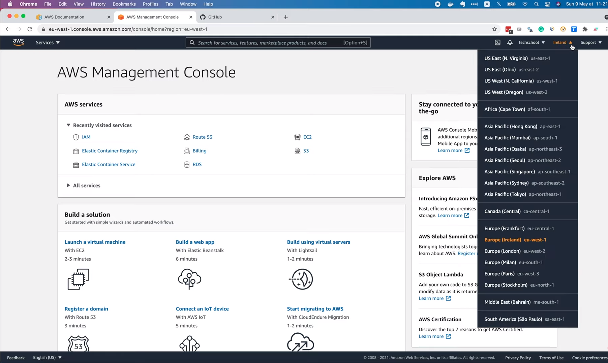

Я нахожусь в Европе, поэтому я выберу ECR в Ирландии или Amazon Elastic 
Container Registry — это полностью управляемый реестр Docker контейнеров,
который упрощает хранение, управление и развертывание контейнеров Docker 
образов.

Вы можете найти его в строке поиска вверху страницы.


Если вы впервые используете ECR, вы можете нажать на эту кнопку `Get Started`,
показанную на рисунке, чтобы создать новый репозиторий.

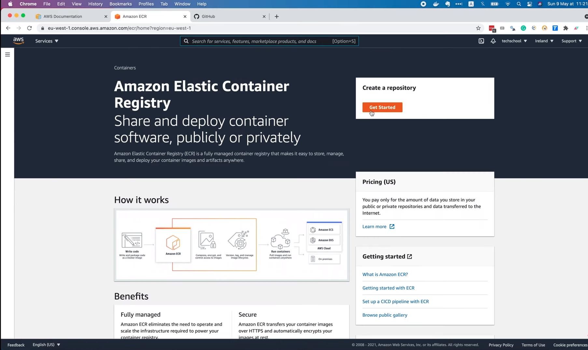

Или мы можем развернуть левое боковое меню и выбрать `Repositories`.

Сейчас ещё не создано ни одного репозитория. Итак, давайте нажмём эту
кнопку `Create repository`, чтобы создать новый.

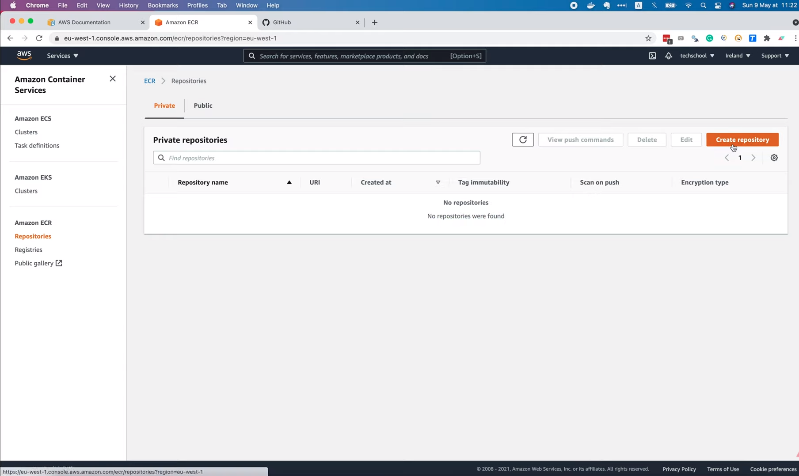

Вы можете настроить видимость репозитория, выбрав `Private` или `Public`.
Если вы выберете `Private`, никто не сможет отправлять или извлекать 
образы в/из этом/этого хранилище/а, если у них нет прав доступа. Далее мы 
должны указать название репозитория в этом поле `Repository name`. Я буду 
использовать `simplebank`. Обратите внимание, что мы должны следовать 
соглашению о названии репозитория, которое приведено под полем. Вы также 
можете настроить `Tag immutability`. Если переключатель активен, то он
предотвратит перезапись тегов образа при последующих отправках образов 
с использованием того же тега. Я оставлю его неактивным как это
сделано по умолчанию.

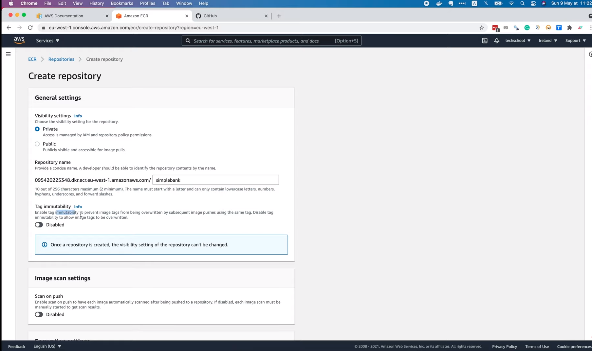

Следующая настройка — `Scan on push`. Если он включен, Amazon ECR выполнит 
проверку образа, чтобы выявить уязвимости в программном обеспечении.
Я пока оставлю его отключенным. Последним настраиваемым параметром является
`KMS encryption`, которое позволяет нам использовать сервис управления ключами 
AWS для шифрования образов вместо использования параметра шифрования по 
умолчанию: `AES 256`. Сейчас давайте просто воспользуемся значением по 
умолчанию. Итак, я нажму на кнопку `Create repository`.


И вуаля, репозиторий `simplebank` успешно создан. Вот на рисунке выделен URI 
этого репозитория, который мы можем использовать для отправки и получения 
образов позже.


Если вы используете инструмент AWS CLI, в этом диалоговом окне приведены
команды для отправки Docker образов в этот репозиторий.

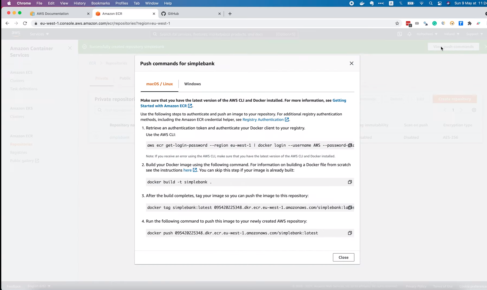

По сути вам нужно будет аутентифицировать свой Docker клиент, собрать свой
Docker образ, добавить тег к вашему образу и, наконец, отправить его в 
репозиторий. Однако обычно мы не отправляем образ напрямую с нашей машины, где
проводим разработку. Вместо этого мы будем использовать GitHub Actions для 
автоматической сборки, добавления тега и отправки образа каждый раз, когда 
новые код вливается в ветку `master`.

## Рабочий процесс для развертывания

Итак, давайте откроем проект нашего простого банковского приложения в 
Visual Studio Code. Во-первых, я собираюсь переименовать наш существующий 
файл `ci.yml` в `test.yml` и изменить его название на "Run unit tests" 
(«Выполняем unit тесты»), потому что это основная обязанность этого рабочего 
процесса. Давайте скопируем содержимое этого рабочего процесса.

Затем я создам новый рабочий процесс с названием `deploy.yml`. Мы будем 
использовать этот рабочий процесс для создания Docker образа и последующего 
развертывания его в продакшене. Теперь давайте вставим содержимое рабочего 
процесса для тестирования и изменим его название на "Deploy to production" 
(«Развертывание на продакшене»). Этот рабочий процесс будет запускаться 
только при отправке нового кода в ветку `master`, поэтому я собираюсь 
удалить событие запроса на слияние из списка. Затем в разделе заданий мы
создадим первое, которое создаст и отправит Docker образ в Amazon ECR. Оно
будет работать на `ubuntu-latest` как обычно.

```yaml
name: Deploy to production

on:
  push:
    branches: [ release ]

jobs:

  build:
    name: Build image
    runs-on: ubuntu-latest
```

Затем мы должны написать шаги для выполнения этого задания. Здесь я буду
использовать некоторые существующие GitHub действия. В [github.com](https://github.com/marketplace),
давайте откроем `Marketplace`, выберем тип `Actions` и найдем `AWS ECR`. Поиск
отобразит множество результатов, но показанное на рисунке `Amazon ECR "Login" 
Action` является официальным, написанным AWS.


Итак, давайте откроем его. Здесь, на этой странице, мы можем увидеть, как 
его использовать.

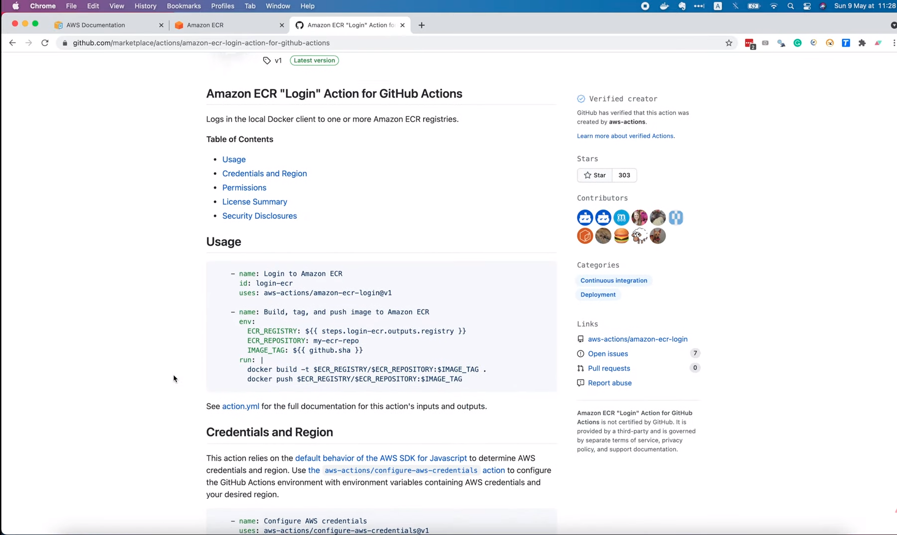

Я скопирую этот шаблон

```yaml
    - name: Login to Amazon ECR
      id: login-ecr
      uses: aws-actions/amazon-ecr-login@v1

    - name: Build, tag, and push image to Amazon ECR
      env:
        ECR_REGISTRY: ${{ steps.login-ecr.outputs.registry }}
        ECR_REPOSITORY: my-ecr-repo
        IMAGE_TAG: ${{ github.sha }}
      run: |
        docker build -t $ECR_REGISTRY/$ECR_REPOSITORY:$IMAGE_TAG .
        docker push $ECR_REGISTRY/$ECR_REPOSITORY:$IMAGE_TAG
```

и вставим его в наш файл рабочего процесса для развертывания. Теперь, как 
видите, первый шаг — войти в Amazon ECR. И для этого используется действие 
`amazon-ecr-login`. Но для работы мы должны предоставить ему определенные
учетные данные для доступа к нашей учетной записи AWS. В разделе документации
`Credentials and Region` («Учетные данные и регион») мы можем увидеть, как 
это сделать с помощью другого действия Github: `configure-aws-credentials`.
Поэтому давайте скопируем этот шаблон

```yaml
    - name: Configure AWS credentials
      uses: aws-actions/configure-aws-credentials@v1
      with:
        aws-access-key-id: ${{ secrets.AWS_ACCESS_KEY_ID }}
        aws-secret-access-key: ${{ secrets.AWS_SECRET_ACCESS_KEY }}
        aws-region: us-east-2
```

и вставим в качестве первого шага нашего рабочего процесса. Теперь нам нужно 
предоставить 2 параметра: идентификатор ключа доступа AWS и секретный ключ 
доступа AWS. Обратите внимание, что мы не будем добавлять их прямо в этот 
файл в виде открытого текста, а они должны быть зашифрованы и сохранены в
Github Secrets. Затем позднее они будут загружены как переменные окружения 
при запуске рабочего процесса. Мы скоро научимся это делать.

Теперь помимо этих учётных данных, мы также должны указать `aws-region`, 
к которому мы хотим получить доступ. Поскольку я использую AWS Ireland или 
`eu-west-1`, я скопирую его название из URL-адреса этой страницы. И вставлю 
его в наш рабочий процесс здесь.

```yaml
    - name: Configure AWS credentials
      uses: aws-actions/configure-aws-credentials@v1
      with:
        aws-access-key-id: ${{ secrets.AWS_ACCESS_KEY_ID }}
        aws-secret-access-key: ${{ secrets.AWS_SECRET_ACCESS_KEY }}
        aws-region: us-east-1
```

Хорошо, теперь давайте создадим учетные данные, чтобы позволить GitHub 
получить доступ к нашей учетной записи AWS. В консоли я поищу IAM.


## AWS IAM

Вот, выбираем первый результат в поиске. Подробнее о нём можно прочитать на 
этой [странице документации](https://docs.aws.amazon.com/IAM/latest/UserGuide/introduction.html).
По сути IAM - это аббревиатура от Identity and Access Management (Управление 
Идентификацией и Доступом). Это веб-сервис, который помогает вам безопасно 
контролировать доступ к ресурсам AWS. Вы можете использовать его, чтобы 
контролировать, кто проходит аутентификацию и авторизуется для использования 
ваших ресурсов AWS. Вы можете настроить несколько типов идентификаций, 
которые показаны в разделе `Identities` в левом меню на рисунке.


Первый тип — `User` («Пользователь»), который представляет собой одного 
человека или приложение. Второй — `User Group` («Группа пользователей»), 
который позволяет определить один и тот же набор прав доступа для нескольких 
пользователей одновременно.

Как видите на рисунке


вы можете создавать группы для разных команд с разными правами доступа,
например, `Admins` («Администраторы»), `Developers` («Разработчики») и 
`Testers` («Тестеры»).

Ещё один тип идентификации - [IAM роли](https://docs.aws.amazon.com/IAM/latest/UserGuide/id_roles.html).
Они очень похожи на IAM пользователя, но вместо того, чтобы однозначно 
ассоциироваться с одним человеком или приложением, роль может быть 
назначена любому, кто в ней нуждается. Вы можете узнать о них больше, 
прочитав документацию.

Для наших целей нам будет достаточно использовать IAM пользователя.
Итак, вернемся к консоли AWS. Выберите раздел `Users` («Пользователи») в левом
меню. И нажмите `Add user` («Добавить пользователя»). Во-первых, мы должны 
выбрать для него имя пользователя. Скажем, `github-ci`. Затем в разделе 
типа доступа мы должны выбрать `Programmatic access` («Программный доступ»), 
так как это не пользователь-человек, а приложение. Это позволит создать
идентификатор ключа доступа и секретный ключ доступа для AWS API, CLI, SDK и 
других инструментов разработки. Хорошо, теперь давайте нажмем
`Next: Permissions` («Далее: Права доступа»).

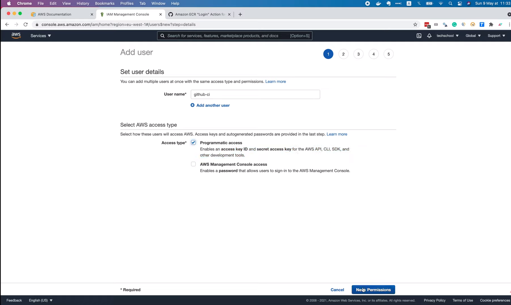

Здесь,


мы сможем задать некоторые права доступа для пользователя, которого мы 
собираемся создать. Существует несколько вариантов: `Add user to group` 
(«Добавить пользователя в группу»), `Copy
permissions from existing user` («Скопировать права 
у существующего пользователя»), или `Attach existing policies directly`
(«Добавить существующие правила напрямую»).

Я собираюсь создать новую группу и добавить в нее пользователя. Для
`Group name` («Названия группы»), давайте назовём её `deployment`. Затем в 
поле `Filter policies` («Отфильтровать правила») давайте поищем `Elastic 
Container Registry`.

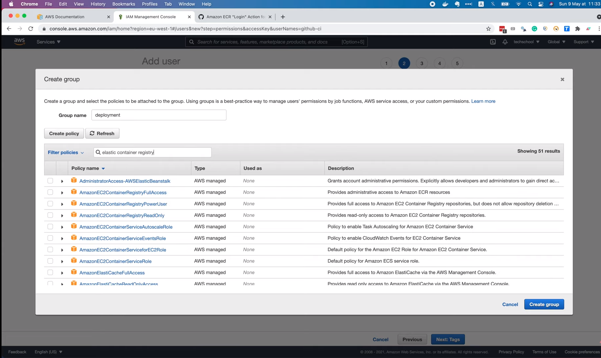

В списке результатов мы видим правила `Full Access`, которая разрешает 
доступ с правами администратора к ресурсам Amazon ECR. `PowerUser`
даёт права на всё, кроме удаления, а `ReadOnly` позволяет только считывать 
данные из ECR репозиториев.

В нашем случае мы хотим отправлять (или записывать данные) в репозиторий,
поэтому мы можем выбрать `Full Access` или `Power User`. Я буду использовать
`Full Access`. И нажму `Create Group` («Создать группу»).


На рисунке видно, что создана группа `deployment` и пользователь `github-ci`
будет добавлен в эту группу. Нажимаем `Next: Tags` («Далее: Теги»).

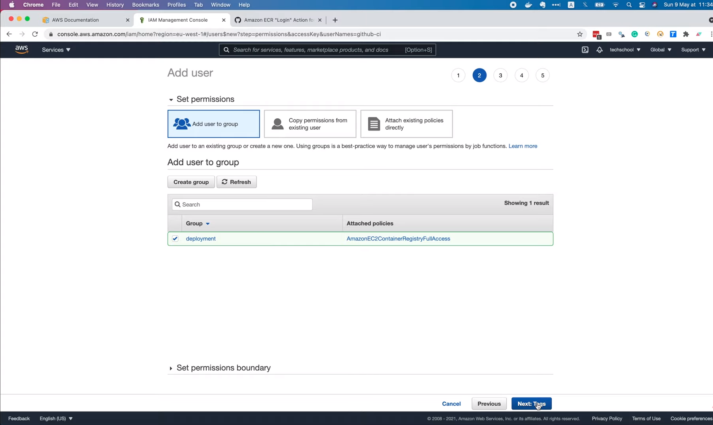

IAM теги представляют собой пары «ключ-значение», которые вы можете добавить 
к своему пользователю, чтобы вам было легче организовать, отслеживать или 
контролировать доступ для этого пользователя. Их использовать не обязательно,
поэтому пока я не буду их добавлять. Нажимаем `Next: Review` («Далее: 
Предпросмотр»).

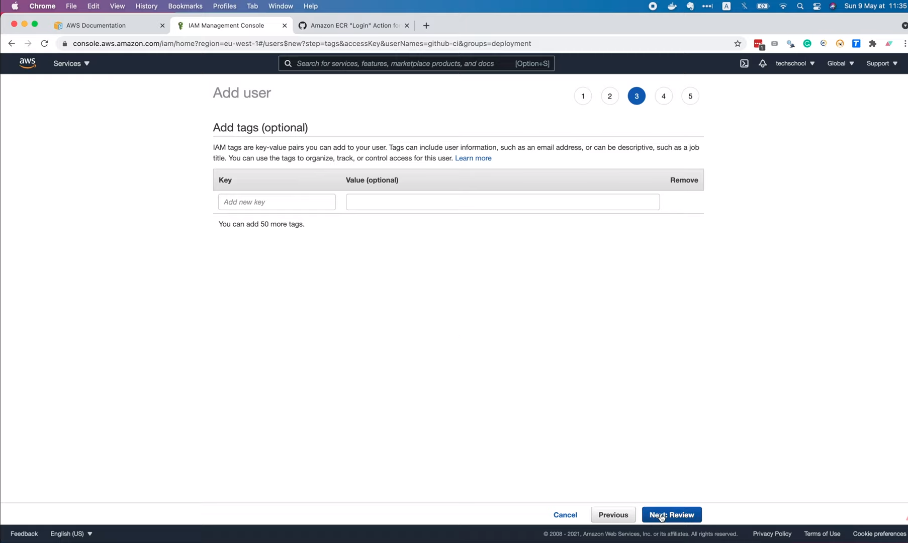

На этой странице мы можем просмотреть всю информацию о пользователе 
перед его созданием. Единственное о чём мы пока не сказали - это ограничение
прав доступа. Если вы вернётесь на предыдущий шаг, где мы настраивали группу
пользователей и права доступа, то увидите раздел `Set permissions boundary`
внизу. По сути, это способ контролировать максимальные права доступа,
которые может иметь этот пользователь.


Обратите внимание, что этот параметр не предоставляет дополнительные
права сам по себе, а просто максимальные права доступа, которые могут 
быть предоставлены пользователю. Его задавать также необязательно, поэтому я
пока просто создам пользователя без них. Итак, вроде бы всё настроено 
правильно, поэтому давайте нажмём `Create user` («Создать пользователя»)!


И вуаля, пользователь github-ci успешно создан. Он добавился в группу
`deployment` и для него создался ключ для программного доступа. Теперь мы 
можем скопировать и добавить его в Github Secrets.
And voila, the `github-ci` user has been successfully created. It is 
added to the deployment group, and the access key for programmatic 
access is also available. We can now copy and add it to GitHub 
secrets.

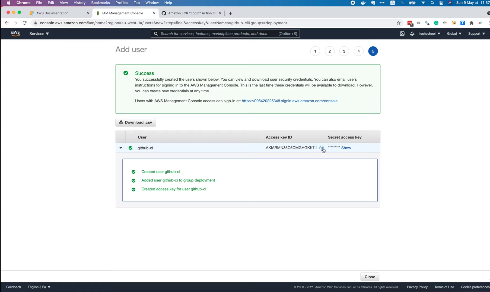

Итак, давайте откроем наш репозиторий `Simple bank` на Github. Откройте 
вкладку `Settings` и выберите раздел `Secrets` в левом меню. GitHub Secrets - 
это переменные окружения, которые зашифрованы и могут использоваться для 
хранения каких-либо конфиденциальных входных данных для GitHub действий.
Существует два типа секретов. Первый, секреты окружения, которые будут 
доступны только для одного конкретного окружения. Он используется, когда вы 
хотите иметь разные значения секретов для разных окружений, таких как 
тестирование, стейдж или продакшен... И второй тип — это секреты 
репозитория, значения которых будут доступны для всего репозитория. И именно
его мы собираемся использовать сейчас.

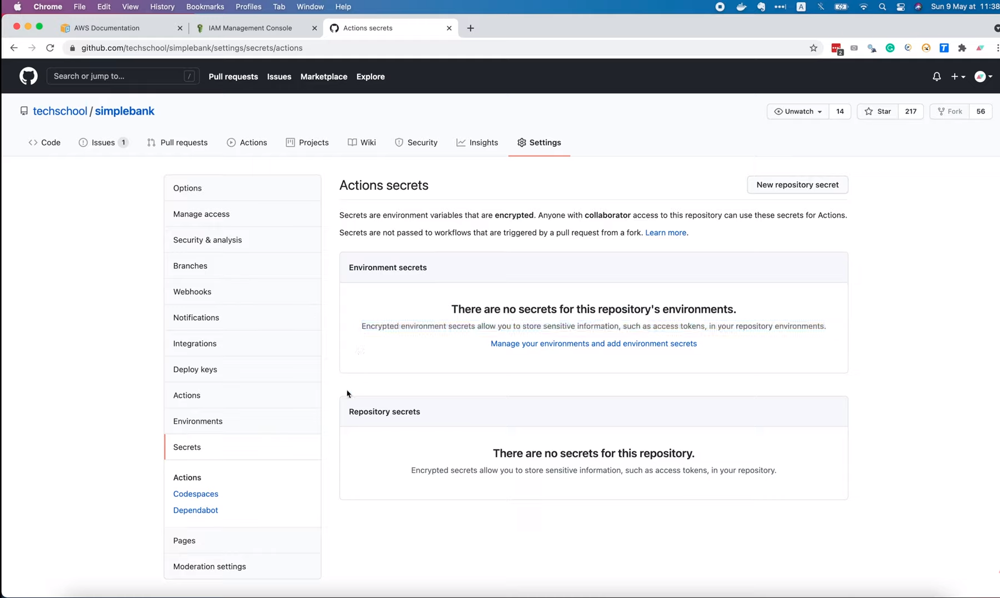

Итак, давайте нажмем `New repository secret`. Секретное имя давайте 
скопируем его из нашего рабочего процесса. Для первого секрета оно равно
`AWS_ACCESS_KEY_ID`. И мы можем получить его значение из консоли AWS.
Давайте скопируем его и вставим в это поле. Затем нажмите `Add secret` 
(«Добавить секрет»).

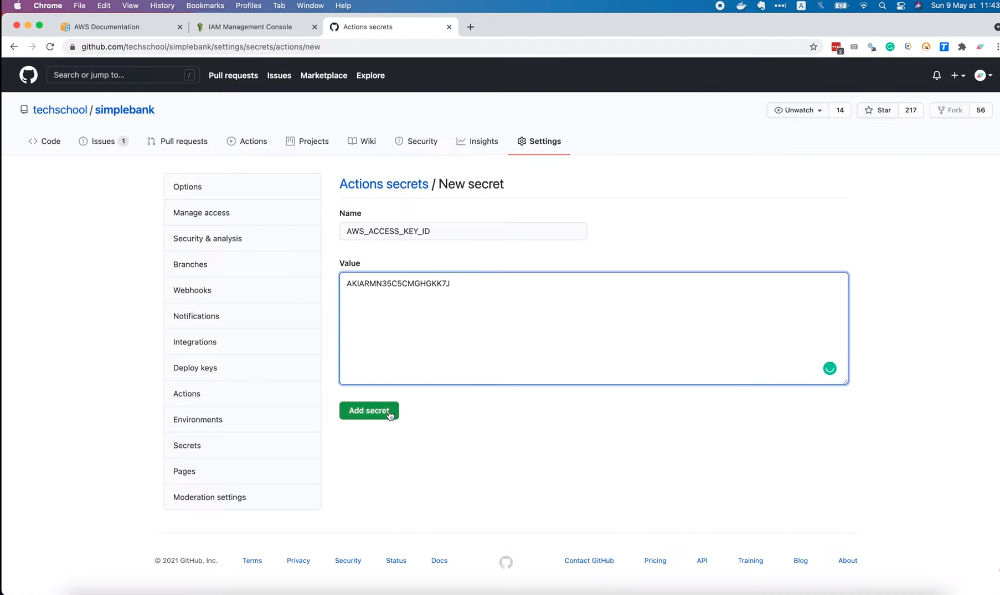

Хорошо, теперь давайте сделаем то же самое для второго секрета: его имя 
должно быть равно `AWS_SECRET_ACCESS_KEY`. И в консоли AWS давайте нажмем
`Show` («Показать»), чтобы увидеть его значение. Скопируйте его и вернитесь 
в GitHub, чтобы вставить значение. Затем нажмите `Add secret` («Добавить 
секрет»). Хорошо, теперь `AWS_ACCESS_KEY_ID` и `AWS_SECRET_ACCESS_KEY` 
можно использовать.

Вернемся к рабочему процессу в GitHub. На втором этапе ключ будет 
использоваться для входа в Amazon ECR, а результат - на третьем этапе.
Ниже видно, что в переменную `ECR_REGISTRY` записывается значение, 
хранящееся в переменной `registry` результата из предыдущего шага.

```yaml
    - name: Login to Amazon ECR
      id: login-ecr
      uses: aws-actions/amazon-ecr-login@v1

    - name: Build, tag, and push image to Amazon ECR
        env:
          ECR_REGISTRY: ${{ steps.login-ecr.outputs.registry }}
          ECR_REPOSITORY: my-ecr-repo
          IMAGE_TAG: ${{ github.sha }}
        run: |
          docker build -t $ECR_REGISTRY/$ECR_REPOSITORY:$IMAGE_TAG .
          docker push $ECR_REGISTRY/$ECR_REPOSITORY:$IMAGE_TAG
```

Мы также определяем еще одну переменную для ECR репозитория. В нашем случае
она будет равна `simplebank`, т. е. названию репозитория, который мы
создали ранее. Итак, давайте вставим название сюда.

```yaml
          ECR_REPOSITORY: simplebank
```

Последняя переменная, которую мы здесь определяем, это `IMAGE TAG`. По сути,
мы будем использовать GitHub SHA коммита для тега образа. В этом есть смысл,
поскольку каждый пуш в `master` будет иметь разный хэш коммита, и,
естественно, мы хотели бы дать новому образу тег, связанный с этим коммитом.
Теперь в разделе `run` мы выполним 2 команды: первая — `docker
build`, которая создаст образ и добавит к нему тег локально. А вторая — 
`docker push` отправит получившийся образ в ECR. Все переменные, которые мы 
объявили выше, используются в этих двух командах.

И я думаю этого будет достаточно! Давайте отправим этот новый рабочий процесс 
в GitHub, чтобы проверить, правильно ли он работает.

В терминале давайте выполним

```shell
git status
```

чтобы увидеть в каких файлах произошли изменения.

Запустите

```shell
git add .
```

чтобы проиндексировать все, еще раз `git status`, чтобы увидеть, что будет 
зафиксировано. Затем выполните `git commit` с сообщением "deploy workflow: 
build and push docker image to ECR" (рабочий процесс deploy: собираем и 
отправляем Docker образ в ECR). Наконец, запустите `git push origin 
master`, чтобы отправить коммит на GitHub. К сожалению, коммит был
отклонён. Это связано с тем, что ветка `master` защищена, поэтому мы не можем 
отправлять в нее изменения напрямую, и необходимо создать запрос на слияние, 
если мы хотим добавить что-то в `master`. Вы можете добавить правила защиты 
веток во вкладке `Settings`, раздел `Branches`.

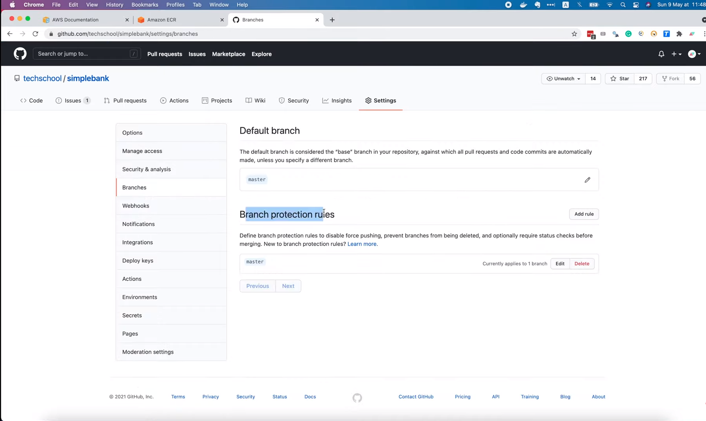

На рисунке ниже вы видите моё правило, защищающее ветку `master`. По сути, я 
просто требую, чтобы осуществлялась проверка работоспособности, а это
означает, что рабочий процесс unit тестирования должен быть успешно
завершен. Вы также можете задать количество подтверждений прежде чем
запрос на слияние может быть выполнен.


Итак, из-а правила защищающего ветку `master`, мы должны создать новую ветку.
Назовем её `ft-/ci-build-image`. Затем отправим эту ветку на GitHub. Теперь
в репозитории `simplebank` давайте откроем вкладку `Pull requests` и 
нажмём `New pull request`. Базовой веткой будет `master`, а веткой для 
сравнения — `ft-/ci-build-image`. Здесь мы можем увидеть изменения.


Вроде бы всё в порядке. Итак, давайте нажмем `Create pull request`.
Вы можете изменить название и добавить комментарий, если хотите.
Затем нажмите `Create pull request` еще раз.


Хорошо, PR успешно создан. И выполняется рабочий процесс unit тестирования.
Пока ждем его завершения, давайте взглянем на внесенные нами изменения.
Итак, рабочий процесс `deploy` будет запущен при пуше в ветку `master`.
Первая задача — создать Docker образ. Он настроит учетные данные AWS, 
используя секреты репозитория, затем войдет в Amazon ECR и, наконец, соберёт, 
добавит тег и отправит образ. Хорошо, теперь вернемся на вкладку
`Conversation`. Тесты все ещё выполняются. И как видите кнопка
`Merge pull request` неактивна, потому что мы требуем успешного прохождения
тестов перед слиянием.


Итак, unit тесты завершены, все они успешно пройдены. Таким образом, мы 
можем нажать на `Merge pull request`, `Confirm merge` и удалить ветку с 
новым функционалом.


Хорошо, теперь если мы перейдём на вкладку `Code` ветки `master` мы увидим
2 запущенных рабочих процесса CI.


Давайте откроем рабочий процесс `deploy`. При его выполнении возникла ошибка.


Шаги по настройке учетных данных AWS и входу в Amazon ECR успешно выполнены.
Но возникла ошибка на этапе сборки образа. `Dockerfile` не найден. Это
связано с тем, что я забыл один шаг - загрузить код с учётом последних 
изменений. Итак, давайте откроем рабочий процесс `test` и скопируем этот 
шаг.

```yaml
      - name: Check out code into the Go module directory
        uses: actions/checkout@v2
```

Затем вставьте его в рабочий процесс `deploy` в качестве первого шага.

```yaml
steps:
    - name: Check out code into the Go module directory
      uses: actions/checkout@v2
```

Мы не запускаем этот рабочий процесс в Golang образе, поэтому давайте 
переименуем его просто в "Check out code". Хорошо, по идее теперь ошибки
быть не должно. Давайте зафиксируем изменение: "Deploy workflow: add check 
out code step" («Рабочий процесс Deploy: добавляем шаг загрузки кода»). 
И отправим его на GitHub в ветку `ft/ci-build-image`. Мы можем открыть этот 
URL [https://github.com/techschool/simplebank/pull/new/ft/ci-build-image](https://github.com/techschool/simplebank/pull/new/ft/ci-build-image)
в браузере, чтобы создать новый запрос на слияние. Итак, PR создан. Подождем 
окончания unit тестов. О, похоже, текущая ветка устарела по сравнению с 
веткой `master`.

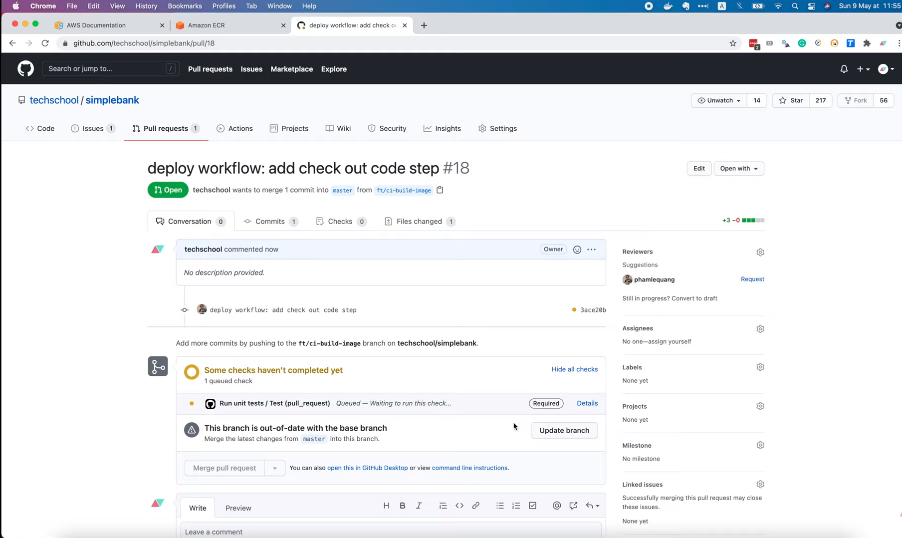

Это связано с тем, что мы объединили предыдущий PR с `master`. Но ещё не 
обновили ветку `master` локально. Итак, в терминале давайте перейдём на 
ветку `master`, выполним `git pull`, чтобы получить и объединить новые 
изменения с нашей локальней веткой `master`. Затем командой `git checkout` 
перейдите на ветку `ft/ci-build-image`. Теперь мы можем выполнить 
`git merge master`, чтобы объединить ветку `master` с текущей веткой. 
Объединение успешно выполнено. Итак, давайте снова отправим его на GitHub.
Теперь осталось дождаться завершения unit тестов. Давайте откроем вкладку
`Files changed`. Мы добавили только один шаг для загрузки кода, поэтому
никаких проблем быть не должно.

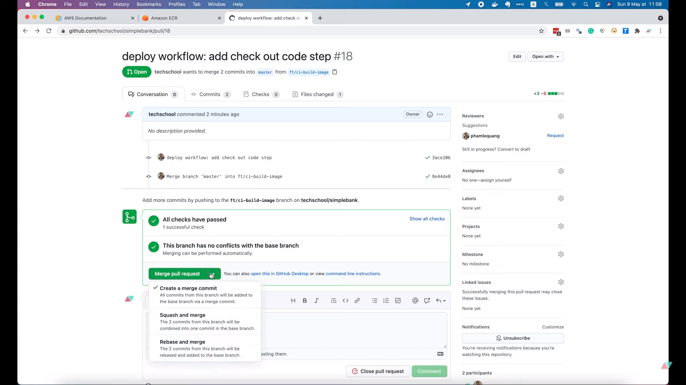

Как видно на рисунке, все тесты успешно пройдены. Давайте осуществим запрос
на слияние с `master`. Здесь вместо обычного слияния мы также можем 
использовать `Squash and merge`, чтобы объединить все коммиты в один коммит в
ветке `master`. Это поможет избежать запутанностей и упростит историю 
коммитов в `master`.

Хорошо, теперь давайте просмотрим список коммитов на ветке `master`.

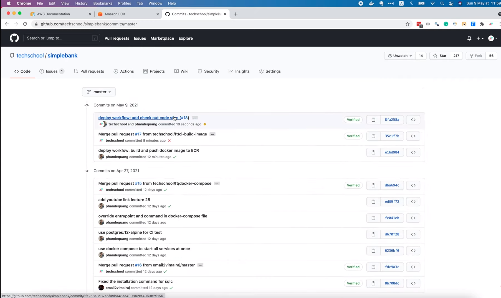

Для последнего коммита запущены рабочие процессы CI. Давайте откроем рабочий 
процесс `deploy`. На момент открытия происходит сборка образа (смотри
рисунок).


Все предыдущие шаги успешно выполнены. Мы можем раскрыть этот шаг, чтобы
просмотреть подробности. Через какое-то время всё будет завершено. Все шаги
будут успешно выполнены (смотри рисунок).

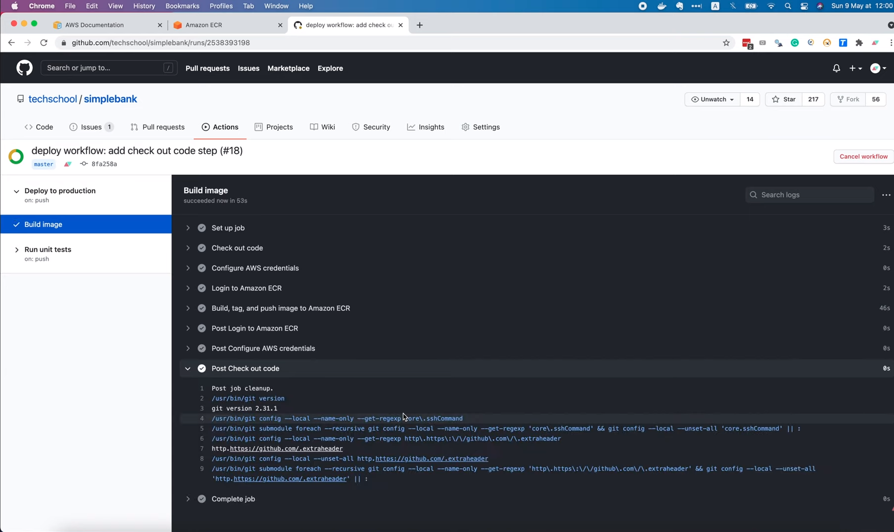

Образ создан и отправлен в Amazon ECR. Итак, давайте откроем консоль AWS, 
чтобы проверить так ли это!


Здесь, в репозитории `simplebank`, мы видим один новый образ с тегом 
последнего хеша коммита, который был только что запушен. И его размер 
составляет 26,17 МБ. Потрясающе! Вот так мы настраиваем Github Actions для 
сборки и отправки образа в ECR.

## Как проверить свои баланс своей учётной записи

Прежде чем мы закончим, я покажу вам, как проверить баланс вашей учётной 
записи. Очень важно контролировать, сколько вы тратите на свои сервисы AWS.
Просто нажмите на название своей учетной записи в правом верхнем углу и 
выберите `My Billing Dashboard`.

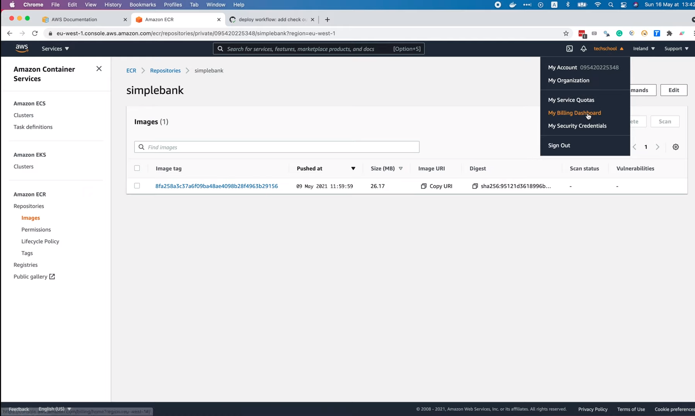

Здесь вы можете увидеть сводку ваших расходов.


Прокрутите немного вниз и мы увидим самые популярные сервисы, которые
можно использовать бесплатно. Сейчас мы используем только сервис Amazon ECR,
где предоставляется 500 МБ бесплатного хранилища в месяц. И до сих пор мы 
используем только около 1% от него.

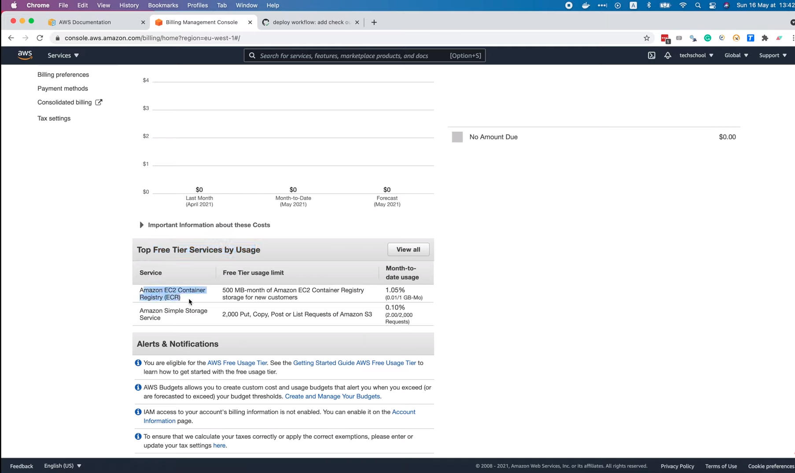

Но почему здесь также на рисунке Amazon Simple Storage Service? Это связано
с тем, что ECR использует S3 для хранения Docker образов. И нам дается 2000 
бесплатных запросов типа Put, Copy, Post или List. Поэтому, если мы превысим 
эти цифры, с нас будут взиматься деньги. Если вы откроете [страницу](https://docs.aws.amazon.com/AmazonECR/latest/userguide/what-is-ecr.html)
документации ECR и прочитаете за что снимается плата, вы увидите, что 
ограничение в 500 бесплатных мегабайт касается только приватных репозиториев.
Кроме того, ECR также предлагает 50 ГБ бесплатного хранилища, если вы 
используете его для публичных репозиториев. Здорово, не правда ли?

На этом я закончу лекцию о сборке и отправке Docker образов в Amazon ECR
с помощью GitHub Actions. Я надеюсь, что приобретенные из этой лекции знания 
будут вам полезны.

Большое спасибо за время, потраченное на чтение, желаю вам получать 
удовольствие от обучения и до встречи на следующей лекции!