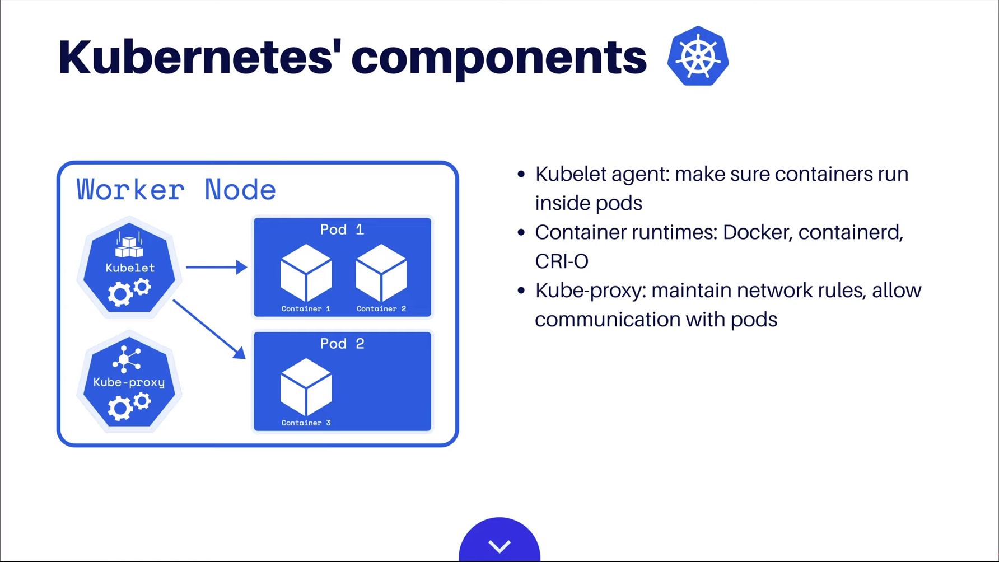
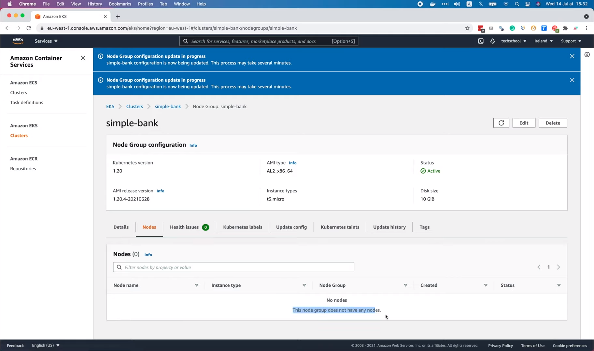

# Kubernetes architecture & How to create an EKS cluster on AWS

[Original video](https://www.youtube.com/watch?v=TxnCMhYhqRU)

Hello everyone and welcome to the backend master class!

In this lecture, we will learn how to setup a kubernetes cluster 
using Amazon's Elastic Kubernetes Service, or EKS.

OK, but what is Kubernetes?

## Introduction to Kubernetes

Well, Kubernetes is an open source container orchestration engine for
automating deployment, scaling, and management of containerized 
applications. Basically, a Kubernetes cluster consist of 2 main parts:
The first part is a set of worker machines, or nodes, that run your
containerized applications. Specifically, in each worker node, there's
a kubelet agent which makes sure that all containers are running 
properly inside a Kubernetes pod. Kubernetes supports several 
container runtimes, such as Docker, containerd, or CRI-O. There's 
also a kube-proxy component which maintains network rules on the node,
and allows network communication to the pods.

The second part of the cluster is the control plane, which runs on the
master nodes. Its responsibility is to manage the worker nodes and pods of
the cluster. The control plane consists of several components with 
different roles, such as:

- the API server, which is the front-end of the control plane. It exposes 
the Kubernetes API to interact with all other components of the cluster.
- the persistence store etcd, which acts as Kubernetes' backing store for 
all cluster data. 
- the scheduler, which watches for newly created Pods with no assigned nodes 
and select the nodes for them to run on.
- the controller manager, which is a combination of several controllers, 
such as:
  * Node controller, which is responsible for noticing and responding when 
  nodes go down,
  * Job controller, which watches for jobs, or one-off tasks, then creates 
  Pods to run them,
  * Endpoint controller, which populates the endpoints object, or joins 
  services and pods.
  * There's also a service account and token controllers, which creates default 
  account and API access tokens for new namespaces.
- finally, if you deploy your cluster on a cloud service, such as Amazon web 
services, then there will be a cloud controller manager component, whose 
responsibility is to link your cluster into your cloud provider's API, and 
separate out the components that interacts with the cloud platform from the 
components that only interact with your cluster. It has a node controller 
for checking the cloud provider to determine if a non-responding node has 
been deleted or not. Route controller for setting up rotes in the underlying 
cloud infrastructure. And a service controller for creating, updating and 
deleting cloud load balancers.

OK, so that's a quick overview of the Kubernetes cluster's architecture.

It seems quite complicated and has a lot of components, especially in the
control plane. So setting up all of these components, and maintaining them 
after that sounds like a bit challenging job. And that's why Amazon EKS
comes into play!

## Amazon EKS 

Amazon EKS, or Elastic Kubernetes Service, is a managed service that makes
it easy for you to use Kubernetes on AWS without needing to install and 
operate your own Kubernetes control plane.

So basically, the master nodes are automatically deployed and managed for 
you by AWS. What you have to do is just adding worker nodes to the EKS 
cluster, then connect to this cluster using your favourite tool such as 
`kubectl`, and use it to deploy your application!

Alright, now let's learn how to create a new EKS cluster and add worker 
nodes to it! In the left-hand side menu, let's select Amazon EKS Clusters.

Then click this `Create cluster` button.

In the first step, we have to give a name for our cluster. I'm gonna call
it `simple-bank`. Then select the Kubernetes version. Normally, you should
choose the latest one. In my case, it is version 1.20. Next, we have to 
select a cluster service role, which is an IAM role to allow the Kubernetes 
control plane to manage AWS resources on your behalf. We don't have any role
with enough permissions that qualifies to be a cluster service role yet, so
let's open the IAM console to create a new one.

OK, let's click the `Create role` button.

Select `AWS service`, `EC2` use case, then choose the `EKS` service in the list.
Now we will see the `EKS - Cluster` use case here.

Let's select it, and click `Next: Permissions`. Here in the list, there's
`AmazonEKSClusterPolicy`, and this policy contains all permissions we need
for our cluster.

So let's click `Next: Tags`. This step is optional, you can add tags if you
want to make it easier to manage your AWS resources and their budgets. For
demo purpose, I'm just gonna skip this step.

Now we have to give this new role a name. Let's call it `AWSEKSClusterRole` 
and click `Create role`.

Then voilà, the role has been successfully created.

Let's go back to the EKS cluster creation form, refresh the role list, and
select `AWSEKSClusterRole`. We also have an option to encrypt Kubernetes
using KMS or adding tags to our cluster. But I'm gonna skip it for now.

Now we move to the second step. In this step, we will specify networking
properties for the cluster. We can choose the VPC to use for the EKS 
cluster resources, and also the subnets in your VPC where the control
plane may place elastic network interfaces (or ENI) to facilitate 
communication with the cluster. Here the default VPC and subnets are 
already selected, so I'm just gonna use them. You should create new VPC 
and subnets if you're managing multiple EKS clusters. Next, there's an 
input field to choose security groups to apply to the ENI that are created
in the worker node subnets. But we don't need to specify anything, because
we will handle that later, when we setup the worker nodes. For now, we're
just setting up the master nodes for the control plane, so let's just
leave it empty. There's also an option to configure Kubernetes Service 
IP address range, but it's also optional, so let's not enable it.

Now comes one important thing: configure access to the Kubernetes API 
server. If you choose `Public`, then the cluster endpoint will be accessible
from outside of the VPC, and even your worker node traffic will have to
leave the VPC in order to connect to that endpoint. I think this is not a
very good option. The 2nd option is both `Public and Private`, which means,
the cluster endpoint is accessible from outside of the VPC, but your 
worker node traffic to the endpoint will stay within the VPC. The last
option is `Private`, which means everything will only be accessible within
the VPC. This is the safest settings that you might want to use in a real
production cluster. In my case, I will choose the moderate option, which
is both `Public and Private`, because I want to access the cluster endpoint
from my local computer. In order to setup the tools, and deploy the 
application for the first time. After that, we will also learn how to 
deploy the app automatically via GitHub CI. OK, here we have an advanced 
settings to configure a some specific IPs, that can access the cluster's
API endpoint. By default, it is openned to all traffic, from anywhere. You
can change it only allow your IP address to access the cluster endpoint,
that would be more secured. For the demo, I'm just gonna leave it open
for all.

Next, we can configure some add-ons, that provide more advanced networking
functionalities to the cluster. First, the VPC CNI to enable pod 
networking within the cluster. It is using the default version 1.7.5 at 
the moment, but the latest one is 1.8.0.

So let's change it to this latest version. The `CoreDNS` add-ons will
enable service discovery within the cluster. Its already running the 
latest version: 1.8.3. Finally, there's also a `kube-proxy` add-ons that
enables service networking within the cluster. And it's also running the 
latest version: 1.20.4. So everything looks good, let's click `Next` to 
move to the third step.

In this step, we have the options to enable logging for each of the 
components of the control plane. If logging is enabled for a component, 
then all the logs of that component will be sent to the `CloudWatch Logs`
service. If this is a real production cluster, then you probably want to 
enable logging. For this demo, I'm just gonna leave it disabled.

Alright, now comes the last step: `Review and create`. So, to summarize, we
have configured the name, version, and IAM role for our cluster. We've using
default VPC and subnets for the networking, and allowing both `Public and
Private` access to cluster API endpoint. All the networking add-ons are
using their latest version. And we don't need to control plane logging at 
the moment. Everything looks good, so let's click `Create`!

OK, the cluster is now being created. It will take a few minutes to 
complete, so I'm gonna stop recording now and will come back when it's 
done. Alright, it's been a while, so let's refresh the page. The status
is `Active`, so that means the cluster is ready.

We've successfully set up the control plane, or master nodes, for our
simple bank cluster. Now we have to add worker nodes to it. To do that,
let's open the `Compute` tab. The worker nodes will run in groups, which
means a collection of EC2 instances of the same type. An EKS cluster can 
have multiple node groups of different instance types. Let's click this 
`Add Note Group` button to add a new node group.

First, let's give it a name: `simple-bank`. Then we have to select an IAM
role for the node group. This IAM role must have some required permissions
to be qualified, that's why we don't see the role that we've created before
in this list. So let's go to the IAM console again to create a new one.
Let's click `Create Role`.

Again, we will select `AWS service`, and `EC2`. But this time, no need select
a service like before, just click `Next: Permissions`.

We will select the necessary policy ourselves. Let's search for `EKS`. The
first policy a worker node needs is `Amazon EKS CNI Policy`.

This policy provides Amazon VPC CNI Plugin the permissions to modify the
IP address configuration on your worker nodes. So basically, it will allow
the CNI plugin to list, describe, and modify the `Elastic Network Interfaces`
on your behalf. The second policy we must select is `Amazon EKS Worker Node
Policy`. This policy will allow the worker nodes to connect to the EKS
cluster. OK, now there's one more policy we would need to access the ECR 
repository because we're storing our docker image in ECR, so the worker
nodes will need access to ECR in order to pull the images. It doesn't
need to push images, so let's just select `Amazon EC2 Container Registry 
Read Only Policy`. And that will be it! We only need those 3 selected
policies for the worker nodes. Let's click `Next: Tags`.

Again, this step is optional, so I'm gonna skip it for now.

In the final step, we can see the list of 3 policies that we've just 
selected. Now we need to give this role a name. I'm gonna call it 
`AWSEKSNodeRole`. Then click `Create Role`.

OK, the role has been successfully created. Let's go back to the `Add Node
Group` form. Refresh this list of IAM Role and select `AWSEKSNodeRole` from
the dropdown.

There are some options to set up `Launch template`, `Kubernetes labels`, 
`Kubernetes taints`, and `Tags` for the worker nodes, but we don't need to 
add them right now. We can always add them later once the nodes has been 
created and joined the EKS cluster. So I'm just gonna go to the next step.

In this second step, we will choose the configuration for the node machine.
First the Amazon Machine Image, there are 3 options here, but I think 
normally we would use `Amazon Linux 2`, unless you want to have GPU 
Enabled, or using an ARM instance. Next, the `Capacity type`, which can be
`On-Demand`, or `Spot` instance. `Spot` instance is usually cheaper than
`On-Demand` instance, but it can be interrupted at any time, so I think 
it's not stable enough to run a web service API for our simple bank. 
`On-Demand` instance is a safer choice here. Next, we can choose the 
instance type with different size of CPU, memory, and network interfaces. 
By default, `t3.medium` instance is selected. But we can choose another
type of instance if we want. Let's say I'm gonna choose `t3.micro` for
now. For the disk size, I think we will need no more than 10 GiB.

Next, there are 3 options for group scaling configuration. First, the minimum 
size, or the minimum number of nodes that the group can scale in to. I'm
gonna set it to minimum of 1 node. Then, the maximum number of nodes that
this group can scale out to, let's say 2 nodes. And finally, the desired
number of nodes that the group should launch with initially. I'm gonna
set it to just 1 node.

Next, we can change the node group update configuration. For example, we 
can say, during a node group version update, there should be at most 1 node
to be tolerated.

Alright, now let's move to the next step: `Specify networking`. Here we can
select the subnets in the VPC, were the nodes will run. The default 
subnets are selected by default, but you can also create new subsets for 
the node group if you want. There's also an option to allow remote access
to the nodes. If you enable it, then you need to create a key pair and use
it to access the node via a command line tool. But normally I would say
we don't need to do so, I think we can fetch almost all information of the
nodes we need via the console plane's API server. So I'm gonna disable
remote access to nodes. And just click `Next`.

In the final step, we just have to review all the configurations one more
time to make sure they're correct before clicking the `Create` button.

And voilà, the `simple-bank` node group is now being created. It will take
several minutes to be fully completed. For now there are no nodes in this
group yet. But if we go back to EKS cluster page, we can see that the node
group has already been added to the cluster here.

Although its status is still `Creating`. After a while, we can refresh the 
page. And now its status has changed to `Active`, which means it's ready
to run containers. If we follow this link to the node group page, we can
see its configuration, like the minimum, maximum, and desired size and 
in the `Nodes` tab, now there's already 1 node in `Ready` state. That's 
because the desired size is 1 as we set up before. So it works! Excellent!

Now before we finish, there's one thing I want to show you. That is how
we can manually scale up and down the nodes. All we have to do is to click 
this `Edit` button.

Then change the desired size to 2 nodes for example and click `Save 
changes`.

It will take a while to complete, but we will see the update history here,
with the status `In progress`.

Now while waiting for it to finish, let's follow this link to access the 
autoscaling group of this EKS node group.

## Scaling up

Now if you open the `Activity` tab, you can see the first activity that 
say "Launching a new EC2 instance", that was when we first created the
node group and set the desired capacity to 1 node. Then after that, 
there's another "Launching a new EC2 instance" activity, because we've just
increased the desired capacity from 1 to 2.

The activity is successful, so now if we go back to the node group page, 
we can see there are 2 nodes instead of 1 as before.

## Scaling down

So the node scaling up works! Now let's try scaling it down. I'm gonna
set the minimum size to 0 nodes, then set desired size to 0 nodes as well
and `Save changes`.

OK, let's go to the Auto scaling group to see what happens. There are 2 
activities that say "Terminating EC2 instance" and they all have the
`MidTerminatingLifecycle` status at the moment.

This means that the 2 instances are being terminated. That's because we 
have updated the desired size to 0 before. After a while, when we refresh
the page, the activities will be successful, then it means both instances 
have been terminated.

And if we go back to the node group page, we will see there are no nodes
in this group.

So the scaling down feature also works very well. And that brings us to 
the end of this lecture.

We have learned how to set up an EKS cluster and add worker nodes to it.
In the next lecture, I will show you how to access it from local computer
and deploy our simple bank application to it.

Thanks a lot for watching, and I will see you very soon!