# Архитектура Kubernetes и создание кластера EKS на AWS

[Оригинал](https://www.youtube.com/watch?v=TxnCMhYhqRU)

Всем привет и добро пожаловать на мастер-класс по бэкенду!

На этой лекции мы узнаем как настроить Kubernetes кластер с помощью 
Amazon Elastic Kubernetes Service или EKS.

Хорошо, но что такое Kubernetes?

## Введение в Kubernetes

Что ж, Kubernetes — это механизм оркестрации контейнеров с открытым исходным
кодом для автоматизации развертывания, масштабирования и управления 
контейнерными приложениями. По сути, Kubernetes кластер состоит из двух 
основных частей: первая часть — это набор рабочих машин или узлов, на 
которых выполняются ваши контейнерные приложения. В частности, на каждом 
рабочем узле стоит агент kubelet, который обеспечивает правильную работу 
всех контейнеров внутри Kubernetes пода. Kubernetes поддерживает несколько 
сред выполнения контейнеров, таких как Docker, containerd или CRI-O. 
Существует также компонент kube-proxy, который осуществляет поддержку 
сетевых правил на узле и обеспечивает сетевое взаимодействие с подами.
 

Вторая часть кластера - это плоскость управления, работающая на главных узлах.
В её обязанности входит управление рабочими узлами и подами кластера. 
Плоскость управления состоит из нескольких компонентов с разными ролями, 
таких как:
- API сервер, который является внешним интерфейсом плоскости 
управления. Он предоставляет Kubernetes API для взаимодействия со всеми 
другими компонентами кластера.
- постоянное хранилище etcd, которое используется как резервное хранилище 
Kubernetes для всех данных кластера.
- планировщик, который следит за вновь созданными подами без назначенных 
узлов и выбирает узлы для их запуска.
- менеджер контроллеров, который представляет собой комбинацию из нескольких 
контроллеров, таких как:
  * контроллер узла (Node controller), который отвечает за обнаружение и 
  реагирование на отказ узлов,
  * контроллер заданий (Job controller), который следит за заданиями или 
  разовыми задачами, а затем создает поды для их запуска,
  * Контроллер конечной точки, (Endpoint controller), который заполняет 
  объект конечных точек или объединяет сервисы и поды.
  * также существует сервис учётных записей и контроллеры токенов (service 
  account and token controllers), которые создают учетную запись по умолчанию 
  и токены доступа к API для новых пространств имен.
- наконец, если вы развернете свой кластер в облачном сервисе, такой как
  Amazon веб-сервис, то там будет компонент для менеджмента облачным 
  контроллером (Cloud Controller Manager), в обязанности которого входит 
  связывание вашего кластера с API вашего облачного провайдера и разделение 
  компонент, взаимодействующих с облачной платформой, от компонент, 
  взаимодействующих только с вашим кластером. У него существует контроллер 
  узла (Node controller), который проверяет: был ли удалён не отвечающий 
  узел в облачном провайдере. Контроллер маршрутов (Route Controller) для 
  настройки маршрутов в соответствующей облачной инфраструктуре. И контроллер 
  сервисов (Service Controller) для создания, обновления и удаления облачных 
  балансировщиков нагрузки.

Это был краткий обзор кластерной архитектуры Kubernetes.

Он кажется довольно сложным и состоит из множества компонентов, особенно
в плоскости управления. Таким образом, установка всех этих компонентов и 
последующее их обслуживание кажутся довольно сложной задачей. Вот почему в 
игру вступает Amazon EKS!

## Amazon EKS 

Amazon EKS, или Elastic Kubernetes Service, — это настраиваемый сервис,
который упрощает использование Kubernetes на AWS без необходимости 
устанавливать и работать с собственной плоскостью управления Kubernetes.

Таким образом, основные узлы автоматически развертываются и настраиваются за 
вас AWS. Что вам нужно сделать, так это просто добавить рабочие узлы в EKS 
кластер, затем подключиться к этому кластеру с помощью вашего любимого 
инструмента, такого как `kubectl`, и использовать его для развертывания 
вашего приложения!

Хорошо, теперь давайте узнаем, как создать новый кластер EKS и добавить в 
него рабочие узлы! В левом боковом меню выберите Amazon EKS Clusters.

Затем нажмите на эту кнопку `Create cluster`.

На первом шаге мы должны придумать название для нашего кластера. Я назову 
его `simple-bank`. Затем выберите версию Kubernetes. Обычно следует выбирать 
последнюю. В моем случае это версия 1.20. Затем нам нужно выбрать Cluster 
Service Role, которой будет IAM роль, позволяющая плоскости управления 
Kubernetes управлять ресурсами AWS от вашего имени. У нас пока нет роли
с достаточными правами, которые необходимы для кластерного сервиса,
поэтому давайте откроем консоль IAM, чтобы создать новую.

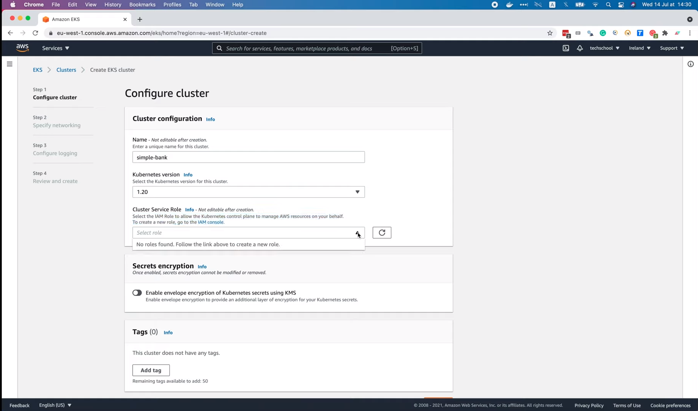

Итак, давайте нажмём кнопку `Create role`.

Выберите `AWS service`, сценарий использования `EC2`, затем выберите
сервис `EKS` в списке. Здесь в разделе `Select your use case` мы увидим 
`EKS - Cluster`

Давайте выберем его и нажмём `Next: Permissions`. Здесь в списке есть
`AmazonEKSClusterPolicy` и этот набор прав доступа содержит все, необходимые
для нашего кластера.

Итак, давайте нажмём `Next: Tags`. Этот шаг не обязательный, вы можете 
добавить теги, если хотите упростить управление AWS ресурсами и их бюджетами.
Для демонстрационных целей я просто пропущу этот шаг.

Теперь мы должны придумать название для этой новой роли. Давайте назовём её
`AWSEKSClusterRole` и нажмём `Create role`.

Вуаля, роль успешно создана.

Вернёмся к форме создания EKS кластера, обновим список ролей и выберем
`AWSEKSClusterRole`. У нас также есть возможность зашифровать Kubernetes с 
помощью KMS или добавить теги в наш кластер. Но пока я не буду этого 
делать.

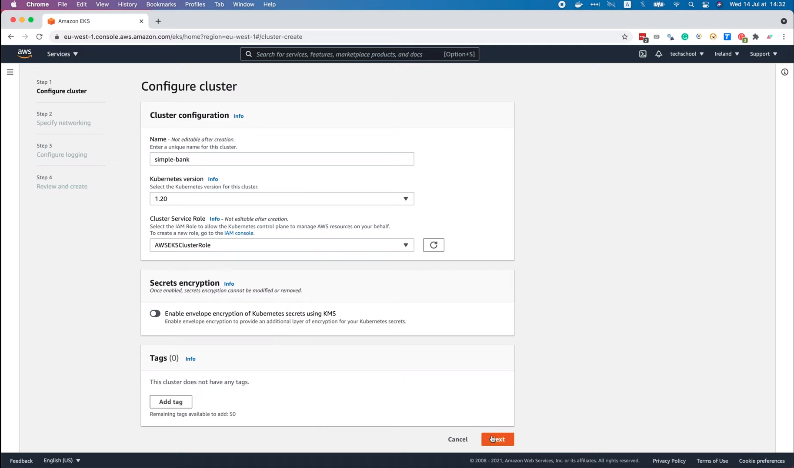

Теперь переходим ко второму шагу. На этом шаге мы определим сетевые 
свойства для кластера. Мы можем выбрать VPC, который будет использоваться 
для EKS ресурсов кластера, а также подсети в вашем VPC, где плоскость 
управления может размещать эластичные сетевые интерфейсы (или ENI) для 
облегчения связи с кластером. Здесь уже выбраны VPC и подсети по умолчанию, 
поэтому я просто буду их использовать. Вам следует создать новые VPC и 
подсети, если вы управляете несколькими EKS кластерами. Затем расположено 
поле ввода для выбора групп безопасности, которые будут применяться к ENI, 
созданным в подсетях рабочих узлов. Но нам не нужно ничего указывать, 
потому что мы займемся этим позже, когда настроим рабочие узлы. На данный 
момент мы просто настраиваем главные узлы для плоскости управления, так 
что давайте просто оставим это поле пустым. Также можно настроить диапазон 
IP-адресов Kubernetes сервиса, но делать это также необязательно, поэтому 
не будем её включать.

Теперь самое важное: настроить доступ к API-серверу Kubernetes. Если вы 
выберете `Public`, конечная точка кластера будет доступна из-за пределов 
VPC, и даже ваш рабочий узел должен будет покинуть VPC, чтобы подключиться к 
этой конечной точке. Я думаю, что это не лучший вариант. Второй вариант —
`Public and Private`, что означает, что конечная точка кластера доступна 
из-за пределов VPC, но ваш рабочий узел не будет покидать VPC. Последний 
вариант — `Private`, что означает, что всё будет доступно только внутри VPC.
Это самые безопасные настройки, которые вы, возможно, захотите использовать 
в реальном продакшен кластере. В моём случае я выберу второй вариант,
`Public and Private`, потому что я хочу получить доступ к конечной точке 
кластера с моего локального компьютера. Чтобы настроить инструменты и 
развернуть приложение в первый раз. После этого мы также узнаем, как 
автоматически развернуть приложение через GitHub CI. Итак, здесь нам доступны
расширенные настройки, позволяющие задавать некоторые конкретные IP-адреса,
которые могут получить доступ к конечной точке API кластера. По умолчанию он 
доступен отовсюду. Вы можете изменить это, разрешив доступ к конечной точке 
кластера только с вашего IP-адреса, что было бы более безопасно. Для
демонстрационных целей, я оставлю всё как есть, открыв доступ для любого 
IP-адреса.

Затем мы можем настроить некоторые расширения, которые отвечают за 
продвинутые сетевые функции кластера. Во-первых, VPC CNI для включения 
сети подов внутри кластера. На данный момент используется версия 
по умолчанию 1.7.5, но последняя — 1.8.0.

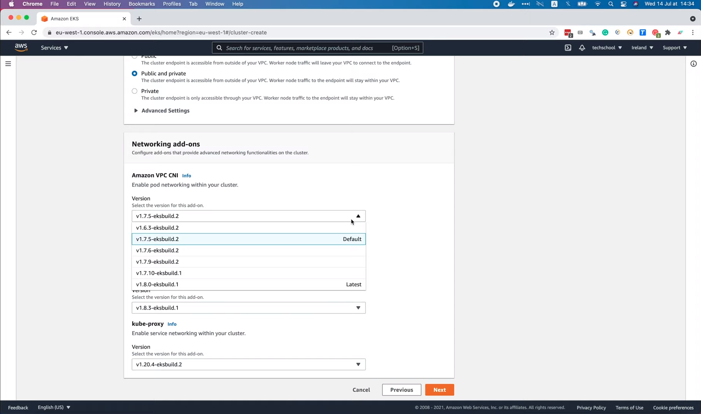

Итак, давайте изменим его на эту последнюю версию. Расширение `CoreDNS`
позволит обнаруживать сервисы в кластере. Уже запущена последняя версия: 
1.8.3. Наконец, расширение `kube-proxy` обеспечивает сетевое 
взаимодействие сервисов внутри кластера. Для него также выбрана последняя
версия: 1.20.4. Вроде бы всё в порядке, поэтому давайте нажмём `Next`,
чтобы перейти к третьему шагу.

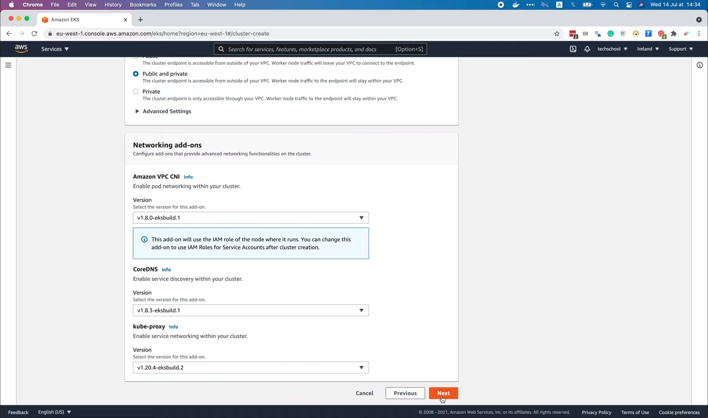

На этом этапе мы можем включить логирование для каждого из компонентов 
плоскости управления. Если для компонента включено логирование, все логи
этого компонента будут отправляться в сервис `CloudWatch Logs`. Если вы
настраиваете настоящий продакшен кластер, то вы вероятно захотите включить
логирование. Для демонстрационных целей я просто оставлю его отключенным.

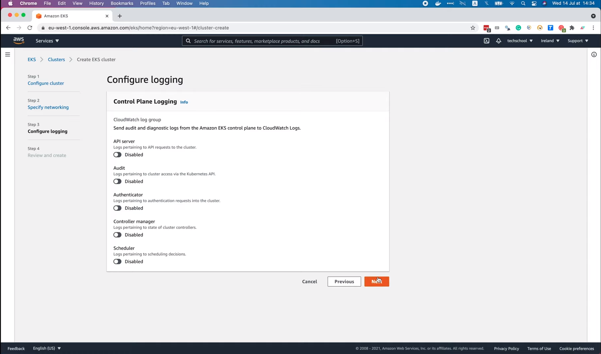

Хорошо, остался последний шаг: `Review and create`. Итак, подводя итог, мы 
настроили название, версию и IAM роль для нашего кластера. Мы используем 
VPC и подсети по умолчанию и разрешаем как публичный, так и приватный 
(`Public and Private`) доступ к конечной точке API кластера. Все сетевые 
расширения настроены так, что используют свои последние версии. И на данный
момент нам не нужно логировать плоскость управления. Вроде бы всё настроено
правильно, так что давайте нажмём `Create`!

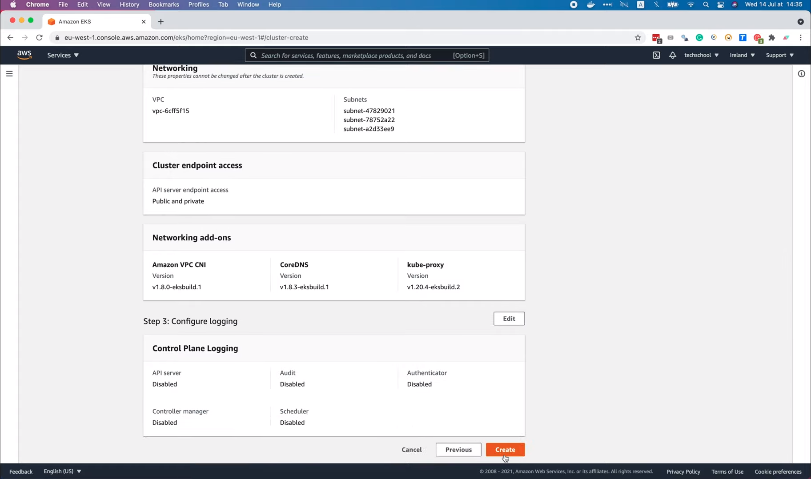

Итак, кластер начал создаваться. Процесс займёт несколько минут, так что я 
остановлю запись видеолекции и включу её, когда все будет готово. После того 
как кластер создался, давайте обновим страницу (смотри рисунок). Его статус
равен `Active`, то есть кластер можно использовать.

Мы успешно настроили плоскость управления или главные узлы для кластера нашего 
простого банковского приложения. Теперь нам нужно добавить к нему рабочие 
узлы. Для этого откроем вкладку `Compute`. Рабочие узлы будут работать 
группами, то есть в виде набора EC2 инстансов одного типа. EKS кластер 
может иметь несколько групп узлов с разными типами инстансов. Давайте 
нажмем кнопку `Add Note Group`, чтобы добавить новую группу узлов.

Во-первых, пусть она называется: `simple-bank`. Затем мы должны выбрать
IAM роль для группы узлов. Эта IAM роль должна иметь определённые необходимые
права доступа, чтобы её можно было использовать, поэтому мы не видим роль, 
которую создали ранее, в этом списке. Итак, давайте снова зайдем в IAM 
консоль, чтобы создать новую. Давайте нажмём `Create Role`.

Опять же, мы выберем `AWS Service` и `EC2`. Но на этот раз не нужно выбирать
сервис как раньше, просто нажмите `Next: Permissions`.

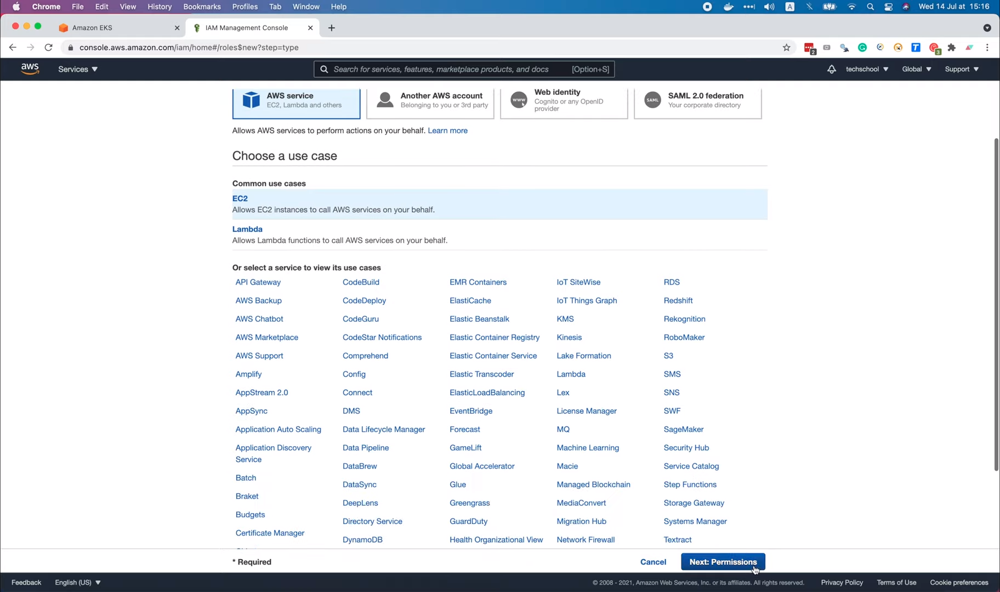

На этот раз мы самостоятельно выберем необходимые права доступа. Поищем
в поле `EKS`. Первый набор прав доступа, необходимые рабочему узлу, называется
`Amazon EKS CNI Policy`.

Он позволяет Amazon VPC CNI расширению изменять конфигурации IP-адресов на 
ваших рабочих узлах. По сути, это позволит CNI расширению выводить список,
просматривать и модифицировать `Elastic Network Interfaces` от вашего имени.
Второй набор прав, которую мы должны выбрать, — это `Amazon EKS Worker Node
Policy`. Этот набор позволит рабочим узлам подключаться к EKS кластеру.
Хорошо, теперь существует еще один набор прав, который нам понадобится для 
доступа к ECR репозиторию, поскольку мы храним наш образ докера в ECR, 
поэтому рабочим узлам потребуется доступ к ECR, чтобы извлекать образы.
Ему не нужно отправлять образы в ECR, поэтому давайте просто выберем
`Amazon EC2 Container Registry Read Only Policy` («Набор прав с доступом
только на чтение реестра контейнеров Amazon EC2»). И на этом всё! Нам нужны 
только эти три выбранных набора для рабочих узлов. Давайте нажмём
`Next: Tags`.

Опять же, этот шаг необязателен, поэтому я пока его пропущу.

На последнем шаге мы увидим список из трёх только что выбранных наборов. 
Теперь нам нужно придумать имя для этой роли. Я назову её 
`AWSEKSNodeRole`. Затем нажмите `Create Role`.

Хорошо, роль успешно создана. Вернёмся к форме `Add Node Group`. Обновите 
этот список IAM ролей на рисунке и выберите `AWSEKSNodeRole` в 
раскрывающемся списке.

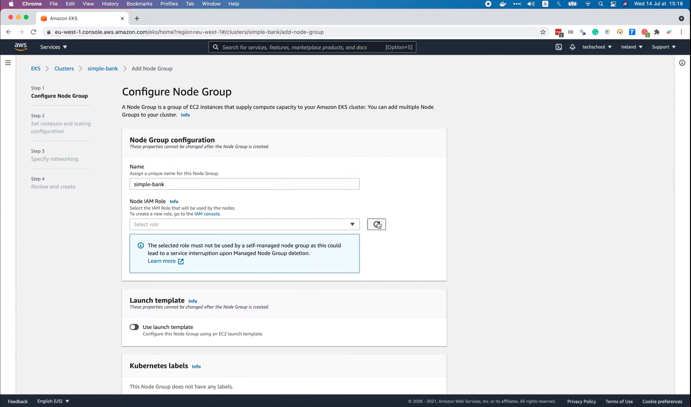

Существует несколько параметров для настройки `Launch template`, `Kubernetes 
labels`, `Kubernetes taints` и `Tags` для рабочих узлов, но нам не нужно 
их добавлять прямо сейчас. Мы всегда можем добавить их позже, когда узлы 
будут созданы и присоединены к EKS кластеру. Так что я просто перейду к 
следующему шагу.

На этом втором шаге мы выберем конфигурацию для узловой машины. Во-первых,
образ Amazon машины, тут существует три варианта, но я думаю, что обычно 
мы будем использовать `Amazon Linux 2`, если вы не хотите использовать 
`GPU Enabled` или использовать ARM инстанс. Далее следует `Capacity type`,
который может быть инстансом `On-Demand` или `Spot`. Инстанс `Spot` обычно 
дешевле `On-Demand`, но его работа может быть прервана в любой момент, 
поэтому я не думаю, что он достаточно стабилен для запуска API веб-сервиса
нашего простого банковского приложения. Выбрать инстанс `On-Demand` здесь
более безопасно. Далее мы можем выбрать тип инстанса с разным числом 
процессоров, количеством памяти и сетевых интерфейсов. По умолчанию выбран
инстанс `t3.medium`. Но мы можем выбрать другой тип инстанса, если 
захотим. Допустим, я сейчас выберу `t3.micro`. Что касается размера диска, 
думаю, нам понадобится не более 10 Гб.

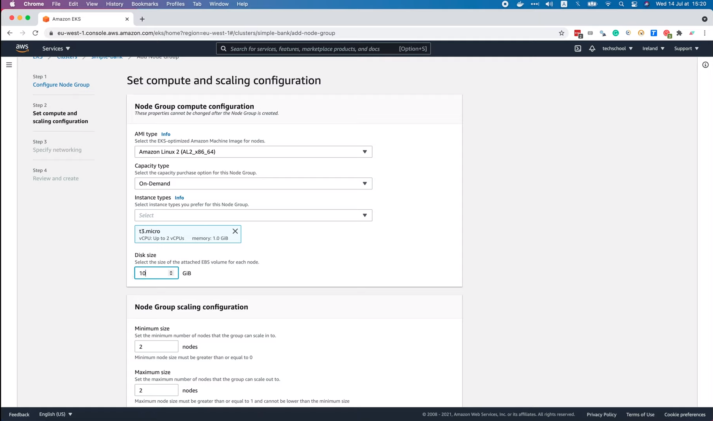

Далее существует три варианта конфигурации масштабирования группы. Во-первых, 
минимальный размер или минимальное количество узлов, до которых может 
масштабироваться группа. Я собираюсь установить это значение равным одному
узлу. Затем максимальное количество узлов, до которого эта группа может 
масштабироваться, скажем, 2 узла. И, наконец, желаемое количество узлов, с 
которым группа должна запускаться изначально. Для этого параметра значение
будет также равно одному узлу.

Далее мы можем изменить конфигурацию обновления группы узлов. Например, 
пусть во время обновления версии для группы узлов максимальное количество
недоступных узлов будет равно одному.

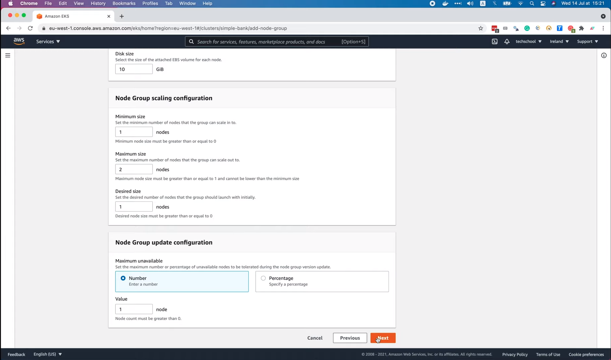

Хорошо, теперь давайте перейдем к следующему шагу: `Specify networking`.
Здесь мы можем выбрать подсети в VPC, где будут работать узлы. Подсети
выбираются по умолчанию, но вы также можете создать новые подмножества для 
группы узлов, если хотите. Также существует возможность разрешить удаленный 
доступ к узлам. Если вы включите её вам нужно создать пару ключей и 
использовать их для доступа к узлу через инструмент командной строки. Но
обычно этого не требуется, я думаю, что мы можем получить почти всю 
информацию об узлах, которые нам нужна через API сервер плоскости в AWS 
консоли. Поэтому я отключу удаленный доступ к узлам. И нажму `Next`.

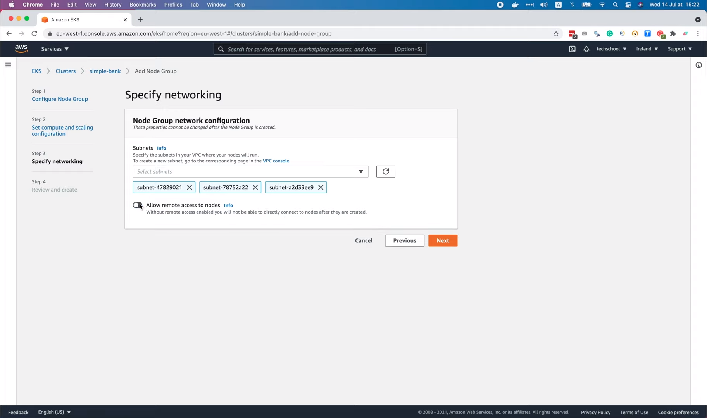

На последнем этапе нам просто нужно еще раз просмотреть все настройки, 
чтобы убедиться, что они верны, прежде чем нажать кнопку `Create`.

И, вуаля, сейчас будет создана группа узлов `simple-bank`. Создание займёт
несколько минут. На данный момент в этой группе еще нет узлов. Но если 
мы перейдём на страницу EKS кластера, то увидим, что данная группа узлов
уже добавлена в кластер.

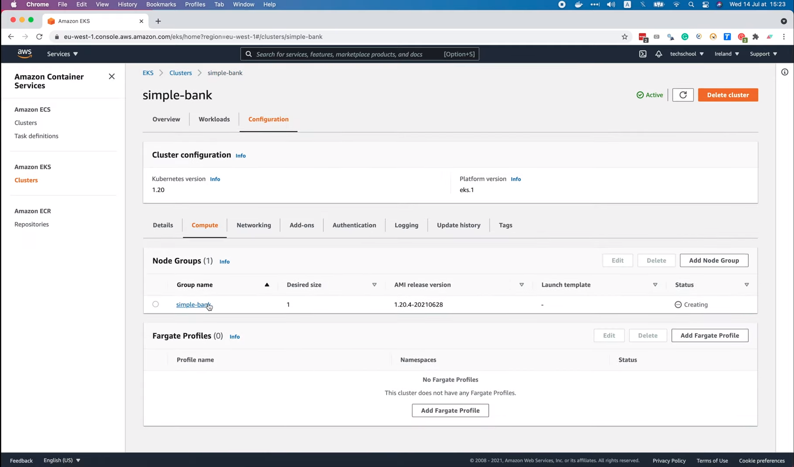

Хотя её статус по-прежнему `Creating`. Через какое-то время мы можем 
обновить страницу. И теперь её статус изменился на `Active`, что означает, 
что группа готова к запуску контейнеров. Если мы перейдем по этой ссылке на 
страницу группы узлов (смотри рисунок), то увидим её конфигурацию, например,
минимальный, максимальный и желаемый размер, а на вкладке `Nodes` сейчас уже
существует один узел в состоянии `Ready`. Это связано с тем, что мы настроили
желаемый размер равный одному узлу ранее. Так что всё работает как надо! 
Превосходно!

Прежде чем мы закончим, я хочу вам кое-что показать. А именно как мы можем
вручную масштабировать узлы вверх и вниз. Всё, что нам нужно сделать, это 
нажать эту кнопку `Edit`.

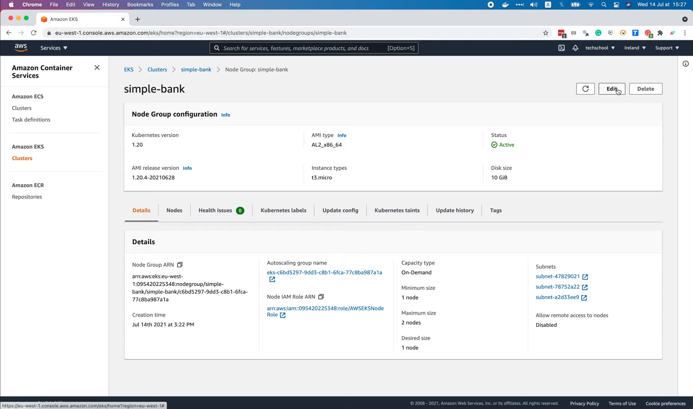

Затем измените желаемый размер, например, на два узла и нажмите `Save
changes`.

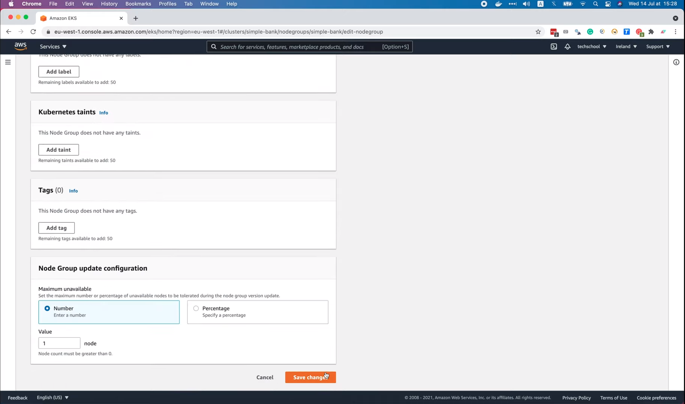

Это займёт некоторое время, но здесь как показано на рисунке видно историю 
обновлений и статус `In progress`.

Теперь пока мы ждём завершения процесса обновления, давайте перейдём по
этой ссылке на рисунке, чтобы получить доступ к автомасштабированию 
этой EKS группы узлов.

## Масштабирование вверх

Теперь, если вы откроете вкладку `Activity`, то увидите первое действие
под названием "Launching a new EC2 instance" («Запуск нового инстанса EC2»),
когда мы впервые создали группу узлов и установили желаемое количество в 
один узел. Затем после этого указано ещё одно действие "Launching a new 
EC2 instance" «Запуск нового инстанса EC2», потому что мы только что 
увеличили желаемое количество с одного до двух.

Действие выполнено успешно, поэтому теперь, если мы вернемся на страницу 
группы узлов, мы увидим два узла вместо одного, как раньше.

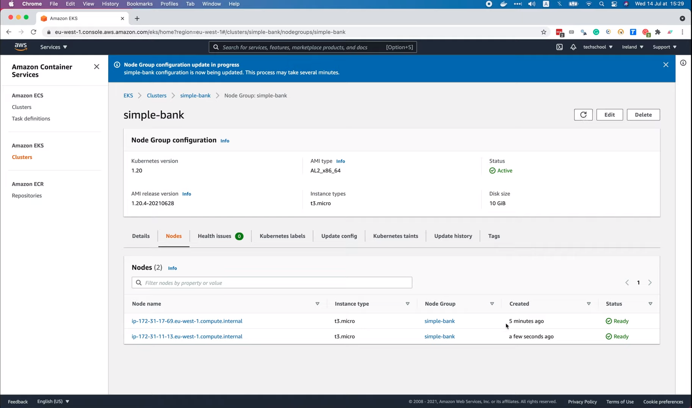

## Масштабирование вниз

Так что масштабирование вверх работает! Теперь давайте попробуем использовать
масштабирование вниз. Я собираюсь установить минимальное количество 
равным ноль узлов, затем желаемое количество на ноль узлов и `Save changes`.

Хорошо, давайте перейдем в автомасштабирование, чтобы посмотреть, что 
произойдет. Добавились две записи, сообщающие "Terminating EC2 instance"
(«Завершение работы инстанса EC2») и у них сейчас статус 
`MidTerminatingLifecycle` («В процессе завершения»).

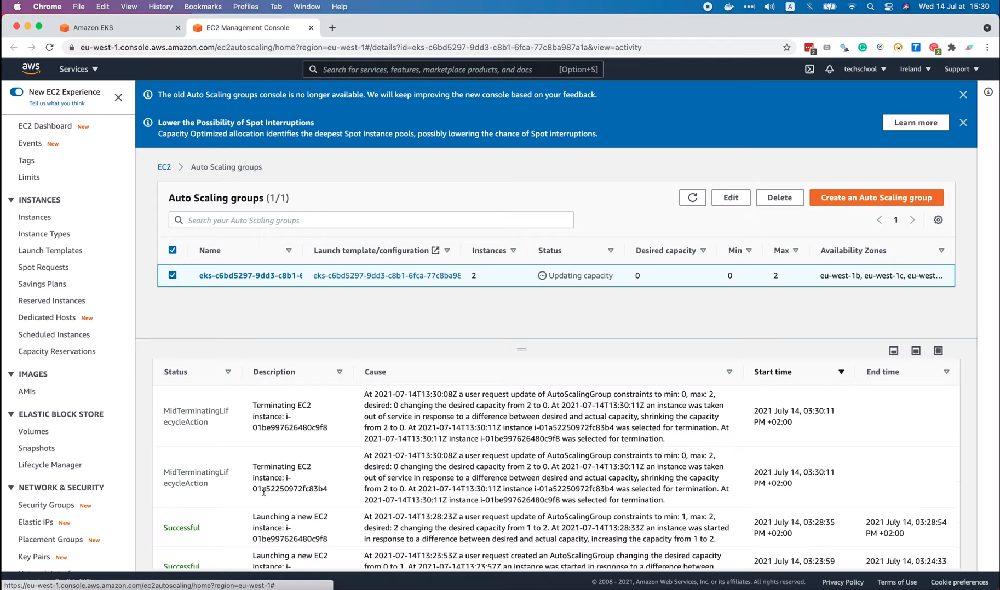

Это означает, что два инстанса завершают свою работу. Это связано с тем,
что мы изменили желаемое количество до ноля ранее. Через некоторое время, 
когда мы обновим страницу, действия будут успешно выполнены, то есть 
это означает, что работа обоих инстансов была завершена. 

И если мы вернёмся на страницу группы узлов, то увидим, что в этой группе
нет узлов.

Таким образом, функция масштабирования вниз также работает очень хорошо.
И это подводит нас к концу этой лекции.

Мы узнали, как настроить EKS кластер и добавить в него рабочие узлы. На 
следующей лекции я покажу вам как как получить к нему доступ с локального 
компьютера и развернуть на нем наше простое банковское приложение.

Большое спасибо за время, потраченное на чтение, и до скорой встречи!