# How to deploy a web app to Kubernetes cluster on AWS EKS

[Original video](https://www.youtube.com/watch?v=PH-Mcd0Rs1w)

Hello everyone, welcome to the backend master class.

In the previous lectures, we've learned how to create an EKS cluster
on AWS and connect to it using `kubectl` or `k9s`.

Today let's learn how to deploy our simple bank API service to
this Kubernetes cluster. So basically, we have built a docker image
for this service and push it to Amazon ECR, and now we want to run 
this image as a container in the Kubernetes cluster. In order to do
so, we will need to create a deployment.

Deployment is simply a description of how we want our image to be
deployed. You can read more about it on the official Kubernetes 
[documentation page](https://kubernetes.io/docs/concepts/workloads/controllers/deployment/).

And here's an example of a typical Kubernetes deployment.

```yaml
apiVersion: apps/v1
kind: Deployment
metadata:
  name: nginx-deployment
  labels:
    app: nginx
spec:
  replicas: 3
  selector:
    matchLabels:
      app: nginx
  template:
    metadata:
      labels:
        app: nginx
    spec:
      containers:
      - name: nginx
        image: nginx:1.14.2
        ports:
        - containerPort: 80
```

So let's copy its content, open our simple bank project. Then in
the `eks` folder, I'm gonna create a new file called 
`deployment.yaml` and paste in the content of the sample 
deployment.

On the first line is the version of the Kubernetes API we're using
to create this deployment object. Then on the second line, is the
kind of object we want to create, which is `Deployment` in this case.

```yaml
apiVersion: apps/v1
kind: Deployment
```

Next, there's a metadata section, where we can specify some metadata
for the object. For example, the name of the object, I'm gonna call
it `simple-bank-api-deployment`. And the labels are basically some
key-value pairs that are attached to the object, which are useful
for the users to easily organize and select subsets of objects.
Here I'm gonna add only 1 label for the `app`, which is called 
`simple-bank-api`.

```yaml
metadata:
  name: simple-bank-api-deployment
  labels:
    app: simple-bank-api
```

Now comes the main specification of the deployment object. First,
we can set the number of replicas, or the number of pods we want
to run with the same template. For now, let's run just 1 single pod.

```yaml
spec:
  replicas: 1
```

Next, we need to specify a pod selector for this deployment. It's
basically a rule that defined how the deployment can find which 
pods to manage. In this case, we're gonna use a `matchLabels` rule.
And I'm gonna use the same label app: `simple-bank-api` as we've 
used before.

```yaml
spec:
  selector:
    matchLabels:
      app: simple-bank-api
```

This means that all pods that have this label will be managed by
this deployment.

Therefore, in the next section, pod `template`, we must add the
same label to its metadata.

```yaml
spec:
  template:
    metadata:
      labels:
        app: simple-bank-api
```

Alright, now comes the spec of the pod. This is where we tell the
deployment how to deploy our containers. First, the name of the
container is gonna be `simple-bank-api`. Then the URL to pull the
image from. As our `simple-bank` images are stored in Amazon ECR,
let's open it in the browser to get the URL.

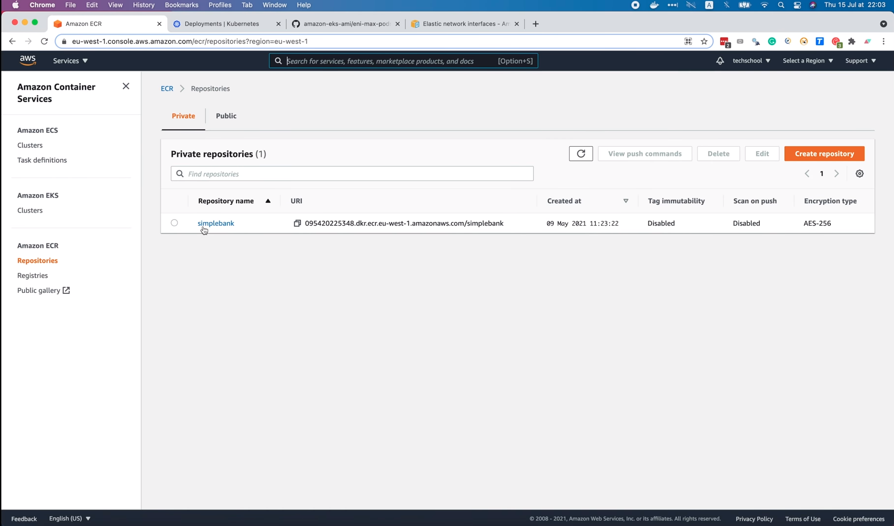

Here we can see, there are several images with different tags.


I'm gonna select the latest one, and copy its image URL by 
clicking on this button.


Then paste it to our `deployment.yaml` file.

```yaml
spec:
  containers:
    - name: simple-bank-api
      image: 095420225348.dkr.ecr.eu-west-1.amazonaws.com/simplebank:25d22b979a8876906cdbf57b16aa92d265ee46fb
```

Note that this long suffix of the URL is the tag of the image.
And it's basically the git commit hash as we've set up in one of
previous lectures. For now, we're setting this tag value manually,
but don't worry, in later lectures, I will show you how to change
it automatically with the Github Actions CI/CD.

Alright, now the last thing we're gonna do is to specify the 
container port. This is the port that the container will expose to
the network. Although it is totally optional, it's still a good
practice to specify this parameter because it will help you or
other people to understand better the deployment configuration.
OK, I think that should be it.

```yaml
    spec:
      containers:
        - name: simple-bank-api
          image: 095420225348.dkr.ecr.eu-west-1.amazonaws.com/simplebank:latest
          ports:
            - containerPort: 8080
```

The deployment file is completed. But before we apply it, let's 
use `k9s` to check out the current state of the EKS cluster that
we have set up on AWS in previous lectures. If we select the 
default namespace,

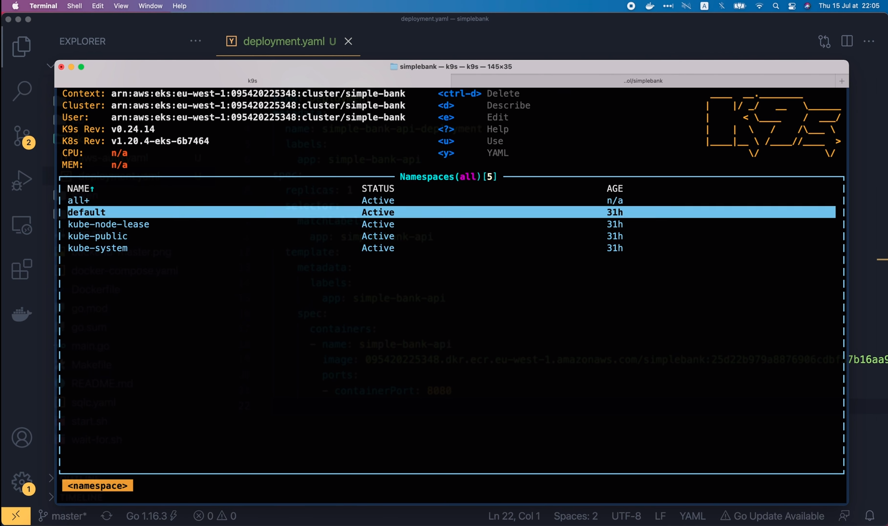

we can see that these are no running pods at the moment.

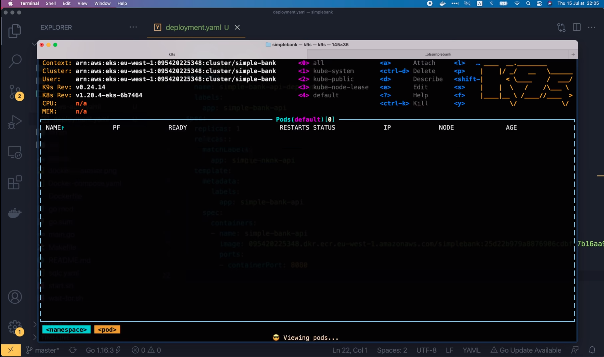

And the deployments list is also empty.


Now let's apply the deployment file that we've written before 
using the `kubectl apply` command. We use the `-f` option to 
specify the location of the object we want to apply, which, in
this case, is the `deployment.yaml` file inside the `eks` folder.

```shell
kubectl apply -f eks/deployment.yaml
deployment.apps/simple-bank-api-deployment created
```

OK, it's successful, and the `simple-bank-api` deployment has 
been created. Let's check it out in the `k9s` console.


Here it is, the deployment has shown up in the list, but somehow
it is not ready yet. To see more details, we can press `d` to 
describe this deployment object. OK, so the image URL is correct.

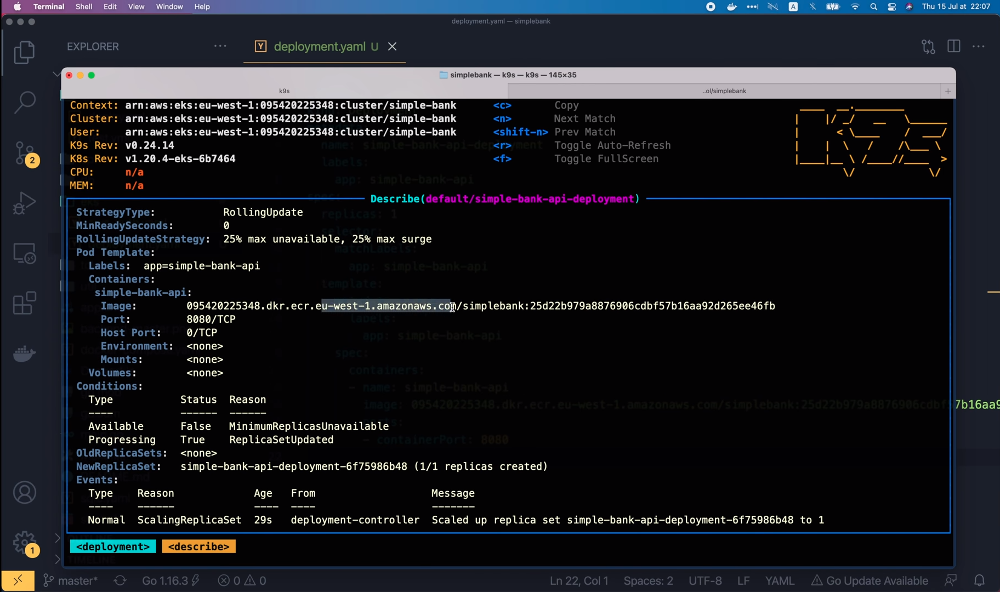

And in the events list, it says scaled up replica set 
`simple-bank-api-deployment` to 1. All looks pretty normal. But
why this deployment is not ready yet? Let's press `Enter` to open
the list of pods that this deployment manages.


OK, so looks like the pod is not ready yet. Its status is still
pending. Let's describe it to see more details. 


If we scroll down to the bottom to see the events list, we can 
see that there's a warning event: `FailedScheduling`. And that's
because there are no nodes available to schedule pods. Alright,
now we know the reason, let's go to the AWS console page, and 
open the EKS cluster `simple-bank` that we've set up in previous
lectures.

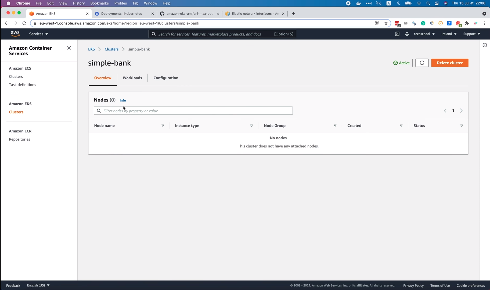

Voila, here it says "This cluster does not have any attached 
nodes". Let's open the configuration tab, and select `Compute`
section.

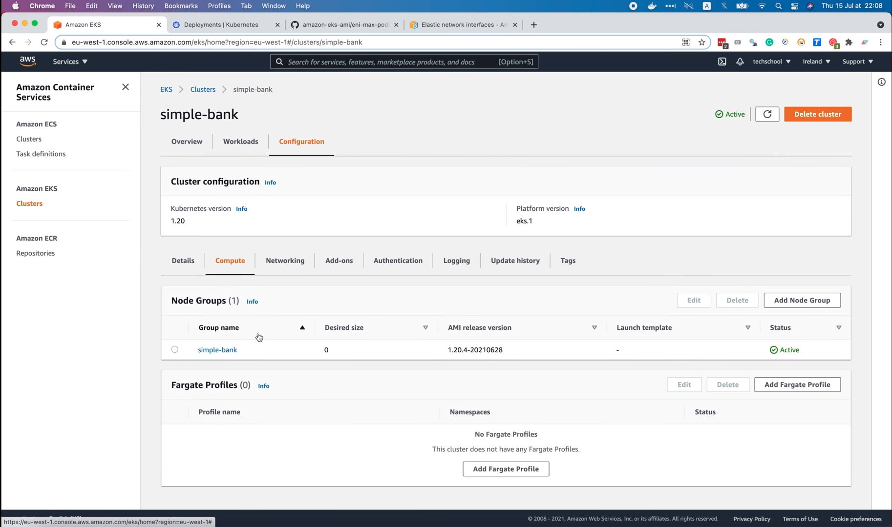

In the `Node Groups` table, we can see that the desired size is 
0, so that's why it didn't create any nodes (or EC2 instances).
To fix this, let's open the simple-bank node group.


Here we can see, 


its desired capacity is 0, and so is the minimum capacity. Let's
click this `Edit` button to change it. I'm gonna increase the 
desired capacity to 1. Note that this number must be within the
limit range of the minimum and maximum capacity. Ok, let's click
`Update`.

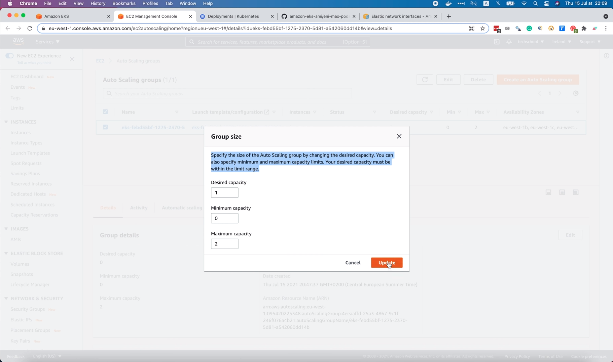

Now the desired capacity has been changed to 1. And in the 
`Activity` tab, if we refresh the activity history, we can see
a new entry saying launching a new EC2 instance.

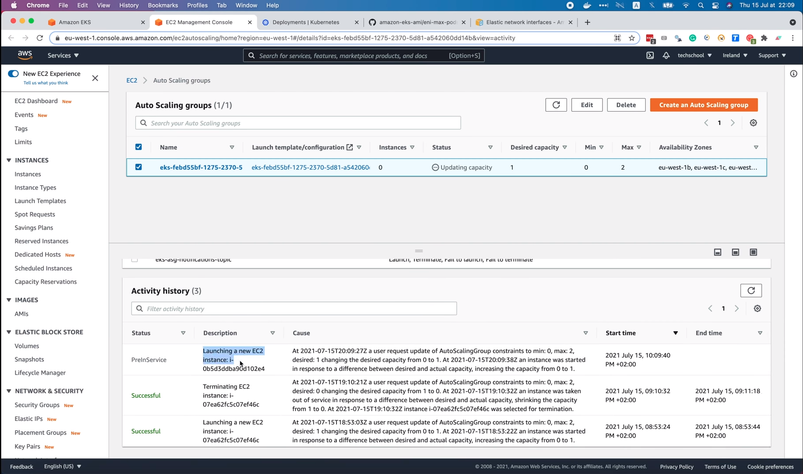

This might take a while to complete. So let's refresh the list.
Now its status has changed to `MidLifecycleAction`.


Let's wait a bit, and refresh again. This time, the status is
`Successful`. So now we have 1 instance available in the node
group.


Let's go back to the EKS cluster's node group page. Select the 
`Nodes` tab, and click this refresh button.

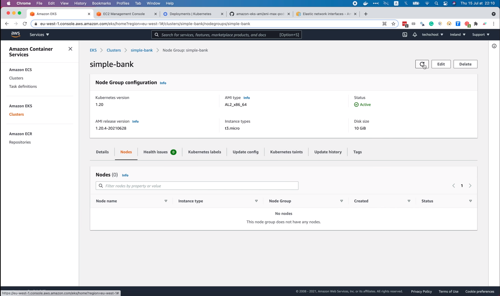

This time, there's 1 node in the group. But its status is still
not ready. We have to wait a bit for the EC2 instance to be set 
up.


Alright, now the node is ready.


Let's go back to the `k9s` console to see what happens to the 
pods. OK, it's still in pending state. Let's find out why! Now
at the bottom, there are 2 new events.


The first one says: "0/1 nodes are available, 1 node had taint: not
ready, that the pod didn't tolerate". And the second one says: 
"Too many pods". So this means that the cluster has recognized 
the new node, and the deployment tried to deploy a new pod to 
this node, but somehow the node already has too many pods running
on it. Let's dig deeper to find out why. I'm gonna open the list
of nodes.


This is the only node of the cluster. Let's describe it! If we 
scroll down a bit to the capacity section, we can see some 
hardware configurations of the node, such as the CPU or memory.


And at the bottom is the maximum number of pods can run on this
node, which is 4 in our case. There's also a section to tell you
the size of the resources that can be allocated to this node.

And if we scroll down a little bit more,

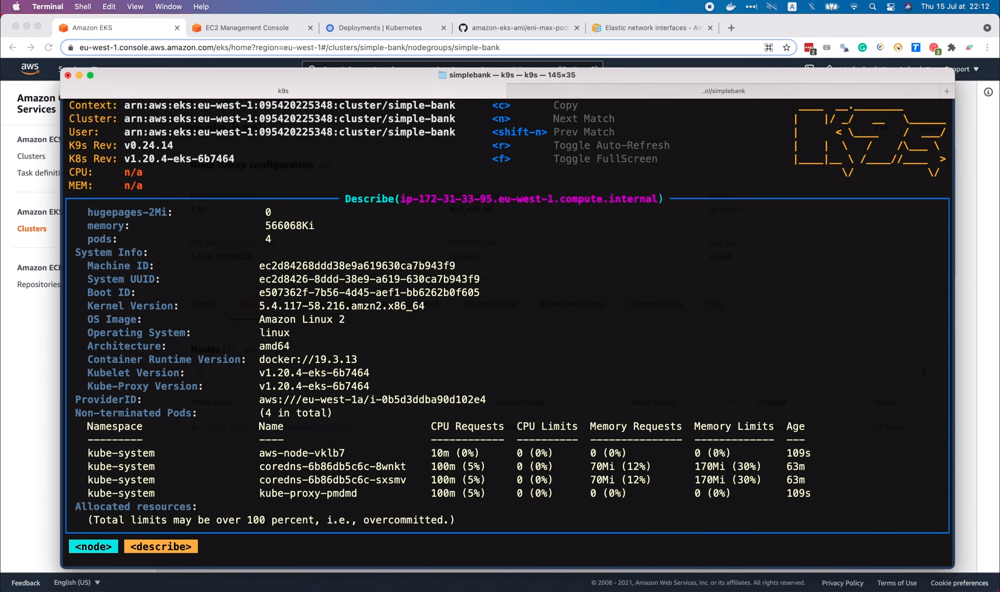

we can see the number of non-terminated pods. Currently, there 
are 4 running pods. And they are listed in this table. All 4 pods 
belong to the `kube-system` namespace. So these 4 Kubernetes 
system pods has already taken up all 4 available pods slots of
the node. That's why the deployment cannot create a new one for 
our container. In case you don't know, the maximum number of pods
can run on an EC2 instance depends on the number of Elastic
Network Interfaces (or ENI) and the number of IPs per ENI 
allowed on that instance. This [Github page](https://github.com/awslabs/amazon-eks-ami/blob/master/files/eni-max-pods.txt)
of Amazon gives us a formula to compute the maximum number of pods 
based on those numbers. It is: number of ENI multiplied by 
(number of IPs per ENI - 1) then plus 2.

There is also a documentation [page](https://docs.aws.amazon.com/AWSEC2/latest/UserGuide/using-eni.html#AvailableIpPerENI)
of Amazon that gives us the number of ENIs and Ips per ENI for each 
instance type. If you still remember, we're using a `t3.micro`
instance for our node group, so according to this table, it has
2 ENI and 2 IPs per ENI. No if we put these numbers into the
formula, we will get `2 * (2 - 1) + 2 = 4`, which is the maximum
number of pods that can run on this type of instance. If you're
lazy to do the math, you can just serach for `t3.micro` on this
[page](https://github.com/awslabs/amazon-eks-ami/blob/master/files/eni-max-pods.txt).
Then here you are, 4 is the maximum number of pods.

OK, so in order to run at least 1 more pod on the node, we will
need a bigger instance type. `t3.nano` is also not enough resource
to run more than 4 pods, but a `t3.small` instance can run up to
11 pods, so it should be more than enough for our app.

Alright, now we need to go back to the Amazon EKS cluster node
group page. As you can see here, the current instance type of this
node group is `t3.micro`.


Let's try to change it to `t3.small`. In this edit node group
page, we can change several things, such as the scaling, the labels, 
taints, tags, or update configuration.


But there's no option to change the instance type of the node
group.

So I guess we're gonna need to delete this node group and create
a new one. Let's do that! To delete this node group, we have to
enter its name here to confirm. Then click this `Delete` button.


OK, now if we go back to the cluster page, we can see the status
of the node group has changed to `Deleting`.


After a few minutes, we can refresh the page. Now the old group 
has gone.


Let's click `Add Node Group` button to create a new one. I'm gonna
use the same name: `simple-bank` for this node group. Select the
`AWSEKSNodeRole` that we've created in the previous lectures.

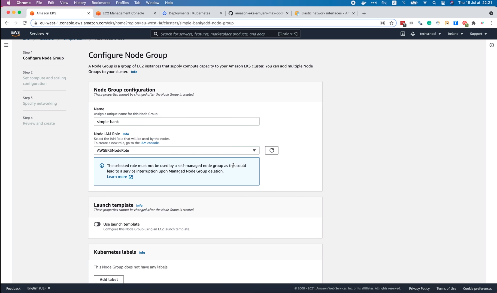

Then scroll all the way down, and click `Next`.


For the node group configuration, we will use the default values:
Amazon Linux 2 for the image type, and `On-demand` for the 
capacity type. But for the instance type, we will choose 
`t3.small` instead of `t3.micro` as before. Here we can see the
max ENI is 3, and max IP is 12.


So looks like the maximum number of pods is equal to this max 
number of IPs minus 1. OK, next, for the disk size, let's set it
to 10 GiB.


Then for the node group scaling, I'm gonna set the minimum size 
to 0, and the desired size to 1 node.

Then let's move to the next step.


Here the default subnets are already selected, so I'm gonna use
them. No need to change anything.


In the last step, we can review all the configurations of the 
node group. And if they all look good, we can go ahead to create 
the group.


OK, so the group is now being created. This might take a while
to complete. So while waiting for it, let's go back to the `k9s`
console and delete the existing deployment.

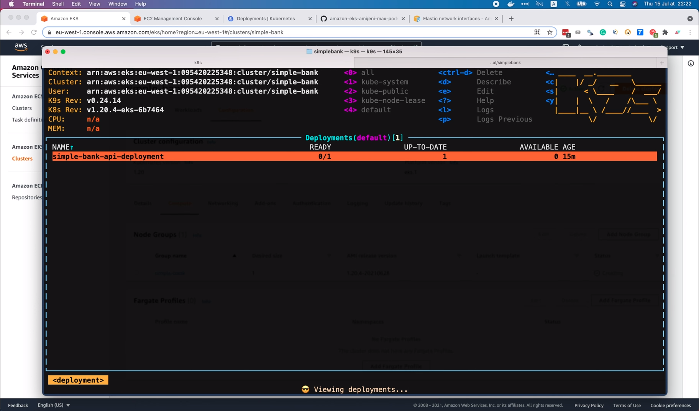

To do that, we simply press `Ctrl + d`. Then select OK, `Enter` 
and that's it, the deployment is deleted. And its managed pod is
deleted as well.

Alright, so now the cluster is back to a clean state, ready for
a new deployment. Now, let's refresh the page to see if the node
group is ready or not. OK, its status is now `Active`, so it 
should be ready.

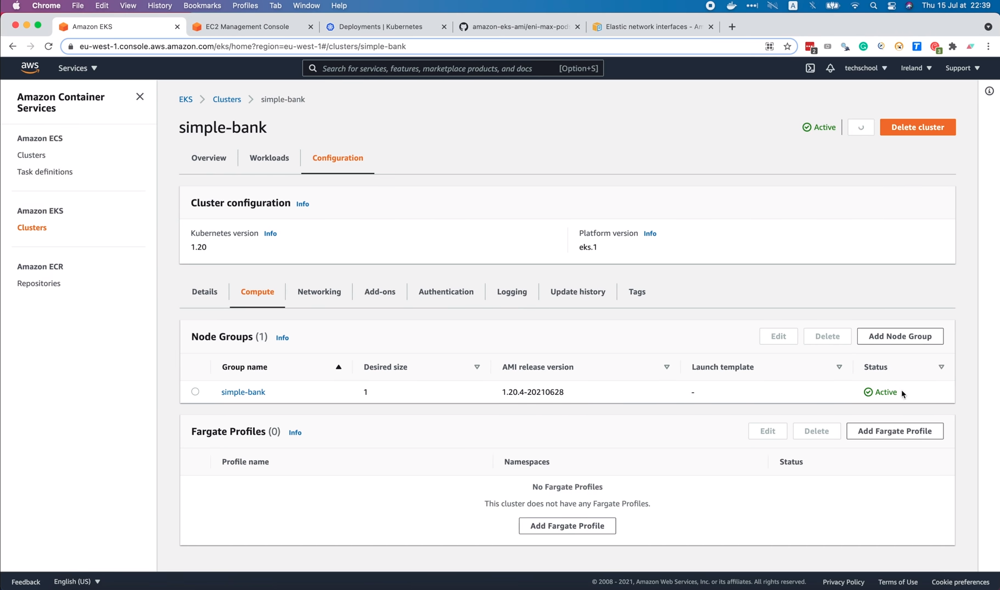

Let's open the terminal, and run the `kubectl apply` command to
deploy our app.

```shell
kubectl apply -f eks/deployment.yaml
deployment.apps/simple-bank-api-deployment created
```

The deployment is created. Let's check it out in the `k9s` 
console.


Yay, I think it works, because this time the color has just 
changed from red to green, and it says READY 1/1 here.

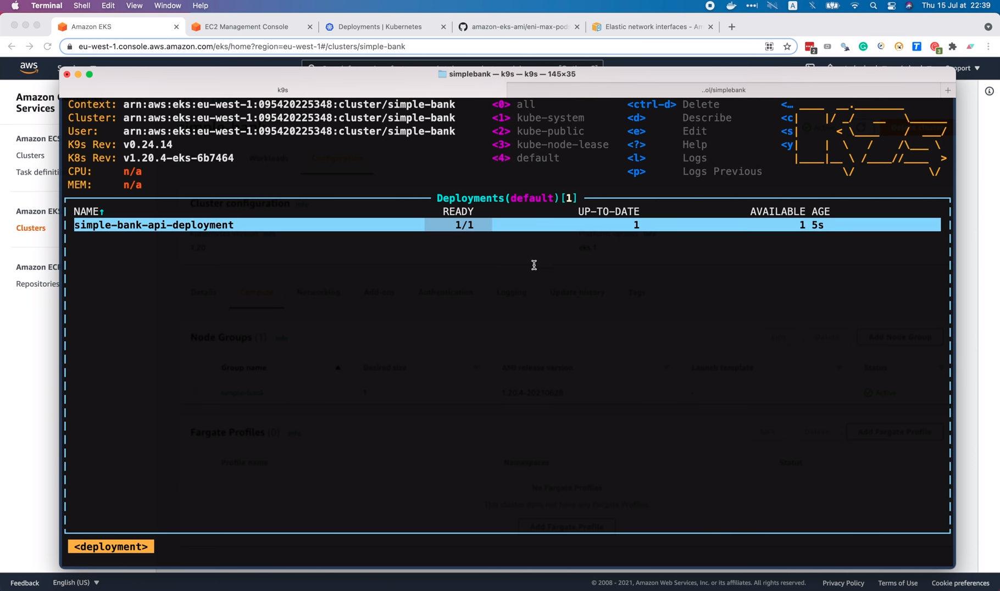

Let's describe it to see more details. OK, everything looks 
good. The number of replicas is 1.


Let's check out the pods.

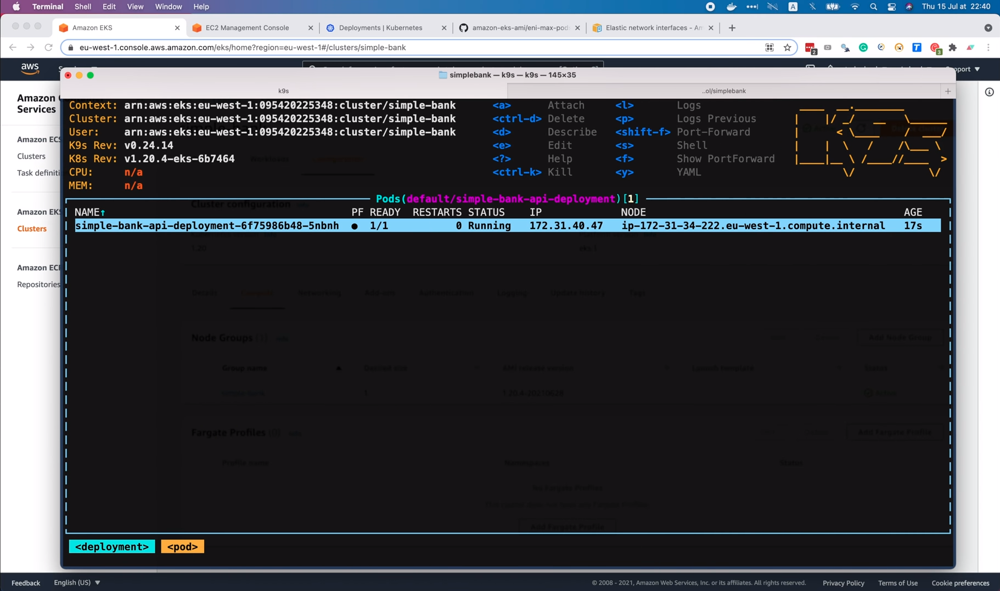

There's 1 pod, and its status is Running. Perfect!

Let's describe this pod. Scroll all the way to the bottom.
We can see several normal events. And they're all successful.
The container has been created and started with no errors.


Now if we go back to the pods list, and press `Enter`, it will 
bring us to the list if containers.


So, there's only 1 single container running in the pod. If we 
want to see the logs of this container, we can simply press L, as
it's clearly written here.

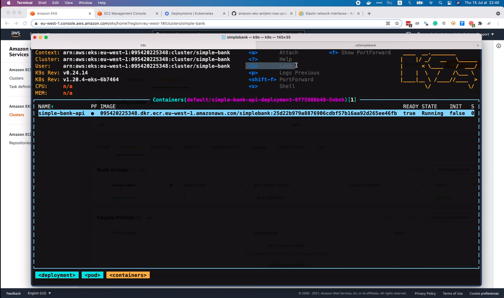

OK, here are the logs.


It first ran the db migration, then the app was successfully 
started. The server is now listening and serving HTTP requests
on port `8080`. That's great!

But the next question is: how can we send requests to this API?
If we go back to the pod list, we can see the IP address of the
pod.

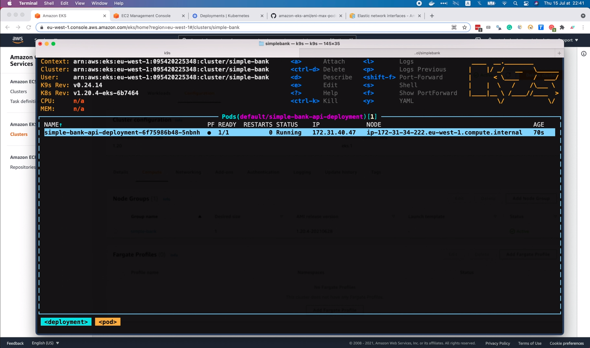

However, it's just an internal IP, and cannot be accessed from
outside of the cluster. In order to route traffic from the 
outside world to the pod, we need to deploy another Kubernetes
object, which is a `Service`. You can read more about it on the
official Kubernetes documentation [page](https://kubernetes.io/docs/concepts/services-networking/service/).
Basically, a service is an abstraction object that defines a set
of rules to route network traffics to the correct application 
running on a set of pods. Load balancing between them will be
handled automatically, since all the pods of the same deployment
will share a single internal DNS. OK, here's an example of how
we can define a service.

```yaml
apiVersion: v1
kind: Service
metadata:
  name: my-service
spec:
  selector:
    app: MyApp
  ports:
    - protocol: TCP
      port: 80
      targetPort: 9376
```

I'm gonna copy it. Then go back to the code. Let's create a 
new file: `service.yaml` inside the `eks` folder. Then paste
in the content of the example service.

It also starts with the api version, just like Deployment 
object. But now, the kind of this object is Service.

```yaml
apiVersion: v1
kind: Service
```

We also have a metadata section to store some information 
about this service. Here I'm just gonna specify the name,
which is `simple-bank-api-service`.

```yaml
metadata:
  name: simple-bank-api-service
```

Next, the specification of the service. First, we must 
define a pod selector rule, so that the service can find
the set of pods to route the traffic to. We're gonna use
a label selector, so I'm gonna copy the app label from
the pod template in `deployment.yaml` file and paste it to
the `service.yaml` file here under the `selector` section.

```yaml
spec:
  selector:
    app: simple-bank-api
```

OK, next we have to specify the rule for ports. This service will listen
to HTTP API requests, so the protocol is `TCP`, then, `80` is the port, on 
which the service will listen to incoming requests. And finally, the target 
port is the port of the container, where the requests will be sent to. In 
our case, the container port is `8080`, as we've specified in the `deployment`
file. So I'm gonna change this target port value to 8080 in `service` file.

```yaml
spec:
  selector:
    app: simple-bank-api
  ports:
    - protocol: TCP
      port: 80
      targetPort: 8080
```

And that's it! The `service.yaml` file is done. Now let's open the terminal
and run `kubectl apply -f eks/service.yaml` to deploy it.

```shell
kubectl apply -f eks/service.yaml
service/simple-bank-api-service created
```

Let's check it out in the `k9s` console. I'm gonna search for services.

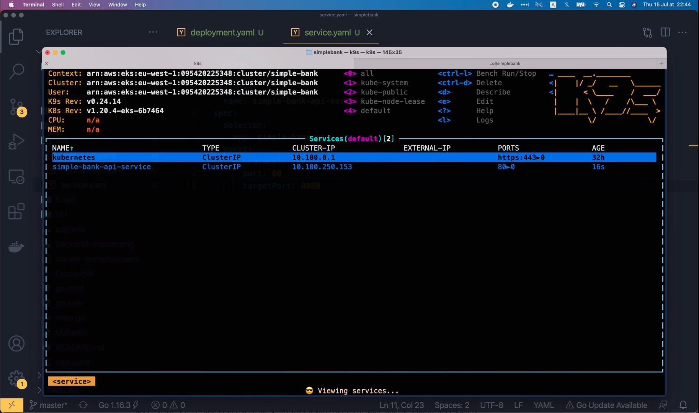

Here we go. In the list of services, beside the system service of Kubernetes
we can see our `simple-bank-api-service`. Its type is `ClusterIP`, and here's
its internal cluster IP. And it's listening on port 80 as we've specified in
the yaml file. But look at the `EXTERNAL-IP` column! It's empty! Which 
means this service doesn't have an external IP. So how can we access it from
outside? Well, in order to expose the service to the outside world, we need
to change its type. By default, if we don't specify anything, the service's
type will be `ClusterIP`. Now, let's change its type to `LoadBalancer` 
instead.

```yaml
spec:
  selector:
    app: simple-bank-api
  ports:
    - protocol: TCP
      port: 80
      targetPort: 8080
  type: LoadBalancer
```

Then save the file, and go back to the terminal to apply it again.

```shell
kubectl apply -f eks/service.yaml
service/simple-bank-api-service configured
```

OK, the service is configured. This time, in the `k9s` console, we can
see that its type has changed to `LoadBalancer`, and there's an external
IP, or a domain name has been assigned to the service.

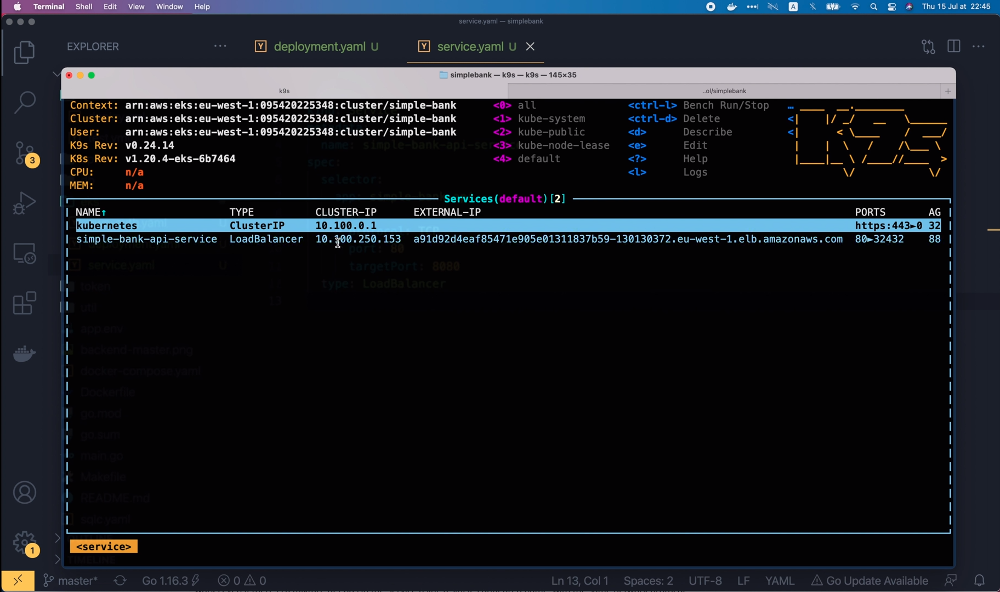

Awesome! But to make sure that it's working well, let's try `nslookup`
this domain.

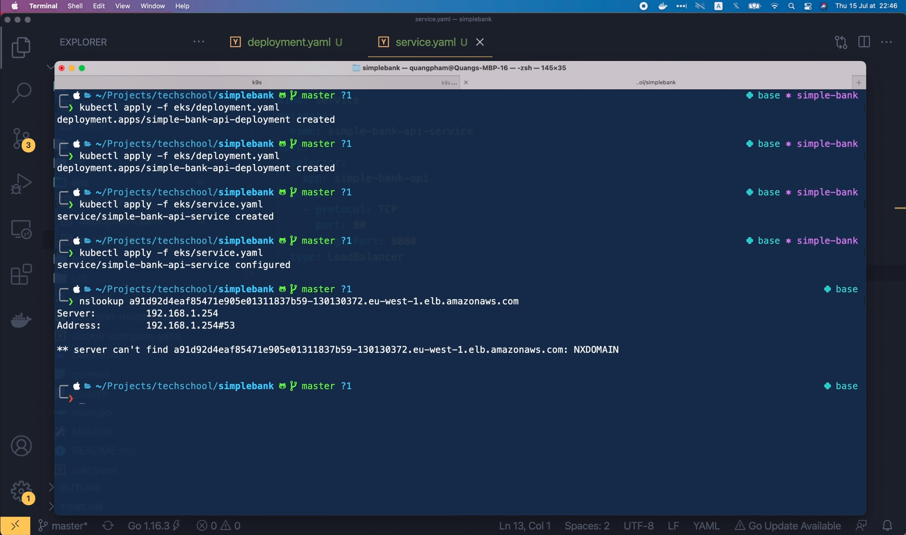

Oops, we've got an error: "server can't find this domain name".

Maybe it will take a bit of time for the domain to be ready. Now
let's try `nslookup` again.


This time, it's successful. You can see that there are 2 IP addresses
associated with this domain. That's because it's a network load balancer
of AWS.

OK, now let's try sending some requests to the server!

I'm gonna open Postman, and try the login user API. We must replace the
URL `localhost:8080` with the production domain name of the service. 
And if I remember correctly, we've already created user `Alice` in the
production DB in one of the previous lectures. I'm gonna check it 
quickly with TablePlus.

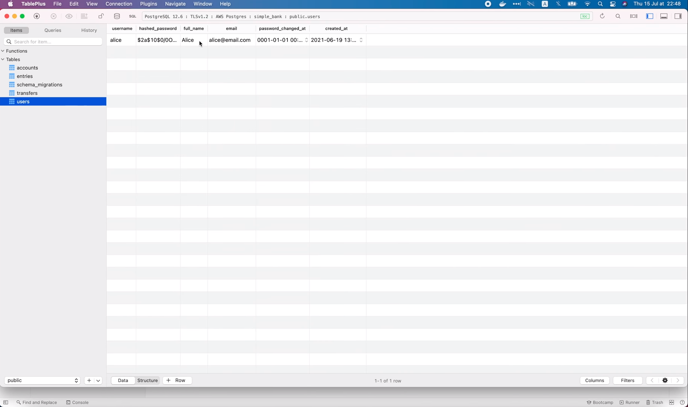

Yes, that's right! User `Alice` already existed. So let's go back to
Postman and send the request.


Yee! It's successful. We've got an access token together with all user
information. So it worked! Now let's see the logs of the container.


Here we go: a POST request to `/users/login`. Alright, now if we go back
to the service and describe it.


We can see that it's sending the request to only 1 single endpoint. That's
because right now we only have only 1 single replica of the app. Let's see
what will happen if we change the number of replicas to 2 in the 
`deployment.yaml` file. Save it, and run `kubectl apply` in the terminal to
redeploy to the cluster.

```shell
kubectl apply -f eks/deployment.yaml
deployment.apps/simple-bank-api-deployment configured
```

OK, now, let's go to the deployment list. This time, we can see READY 2/2,
which means there are 2 replicas, or 2 pods up and running.

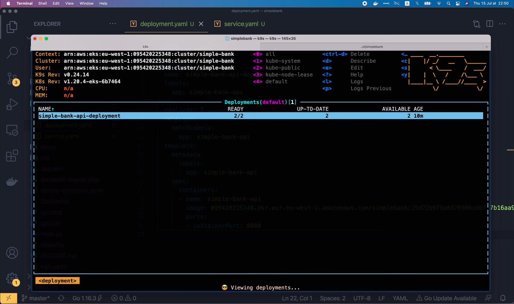

Here they are!


Now let's take a look at the service. If we describe the `simple-bank` API
service,


we can see that it is now forwarding requests to 2 different endpoints, and
those endpoints are actually the address of the 2 pods where our application
is running on.

Alright, let's go back to Postman and send the request again to make sure
it still works.

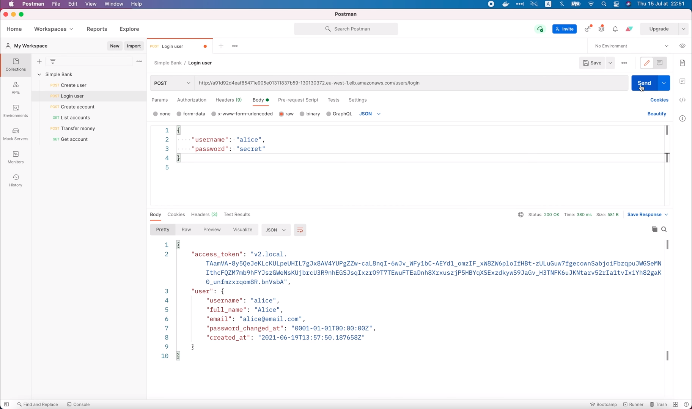

Cool! The request is successful. Even when I send it multiple times. So
the service is handling well the load balancing of the request when there
are multiple pods.

Now before we finish, let's check out the resources of the node. I'm
gonna describe this node, and scroll down to the capacity section.

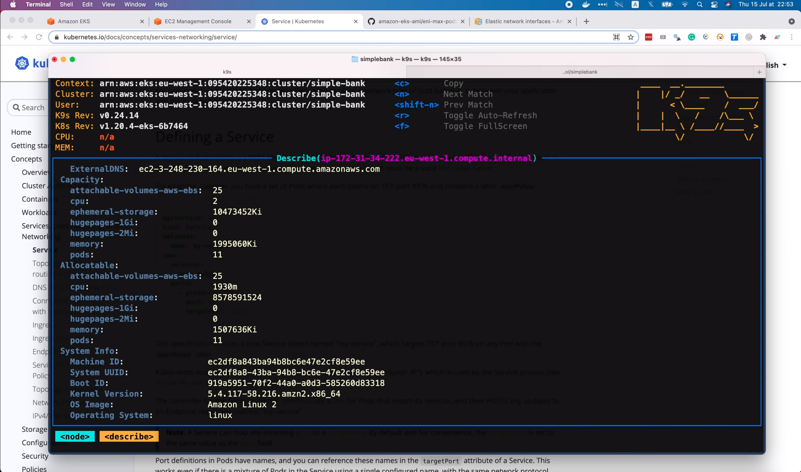

Here we can see that the maximum number of pods that can run on this node
is 11, exactly as we calculated for a `t3.small` instance. And if we 
scroll down a little bit more, we can see that at the moment, there are
6 pods running on this node.

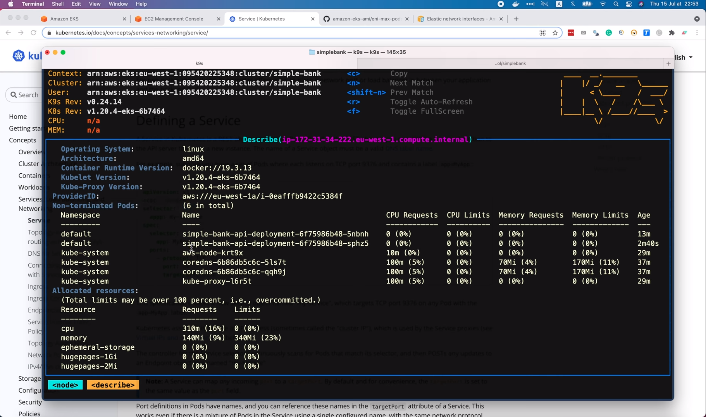

4 of them are the system pods of Kubernetes. And the other 2 are our
`simple-bank` API deployment pods.

OK, so that's all I wanted to share with you in today's lecture. We
have learned how to deploy a web service application to the 
Kubernetes cluster on AWS. And we were able to send requests to the
service from outside of the cluster via the external IP, or an 
auto-generated domain name of the service. But of course, we don't
want to use that kind of domain. For integrating with the frontend
for external services, right? What we would like to achieve is to 
be able to attach the service to a specific domain name that we have
bought, such as simplebank.com or something like that, right?

That will be the topic of the next video. I hope you enjoy this 
video. Thanks a lot for watching! Happy learning, and see you
in the next lecture!