# Регистрируем домен и настраиваем A-запись с помощью Route 53

[Оригинал](https://www.youtube.com/watch?v=-JF2ukmW3i8)

Привет, ребята, рад вас снова видеть!

На [последней лекции](part32-rus.md) мы успешно развернули API нашего 
простого банковского приложения в Kubernetes кластере на AWS. Однако для 
отправки запросов на это API нам придется использовать внешний IP адрес 
сервиса. Это доменное имя, автоматически сгенерированное балансировщиком 
нагрузки AWS, очень длинное, трудно запоминающееся и не статичное.


Поэтому обычно нмы не хотим использовать его непосредственно для работы с
фронтендом или другими внешними сервисами. Вместо этого мы должны назначить 
API какое-то легко запоминающееся доменное имя.

## Покупаем и регистрируем домен

А для этого мы должны сначала купить доменное имя. И как это сделать я покажу
вам на этой лекции. Существуют различные веб-сайты, на которых вы можете 
купить доменные имена, но, поскольку мы используем AWS для продакшена, я 
буду использовать для этой цели один из его сервисов под названием Route 53.
Непосредственно на главной панели Route 53 есть раздел для регистрации 
домена.


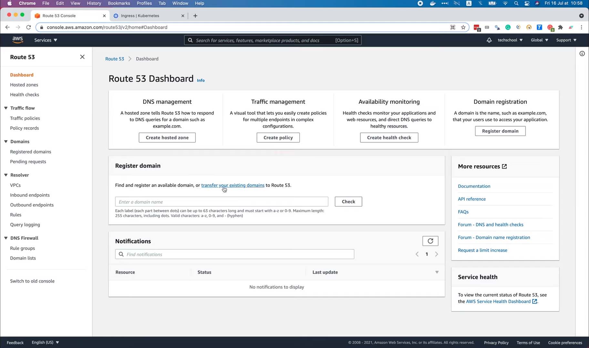

Здесь вы можете либо найти и зарегистрировать новый домен, либо перенести 
существующий, купленный на другом сайте, на Route 53.

В нашем случае мы хотим зарегистрировать новое доменное имя, поэтому давайте 
введем желаемое доменное имя в это поле, например, `simple-bank`.


И нажмите `Check` («Проверить»). Итак, похоже, что домен `simple-bank.com`
недоступен.

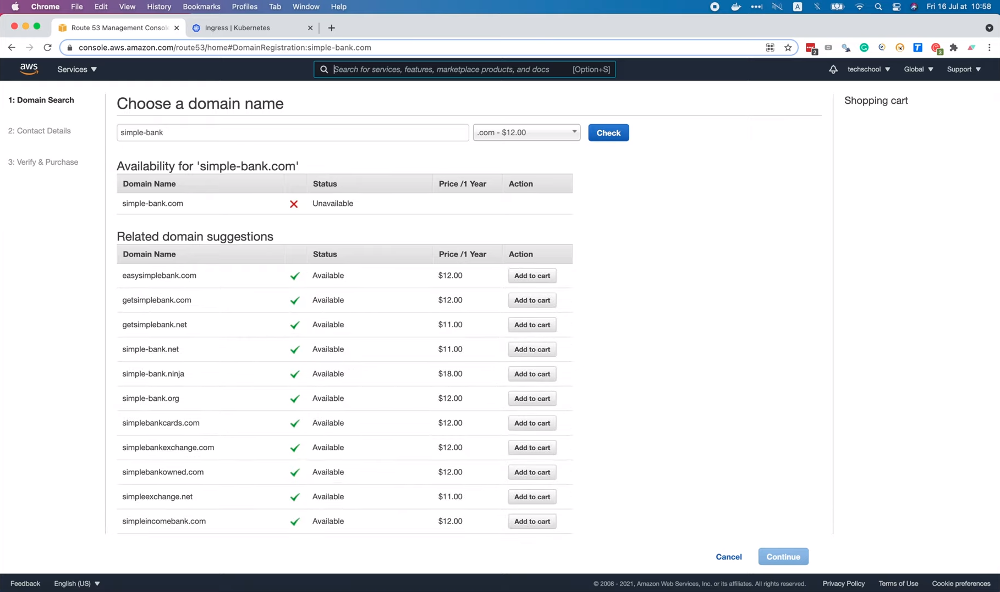

Но существует множество других доступных, таких как `simple-bank.net` или
`simple-bank.org`. Мне нравится доменное имя `simple-bank.org` и его 
стоимость всего 12 долларов в год, то есть не очень дорого. Так что я 
собираюсь добавить этот домен в корзину. Теперь у нас есть возможность 
зарегистрировать этот домен на 1 год и более. Если выбрать 5 лет, то придется
заплатить 60 долларов.

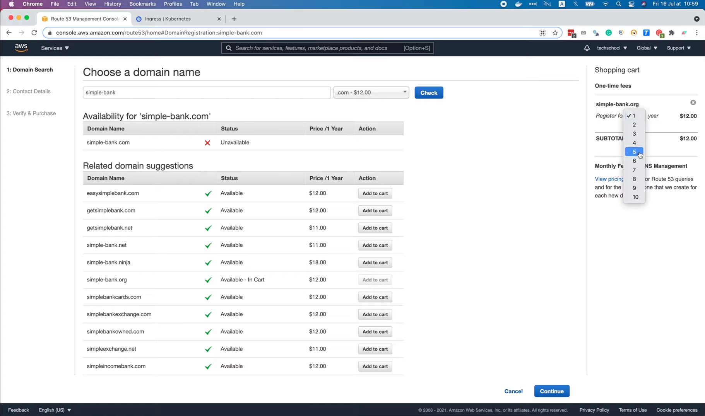

Давайте пока выберем 1 год. Обратите внимание, что помимо платы за 
регистрацию домена с нас также будет взиматься ежемесячная плата за 
управление DNS, более подробную информацию о которой вы можете прочитать на 
этой [странице](https://aws.amazon.com/route53/pricing/). Плата сравнительно 
небольшая. Например, всего 0,5 доллара США за каждую зону хостинга в месяц 
для первых 25 зон и 0,1 доллара США за каждую дополнительную зону хостинга 
в месяц. Также берётся плата за запросы, например, 0,4 доллара США за каждый 
миллион стандартных запросов для первого миллиарда запросов в месяц и 0,2 
доллара США за каждый миллион стандартных запросов свыше одного миллиарда 
запросов в месяц. Стоимость будет немного выше для запросов, учитывающих 
задержку (Latency Based Routing Queries), или DNS запросов с учетом 
географического расположения и географической близости (Geo DNS and 
Geoproximity Queries). Обо всём этом можно прочитать на [этой 
странице](https://aws.amazon.com/route53/pricing/#Queries), если хотите.

Теперь вернемся в консоль AWS, чтобы продолжить нашу покупку.


На втором этапе мы должны предоставить контактную информацию владельца 
регистрации. Во-первых, тип контакта, которым может быть частное лицо, 
компания, ассоциация или государственный орган. В моем случае это частное 
лицо. Поэтому в следующих двух полях я заполню свое имя и фамилию. Затем мой
адрес электронной почты и номер телефона. Мне также нужно указать свой адрес 
в этом поле `Address 1`. Затем страну, город и, наконец, почтовый индекс.
В самом низу находится переключатель защиты конфиденциальности. Если он 
включен, некоторые ваши контактные данные будут скрыты. Итак, давайте
продолжим!

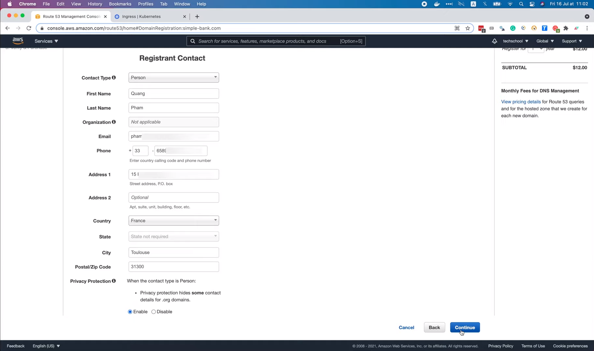

Здесь на этом рисунке Amazon просто сообщает нам, что они отправили
электронное письмо со ссылкой для подтверждения.

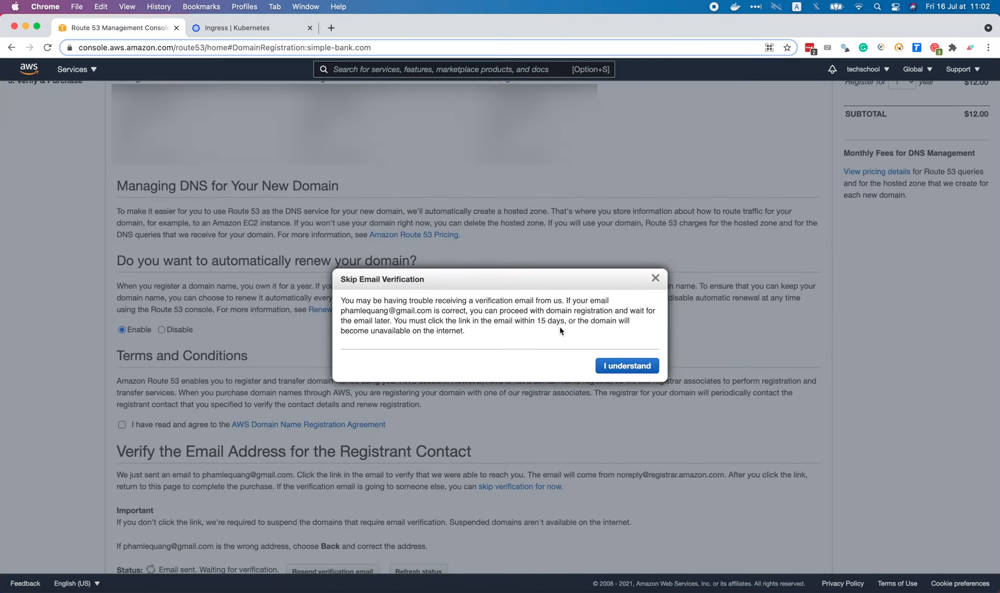

И мы должны перейти по ссылке в электронном письме в течение 15 дней. Итак, 
после того как письмо получено, давайте откроем его!


По сути, чтобы зарегистрировать домен, нам нужно убедиться, что адрес 
электронной почты того, кто регистрирует, действителен. Все, что нам нужно 
сделать, это нажать на эту ссылку.


И вуаля, электронная почта успешно подтверждена.


Amazon также отправила еще одно электронное письмо, чтобы сообщить нам об 
этом.

Хорошо, теперь давайте рассмотрим раздел управления DNS вашего нового 
домена. Обычно, когда вы регистрируете новый домен, AWS автоматически 
создает для вас зону хостинга. Там вы храните информацию о том, как 
направлять трафик в ваш домен. Например, вы можете использовать его для 
маршрутизации трафика в сервис вашего EKS кластера. И AWS будет взимать 
плату за зону хостинга, а также за DNS-запросы, о которых мы говорили ранее.

Далее у нас есть возможность включить или отключить автоматическое продление 
нашего домена. По умолчанию оно включено. Таким образом, срок действия нашего 
домена не истечет через 1 год.

Затем находится раздел, где вы можете прочитать об условиях использования,
мы должны поставить галочку в этом поле, чтобы согласиться с соглашением о 
регистрации доменного имени. Последний шаг — проверка электронной почты, но 
мы это уже сделали, поэтому давайте нажмём эту кнопку `Complete Order`, 
чтобы оформить заказ.

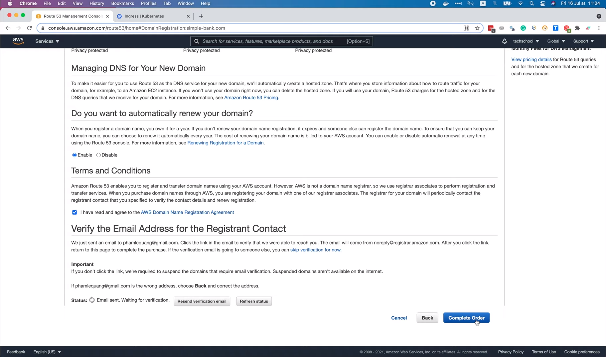

Итак, в этом всплывающем окне говорится, что AWS кредитами нельзя 
воспользоваться для регистрации доменов и что для этой операции будет 
использоваться наш зарегистрированный способ оплаты. Ставим галочку, чтобы 
согласиться, и оформить заказ

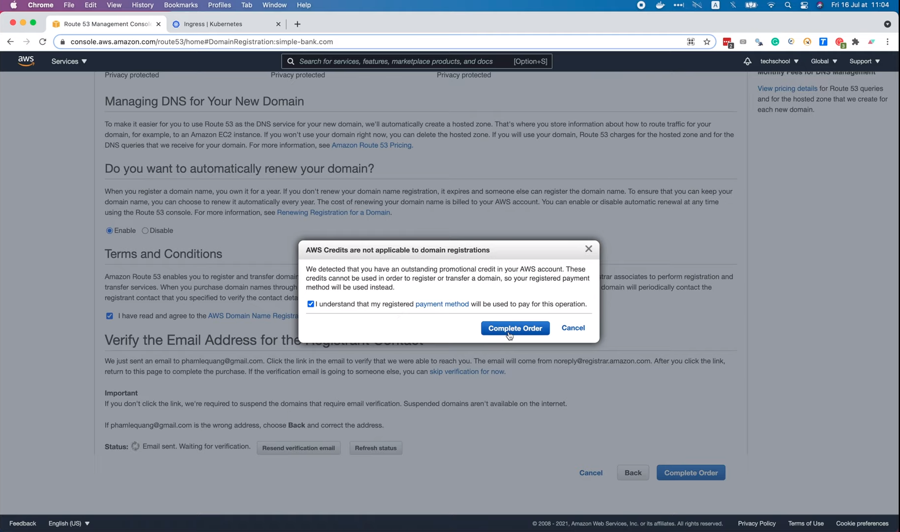

И вуаля, наш заказ успешно отправлен. Создание домена может занять некоторое
время, поэтому, если мы сейчас перейдем на страницу доменов, мы увидим его 
статус "Domain registration in process" («Регистрация домена выполняется в
настоящий момент»)

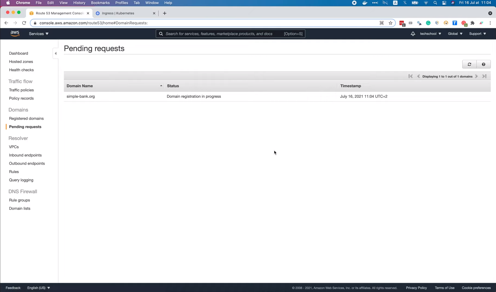

Как только домен будет успешно зарегистрирован, мы получим электронное 
письмо от Amazon.

Теперь давайте обновим страницу запросов в режиме ожидания. Список стал 
пустым, потому что наш запрос на регистрацию домена выполнен.

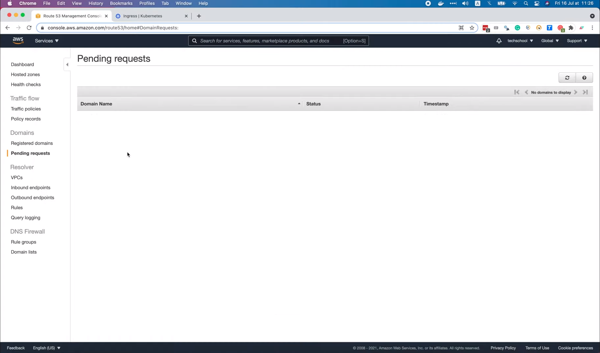

Таким образом, наш домен теперь будет в списке на странице зарегистрированных
доменов. Здесь на рисунке мы видим доменное имя вместе с датой истечения 
срока его действия. Функция автоматического продления включена, а блокировка 
передачи - нет.


Я нажму на название этого домена, чтобы получить подробную информацию о нём.
Вуаля, на этой странице гораздо больше данных о нашем домене.


И у нас есть возможность включить блокировку переноса. При этом этот домен 
будет заблокирован при попытке несанкционированной передачи другому
регистратору. Поскольку я не хочу, чтобы этот домен был передан какому-либо 
другому регистратору, кроме Amazon, я включу эту блокировку сейчас, нажав 
на ссылку, показанную на рисунке.


Вот и всё! Процесс займет несколько минут. Когда блокировка будет включена, мы 
получим еще одно электронное письмо от AWS. И на странице зарегистрированных
доменов мы увидим, что блокировка передачи теперь включена.


Хорошо, теперь давайте узнаем, как настроить доменное имя для маршрутизации 
трафика в ваш Kubernetes кластер. Для этого нам нужно открыть страницу
"Hosted zones" («Зоны хостинга»).

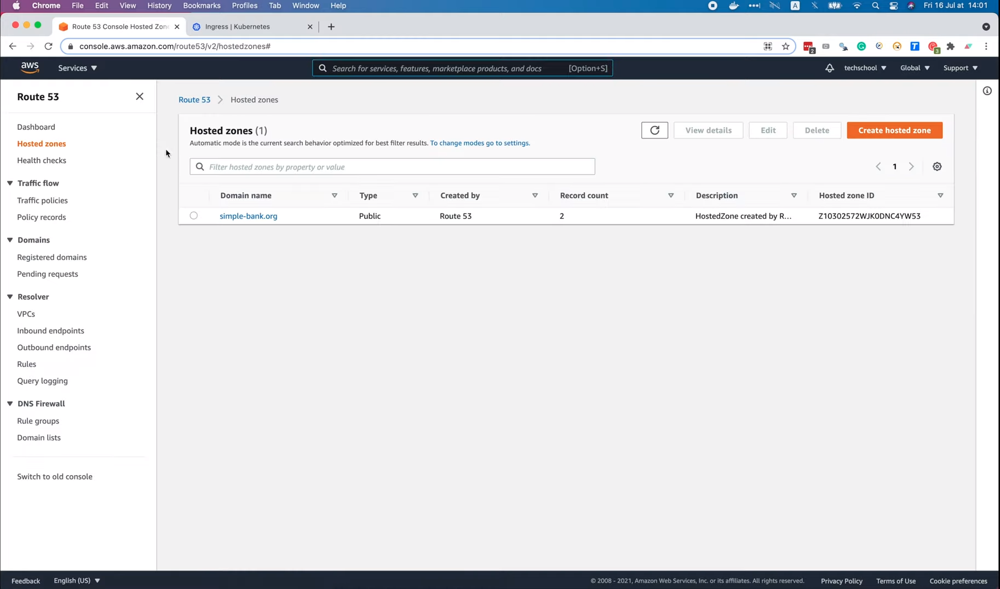

Затем выберите доменное имя `simple-bank.org`. Здесь на рисунке мы видим 
список DNS записей.

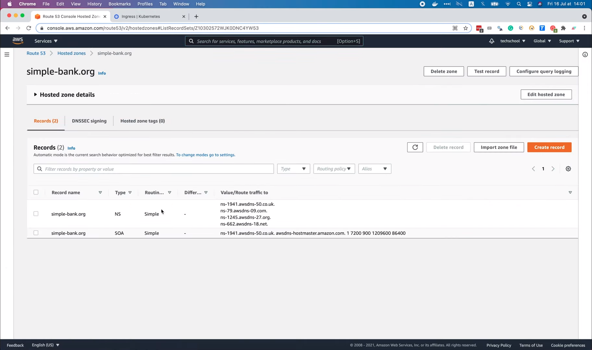

Первая — это NS (или запись имён серверов), содержащая список 
имён серверов, на которых Интернет может найти IP-адреса нашего домена.
А вторая — это SOA-запись (или начальная запись зоны), которая
хранит некоторую важную информацию о домене. Однако обычно нам не нужно 
заботиться об этих типах DNS записей, потому что для маршрутизации трафика к
нашему сервису нам нужно создать запись другого типа, а именно А-запись 
(запись адреса).

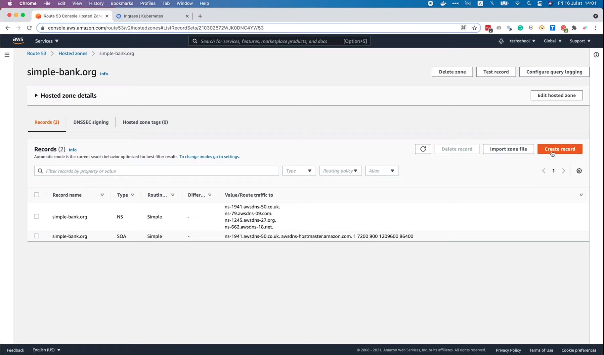

В этой форме мы сначала должны задать имя A-записи. В данном случае это 
наше доменное имя `simple-bank.org`, или для бэкенд API-сервиса мы можем 
использовать поддомен, например `api.simple-bank.org`. Затем тип записи — A,
потому что мы хотим направить трафик на IPv4 адрес и некоторые ресурсы AWS.
Также существует AAAA запись для маршрутизации трафика на IPv6-адреса, 
запись CNAME для маршрутизации трафика на другое доменное имя и многие 
другие типы записей в этом списке.

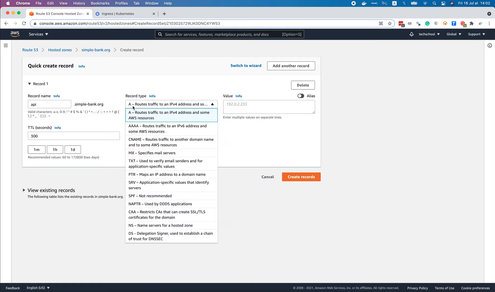

Но в нашем случае нам нужна только A-запись. Далее следует важное поле —
значение A-записи. Обычно туда записывается IP-адрес или несколько IP-адресов 
в отдельных строках. Однако, если вы еще помните, в предыдущей лекции мы 
настроили наш API-сервис `simple-bank` так, чтобы он предоставлял извне
его внешний IP-адрес, который, по сути, является доменным именем службы 
балансировки нагрузки AWS. Если мы запустим `nslookup` для этого доменного 
имени балансировщика нагрузки, то увидим, что оно связано с двумя IP-адресами.


Хотя можно скопировать и вставить эти 2 IP-адреса в A-запись, мы не должны 
этого делать, потому что IP-адреса в кластере Kubernetes недолговечны и 
могут измениться в любое время, например, при перезапуске пода. Таким 
образом, в форме вместо использования реальных значений IP мы будем 
использовать `Alias` (псевдоним), и в нашем случае это псевдоним балансировщика 
сетевой нагрузки. Далее нам нужно выбрать регион балансировщика нагрузки, 
то есть `eu-west-1`, так как наш кластер развернут в этом регионе. Наконец, 
мы можем вставить URL-адрес балансировщика нагрузки нашего API сервиса. И 
нажать `Create Records` («Создать записи»).

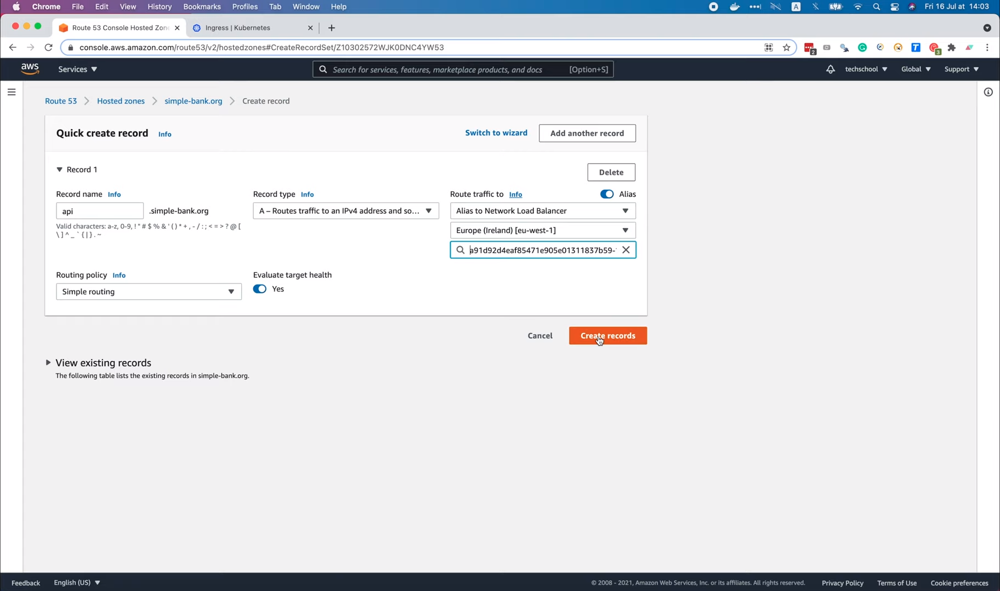

Вуаля, A-запись для поддомена `api.simple-bank.org` была успешно создана.

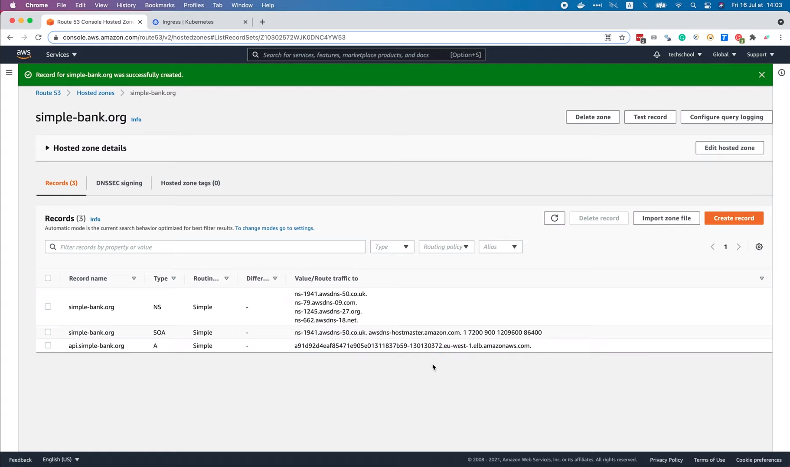

И он будет направлять трафик на балансировщик нагрузки нашего API-сервиса
`simple-bank`. Давайте проверим это, запустив в терминале 
`nslookup api.simple-bank.org`.

```shell
nslookup api.simple-bank.org
Server: 192.168.1.254
Address: 192.168.1.254#53

Non-authoritative answer:
Name: api.simple-bank.org
Address: 34.251.215.162
Name: api.simple-bank.org
Address: 52.18.148.203
```

Как видите с этим поддоменом связаны 2 IP-адреса, и они точно такие же, 
как 2 IP-адреса балансировщика нагрузки выше. Хорошо, теперь давайте 
удостоверимся, что всё работает правильно. Я попробую отправить API-запрос 
на этот поддомен через Postman. Вот на рисунке запрос к Login API, который 
мы протестировали на предыдущей лекции. На этот раз мы заменим длинный URL 
балансировщика нагрузки нашим коротким доменным именем: `api.simple-bank.org`.
Затем отправим запрос.

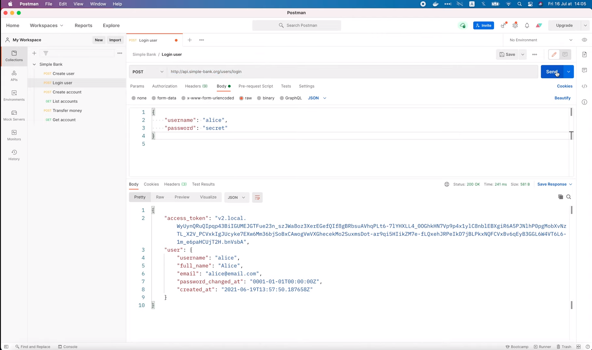

Ура, он успешно выполнен! Мы получили токен доступа и информацию о 
пользователе. Так что всё работает как надо! Мы успешно зарегистрировали 
доменное имя и настроили A-запись для маршрутизации трафика с этого 
доменного имени на наш API-сервис `simple-bank`. Но мы еще не закончили!

В следующих лекциях мы узнаем, как использовать [Ingress](https://kubernetes.io/docs/concepts/services-networking/ingress/)
для настройки правил маршрутизации для нескольких сервисов и включения TLS 
для защиты наших API сервисов.

А пока, желаю вам получать удовольствие от обучения и до скорой встречи!