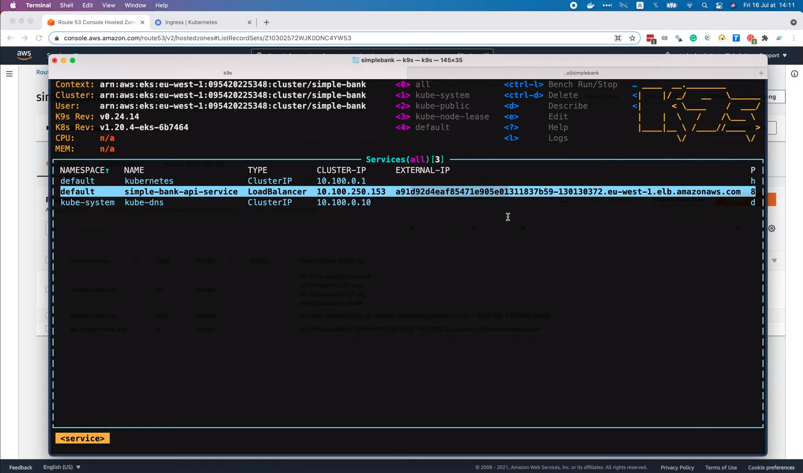
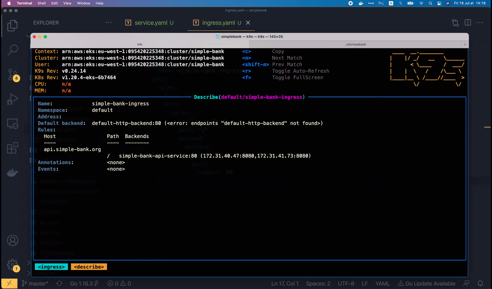
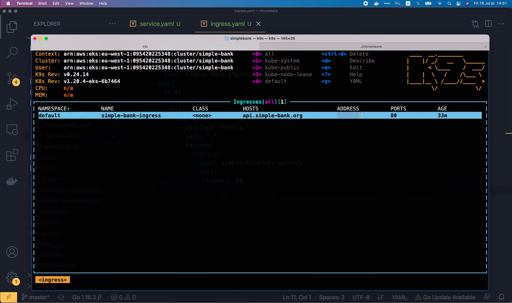
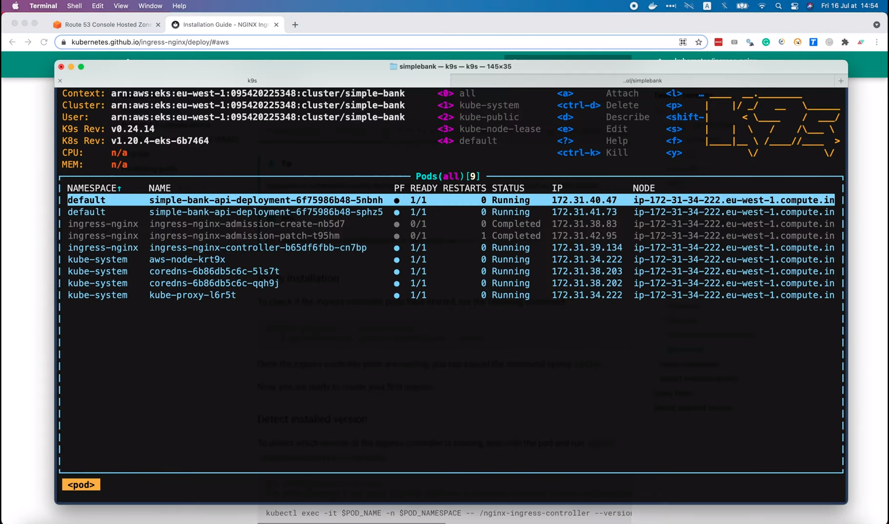
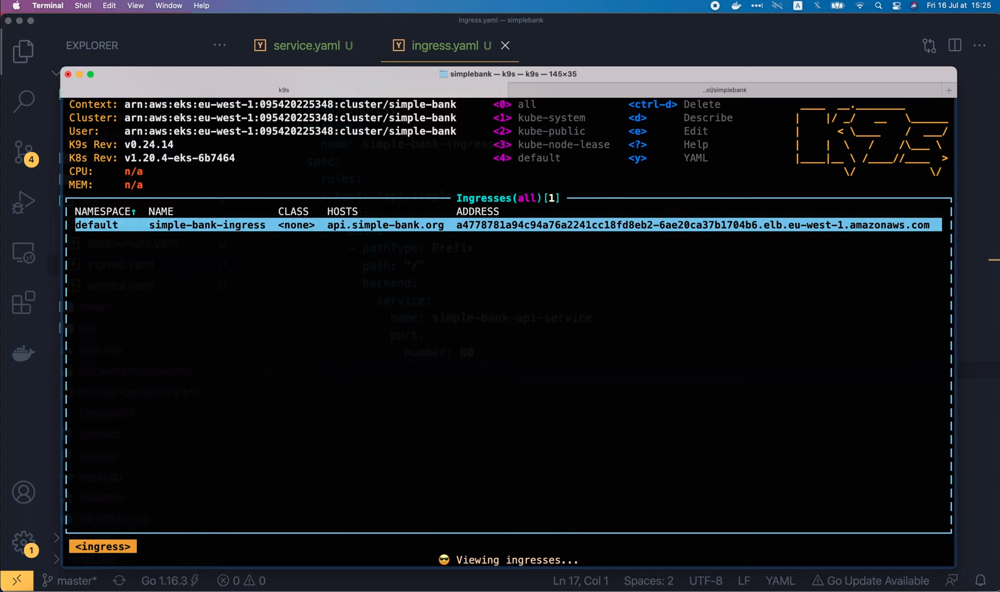
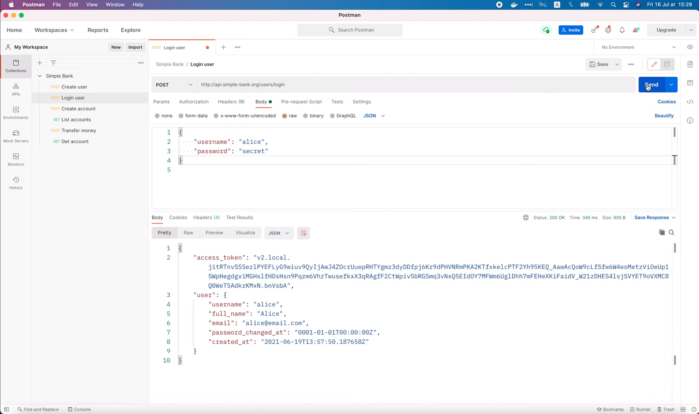

# How to use Ingress to route traffics to different services in Kubernetes

[Original video](https://www.youtube.com/watch?v=lBrqP6FkNsU)

Hello guys, welcome back to the backend master class!

In the [last lecture](part33-eng.md), we've learned how to buy a 
domain name and setup an A record to route request to our Kubernetes
service. The way we're doing it right now is to expose the service 
to the outside world by setting its type to `LoadBalancer`, and add 
its external IP to the A record.



This is fine as long as we just have 1 single service, but it would be a 
pain when we have a lot more of them, because we would have to create a 
lot of A records to route traffic to each of the services.

## Use Ingress to setup A record

A better solution in this case would be to use [Ingress](https://kubernetes.io/docs/concepts/services-networking/ingress/),
which will allow us to setup A record only once, but can define multiple
rules in the configuration file to route traffic to different services.

Ingress will also handle load balancing and SSL/TLS termination, so
setting up HTTPS for our services would be super easy and convenient.

You can read more about Ingress on the kubernetes [documentation page](https://kubernetes.io/docs/concepts/services-networking/ingress/).
Basically, Ingress exposes HTTP or HTTPS routers from outside world to the
service using the routing rules defined on the Ingress resource.

As you can see in this diagram,


the request from client will go through the ingress-managed load balancer,
and when it reaches Ingress, it will follow the routing rule to go to the
correct service and pods. If we scroll down a bit, we will see an example
of a minimal Ingress resource with a simple routing rule.

```yaml
apiVersion: networking.k8s.io/v1
kind: Ingress
metadata:
  name: minimal-ingress
  annotations:
    nginx.ingress.kubernetes.io/rewrite-target: /
spec:
  ingressClassName: nginx-example
  rules:
  - http:
      paths:
      - path: /testpath
        pathType: Prefix
        backend:
          service:
            name: test
            port:
              number: 80
```

And if we scroll down all the way to the wild card section, there's 
another example of the Ingress resource

```yaml
apiVersion: networking.k8s.io/v1
kind: Ingress
metadata:
  name: ingress-wildcard-host
spec:
  rules:
    - host: "foo.bar.com"
      http:
        paths:
          - pathType: Prefix
            path: "/bar"
            backend:
              service:
                name: service1
                port:
                  number: 80
    - host: "*.foo.com"
      http:
        paths:
          - pathType: Prefix
            path: "/foo"
            backend:
              service:
                name: service2
                port:
                  number: 80
```

which contains 2 different routing rules.

As you can see, we can use wildcards in the rules to route traffics
from multiple subdomains to the same service.

Alright, now let's learn how to use Ingress in our `simple-bank` 
cluster.

First, I'm gonna copy the content of this Ingress file, then open
our simple bank project. Before adding Ingress, I will change the
type of the `simple-bank` API service from `LoadBalancer` to 
`ClusterIP`, because we don't want to expose this service to the
outside world anymore.

```yaml
spec:
  selector:
    app: simple-bank-api
  ports:
    - protocol: TCP
      port: 80
      targetPort: 8080
  type: ClusterIP
```

Then let's create a new file `ingress.yaml` inside the `eks` folder.
And paste in the content of the sample Ingress file that we've just
copied. The first line of the file define the Kubernetes API version.
The second line contains the kind of the resource, which is Ingress.

```yaml
apiVersion: networking.k8s.io/v1
kind: Ingress
```

Then we will have a metadata section, just like other resources that
we deployed in previous lectures. Here, I'm gonna name it 
`simple-bank-ingress`.

```yaml
metadata:
  name: simple-bank-ingress
```

Now we come to the specification section. In this section, we can define
as many routing rules as we want, to route traffics to different services.
In our case, we only have 1 service: the `simple-bank` API, so we just 
need to write only 1 single rule. For the jost, I'm gonna set it to 
`api.simple-bank.org`, just like what we're setting in the domain's
A record. Next, we can specify which HTTP path will satisfy the rule.
In this case, we want to accept all requests sending to the host, so
I'm gonna change the path prefix to just a single slash `/`.

```yaml
spec:
  rules:
    - host: "api.simple-bank.org"
      http:
        paths:
          - pathType: Prefix
            path: "/"
```

Finally, we must tell Ingress where to route the request to, by 
setting the correct backend service name here. Let's copy the 
`simple-bank` API service name in the `service.yaml` file and 
paste it to the `ingress.yaml` in this line.

```yaml
spec:
  ...
    backend:
      service:
        name: simple-bank-api-service
        port:
          number: 80
```

We will keep the port 80 of the service, because that's what we've defined
in the `service.yaml` in one of the previous lectures.

Alright, now get back to the `ingress.yaml` file, we can delete this 
second routing rule,

```yaml
- host: "*.foo.com"
      ...
```

And that's basically it! We've done with the settings of our Ingress
resource.

Next step would be running the `kubectl apply` command in the terminal
to deploy it. First, I'm gonna redeploy the service to change its type
from `LoadBalancer` to `ClusterIP`.

```shell
kubectl apply -f eks/service.yaml
service/simple-bank-api-service configured
```

OK, it's successful! And in the `k9s` console, we can see that the type
of the `simple-bank` API service has changed to `ClusterIP`, and it 
doesn't have the external IP address anymore.


Next, let's deploy the Ingress.

```shell
kubectl apply -f eks/ingress.yaml
ingress.networking.k8s.io/simple-bank-ingress created
```

It's also successful! The `simple-bank-ingress` has been created. 
In the `k9s` console, we can search `ingress` to find it.


Here we go, the `simple-bank-ingress` object. It will handle all 
requests sending to this host: `api.simple-bank.org`.

If we describe the Ingress,



we can see that it will send route the traffics to the `simple-bank`
API service backend, exactly as we have configured in the yaml file.
But now there's one problem: This Ingress doesn't have an external
address yet. It's still empty as you can see here.



So how can we set up the A record of the domain to route traffics to 
this Ingress? Well, if you look at the Kubernetes documentation, 
you will find out that, just creating an Ingress resource is not enough.

In order for it to be fully functional, we must have an Ingress controller
installed in the cluster. So let's open this Ingress controller page to
learn how to install it.

As it's clearly written [here](https://kubernetes.io/docs/concepts/services-networking/ingress-controllers/),
unlike other types of controllers, Ingress controllers are not started 
automatically with a cluster. There are many different types of Ingress
controllers. We must choose one of them, and deploy it ourselves. For this
lecture, I will show you how to install the `nginx` Ingress controller.

So let's open this [link](https://git.k8s.io/ingress-nginx/README.md#readme)!

It will lead us to the `nginx` Ingress Github page. Then let's follow
this [Getting started link](https://kubernetes.github.io/ingress-nginx/deploy/)
to read its documentation. Depending on which cloud provider you're
using, you might need to use different command to install NGINX Ingress
controller. For me, I'm using [AWS](https://kubernetes.github.io/ingress-nginx/deploy/#aws)
so the NGINX Ingress controller will be exposed behind a Network load
balancer service. And here's the command we must run to deploy it to our
Kubernetes cluster running on AWS.


Let's copy it, and run it in the terminal!

```shell
kubectl apply -f https://raw.githubusercontent.com/kubernetes/ingress-nginx/controller-v1.2.0/deploy/static/provider/aws/deploy.yaml
```


OK, everything looks good.

To check if the Ingress controller pods have started successfully, 
we can run this `kubectl get pods` command

```shell
kubectl get pods -n ingress-nginx \
    -l app.kubernetes.io/name=ingress-nginx --watch
```

or we can simply search for pods in the `k9s` console. Here, in this list,



we can see an `ingress-nginx-controller` pod running in the `ingress-nginx`
namespace. So this time, if we check out our simple bank Ingress, 



we can see that it now has an external address to be accessed by the 
outside world. All we have to do now, is to copy this address, then go
back to the Route 53's `Hosted zone` page, select the `api.simple-bank.org`
A record, click `Edit record` paste in the address of the Ingress in this
box, and save it!


Just like that, and we've done! Now all the traffics to the subdomain 
`api.simple-bank.org` will be sent to our Ingress. To make sure that
it's working well, let's run `nslookup api.simple-bank.org` in the 
terminal.

```shell
nslookup api.simple-bank.org
Server: 192.168.1.254
Address: 192.168.1.254#53

Non-authoritative answer:
Name: api.simple-bank.org
Address: 54.220.48.122
Name: api.simple-bank.org
Address: 99.80.40.9
Name: api.simple-bank.org
Address: 54.229.77.174
```

So now there are several IP addresses associated with this domain. And 
if we try to run `nslookup` the address of the Ingress, it will return
the same set of IPs.


Perfect!

Alright, now let's try sending a real API request to the domain. 
I'm gonna use Postman to send this login user request.



And voila, the request is successful.

The Ingress that we've just set up is working properly.

However, there's one more thing that is still not right. It's the 
class of the Ingress. For now, it is None, while it should be Nginx
instead.


To fix this, we have to deploy an Ingress class object to the 
cluster. Now, if you're using older version of Kubernetes before 
1.18, the Ingress classes are specified this `kubernetes.io/ingress.class`
annotation on the Ingress. So in the metadata section of `ingress.yaml`
file, we can add the annotations: `kubernetes.io/ingress.class: nginx`.

```yaml
metadata:
  name: simple-bank-ingress
  annotations:
    kubernetes.io/ingress.class: nginx
```

Like that and redeploy the Ingress. However, this annotation is
deprecated since version 1.18, so now we should use the Ingress
class resource instead.

Let's copy this example

```yaml
apiVersion: networking.k8s.io/v1
kind: IngressClass
metadata:
  name: external-lb
spec:
  controller: example.com/ingress-controller
  parameters:
    apiGroup: k8s.example.com
    kind: IngressParameters
    name: external-lb
```

and paste it to the top of our `ingress.yaml` file. We can use the 
triple dash to separate the 2 resources in the same yaml file. The
ingress class declaration also starts with the API version, then
the kind of resource, which is `IngressClass`.

```yaml
apiVersion: networking.k8s.io/v1
kind: IngressClass
```

In the `metadata` section, I'm gonna rename it to nginx and in the 
`spec` section, we should change the controller to `k8s.io/ingress-nginx`.
Finally, we can remove all of these parameters as they're not needed
in our case. 

```yaml
  parameters:
    apiGroup: k8s.example.com
    kind: IngressParameters
    name: external-lb
```

Now as the Ingress class nginx is defined, we should add it to 
the `simple-bank` Ingress by adding this to the `spec` section:
`ingressClassName: nginx`.

```yaml
spec:
  ingressClassName: nginx
```

This should match the name in the `metadata` section of the 
`ingressClass` resource above.

Alright, I think that should be it. Let's open the terminal, and run
`kubectl apply` to redeploy the Ingress.

```shell
kubectl apply -f eks/ingress.yaml
ingressclass.networking.k8s.io/nginx created
ingress.networking.k8s.io/simple-bank-ingress configured
```

OK. It's successful. The Ingress class `nginx` is created, and
the `simple-bank-ingress` is configured.

We can check them out in the `k9s` console.


As you can see, the class of `simple-bank-ingress` has now been 
changed to `nginx`.

Excellent!

And that's all I wanted to show you in this video. I hope it was 
interesting and useful.

In the next lecture, we will learn how to update the Ingress to
enable SSL/TLS or HTTPS for our simple bank API.

Until then, happy learning and I'll see you guys soon!