# Как использовать Ingress для маршрутизации трафика на разные сервисы в Kubernetes

[Оригинал](https://www.youtube.com/watch?v=lBrqP6FkNsU)

Привет, ребята, рад вас снова видеть на мастер-классе по бэкенду!

На [последней лекции](part33-rus.md) мы узнали, как купить доменное имя и 
настроить A-запись для маршрутизации запроса в наш сервис Kubernetes.
В данный момент, чтобы сервис был доступен извне мы выбрали для него тип
«LoadBalancer» и добавили его внешний IP-адрес в A-запись.

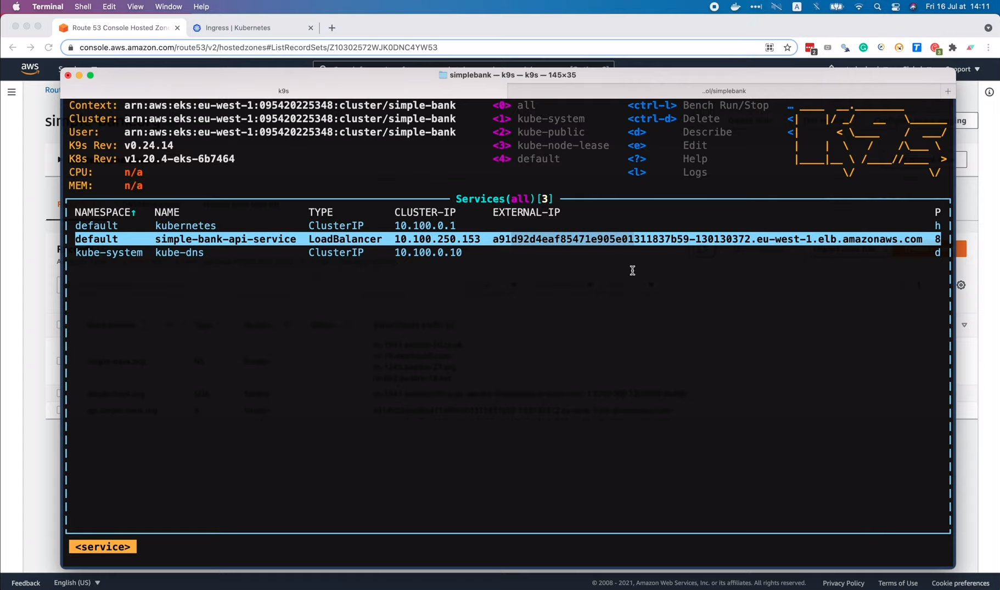

Так можно делать, пока у нас только один сервис, но было бы неудобно, если 
бы их было намного больше, потому что нам пришлось бы создавать много 
A-записей для маршрутизации трафика к каждому из сервисов.

## Используем Ingress для настройки A-записи

Более подходящим решением в этом случае будет использование [Ingress](https://kubernetes.io/docs/concepts/services-networking/ingress/),
что позволит нам настроить A-запись только один раз, но мы сможем 
определить несколько правил в файле конфигурации для маршрутизации трафика 
на разные сервисы.

Ingress также будет заниматься балансировкой нагрузки и SSL/TLS termination,
поэтому настройка HTTPS для наших сервисов будет очень простой и удобной.

Подробнее об Ingress можно прочитать на [странице документации Kubernetes](https://kubernetes.io/docs/concepts/services-networking/ingress/).
По сути, Ingress связывает HTTP или HTTPS маршрутизаторы из внешнего мира
с сервисом, используя правила маршрутизации, определенные в ресурсе Ingress.

Как видно на этой диаграмме,


запрос от клиента пройдет через балансировщик нагрузки, управляемый Ingress,
и когда он достигнет Ingress, он будет использовать правило маршрутизации,
чтобы перейти в правильный сервис и под. Если мы прокрутим немного вниз,
то увидим пример минимального ресурса Ingress с простым правилом 
маршрутизации.

```yaml
apiVersion: networking.k8s.io/v1
kind: Ingress
metadata:
  name: minimal-ingress
  annotations:
    nginx.ingress.kubernetes.io/rewrite-target: /
spec:
  ingressClassName: nginx-example
  rules:
  - http:
      paths:
      - path: /testpath
        pathType: Prefix
        backend:
          service:
            name: test
            port:
              number: 80
```

И если мы прокрутим вниз до раздела `Hostname wildcards`, то увидим еще 
один пример ресурса Ingress.

```yaml
apiVersion: networking.k8s.io/v1
kind: Ingress
metadata:
  name: ingress-wildcard-host
spec:
  rules:
    - host: "foo.bar.com"
      http:
        paths:
          - pathType: Prefix
            path: "/bar"
            backend:
              service:
                name: service1
                port:
                  number: 80
    - host: "*.foo.com"
      http:
        paths:
          - pathType: Prefix
            path: "/foo"
            backend:
              service:
                name: service2
                port:
                  number: 80
```

который содержит 2 разных правила маршрутизации.

Как видите мы можем использовать звёздочку как маску для обозначения 
произвольного набора символов в правилах для направления трафика из 
нескольких поддоменов в один и тот же сервис.

Хорошо, теперь давайте научимся использовать Ingress в нашем кластере
`simple-bank`.

Сначала я скопирую содержимое этого файла Ingress, а затем открою наш
проект простого банковского приложения. Перед добавлением Ingress я изменю 
тип `simple-bank` API сервиса с `LoadBalancer` на `ClusterIP`, поскольку
мы больше не хотим чтобы этот сервис был доступен извне.

```yaml
spec:
  selector:
    app: simple-bank-api
  ports:
    - protocol: TCP
      port: 80
      targetPort: 8080
  type: ClusterIP
```

Затем давайте создадим новый файл `ingress.yaml` внутри папки `eks`. И
вставьте содержимое примера файла Ingress, который мы только что 
скопировали. Первая строка файла определяет версию Kubernetes API.
Вторая - содержит вид ресурса, которым является Ingress.

```yaml
apiVersion: networking.k8s.io/v1
kind: Ingress
```

Затем следует раздел `metadata`, как и в других ресурсах, которые мы 
развернули на предыдущих лекциях. Я назову его `simple-bank-ingress`.

```yaml
metadata:
  name: simple-bank-ingress
```

Теперь перейдём к разделу `specification`. В этом разделе мы можем 
определить столько правил маршрутизации, сколько захотим, чтобы перенаправлять 
трафик на разные сервисы. В нашем случае у нас есть только один сервис: 
`simple-bank` API, поэтому нам просто нужно добавить только одно единственное 
правило. В поле `host` я укажу `api.simple-bank.org`, точно так же как мы 
делали в А-записи домена. Далее мы можем прописать, какой HTTP-путь будет 
удовлетворять правилу. В нашем случае мы хотим принимать все запросы, 
отправляемые на хост, поэтому я изменю префикс пути на одну косую черту `/`.

```yaml
spec:
  rules:
    - host: "api.simple-bank.org"
      http:
        paths:
          - pathType: Prefix
            path: "/"
```

Наконец, мы должны сообщить Ingress, куда направить запрос, указав здесь 
правильное имя бэкенд сервиса. Давайте скопируем имя API сервиса 
`simple-bank` из файла `service.yaml` и вставим его в эту строку
`ingress.yaml`.

```yaml
spec:
  ...
    backend:
      service:
        name: simple-bank-api-service
        port:
          number: 80
```

Мы не будем менять порт 80 для сервиса, потому что так его определили в
`service.yaml` в одной из предыдущих лекций.

Хорошо, теперь вернемся к файлу `ingress.yaml`, мы можем удалить это второе 
правило маршрутизации,

```yaml
- host: "*.foo.com"
      ...
```

И этого будет достаточно! Мы закончили настраивать наш ресурс Ingress.

Следующим шагом будет выполнение команды `kubectl apply` в терминале для его 
развертывания. Во-первых, я собираюсь повторно развернуть сервис, чтобы 
изменить его тип с `LoadBalancer` на `ClusterIP`.

```shell
kubectl apply -f eks/service.yaml
service/simple-bank-api-service configured
```

Итак, команда успешно выполнена! А в консоли `k9s` мы видим, что тип 
API сервиса `simple-bank` изменился на `ClusterIP` и у него больше нет 
внешнего IP-адреса.

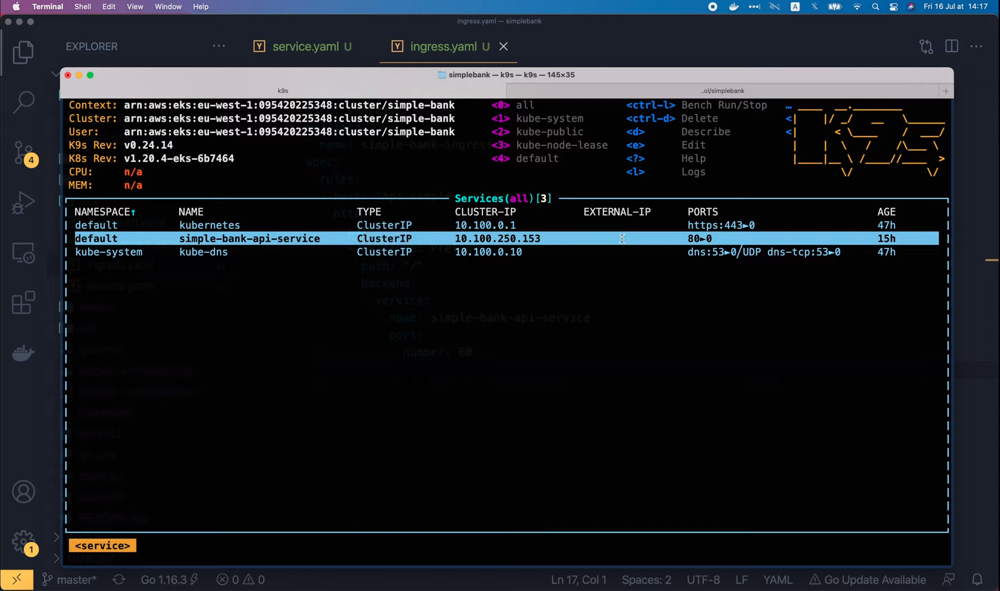

Далее давайте развернем Ingress.

```shell
kubectl apply -f eks/ingress.yaml
ingress.networking.k8s.io/simple-bank-ingress created
```

Она тоже успешно выполнена! Был создан ресурс `simple-bank-ingress`. В 
консоли `k9s` мы можем поискать по ключевому слову `ingress`, чтобы
найти его.

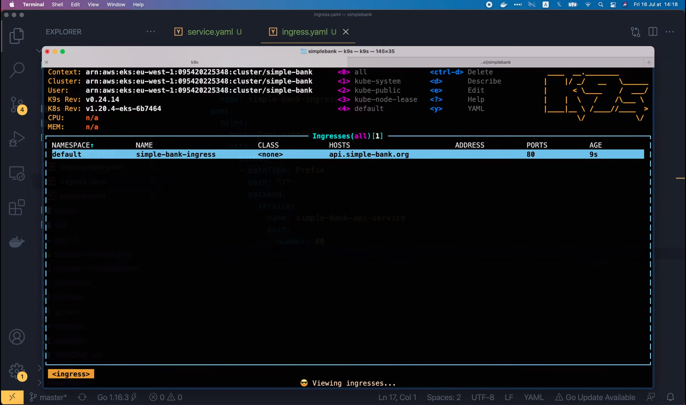

Вот на рисунке мы видим объект `simple-bank-ingress`. Он будет обрабатывать 
запросы, отправляемые на этот хост: `api.simple-bank.org`.

Если мы выведем подробную информацию об Ingress,

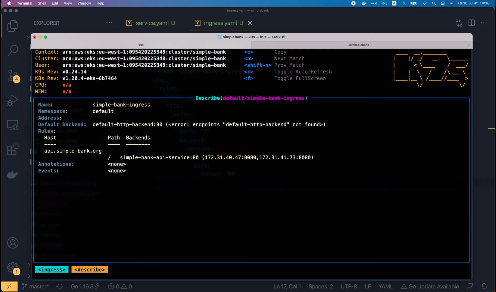

то увидим, что он направит трафик в бэкенд API сервис `simple-bank`, как
мы и настроили в `yaml` файле. Но существует одна проблема: у этого Ingress
объекта ещё нет внешнего адреса. Он пока пуст, как вы видите здесь. 

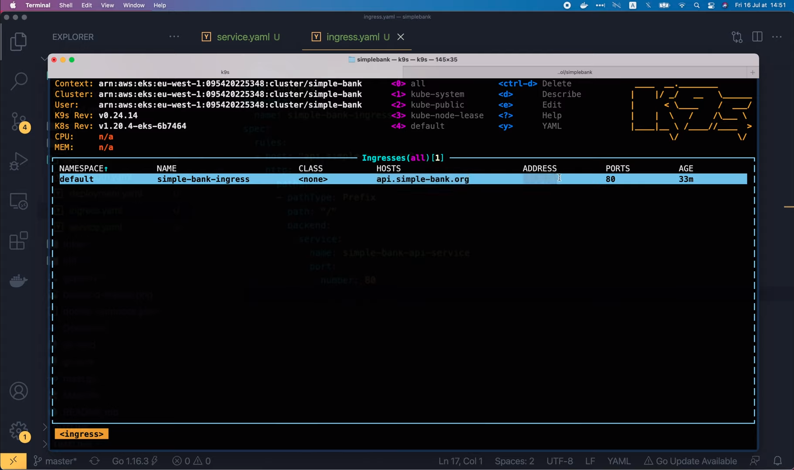

Итак, как мы можем настроить A-запись домена для маршрутизации трафика на 
этот Ingress объект? Что ж, если вы просмотрите документацию Kubernetes, то
обнаружите, что просто создать ресурс Ingress недостаточно.

Для полноценной работы у нас должен быть установлен Ingress контроллер 
в кластере. Итак, давайте откроем [эту страницу](https://kubernetes.io/docs/concepts/services-networking/ingress-controllers/)
Ingress контроллера, чтобы узнать, как его установить.

Как ясно написано [здесь](https://kubernetes.io/docs/concepts/services-networking/ingress-controllers/),
в отличие от контроллеров других типов, Ingress контроллеры не запускаются 
автоматически вместе с кластером. Существует множество различных типов
Ingress контроллеров. Мы должны выбрать один из них и развернуть его 
самостоятельно. На этой лекции я покажу вам, как установить Ingress контроллер 
`nginx`.

Итак, давайте откроем эту [ссылку](https://git.k8s.io/ingress-nginx/README.md#readme)!

Она приведёт нас на GitHub страницу `nginx` Ingress. Затем давайте перейдем 
по этой [ссылке «С чего начать»](https://kubernetes.github.io/ingress-nginx/deploy/),
чтобы прочитать документацию. В зависимости от того, какой облачный 
провайдер вы используете, вам возможно нужно будет использовать другую 
команду для установки Ingress контроллера NGINX. Я использую [AWS](https://kubernetes.github.io/ingress-nginx/deploy/#aws),
поэтому Ingress контроллер NGINX будет находиться за сервисом балансировки 
сетевой нагрузки. Здесь на рисунке показана команда, которую мы должны 
выполнить, чтобы развернуть его в нашем Kubernetes кластере, работающем на
AWS.

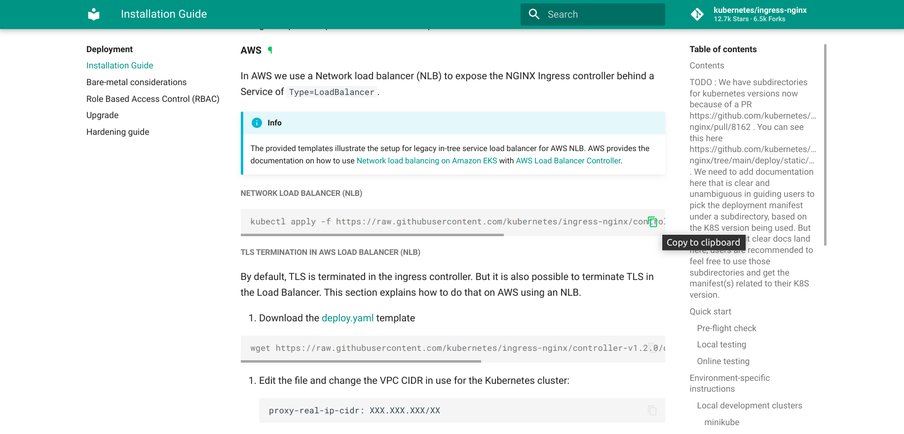

Давайте скопируем её и запустим в терминале!

```shell
kubectl apply -f https://raw.githubusercontent.com/kubernetes/ingress-nginx/controller-v1.2.0/deploy/static/provider/aws/deploy.yaml
```

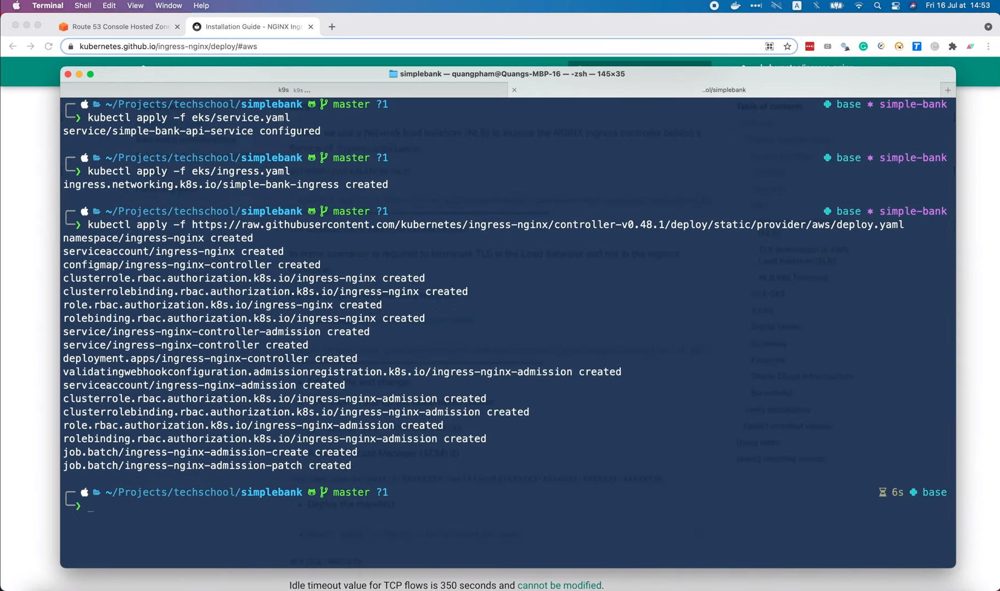

Кажется она успешно выполнилась.

Чтобы проверить успешно ли запущены поды Ingress контроллера, мы можем 
запустить эту команду `kubectl get pods`.

```shell
kubectl get pods -n ingress-nginx \
    -l app.kubernetes.io/name=ingress-nginx --watch
```

или мы можем просто поискать по ключевому слову `pods` в консоли `k9s`. Здесь, 
в этом списке,

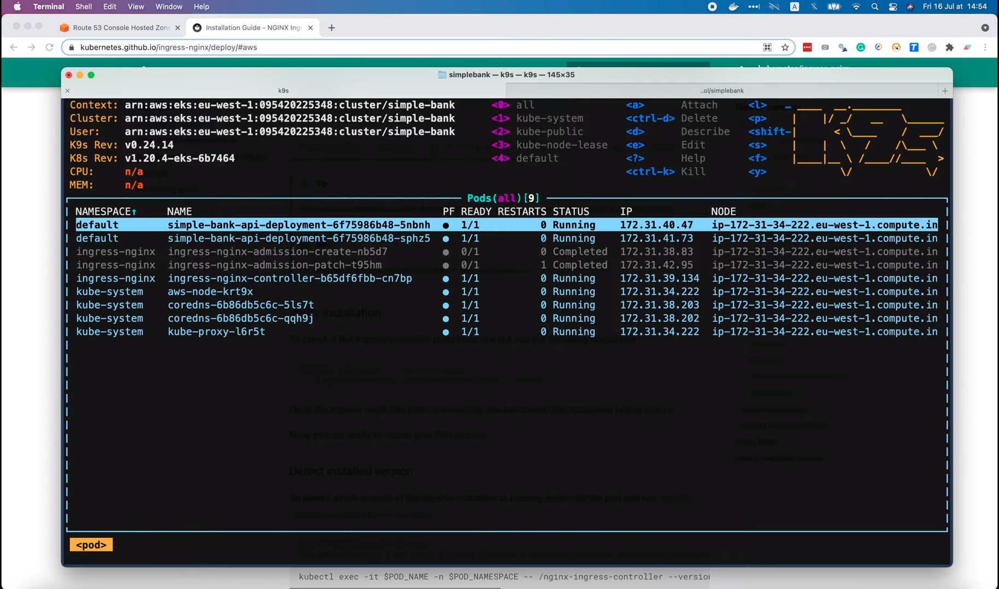

мы видим, что под `ingress-nginx-controller` работает в пространстве имён
`ingress-nginx`. Итак, если мы ещё раз откроем наш  `simple-bank-ingress`,

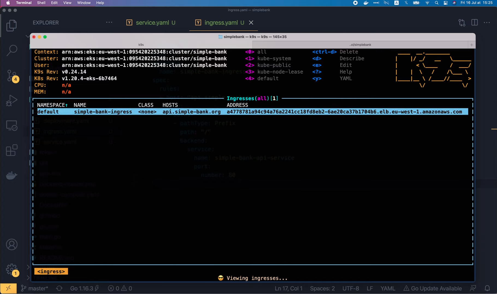

то увидим, что теперь у него есть внешний IP-адрес для доступа. Все, что нам 
нужно сделать сейчас, это скопировать этот адрес, затем вернуться на
страницу Route53 `Hosted zone` выбрать А-запись `api.simple-bank.org`, 
нажать `Edit record`, вставить IP-адрес Ingress в это поле на рисунке 
и сохранить её!

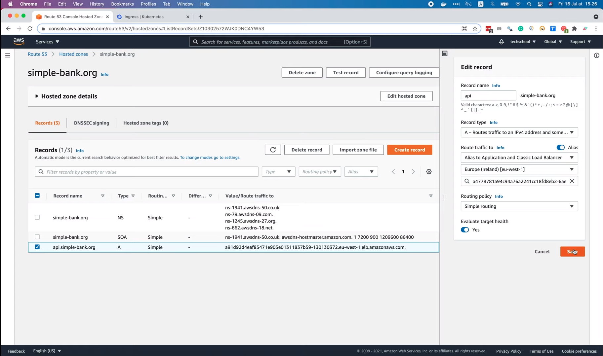

Вот так и у нас всё готово к работе! Теперь весь трафик с поддомена
`api.simple-bank.org` будет отправлен на наш Ingress. Чтобы убедиться, что
всё работает правильно, запустим в терминале `nslookup api.simple-bank.org`.

```shell
nslookup api.simple-bank.org
Server: 192.168.1.254
Address: 192.168.1.254#53

Non-authoritative answer:
Name: api.simple-bank.org
Address: 54.220.48.122
Name: api.simple-bank.org
Address: 99.80.40.9
Name: api.simple-bank.org
Address: 54.229.77.174
```

Итак, теперь с этим доменом связано несколько IP-адресов. И если мы 
попытаемся запустить `nslookup` с адресом Ingress, он вернет тот же набор
IP-адресов, как показано на рисунке.

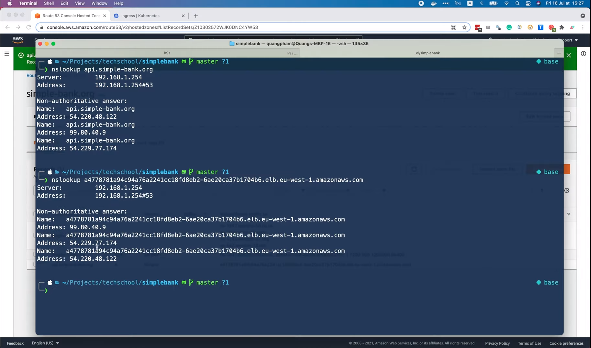

Идеально!

Хорошо, теперь давайте попробуем отправить настоящий API-запрос к домену.
Я собираюсь использовать Postman для отправки запроса на вход пользователя в 
систему.

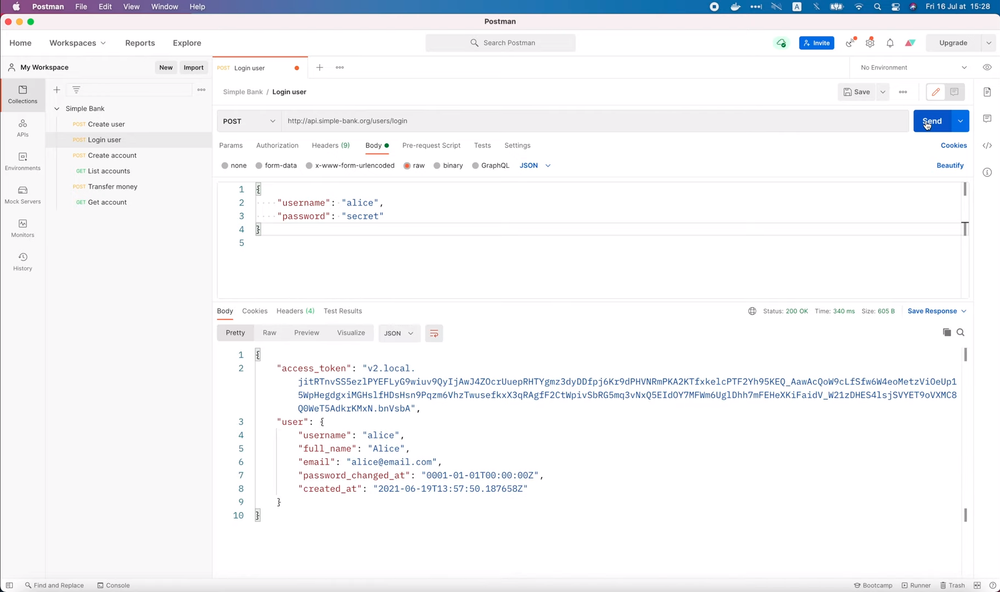

И вуаля, запрос успешно выполнен.

Ingress, который мы только что настроили, работает правильно.

Тем не менее кое-что всё же следует исправить. А именно класс Ingress.
На данный момент он равен `None`, а вместо этого должен быть `Nginx`.

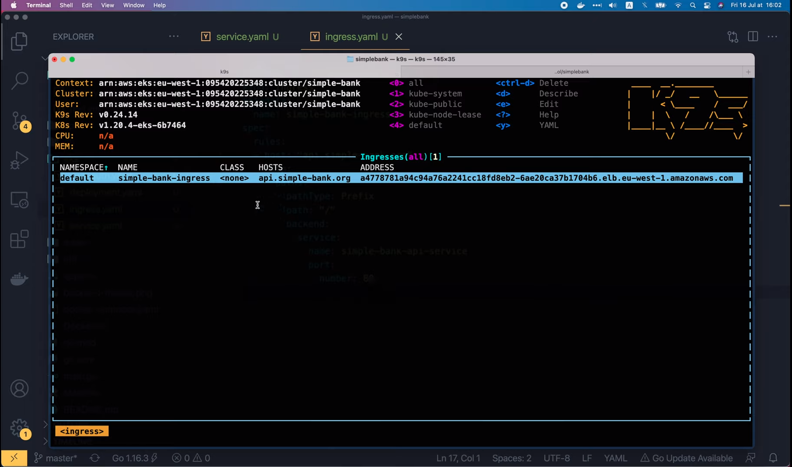

Для этого нам нужно развернуть объект класса Ingress в кластере. Теперь, 
если вы используете более старую версию Kubernetes до 1.18, классы Ingress
определяются, используя следующую аннотацию `kubernetes.io/ingress.class` в
файле Ingress. Итак, в разделе `metadata` файла `ingress.yaml` мы можем 
добавить аннотации: kubernetes.io/ingress.class: nginx.

```yaml
metadata:
  name: simple-bank-ingress
  annotations:
    kubernetes.io/ingress.class: nginx
```

Вот так и повторно разверните Ingress. Однако эта аннотация устарела, начиная
с версии 1.18, поэтому теперь вместо неё следует использовать ресурс
`IngressClass`.

Давайте скопируем этот пример

```yaml
apiVersion: networking.k8s.io/v1
kind: IngressClass
metadata:
  name: external-lb
spec:
  controller: example.com/ingress-controller
  parameters:
    apiGroup: k8s.example.com
    kind: IngressParameters
    name: external-lb
```

и вставим его в начало нашего файла `ingress.yaml`. Мы можем использовать 
тройной дефис, чтобы разделить 2 ресурса в одном файле `yaml`. Объявление
Ingress класса также начинается с версии API, а затем типа ресурса, которым 
является `IngressClass`.

```yaml
apiVersion: networking.k8s.io/v1
kind: IngressClass
```

В разделе `metadata` я переименую его в `nginx`, а в разделе
`spec` мы должны изменить контроллер на `k8s.io/ingress-nginx`.

```yaml
metadata:
  name: nginx
spec:
  controller: k8s.io/ingress-nginx
```

Наконец, мы можем удалить все эти параметры, так как в нашем случае 
они не нужны.

```yaml
  parameters:
    apiGroup: k8s.example.com
    kind: IngressParameters
    name: external-lb
```

Теперь, когда Ingress класс `nginx` определен, мы должны добавить его в 
Ingress `simple-bank`, в раздел `spec`: `ingressClassName: nginx`.

```yaml
spec:
  ingressClassName: nginx
```

Имя должно совпадать с именем в разделе `metadata` ресурса `ingressClass` 
выше.

Хорошо, думаю этого должно быть достаточно. Давайте откроем терминал и 
выполним `kubectl apply` для повторного развертывания Ingress.

```shell
kubectl apply -f eks/ingress.yaml
ingressclass.networking.k8s.io/nginx created
ingress.networking.k8s.io/simple-bank-ingress configured
```

Итак, она успешно выполнена. Создался Ingress класс `nginx` и настроен
`simple-bank-ingress`.

Мы можем проверить это в консоли `k9s`.

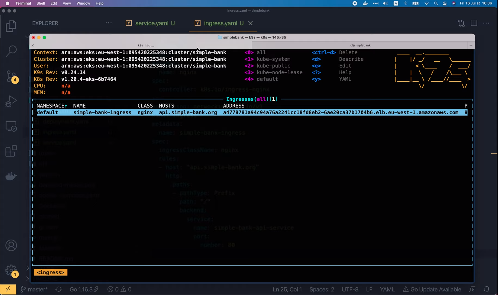

Как видите, класс `simple-bank-ingress` теперь изменился на `nginx`.

Превосходно!

И это всё, что я хотел вам показать на этой лекции. Надеюсь она была 
интересной и приобретенные знания будут вам полезны.

На следующей лекции мы узнаем, что нужно изменить в Ingress, чтобы 
включить SSL/TLS или HTTPS для нашего простого банковского API.

А пока, желаю Вам получать удовольствие от обучения и до скорой встречи!