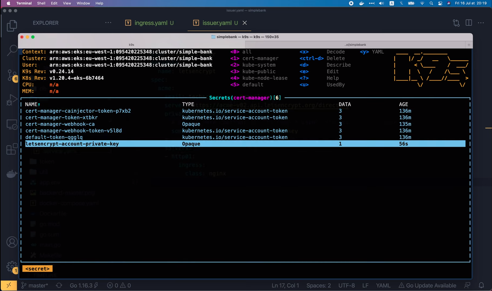
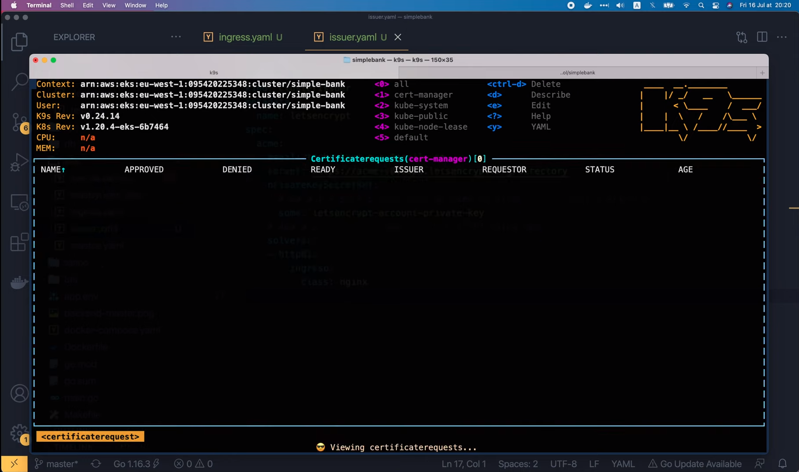
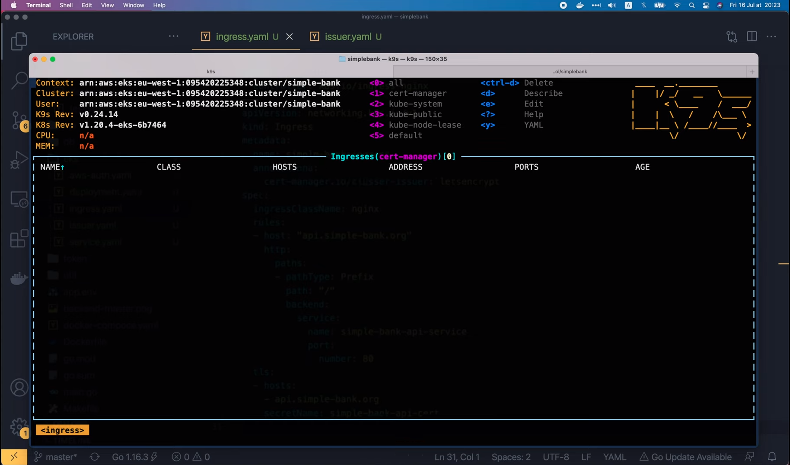
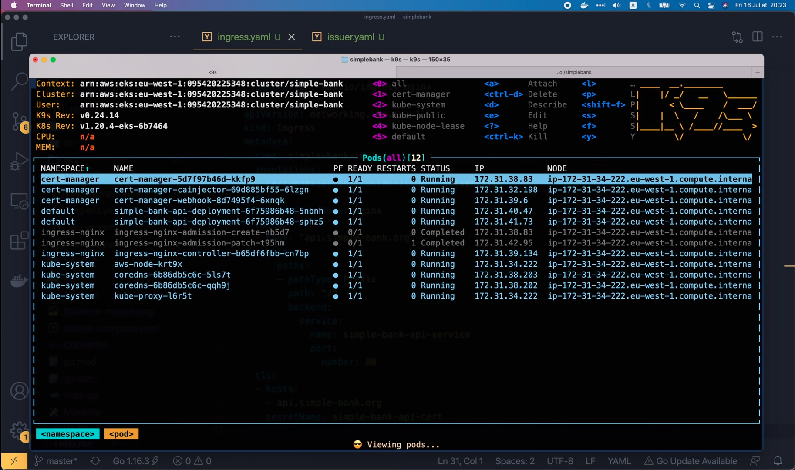
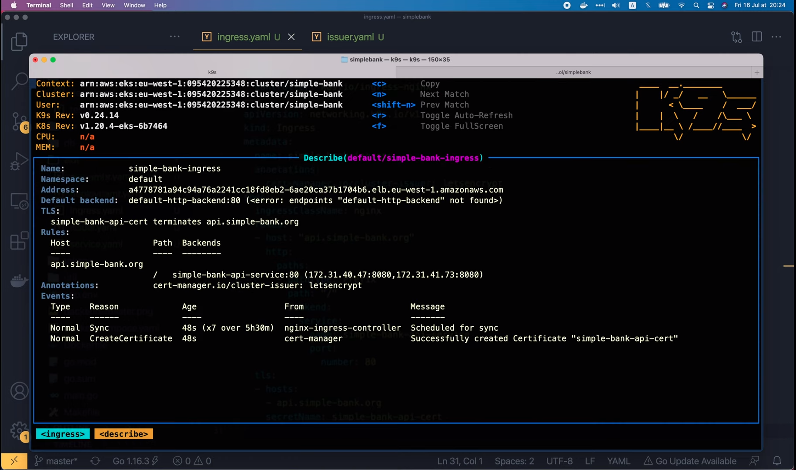
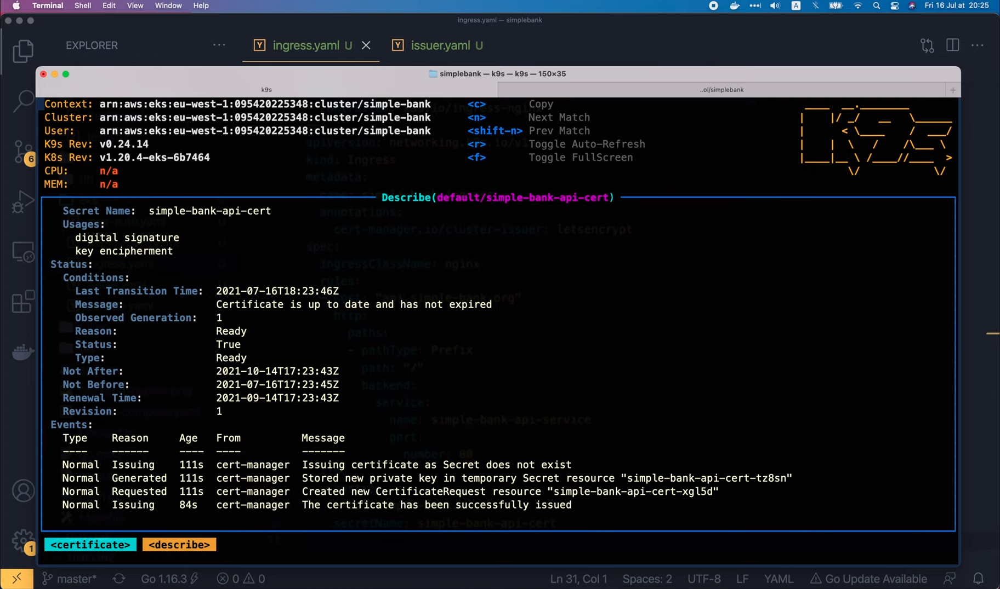
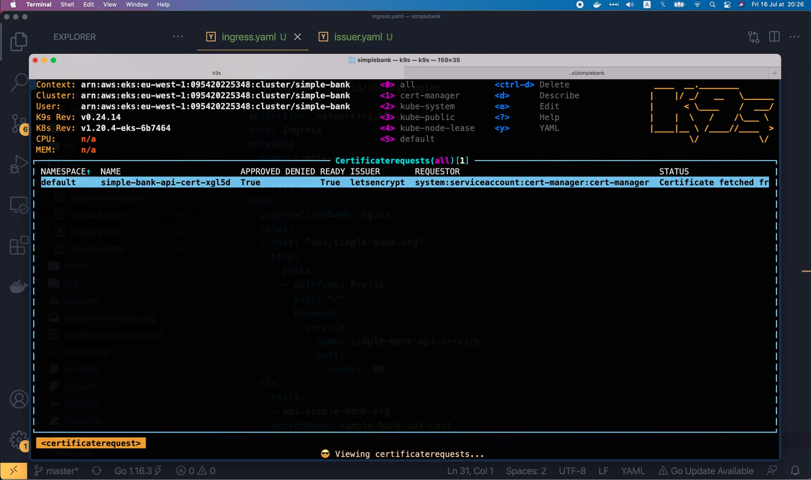
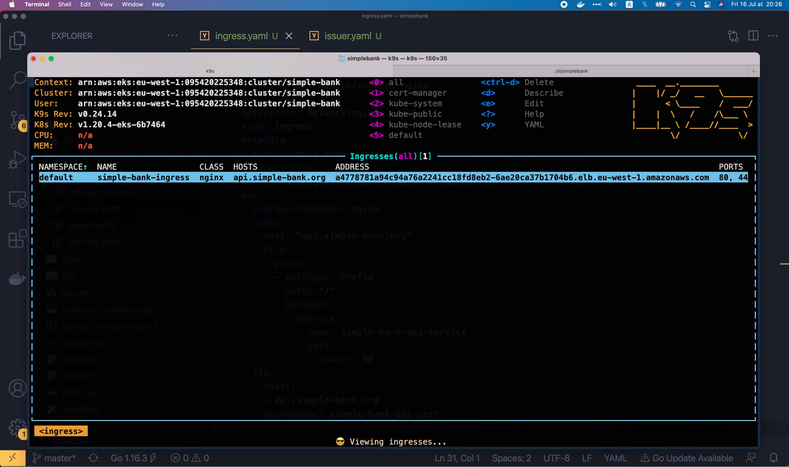
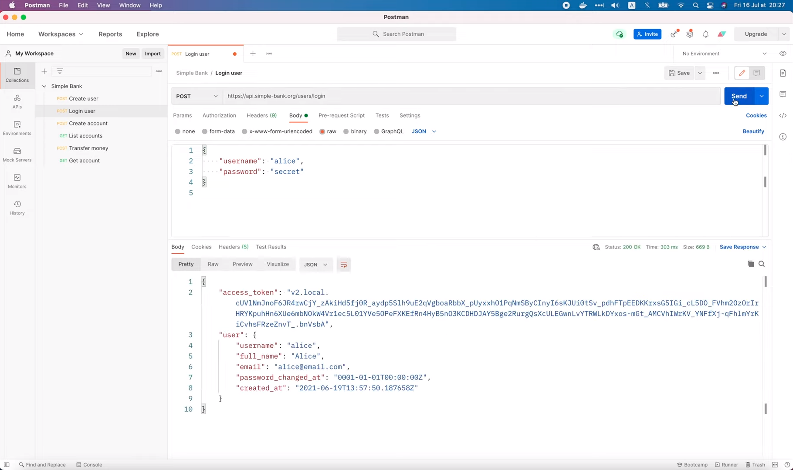

# Automatic issue TLS certificates in Kubernetes with Let's Encrypt

[Original video](https://www.youtube.com/watch?v=nU4FTjrgSKI)

Hello everyone!

Welcome back to the backend master class.

In the [previous lecture](part34-eng.md), we've learned how to set up 
Ingress for our kubernetes cluster. So now we can send requests to 
the simple bank api server using its domain name. However, the 
connection between client and server is still not secured. We're still
login requests via a plain HTTP connection. This is not good because
someone in the middle can easily steal users' login credentials. To 
prevent this, we must enable HTTPS by adding TLS to secure the 
connection. And that's exactly what we're gonna do in this video.

But before continue, I highly recommend you to watch [my video](https://www.youtube.com/watch?v=-f4Gbk-U758&list=PLy_6D98if3UINAba67DnhO4055OA6viSb)
about SSL/TLS first. It will give you a complete overview of 
how TLS works, its cryptographic system, and why we need an TLS 
certificate signed by a certificate authority. Normally, we have to 
manually buy a TLS certificate and add it to our web server. Not
only it is expensive, but it is also time-consuming. And as it's 
done manually, sometimes we might forget to renew the certificate
when it expires.

So is it possible for the system to automatically create or renew 
TLS certificates? The answer is yes. In Kubernetes, we can use an 
add-on called [cert-manager](https://cert-manager.io/) to do so.
Cert manager can issue certificates from several supported sources
such as Let's Encrypt, Hashicorp Vault, and Venafi. It will ensure
that the certificates are valid and up to date, and will 
automatically renew certificates at a configured time before expiry.
Not only that, if we use issue certificates from Let's Encrypt, then
it is also free. Sounds amazing, right?

But, if it's free, then how [Let's Encrypt](https://letsencrypt.org/how-it-works/)
makes money? Well, the majority of its funding comes from corporate
sponsorships, which means, there are a lot of companies who are
using Let's Encrypt's service and like it, so they're willing to 
give some money to Let's Encrypt. And thanks to that, Let's
Encrypt can continue providing the services for all for free.

OK, now let's learn how Let's Encrypt actually works!

Basically, Let's Encrypt uses ACME protocol to make it possible
to set up an HTTPS server and have it automatically obtain a 
browser trusted certificate without any human intervention. 
ACME stands for Automated Certificate Management Environment.

Here's how ACME performs domain validation: the first time the 
agent software, or in our case, the cert-manager, interacts 
with Let's Encrypt. It generates a new key pair and proves to
the CA that the server controls the domain.

How can it prove that? Well, the Let's Encrypt CA will ask the
cert-manager to complete 1 or more set of challenges. For 
example, provisioning a DNS record under the domain name, or
provisioning an HTTP resource under a URI on the domain name.
And along with the challenges, the CA also provides a nonce
that the agent must sign with its private key to prove that
it controls the key pair. If you don't know how the public
and private key pair works, please watch my [TLS video](https://www.youtube.com/watch?v=-f4Gbk-U758&list=PLy_6D98if3UINAba67DnhO4055OA6viSb).


OK, next the agent software will complete the challenge. For 
example, if it's a HTTP-01 challenge, the agent will create a
file on a specified path on the domain's website, and it 
will sign the provided nonce with its private key. Once it
has completed these steps, it notifies the CA that it's 
ready to complete validation. Then it's the CA's job to check that
the challenges have been satisfied. It will verify the sinature
of the nonce, and will attempt to download the file from the 
specified path on the web server, and make sure that the file
has the expected content. 


The validation is successful if both the signature and the file
content are valid. This will allow the agent to be authorized to
use its key pair to issue or revoke TLS certificates of the 
target domain.

If you have watched my video about TLS then you've already know
how the TLS certificates are issued. Basically, the agent (or 
cert-manager) creates a certificate signing request (or CSR)
to ask the CA to issue a certificate for the domain name with
the authorized public key. The CSR is then signed with its 
authorized private key of the same pair. That way, the Let's 
Encrypt CA will be able to verify the CSR and the signature.
If everything looks good, a new TLS certificate for the 
domain will be issued and returned to the agent. The 
certificate revocation process works on a similar manner. 


OK, so now you understand how Let's Encrypt works.

the most important thing in the whole process is the
validation phase, where the agent needs to solve a set 
of [challenges](https://letsencrypt.org/docs/challenge-types/).

We've already talked about the HTTP-01 challenge. It's very
easy to automate without extra knowledge about a domain's
configuration. But if you have multiple web servers, you must
make sure that the file is available on all of them. This
is not a problem if we use Kubernetes, because it will be done
automatically by the `cert-manager`.

However, Let's Encrypt won't let you use HTTP-01 challenge to issue
wildcard certificates. So if you want to have wildcard certificates,
you have to use another type of challenge, which is DNS-01 challenge.
This challenge asks you to prove that you control the DNS for your
domain name by putting a specific value in a TXT record under that 
domain name. To do that, in AWS Route 53's `Hosted zones` page, we 
can create a new record, and select TXT from the record type list.


Once it is configured, Let's Encrypt's CA will query the DNS system
for that domain record. If it finds a match, then the agent will
be authorized to issue a TLS certificate.

DNS-01 challenge is a bit harder to configure than HTTP-01, but it 
can work in scenarios that HTTP-01 can't, such as issuing wildcard
certificates.

However, since automation of certificate issuance and renewals is 
really important, we should only use DNS-01 challenge if DNS provider
has na API to automate the record updates. For this video, I'm just
gonna show you how to use HTTP-01 challenge, since it's much simpler,
and we don't need a wildcard certificate for our simple bank service.

Alright, the first step we must do is to install `cert-manager` add-on
to our Kubernetes cluster. `Cert-manager` runs within the cluster as a
series of deployment resources. And it utilizes custom resource 
definitions to configure Certificate Authorities and request 
certificates. We deploy it using regular YAML manifest, just like any
other application on Kubernetes. So let's copy this `kuberctl apply` 
command and run it in the terminal to deploy everything, including
the custom resource definitions, `cert-manager`, and the webhook
component.

```shell
kubectl apply -f https://github.com/cert-manager/cert-manager/releases/download/v1.8.0/cert-manager.yaml
```


OK, it's done.

Now let's open `k9s` console to verify the installation. I'm gonna
switch the namespace to `cert-manager`.


Here you can see 3 running pods: `cert-manager`, `cainjector` and 
`webhook`. So I think the add-ons has been installed correctly. Next
step, we will learn how to config and deploy a certificate Issuer to
the cluster. Next step, we will learn how to config and deploy a 
certificate Issuer to the cluster. In [this page](https://cert-manager.io/docs/configuration/),
let's select [ACME](https://cert-manager.io/docs/configuration/acme/) 
because it's the protocol that Let's Encrypt uses. Then scroll down a 
bit, we will see an example of how to create a [basic ACME issuer](https://cert-manager.io/docs/configuration/acme/#creating-a-basic-acme-issuer).
Let's copy its content and open our `simple-bank` project.

```yaml
apiVersion: cert-manager.io/v1
kind: ClusterIssuer
metadata:
  name: letsencrypt-staging
spec:
  acme:
    # You must replace this email address with your own.
    # Let's Encrypt will use this to contact you about expiring
    # certificates, and issues related to your account.
    email: user@example.com
    server: https://acme-staging-v02.api.letsencrypt.org/directory
    privateKeySecretRef:
      # Secret resource that will be used to store the account's private key.
      name: example-issuer-account-key
    # Add a single challenge solver, HTTP01 using nginx
    solvers:
    - http01:
        ingress:
          class: nginx
```

In the `eks` folder, I'm gonna create a new file: `issuer.yaml` and 
paste in the copied content. It starts with the api version: 
`cert-manager.io/v1`. Here the resource kind is `ClusterIssuer`.

```yaml
apiVersion: cert-manager.io/v1
kind: ClusterIssuer
```

which means it will work for all namespaces in the cluster. If you set 
to just `Issuer`, then it will only work for 1 namespace. Next, we 
must set a name for the resource in the metadata section. Here it is 
`letsencrypt-staging`, because the example is for testing only, that's
why the server URL is pointing to `acme-staging` API here. The staging
API will only return fake certificates. But in our case, we want to 
deploy this to production and issue real certificates. So I'm gonna set
its name to `letsencrypt` only. And let's also remove staging from the
server URL.

```yaml
metadata:
  name: letsencrypt
```

Alright, next I'm gonna remove these comments, and replace this example
email with tech school's email.

```yaml
spec:
  acme:
    email: techschool.guru@gmail.com
```

OK, now one important thing we must do is to set the name for the 
resource that will be used to store the account's private key. I'm
gonna call it `letsencrypt-account-private-key`. The last step is
to select a challenge resolver. In our case, we're gonna use HTTP-01
with the `nginx` `ingress` that we set up in the previous lecture.

```yaml
spec:
  ...
    solvers:
      - http01:
          ingress:
            class: nginx
```

So no need to change anything.

Let's go to the terminal and run `kubectl apply` command to deploy the 
issuer.

```shell
kubectl apply -f eks/issuer.yaml
clusterissuer.cert-manager.io/letsencrypt created
```

OK, the cluster issuer has been created. Let's check it in the `k9s` 
console. I'm gonna search for cluster issuer.


Here it is! The ACME account was registered with the ACME server.

We can check more details by describing it.


The registered email matches with the one we specified in the 
`yaml` file. We can also find its private key in the secrets list.




So now, the issuer should be ready to issue TLS certificates.

But if we look at the certificates list at the moment, it's still
empty.


And the same for the certificate request list.



It's all empty.

That's because we haven't attached the issuer to Ingress yet.

Here's what we need to do: first, open the `ingress.yaml` file, then 
in the `metadata` section of the Ingress, let's add a new 
`annotations` section with this content: `cert-manager.io/cluster-issuer`
followed by the name of the cluster issuer we've just created, which is
`letsencrypt`.

```yaml
metadata:
  name: simple-bank-ingress
  annotations:
    cert-manager.io/cluster-issuer: letsencrypt
```

Next, in the `spec`, I'm gonna add a new section for the TLS.

In this section, we must specify the domain name and where to store
its certificates. In our case, the `hosts`, or domain name should
be `api.simple-bank.org` and its certificates will be stored in a 
secret with this name: `simple-bank-api-cert`.

```yaml
spec:
  ...
  tls:
    - hosts:
        - api.simple-bank.org
        secretName: simple-bank-api-cert
```

Alright, I think that will be it!

Let's run `kubectl apply` in the terminal to redeploy the Ingress.

```shell
kubectl apply -f eks/ingress.yaml
ingressclass.networking.k8s.io/nginx unchanged
ingress.networking.k8s.io/simple-bank-ingress configured
```

OK, it's done. Let's check it in the `k9s` console.


Oh, the certificate requests list is still empty. And the same for the
certificates list.


Let's check the Ingress.



Why is it also empty?

Oh I see, we're still in the `cert-manager` namespace. I think the
Ingress and certificates must be in other namespace. So let's 
switch the namespace to `all` to find them.




OK, let's search for Ingress.


Here it is, in the `default` namespace. Now, if we describe the 
Ingress, we can see that TLS has been enabled, and `simple-bank-api`
certificate will be used to terminate the requests to 
`api.simple-bank.org`



before forwarding it to the `simple-bank-api` service. In the events
list, we also see an event `CreateCertificate` from `cert-manager`.
And the message says: "Successfully create Certificate 
simple-bank-api-cert". So I think it's working properly.

Just to make sure, let's search for certificate.


Here we go, the `simple-bank-api` certificate is here! It is up to
date and has not expired. If we describe the certificate, and 
scroll all the way down to the bottom,



we can see its creation time, its expiration time, and the time at 
which it will be automatically renewed.

From what I see here, looks like the certificate is valid for about
3 month, and it will be renewed 1 month before expiration. That's
pretty cool, isn't it?

We can also take a look at the certificate request



that has been approved by the Let's Encrypt CA here. OK, so we've
successfully enabled TLS on our `simple-bank-ingress`.

Therefore, the web server will now be ready to accept both HTTPS 
request on port `443` and HTTP request on port `80`.



Let's open Postman to test it!

I'm gonna change the URL of this login API request to HTTPS and send
it.



Voila, the request is successful. Now let's change it back to HTTP,
and resend the request!


It's also successful, exactly as we expected.

And that brings us to the end of this video. We've successfully 
installed and configured `cert-manager` to automatically issue TLS
certificates from Let's Encrypt. And thus, secure the connection for
our simple bank API service using HTTPS.

I hope you find it interesting and useful.

Thanks a lot for watching and see you in the next lecture!