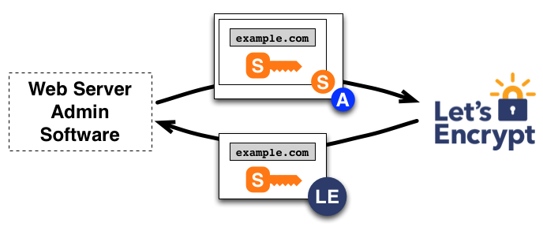
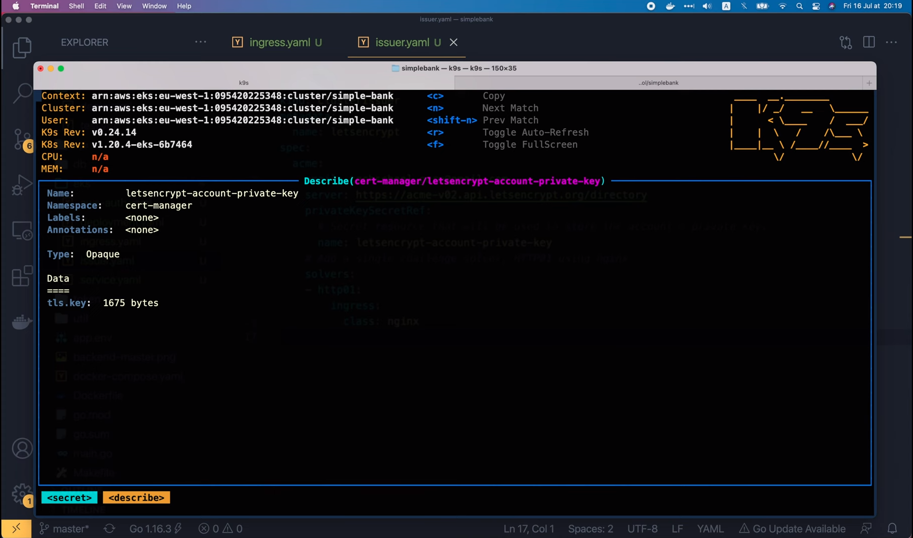
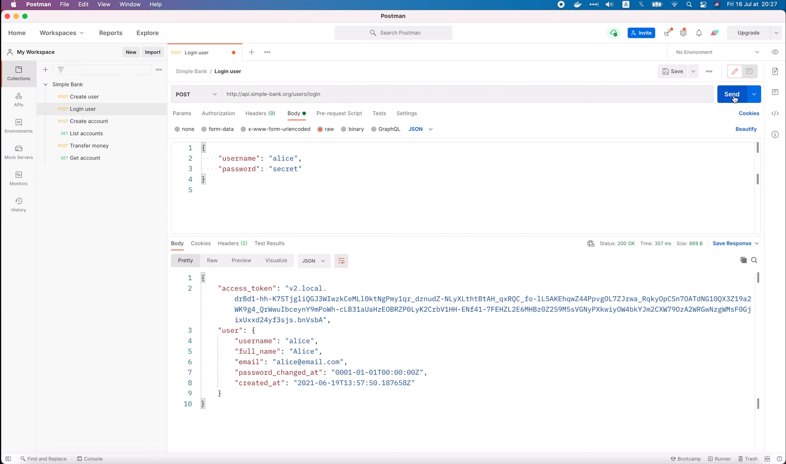

# Автоматическая выдача TLS сертификатов в Kubernetes с помощью Let’s Encrypt

[Оригинал](https://www.youtube.com/watch?v=nU4FTjrgSKI)

Всем привет!

Рад вас снова видеть на мастер-классе по бэкенду.

На [предыдущей лекции](part34-rus.md), мы узнали, как настроить Ingress 
для нашего Kubernetes кластера. Итак, сейчас мы можем отправлять запросы
на API сервер нашего простого банковского приложения, используя его 
доменное имя. Однако соединение между клиентом и сервером по-прежнему 
не защищено. Мы по-прежнему осуществляем вход в систему через обычное 
HTTP-соединение. Это нехорошо, потому что кто-то посередине может легко 
украсть учетные данные пользователей. Чтобы предотвратить это, мы должны 
включить HTTPS, добавив TLS для защиты соединения. И именно этим мы
займёмся на этой лекции.

Но перед тем как продолжить, я настоятельно рекомендую сначала посмотреть вам 
[моё видео](https://www.youtube.com/watch?v=-f4Gbk-U758&list=PLy_6D98if3UINAba67DnhO4055OA6viSb)
о SSL/TLS. Это даст вам полное представление о том как работает TLS,
его криптографическая система и зачем нам нужен TLS сертификат, подписанный
центром сертификации. Обычно нам приходится вручную покупать TLS сертификат
и добавлять его на наш веб-сервер. Это не только дорого, но и на это уходит
немало времени. И поскольку это делается вручную, иногда мы можем забыть 
обновить сертификат по истечении срока его действия.

## Создаём TLS-сертификаты

Так может ли система автоматически создавать или обновлять TLS сертификаты?
На самом деле - да. В Kubernetes для этого мы можем использовать расширение
под названием [cert-manager](https://cert-manager.io/). Диспетчер 
сертификатов может выдавать сертификаты из нескольких поддерживаемых 
источников, таких как Let's Encrypt, Hashicorp Vault и Venafi. Он 
гарантирует, что сертификаты действительны и актуальны, и автоматически 
продлевает сертификаты в момент времени, который можем настроить, до 
истечения срока их действия. Мало того, если мы используем сертификаты от 
Let's Encrypt, то они ещё и бесплатны. Звучит потрясающе, правда?

Но если сертификат бесплатен, то как [Let's Encrypt](https://letsencrypt.org/how-it-works/)
зарабатывает деньги? Что ж, большая часть финансирования поступает от 
корпоративного спонсорства, а это означает, что существует много компаний, 
использующих сервис Let's Encrypt. Им он нравится, поэтому они готовы 
добровольно перечислить какие-то денежные суммы Let's Encrypt. И благодаря 
этому Let's Encrypt может продолжать предоставлять услуги бесплатно для всех.

Итак, теперь давайте узнаем, как на самом деле работает Let's Encrypt!

По сути, Let's Encrypt использует протокол ACME, позволяющий настроить 
HTTPS-сервер и автоматически получить доверенный сертификат от браузера без 
какого-либо вмешательства человека. ACME расшифровывается как
Automated Certificate Management Environment (Автоматизированная Среда 
Управления Сертификатами).

Вот как ACME выполняет проверку домена: сначала программное обеспечение 
агента или, в нашем случае, cert-manager, взаимодействует с Let's Encrypt. 
Он генерирует новую пару ключей и доказывает CA (Центру сертификации (ЦС)), 
что сервер контролирует домен.

Как он может это доказать? ЦС Let's Encrypt попросит cert-manager выполнить
одну или несколько задач. Например, предоставить DNS-запись внутри домена
или HTTP-ресурс с определённым URI внутри домена. Одновременно с этим ЦС
также предоставляет одноразовый пароль, который агент должен подписать 
приватным ключом, чтобы доказать, что он владеет этой парой ключей. Если 
вы не знаете принцип работы публичных и приватных ключей, посмотрите моё
[видео о TLS](https://www.youtube.com/watch?v=-f4Gbk-U758&list=PLy_6D98if3UINAba67DnhO4055OA6viSb).


Затем агент пытается выполнить задачу для проверки прав на домен. Например, 
если выбран тип проверки HTTP-01, то агент создаст файл по определённому 
пути внутри домена и подпишет полученный одноразовый пароль своим приватным
ключом. Как только эти пункты выполнены - агент уведомляет Центр Сертификации 
о завершении проверки. Далее, Центр Сертификации проверяет, всё ли было 
сделано верно. Проверяется: корректность цифровой подписи на одноразовом 
пароле и возможность скачать созданный файл по определённому пути на сервере,
а также его содержимое.


Проверка прошла успешно, если и подпись, и содержимое файла верны. Это 
позволит агенту авторизоваться, чтобы использовать свою пару ключей, для 
выдачи или отзыва TLS сертификатов указанного домена.

Если вы смотрели мое видео о TLS, то вы уже знаете, как выдаются TLS 
сертификаты. По сути, агент (или cert-manager) создает запрос на подпись 
сертификата (или CSR), чтобы попросить ЦС выдать сертификат для доменного 
имени с авторизованным публичным ключом. Затем CSR подписывается 
авторизованным приватным ключом из той же пары. Таким образом, ЦС Let's 
Encrypt сможет проверить CSR и подпись. Если всё в порядке, выпускается
новый TLS сертификат для домена и он отправляется агенту. Процесс отзыва 
сертификата происходит аналогично.



Итак, теперь вы понимаете, как работает Let’s Encrypt.

Самым важным во всем процессе является этап проверки, когда агенту 
необходимо выполнить ряд [задач](https://letsencrypt.org/docs/challenge-types/).

Мы уже упоминали о проверке HTTP-01. Её очень легко автоматизировать без 
дополнительных знаний о конфигурации домена. Но если у вас несколько 
веб-серверов, вы должны убедиться, что файл доступен на каждом из них.
Это не проблема, если мы используем Kubernetes, потому что это будет 
сделано автоматически `cert-manager`.

Однако Let’s Encrypt не позволит вам использовать проверку HTTP-01 для
выдачи wildcard-сертификатов. Поэтому, если вам нужны wildcard-сертификаты,
то вы должны использовать другой тип проверку, а именно DNS-01. В этом 
случае вам нужно доказать, что вы контролируете DNS для своего доменного 
имени, указав определенное значение в TXT-записи для этого доменного имени.
Для этого на странице `Hosted zones` AWS Route53 мы можем создать новую 
запись и выбрать TXT из списка типов записей.


После настройки ЦС Let's Encrypt будет запрашивать у DNS системы эту 
запись домена. Если значения совпадают, то агент будет авторизован для 
выдачи TLS сертификата.

Проверку DNS-01 немного сложнее настроить, чем HTTP-01, но она работает для 
случаев, когда нельзя использовать HTTP-01, например, при выдачи 
wildcard-сертификатов.

Однако, поскольку для нас автоматизация выдачи и продления сертификатов 
действительно важна, мы должны использовать запрос DNS-01 только в том 
случае, если у поставщика DNS есть API для автоматизации обновлений записей.
На этой лекции я просто покажу вам как использовать проверку HTTP-01, так
как она намного проще и нам не нужен wildcard-сертификат для нашего простого 
банковского сервиса.

Итак, первый шаг, который нам нужно сделать, это установить расширение 
`cert-manager` в наш Kubernetes кластер. `Cert-manager` работает в кластере 
как набор ресурсов развертывания. И он использует пользовательские 
определения ресурсов для настройки центров сертификации и запроса 
сертификатов. Мы развертываем его с помощью обычного YAML манифеста, как 
и любое другое приложение в Kubernetes. Итак, давайте скопируем эту 
команду `kuberctl apply` и запустим ее в терминале, чтобы развернуть 
всё, включая определения пользовательских ресурсов, `cert-manager` и 
компонент веб-хуков.

```shell
kubectl apply -f https://github.com/cert-manager/cert-manager/releases/download/v1.8.0/cert-manager.yaml
```


Хорошо, это сделано.

Теперь давайте откроем консоль `k9s`, чтобы проверить правильность 
установки. Я переключу пространство имен на `cert-manager`.


Здесь вы видите три запущенных пода: `cert-manager`, `cainjector` и
`webhook`. Таким образом, я считаю, что расширения были установлены 
правильно. Далее мы узнаем как настроить и развернуть издателя сертификата
в кластере. На [этой странице](https://cert-manager.io/docs/configuration/) 
выберите [ACME](https://cert-manager.io/docs/configuration/acme/), потому
что Let's Encrypt использует этот протокол. Затем прокрутите немного вниз,
и мы увидим пример создания [базового издателя ACME](https://cert-manager.io/docs/configuration/acme/#creating-a-basic-acme-issuer).
Скопируем его содержимое и откроем наш проект `simple-bank`.

```yaml
apiVersion: cert-manager.io/v1
kind: ClusterIssuer
metadata:
  name: letsencrypt-staging
spec:
  acme:
    # You must replace this email address with your own.
    # Let's Encrypt will use this to contact you about expiring
    # certificates, and issues related to your account.
    email: user@example.com
    server: https://acme-staging-v02.api.letsencrypt.org/directory
    privateKeySecretRef:
      # Secret resource that will be used to store the account's private key.
      name: example-issuer-account-key
    # Add a single challenge solver, HTTP01 using nginx
    solvers:
    - http01:
        ingress:
          class: nginx
```

В папке `eks` я создам новый файл: `issuer.yaml` и вставлю скопированное 
содержимое. Первая строка файла - версия API: `cert-manager.io/v1`. Далее
тип ресурса — `ClusterIssuer`

```yaml
apiVersion: cert-manager.io/v1
kind: ClusterIssuer
```

что означает, что ресурс будет работать для всех пространств имен в кластере.
Если установить просто `Issuer`, то он будет работать только для одного 
пространства имен. Затем мы должны задать имя ресурса в разделе `metadata`.
Здесь он назван `letsencrypt-staging`, потому что файл с примером кода 
предназначен только для тестирования, поэтому URL-адрес сервера указывает 
здесь на API `acme-staging`. Этот API будет возвращать только не настоящие 
сертификаты. Но в нашем случае мы хотим развернуть ресурс в продакшене и 
выдать настоящие сертификаты. Поэтому я изменю его имя на `letsencrypt`.
И давайте также удалим `staging` из URL-адреса сервера.

```yaml
metadata:
  name: letsencrypt
```

Хорошо, теперь я удалю эти комментарии

```yaml
# You must replace this email address with your own.
# Let's Encrypt will use this to contact you about expiring
# certificates, and issues related to your account.
```

и заменю этот пример электронной почты `user@example.com` электронной 
почтой Tech School.

```yaml
spec:
  acme:
    email: techschool.guru@gmail.com
```

Теперь мы должны сделать одну важную вещь — задать имя ресурса, который 
будет использоваться для хранения приватного ключа учетной записи.
Я назову его `letsencrypt-account-private-key`. Последним шагом является 
выбор `solvers`. В нашем случае мы будем использовать HTTP-01 с `nginx`
`ingress`, который мы настроили в предыдущей лекции.

```yaml
spec:
  ...
    solvers:
      - http01:
          ingress:
            class: nginx
```

Так что менять ничего не надо.

Давайте перейдём в терминал и выполним команду `kubectl apply`, чтобы 
развернуть издателя.

```shell
kubectl apply -f eks/issuer.yaml
clusterissuer.cert-manager.io/letsencrypt created
```

Итак, издатель для кластера создан. Давайте проверим это в консоли `k9s`.
Я поищу по ключевому слову `clusterissuer`.


Вот он! Учетная запись ACME была зарегистрирована на сервере ACME.

Мы можем получить более подробную информацию, описав его.


Зарегистрированный адрес электронной почты совпадает с тем, который мы 
указали в `yaml` файле. Мы также можем найти его приватный ключ в списке
`Secrets`.




Итак, теперь издатель должен быть готов выдавать TLS сертификаты.

Но если мы посмотрим на список сертификатов в данный момент, он 
по-прежнему пуст.


И то же самое касается списка запросов сертификатов.


Везде пусто.

Это связано с тем, что мы ещё не привязали издателя к Ingress.

Вот что нам нужно сделать: сначала открыть файл `ingress.yaml`, затем в 
разделе `metadata` Ingress добавить новый раздел `annotations` с таким 
содержимым: `cert-manager.io/cluster-issuer`, за которым следует название 
только что созданного издателя, то есть `letsencrypt`.

```yaml
metadata:
  name: simple-bank-ingress
  annotations:
    cert-manager.io/cluster-issuer: letsencrypt
```

Далее, в `spec`, я добавлю новый раздел для TLS.

В этом разделе мы должны указать имя домена и место хранения его сертификатов.
В нашем случае «hosts» или доменное имя должно быть «api.simple-bank.org», а 
его сертификаты будут храниться в конфиденциальных данных с таким 
названием: `simple-bank-api-cert`.

```yaml
spec:
  ...
  tls:
    - hosts:
        - api.simple-bank.org
        secretName: simple-bank-api-cert
```

Хорошо, думаю теперь всё должно заработать как надо!

Давайте выполним `kubectl apply`  в в терминале, чтобы повторно 
развернуть Ingress.

```shell
kubectl apply -f eks/ingress.yaml
ingressclass.networking.k8s.io/nginx unchanged
ingress.networking.k8s.io/simple-bank-ingress configured
```

Ресурс успешно развёрнут. Давайте проверим это в консоли `k9s`.


К сожалению, список запросов сертификатов все ещё пуст. Как и сам список
сертификатов.


Вернёмся к Ingress.


Почему тут тоже пусто?

О, я понял, мы всё ещё в пространстве имен `cert-manager`. Я думаю, что 
Ingress и сертификаты должны быть в другом пространстве имен. Итак, давайте 
переключим пространство имен на `all`, чтобы найти их.


Хорошо, давайте поищем Ingress.


Вот он, в пространстве имён `default`. Теперь, если мы выведем подробную 
информацию об Ingress, мы увидим, что TLS включен, и сертификат 
`simple-bank-api` будет использоваться для терминации запросов 
к `api.simple-bank.org`


прежде чем перенаправить их в сервис `simple-bank-api`. В списке событий мы 
также видим событие `CreateCertificate` от `cert-manager`. И в сообщении 
говорится: "Successfully create Certificate simple-bank-api-cert" 
«Успешно создан сертификат simple-bank-api-cert». Так что я думаю, что всё 
работает правильно.

Чтобы убедиться, давайте поищем по ключевому слову `certificate`.


Вот он, сертификат `simple-bank-api` есть в списке! Он актуален и не 
просрочен. Если мы выведем подробную информацию о сертификате и прокрутим 
его до самого низа,


мы увидим время его создания (`Not Before`), истечения срока действия 
(`Not After`) и время, когда оно будет автоматически обновлён (`Renewal 
Time`).

Исходя из этого, похоже, что сертификат действителен около 3 месяцев, и он 
будет продлен за один месяц до истечения срока действия. Здорово, не так ли?

Мы также можем взглянуть на запрос сертификата


который был одобрен ЦС Let's Encrypt как видно на рисунке. Итак, мы 
успешно включили TLS в нашем `simple-bank-ingress`.

Таким образом, теперь веб-сервер будет готов принять HTTPS-запрос на порту
`443` и HTTP-запрос на порт `80`.


Давайте откроем Postman, чтобы протестировать его!

Я собираюсь изменить URL-адрес этого API запроса для входа в систему и 
отправить его.


Вуаля, запрос успешно выполнен. Теперь давайте изменим его обратно на HTTP и 
повторно отправим запрос!



Он также успешно выполнен, как мы и ожидали.

И на этом закончим сегодняшнюю лекцию. Мы успешно установили и настроили 
`cert-manager` для автоматической выдачи TLS сертификатов от Let's Encrypt.
И, таким образом, защитили соединение API-сервиса для нашего простого 
банковского приложения с помощью HTTPS.

Я надеюсь, что лекция была интересной и приобретенные знания будут вам 
полезны.

Большое спасибо за время, потраченное на чтение, и до встречи на следующей 
лекции!