# Automatic deploy to Kubernetes with GitHub Action

[Original video](https://www.youtube.com/watch?v=GVY-zze0V_U)

Hello everyone, and welcome back to the backend master class.
It's been a long journey! We have learned a lot about how to design,
develop and deploy a Golang backend web application from scratch.

However, until now, we're still doing the deployment part manually
by running the `kubectl` command in the terminal. So, in this last 
lecture of the course, I'm gonna show you how to automate it using
GitHub Action.

Alright, let's start!

## Automate deployment using GitHub Action

As you can see, in the previous lectures, we have all the Kubernetes
deployment `yaml` files in the `eks` folder. So all we have to do
now is to install `kubectl` in the GitHub Action, then use it to 
deploy these files to the production cluster. To do that, let's open
the GitHub `deploy` workflow file.

First, I'm gonna rename this `build` job to `deploy`, because now we're
not just building the image, but we're also deploying it.

```yaml
jobs:

  deploy:
    name: Build image
    runs-on: ubuntu-latest
```

Then we will search for `kubectl` action in the GitHub Marketplace.


There are several results, but I'm gonna use the [Kubectl tool installer
from Azure](https://github.com/marketplace/actions/kubectl-tool-installer).

So let's open it, and copy this code snippet.

```yaml
- uses: azure/setup-kubectl@v1
  with:
    version: '<version>' # default is latest stable
  id: install
```

OK, now in our `deploy.yaml` file, let's add a new step. I'm gonna
name it `Install kubectl` and paste in the code snippet that we've
just copied.

```yaml
    - name: Install kubectl
    - uses: azure/setup-kubectl@v1
  with:
    version: '<version>' # default is latest stable
  id: install
```

Let's fix the indentation.

```yaml
    - name: Install kubectl
      uses: azure/setup-kubectl@v1
      with:
        version: '<version>' # default is latest stable
      id: install
```

Then we should put the latest version of Kubernetes here. You can
use this link to find out the [latest stable version](https://storage.googleapis.com/kubernetes-release/release/stable.txt).
In my case, it is 1.21.3.

```yaml
    - name: Install kubectl
      uses: azure/setup-kubectl@v1
      with:
        version: 'v1.21.3' # default is latest stable
      id: install
```

Alright, after this step, `kubectl` will be installed on the GitHub 
runner machine.

Next step, we will deploy the Docker image from ECR to our EKS
cluster. This step should be run at the end of the workflow. Here
I use a pipe because we're gonna run multiple commands to deploy
different types of resources to the cluster.

First, the `aws-auth` resource. For now, we only use it to grant
`github-ci` user access to the cluster, but later, you can add
more users to this file if you want.

So let's copy its name and in the `deploy` workflow, we're gonna
run `kubectl apply -f eks/aws-auth.yaml` to deploy it.

```yaml
    - name: Deploy image to Amazon EKS
      run: |
        kubectl apply -f eks/aws-auth.yaml
```

The second thing we must deploy is the `deployment` resource. This 
resource will manage the deployment of our `simple-bank` API 
container. Here you can see that it will download this specific 
image tag from ECR.

```yaml
spec:
  containers:
    - name: simple-bank-api
      image: 095420225348.dkr.ecr.eu-west-1.amazonaws.com/simplebank:25d22b979a8876906cdbf57b16aa92d265ee46fb
      ports:
        - containerPort: 8080
```

But in fact, what we want is, whenever we push new changes to the 
`master` branch, it will build and tag the image as latest version,
and that latest version image should be redeployed to the Kubernetes
cluster. So here we should change the tag to `latest`.

```yaml
spec:
  containers:
    - name: simple-bank-api
      image: 095420225348.dkr.ecr.eu-west-1.amazonaws.com/simplebank:latest
      ports:
        - containerPort: 8080
```

And because of this change, we must also update the build and 
push image step. By now, every image has a different tag, 
corresponding to the commit ID on the `master` branch. We will
change it a bit so that the new image will also be tagged as 
`latest`, and then use the `all-tags` option to push all of the
tags to Amazon ECR. To do that, in the `docker build` command 
let's add `-t latest` and in the `docker push` command, let's
add `-a` option. We should also remove the $IMAGE_TAG at the 
end of the image name.

```yaml
    - name: Build, tag, and push image to Amazon ECR
        ...
        run: |
          docker build -t $ECR_REGISTRY/$ECR_REPOSITORY:$IMAGE_TAG -t latest .
          docker push -a $ECR_REGISTRY/$ECR_REPOSITORY
```

OK, now we can use the `kubectl` command to apply the 
`deployment.yaml` to production.

```yaml
      run: |
        kubectl apply -f eks/aws-auth.yaml
        kubectl apply -f eks/deployment.yaml
```

Next, we do the same thing to deploy `service.yaml` to the cluster.
Then the `issuer.yaml` to manage the TLS certificates. And finally, the
`ingress.yaml` to route external traffic to the internal `simple-bank`
API service.

```yaml
      run: |
        kubectl apply -f eks/aws-auth.yaml
        kubectl apply -f eks/deployment.yaml
        kubectl apply -f eks/service.yaml
        kubectl apply -f eks/issuer.yaml
        kubectl apply -f eks/ingress.yaml
```

Alright, I think that should be it!

All of our resources have been added to the step in the 
`deploy` workflow.

Let's open the terminal and push these changes to GitHub. 
First I'm gonna create a new branch called `ft/ci-deploy`.

```shell
git checkout -b ft/ci-deploy
```

Then add all the changes

```shell
git add .
```

Commit it with this message: "update github-ci to deploy to amazon EKS"

```shell
git commit -m "update github-ci to deploy to amazon EKS"
```

And finally, push the new branch to GitHub.

```shell
git push origin ft/ci-deploy
```

Now let's open this URL `https://github.com/techschool/simplebank/pull/new/ft/ci-deploy`
to create a pull request to merge it to `master`.

OK, the PR has been created. Let's review it a bit!

We've changed the job's name to `deploy`, added a step to install
`kubectl`. Rebuild the Docker image with the latest tag, push
the image with all of its tags to Amazon ECR. And finally, use
`kubectl` command to deploy the image to production Kubernetes
cluster on Amazon EKS.

There are also some small changes I made in the `README` file,
but we don't need to care about them.

However, we should pay attention to the `deployment.yaml`, as we're
specifying here, it will pull the image with the `latest` tag
from ECR.


But in case there's already an image with the `latest` tag
on the local machine, Kubernetes will just use it, and not
try to pull the image from ECR.

This might be a problem because we're now tagging every new
image with the same `latest` tag.

So what happens is, although the `latest` tag is the same, 
its associated image will be different.

Therefore, we have to add 1 more thing to the `deployment.yaml`
file. It's called `imagePullPolicy`. And we must set it to 
"Always" to make sure that Kubernetes will always pull the latest
image from ECR before deploying new containers.

```yaml
spec:
  ...
    spec:
      containers:
        - name: simple-bank-api
          image: 095420225348.dkr.ecr.eu-west-1.amazonaws.com/simplebank:latest
          imagePullPolicy: Always
          ports:
            - containerPort: 8080
```

Alright, let's open the terminal to add this new change.

```shell
git add .
```

Commit it with this message: "add image pull policy always"

```shell
git commit -m "add image pull policy always"
```

and push it to GitHub.

```shell
git push origin ft/ci-deploy
```

OK, let's go back to our request and refresh.

Here we go, the image pull policy has been added.


All other `yaml` files of the Ingress, the issuer, and the service
look good to me.

So it's time to merge the PR to see how it goes. But note that
you must sure that the `github-ci` user has enough permissions
to deploy changes to the EKS cluster.

This is something we've done in one of the previous lectures.

As you can see here, in the IAM service, 

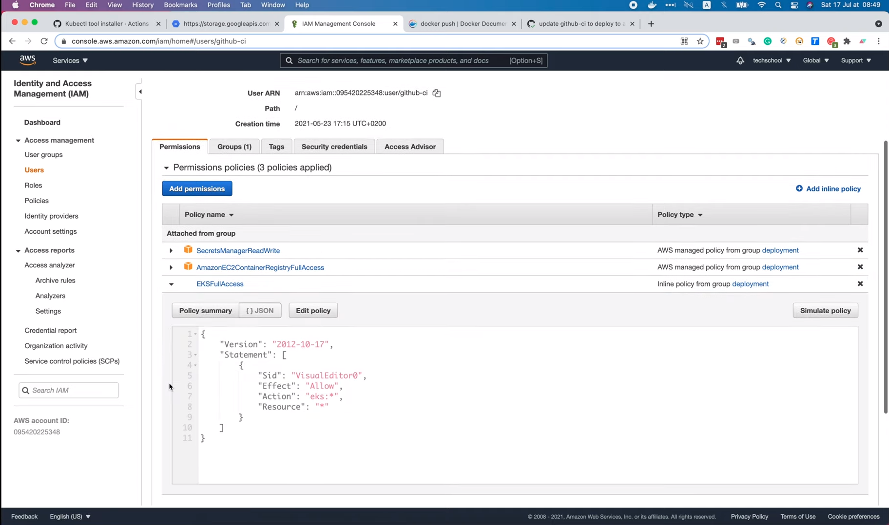

my `github-ci` user already has Full Access to the EKS cluster.

OK, so let's go ahead and click `Squash and Merge`.


Confirm it. And delete the feature branch.

Now if we open the `master` branch of the repo, we can see that 
the CI/CD process to build and deploy a new image to production
has been started. Let's follow this link to see more details.

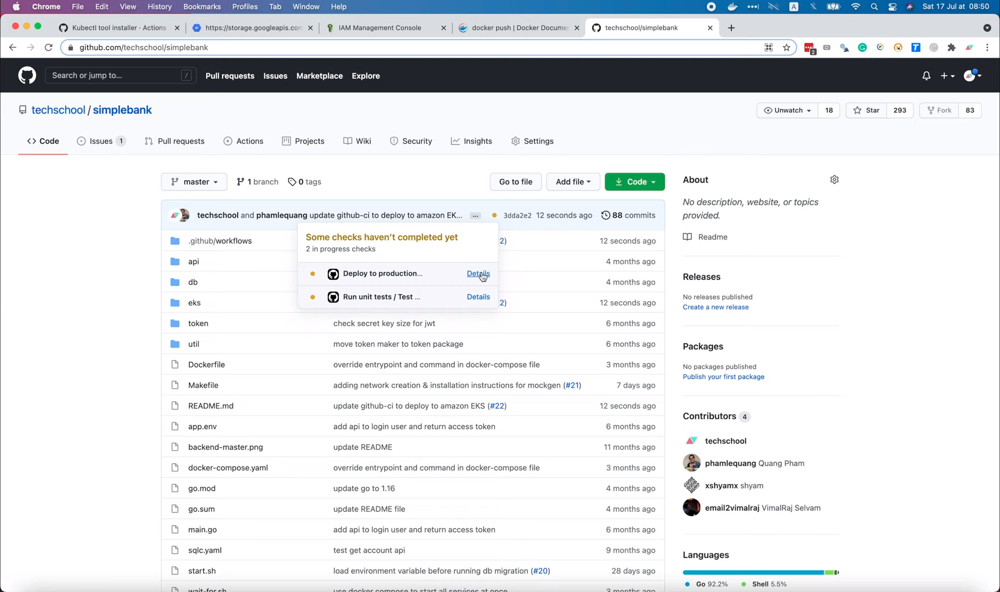

OK, the image is being built.

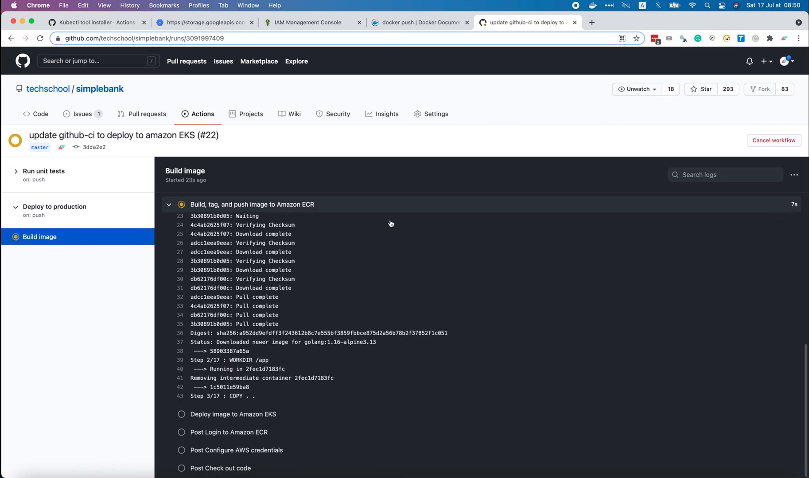

It will take a while for it to complete.

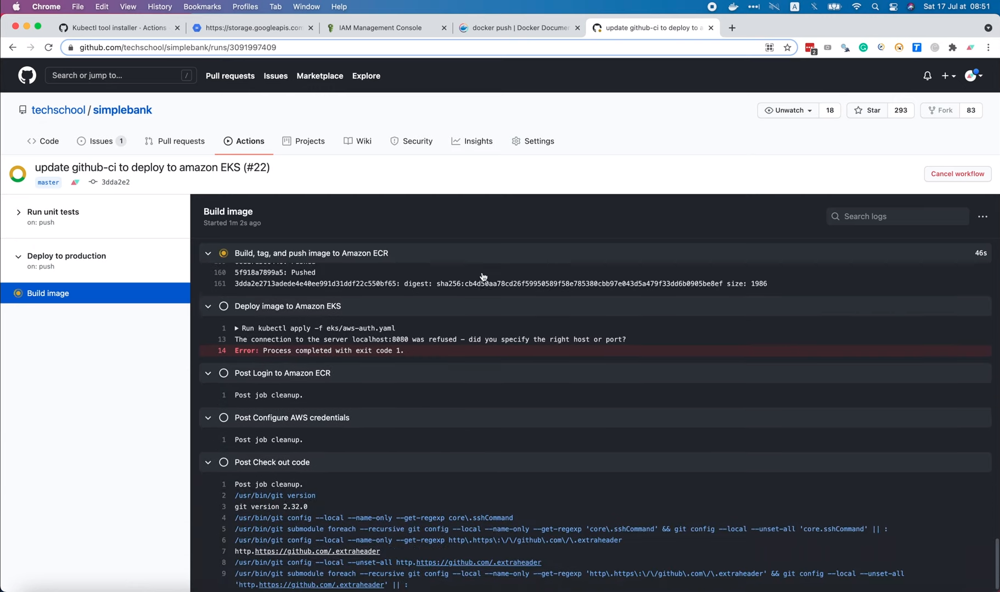

Oops, looks like the workflow failed. The image has been pushed
to ECR, but somehow, it failed to deploy the image to EKS.

First, let's open Amazon ECR to check the image.

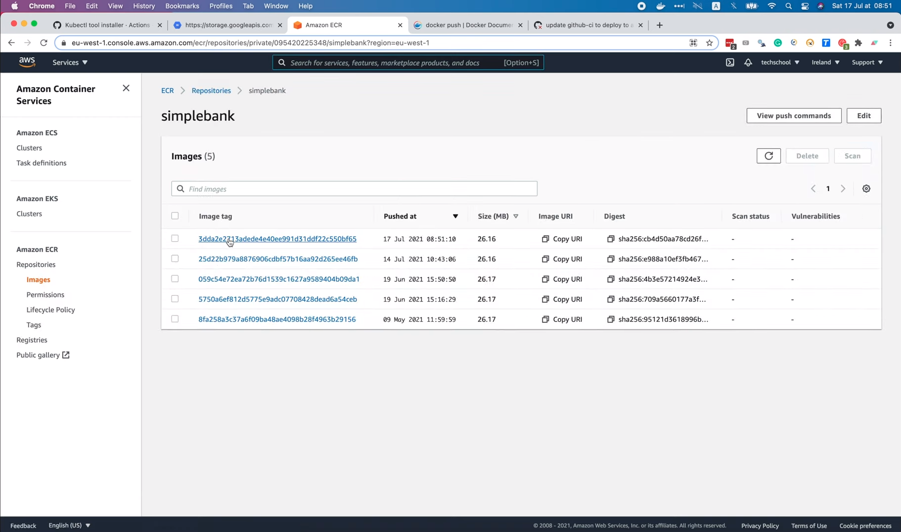

Here we can see a new image, but it doesn't have the `latest` tag.

It only has 1 tag, which is the commit hash as usual. So this is
one of the problems we must fix.

Now let's see more details in the falling step.

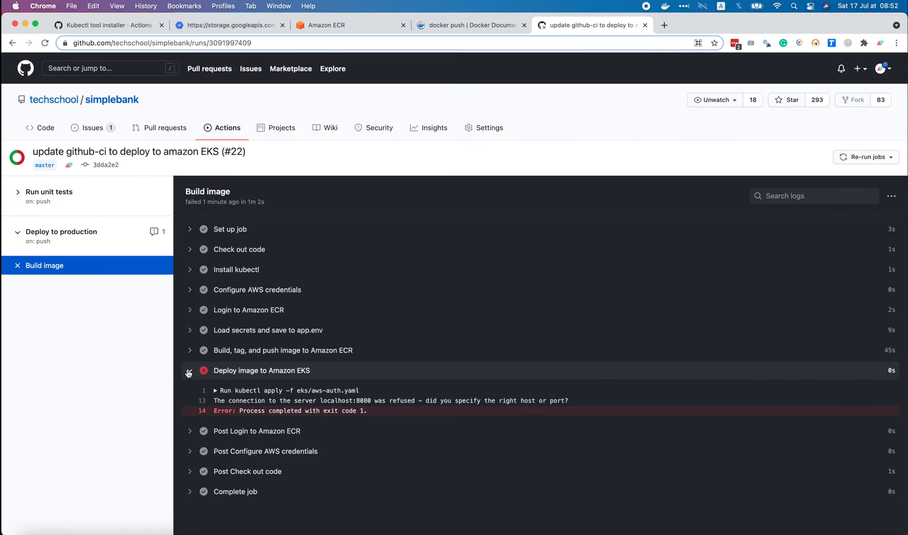

It says "The connection to server localhost was refused."

So it seems that `kubectl` is trying to connect to a cluster
on `localhost` instead of the production EKS cluster. That's 
because I forgot 1 step to update `kubeconfig` to point to the
production cluster.

We can find the production cluster's info in the AWS console.


Then let's open the `deploy` workflow and add a new step.

I'm gonna name it "Update kube config". And we will run this command:

```
aws eks update-kubeconfig
```

followed by the name of the cluster, which is `simple-bank`, and
its region, which is `eu-west-1`.

```yaml
    - name: Update kube config
      run: aws eks update-kubeconfig --name simple-bank --region eu-west-1
```

That would fix 1 of our problems.

The 2nd one is the `latest` tag of the image is not being 
pushed to ECR as we expected.

Let's look into the logs of the build image step to find
out why. The logs is quite long, but if we scroll down to the
tagging part, we can see that it's has been tagged with the correct
commit hash here.

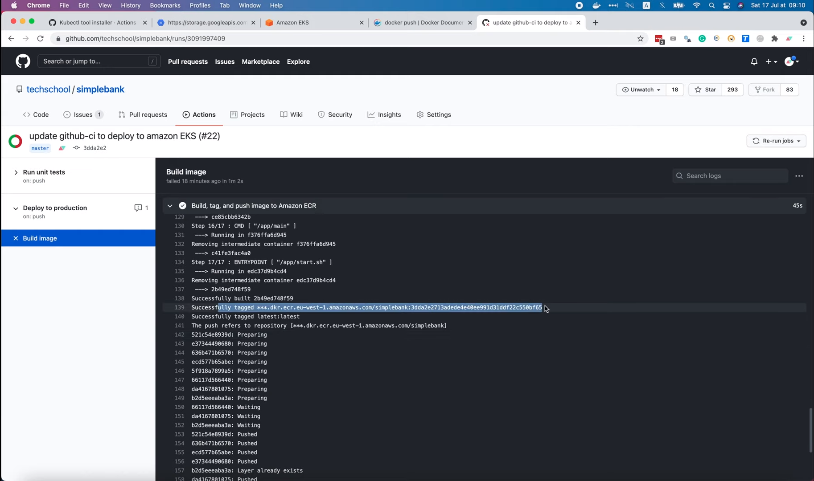

But the `latest` tag doesn't look good. Its image name is also 
"latest" instead of the link to ECR as the one above. So we've
found the issue. Let's go back to the `deploy` workflow.

Here we have to fix the tag

```yaml
        run: |
          docker build -t $ECR_REGISTRY/$ECR_REPOSITORY:$IMAGE_TAG -t latest .
          docker push -a $ECR_REGISTRY/$ECR_REPOSITORY
```

by adding the correct image name to its prefix just like that

```yaml
        run: |
          docker build -t $ECR_REGISTRY/$ECR_REPOSITORY:$IMAGE_TAG -t $ECR_REGISTRY/$ECR_REPOSITORY:latest .
          docker push -a $ECR_REGISTRY/$ECR_REPOSITORY
```

and I think we're good to go.

Now let's save the file, and push it to GitHub. I'm gonna
add the change we've just made,

```shell
git add .
```

commit it with a message saying "fix image tag and update kube 
config"

```shell
git commit -m "fix image tag and update kube config"
```

Then

```shell
git push origin ft/ci-deploy
```

Alright, now we have to create a new pull request to merge 
the fix to `master`.

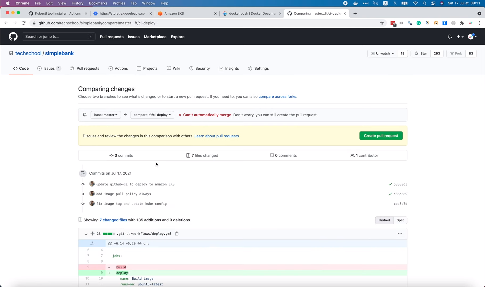

Oh, looks like the PR cannot be merged automatically.

The reason is that we've previously used `Squash and merge`, so the
commit history on our local machine is different from the one on
GitHub's `master` branch.

To fix this, we have to rebase our branch with the latest version of
`master` branch.

So first I will checkout the `master` branch on local, run 

```shell
git pull
```

to fetch and merge all the new changes from the remote `master` 
branch on GitHub to our local `master` branch.

Then check out the `ft/ci-deploy` branch, and run

```shell
git rebase master
```

Of course, there will be some conflicts because the commit
history is different. So let's fix it!

The conflict is in the `deployment.yaml` file.

Here we can see the Current Change and the Incoming Change.


In this case, it's pretty simple, since we only add a new image
pull policy. So let's just accept the Current Change.

OK, now go back to the terminal and check the status

```shell
git status
```


The conflict has been resolved. So we can just add the fix, and then 
run

```shell
git rebase --continue
```

to complete the rebase process.

Alright, now let's push the change to GitHub.

```shell
git push origin ft/ci-deploy
```

Note that it won't work if we just push as normal, because the 
commit history has been rewritten when we rebase with the 
`master` branch.

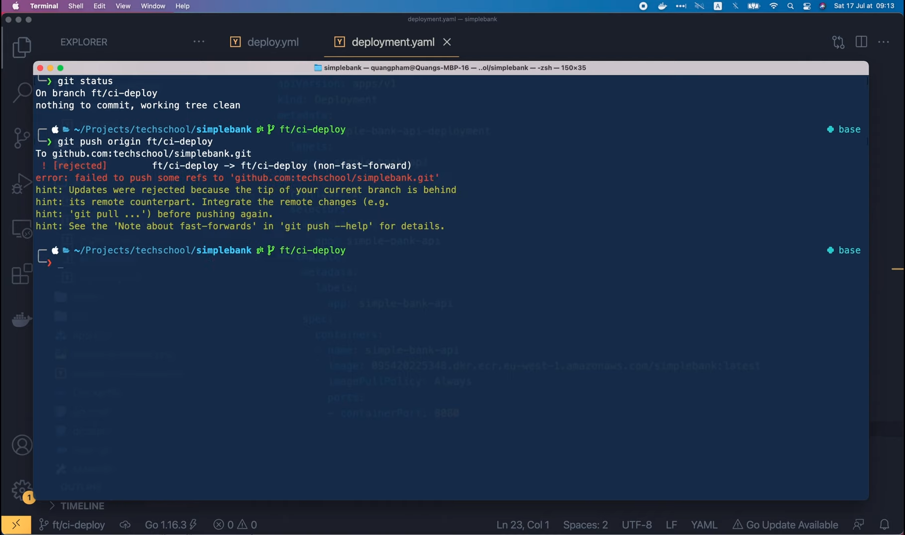

So local commit history will be different from the one on GitHub.
We have to use `-f` option to force GitHub to replace the change
history.

```shell
git push -f origin ft/ci-deploy
```

And voilà, the change has been pushed successfully. It's kind 
of painful, but sometimes we might need to do it. We can avoid
this situation by always pulling the latest changes from the 
remote `master` branch first, before creating a new branch.

OK, now the changes look good on GitHub, we can go ahead and
create the pull request.

Let's review it! Here we have corrected the way we tag the `latest`
image,


and here we have updated the kube config to point to the Amazon 
EKS cluster.


Everything looks good to me! So it's time to merge the PR. OK,
the unit tests succeeded. Let's `Squash and merge`!


Confirm it! And delete the feature branch.

Alright, now let's see how the `deploy` workflow run. The
image is being built at the moment. While waiting for it 
to complete, we can go to Amazon ECR, and open the `simple-bank`
repository.

Once the new image is pushed, it will show up here.

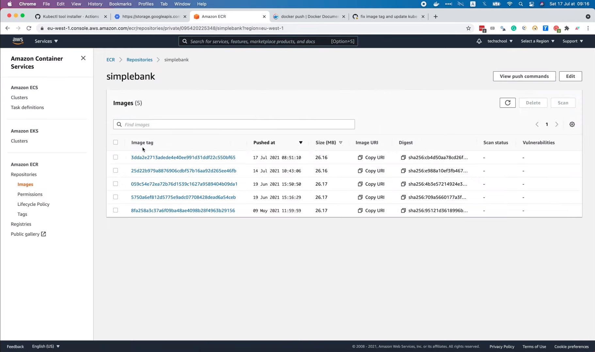

OK, back to the workflow. The image is being pushed to
ECR.

Now the `Update kube config` step is done, then the image is 
being deployed to Amazon EKS.


And a bit later, everything is done.

The workflow is completed successfully this time.


Awesome! If we look at the logs of the build image step, we 
can see that it has been tagged correctly with the `latest`
tag.


And if we refresh the ECR repo page, we can see the newest image
with 2 tags: 1 is the commit hash, and the other is `latest`.


That's exactly what we expected.

Cool, now let's open the `k9s` console to verify that the correct
image is deployed to production!

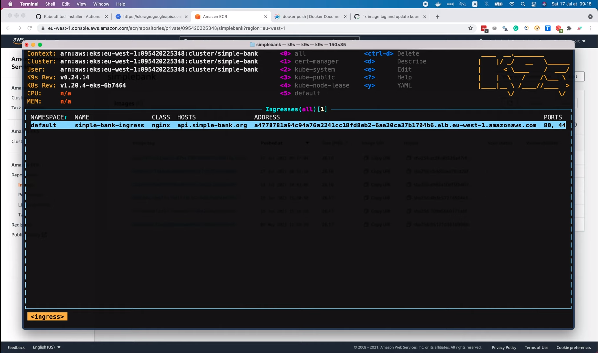

I'm gonna search for all services.

Then open the `simple-bank` API service in the list.


As you can see, 2 pods of this service are up and running.

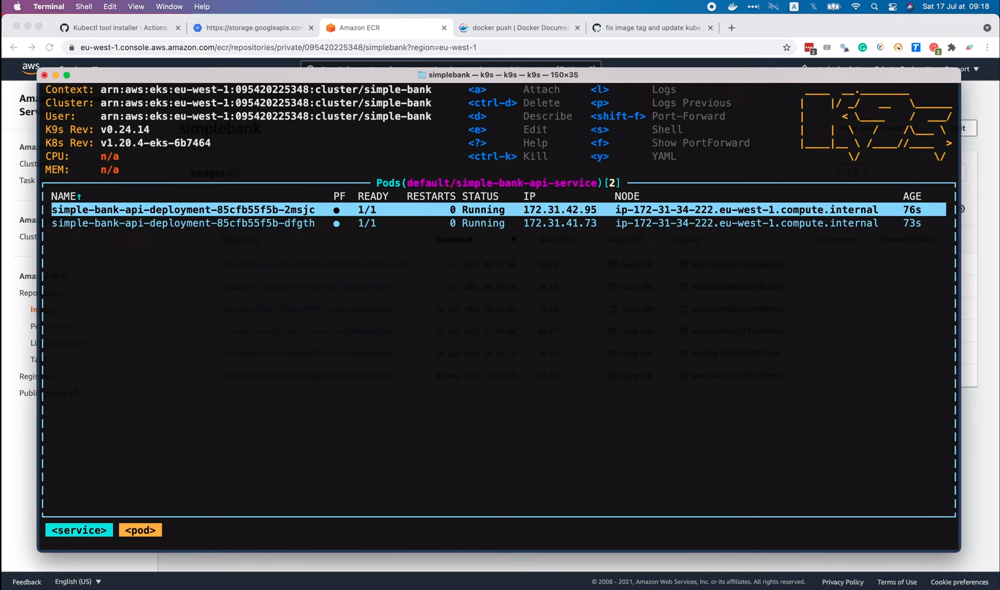

Let's describe this pod. And look at the image! It has the
`latest` tag, exactly as we wanted.

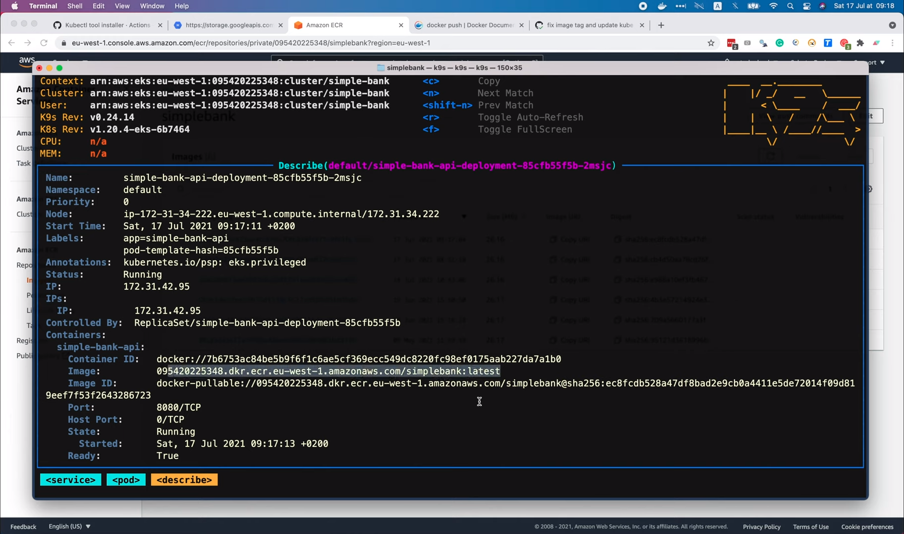

We can also check the image ID to see if it's using the correct
`latest` image or not. Here we can see its full commit hash.

Let's compare it with the one on ECR page. We have to open the
image details to see its full digest hash.

You can easily see that it matches the one that we see in `k9s`
console.

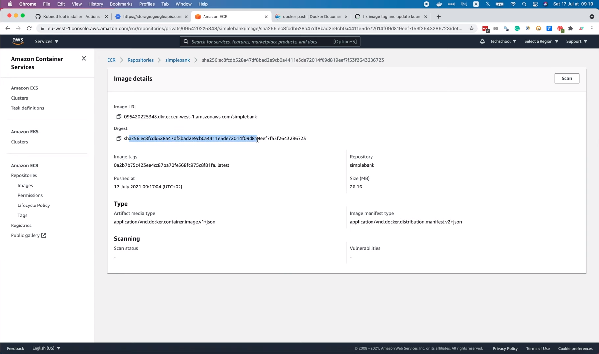

Perfect! Let's do 1 last step to verify that the API is working 
well.

I'm gonna open Postman, and send the login request that we've 
already prepared in the previous lecture.

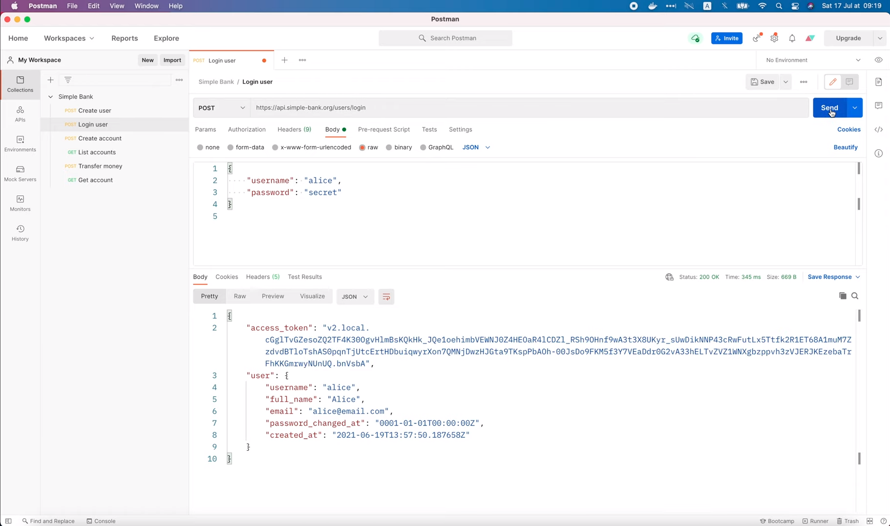

Awesome! It's successful!

And this brings us to the end of this video. It is also the 
end of the backend master class course.

I know it still doesn't cover everything you need to know
about backend development.

There are still a lot of advanced topics I want to share with
you. But I guess it would be more suitable to make them in
another course.

Anyway, I hope you have enjoyed this backend master class, 
and hope that it can help you somehow in your projects.

Thanks a lot for watching, happy learning! And see you in the
next course!