# Автоматическое развертывание в Kubernetes с помощью GitHub Action

[Оригинал](https://www.youtube.com/watch?v=GVY-zze0V_U)

Всем привет и добро пожаловать на мастер-класс по бэкенду. Этот мастер-класс 
проходит уже довольно долго и вот мы на финишной прямой! Мы многое узнали 
о том, как проектировать, разрабатывать и развертывать серверное 
веб-приложение Golang с нуля. 

Однако до сих пор мы все ещё выполняем часть развертывания вручную, 
запуская команду `kubectl` в терминале. Итак, на этой последней лекции 
курса я покажу вам, как автоматизировать его с помощью GitHub Action.

Итак, давайте начнём!

## Автоматизируем развёртывание с помощью GitHub Action

Как видите, на предыдущих лекциях все `yaml` файлы развертывания Kubernetes 
находились в папке `eks`. Итак, все, что нам нужно сделать сейчас, это 
установить `kubectl` в GitHub Action, а затем использовать его для 
развертывания этих файлов в продакшен кластере. Для этого давайте откроем 
файл рабочего процесса GitHub `deploy`.

Во-первых, я переименую задание `build` на `deploy`, потому что теперь мы 
не только собираем образ, но и развертываем его.

```yaml
jobs:

  deploy:
    name: Build image
    runs-on: ubuntu-latest
```

Затем давайте поищем по ключевому слову `kubectl` в GitHub Marketplace.

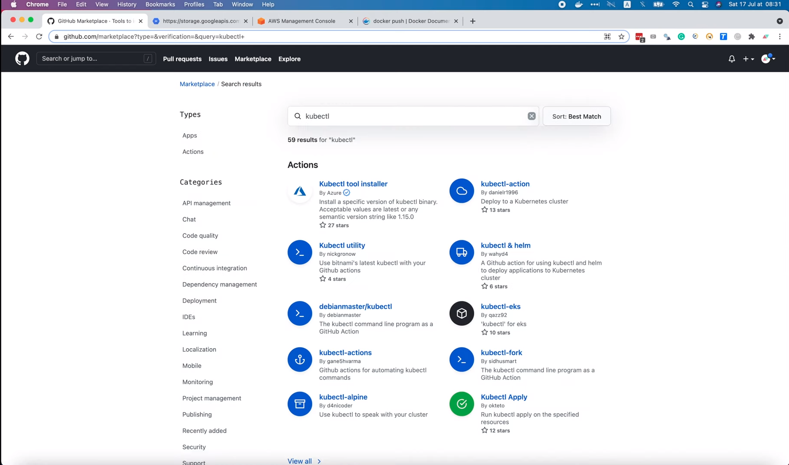

Поиск выдал несколько результатов, но я собираюсь использовать [установщик
инструмента командной строки Kubectl от Azure](https://github.com/marketplace/actions/kubectl-tool-installer).

Итак, давайте откроем его и скопируем этот фрагмент кода.

```yaml
- uses: azure/setup-kubectl@v1
  with:
    version: '<version>' # default is latest stable
  id: install
```

Хорошо, теперь в наш файл `deploy.yaml` давайте добавим новый шаг. Я назову 
его `Install kubectl` («Установка kubectl») и вставлю фрагмент кода, который 
мы только что скопировали.

```yaml
    - name: Install kubectl
    - uses: azure/setup-kubectl@v1
  with:
    version: '<version>' # default is latest stable
  id: install
```

Давайте исправим отступ.

```yaml
    - name: Install kubectl
      uses: azure/setup-kubectl@v1
      with:
        version: '<version>' # default is latest stable
      id: install
```

Затем мы должны установить сюда последнюю версию Kubernetes. По этой ссылке
можно определить [последнюю стабильную версию](https://storage.googleapis.com/kubernetes-release/release/stable.txt).
В моем случае она равна 1.21.3.

```yaml
    - name: Install kubectl
      uses: azure/setup-kubectl@v1
      with:
        version: 'v1.21.3' # default is latest stable
      id: install
```

Таким образом, после этого шага kubectl будет установлен на GitHub 
исполнителе.

На следующем шаге мы развернём Docker образ из ECR на нашем EKS кластере.
Этот шаг следует выполнять в конце рабочего процесса. Здесь я использую
«|», потому что мы собираемся запустить несколько команд для развертывания 
различных типов ресурсов в кластере.

Во-первых, ресурс `aws-auth`. На данный момент мы используем его только, чтобы  
предоставить пользователю `github-ci` доступ к кластеру, но позже вы можете 
добавить в этот файл других пользователей, если хотите.

Итак, давайте скопируем его название и в рабочем процессе `deploy` выполним
`kubectl apply -f eks/aws-auth.yaml`, чтобы развернуть его.

```yaml
    - name: Deploy image to Amazon EKS
      run: |
        kubectl apply -f eks/aws-auth.yaml
```

Затем мы должны развернуть ресурс `deployment`. Этот ресурс будет 
управлять развертыванием нашего контейнера с API `simple-bank`. Здесь во 
фрагменте кода видно, что загружается образ с указанным тегом из ECR. 

```yaml
spec:
  containers:
    - name: simple-bank-api
      image: 095420225348.dkr.ecr.eu-west-1.amazonaws.com/simplebank:25d22b979a8876906cdbf57b16aa92d265ee46fb
      ports:
        - containerPort: 8080
```

Но на самом деле мы хотим, чтобы всякий раз, когда мы отправляем новые 
изменения в ветку `master`, собирался образ и он помечался тегом `latest` и
этот `latest` образ должен быть затем развернут в кластере Kubernetes. 
Поэтому здесь мы должны изменить тег на `latest`.

```yaml
spec:
  containers:
    - name: simple-bank-api
      image: 095420225348.dkr.ecr.eu-west-1.amazonaws.com/simplebank:latest
      ports:
        - containerPort: 8080
```

И из-за этого изменения мы также должны модифицировать шаг сборки и 
отправки образа. Сейчас каждый образ имеет свой отличный от других тег, 
соответствующий идентификатору коммита в ветку `master`. Мы немного 
модифицируем код, чтобы новый образ также помечался как `latest`, а затем
воспользуемся параметром `all-tags`, чтобы передать все теги в Amazon ECR.
Для этого в команду `docker build` добавим `-t last`, а в команду `docker 
push` добавим параметр `-a`. Мы также должны удалить $IMAGE_TAG в конце
названия образа для `docker push`.

```yaml
    - name: Build, tag, and push image to Amazon ECR
        ...
        run: |
          docker build -t $ECR_REGISTRY/$ECR_REPOSITORY:$IMAGE_TAG -t latest .
          docker push -a $ECR_REGISTRY/$ECR_REPOSITORY
```

Итак, теперь мы можем использовать команду `kubectl` для добавления
`deployment.yaml` на продакшен.

```yaml
      run: |
        kubectl apply -f eks/aws-auth.yaml
        kubectl apply -f eks/deployment.yaml
```

Далее сделаем то же самое для развертывания `service.yaml` в кластере, а
затем `issuer.yaml` для управления TLS сертификатами. И, наконец,
`ingress.yaml` для перенаправления внешнего трафика на внутренний API сервис
`simple-bank`.

```yaml
      run: |
        kubectl apply -f eks/aws-auth.yaml
        kubectl apply -f eks/deployment.yaml
        kubectl apply -f eks/service.yaml
        kubectl apply -f eks/issuer.yaml
        kubectl apply -f eks/ingress.yaml
```

Хорошо, думаю этого должно быть достаточно!

Все наши ресурсы были добавлены в шаг рабочего процесса `deploy`.

Давайте откроем терминал и отправим эти изменения на GitHub.
Сначала я создам новую ветку под названием `ft/ci-deploy`.

```shell
git checkout -b ft/ci-deploy
```

Затем добавьте все изменения

```shell
git add .
```

Зафиксируйте их со следующим сообщением: "update github-ci to deploy to 
amazon EKS" («обновляем github-ci для развёртывания на Amazon EKS»)

```shell
git commit -m "update github-ci to deploy to amazon EKS"
```

И, наконец, отправьте новую ветку на GitHub.

```shell
git push origin ft/ci-deploy
```

Теперь давайте перейдём по этому `https://github.com/techschool/simplebank/pull/new/ft/ci-deploy`,
чтобы создать пул-реквест для объединения ветки с `master`.
to create a pull request to merge it to `master`.

Итак, был создан PR. Давайте сделаем небольшое код ревью для него.

Мы изменили название задания на `deploy`, добавили шаг для установки
`kubectl`. Заново собрали Docker образ, пометив его тегом `latest`, 
отправили образ со всеми его тегами в Amazon ECR. И, наконец, воспользовались
командой `kubectl` для развертывания образа в продакшен Kubernetes кластере
на Amazon EKS.

Я также внёс небольшое изменения в файл README, но он сейчас для нас не 
важны.

Но следует обратить внимание на файл `deployment.yaml`, поскольку как мы 
указываем здесь на рисунке, будет происходить извлечение образа с тегом 
`latest` из ECR.

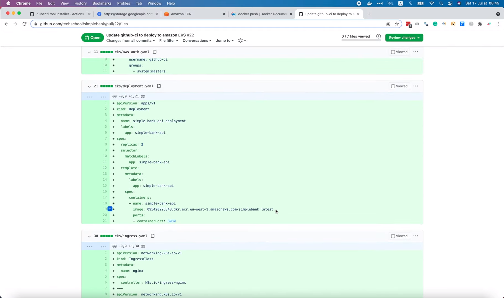

Но если на локальном компьютере уже существует образ с тегом `latest`,
то Kubernetes просто использует его, а не будет пытаться извлечь
образ из ECR.

Необходимо решить эту проблему, потому что теперь мы помечаем каждый новый
образ одним и тем же тегом `latest`.

Итак, объясню ещё раз, хотя мы используем один и тот же тег `latest`, 
связанный с ним образ может отличаться на локальной машине и ECR.

Таким образом, мы должны добавить кое-что в файл `deployment.yaml`. 
А именно правило извлечения образов: `imagePullPolicy`. И задать для него 
значение "Always" («Всегда»), чтобы гарантировать, что Kubernetes всегда 
будет извлекать `latest` образ из ECR перед развертыванием новых 
контейнеров.

```yaml
spec:
  ...
    spec:
      containers:
        - name: simple-bank-api
          image: 095420225348.dkr.ecr.eu-west-1.amazonaws.com/simplebank:latest
          imagePullPolicy: Always
          ports:
            - containerPort: 8080
```

Итак, давайте откроем терминал, чтобы добавить это новое изменение.

```shell
git add .
```

Зафиксируйте его со следующим сообщением "add image pull policy always" 
(«добавляем правило извлечения образов — всегда»)

```shell
git commit -m "add image pull policy always"
```

и отправьте его на GitHub.

```shell
git push origin ft/ci-deploy
```

Хорошо, давайте вернемся к нашему пул-реквесту и обновим его.

Вот на рисунке мы добавили правило извлечения образов.

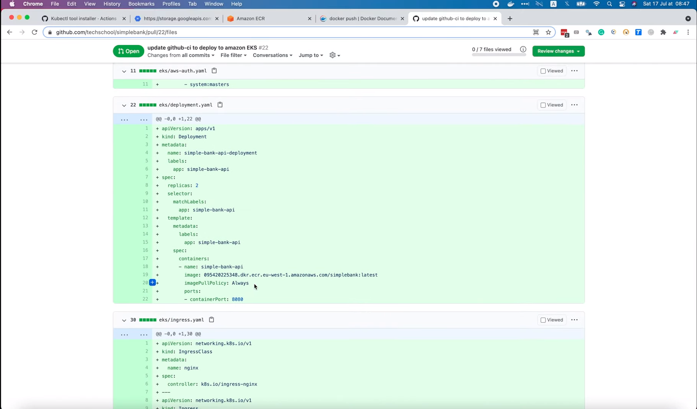

Ко всем остальным `yaml` файлам, а именно `ingress`, `issuer` и `service` у 
меня нет претензий.

Поэтому давайте объединим этот PR с `master` и посмотрим что произойдёт.
Но обратите внимание, что вы должны убедиться, что у пользователя `github-ci`
достаточно прав для внесения изменений в EKS кластер.

Этим мы занимались на одной из предыдущих лекций.

Как видите здесь на рисунке, в IAM сервисе

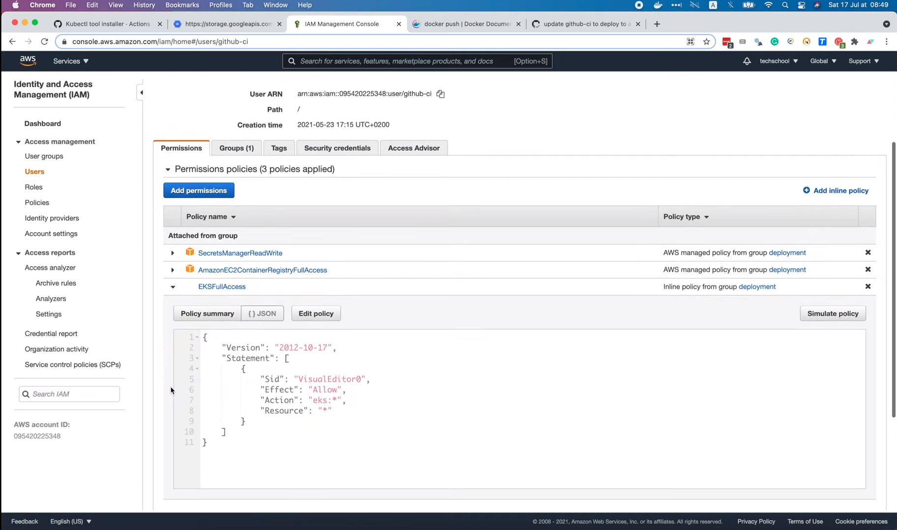

у моего пользователя `github-ci` уже есть полный доступ (Full Access) к
EKS кластеру.

Итак, давайте продолжим и нажнём `Squash and Merge`.

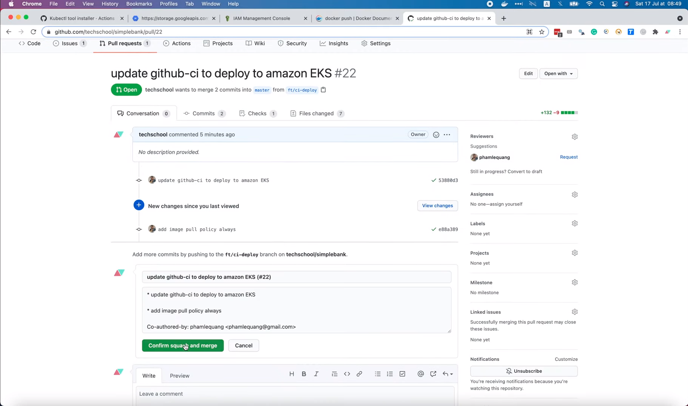

Подтвердите слияние и удалите ветку с этим функционалом.

Теперь, если мы откроем ветку `master` в репозитории, мы увидим, что 
процесс CI/CD для создания и развертывания нового образа в продакшен 
среде запущен. Давайте перейдем по этой ссылке, чтобы увидеть более 
подробную информацию.

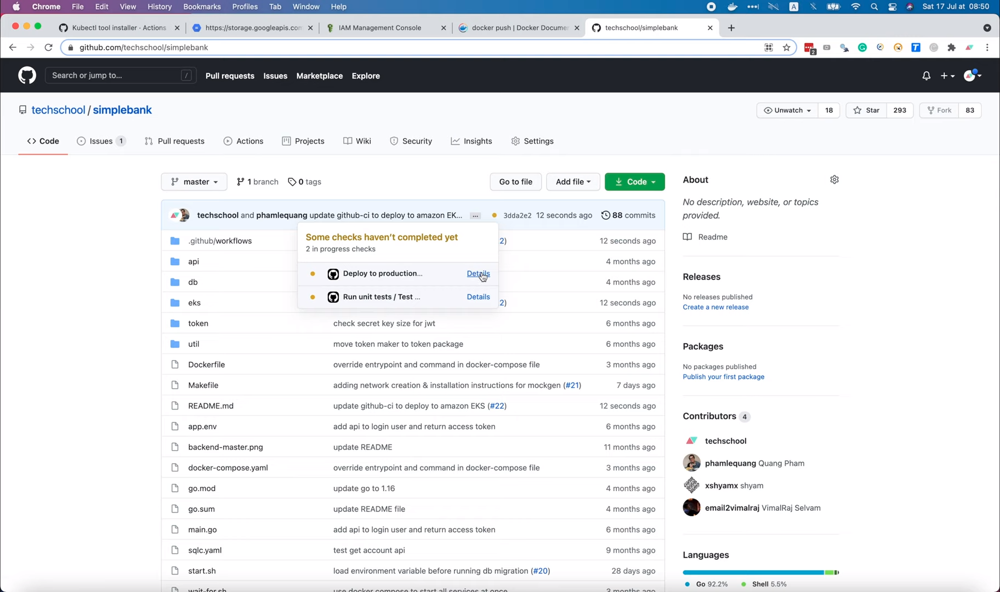

Итак, образ создаётся.

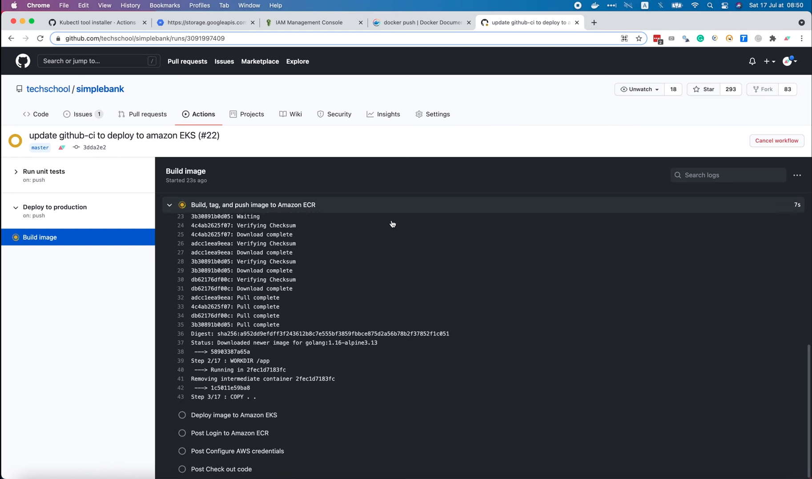

И это займет некоторое время.

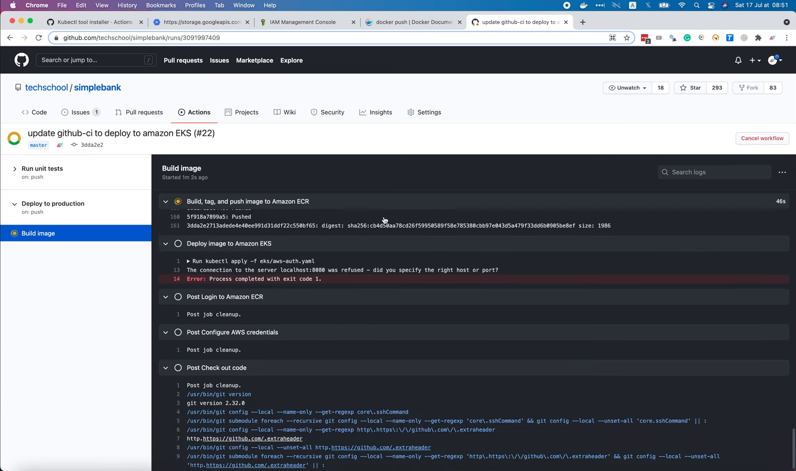

Похоже, что рабочий процесс завершился с ошибкой. Образ был отправлен в
ECR, но почему-то не удалось развернуть его в EKS.

Во-первых, давайте откроем Amazon ECR, чтобы проверить образ.

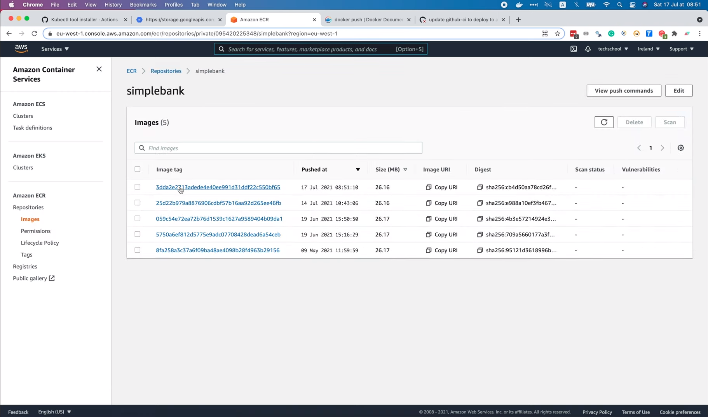

Здесь мы видим новый образ, но он не имеет тега `latest`.

Он имеет только один тег, которым, как обычно, является хеш коммита. Так 
что это одна из проблем, которые мы должны решить.

Теперь давайте посмотрим более подробно на шаг, который завершился ошибкой.

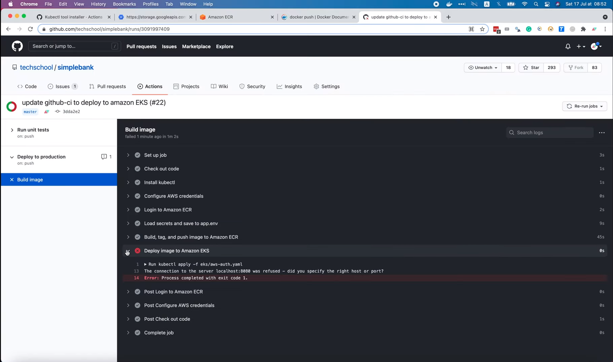

Ошибка равна "The connection to server localhost was refused" («Отказано 
в соединении с локальным сервером»).

Таким образом, кажется, что `kubectl` пытается подключиться к кластеру на 
локальном хосте, а не к продакшен EKS кластеру. Это связано с тем, что я 
забыл добавить один шаг, обновляющий `kubeconfig`, чтобы он указывал на
продакшен кластер.

Мы можем найти информацию о продакшен кластере в консоли AWS. 

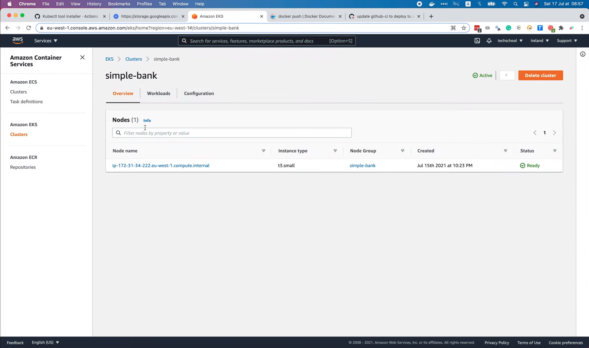

Затем давайте откроем рабочий процесс `deploy` и добавим новый шаг.

Я назову его "Update kube config" («Обновить конфигурацию kube»). И мы 
выполним следующую команду:

```
aws eks update-kubeconfig
```

после которой следует название кластера (`simple-bank`) и его регион 
(`eu-west-1`).

```yaml
    - name: Update kube config
      run: aws eks update-kubeconfig --name simple-bank --region eu-west-1
```

Это решит одну из наших проблем.

Вторая заключается в том, что, несмотря на наши ожидания, образ с тегом 
`latest` не передается в ECR.

Давайте посмотрим логи шага сборки образа, чтобы выяснить почему. Логи 
довольно длинные, но если прокрутить вниз до части с тегами, мы увидим, 
что здесь образ был помечен правильным хэшем коммита.

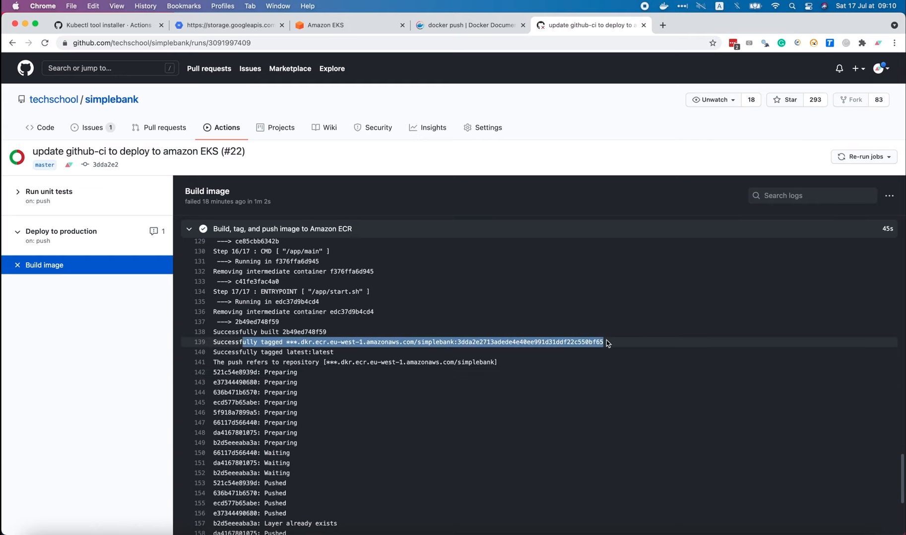

Но проблема возникает для тега `latest`. Тут используется имя образа "latest"
вместо ссылки на ECR образ, которая использовалась строкой выше. Итак, мы
обнаружили причину. Давайте вернёмся к рабочему процессу `deploy`.

Тут мы должны исправить название тега

```yaml
        run: |
          docker build -t $ECR_REGISTRY/$ECR_REPOSITORY:$IMAGE_TAG -t latest .
          docker push -a $ECR_REGISTRY/$ECR_REPOSITORY
```

просто добавим правильное имя образа перед ним, вот так

```yaml
        run: |
          docker build -t $ECR_REGISTRY/$ECR_REPOSITORY:$IMAGE_TAG -t $ECR_REGISTRY/$ECR_REPOSITORY:latest .
          docker push -a $ECR_REGISTRY/$ECR_REPOSITORY
```

и я думаю этого будет достаточно.

Теперь давайте сохраним файл и отправим его на GitHub. Я добавлю изменения, 
которые мы только что внесли,

```shell
git add .
```

зафиксирую их с сообщением "fix image tag and update kube config" 
(«исправляем тег образа и обновляем конфигурацию kube»)

```shell
git commit -m "fix image tag and update kube config"
```

Затем

```shell
git push origin ft/ci-deploy
```

Итак, теперь нам нужно создать новый пул-реквест для объединения исправлений
с веткой `master`.

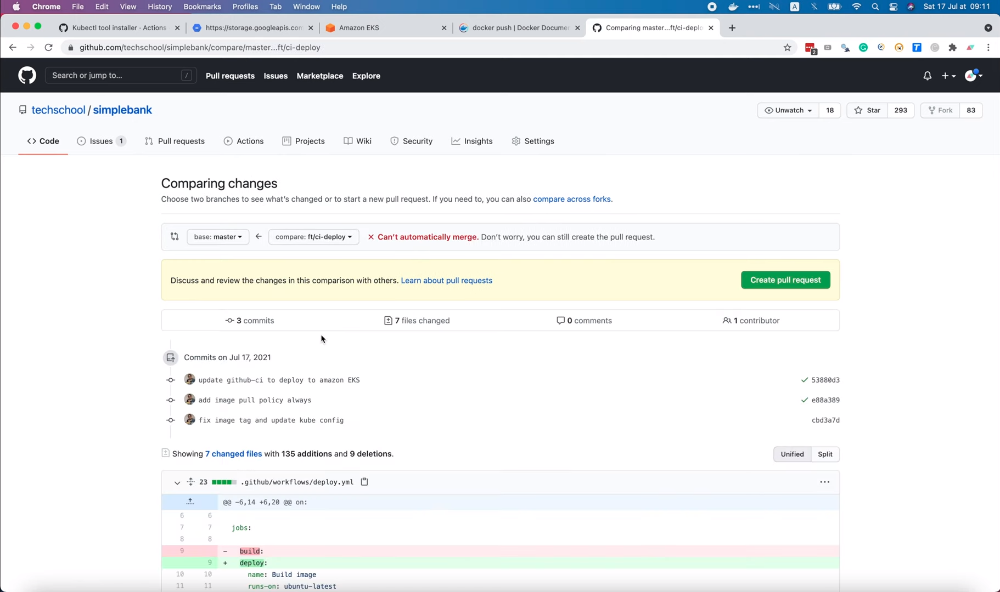

Похоже, что PR нельзя объединить автоматически.

Причина в том, что ранее мы использовали `Squash and merge`, поэтому 
история коммитов на нашем локальном компьютере отличается от истории на 
ветке `master` GitHub.

Чтобы исправить это, мы должны сделать перебазирование нашей ветки с 
последней версией ветки `master`.

Итак, сначала я обновлю ветку `master` на локальном компьютере, запустив

```shell
git pull
```

чтобы получить и объединить все новые изменения из удаленной ветки `master`
на GitHub в нашу локальную ветку `master`.

Затем перейду на ветку `ft/ci-deploy` и выполню

```shell
git rebase master
```

Конечно возникнут некоторые конфликты, потому что история коммитов 
отличается. Поэтому давайте их исправим!

Конфликт возник в файле `deployment.yaml`.

Здесь на рисунке мы видим Current Change (текущий фрагмент кода, который
возможно заменить) и Incoming Change (фрагмент кода на замену). 

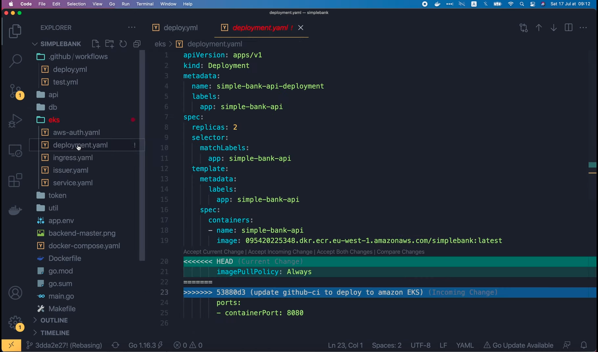

В данном случае решить конфликт просто, так как мы добавляем только новую 
правило извлечения образов. Итак, давайте просто подтвердим использование
Current Change.

Хорошо, теперь вернитесь к терминалу и проверьте состояние репозитория

```shell
git status
```

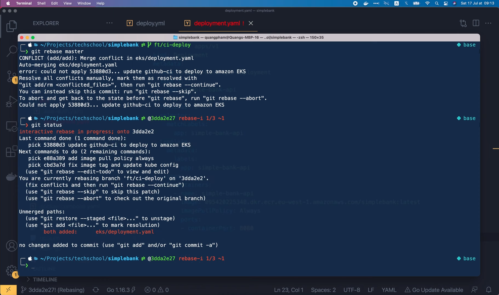

Конфликт разрешен. Таким образом, мы можем просто добавить исправление, а 
затем запустить

```shell
git rebase --continue
```

для завершения процесса перебазирования.

Хорошо, теперь давайте отправим изменения на GitHub.

```shell
git push origin ft/ci-deploy
```

Обратите внимание, что мы получим ошибку, если просто отправим их, как 
обычно, потому что история коммитов была перезаписана, когда мы 
осуществили перебазирование с веткой `master`.

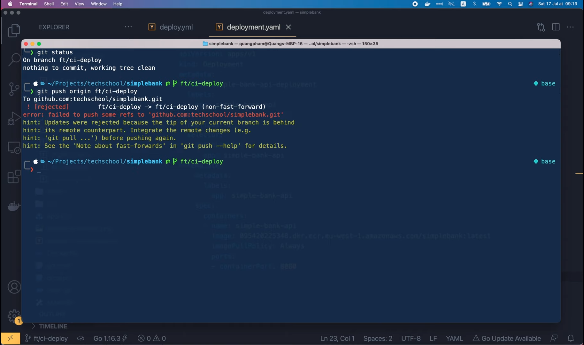

Таким образом, локальная история коммитов будет отличаться от истории 
на GitHub. Мы должны использовать ключ `-f`, чтобы заставить GitHub 
заменить историю изменений.

```shell
git push -f origin ft/ci-deploy
```

И вуаля, изменение было успешно отправлено. Сам процесс довольно трудоёмкий,
но иногда нам приходится его использовать. Мы можем избежать этой ситуации, 
всегда сначала извлекая последние изменения из удаленной ветки `master`,
прежде чем создавать новую ветку.

Итак, теперь когда все изменения на GitHub, мы можем двигаться дальше
и создать пул-реквест.

Давайте проведём код ревью! Здесь на рисунке мы добавили изменения, 
позволяющее добавить тег `latest` к образу


а здесь мы обновили конфигурацию kube, чтобы она указывала на Amazon EKS 
кластер.

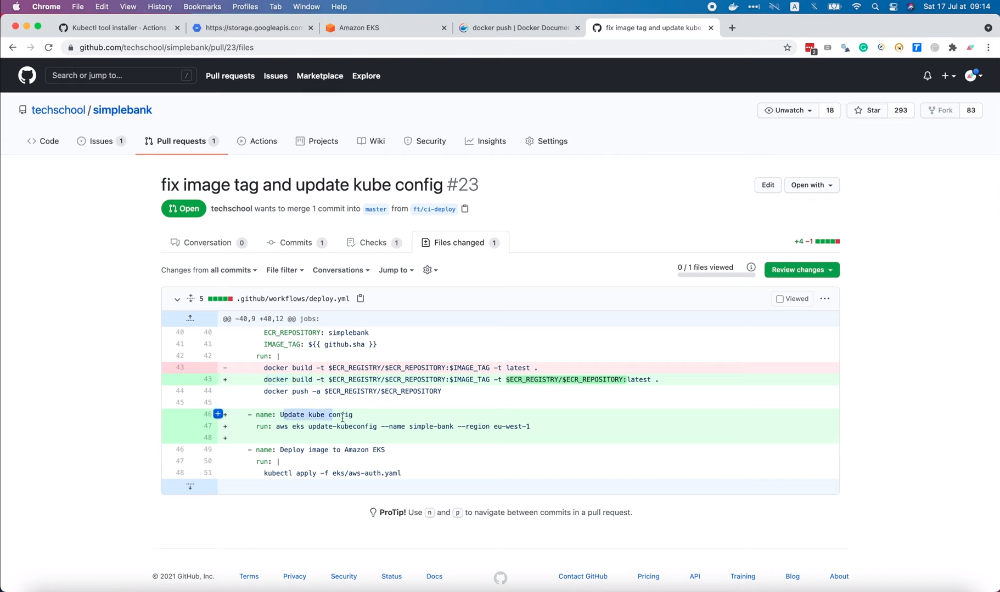

У меня нет никаких замечаний к коду! Поэтому давайте объединим PR. Unit 
тесты были успешно пройдены. Давайте нажмём `Squash and merge`!

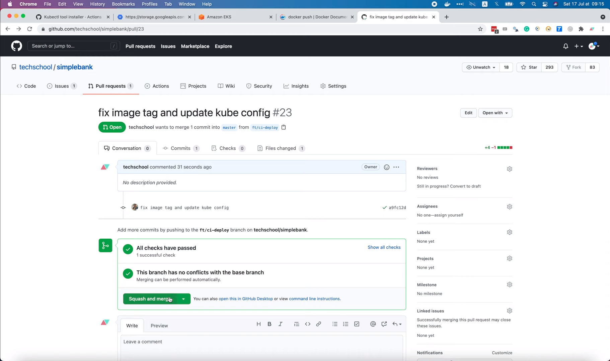

Подтвердим слияние! И удалим ветку с новым функционалом.

Хорошо, теперь давайте посмотрим на выполнение рабочего процесса `deploy`.
В данный момент создаётся образ. Пока мы ожидаем завершения сборки, давайте 
перейдём в Amazon ECR и открыть репозиторий `simple-bank`. 

Как только новое изображение будет отправлено, оно появится здесь.

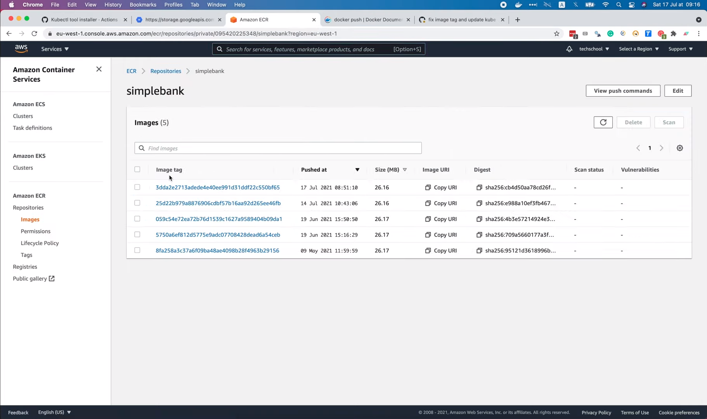

Хорошо, вернемся к рабочему процессу. Изображение передается в ECR.

После этого выполнен шаг `Update kube config`, а затем образ развертывается 
в Amazon EKS. 

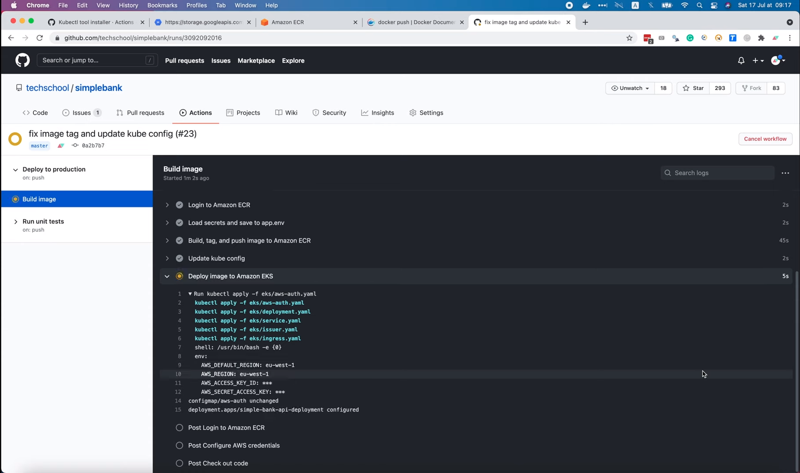

А чуть позже все шаги будут выполнены.

На этот раз рабочий процесс успешно завершен.

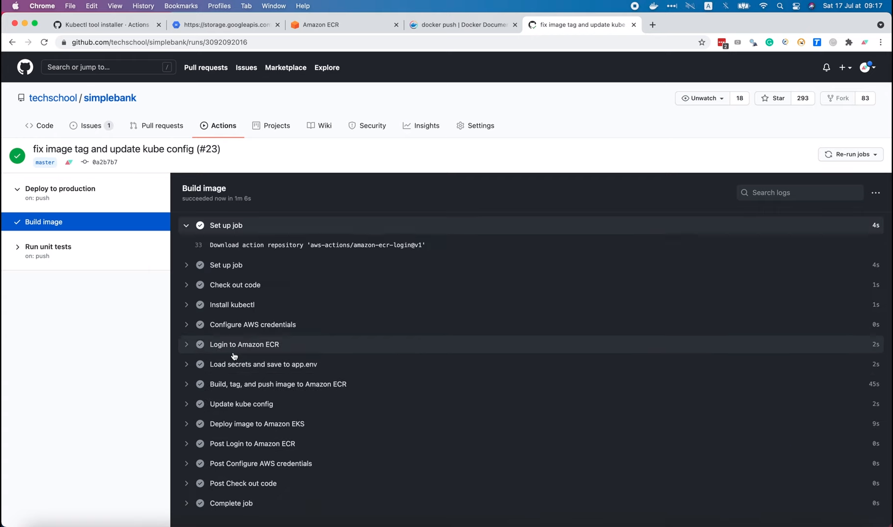

Здорово! Если мы посмотрим на логи шага сборки образа, то увидим, что он
был правильно помечен тегом `latest`.

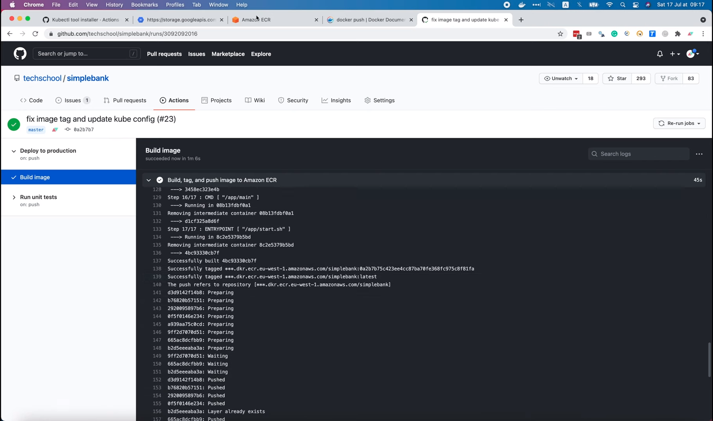

И если мы обновим страницу с ECR репозиториями, то увидим, что у самого 
нового образа два тега: первый — это хэш коммита, а второй — `latest`.

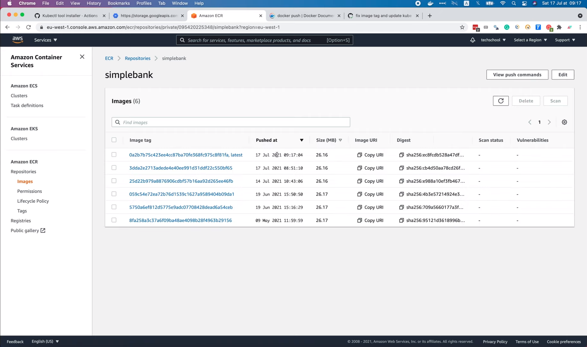

Это именно то, чего мы ожидали.

Отлично, теперь давайте откроем консоль `k9s`, чтобы убедиться, что 
правильный образ развернут в продакшен!

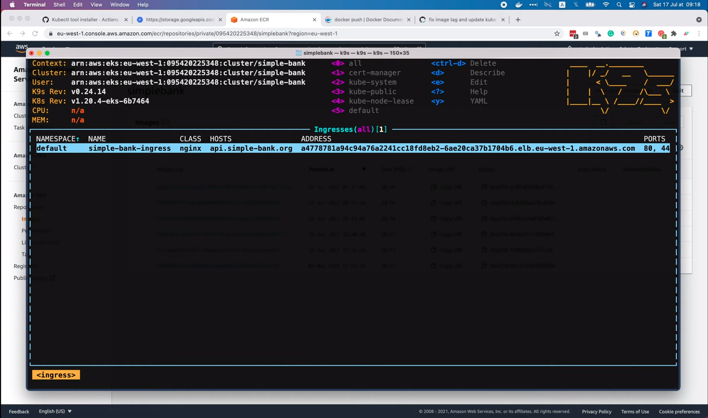

Я поищу по ключевому слову `service`.

Затем откройте API сервис `simple-bank` из списка.

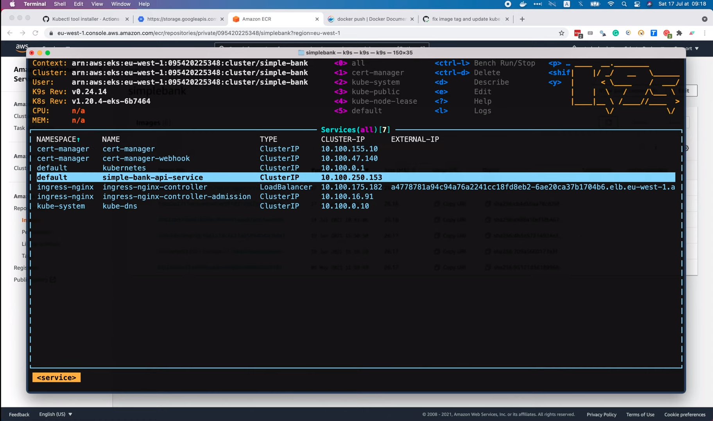

Как видите, 2 пода этого сервиса запущены и работают.

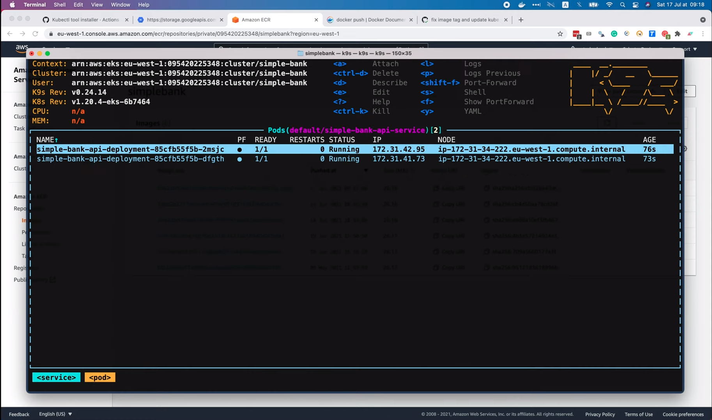

Давайте выведем подробную информацию об этом поде. И посмотрите на образ!
У него тег `latest`, как мы и хотели.

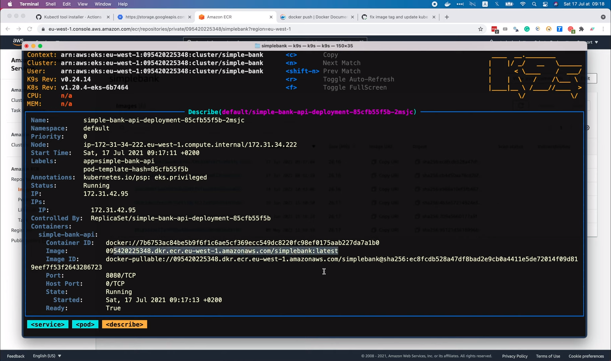

Мы также можем посмотреть на идентификатор образа, чтобы увидеть, используется 
ли правильный `latest` образ или нет. Выше на рисунке мы видим его полный
хэш коммита.

Давайте сравним его с тем, что на странице ECR. Мы должны открыть подробную 
информацию об образе, чтобы увидеть его полный хеш-дайджест.

На рисунке видно, что он совпадает с тем, что мы видим в консоли `k9s`.

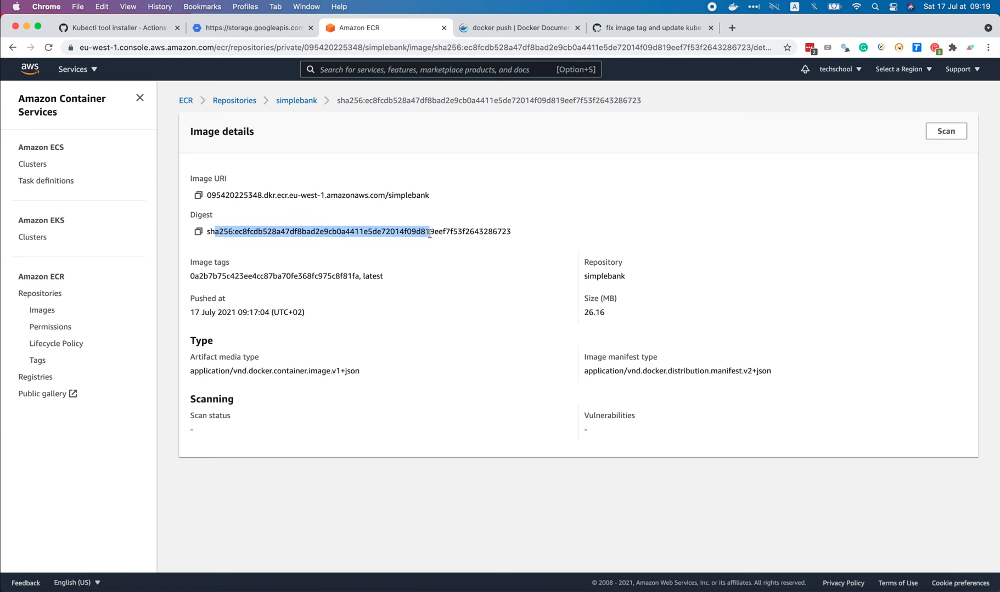

Превосходно! Давайте осуществим ещё одну, последнюю проверку, чтобы 
убедиться, что API работает правильно.

Я открою Postman и отправлю запрос на вход в систему, который мы уже 
выполняли на предыдущей лекции. 

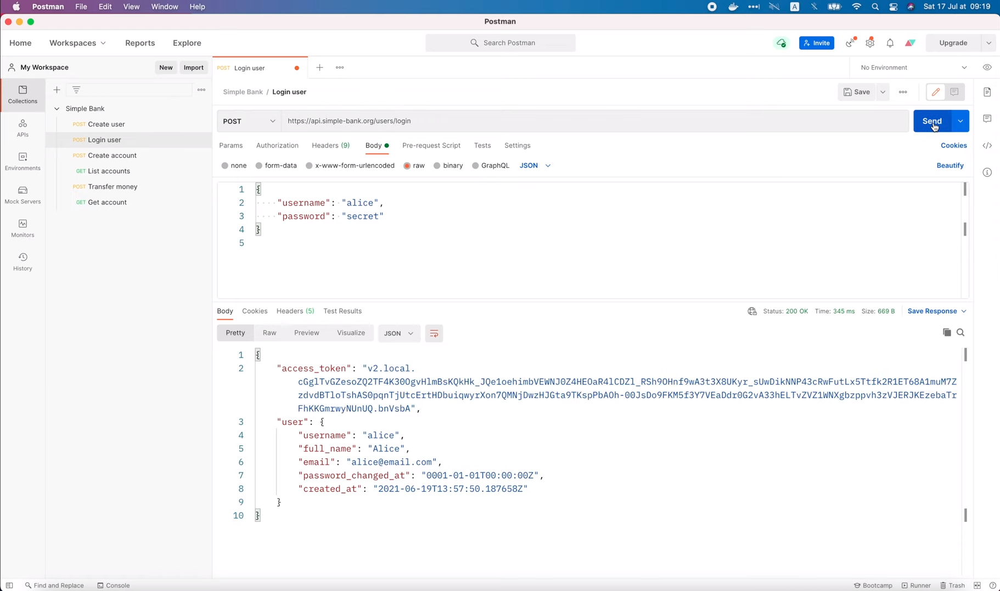

Здорово! Он успешно выполнен!

И на этом мы закончим эту лекцию. Она также является последней для 
мастер-класса по бэкенду.

Я понимаю, что не затронул все темы, которые нужно знать для
backend-разработки.

Всё ещё существует множество сложных для изучения тем, которыми я хотел бы 
поделиться с вами. Но я думаю, что лучше всего было бы рассказать о них 
в другом курсе.

В любом случае надеюсь, что вам понравился этот мастер-класс по бэкенду,
и он сможет как-то помочь вам в ваших проектах.

Большое спасибо за время, потраченное на чтение, желаю вам получать 
удовольствие от обучения! И до встречи на следующем курсе!