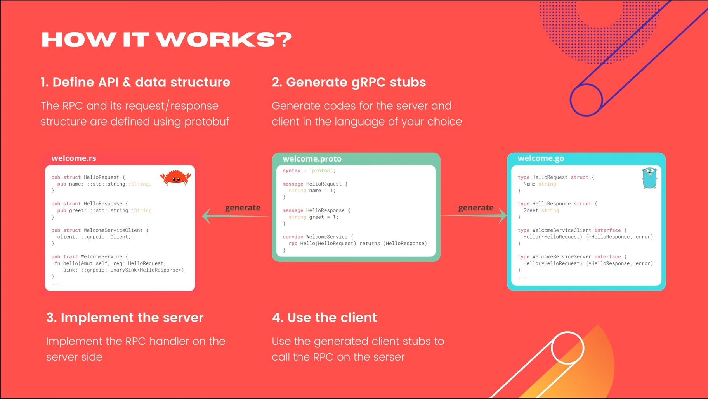
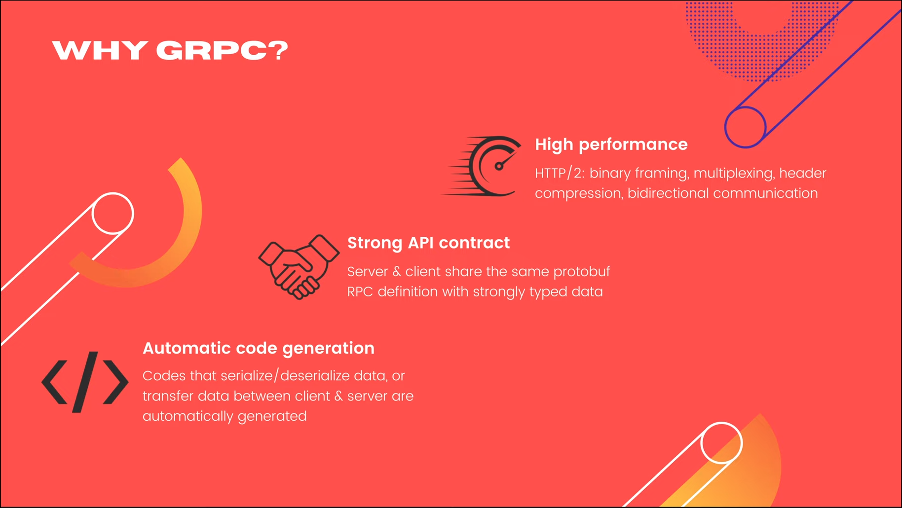

# Introduction to gRPC

[Original video](https://www.youtube.com/watch?v=mRGnA3wPxMM)

Hello everyone, welcome to the backend master class. So far we've
implemented a set of HTTP JSON APIs for our simple bank service
using Gin. Although it is very easy to implement and convenient
to use, when it comes to performance, HTTP JSON APIs are no match 
for gRPC. If you have watched my videos in the gRPC course, I'm
sure you know what I'm talking about.

But for those who haven't watched, I will do a quick overview of
this technology so that you can understand why gRPC is one of
the best frameworks when you want to develop a backend web 
service in Golang.

## What is gRPC?

gRPC is a remote procedure call framework. Originally developed by
Google, and now is a part of the Cloud Native Computing Foundation.
The idea of gRPC is to allow the client to execute a remote function
on the server.


As you can see in this example, there's a hello function on the 
server, which is written in Rust and the client, written in Go, can 
call that function as if it's in the same local codebase.

All the magics that happen behind the scene for remote interaction
are handled by gRPC. And the RPC APIs and their data structure codes
are automatically generated by a special program called Protocol
Buffer Compiler.

One of the coolest things about gRPC is that it supports many 
different programming languages. So from the same API definition, 
you can easily generate server & clients code in whatever programming
language you like.

## How gRPC works?

Here's how it works:



1) First, we need to define the RPC API and its request/response 
   structure using Protocol Buffer.
   
```protobuf
syntax = "proto3";

message HelloRequest {
  string name = 1;
}

message HelloResponse {
  string greet = 1;
}

service WelcomeService {
  rpc Hello(HelloRequest) returns (HelloResponse);
}
```

   As you can see in this example, there's a `HelloRequest`, and 
   a `HelloResponse` message. Then the `WelcomeService` has 1 RPC
   called `Hello`, which takes the `HelloRequest` as input and
   returns a `HelloResponse`. From this `proto` file, we move to
   second step, which is generating gRPC codes for the server and
   client.

2) With the help of Protocol Buffer Compiler you can easily generate
   codes in any programming language of your choice. Here's an example
   of the generated Golang code. It has a struct for HelloRequest, a 
   struct for HelloResponse, and 2 interfaces for the client and server,
   which we can base on to write the real implementation later. On the
   left is another example of the generated codes in Rust.
   
```rust
...

pub struct HelloRequest {
    pub name: ::std::string::String,
}

pub struct HelloResponse {
    pub greet: ::std::string::String,
}

pub struct WelcomeServiceClient {
    client: ::grpcio::Client,
}

pub trait WelcomeService {
    fn hello(&mut self, req: HelloRequest,
        sink: ::grpcio::UnarySink<HelloResponse>);
}

...
```
3) When we have the generated code, the only thing left is to 
   implement the RPC handler on the server side, or
   
4) Use the generated stubs on the client side to call the RPC 
   on the server.
   
Pretty simple, isn't it?

Don't worry if you're not fully clear about all of these steps
at the moment. I will gradually show you how to do all of them
in the upcoming lectures.

## gRPC benefits

OK, but why should we use gRPC instead of a normal HTTP JSON 
API? Well, first, gRPC offers higher performance. And its 
possible thanks to the underlying HTTP/2 protocol, which offer
several benefits, such as transferring data in binary format, 
multiplexing, which allows sending multiple requests through 
the same TCP connection, header compression, and bidirectional
communication between the client and server. Second, gRPC gives
us a better API contract, where the server and client share the 
same Protocol Buffer definition of the API with strongly typed 
request/response data structure. And third, automatic code 
generation is one of the most important features of gRPC, which
allows us to develop the service faster, because all codes that
serialize, deserialize, or transfer data between client and 
server are already generated and handled by gRPC.



So all we need to focus on is implementing the core logic of the
service.

## 4 types of gRPC

There are 4 types of gRPC.


The simplest one is unary gRPC, where the client sends 1 single 
request, and the server replies with 1 single response. This is 
similar to the normal HTTP API. Then we have client-streaming 
gRPC. In this scenario, the client will send a stream of 
multiple messages, and it expects the server to send back only 
1 single response. Similarly, we have server-streaming gRPC,
where the client sends only 1 request, and the server replies 
with a stream of multiple messages. And finally, the bidirectional
streaming gRPC is the most complex, because client and server will
keep sending and receiving multiple messages in parallel and with
arbitrary order. It's very flexible and no blocking, which means, 
no sides need to wait for the response from the other before 
sending the next messages.


## gRPC gateway

gRPC is already a great tool, but there's still 1 more thing that
makes it even better: gRPC gateway. The idea is to write server
code just once, but be able to serve both gRPC and HTTP JSON
requests at the same time. Sounds pretty cool, doesn't it?

gRPC gateway is a plugin of Protocol Buffer that generates HTTP 
proxy codes from Protocol Buffer definition.


As you can see in this diagram, from the same `proto` file, 
the `protobuf` compiler will generate both the gRPC and the 
HTTP gateway codes. A normal gRPC client will connect directly 
to the gRPC server to send a gRPC request and receive a binary
response, while an HTTP client will connect to the HTTP gateway
server to send HTTP request. This request will be translated 
into gRPC format before forwarding to the gRPC service handler 
to be processed. Its response will also be translated back into 
JSON format before returning to the client.

There are 2 types of translation that we can choose to implement
for the gateway: in-process translation means that the gateway
can call the gRPC handler directly in the code, without going 
through any extra hop on the network. However, keep in mind that,
it only works for unary gRPC. If you want to translate streaming
gRPC calls, then you must run the HTTP gateway as a separate proxy
server. In that case, the HTTP JSON request will be translated and
forwarded to the gRPC server via a network call.

OK, so now you know why gRPC is a very powerful framework, and for 
me, it's a no-brainer to choose it over many other backend service
frameworks.

## What next?

In upcoming videos, I'm gonna gradually show you how to set up gRPC
development environment, how to define a set of APIs and data 
structures using `protobuf` and generate gRPC stubs from it, how to
implement the gRPC service handlers, and finally how to generate and
set up a gRPC gateway as well as its swagger documentation page for
HTTP clients.


Although you might already know some of these if you're watched my
gRPC course, it's been 2 years since I recorded that course, and a
lot of things have changed in the gRPC toolings and APIs. So I think
it would still be useful to remake new videos on these topics, but
this time, for a real-world application: our simple bank service.

And that's it for today's video.

Thanks a lot for watching and see you soon in the next lecture! 