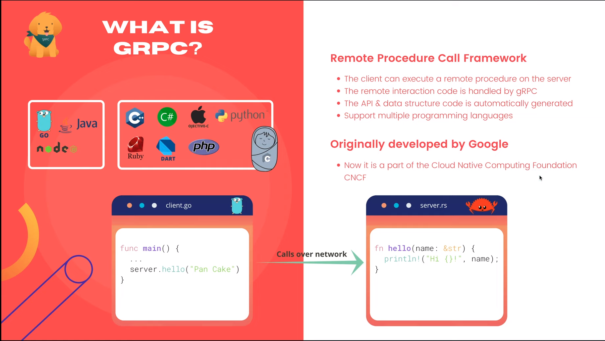
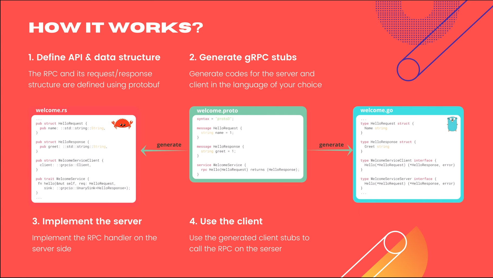
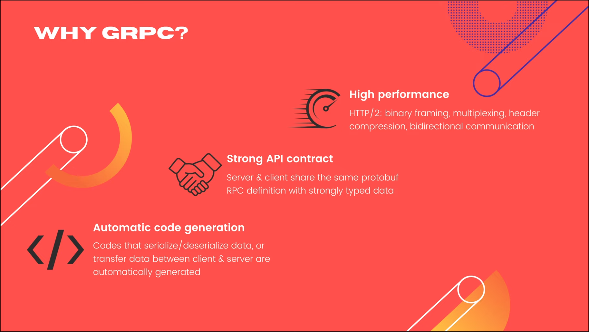
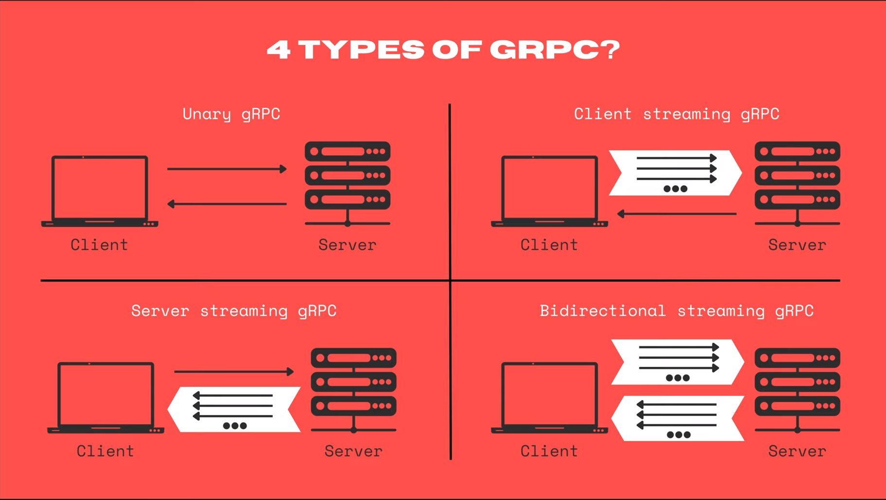
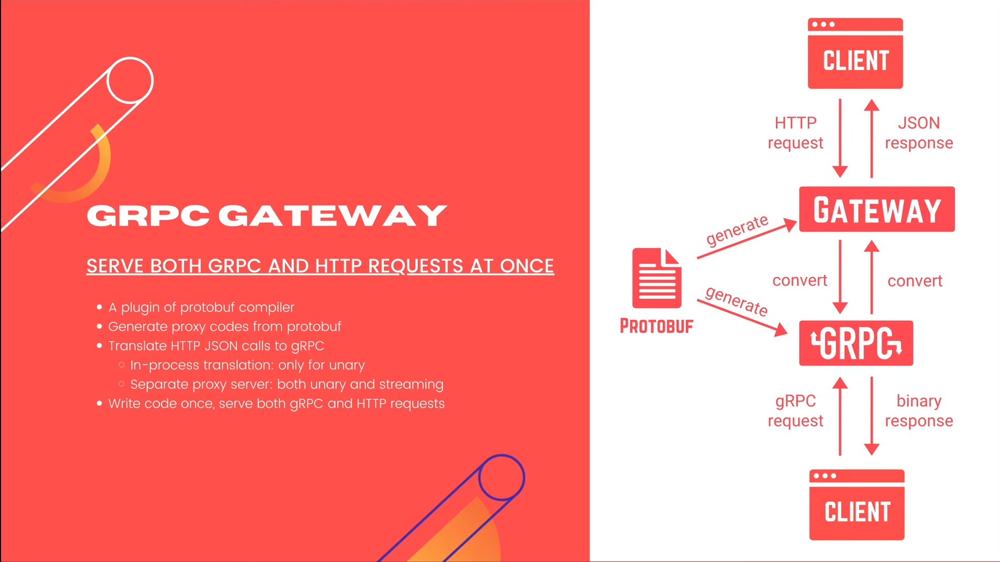
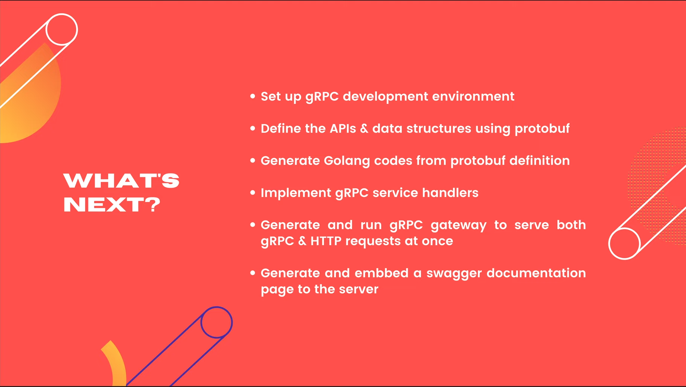

# Введение в gRPC

[Оригинал](https://www.youtube.com/watch?v=mRGnA3wPxMM)

Всем привет, добро пожаловать на мастер-класс по бэкенду. На данный момент 
мы реализовали набор HTTP JSON API-интерфейсов для нашего простого 
банковского сервиса с использованием Gin. Хотя его очень легко реализовать 
и удобно использовать, с точки зрения производительности HTTP JSON 
API-интерфейсы не могут сравниться с gRPC. Если вы смотрели мои видео в
gRPC курсе, я уверен, что понимаете, о чем я говорю.

Но для тех, кто не смотрел, я сделаю краткий обзор этой технологии, чтобы 
вы могли понять, почему gRPC — один из лучших фреймворков, если вы хотите 
разработать бэкенд веб-сервис на Golang.

## Что такое gRPC?

gRPC — это фреймворк удаленного вызова процедур. Первоначально разработан 
Google, а теперь является частью Cloud Native Computing Foundation. Идея 
gRPC состоит в том, чтобы позволить клиенту выполнять удаленную функцию 
на сервере.



Как видите в этом примере на рисунке, на сервере существует функция `hello`,
написанная на Rust, и клиент, написанный на Go, может вызывать эту функцию, 
как если бы она находилась в той же локальной кодовой базе.

Всей магией, которая происходит за кулисами для удаленного взаимодействия, 
занимается gRPC. А API-интерфейсы RPC и коды их структур данных автоматически
генерируются специальной программой, которая называется Protocol Buffer 
Compiler.

Одна из самых крутых особенностей gRPC заключается в том, что он 
поддерживает множество разных языков программирования. Таким образом, из 
одного и того же определения API вы можете легко генерировать серверный и 
клиентский код на любом языке программирования, который вам нравится.

## Как работает gRPC?

Вот как это работает:



1) Во-первых, нам нужно определить API RPC и его структуру запроса/ответа 
   с помощью Protocol Buffer.
   
```protobuf
syntax = "proto3";

message HelloRequest {
  string name = 1;
}

message HelloResponse {
  string greet = 1;
}

service WelcomeService {
  rpc Hello(HelloRequest) returns (HelloResponse);
}
```
   Как видите в этом примере, у нас есть сообщение `HelloRequest` и
   `HelloResponse`. Кроме этого у `WelcomeService` есть один RPC с 
   названием `Hello`, который принимает `HelloRequest` в качестве 
   входных данных и возвращает `HelloResponse`. Используя этот `proto` 
   файл мы переходим ко второму шагу, который генерирует коды gRPC
   для сервера и клиента.

2) С помощью Protocol Buffer Compiler вы можете легко генерировать коды на 
   любом языке программирования по вашему выбору. Ниже показан пример 
   сгенерированного Golang кода. Тут создана структура для `HelloRequest`, 
   структура для `HelloResponse` и два интерфейса для клиента и сервера,
   на основе которых мы можем позже написать настоящую реализацию. Затем
   показан пример сгенерированного кода в Rust для того же самого файла
   `welcome.proto`.
   
```go
...
type HelloRequest struct {
	Name string
}

type HelloResponse struct {
	Greet string
}

type WelcomeServiceClient interface {
	Hello(*HelloRequest) (*HelloResponse, error)
}

type WelcomeServiceServer interface {
	Hello(*HelloRequest) (*HelloReponse, error)
}
...
```

```rust
...

pub struct HelloRequest {
    pub name: ::std::string::String,
}

pub struct HelloResponse {
    pub greet: ::std::string::String,
}

pub struct WelcomeServiceClient {
    client: ::grpcio::Client,
}

pub trait WelcomeService {
    fn hello(&mut self, req: HelloRequest,
        sink: ::grpcio::UnarySink<HelloResponse>);
}

...
```
3) Когда у нас есть сгенерированный код, остается только реализовать 
   обработчик RPC на стороне сервера, или
   
4) Использовать сгенерированные заглушки на стороне клиента для вызова 
   RPC на сервере.

Довольно просто, не так ли?

Не переживайте, если вы не совсем поняли как осуществить всю эту
последовательность шагов в данный момент. Я постепенно покажу вам, как
всех их реализовать на следующих лекциях.

## Преимущества gRPC

Хорошо, но почему мы должны использовать gRPC вместо обычного HTTP JSON 
API? Ну, во-первых, gRPC предлагает более высокую производительность.
И это возможно благодаря лежащему в основе протоколу HTTP/2, который
предоставляет несколько преимуществ, таких как передача данных в двоичном 
формате, мультиплексирование, позволяющее отправлять несколько запросов 
через одно и то же соединение TCP, сжатие заголовков и двунаправленную 
связь между клиентом и сервером. Во-вторых, gRPC предлагает нам более жёсткий
API контракт, в котором сервер и клиент совместно используют одно и то же
определение API через Protocol Buffer со строго типизированной структурой 
данных запроса/ответа. И, в-третьих, автоматическая генерация кода — одна из 
важнейших функций gRPC, позволяющая нам быстрее разрабатывать сервис, 
поскольку весь код, который сериализует, десериализует или передают данные 
между клиентом и сервером, уже сгенерирован и обрабатывается gRPC.



Итак, всё, на чем нам нужно сосредоточиться, — это реализация основной 
логики сервиса.

## 4 типа gRPC

Существует 4 типа gRPC.

Простейший — это унарный gRPC, когда клиент отправляет один запрос, а 
сервер отвечает одним ответом. Это похоже на обычный HTTP API. Затем 
существует клиентская потоковая передача gRPC. В этом случае клиент отправит
поток из нескольких сообщений и ожидает, что сервер отправит только один 
ответ. По аналогии имеется серверная потоковая передача gRPC, когда клиент 
отправляет только один запрос, а сервер отвечает потоком из нескольких 
сообщений. И, наконец, gRPC с двунаправленной потоковой передачей является 
наиболее сложным типом, поскольку клиент и сервер будут отправлять и 
получать несколько сообщений параллельно и в произвольном порядке. Он
универсальный и не блокирующий, что означает, что ни одной стороне не 
нужно ждать ответа от другой перед отправкой следующих сообщений.



## gRPC шлюз

gRPC уже является отличным инструментом, но существует кое-что, делающее 
его ещё лучше: gRPC шлюз. Идея заключается в том, чтобы написать серверный
код только один раз, но иметь возможность одновременно обслуживать
gRPC и HTTP JSON запросы. Звучит довольно круто, не так ли?

gRPC шлюз — это подключаемый модуль Protocol Buffer, который генерирует
вспомогательные HTTP коды из определения Protocol Buffer.



Как видно на рисунке, из одного и того же файла `proto` компилятор 
`protobuf` сгенерирует код как для gRPC, так и для HTTP шлюза. Обычный gRPC
клиент подключается напрямую к gRPC серверу для отправки gRPC запроса и
получения двоичного ответа, а HTTP клиент подключается к HTTP серверу шлюза
для отправки HTTP запроса. Этот запрос будет преобразован в gRPC формат 
перед отправкой gRPC сервису для обработки. Его ответ также будет 
преобразован в JSON формат перед возвратом клиенту.

Существует два типа преобразований, которые мы можем реализовать для шлюза:
преобразование по ходу, означающее, что шлюз может вызывать gRPC обработчик 
непосредственно, без каких-либо дополнительных надстроек в сети. Однако 
имейте в виду, что это работает только для унарного gRPC. Если вы хотите
преобразовывать потоковые вызовы gRPC, то должны запустить HTTP-шлюз как 
отдельный прокси-сервер. В этом случае HTTP JSON-запрос будет преобразован 
и перенаправлен на gRPC сервер через сетевой вызов.

Итак, теперь вы знаете, почему gRPC — очень мощный фреймворк и я всегда 
выбираю его среди многих других бэкенд фреймворков для сервисов.

## Что дальше?

На последующих лекциях, я постепенно покажу вам, как настроить gRPC среду 
разработки, как определить набор API и структур данных с помощью protobuf и 
сгенерировать из него gRPC заглушки, как реализовать обработчики gRPC 
сервисов и, наконец, как сгенерировать и настроить gRPC шлюз, а также его 
страницу документации Swagger для HTTP-клиентов.



Хотя, возможно, вы уже знаете как сделать кое-что из этого, если проходили 
мой курс по gRPC, прошло 2 года с тех пор, как я создал его. Многое изменилось
как в gRPC инструментариях, так и в API. Поэтому я думаю, что было бы полезно
заново создать новые лекции на эти темы, но на этот раз для реального 
приложения: нашего простого банковского сервиса.

На этом закончим нашу сегодняшнюю лекцию.

Большое спасибо за время, потраченное на чтение, и до до скорой встречи на 
следующей лекции!