# Генерируем CRUD Golang код из SQL | Сравниваем db/sql, gorm, sqlx, sqlc 

[Оригинал](https://dev.to/techschoolguru/generate-crud-golang-code-from-sql-and-compare-db-sql-gorm-sqlx-sqlc-560j)

Добро пожаловать на мастер-класс по бэкенду!

В последней лекции мы узнали, как написать скрипт миграции для создания схемы 
базы данных для нашего простого примера банковского приложения.

Сегодня мы узнаем, как написать код на Golang для выполнения CRUD операций с 
базой данных.

Ниже:
* Ссылка на [плейлист с видео лекциями на Youtube](https://bit.ly/backendmaster)
* И на [Github репозиторий](https://github.com/techschool/simplebank)

## Что такое CRUD?

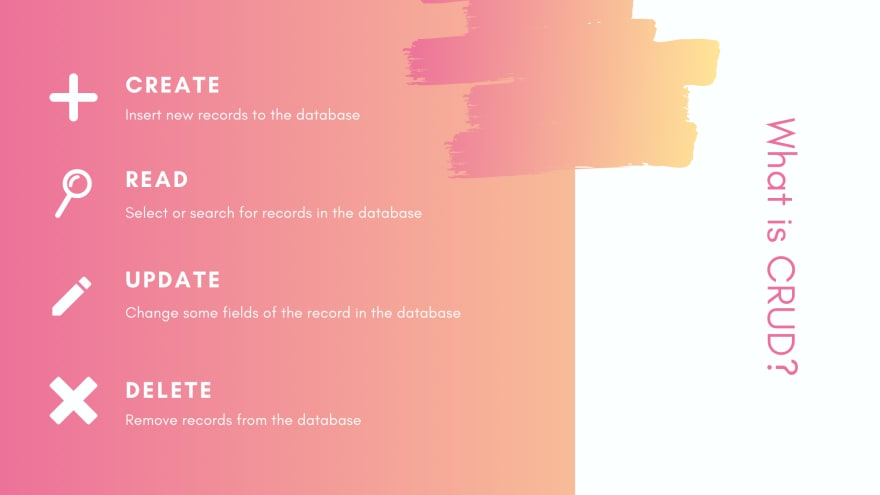

На самом деле, это 4 основные операции:

* `С` означает создать (`Create`) или вставить новые записи в базу данных.
* `R` - считать (`Read`), т. е. извлечь записи из базы данных.
* `U` - обновить (`Update`), изменить содержимое записей в базе данных.
* И `D` - удалить (`Delete`) записи из базы данных.

Какую библиотеку использовать?

Существует несколько способов реализовать CRUD операции в Golang.

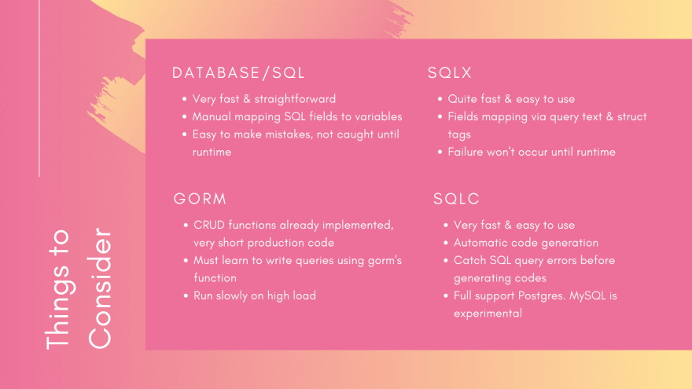

## Стандартный пакет `database/sql`

Первый — использовать пакет низкоуровневый стандартной библиотеки 
[database/sql](https://golang.org/pkg/database/sql/).

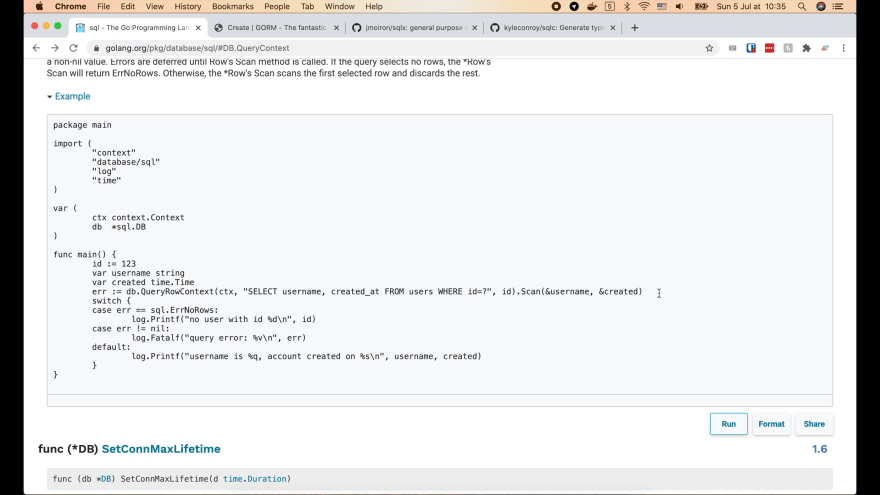

Как видите в этом примере на рисунке, мы просто используем функцию `QueryRowContext()`, 
передаем непосредственно SQL-запрос и некоторые параметры. Затем мы сканируем 
результат в необходимые переменные.

Основное преимущество этого подхода в том, что он работает очень быстро, а 
написать код довольно просто.

Однако его недостатком является то, что нам приходится вручную сопоставлять 
поля SQL с переменными, что довольно трудоёмко и легко допустить ошибку.
Если каким-то образом порядок переменных не совпадает или если мы забудем 
передать какие-то аргументы в вызов функции, ошибки появятся только во время 
выполнения.

## Gorm

Другой подход заключается в использовании [Gorm](https://gorm.io/), высокоуровневой библиотеки 
объектно-реляционного отображения для Golang.

Его очень удобно использовать, потому что все операции CRUD уже реализованы.
Таким образом, наш продакшен код будет компактным, так как нам нужно только 
объявить модели и вызвать функции, предоставляемые Gorm.

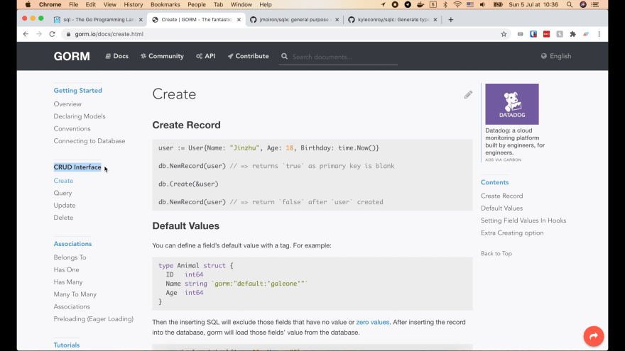

Как видно в этих примерах кода на рисунке, нам доступны функции `NewRecord()` и 
`Create()` для создания записи. И несколько функций для получения данных, такие 
как `First()`, `Take()`, `Last()`, `Find()`.

Выглядит довольно круто, но проблема в том, что мы должны научиться писать 
запросы, используя функции, предоставляемые Gorm. Досадно, когда не знаешь какие 
функции использовать.

Особенно когда у нас есть сложные запросы, требующие соединения таблиц, мы 
должны научиться задавать дескрипторы в структурах, чтобы Gorm знал о связях между 
таблицами и мог генерировать правильный SQL-запрос.

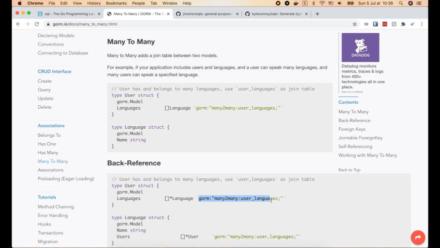

Я предпочитаю сам писать SQL-запрос. Это более гибкий подход и у меня есть 
полный контроль над тем, что должна сделать база данных.

Одной из основных проблем при использовании Gorm является то, что он работает 
очень медленно при большом трафике. В Интернете есть несколько тестов, которые 
показывают, что Gorm может работать в 3-5 раз медленнее, чем стандартная 
библиотека.

## Sqlx

Из-за этого многие люди переходят на промежуточный подход, который использует 
библиотеку [sqlx](https://github.com/jmoiron/sqlx).

Она работает почти так же быстро, как и стандартная библиотека, и очень проста 
в использовании. Сопоставление полей выполняется либо с помощью текста запроса, 
либо с помощью дескрипторов структуры.

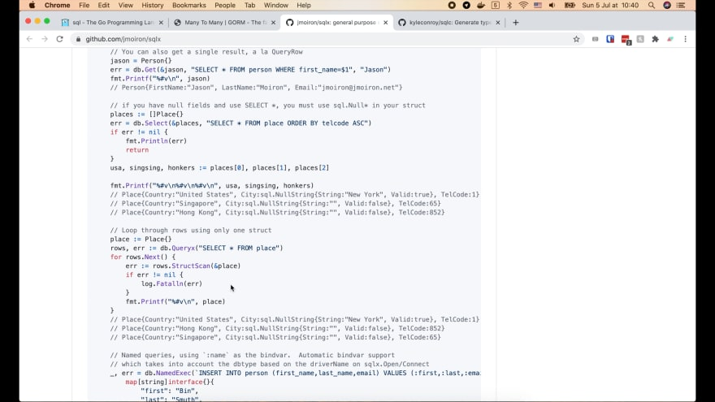

Он предоставляет некоторые функции, такие как `Select()` или `StructScan()`, 
которые автоматически сканируют результат в поля структуры, поэтому нам не 
нужно выполнять сопоставление вручную, как в пакете `database/sql`. Это поможет 
сократить код и уменьшить вероятность ошибок.

Однако код, который нам предстоит написать, все еще довольно большой. И любые 
ошибки в запросе будут обнаружены только во время выполнения.

Существует ли какие-либо другие более подходящие варианты?

## Sqlc

Ответ - [sqlc](https://sqlc.dev/)!

Он работает очень быстро, как и `database/sql`. Его очень легко использовать. И 
самое интересное, нам нужно просто написать SQL-запросы, а затем для нас будут 
автоматически сгенерированы CRUD коды на языке Golang.

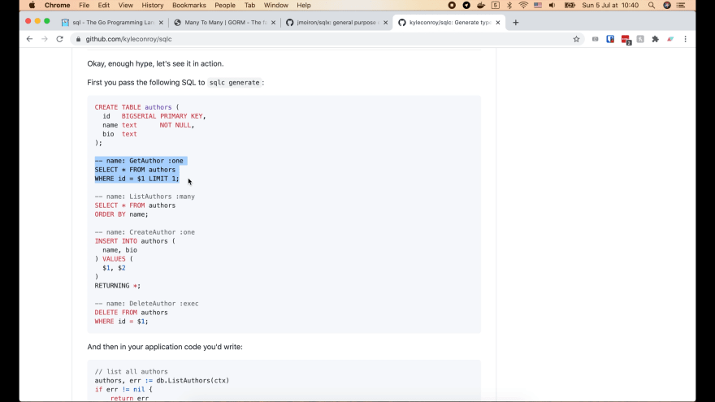

Как видите в примере на рисунке, мы просто передаем схему базы данных и 
SQL-запросы в `sqlc`. Каждый запрос имеет один комментарий перед ним, чтобы указать 
`sqlc` сгенерировать правильную сигнатуру функции.

Затем `sqlc` сгенерирует идиоматичные коды на Golang, использующие 
стандартную библиотеку `database/sql`.

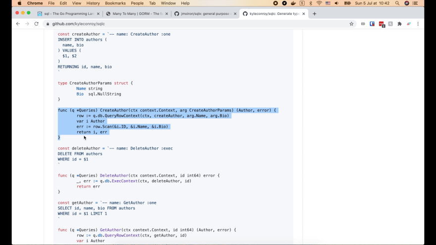

И поскольку `sqlc` анализирует SQL-запросы, чтобы понять, что делает запрос для
генерации кодов для нас, поэтому любые ошибки будут обнаружены и немедленно 
сообщены. Звучит потрясающе, правда?

Единственная проблема, которую я обнаружил в `sqlc`, заключается в том, что на 
данный момент он полностью поддерживает только Postgres. MySQL все еще находится
в экспериментальный стадии. Поэтому, если вы используете Postgres в своем 
проекте, я думаю, что `sqlc` — правильный инструмент для использования. В 
противном случае я бы предложил применять `sqlx`.

## Устанавливаем Sqlc

Хорошо, теперь я покажу вам, как установить и использовать `sqlc` для генерации 
CRUD-кодов для нашего простого примера банковского приложения.

Сначала мы откроем его [страницу на Github](https://github.com/kyleconroy/sqlc), затем найдем раздел «Установка».

У меня Mac, поэтому я буду использовать Homebrew. Давайте скопируем эту команду
`brew install` и запустим ее в терминале:

```shell
brew install kyleconroy/sqlc/sqlc
```

Отлично, `sqlc` теперь установлен!

Мы можем запустить команду `sql version`, чтобы увидеть, какая версия установлена. 
В моем случае это версия 1.4.0.

Давайте запустим `sql help`, чтобы узнать, как его использовать.

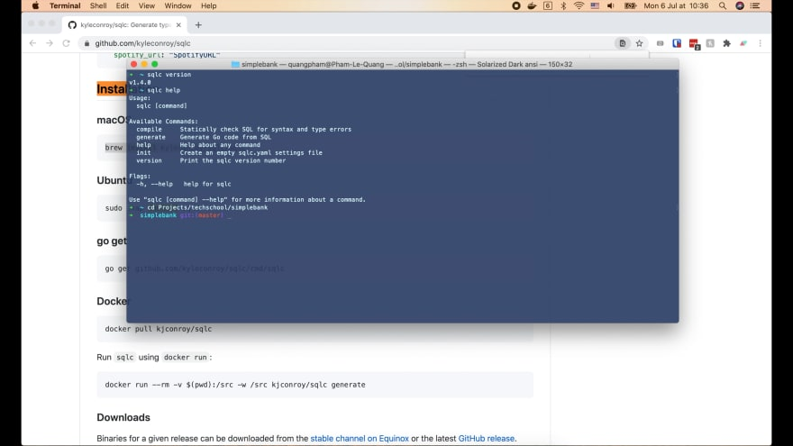

* Сначала мы используем команду `compile` для проверки синтаксиса SQL и ошибок 
  при вводе.
* Затем самая важная команда — `generate`. Она будет выполнять как проверку 
  ошибок, так и генерацию кодов на языке Golang из SQL запросов.
* Также доступна команда `init` для создания пустого файла настроек `slqc.yaml`.

## Создаём файл настроек

Теперь я перейду в папку проекта Simple bank, над которым мы работали на 
предыдущих лекциях. Выполните:

```shell
sqlc init
```

Мы видим файл `sqlc.yaml`. Сейчас он пустой. Итак, вернемся на страницу Github 
`sqlc`, выберем ветку с тегом `v1.4.0` и найдем настройки.

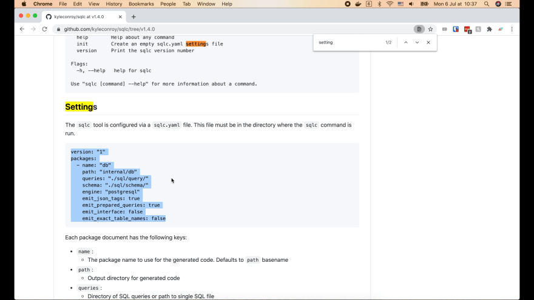

Скопируем список с настройками и вставим в файл `sqlc.yaml`.

Мы можем указать `sqlc` сгенерировать несколько Go пакетов. Но для простоты я 
пока буду использовать только один пакет.

```yaml
version: "1"
packages:
  - name: "db"
    path: "./db/sqlc"
    queries: "./db/query/"
    schema: "./db/migration/"
    engine: "postgresql"
    emit_json_tags: true
    emit_prepared_queries: false
    emit_interface: false
    emit_exact_table_names: false
```

* Параметр `name` здесь указывает `sqlc` название для Go пакета, который будет 
  сгенерирован. Я думаю, что `db` - хорошее название пакета.
* Далее нам нужно указать путь к папке для хранения сгенерированных файлов кода на 
  языке Golang. Я собираюсь создать новую папку `sqlc` внутри папки `db` и 
  изменить эту строку пути на `./db/sqlc`.
* Затем приведён параметр `queries`, который указывает `sqlc`, где искать файлы 
  SQL запросов. Давайте создадим новую папку query внутри папки `db`. Затем 
  измените это значение на `./db/query`.
* Точно так же параметр `schema` должен указывать на папку, содержащую схему 
  базы данных или файлы миграции. В нашем случае это `./db/migration`.
* Следующим параметром является engine, чтобы указать `sqlc`, какой механизм базы 
  данных мы хотели бы использовать. Мы используем `postgresql` для нашего примера
  банковского приложения. Если вы хотите поэкспериментировать с MySQL, вы можете 
  изменить это значение на `mysql`.
* Далее мы устанавливаем для `emit_json_tags` значение `true`, потому что мы хотим, 
  чтобы `sqlc` добавлял дескрипторы JSON к сгенерированным структурам.
* `emit_prepared_queries` указывает `sqlc` генерировать коды, которые работают 
  с подготовленным запросом. На данный момент нам пока не нужно оптимизировать 
  производительность, поэтому давайте установим для этого параметра значение 
  `false`, чтобы упростить задачу.
* параметр `emit_interface` сообщает `sqlc` о необходимости создания 
  интерфейса `Querier` для сгенерированного пакета. Это может быть полезно позже, 
  если мы хотим смоделировать работу базу данных для тестирования функций более 
  высокого уровня. А пока давайте просто установим его в `false`.
* Последний параметр - `emit_exact_table_names`. По умолчанию это значение равно 
  `false`. Sqlc попытается использовать название таблицы в единственном числе в качестве 
  имени структуры модели. Например, таблица `accounts` станет структурой `Account`. 
  Если вы установите для этого параметра значение `true`, имя структуры будет 
  вместо этого `Accounts`. Я думаю, что имя в единственном числе лучше, потому 
  что один объект типа `Accounts` во множественном числе можно спутать с 
  несколькими объектами.
  
## Запускаем команду sqlc generate

Хорошо, теперь давайте откроем терминал и запустим

```shell
sqlc generate
```

У нас возникла ошибка, потому что в папке `query` еще нет запросов.

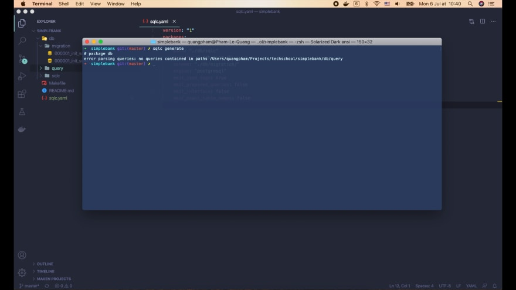

Мы напишем запросы немного позднее. А пока давайте добавим в Makefile новую 
команду `sqlc`. Это поможет нашим коллегам легко найти все команды, которые 
можно использовать для разработки, в одном месте.

```
...

sqlc:
    sqlc generate

.PHONY: postgres createdb dropdb migrateup migratedown sqlc
```

## Операция CREATE

Теперь давайте напишем наш первый SQL-запрос для СОЗДАНИЯ (`CREATE`) счёта. Я 
собираюсь создать новый файл `account.sql` в папке `db/query`.

Затем вернитесь на Github страницу `sqlc` и найдите раздел `Getting started`.

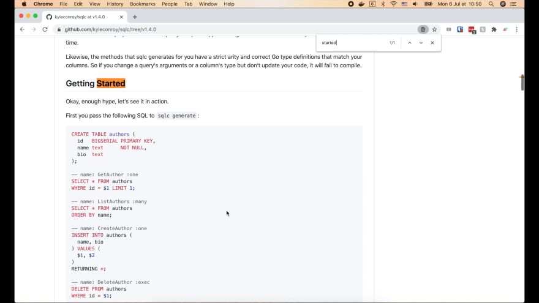

## Пишем SQL-запрос для создания учетной записи

Здесь мы видим несколько примеров того, как должен выглядеть SQL-запрос. Давайте 
скопируем команду `CreateAuthor` и вставим ее в наш файл `account.sql`.

Это просто базовый запрос `INSERT`. Единственная особенность — это комментарий 
перед ним. Этот комментарий проинструктирует `sqlc`, как сгенерировать сигнатуру 
функции на языке Golang для этого запроса.

В нашем случае имя функции будет `CreateAccount`. И он должен возвращать один 
единственный объект `Account`, поэтому мы используем метку `:one` здесь.

```postgresql
-- name: CreateAccount :one
INSERT INTO accounts (
  owner,
  balance,
  currency
) VALUES (
  $1, $2, $3
) RETURNING *;
```

Нам не нужно указывать `id`, потому что это столбец с автоматическим 
инкрементом. Каждый раз, когда вставляется новая запись, база данных автоматически 
увеличивает порядковый номер идентификатора счёта использует его в качестве 
значения для столбца `id`.

Столбец `created_at` также будет автоматически заполнен значением по 
умолчанию, то есть временем создания записи.

Итак, нам нужно только предоставить значения для столбцов `owner`, `balance` и
`currency`. Таким образом, нам нужно передать 3 аргумента в часть `VALUES`.

Наконец, часть `RETURNING *` используется, чтобы указать Postgres вернуть 
значение всех столбцов после вставки записи в таблицу `accounts` (включая `id` и 
`created_at`). Это очень важно, так как после создания счёта мы всегда будем 
хотеть вернуть его ID клиенту.

## Генерируем Go код для создания счёта

Итак, теперь давайте откроем терминал и выполним команду `make sqlc`.

Затем вернитесь в Visual Studio Code. В папке `db/sqlc` мы видим три новых 
сгенерированных файла.

Первый — `models.go`. Этот файл содержит определение структуры трех моделей: 
`Account`, `Entry` и `Transfer`.

```go
// Code generated by sqlc. DO NOT EDIT.

package db

import (
  "time"
)

type Account struct {
  ID        int64     `json:"id"`
  Owner     string    `json:"owner"`
  Balance   int64     `json:"balance"`
  Currency  string    `json:"currency"`
  CreatedAt time.Time `json:"created_at"`
}

type Entry struct {
  ID        int64 `json:"id"`
  AccountID int64 `json:"account_id"`
  // can be negative or positive
  Amount    int64     `json:"amount"`
  CreatedAt time.Time `json:"created_at"`
}

type Transfer struct {
  ID            int64 `json:"id"`
  FromAccountID int64 `json:"from_account_id"`
  ToAccountID   int64 `json:"to_account_id"`
  // must be positive
  Amount    int64     `json:"amount"`
  CreatedAt time.Time `json:"created_at"`
}
```

Они содержат JSON дескрипторы, потому что мы задали для `emit_json_tags` значение 
`true` в `sqlc.yaml`. Поле `Amount` структуры `Entry` и `Transfer` также содержит 
комментарий перед ним, потому что мы добавили их в определение схемы базы 
данных в предыдущей лекции.

Второй файл — `db.go`. Этот файл содержит интерфейс `DBTX`. Он определяет 4 
общих метода, которые есть у объекта `sql.DB` и `sql.Tx`. Это позволяет нам 
свободно использовать базу данных или транзакцию для выполнения запроса.

```go
// Code generated by sqlc. DO NOT EDIT.

package db

import (
  "context"
  "database/sql"
)

type DBTX interface {
  ExecContext(context.Context, string, ...interface{}) (sql.Result, error)
  PrepareContext(context.Context, string) (*sql.Stmt, error)
  QueryContext(context.Context, string, ...interface{}) (*sql.Rows, error)
  QueryRowContext(context.Context, string, ...interface{}) *sql.Row
}

func New(db DBTX) *Queries {
  return &Queries{db: db}
}

type Queries struct {
  db DBTX
}

func (q *Queries) WithTx(tx *sql.Tx) *Queries {
  return &Queries{
    db: tx,
  }
}
```

Как видно здесь функция `New()` принимает `DBTX` в качестве входных данных и 
возвращает объект `Queries`. Таким образом, мы можем передать объект `sql.DB` или 
`sql.Tx` в зависимости от того, хотим ли мы выполнить только один запрос или 
набор нескольких запросов в рамках транзакции.

Существует также метод `WithTx()`, который позволяет связать экземпляр `Queries` 
с транзакцией. Подробнее об этом мы узнаем из другой лекции о транзакциях.

Третий файл — это файл `account.sql.go`.

```go
// Code generated by sqlc. DO NOT EDIT.
// source: account.sql

package db

import (
  "context"
)

const createAccount = `-- name: CreateAccount :one
INSERT INTO accounts (
  owner,
  balance,
  currency
) VALUES (
  $1, $2, $3
) RETURNING id, owner, balance, currency, created_at
`

type CreateAccountParams struct {
  Owner    string `json:"owner"`
  Balance  int64  `json:"balance"`
  Currency string `json:"currency"`
}

func (q *Queries) CreateAccount(ctx context.Context, arg CreateAccountParams) (Account, error) {
  row := q.db.QueryRowContext(ctx, createAccount, arg.Owner, arg.Balance, arg.Currency)
  var i Account
  err := row.Scan(
    &i.ID,
    &i.Owner,
    &i.Balance,
    &i.Currency,
    &i.CreatedAt,
  )
  return i, err
}
```

Название пакета `db`, как мы определили в файле `sqlc.yaml`.

Вверху мы видим SQL-запрос для создания счёта. Он выглядит почти так же, как тот, 
который мы написали в файле `account.sql`, за исключением части с `RETURN`.
`Sqlc` явно заменил `RETURN *` на названия всех столбцов. Это делает запрос 
более четким и позволяет избежать сканирования значений в неправильном порядке.

Затем определена структура `CreateAccountParams`, содержащая все столбцы, которые мы 
хотим задать при создании нового счёта: `owner`, `balance`, `currency`.

Функция `CreateAccount()` определена как метод объекта `Queries`. Она так называется, 
потому что мы проинструктировали `sqlc` с помощью комментария в нашем 
SQL-запросе. Эта функция принимает контекст и объект `CreateAccountParams` в 
качестве входных данных и возвращает объект модели `Account` или ошибку 
(`error`).

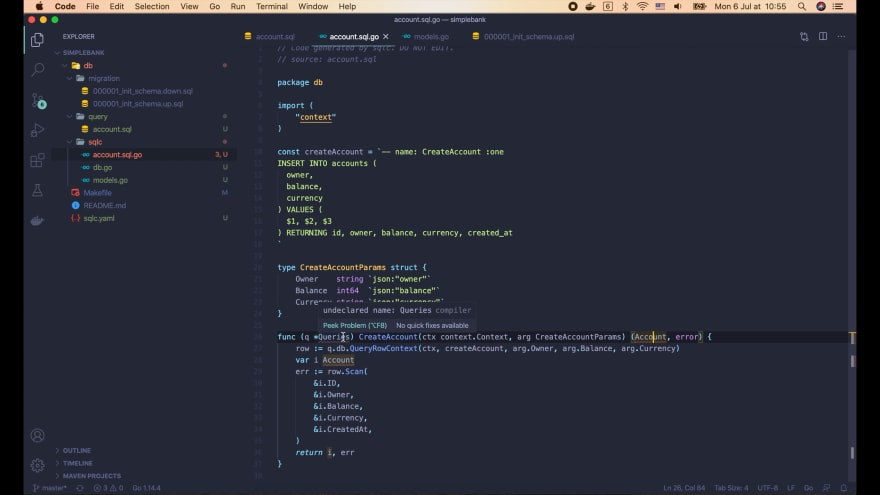

Visual Studio Code подчеркивает здесь несколько строк красным, потому что мы 
еще не инициализировали модуль для нашего проекта.

Откроем терминал и запустим:

```shell
go mod init github.com/MaksimDzhangirov/backendBankExample
```

Наш модуль называется `github.com/MaksimDzhangirov/backendBankExample`. Для
нас был сгенерирован файл `go.mod`. Давайте запустим следующую команду, чтобы 
установить любые необходимые зависимости.

```shell
go mod tidy
```

Хорошо, теперь вернемся к файлу `account.sql.go`. Все ошибки, подчеркнутые 
красным, исчезли.

В функции `CreateAccount()` мы вызываем `QueryRowContext()` для выполнения 
SQL-запроса создания счёта. Эта функция удовлетворяет интерфейсу `DBTX`, который 
мы видели ранее. Мы передаем контекст, запрос и три аргумента: `owner`, `balance` 
и `currency`.

Функция возвращает объекту-строку из базы данных, которую мы можем использовать
для сканирования значения каждого столбца в правильные переменные. Это базовый 
код, который нам часто приходится писать вручную, если мы используем стандартную 
библиотеку `database/sql`. Но как здорово, что он автоматически сгенерирован 
за нас! Потрясающе, правда?

Еще одна удивительная особенность `sqlc`: он проверяет синтаксис SQL-запроса 
перед генерацией кода. Итак, если я попытаюсь удалить третий аргумент в запросе

```postgresql
-- name: CreateAccount :one
INSERT INTO accounts (
  owner,
  balance,
  currency
) VALUES (
  $1, $2
) RETURNING *;
```

и снова запущу `make sqlc`, появится сообщение об ошибке:
`INSERT has more target columns than expressions` (Количество столбцов больше 
количества выражений).

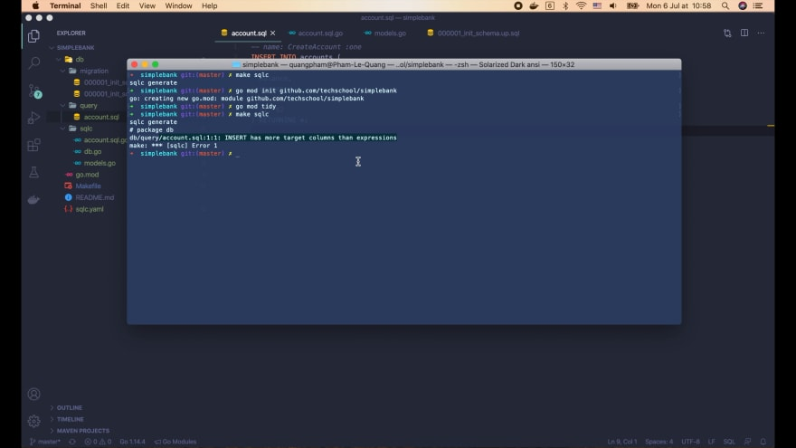

Из-за этого, если `sqlc` успешно сгенерирует коды, мы можем быть уверены, что в 
наших SQL-запросах нет глупых ошибок.

При работе с `sqlc` следует помнить, что мы не должны изменять содержимое 
сгенерированных файлов, потому что каждый раз, когда мы запускаем `make sqlc`, 
все эти файлы будут создаваться заново, и наши изменения будут потеряны.
Поэтому обязательно создайте новые файлы, если вы хотите добавить больше кода 
в пакет `db`.

Итак, теперь мы знаем, как создавать записи в базе данных.

## Операции READ (GET/LIST)

Перейдем к следующей операции: `READ`.

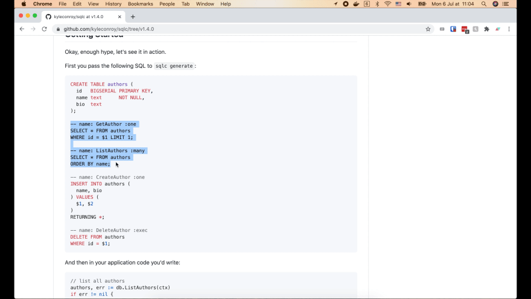

В этом примере существует два основных запроса на получение данных: `Get` и 
`List`. Скопируем их в наш файл `account.sql`.

## Создаём SQL запросы для получения одного счёта/списка счётов

Get запрос используется для получения одной конкретного счёта по идентификатору.
Поэтому я собираюсь изменить его название на `GetAccount`. И запрос будет иметь вид:

```postgresql
-- name: GetAccount :one
SELECT * FROM accounts
WHERE id = $1 LIMIT 1;
```

Мы используем здесь `LIMIT 1`, потому что мы просто хотим выбрать одну единственную 
запись.

Следующая операция — `ListAccounts`. Он вернет несколько записей о счетах, 
поэтому мы используем здесь метку `:many`.

```postgresql
-- name: ListAccounts :many
SELECT * FROM accounts
ORDER BY id
LIMIT $1
OFFSET $2;
```

Как и в случае с запросом `GetAccount`, мы выбираем записи из таблицы `accounts`, а 
затем упорядочиваем их по идентификаторам.

Так как счетов в базе может быть очень много, не стоит выбирать их все сразу. 
Вместо этого мы будем осуществлять пагинацию. Поэтому мы используем `LIMIT`, 
чтобы установить количество строк, которые мы хотим получить, и используем 
`OFFSET`, чтобы указать Postgres пропустить это количество строк, прежде чем 
начать возвращать результат.

Вот и всё!

## Генерируем Go код для получения одного счёта/списка счётов

Теперь давайте запустим `make sqlc` для повторной генерации кодов и откроем файл 
`account.sql.go`.

Как видим были сгенерированы функции `GetAccount()` и `ListAccounts()`. Как и ранее, 
`sqlc` заменил для нас `SELECT *` явными названиями столбцов.

```go
const getAccount = `-- name: GetAccount :one
SELECT id, owner, balance, currency, created_at FROM accounts
WHERE id = $1 LIMIT 1
`

func (q *Queries) GetAccount(ctx context.Context, id int64) (Account, error) {
	row := q.db.QueryRowContext(ctx, getAccount, id)
	var i Account
	err := row.Scan(
		&i.ID,
		&i.Owner,
		&i.Balance,
		&i.Currency,
		&i.CreatedAt,
	)
	return i, err
}
```

Функция `GetAccount()` принимает контекст и идентификатор счёта в 
качестве входных данных. А внутри он просто вызывает `QueryRowContext()` с 
непосредственным SQL-запросом и идентификатором счёта. Он сканирует строку базы 
данных в объект `Account` и возвращает ее вызывающей стороне. Довольно просто!

Функция `ListAccounts` немного сложнее. Он принимает контекст, параметры 
`limit` и `offset` в качестве входных данных и возвращает список объектов 
`Account`.

```go
const listAccounts = `-- name: ListAccounts :many
SELECT id, owner, balance, currency, created_at FROM accounts
ORDER BY id
LIMIT $1
OFFSET $2
`

type ListAccountsParams struct {
	Limit  int32 `json:"limit"`
	Offset int32 `json:"offset"`
}

func (q *Queries) ListAccounts(ctx context.Context, arg ListAccountsParams) ([]Account, error) {
	rows, err := q.db.QueryContext(ctx, listAccounts, arg.Limit, arg.Offset)
	if err != nil {
		return nil, err
	}
	defer rows.Close()
	var items []Account
	for rows.Next() {
		var i Account
		if err := rows.Scan(
			&i.ID,
			&i.Owner,
			&i.Balance,
			&i.Currency,
			&i.CreatedAt,
		); err != nil {
			return nil, err
		}
		items = append(items, i)
	}
	if err := rows.Close(); err != nil {
		return nil, err
	}
	if err := rows.Err(); err != nil {
		return nil, err
	}
	return items, nil
}
```

Внутри она вызывает `QueryContext()`, передает запрос на возврат списка 
счетов вместе с `limit` и `offset`.

Эта функция возвращает объект `rows`. Он работает как итератор, 
который позволяет нам просматривать записи одну за другой, сканировать каждую 
запись в объект `Account` и добавлять ее в список элементов.

Наконец, функция закрывает объект `rows`, чтобы избежать утечки соединения с базой 
данных. Она также проверяет наличие любых ошибок перед возвратом элементов 
вызывающей стороне.

Код выглядит довольно большим, но его легко понять. И кроме того он работает очень
быстро! И нам не нужно беспокоиться о глупых ошибках в коде, потому что `sqlc` 
уже гарантирует, что сгенерированный код будет работать идеально.

## Операция UPDATE

Отлично, давайте перейдем к следующей операции: `UPDATE`.

## Создаём SQL запрос для обновления счёта

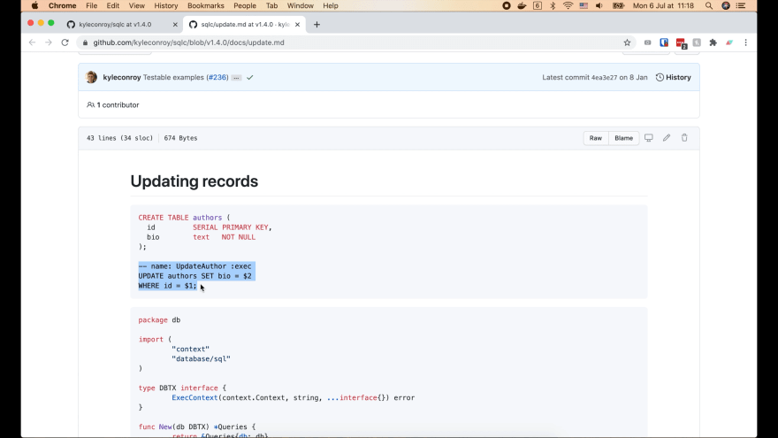

Давайте скопируем этот код в наш файл `account.sql` и изменим имя функции на 
`UpdateAccount()`.

```postgresql
-- name: UpdateAccount :exec
UPDATE accounts
SET balance = $2
WHERE id = $1;
```

Здесь мы используем новую метку `:exec`, потому что эта команда не возвращает 
никаких данных, она просто обновляет одну строку в базе данных.

Допустим, мы разрешаем только обновление баланса счета. Владелец счета и 
валюта не должны быть изменены.

Мы используем оператор WHERE, чтобы указать идентификатор счёта, который мы 
хотим обновить. Вот и все!

## Генерируем Go код для обновления счёта

Теперь запустите `make sqlc` в терминале, чтобы повторно сгенерировать код. И вуаля, 
у нас есть функция `UpdateAccount()`.

```shell
const updateAccount = `-- name: UpdateAccount :exec
UPDATE accounts
SET balance = $2
WHERE id = $1
`

type UpdateAccountParams struct {
  ID      int64 `json:"id"`
  Balance int64 `json:"balance"`
}

func (q *Queries) UpdateAccount(ctx context.Context, arg UpdateAccountParams) error {
  _, err := q.db.ExecContext(ctx, updateAccount, arg.ID, arg.Balance)
  return err
}
```

Он принимает переменные контекст, `id` счёта и `balance` в качестве входных 
данных. Все, что он делает, это вызывает `ExecContext()` с запросом и входными 
аргументами, а затем возвращает ошибку (`error`) вызывающей стороне.

## Возвращаем обновленную строку

Иногда бывает полезно также вернуть обновленный объект `Account`. В этом 
случае мы можем изменить метку `:exec` на `:one` и добавить RETURNING * в конце 
этого запроса на обновление:

```postgresql
-- name: UpdateAccount :one
UPDATE accounts
SET balance = $2
WHERE id = $1
RETURNING *;
```

Затем повторно сгенерируйте код.

```go
const updateAccount = `-- name: UpdateAccount :one
UPDATE accounts
SET balance = $2
WHERE id = $1
RETURNING id, owner, balance, currency, created_at
`

type UpdateAccountParams struct {
  ID      int64 `json:"id"`
  Balance int64 `json:"balance"`
}

func (q *Queries) UpdateAccount(ctx context.Context, arg UpdateAccountParams) (Account, error) {
  row := q.db.QueryRowContext(ctx, updateAccount, arg.ID, arg.Balance)
  var i Account
  err := row.Scan(
    &i.ID,
    &i.Owner,
    &i.Balance,
    &i.Currency,
    &i.CreatedAt,
  )
  return i, err
}
```

Теперь SQL-запрос изменился, и функция `UpdateAccount()` возвращает обновленный
`Account` вместе с ошибкой (`error`). Класс!

## Операция DELETE

Последняя операция `DELETE`. Она реализуется даже проще, чем обновление.

## Создаём SQL запрос для удаления счёта

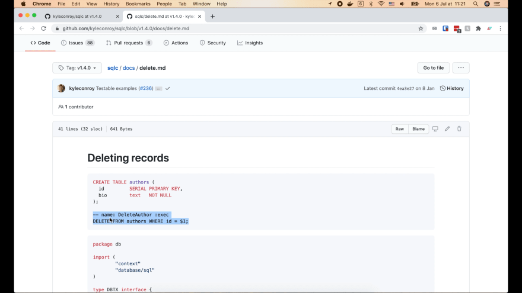

Давайте скопируем этот пример запроса и изменим название функции на `DeleteAccount`. 
Я не хочу, чтобы Postgres возвращал удаленную запись, поэтому воспользуемся 
меткой `:exec`.

```shell
-- name: DeleteAccount :exec
DELETE FROM accounts
WHERE id = $1;
```

## Генерируем Go код для удаления счёта

Давайте запустим `make sqlc`, чтобы повторно сгенерировать код. Теперь у нас есть 
функция `DeleteAccount()` в коде.

```go
const deleteAccount = `-- name: DeleteAccount :exec
DELETE FROM accounts
WHERE id = $1
`

func (q *Queries) DeleteAccount(ctx context.Context, id int64) error {
  _, err := q.db.ExecContext(ctx, deleteAccount, id)
  return err
}
```

Итак, мы научились генерировать все CRUD операции для нашей таблицы `accounts`.
Вы можете попробовать сделать то же самое для двух оставшихся таблиц: `entries` 
и `transfers` самостоятельно в качестве упражнения.

Я запушу код на Github в [этот репозитории](https://github.com/techschool/simplebank), чтобы 
у вас был образец, если он вдруг вам понадобится.

И это все о чём я хотел рассказать на сегодняшней лекции. Большое спасибо за время,
потраченное на чтение и до встречи на следующей лекции!