# Define gRPC API and generate Go code with protobuf

[Original video](https://www.youtube.com/watch?v=mVWgEmyAhvM)

Hello guys. In the [last lecture](part39-eng.md), we learned some basic
theories about gRPC. Now it's time for some hands-on practice!

# Define the RPC API

The first step to develop a gRPC web service is to define the RPC API
and its request/response structure using `protobuf`. Then use that 
`protobuf` definition to generate codes for the server and client in
the target programming language of your choice. And that's exactly
what we're gonna do in this video. On the gRPC documentation page,
you can find the instruction in the [Quick Start](https://grpc.io/docs/languages/go/quickstart/) 
section. The first step is to install `Protocol Buffer` compiler.
If you're using Linux or Mac, you can easily install it with a 
package manager. For Windows, you will have to download the 
pre-compiled binary from the protoc's [release page](https://github.com/google/protobuf/releases).
Since I'm on a Mac, I will install it with Homebrew. So let's run

```shell
brew install protobuf
```

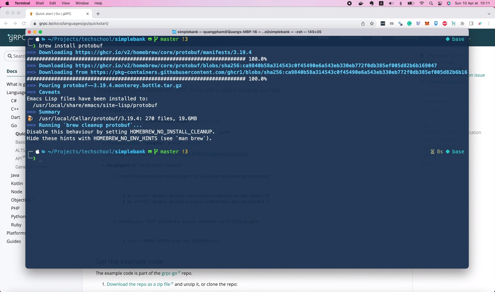

in the terminal. After the installation is successful, we can check 
its version with this command:

```shell
protoc --version
libprotoc 3.19.4
```

Now, in order to generate Golang codes, we have to install 2 more
plugins for the compiler. First, the `protoc-gen-go` plugin will
help us generate Go codes for any request/response data message
defined in `protobuf`.

```shell
go install google.golang.org/protobuf/cmd/protoc-gen-go@1.28
```

You can check the installed version with this command:

```shell
protoc-gen-go --version
protoc-gen-go v1.28.0
```

Here I'm installing the latest version at the moment, which is version
1.28.

The second plugin we must install is `protoc-gen-go-grpc`, which, as 
its name may suggest, will help us generate Go codes that work with
gRPC framework.

```shell
go install google.golang.org/grpc/cmd/protoc-gen-go-grpc@v1.2
go: downloading google.golang.org/grpc/cmd/protoc-gen-go-grpc v1.2.0
go: downloading google.golang.org/grpc v1.2.1
```

And the version I've just installed is version 1.2, which is the latest
version at the time I record this video.

```shell
protoc-gen-go-grpc --version
protoc-gen-go-grpc 1.2.0
```

If you watch this video in the future, the latest version might be
different, and the generated codes might be different from mine.
However, I think once you understand the idea behind it, you can 
easily adapt your code to work with any new changes in the future.

There's one last step you might have to do, so that the `protoc` 
compiler can find the installed plugins, which is adding the go
`bin` folder to the PATH of your system.

```shell
export PATH="$PATH:$(go env GOPATH)/bin"
```

I'm already done this before when installing Go, so I'm gonna
skip it.

Alright, now with all the tools installed, we can start writing
some codes. In this lecture, I will show you how to write 
`protobuf` definition for 2 APIs: the API to create a new user,
and the API to login user to get access and refresh tokens.

## Write `protobuf` definition for create a new user API

I'm gonna create a new folder called `proto` to store all the 
`protobuf` files. Since our APIs will deal with users, I will
start by defining the `User` object. So let's create a 
`user.proto` file inside the `proto` folder.

First, we set `syntax = "proto3"` to tell the compiler that we're
gonna use the `protobuf` syntax version 3 to define our 
messages. There's also `protobuf` version 2, but I think it's 
best to stick with the latest version.

```protobuf
syntax = "proto3";
```

For now we don't have syntax highlighting yet. To have it, we must
install the `vscode-proto3` plugin.

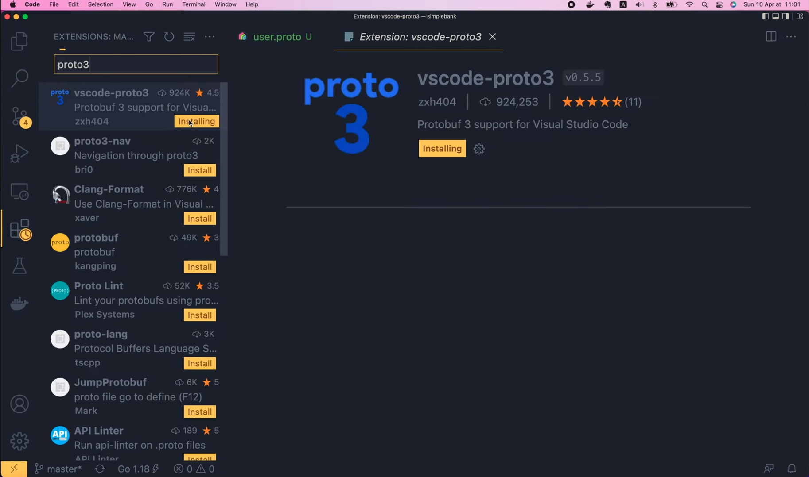

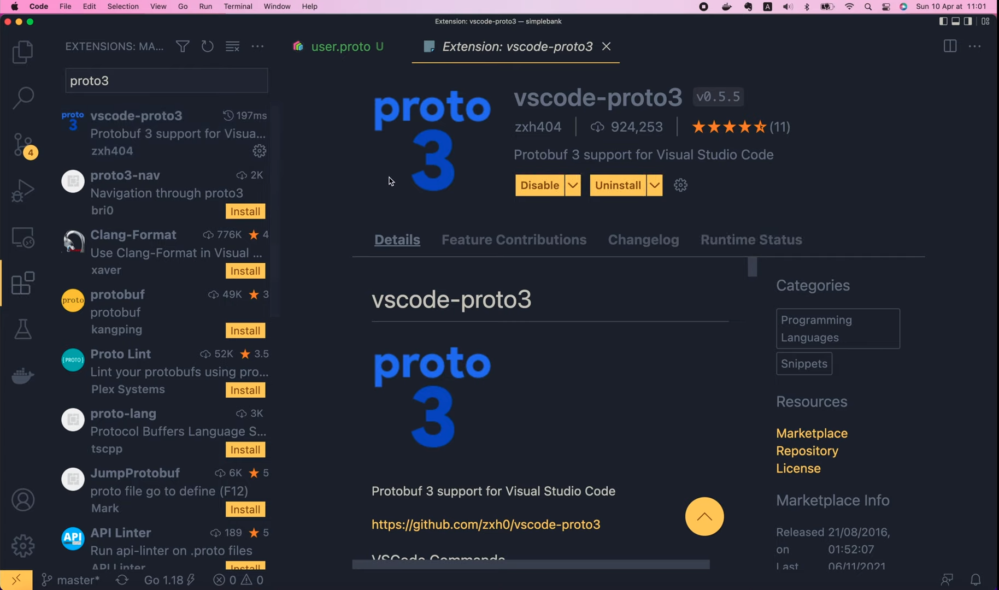

Once that plugin is installed and enabled, we will see the syntax
highlighted in our `proto` file.

Next, I'm gonna declare the package for this `proto` file. Let's 
call it `pb`. A package is just a way to group multiple `proto`
files of the same topic together.

```protobuf
package pb;
```

Then, we must specify 1 `option` to tell `protoc` which Go package we 
want it to generate the Golang codes to. Basically, it should be a 
subpackage of the root module we specified in the `go.mod` file: 
`github.com/techschool/simplebank`.

So I'm gonna copy it to the `user.proto` file, and add a `/pb` suffix
at the end.

```protobuf
option go_package = "github.com/techschool/simplebank/pb";
```

Then with this option, the generated Go codes will go into the 
`pb` folder, which I've just created here.

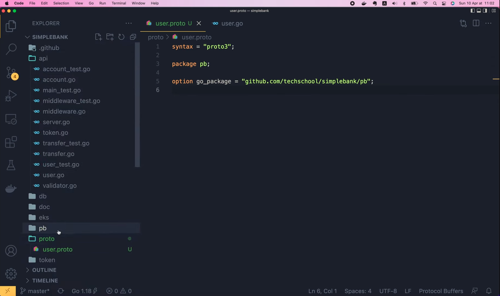

OK, now we can define the `User` message like this. Inside the curly
brackets, we will have to specify all the fields that a `User` object
will hold, which are the `Username`, `FullName`, `Email`, 
`PasswordChangedAt`, `CreatedAt`. Just like what's currently 
defined in the `userResponse` struct.

```go
type userResponse struct {
	Username          string    `json:"username"`
	FullName          string    `json:"full_name"`
	Email             string    `json:"email"`
	PasswordChangedAt time.Time `json:"password_changed_at"`
	CreatedAt         time.Time `json:"created_at"`
}
```

To define a field of a `proto3` message, we use this syntax:
start with the data type of the field, for example, `string`.
Then the name of the field, which is `username`, followed by
an equal symbol, and a field number.

```protobuf
message User {
  string username = 1;
}
```

This field number is very important in a `protobuf` message, 
because it will be used to uniquely identify the field when 
[serialize or deserialize the message in binary format](https://developers.google.com/protocol-buffers/docs/proto3#assigning_field_numbers).
You can use any integers between 1 and 2^29-1, except for 
some reserved numbers, which you can find on the official `protobuf`
documentation page.

You can also read more about different supported data types on
[this page](https://developers.google.com/protocol-buffers/docs/proto3#scalar).
I will put the link in the description.

OK, back to the `User` message, the next field is also a string:
`full_name`. And I'm gonna set its field number to 2.

```protobuf
message User {
  string username = 1;
  string full_name = 2;
}
```

The third field is string `email`, field number 3.

```protobuf
message User {
  string username = 1;
  string full_name = 2;
  string email = 3;
}
```

Then we will have the `password_changed_at` field, which must be 
a timestamp. Timestamp is not a built-in data type of `protobuf`,
but it's a well-known data type, and Google has already added it
to their standard library. So we can refer to it as 
`google.protobuf.Timestamp`, then the field name is gonna be 
`password_changed_at`, and the field number is gonna be 4.

```protobuf
message User {
  string username = 1;
  string full_name = 2;
  string email = 3;
  google.protobuf.Timestamp password_changed_at = 4;
}
```

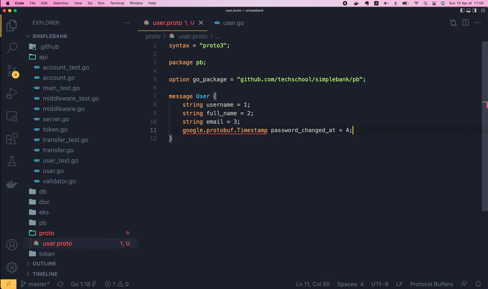

Here you can see a red line under the data type because it's not
a built-in one. So we have to import it from Google's library,
which is: "google/protobuf/timestamp.proto". And with this 
import, the error will be gone.

```protobuf
import "google/protobuf/timestamp.proto";
```

OK, now in a similar fashion, I'm gonna add the last field to the
User message, the `created_at` field, which is also a timestamp,
and its field number is gonna be 5.

```protobuf
message User {
  string username = 1;
  string full_name = 2;
  string email = 3;
  google.protobuf.Timestamp password_changed_at = 4;
  google.protobuf.Timestamp created_at = 5;
}
```

Here you can see that I'm using a list of sequantial integers
from 1 to 5 for the field numbers. You don't have to do that,
but it's just a normal way to define the fields. Note that numbers
from 1 to 15 take only 1 byte to encode, while bigger numbers 
require 2 or more bytes. So by using small numbers, we're also
saving some memory space, and thus make the message smaller in size
when being encoded.

Alright, so we've successfully defined a `User` object using `protocol
buffer`.

Now it's time to define our first RPC: the create user API. I'm gonna
create a new file called `rpc_create_user.proto` inside the `proto`
folder. Then let's paste in the same content of the `user.proto` file,
because we're gonna reuse most of it. We can keep all the `syntax`,
`package`, `import` and `option` commands. But let's change the message
name to `CreateUserRequest`.

This will be the object that contains the request to create a new
user from the client. It must provide 4 required fields: the `username`,
`password`, `full_name` and `email`. So I'm gonna keep the first 3 
fields of this `User` struct, remove the rest, and add a new `string`
field for the `password`.

```protobuf
message CreateUserRequest {
  string username = 1;
  string full_name = 2;
  string email = 3;
  string password = 4;
}
```

We don't need this import here

```protobuf
import "google/protobuf/timestamp.proto";
```

since there's no timestamp field in the message.

OK, now we have the `CreateUserRequest` message. Next, I'm gonna
define another message to store the `CreateUserResponse`. This
message will, of course, contain the information of the created 
user. So we will have a `user` field of type `User` as field 
number 1. This is our custom data type, so we have to import it
from the `user.proto` file.

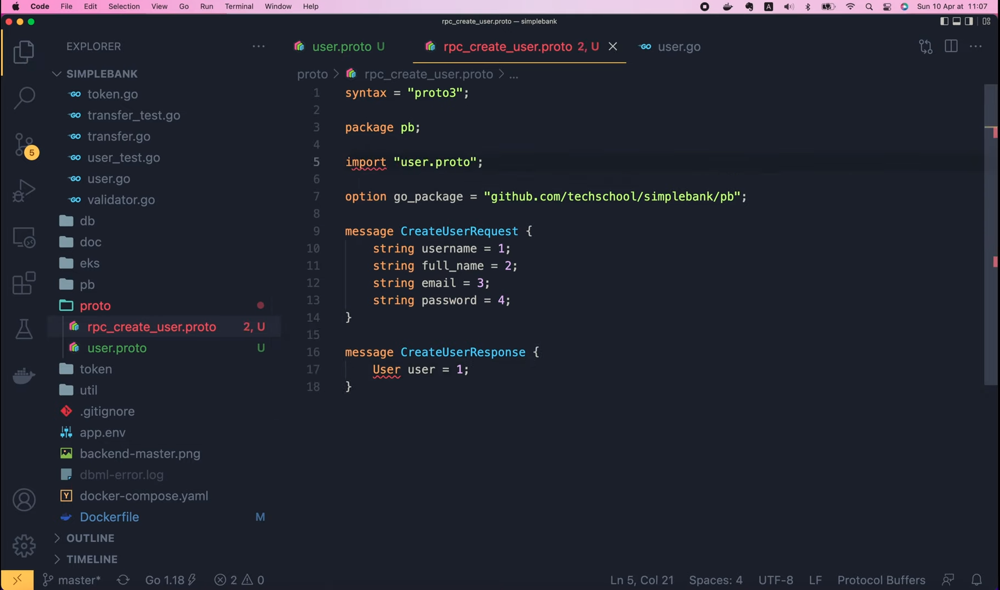

But why is these still a red line under this `import`?

Well, that's because by default, `protoc` will look for the file 
in the current folder that we're opening in Visual Studio Code,
but our `proto` files are actually in the `proto` folder. So to
fix this, we have to tell `protoc` about that. Let's open the
`vscode-proto3` plugin. Here in its documentation, we will find
a chunk of settings for `protoc`.

```json
{
  "protoc": {
    "path": "/path/to/protoc",
    "compile_on_save": false,
    "options": [
      "--proto_path=protos/v3",
      "--proto_path=protos/v2",
      "--proto_path=${workspaceRoot}/proto",
      "--proto_path=${env.GOPATH}/src",
      "--java_out=gen/java"
    ]
  }
}
```

Let's copy it, then open `Code / Preferences / Settings`, search
for `proto3` and click `Edit` in `settings.json`.

Now I'm gonna paste in the settings we've copied before, remove
the outer curly brackets, then here, we can remove the 
`/path/to/protoc` and the `compile_on_save` option. Just keep
the `options` for `proto-path`. All of our `proto` files are stored
in the `proto` folder, so that's what I'm gonna set to this option.
And we can get rid of all remaining options. Just like that.

```json
{
  "protoc": {
    "options": [
      "--proto_path=proto",
    ]
  }
}
```

Then save the file and go back to the code.

Now we can see that all the red lines are gone. Excellent!

Keep in mind that, here we're just defining the request and 
response data structure of the API. Next step, we will have
to declare a gRPC service and add the RPC definition of that
API.

I'm gonna do it in a separate file called 
`service_simple_bank.proto`. The top commands to declare the 
protobuf syntax and packages should be the same as in other `proto`
files.

```protobuf
syntax = "proto3";

package pb;

import "user.proto";

option go_package = "github.com/techschool/simplebank/pb";
```

But this time, we're gonna define a service called `SimpleBank`
instead of a message as in other files. And inside this service, 
I'm gonna define the first RPC named `CreateUser`. It will take
a `CreateUserRequest` object as input, and will return a 
`CreateUserResponse`. This RPC definition ends with a pair of
curly brackets. We will learn how to specify some custom settings
for the RPC inside these curly brackets in other lectures. For now
let's keep them empty.

```protobuf
service SimpleBank {
  rpc CreateUser(CreateUserRequest) returns (CreateUserResponse) {
  }
}
```

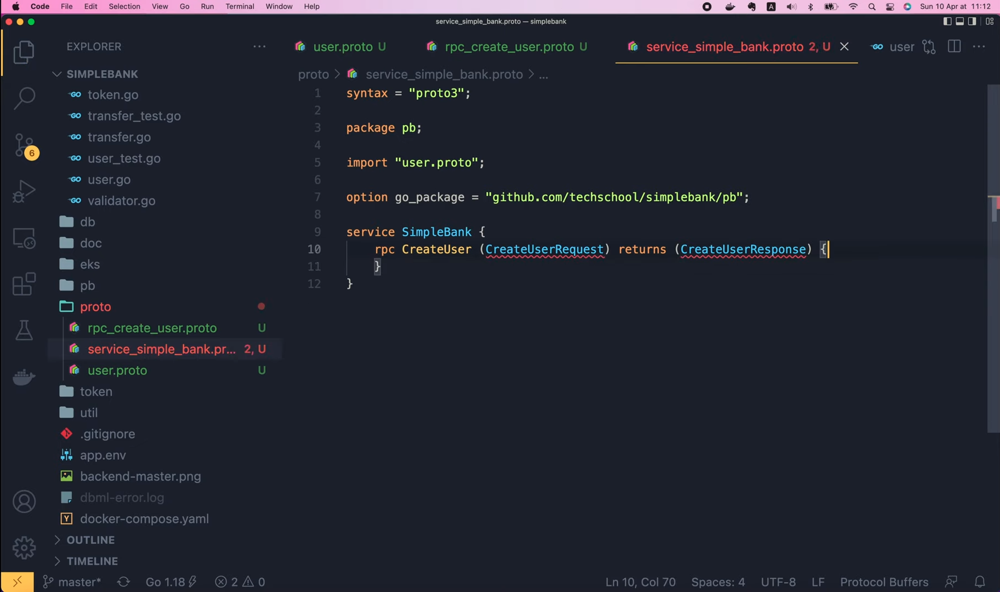

Here we see the red lines again under the request and response 
objects. And you know what to do, right? We have to import 
the `rpc_create_user.proto` file, since that's where the request 
and response objects are defined.

```protobuf
import "user.proto";
import "rpc_create_user.proto";
```

And we can get rid of this import `user.proto` file.

## Write `protobuf` definition for login user API

OK, so now everything looks good! We've successfully defined 1 
gRPC API to create a new user. Can you do the same for the API
to login user? This is the chance for you to pause the video
and do it on your own. Then we're gonna do it together in a
moment. And by the way, do you still remember the 4 types of
gRPC that we talked about in the previous theory lecture? Can
you guess what type of gRPC the `CreateUser` API is? Yes, it
is the simplest type of gRPC: unary gRPC, because the client
just send 1 single request, and get back 1 single response.

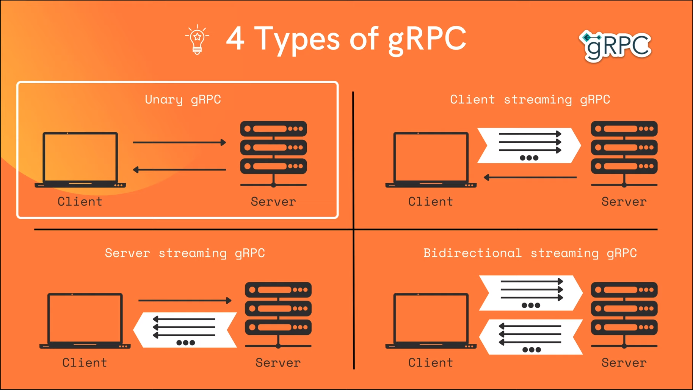

Alright, were you successful in defining the login API RPC?

It's also a unary gRPC, just like the `CreateUser` API. First,
let's create a new file called `rpc_login_user.proto` inside
the `proto` folder.

Then I'm gonna copy everything from the `rpc_create_user.proto`
file to this new file. Now we must change the message names to
`LoginUserRequest` and `LoginUserResponse`. To login, we only 
need the `username` and `password`, so I'm gonna remove all
other fields, and change the field number of the `password` to 2.
That's it for the request message.

```protobuf
syntax = "proto3";

package pb;

import "user.proto";

option go_package = "github.com/techschool/simplebank/pb";

message LoginUserRequest {
  string username = 1;
  string password = 2;
}
```

For the response message, apart from the `user` information, we 
will need several more fields for the session, the access token 
and refresh tokens. So let's add a new field 
`string session_id = 2`, `string access_token = 3`, and 
`string refresh_token = 4`. The rest will be 2 timestamp
fields to store the expiration time of the tokens.
I'm gonna copy the import google package statement from the
`user.proto` file. Then the `access_token_expires_at` field will
be of type `google.protobuf.Timestamp` and field id equals 5. 
Finally, we have the same timestamp type for the 
`refresh_token_expires_at`, and its field id will be 6.

```protobuf
message LoginUserResponse {
  User user = 1;
  string session_id = 2;
  string access_token = 3;
  string refresh_token = 4;
  google.protobuf.Timestamp access_token_expires_at = 5;
  google.protobuf.Timestamp refresh_token_expires_at = 6;
}
```

OK, now it's time to define the RPC in the 
`service_simple_bank.proto` file. Let's import 
`rpc_login_user.proto`, then duplicate the `CreateUser`
RPC. I'm gonna change the second RPC's name to `LoginUser`.
Its input should be changed to `LoginUserRequest`, and the 
output should be `LoginUserResponse`. And that's basically
it!

```protobuf
import "rpc_login_user.proto";

service SimpleBank {
  rpc CreateUser(CreateUserRequest) returns (CreateUserResponse) {}
  rpc LoginUser(LoginUserRequest) returns (LoginUserResponse) {}
}
```

We're done with the definition of the `CreateUser` and 
`LoginUser` APIs for our Simple Bank gRPC service.

Now comes the important step: generating Golang codes from
this service definition. It's actually pretty simple, as we've
already had all the necessary tools installed.

In the `Makefile`, I'n gonna add a new command called `proto`.
Then let's go back to the `Quick Start` page of the [gRPC 
documentation website](https://grpc.io/docs/languages/go/quickstart/).

You will find the `protoc` command to generate the codes 
in [this section](https://grpc.io/docs/languages/go/quickstart/#regenerate-grpc-code).

Let's copy it, and paste it to our `Makefile`. We will have to 
update this command a bit though.

```makefile
proto:
	protoc --go_out=. --go_opt=paths=source_relative \
        --go-grpc_out=. --go-grpc_opt=paths=source_relative \
        helloworld/helloworld.proto
```

First, let's add the `proto_path` option to point to the location
of our `proto` files, which is inside the `proto` folder. Then the
`go_out` option should point to the folder, where we want the 
generated Golang codes to be, which, in our case, is the `pb` 
folder. We keep this `go_opt=paths=source_relative` option as
it is, then change the `go_grpc_out` option to the same `pb` 
folder. Leave the `go-grpc_opt=paths=source_relative` as it is.
Then finally, the last argument should be the location of our
`proto` files, which is `proto/*.proto`, because we want to 
generate codes for all `proto` files in that folder.

```makefile
proto:
	protoc --proto_path=proto --go_out=pb --go_opt=paths=source_relative \
        --go-grpc_out=pb --go-grpc_opt=paths=source_relative \
        proto/*.proto
```

That's it! Let's add the `proto` command to the PHONY list. Then
open the terminal, and run:

```shell
make proto
protoc --proto_path=proto --go_out=pb --go_opt=paths=source_relative \
        --go-grpc_out=pb --go-grpc_opt=paths=source_relative \
        proto/*.proto
```

Yee! It's successful! 

Now, if we go back to Visual Studio Code, and open the `pb` folder,
we will see several generated files, with the extension `.pb.go`.

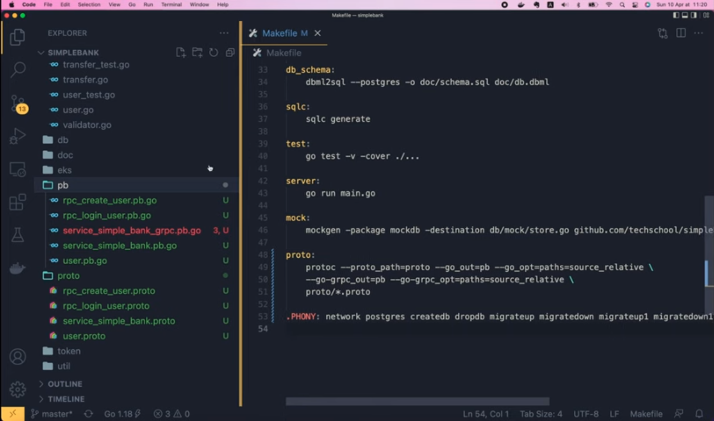

Each file corresponds to its own proto file we wrote in the `proto`
folder.

So we have `rpc_create_user`, `rpc_login_user`, 
`service_simple_bank`, and `user`.

There's also another file called 
`service_simple_bank_grpc.pb.go`. This is file that
contains the gRPC server and client interfaces or stubs,
that we will base on to write the real implementation later.
Right now there are some errors with the import packages.

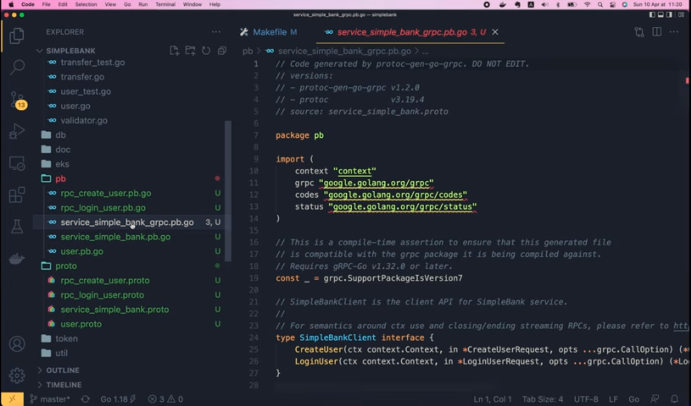

That's because the Golang gRPC package is not installed on
our machine yet. We can fix it by simply running 

```shell
go mod tidy
go: downloading google.golang.org/grpc v1.43.0
go: downloading google.golang.org/genproto v0.0.0-20211208223120-3a66f561d7aa
go: downloading golang.org/x/net v0.0.0-20211112202133-69e39bad7dc2
```

in the terminal.

Go mod will take care of the job to find missing packages and 
download them for us. 

Then voilà, now all the red lines under the import packages are 
gone.

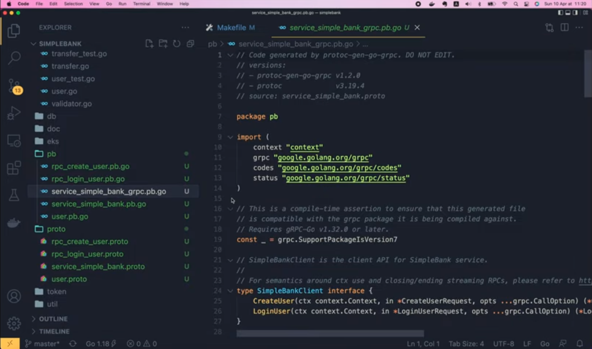

We've successfully generated Golang code for our gRPC service.

But before we finish, let's add 1 more statement to the `make proto`
command:

```makefile
proto:
	rm -f pb/*.go
	protoc --proto_path=proto --go_out=pb --go_opt=paths=source_relative \
        --go-grpc_out=pb --go-grpc_opt=paths=source_relative \
        proto/*.proto
```

This `rm` command will remove all existing Golang files under the
`pb` folder before the next command to regenerate new codes is
run. Why should we do that?

Well, because it will keep the code clean, since in case we want
to remove some `proto` files, their corresponding generated Golang
files will be gone too.

And that brings us to the end of this lecture. Now you know how
to write `protobuf` definition for a gRPC API service, and generate
Golang code from it.

In the next video, we will learn how to use that generated code
to implement the gRPC API service handler on the server side.

Thanks a lot for watching! Happy learning and see you in the next
lecture!