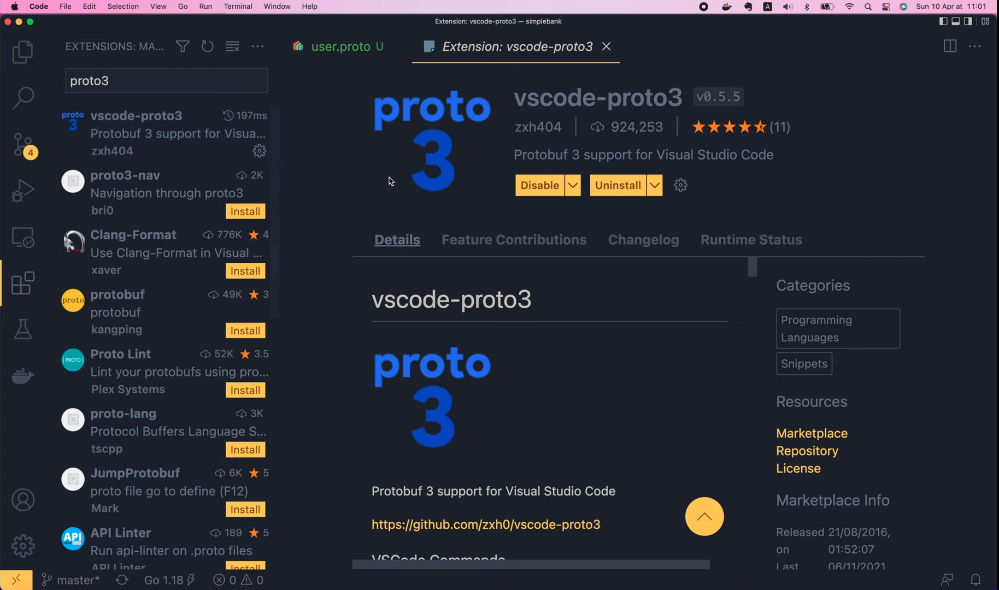
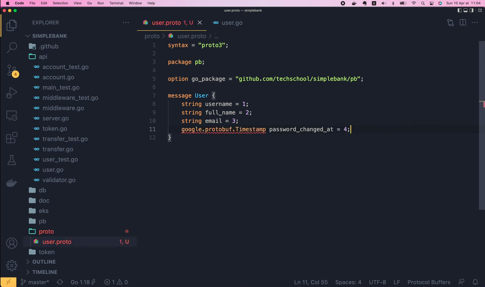
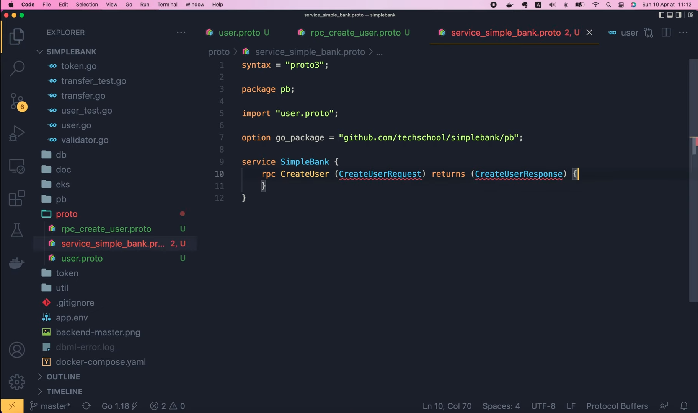
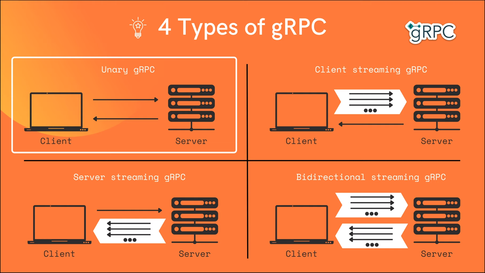
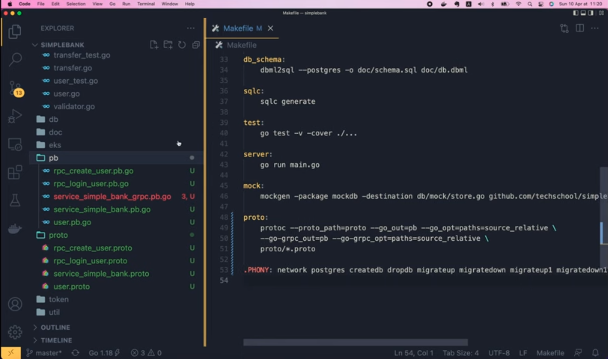
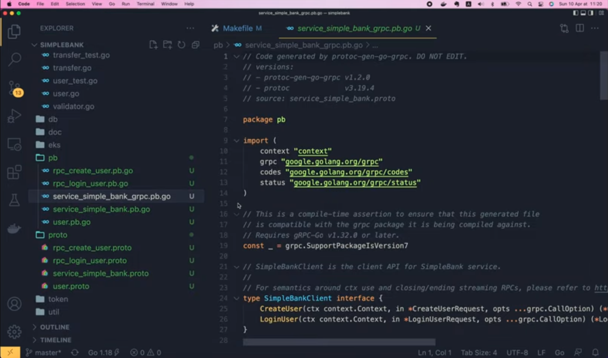

# Определяем gRPC API и генерируем Go код с помощью protobuf

[Оригинал](https://www.youtube.com/watch?v=mVWgEmyAhvM)

Привет, ребята. На [последней лекции](part39-rus.md), мы изучили некоторые 
теоретические основы gRPC. Теперь пришло время попрактиковаться!

# Определяем RPC API

Первым шагом при разработке gRPC веб-сервиса является определение API RPC и 
его структуры запроса/ответа с помощью `protobuf`. Затем используйте это
`protobuf` определение для генерации кода сервера и клиента на выбранном 
вами конкретном языке программирования. И это именно то, чем мы будем 
заниматься на этой лекции. На странице документации gRPC вы можете найти 
инструкцию как это сделать в разделе [Быстрый старт](https://grpc.io/docs/languages/go/quickstart/).
В первую очередь нужно установить компилятор `Protocol Buffer`. Если вы
используете Linux или Mac, вы можете легко сделать это с помощью 
менеджера пакетов. Для Windows вам нужно будет загрузить предварительно 
скомпилированный двоичный файл со [страницы релизов protoc](https://github.com/google/protobuf/releases).
Поскольку я на Mac OS, я установлю его с помощью Homebrew. Так что давайте
выполним

```shell
brew install protobuf
```


в терминале. После успешной установки мы можем просмотреть версию программы 
с помощью этой команды:

```shell
protoc --version
libprotoc 3.19.4
```

Теперь, чтобы генерировать Golang код, нам нужно установить еще два плагина 
для компилятора. Во-первых, плагин `protoc-gen-go` поможет нам генерировать 
Go код для любого сообщения запроса/ответа, определенного в `protobuf`. 

```shell
go install google.golang.org/protobuf/cmd/protoc-gen-go@1.28
```

Вы можете узнать установленную версию с помощью этой команды:

```shell
protoc-gen-go --version
protoc-gen-go v1.28.0
```

Здесь я устанавливаю последнюю версию на данный момент, это версия 1.28.

Второй плагин, который мы должны установить, это `protoc-gen-go-grpc`. 
Как следует из его названия, он поможет нам сгенерировать Go код, работающий
с gRPC фреймворком.

```shell
go install google.golang.org/grpc/cmd/protoc-gen-go-grpc@v1.2
go: downloading google.golang.org/grpc/cmd/protoc-gen-go-grpc v1.2.0
go: downloading google.golang.org/grpc v1.2.1
```

Версия, которую я только что установил, — 1.2, последняя на момент написания
этой лекции.

```shell
protoc-gen-go-grpc --version
protoc-gen-go-grpc 1.2.0
```

Когда вы будете читать эту лекцию, последняя версия может отличаться, и
сгенерированные коды могут отличаться от моих. Однако, я думаю, как только
вы поймёте идею, лежащую в основе, вы сможете легко адаптировать свой код для 
работы с любыми новыми изменениями, произошедшими в будущем. 

Ещё, возможно, вам придётся добавить папку go `bin` в PATH вашей системы, 
чтобы компилятор `protoc` мог найти установленные плагины.

```shell
export PATH="$PATH:$(go env GOPATH)/bin"
```

Я уже сделал это раньше при установке Go, поэтому пропущу этот шаг.

Хорошо, теперь, когда все инструменты установлены, мы можем начать 
писать код. На этой лекции я покажу вам, как написать `protobuf` определения
для двух API: API для создания нового пользователя и API для входа в 
систему, чтобы получить токен доступа и refresh токен.

## Пишем `protobuf` определения для API создания нового пользователя

Я собираюсь создать новую папку с названием `proto` для хранения всех 
файлов `protobuf`. Поскольку наши API будут работать с пользователями, я 
начну с определения объекта `User`. Итак, давайте создадим файл `user.proto` 
внутри папки `proto`.

Во-первых, мы пропишем `syntax = "proto3"`, чтобы сообщить компилятору, 
что мы будем использовать синтаксис `protobuf` версии 3 для определения 
наших сообщений. Существует также `protobuf` версии 2, но я думаю, что
лучше использовать последнюю версию.

```protobuf
syntax = "proto3";
```

На данный момент у нас ещё нет подсветки синтаксиса. Чтобы включить её, мы
должны установить плагин `vscode-proto3`.




Как только этот плагин будет установлен и включен, мы увидим подсветку
синтаксиса в нашем `proto` файле.

Далее я объявлю пакет для этого `proto` файла. Давайте назовём его `pb`.
Пакет — это просто способ сгруппировать вместе несколько `proto` файлов 
относящихся к одной тематике.

```protobuf
package pb;
```

Затем мы должны указать одну `option`, чтобы сообщить `protoc`, для какого 
пакета Go мы хотим, чтобы он генерировал Golang код. По сути, это должен 
быть подпакет корневого модуля, который мы указали в файле `go.mod`:
`github.com/techschool/simplebank`.

Поэтому я скопирую его в файл `user.proto` и добавлю суффикс `/pb` в 
конце.

```protobuf
option go_package = "github.com/techschool/simplebank/pb";
```

Благодаря этому сгенерированный Go код будет помещён в папку `pb`, которую 
я только что создал здесь.


Хорошо, теперь мы можем определить сообщение `User` следующим образом.
Внутри фигурных скобок нам нужно будет указать все поля, которые будет 
содержать объект `User`, а именно `Username`, `FullName`, `Email`,
`PasswordChangedAt`, `CreatedAt`. Точно такие же, которые в настоящее время
определены в структуре `userResponse`.

```go
type userResponse struct {
	Username          string    `json:"username"`
	FullName          string    `json:"full_name"`
	Email             string    `json:"email"`
	PasswordChangedAt time.Time `json:"password_changed_at"`
	CreatedAt         time.Time `json:"created_at"`
}
```

Чтобы определить поле сообщения `proto3`, мы используем такой синтаксис:
начинаем с типа данных поля, например, `string`. Затем пишем название 
поля, то есть `username`, за которым следует символ равенства и номер 
поля.

```protobuf
message User {
  string username = 1;
}
```

Этот номер поля очень важен в сообщении `protobuf`, потому что он будет 
использоваться для уникальной идентификации поля при [сериализации или 
десериализации сообщения в двоичном формате](https://developers.google.com/protocol-buffers/docs/proto3#assigning_field_numbers).
Вы можете использовать любые целые числа от 1 до 2^29-1, за исключением 
некоторых зарезервированных, которые вы можете найти на странице 
официальной документации `protobuf`.

Вы также можете получить более подробную информацию о различных 
поддерживаемых типах данных на [этой странице](https://developers.google.com/protocol-buffers/docs/proto3#scalar).
Ссылку также можно найти в описании к этому видео.

Итак, вернёмся к сообщению `User`, следующее поле также является строкой:
`full_name`. И я назначу ему номер поля равный 2.

```protobuf
message User {
  string username = 1;
  string full_name = 2;
}
```

Третье поле — это строка `email` с номером поля 3.

```protobuf
message User {
  string username = 1;
  string full_name = 2;
  string email = 3;
}
```

Затем следует поле `password_changed_at`, которое должно быть меткой 
времени. Метка времени не является встроенным типом данных `protobuf`,
но это всем известный тип данных, и Google уже добавил его в свою 
стандартную библиотеку. Таким образом, мы можем сослаться на него как 
`google.protobuf.Timestamp`, тогда имя поля будет равно 
`password_changed_at`, а номер поля — 4.

```protobuf
message User {
  string username = 1;
  string full_name = 2;
  string email = 3;
  google.protobuf.Timestamp password_changed_at = 4;
}
```



Здесь появилась красная волнистая линия под типом данных, потому что он не 
является встроенным. Поэтому нам нужно импортировать его из библиотеки 
Google, а именно: "google/protobuf/timestamp.proto". После этого импорта
ошибка исчезнет.

```protobuf
import "google/protobuf/timestamp.proto";
```

Хорошо, теперь аналогичным образом я добавлю последнее поле в сообщение
`User`, поле `created_at`, которое также является меткой времени, и его 
номер будет равен 5.

```protobuf
message User {
  string username = 1;
  string full_name = 2;
  string email = 3;
  google.protobuf.Timestamp password_changed_at = 4;
  google.protobuf.Timestamp created_at = 5;
}
```

Здесь вы видите, что я использую последовательность из целых чисел от 1 
до 5 для номеров полей. Вам не обязательно так делать, но это стандартный
способ определения полей. Обратите внимание, что для кодирования чисел от 1 
до 15 требуется всего один байт, а для бóльших чисел требуется два или более 
байтов. Таким образом, используя небольшие числа, мы также экономим место 
в памяти и, таким образом, уменьшаем размер сообщения при кодировании.


Итак, мы определили объект `User`, используя `protocol buffer`

Теперь пришло время определить наш первый RPC: API для создания 
пользователя. Я добавлю новый файл под названием `rpc_create_user.proto` 
внутрь папки `proto`. Затем давайте вставим в него содержимое файла
`user.proto`, потому что мы собираемся повторно использовать большую его 
часть. Мы оставим нетронутыми все команды `syntax`, `package`, `import` и
`option`. Но давайте изменим название сообщения на `CreateUserRequest`.

Это будет объект, содержащий запрос от клиента на создание нового 
пользователя. В нём должно быть четыре обязательных поля: `username`,
`password`, `full_name` и `email`. Поэтому я оставлю первые три поля этой 
структуры `User`, удалю остальные и добавлю новое поле с типом `string` 
для `password`.

```protobuf
message CreateUserRequest {
  string username = 1;
  string full_name = 2;
  string email = 3;
  string password = 4;
}
```

Нам не нужен этот импорт здесь,

```protobuf
import "google/protobuf/timestamp.proto";
```

так как в сообщении нет поля с меткой времени.

Итак, теперь у нас есть сообщение `CreateUserRequest`. Далее я определю 
ещё одно сообщение для хранения `CreateUserResponse`. Это сообщение, 
конечно же, будет содержать информацию о созданном пользователе. Таким
образом, там будет поле `user` с типом `User` и номером 1. Это наш 
собственный, пользовательский тип данных, поэтому мы должны импортировать 
его из файла `user.proto`.


Но почему не исчезает красная волнистая линия под этим `import`?

Что ж, потому что по умолчанию `protoc` будет искать импортируемый
файл в текущей папке, которую мы открываем в Visual Studio Code, но
наши `proto` файлы на самом деле находятся в папке `proto`. Итак, чтобы
исправить эту ошибку, мы должны сообщить об этом `protoc`. Давайте откроем 
плагин `vscode-proto3`. Здесь, в его документации, мы найдем фрагмент с
настройками для `protoc`.

```json
{
  "protoc": {
    "path": "/path/to/protoc",
    "compile_on_save": false,
    "options": [
      "--proto_path=protos/v3",
      "--proto_path=protos/v2",
      "--proto_path=${workspaceRoot}/proto",
      "--proto_path=${env.GOPATH}/src",
      "--java_out=gen/java"
    ]
  }
}
```

Давайте скопируем их, затем откроем `Code / Preferences / Settings`, 
поищем по ключевому слову `proto3` и нажмём `Edit` в `settings.json`.

Теперь я вставлю настройки, скопированные ранее, удалю внешние фигурные 
скобки, затем там мы можем удалить `/path/to/protoc` и `compile_on_save`.
Оставьте только `options` и `proto-path`. Все наши `proto` файлы
хранятся в папке `proto`, поэтому я пропишу это здесь. И мы можем удалить 
все остальные пути. Вот так.

```json
{
  "protoc": {
    "options": [
      "--proto_path=proto",
    ]
  }
}
```

Затем сохраните файл и вернитесь к коду.

Теперь мы видим, что все красные волнистые линии исчезли. Превосходно!

Имейте в виду, что здесь мы просто определяем структуру данных запроса и 
ответа API. На следующем шаге нам нужно будет объявить gRPC службу и 
добавить RPC определение для этого API.

Я сделаю это в отдельном файле под названием `service_simple_bank.proto`.
Команды в верхней части для объявления синтаксиса и пакетов `protobuf` должны 
быть такими же, как и в других файлах `proto`.

```protobuf
syntax = "proto3";

package pb;

import "user.proto";

option go_package = "github.com/techschool/simplebank/pb";
```

Но на этот раз мы собираемся определить сервис `SimpleBank` вместо сообщения, 
как в других файлах. И внутри этого сервиса я определю первый RPC с 
названием `CreateUser`. В качестве входных данных он примет объект 
`CreateUserRequest` и вернет `CreateUserResponse`. Это определение RPC 
заканчивается парой фигурных скобок. Мы узнаем, как задать некоторые 
пользовательские настройки для RPC внутри этих фигурных скобок, в последующих 
лекциях. Пока что давайте оставим их пустыми и ничего писать внутри не будем.

```protobuf
service SimpleBank {
  rpc CreateUser(CreateUserRequest) returns (CreateUserResponse) {
  }
}
```



Здесь снова появились красные волнистые линии под объектами запроса и 
ответа. Вы уже наверняка знаете, что надо сделать, да? Нам нужно 
импортировать файл `rpc_create_user.proto`, так как именно в нем определены 
объекты запроса и ответа.

```protobuf
import "user.proto";
import "rpc_create_user.proto";
```

И мы можем избавиться от этого импорта файла `user.proto` 

## Пишем `protobuf` определения для API входа пользователя в систему

Итак, теперь у нас всё готово! Мы успешно определили gRPC API для создания 
нового пользователя. Можете ли вы сделать то же самое для API входа 
пользователя в систему? Сейчас вы можете поставить видео на паузу и сделать 
это самостоятельно. Мы займёмся этим очень скоро. И кстати, вы ещё помните 
4 типа gRPC, о которых мы говорили в предыдущей лекции по теоретическим 
основам? Догадались ли вы к какому типу gRPC относится `CreateUser` API?
Да, это самый простой тип gRPC: унарный gRPC, потому что клиент просто 
отправляет один запрос и получает один ответ.



Итак, удалось ли вам определить RPC API для входа пользователя в систему?

Он также относится к унарному gRPC, как и `CreateUser` API. Во-первых, 
давайте создадим новый файл под названием `rpc_login_user.proto` внутри 
папки `proto`.

Затем я скопирую всё содержимое из файла `rpc_create_user.proto` в этот 
новый файл. Теперь мы должны изменить названия сообщений на 
`LoginUserRequest` и `LoginUserResponse`. Для входа в систему нам нужны 
только `username` и `password`, поэтому я удалю все остальные поля и изменю 
номер поля `password` на 2. Это всё что нужно изменить для сообщения 
запроса.

```protobuf
syntax = "proto3";

package pb;

import "user.proto";

option go_package = "github.com/techschool/simplebank/pb";

message LoginUserRequest {
  string username = 1;
  string password = 2;
}
```

Для сообщения ответа от сервера, помимо информации о `user`, нам понадобятся
ещё несколько полей для сессии, токена доступа и refresh токена. Итак, 
давайте добавим новое поле `string session_id = 2`, 
`string access_token = 3` и `string refresh_token = 4`. А затем два поля с
метками времени для хранения времени истечения срока действия токенов.

Я скопирую строку с импортом пакета `google/protobuf/timestamp.proto` из 
файла `user.proto`. Итак, поле `access_token_expires_at` будет типа
`google.protobuf.Timestamp` с номером 5. Наконец, пропишем тот же тип для
`refresh_token_expires_at` и назначим для него номер поля — 6.

```protobuf
message LoginUserResponse {
  User user = 1;
  string session_id = 2;
  string access_token = 3;
  string refresh_token = 4;
  google.protobuf.Timestamp access_token_expires_at = 5;
  google.protobuf.Timestamp refresh_token_expires_at = 6;
}
```

Хорошо, теперь пора определить RPC в файле `service_simple_bank.proto`.
Давайте импортируем `rpc_login_user.proto`, затем продублируем RPC 
`CreateUser`. Я изменю название второго RPC на `LoginUser`. Входное
сообщение изменим на `LoginUserRequest`, а исходящее — на
`LoginUserResponse`. И это, по сути, всё, что надо сделать!

```protobuf
import "rpc_login_user.proto";

service SimpleBank {
  rpc CreateUser(CreateUserRequest) returns (CreateUserResponse) {}
  rpc LoginUser(LoginUserRequest) returns (LoginUserResponse) {}
}
```

Мы закончили с определением `CreateUser` и `LoginUser` API для нашего
gRPC сервиса Simple Bank.

Теперь наступает важный шаг: создание Golang кода из этого определения 
сервиса. На самом деле сделать это довольно просто, так как у нас уже 
установлены все необходимые инструменты.

В `Makefile` я добавлю новую команду под названием `proto`. Затем давайте
вернёмся на страницу `Quick Start` [веб-сайта документации gRPC](https://grpc.io/docs/languages/go/quickstart/).

`protoc` команду для генерации кода можно найти в [этом разделе](https://grpc.io/docs/languages/go/quickstart/#regenerate-grpc-code). 

Давайте скопируем её и вставим в наш `Makefile`. Однако нам придется 
немного изменить эту команду.

```makefile
proto:
	protoc --go_out=. --go_opt=paths=source_relative \
        --go-grpc_out=. --go-grpc_opt=paths=source_relative \
        helloworld/helloworld.proto
```

Во-первых, давайте добавим параметр `proto_path`, чтобы указать путь к 
нашим `proto` файлам, которые находятся внутри папки `proto`. Затем с 
помощью ключа `go_out` пропишем путь к папке, куда бы мы хотели поместить
сгенерированный Golang код, в нашем случае это папка `pb`. Оставим ключ
`go_opt=paths=source_relative` без изменений, а `go_grpc_out` поменяем 
на ту же папку `pb`. Не будем менять `go-grpc_opt=paths=source_relative`.
Наконец, последним аргументом должно быть путь к нашим `proto` файлам,
то есть `proto/*.proto`, потому что мы хотим сгенерировать код для 
всех `proto` файлов в этой папке.

```makefile
proto:
	protoc --proto_path=proto --go_out=pb --go_opt=paths=source_relative \
        --go-grpc_out=pb --go-grpc_opt=paths=source_relative \
        proto/*.proto
```

Вот и всё! Давайте добавим команду `proto` в список PHONY. Затем откройте 
терминал и выполните:

```shell
make proto
protoc --proto_path=proto --go_out=pb --go_opt=paths=source_relative \
        --go-grpc_out=pb --go-grpc_opt=paths=source_relative \
        proto/*.proto
```

Ура! Она успешно выполнена!

Теперь, если мы вернемся в Visual Studio Code и откроем папку `pb`, мы 
увидим несколько сгенерированных файлов с расширением `.pb.go`.



Каждый файл соответствует собственному `proto` файлу, который мы создали
в папке `proto`.

Таким образом были созданы следующие файлы `rpc_create_user`, 
`rpc_login_user`, `service_simple_bank`, and `user`.

Также в папке находится файл `service_simple_bank_grpc.pb.go`. Этот файл,
содержит серверные и клиентские gRPC интерфейсы или заглушки, на основе 
которых мы позже напишем настоящую реализацию сервисов. Прямо сейчас 
возникли некоторые ошибки с импортируемыми пакетами.


Они связаны с тем, что пакет Golang gRPC ещё не установлен на нашем 
компьютере. Мы можем исправить их, просто выполнив

```shell
go mod tidy
go: downloading google.golang.org/grpc v1.43.0
go: downloading google.golang.org/genproto v0.0.0-20211208223120-3a66f561d7aa
go: downloading golang.org/x/net v0.0.0-20211112202133-69e39bad7dc2
```

в терминале.

Go mod найдёт недостающие пакеты и скачает их за нас.

И, вуаля, все красные волнистые линии под импортами пропали. 



Мы успешно сгенерировали код Golang для нашего gRPC сервиса.

Но перед тем как закончить, давайте добавим ещё одну команду в `make proto`:

```makefile
proto:
	rm -f pb/*.go
	protoc --proto_path=proto --go_out=pb --go_opt=paths=source_relative \
        --go-grpc_out=pb --go-grpc_opt=paths=source_relative \
        proto/*.proto
```

Эта команда `rm` удалит все существующие Golang файлы в папке `pb` перед 
запуском следующей команды для повторной генерации новых кодов.
Почему мы должны это делать?

Потому что в этом случае мы избавимся от лишних файлов. Если мы захотим 
удалить некоторые `proto` файлы, соответствующие им сгенерированные Golang 
файлы будут удалены этой командой `rm`. 

И на этом мы закончим сегодняшнюю лекцию. Теперь вы знаете, как написать
protobuf определение для gRPC API сервиса и сгенерировать из него Golang код.

На следующей лекции мы узнаем как использовать этот сгенерированный код для
реализации обработчика gRPC API сервиса на стороне сервера.

Большое спасибо за время, потраченное на чтение! Желаю вам получать 
удовольствие от обучения и до встречи на следующей лекции!