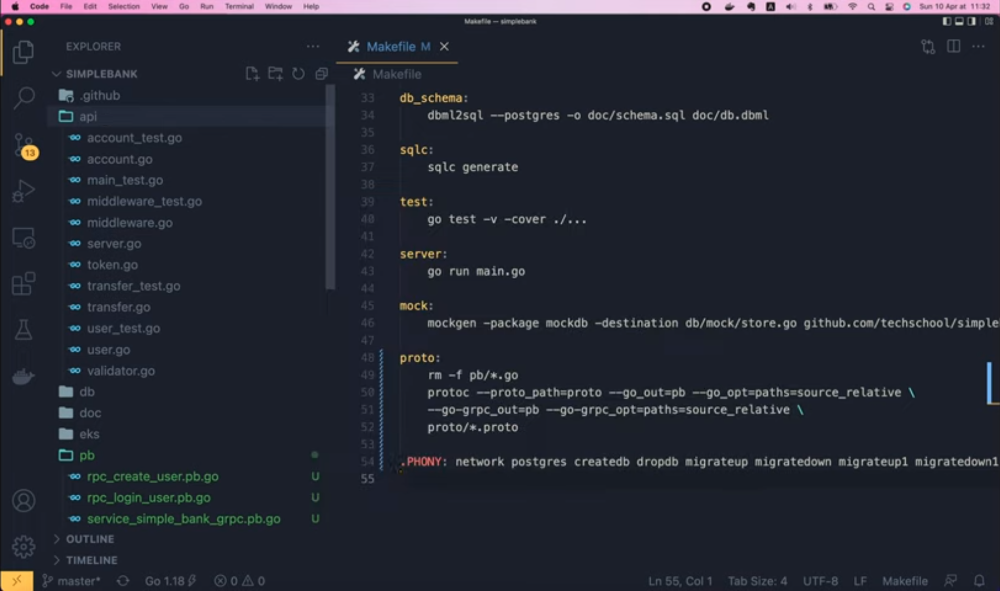
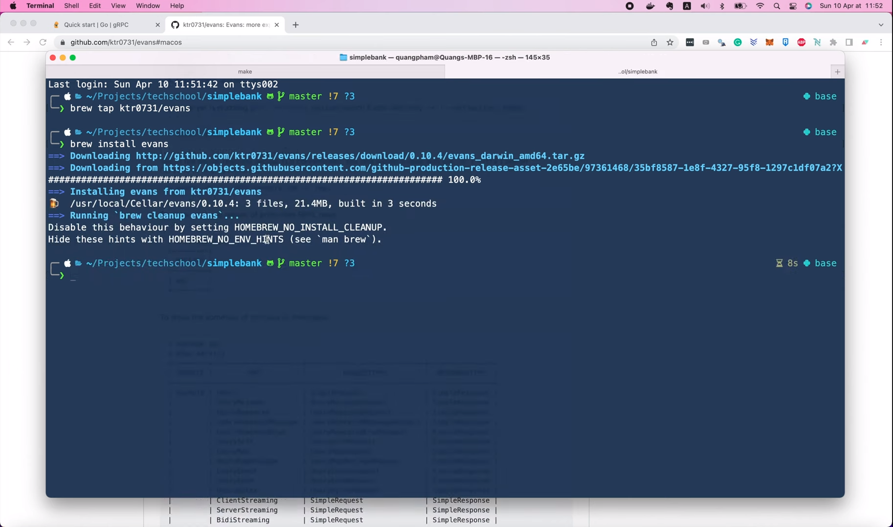

# How to run a Golang gRPC server and call its API

[Original video](https://www.youtube.com/watch?v=BkfBJIS0_ro)

Hello guys, welcome back to the backend master class. In the
[previous lecture](part40-eng.md), we've learned how to define
a gRPC API using `protobuf` and generate Golang codes from it.
So today let's learn how to use the generated codes to run 
a gRPC server, and then connect to it using an interactive 
client tool called `Evans`. OK, let's start!

## Implement services using gRPC framework

If you still remember, before we've implemented our web 
services with HTTP JSON APIs using Gin framework. And 
all those codes are stored inside this `api` package. 



Now, we want to implement the same set of services, but
using gRPC framework instead. So, I'm gonna create a new
separate package for that.

Let's call it `gapi`. And inside this package I'm gonna create
a new file: `server.go`. This file will contain the `Server` 
struct, similar to that of the Gin `Server` we implemented before.
The only difference is that, we're gonna serve gRPC requests 
instead of HTTP. So I'm gonna copy this `NewServer` function
code from this file `api/server.go`, and paste it to our new 
`server.go` file.

```go
// Server обслуживает gRPC запросы нашего банковского сервиса.
type Server struct {
	config     util.Config
	store      db.Store
	tokenMaker token.Maker
	router     *gin.Engine
}

// NewServer создаёт новый HTTP сервер и настраивает маршрутизацию.
func NewServer(config util.Config, store db.Store) (*Server, error) {
	tokenMaker, err := token.NewPasetoMaker(config.TokenSymmetricKey)
	if err != nil {
		return nil, fmt.Errorf("cannot create token maker: %w", err)
	}

	server := &Server{
		config:     config,
		store:      store,
		tokenMaker: tokenMaker,
	}

	if v, ok := binding.Validator.Engine().(*validator.Validate); ok {
		v.RegisterValidation("currency", validCurrency)
	}

	server.setupRouter()
	return server, nil
}

func (server *Server) setupRouter() {
	router := gin.Default()

	router.POST("/users", server.createUser)
	router.POST("/users/login", server.loginUser)
	router.POST("/token/renew_access", server.renewAccessToken)

	router.POST("/accounts", server.createAccount)
	router.GET("/accounts/:id", server.getAccount)
	router.GET("/accounts", server.listAccounts)

	router.POST("/transfers", server.createTransfer)

	server.router = router
}

func errorResponse(err error) gin.H {
	return gin.H{"error": err.Error()}
}

func (server *Server) Start(address string) error {
	return server.router.Run(address)
}
```

This server is gonna serve gRPC requests for our banking service.
We still need all of these fields to store the `config`, db `store`,
and `tokenMaker` object. They will be used later when we implement
the RPCs. But now we don't need the validator engine anymore 
because it's not used by the gRPC framework as in Gin. And the 
setup router can also be removed, because, unlike HTTP, there are
no routes in gRPC.

```go
// Server обслуживает gRPC запросы нашего банковского сервиса.
type Server struct {
	config     util.Config
	store      db.Store
	tokenMaker token.Maker
}

// NewServer создаёт новый HTTP сервер и настраивает маршрутизацию.
func NewServer(config util.Config, store db.Store) (*Server, error) {
	tokenMaker, err := token.NewPasetoMaker(config.TokenSymmetricKey)
	if err != nil {
		return nil, fmt.Errorf("cannot create token maker: %w", err)
	}

	server := &Server{
		config:     config,
		store:      store,
		tokenMaker: tokenMaker,
	}

	return server, nil
}
```

The client will call the server by simply executing an RPC, 
just like it's calling a local function.

OK, so now we have a function to create a new server. However,
it's not a gRPC server yet. In order to turn it into a gRPC
server, we have to use the codes that `protoc` has generated 
for us in the [previous lecture](part40-eng.md). Let's take a 
look at the `service_simple_bank_grpc.pb.go` file. Here you 
can see the `SimpleBankServer` interface. Our server can only
become a gRPC server when it implements this interface. And
one thing you might notice here is the function call:
`mustEmbedUnimplementedSimpleBankServer()`. What does that 
mean?

Well, in recent version of gRPC, apart from the server 
interface, `protoc` also generates this
`UnimplementedSimpleBankServer` struct, where all RPC 
functions are already provided, but they all returns an
`codes.Unimplemented` error. And we have to add this
`UnimplementedSimpleBankServer` to our `Server` struct, 
like this.

```go
// Server обслуживает gRPC запросы нашего банковского сервиса.
type Server struct {
	pb.UnimplementedSimpleBankServer
	config     util.Config
	store      db.Store
	tokenMaker token.Maker
}
```

Its main purpose is to enable forward compatibility, which
means that the server can already accept the calls to the
`CreateUser` and `LoginUser` RPCs before they are actually
implemented. Then we can gradually add their real 
implementations later. I think this is a nice feature to make
it easier for a team to work on multiple RPCs in parallel 
without blocking or conflicting with each other.

Alright, now in order to show you that our RPCs can already
accept calls from client, let's try to start the gRPC server
and call its APIs.

In the `main.go` file, we're currently start the HTTP Gin 
server. I want to keep it for new students to have a reference,
so I'm gonna create a separate function to run the Gin server.
Then let's move this chunk of codes to the new function.

```go
func runGinServer(config util.Config, store db.Store) {
	server, err := api.NewServer(config, store)
	if err != nil {
		log.Fatal("cannot create server:", err)
	}

	err = server.Start(config.ServerAddress)
	if err != nil {
		log.Fatal("cannot start server:", err)
	}
}
```

This function will need to accept 2 parameters: the `util.Config`
object and the `db.Store` object.

OK, now I'm gonna declare another function to run gRPC server
with the same signature. Then, in the `main` function, we can
call `runGrpcServer`, and pass in the `config` and the db 
`store`.

```go
func main() {
	...
	runGrpcServer(config, store)
}

func runGrpcServer(config util.Config, store db.Store) {

}
```

You can easily change it to `runGinServer` if you want to 
run HTTP service instead. OK, now let's implement the 
`runGrpcServer()` function.

First we have to call `grpc.NewServer` to create a new 
gRPC server object. Then we call 
`pb.RegisterSimpleBankServer` with that gRPC server object
as the 1st parameter. The 2nd parameter we need to pass in
is our own implementation of the simple bank server.

```go
func runGrpcServer(config util.Config, store db.Store) {
	grpcServer := grpc.NewServer()
	
	pb.RegisterSimpleBankServer(grpcServer, server)
}
```

So we have to create it here. It's similar to how we're 
creating a new server down here for Gin, so I'm gonna
copy it. 

```go
grpcServer := grpc.NewServer()
server, err := api.NewServer(config, store)
if err != nil {
log.Fatal("cannot create server:", err)
}
pb.RegisterSimpleBankServer(grpcServer, server)
```

But, we have to change the package name from `api` to 
`gapi`, because that's where we define our simple bank
gRPC server object. I'm gonna refactor the code a bit 
to make it easier to read.

Let's move the `grpcServer` variable down here, right 
before we register it.

```go
func runGrpcServer(config util.Config, store db.Store) {
	server, err := gapi.NewServer(config, store)
	if err != nil {
		log.Fatal("cannot create server:", err)
	}
	grpcServer := grpc.NewServer()
	pb.RegisterSimpleBankServer(grpcServer, server)
}
```

OK, so the next step is optional, but I highly recommend you
to do it, which is, register a gRPC reflection for our server.
This command looks very simple, but it actually is pretty 
powerful, because it allows the gRPC client to easily explore
what RPCs are available on the server, and how to call them.
You can imagine it as some kind of self documentation for the
server.

```go
func runGrpcServer(config util.Config, store db.Store) {
    ...
    
	grpcServer := grpc.NewServer()
	pb.RegisterSimpleBankServer(grpcServer, server)
	reflection.Register(grpcServer)
}
```

Now comes the most important step: start the server to listen
to gRPC requests on a specific port. In our `app.env` file,
at the moment we only have the server address for HTTP 
requests. So first I'm gonna change this variable name to
`HTTP_SERVER_ADDRESS`. Then we will need to add one more
variable here for the address of the gRPC server. The HTTP
requests are served on port `8080`, so let's say we will 
serve gRPC requests on port `9090`.

```
GRPC_SERVER_ADDRESS=0.0.0.0:9090
```

It's up to you to decide the port number. You don't have
to use the same values as mine. So as we've updated the
environment variables, we have to update our `config` struct
to reflect the change.

First, this `mapstructure:"SERVER_ADDRESS"` should be changed 
to `HTTP_SERVER_ADDRESS`. Then I'm gonna add one more field for
the gRPC server address as well.

```go
type Config struct {
	...
	HTTPServerAddress    string        `mapstructure:"HTTP_SERVER_ADDRESS"`
	GRPCServerAddress    string        `mapstructure:"GRPC_SERVER_ADDRESS"`
	...
}
```

Alright, now go back to the `main.go` file. In the `runGinServer()`
function, we have to change the address to 
`config.HTTPServerAddress`. Then, in the `runGrpcServer()`, I'm
gonna create a new listener with `net.Listen()`, pass in `tcp` as
the protocol, and the `config.GRPCServerAddress`. This call might
return an error. So, if error is not `nil`, we will write a fatal
log saying "cannot create listener".

```go
func runGrpcServer(config util.Config, store db.Store) {
	...

	listener, err := net.Listen("tcp", config.GRPCServerAddress)
    if err != nil {
        log.Fatal("cannot create listener")
    }
}
```

Otherwise, we will write a simple log saying that we're gonna
start a gRPC server at this address. Then all we have to do 
now, to start the server, is to call `grpcServer.Serve()`, 
and pass in the `listener` as input. If this call returns a
not `nil` error, then we just write a fatal log saying "cannot
start gRPC server".

```go
func runGrpcServer(config util.Config, store db.Store) {
    ...
	log.Printf("start gRPC server at %s", listener.Addr().String())
	err = grpcServer.Serve(listener)
	if err != nil {
		log.Fatal("cannot start gRPC server")
	}
}
```

And that's basically it! Our server can now be started.

Let's open the terminal and run 

```shell
make server
2022/04/10 11:47:38 start gRPC server at [::]:9090
```

There are no errors, so it means that the gRPC server has been started
successfully on port 9090.

## Install and use Evans for testing purpose

Now let's try to call its APIs. For testing purpose, I'm gonna use a tool
called Evans.

Evans is a super cool gRPC client that allows you to construct and send 
gRPC requests in an interactive console. On their [Github page](https://github.com/ktr0731/evans),
you can easily find the binaries for Mac, Linux and Windows. Since I'm on
a Mac, I prefer to install it with Homebrew. So first let's run this

```shell
brew tab ktr0731/evans
```

command.

Then continue with

```shell
brew install evans
```



OK, now Evans has been successfully installed. And since our server is
already enabling gRPC reflection, we can run this command 

```shell
evans -r repl
evans: failed to run REPL mode: failed to instantiate a new spec: failed to 
instantiate the spec: failed to list packages by gRPC reflection: failed to 
list services from reflecton enabled gRPC server: rpc error: code = Unavailable
desc = connection error: desc = "transport: Error while dialing dial tcp 
127.0.0.1:50051: connect: connection refused"
```

to connect to the server.

Oops, we've got an error. That's because Evans is trying to connect
to the default gRPC port: 50051, while in fact, our server is listening
on port 9090 instead. So we have to add some more parameters to the
command. We can add the host: localhost in this case, then the port,
which should be 9090.

```shell
evans --host localhost --port 9090 -r repl

  ______
 |  ____|
 | |__    __   __   __ _   _ __    ___
 |  __|   \ \ / /  / _. | | '_ \  / __|
 | |____   \ V /  | (_| | | | | | \__ \
 |______|   \_/    \__,_| |_| |_| |___/

 more expressive universal gRPC client


pb.SimpleBank@localhost:9090> 
```

And voilà, we're now inside the Evans console and can talk to the
server. We can run

```shell
show service
+------------+------------+-------------------+--------------------+
|  SERVICE   |    RPC     |   REQUEST TYPE    |   RESPONSE TYPE    |
+------------+------------+-------------------+--------------------+
| SimpleBank | CreateUser | CreateUserRequest | CreateUserResponse |
| SimpleBank | LoginUser  | LoginUserRequest  | LoginUserResponse  |
+------------+------------+-------------------+--------------------+
```

to list all services and RPCs available on the server.

As you can see, we haven't implemented any APIs yet, but there
are already 2 RPCs available: `CreateUser` and `LoginUser`. That's
because we have embedded the `UnimplementedSimpleBankServer` struct
inside our `Server` struct before. Now let's try to call `CreateUser`
RPC.

```shell
call CreateUser
username (TYPE_STRING) => 
```

As you can see, Evans is now asking for some inputs that the
RPC requires. So let's enter the username, full name, email,
and password. Once we entered the last parameters, the request 
will be sent to the server.

```shell
call CreateUser
username (TYPE_STRING) => quang
full_name (TYPE_STRING) => Quang
email (TYPE_STRING) => quang@gmail.com
password (TYPE_STRING) => secret
command call: rpc error: code = Unimplemented desc = method CreateUser not implemented
```

And we get back the response immediately. But of course, it is still
an error, because the `CreateUser` method is not implemented on the
server yet.

However, it's enough to show that the gRPC server is already working,
and can accept the gRPC requests from the client. We can run

```shell
exit
Good Bye :)
```

to get out of the Evans console.

Now I'm gonna add the `evans` command to the Makefile. So that
we can easily run it for testing our gRPC APIs later.

```makefile
evans:
	evans --host localhost --port 9090 -r repl
```

With this command, to enter the Evans console, we can simply run

```shell
make evans
```

And that's the end of this lecture! We've successfully started a
gRPC server and called its gRPC API using Evans client. However,
at the moment, all the RPCs to create and login users are not
actually implemented yet. They're still returning an error code 
by default.

So in the next video, I will show you how to give them a real 
implementation.

Until then, happy learning and see you in the next lecture!