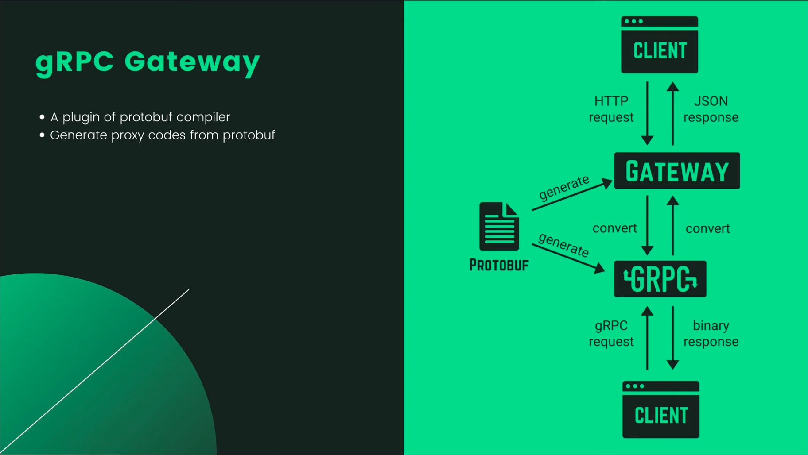
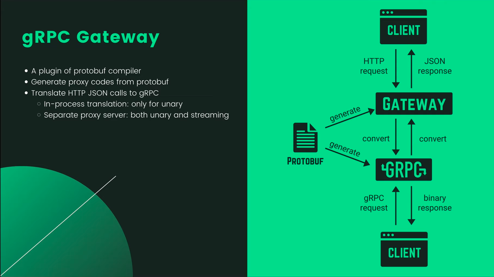
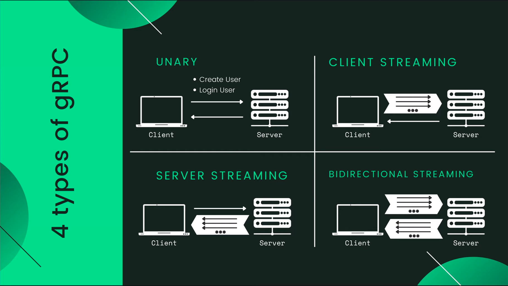
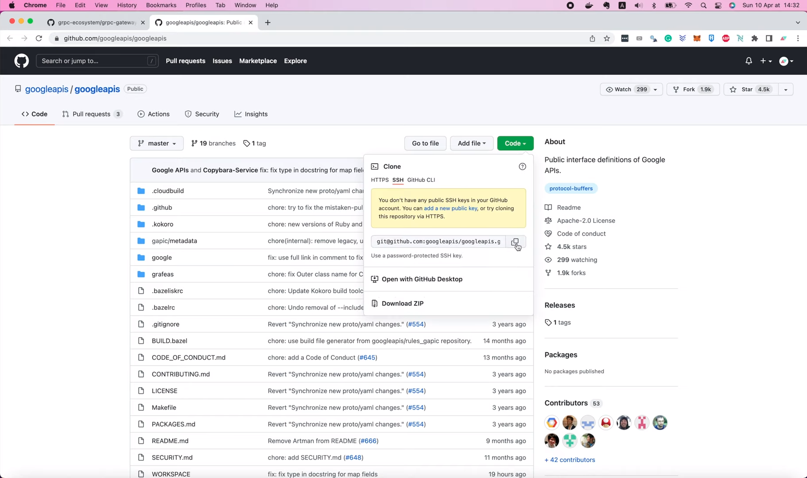
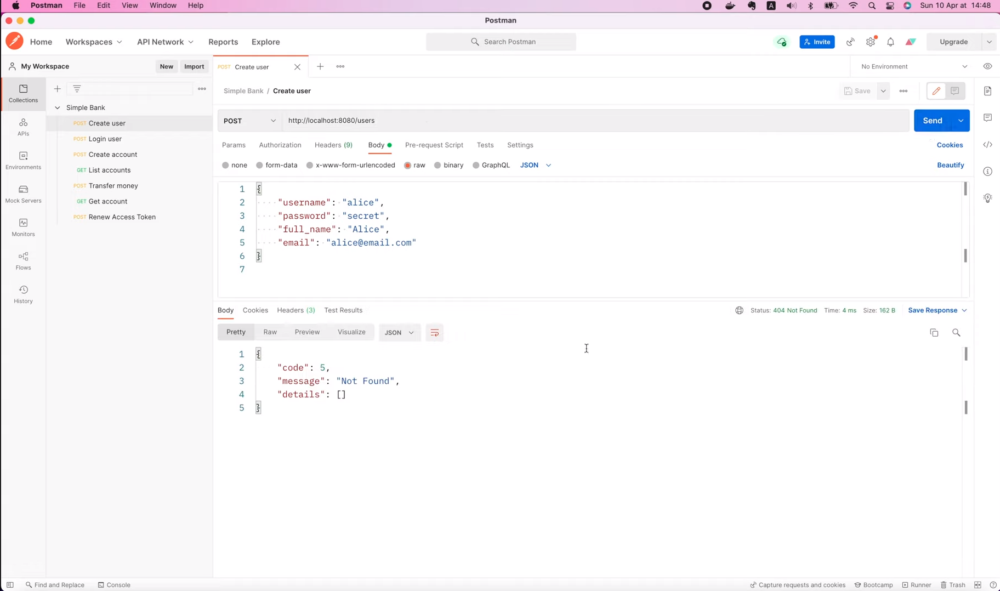
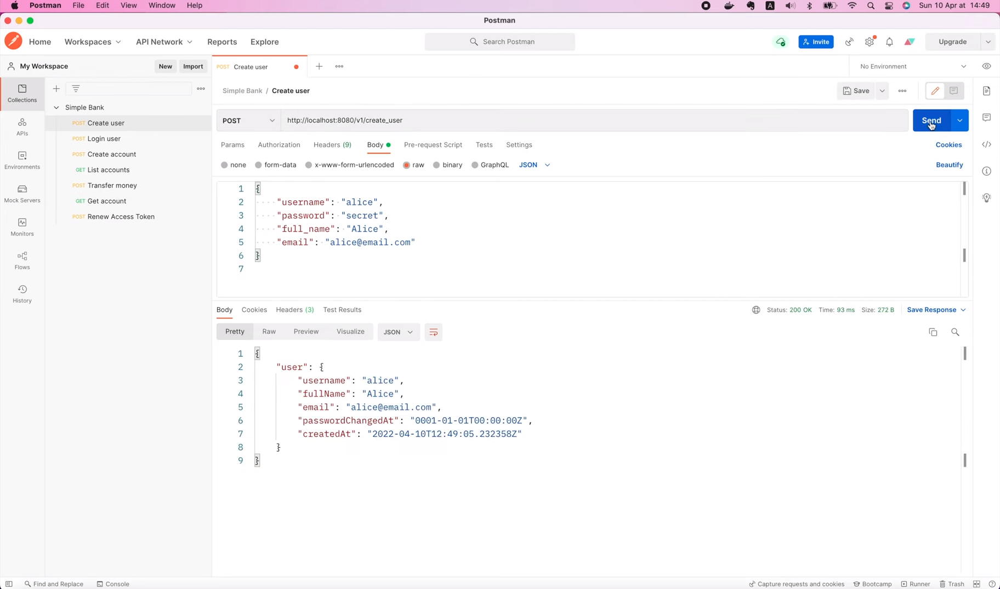
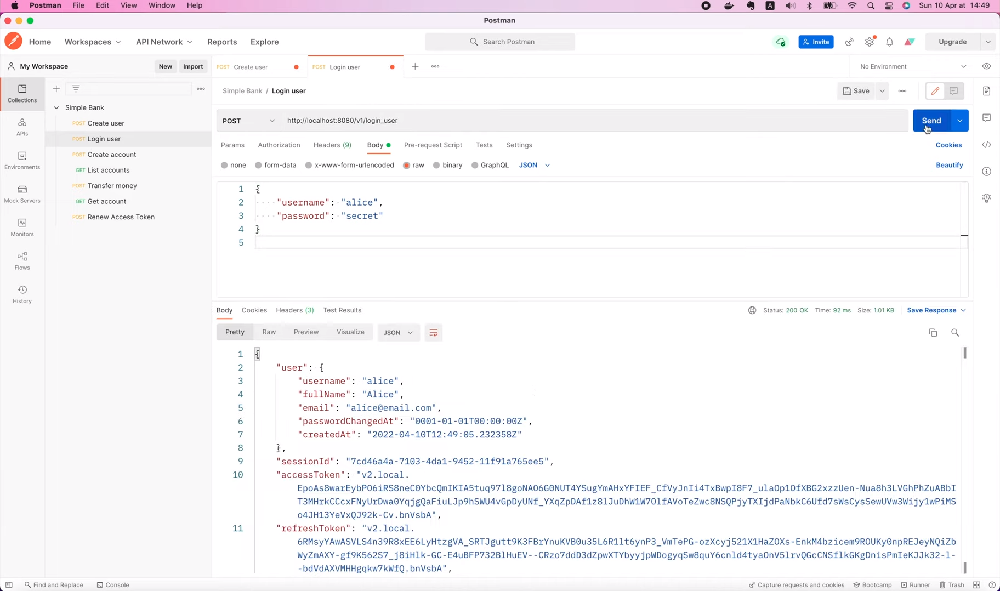
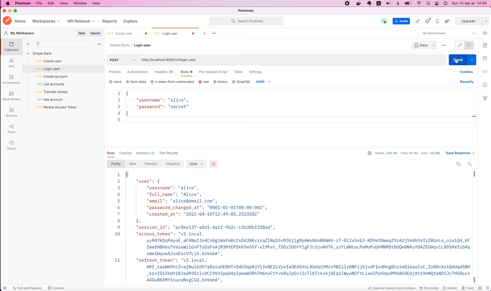

# Write code once, serve both gRPC & HTTP requests

[Original video](https://www.youtube.com/watch?v=3FfDH3d0aHs)

Hello guys, welcome back to the Backend Master Class! In the
[previous lecture](part42-eng.md), we've learned how to 
implement 2 gRPC APIs to create and login users, and then we 
used the Evans client to connect to it and sent gRPC 
requests.

gRPC is famous for its high performance, which is very 
suitable for microservices or mobile applications.
However, in some cases, we might still want to provide
normal HTTP JSON APIs to the client. So, the ideal solution
is to be able to write codes just once, but can serve both 
gRPC and HTTP requests at the same time.

And that's exactly what we've gonna learn today with gRPC
gateway. I already told you about it in lecture 39: 
Introduction to gRPC. But here's a recap for those who 
haven't watched it yet.

## gRPC gateway

gRPC gateway is a plugin for Protocol Buffer that generates
HTTP proxy codes from `protobuf` definition. From the 
same `proto` file, `protoc` will generate both the gRPC and
the HTTP gateway codes. A gRPC client will connect directly
to the gRPC server to send gRPC requests and receives binary
responses. While an HTTP client will connect to the HTTP 
gateway server to send HTTP JSON requests. This request
will be translated into gRPC format before forwarded to the
gRPC service handler to be processed. Its response will also
be translated back into JSON format before returning to the 
client.



There are 2 types of translation that we can choose to 
implement for the gateway:
* In-process translation: only for unary
* Separate proxy server: both unary and streaming



In-process translation means that the gateway can call
the gRPC handler directly in the code, without going 
through any extra hop on the network. However, it works
for unary gRPC. If you want to translate streaming gRPC
calls, then you must run the HTTP gateway as a separate 
proxy server.
In that case, the HTTP JSON request will be translated 
and forwarded to the gRPC server via a network call.

Come back to the `CreateUser` and `LoginUSer` APIs that
we implemented in the previous lecture, they are all
unary gRPC. So it's best to use the in-process 
translation method to implement the gateway in this
case.



Alright, let's learn how to do it!

## Install the build tools for gRPC gateway

The first thing we need to do is to install the build 
tools for gRPC gateway. You can easily find the 
installation instructions on the [GitHub page](https://github.com/grpc-ecosystem/grpc-gateway#installation)
of gRPC gateway. We should copy this chunk of code

```go
// +build tools

package tools

import (
    _ "github.com/grpc-ecosystem/grpc-gateway/v2/protoc-gen-grpc-gateway"
    _ "github.com/grpc-ecosystem/grpc-gateway/v2/protoc-gen-openapiv2"
    _ "google.golang.org/grpc/cmd/protoc-gen-go-grpc"
    _ "google.golang.org/protobuf/cmd/protoc-gen-go"
)
```

Then in Visual Studio Code, let's create a new package called
`tools`, and add a new file: `tools.go` inside that package.

Now paste in the code that we've copied. What this code does
is pretty simple, it's just a list of blank imports of the 
`protoc` plugins.

The reason we're doing this us because we're not using 
them directly in the code, but we just want to install 
them to our local machine, so that `protoc` can use them
to generate codes for us. By running

```shell
go mod tidy
go: finding module for package google.golang.org/grpc/cmd/protoc-gen-go-grpc
go: finding module for package github.com/grpc-ecosystem/grpc-gateway/v2/protoc-gen-grpc-gateway
go: finding module for package github.com/grpc-ecosystem/grpc-gateway/v2/protoc-gen-openapiv2
go: downloading google.golang.org/grpc v1.47.0
go: downloading github.com/grpc-ecosystem/grpc-gateway/v2 v2.10.3
go: found github.com/grpc-ecosystem/grpc-gateway/v2/protoc-gen-grpc-gateway in github.com/grpc-ecosystem/grpc-gateway/v2 v2.10.3
go: found github.com/grpc-ecosystem/grpc-gateway/v2/protoc-gen-openapiv2 in github.com/grpc-ecosystem/grpc-gateway/v2 v2.10.3
go: found google.golang.org/grpc/cmd/protoc-gen-go-grpc in google.golang.org/grpc/cmd/protoc-gen-go-grpc v1.2.0
go: downloading google.golang.org/grpc v1.46.2
go: downloading github.com/golang/glog v1.0.0
go: downloading github.com/google/go-cmp v0.5.8
go: downloading gopkg.in/yaml.v3 v3.0.1
go: downloading google.golang.org/genproto v0.0.0-20220519153652-3a47de7e79bd
go: downloading golang.org/x/net v0.0.0-20220127200216-cd36cc0744dd
```

in the terminal `go mod` will automatically find and 
download the missing packages for us.

It will also add the package dependencies to the `go.mod`
file, which allows other people in the team to share the
same version.

OK, next step, we will run this `go install` command

```shell
go install \
    github.com/grpc-ecosystem/grpc-gateway/v2/protoc-gen-grpc-gateway \
    github.com/grpc-ecosystem/grpc-gateway/v2/protoc-gen-openapiv2 \
    google.golang.org/protobuf/cmd/protoc-gen-go \
    google.golang.org/grpc/cmd/protoc-gen-go-grpc
```

to install all binaries of the plugins to the `GOBIN`
folder.

Those binaries will be used by `protoc` to generate 
Golang codes later.

## Generate gRPC gateway code

Alright, now the tools are installed, let's see how we can
use them! Actually, the first 3 steps in [this guide](https://github.com/grpc-ecosystem/grpc-gateway#usage) 
are just to define a normal gRPC API, generate gRPC stubs, 
and then implement the service using those stubs, which we've
already done in previous lectures.

The only new thing is in step 4, where we generate the gRPC
gateway code. At this point, there are 3 options:
1) The first option requires no further modification to the 
   `proto` file, and just use the default mapping to HTTP 
   semantics. It's easy to use but doesn't allow us to set
   custom HTTP path or parameters. So I'm not gonna use it.
2) The second option is to add some additional modifications 
   to the `proto` file, which will allow us to set custom HTTP
   mappings.
3) And the last option is to use an external configuration file. 
   We only use this option when the source `proto` file isn't
   under our control.
   
So in our case, since we own the `proto` file, we will go with the
second option! Therefore, I will scroll down to the second section:
"With custom annotations".

```
 syntax = "proto3";
 package your.service.v1;
 option go_package = "github.com/yourorg/yourprotos/gen/go/your/service/v1";
+
+import "google/api/annotations.proto";
+
 message StringMessage {
   string value = 1;
 }

 service YourService {
-  rpc Echo(StringMessage) returns (StringMessage) {}
+  rpc Echo(StringMessage) returns (StringMessage) {
+    option (google.api.http) = {
+      post: "/v1/example/echo"
+      body: "*"
+    };
+  }
 }
```

This example gives you an idea of how it should be done.
First, import the `google/api/annotaions.proto` file, then
add the option `google.api.http` inside the body of the 
RPC definition, where we can customize the method, the path,
and the body.

One thing you must keep in mind here is that you have to 
provide the required third party `proto` file to the 
`protobuf` compiler. If you're using `buf` to manage your
`proto` files & generate stubs, you can follow this instruction

```
version: v1
name: buf.build/yourorg/myprotos
deps:
  - buf.build/googleapis/googleapis
```

to add the required dependency.

I also recommend you to take a look at [this](https://github.com/grpc-ecosystem/grpc-gateway/blob/master/examples/internal/proto/examplepb/a_bit_of_everything.proto) 
"a bit of everything" `proto` file, where you can find a lot
more examples of how you can customize your gRPC gateway.

OK, now, as you know, in our project, we're not using `buf`, but
we're using `protoc` to generate stubs, so we will need to copy
the relevant `proto` files manually from the [googleapis repository](https://github.com/googleapis/googleapis)
to our project.

I'm gonna open it in a new tab.

Here the list of the 4 `proto` files that we need to copy over.

```
google/api/annotations.proto
google/api/field_behavior.proto
google/api/http.proto
google/api/httpbody.proto
```

They're all inside the `google/api` folder, so let's go to 
the `googleapi` [repo](https://github.com/googleapis/googleapis), click 
this `Code` button, and copy the link.



Then in the terminal, I will run `git clone`, and paste in the link
to clone it to my local machine.

```shell
git clone https://github.com/googleapis/googleapis.git
```

Now as all the `proto` files we need are in the `google/api`
folder, we have to prepare the same folder structure for
them in our project.

So, here I'm gonna create a new folder called `google` inside
the `proto` folder. Then, create another `api` folder inside
that `google` folder.

Now go back to the terminal. Let's `cd` to the `googleapis`
project.

```shell
cd googleapis
```

List all the files.

```shell
ls -l
-rw-rw-r--  1 maksim maksim 2999841 июн  2 16:43 api-index-v1.json
-rw-rw-r--  1 maksim maksim     153 июн  2 16:43 BUILD.bazel
-rw-rw-r--  1 maksim maksim    1981 июн  2 16:43 CODE_OF_CONDUCT.md
-rw-rw-r--  1 maksim maksim    1027 июн  2 16:43 CONTRIBUTING.md
drwxrwxr-x  3 maksim maksim    4096 июн  2 16:43 gapic
drwxrwxr-x 43 maksim maksim    4096 июн  2 16:43 google
drwxrwxr-x  3 maksim maksim    4096 июн  2 16:43 grafeas
-rw-rw-r--  1 maksim maksim   11357 июн  2 16:43 LICENSE
-rw-rw-r--  1 maksim maksim    1301 июн  2 16:43 Makefile
-rw-rw-r--  1 maksim maksim    3685 июн  2 16:43 PACKAGES.md
-rw-rw-r--  1 maksim maksim    4178 июн  2 16:43 README.md
-rw-rw-r--  1 maksim maksim    9676 июн  2 16:43 repository_rules.bzl
-rw-rw-r--  1 maksim maksim     329 июн  2 16:43 SECURITY.md
-rw-rw-r--  1 maksim maksim   15176 июн  2 16:43 WORKSPACE
```

Here's the `google` folder that we need. I'm gonna copy 
the first file: `annotations.proto` to our simple bank 
project. It should go inside the `proto/google/api`
folder.

```shell
cp google/api/annotations.proto ~/go/src/github.com/MaksimDzhangirov/backendBankExample/code/simple_bank/proto/google/api/
```

Then, let's do the same to copy the 3 other files: the 
`field_behaviour.proto` file, the `http.proto` file, 
and the `httpbody.proto` file.

```shell
cp google/api/field_behavior.proto ~/go/src/github.com/MaksimDzhangirov/backendBankExample/code/simple_bank/proto/google/api/
cp google/api/http.proto ~/go/src/github.com/MaksimDzhangirov/backendBankExample/code/simple_bank/proto/google/api/
cp google/api/httpbody.proto ~/go/src/github.com/MaksimDzhangirov/backendBankExample/code/simple_bank/proto/google/api/
```

OK, with the required files in place, we can now use them to
add custom HTTP routes for our gRPC gateway.

First, let's import the `google/api/annotations.proto`.

```go
import "google/api/annotations.proto";
```

Then let's add the option `google.api.http` to the body of
the `CreateUser` RPC. Inside this option, we will specify 
the route, which is: `post: "/v1/create_user"`. Here, `v1`
is the version of the API. It is a best practice to have 
API versioning. And finally, the parameters of the request
will be sent in the body.

```go
rpc CreateUser(CreateUserRequest) returns (CreateUserResponse) {
  option (google.api.http) = {
    post: "/v1/create_user"
    body: "*"
  };
}
```

Similarly, I'm gonna copy this whole option to the `LoginUser`
RPC. We don't have to change anything, except for the path:
`/v1/login_user`.

```go
rpc LoginUser(LoginUserRequest) returns (LoginUserResponse) {
  option (google.api.http) = {
    post: "/v1/login_user"
    body: "*"
  };
}
```

And that's basically it! Pretty simple, right? 

Next step, we will need to change our `protoc` command, so
that it will generate both the stubs for gRPC as well as
the gateway. Here's how to do it. We have to add the 
`grpc-gateway-out` option to specify the location of the
gRPC gateway output files. In our case, we're gonna use
the same `pb` folder, where we also store the output of 
the generated gRPC stubs. There's an option (`logtostderr=true`) to 
write logs to standard error, but it's not very important, so we can
ignore it. The more important option is `paths=source_relative`, which 
will tell `protoc` to store the generated files
in the folder that's relative to the root of our project.

```makefile
proto:
	rm -f pb/*.go
	protoc --proto_path=proto --go_out=pb --go_opt=paths=source_relative \
        --go-grpc_out=pb --go-grpc_opt=paths=source_relative \
        --grpc-gateway_out=pb --grpc-gateway_opt=paths=source_relative \
        proto/*.proto
```

There are many other options to control the output of the 
generated gRPC gateway codes, which we can find by running

```shell
protoc-gen-grpc-gateway --help
```

You can give them a try if you like.

Alright, now I'm gonna run 

```shell
make proto
```

to generate the codes.

So now, if we look inside the `pb` folder, we will see a
new file: `service_simple_bank.pb.gw.go`. It's where the
generated gateway code is located. There's a bunch of codes
in this file, but the most important thing that we're gonna
use is the `RegisterSimpleBankHandlerServer()` function.

## Run the HTTP gateway server using generated code

OK, now let's learn how to run the HTTP gateway server with
this generated code.

In the `main.go` file, I'm gonna duplicate the 
`runGrpcServer()` function, then change its name to
`runGatewayServer()`. We will set up our HTTP gateway
with in-process translation method.

```go
func runGatewayServer(config util.Config, store db.Store) {
	
}
```

So after we've created the server object,

```go
server, err := gapi.NewServer(config, store)
if err != nil {
    log.Fatal("cannot create server:", err)
}
```

we can get rid of this code that registers gRPC server.

```go
grpcServer := grpc.NewServer()
pb.RegisterSimpleBankServer(grpcServer, server)
reflection.Register(grpcServer)
```

Instead, we will call `runtime.NewServeMux()`. This
function comes from the `runtime` package, which is a 
sub-package of `grpc-gateway/v2`. It's possible to
pass in some options to this function, but for now,
I'm not gonna use any special options, so let's 
store its output in a `grpcMux` variable.

```go
grpcMux := runtime.NewServeMux()
```

Then, we're gonna call the 
`pb.RegisterSimpleBankHandlerServer()` function that 
I've shown you in the generated codes before. It will take
3 input arguments: a context, the `grpcMux`, and the server
that contains our gRPC handlers' implementation.

```go
pb.RegisterSimpleBankHandlerServer(ctx, grpcMux, server)
```

To create the context, I'm gonna use `context.WithCancel()`
and pass in a background context object as its parent. This
function will return a context, and a function to cancel it.
We will defer the `cancel()` call so that it will only be 
executed before exiting this `runGatewayServer` function.

```go
ctx, cancel := context.WithCancel(context.Background())
defer cancel()
```

For those who don't know, canceling a context is a way to 
prevent the system from doing unnecessary work.

Now, back to the register function, it will return an 
error, if the error is not `nil`, we simply write a fatal
log saying "cannot register handler server".

```go
err = pb.RegisterSimpleBankHandlerServer(ctx, grpcMux, server)
if err != nil {
  log.Fatal("cannot register handler server")
}
```

Otherwise, we will create a new HTTP serve mux. This mux
will actually receive HTTP requests from clients. So in 
order to convert them into gRPC format, we will have to 
reroute them to the gRPC mux we created before. To do that,
we simply call `mux.Handler()`, pass in a single slash as
the first argument to cover all routes, and the `grpcMux`
object as the second argument.

```go
mux := http.NewServeMux()
mux.Handle("/", grpcMux)
```

OK, next step we will create a net listener. But, this time,
we're gonna pass in the `config.HTTPServerAddress` instead
of the gRPC server address. If error is not `nil`, we write
a fatal log. Else, we print out a simple log saying that
the HTTP gateway server is being started.

```go
listener, err := net.Listen("tcp", config.HTTPServerAddress)
if err != nil {
  log.Fatal("cannot create listener")
}

log.Printf("start HTTP gateway server at %s", listener.Addr().String())
```

Finally, we will call `http.Serve()` function, and pass in the 
listener, and the HTTP mux object. If this call fails, we 
write a fatal log: "cannot start HTTP gateway server". And
that's all we have to do to complete the `runGatewayServer()`
function.

```go
err = http.Serve(listener, mux)
if err != nil {
  log.Fatal("cannot start HTTP gateway server")
}
```

Now let's go back to the `main` function to call it!
What we want is to be able to serve both gRPC and
HTTP requests at the same time. But, we can't just
call both functions in the same go routine, since
the first server will block the second one. So here
if we run the gRPC server on the `main` go routine, 
then we have to run the HTTP gateway server on 
another one. It's actually super easy to do! We
simply use the `go` keyword, followed by the call to 
the `runGatewayServer()` function.

```go
func main() {
	...
	
	store := db.NewStore(conn)
	go runGatewayServer(config, store)
	runGrpcServer(config, store)
}
```

That would be enough to have it run in a separate routine,
and thus, both the 2 servers won't end up blocking each 
other from starting.

Alright, let's open the terminal and try to start the 
server!

```shell
make server
go run main.go
2022/04/10 14:45:38 cannot create listener
exit status 1
make: *** [server] Error 1
```

Oops, we've got an error: "cannot create listener". But
we don't know the reason why. So let's go back to the code
and add more information to the logs.

OK, here I forgot to include the original error object in
the message, so let's add it to the end of the log.

```go
listener, err := net.Listen("tcp", config.HTTPServerAddress)
if err != nil {
    log.Fatal("cannot create listener: ", err)
}
```

And by the way, I'm gonna add the original error to all
of the other fatal log messages. Here,

```go
if err != nil {
    log.Fatal("cannot start HTTP gateway server:", err)
}
```

here,

```go
if err != nil {
    log.Fatal("cannot register handler server", err)
}
```

here,

```go
if err != nil {
    log.Fatal("cannot start gRPC server:", err)
}
```

and here.

```go
listener, err := net.Listen("tcp", config.GRPCServerAddress)
if err != nil {
    log.Fatal("cannot create listener:", err)
}
```

Alright, now let's go back to the terminal, and run `make server`
again.

```shell
make server
go run main.go
2022/04/10 14:46:58 cannot create listener:listen tcp 0.0.0.0:9090: bind: address already in use
exit status 1
make: *** [server] Error 1
```

Now we can see the real error: "address already in use".

That's because we already have the previous gRPC server 
running in another tab. So I'm gonna stop it. And run "make 
server" one more time.

```shell
go run main.go
2022/04/10 14:47:10 start gRPC server at [::]:9090
2022/04/10 14:47:10 start HTTP gateway server at [::]:8080
```

This time, both the gRPC server and the HTTP server have been
started successfully. And as you can see, they're serving 
requests on different ports.

OK, now why we don't try to send some HTTP requests?

## Sending requests to gRPC and HTTP servers

In Postman, let's try to call this `CreateUser` API!

Oops, we've got `400 Not found` error.



Why? Well, that's because the path we're using is not 
correct.

Do you remember the path that we put in the 
`service_simple_bank.proto` file? It should be 
`/v1/create_user`. So I'm gonna copy it to Postman
and resend the request.



This time, the request is successful. A new user has been created.

Similarly, I will copy the path of the `LoginUser` API, paste it to
this Postman request, and click `Send`!



Voilà, the request is also successful. We've got the user info 
together with all the access and refresh tokens. So, our HTTP
gateway server is working very well.

How about the gRPC server?

I'm gonna use Evans to send a gRPC request to make sure that 
it's still working.

Let's call `LoginUser` RPC. Enter the username and password.

```shell
call LoginUser
username (TYPE_STRING) => alice
password (TYPE_STRING) => secret
{
  "user": {
    "username": "alice",
    "fullName": "Alice",
    "email": "alice@email.com",
    "passwordChangedAt": "0001-01-01T00:00:00Z",
    "createdAt": "2022-04-10T12:49:05.232358Z"
  },
  "sessionId": "b523ec51-1769-45b1-88f1-e8d5badbd48b",
  "accessToken": "v2.local.-4iiVsYARtFs1IJN0l-bm4ftErMVyqZCGkUlNIvrynKdSTVs80PvSJbO3R9FzQ0itHz7AOiDvBQGEWuypREdwsb-ABl8Bp7C2ssroyd8fXoVxJuVdST64Y-1zhnkhYgbK2eKOPdLXAktyGXAEjMmYJAj4oePlX45xIWOLXkUonsh2KD3p0BiHtFuR_VHsDSJ6Uv1z3rhSsbriFXH5ATU1YVz1rTa5QZafGP0i7v5ZeW1kkdyrGDQrFSWa0KkkGFep2o99rAKNLH3CzVRTQ.bnVsbA",
  "refreshToken": "v2.local.FBd8l9h6J5vABLWl0duBgKT_PC97mcgAoPdrw-Dxco-seii21AUHKTveVKcjYMbFVSIucpyH-nUg14duuc3sYxEb08VdGjnRGB5UMA5xugxFSFekr0pA9KHQsZ6996XLmUWe7GlCmDnQNbADJjLhNgL0AMaHwXfhVj-9iYYpackXkh_6ISarAKQFWzSSq0JIrpNcEuLMFrHg34Mfd6Vc0XNnSQJEhMQwNfNoUvSptZqZk3n95xFrQD963n2N-Imxb9Ay5o8CEbs8QEI.bnVsbA",
  "accessTokenExpiresAt": "2022-04-10T13:05:02.899825Z",
  "refreshTokenExpiresAt": "2022-04-11T12:50:02.889886Z"
}
```

Yee! It's still successful. So it proves that our server
can now serve both gRPC and HTTP requests at the same time.

Pretty awesome, isn't it?

Now one thing you might notice is that the names of the fields
in the response in the response JSON are all camel cases. This
is not an issue.

But what if you want them to be snake cases instead? For me, 
I would prefer to keep the same field names as we defined in 
the `proto` files. That way, we have a consistent format between
gRPC and HTTP. So how can we achieve this?

Well, if you go to the gRPC gateway [documentation page](https://grpc-ecosystem.github.io/grpc-gateway/),
open the `Mapping` menu and select `Customizing your gateway`, 
you will find a section about how to use [`proto` names in 
JSON](https://grpc-ecosystem.github.io/grpc-gateway/docs/mapping/customizing_your_gateway/#using-proto-names-in-json).

So by default, `protoc` generates camel case JSON fields. In
order to use the exact case used in the `proto` file, we have
to set the `UseProtoNames` option to `true`. And we do that
by passing in a `MarshalerOption` when creating the gRPC
serve mux.

```go
mux := runtime.NewServeMux(
	runtime.WithMarshalerOption(runtime.MIMEWildcard, &runtime.JSONPb{
		MarshalOptions: protojson.MarshalOptions{
			UseProtoNames: true,
		},
		UnmarshalOptions: protojson.UnmarshalOptions{
			DiscardUnknown: true,
		},
	}),
)
```

I'm gonna copy all of these settings, and go back to our
`main.go` file.

In the `runGatewayServer()` function, before creating the 
`grpcMux`, I'm gonna paste in the code that creates a 
`MarshalerOption`. Let's save its output to a variable 
named `jsonOption`. Then, we will pass that `jsonOption`
into the `NewServeMux()` function call.

```go
jsonOption := runtime.WithMarshalerOption(runtime.MIMEWildcard, &runtime.JSONPb{
   MarshalOptions: protojson.MarshalOptions{
      UseProtoNames: true,
   },
   UnmarshalOptions: protojson.UnmarshalOptions{
      DiscardUnknown: true,
   },
})

grpcMux := runtime.NewServeMux(jsonOption)
```

And that's all we need to do to enable snake case for
our gRPC gateway server.

Let's test it! I'm gonna restart the server. Then in 
Postman, let's resend the login user request.



As you might expect, this time, all the fields in the 
response now have the same name as we defined in the 
proto file, which is snake_case. Pretty cool, right?

And that wraps up our lecture about gRPC gateway. I 
hope it was interesting and useful for you.

Thanks a lot for watching, happy learning and see you
soon in the next lecture!