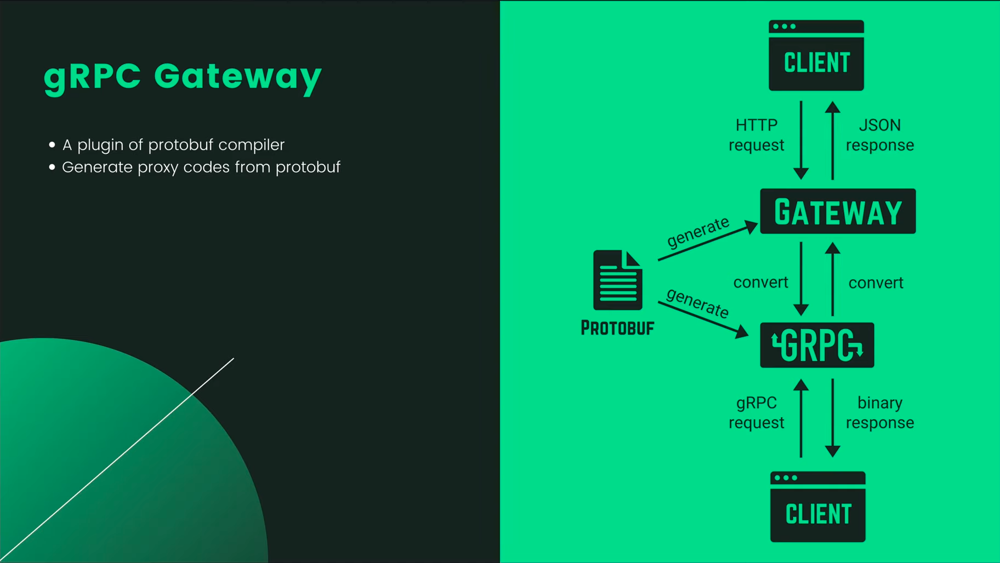
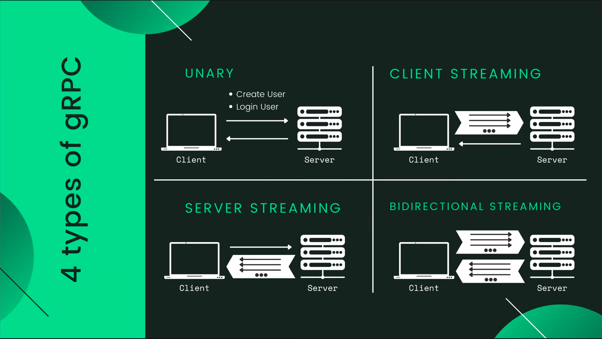
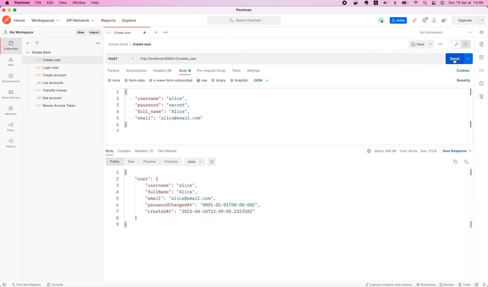
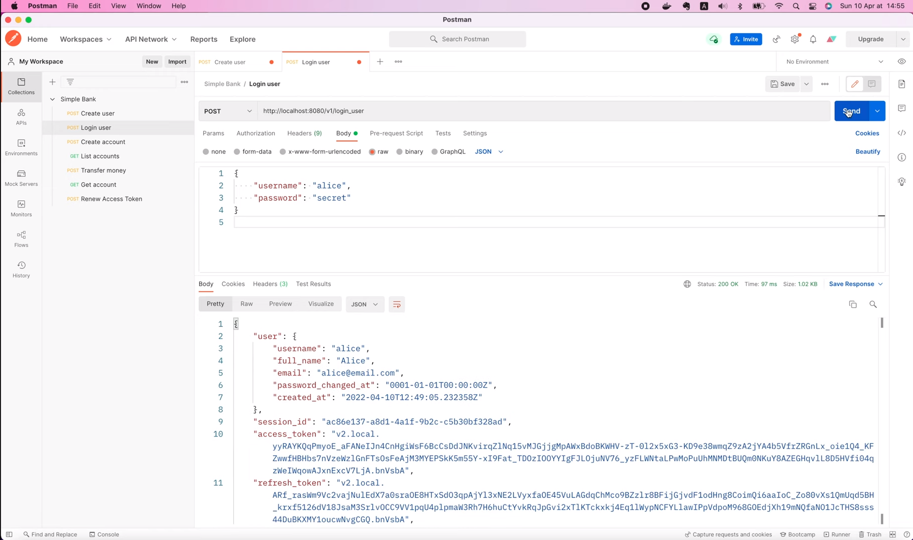

# Пишем один раз код, который сможет обслуживать как gRPC, так и HTTP-запросы

[Оригинал](https://www.youtube.com/watch?v=3FfDH3d0aHs)

Привет, ребята, рад вас снова видеть на мастер-классе по бэкенду! 
На [предыдущей лекции](part42-rus.md) мы узнали, как реализовать 
два gRPC API-интерфейса для создания и входа пользователя в систему, 
а затем использовали клиент Evans для подключения к ним и отправки
gRPC запросов.

gRPC славится своей высокой производительностью, которая очень 
привлекательна для микросервисов или мобильных приложений. Однако в 
некоторых случаях мы все же можем захотеть предоставить клиенту 
обычные HTTP JSON API-интерфейсы. Таким образом, идеальное решение — 
иметь возможность писать код только один раз, но одновременно 
обслуживать как gRPC, так и HTTP-запросы.

И мы узнаем как сделать это сегодня благодаря gRPC шлюзу.
Я уже рассказывал вам о нём на лекции 39: Введение в gRPC.
Но здесь я приведу краткий обзор для тех, кто ещё её не читал.

## gRPC шлюз

gRPC шлюх - это плагин для Protocol Buffer, который генерирует HTTP код 
для прокси из определения protobuf. Из одного `proto` файла, `protoc` 
сгенерирует gRPC код и код HTTP-шлюза. gRPC клиент подключается напрямую к
gRPC серверу для отправки gRPC запросов и получения двоичных ответов. В то 
время как HTTP клиент будет подключаться к серверу HTTP шлюза для отправки
HTTP JSON запросов. Этот запрос будет преобразован в gRPC формат, прежде 
чем будет перенаправлен обработчику gRPC сервиса. Его ответ будет также
преобразован обратно в JSON формат перед возвратом клиенту.



Существует 2 типа преобразований, которые мы можем реализовать для шлюза:
* преобразование «по ходу»: только для унарного gRPC
* Отдельный прокси-сервер: как унарного, так и потокового gRPC


Преобразование «по ходу» означает, что шлюз может вызывать gRPC обработчик
непосредственно в коде, без каких-либо дополнительных надстроек в сети.
Однако оно работает только для унарного gRPC. Если вы хотите преобразовывать 
потоковые gRPC вызовы, то должны запустить HTTP-шлюз как отдельный 
прокси-сервер.

В этом случае HTTP JSON запрос будет преобразован и перенаправлен на
gRPC сервер с помощью сетевого вызова.

Что касается `CreateUser` и `LoginUSer` API, которые мы реализовали в 
предыдущей лекции, оба они являются унарными gRPC. Поэтому в этом случае 
лучше всего использовать преобразование «по ходу» при реализации шлюза.



Итак, давайте узнаем как это сделать!

## Устанавливаем инструменты для создания gRPC шлюза

Первое, что нам нужно сделать, это установить инструменты для создания 
gRPC шлюза. Вы можете легко найти инструкции по установке на [странице 
GitHub](https://github.com/grpc-ecosystem/grpc-gateway#installation) gRPC 
шлюза. Мы должны скопировать этот кусок кода

```go
// +build tools

package tools

import (
    _ "github.com/grpc-ecosystem/grpc-gateway/v2/protoc-gen-grpc-gateway"
    _ "github.com/grpc-ecosystem/grpc-gateway/v2/protoc-gen-openapiv2"
    _ "google.golang.org/grpc/cmd/protoc-gen-go-grpc"
    _ "google.golang.org/protobuf/cmd/protoc-gen-go"
)
```

Затем в Visual Studio Code создадим новый пакет под названием `tools` и 
добавим туда новый файл: `tools.go`.


Теперь вставьте код, который мы скопировали. Этот код всего лишь импортирует
`protoc` плагины с помощью пустого идентификатора.

Мы используем здесь пустой идентификатор, потому что не используем эти
импорты непосредственно в коде, а просто хотим установить их на нашу 
локальную машину, чтобы `protoc` мог использовать их для генерации кода 
для нас. Выполнив

```shell
go mod tidy
go: finding module for package google.golang.org/grpc/cmd/protoc-gen-go-grpc
go: finding module for package github.com/grpc-ecosystem/grpc-gateway/v2/protoc-gen-grpc-gateway
go: finding module for package github.com/grpc-ecosystem/grpc-gateway/v2/protoc-gen-openapiv2
go: downloading google.golang.org/grpc v1.47.0
go: downloading github.com/grpc-ecosystem/grpc-gateway/v2 v2.10.3
go: found github.com/grpc-ecosystem/grpc-gateway/v2/protoc-gen-grpc-gateway in github.com/grpc-ecosystem/grpc-gateway/v2 v2.10.3
go: found github.com/grpc-ecosystem/grpc-gateway/v2/protoc-gen-openapiv2 in github.com/grpc-ecosystem/grpc-gateway/v2 v2.10.3
go: found google.golang.org/grpc/cmd/protoc-gen-go-grpc in google.golang.org/grpc/cmd/protoc-gen-go-grpc v1.2.0
go: downloading google.golang.org/grpc v1.46.2
go: downloading github.com/golang/glog v1.0.0
go: downloading github.com/google/go-cmp v0.5.8
go: downloading gopkg.in/yaml.v3 v3.0.1
go: downloading google.golang.org/genproto v0.0.0-20220519153652-3a47de7e79bd
go: downloading golang.org/x/net v0.0.0-20220127200216-cd36cc0744dd
```

в терминале `go mod` автоматически найдет и загрузит недостающие пакеты 
для нас.

Он также добавит зависимости пакета в файл `go.mod`, что позволит другим 
разработчикам в команде использовать одну и ту же версию.

Хорошо, следующий шаг, мы запустим эту команду `go install`

```shell
go install \
    github.com/grpc-ecosystem/grpc-gateway/v2/protoc-gen-grpc-gateway \
    github.com/grpc-ecosystem/grpc-gateway/v2/protoc-gen-openapiv2 \
    google.golang.org/protobuf/cmd/protoc-gen-go \
    google.golang.org/grpc/cmd/protoc-gen-go-grpc
```

чтобы установить все двоичные файлы плагинов в папку `GOBIN`.

Эти двоичные файлы будут использоваться `protoc` для генерации Golang 
кода позднее.

## Генерируем код gRPC шлюза

Хорошо, теперь когда инструменты установлены, давайте посмотрим, как мы 
можем их использовать! На самом деле, первые 3 шага в [этом 
руководстве](https://github.com/grpc-ecosystem/grpc-gateway#usage) — это 
просто определение обычного gRPC API, создание gRPC заглушек, а затем 
реализация сервиса с использованием этих заглушен, что мы уже сделали в 
предыдущих лекциях.

Единственное отличие появляется на шаге 4, где мы генерируем код gRPC 
шлюза. На данный момент существует 3 варианта:
1) Первый вариант не требует дальнейших изменений в файле `proto`, а 
   просто использует сопоставление по умолчанию с HTTP семантикой. Он прост 
   в использовании, но не позволяет нам настраивать собственный, 
   пользовательский HTTP-маршрут или параметры. Поэтому я не будут его 
   использовать.
2) Второй вариант — дополнительно модифицировать `proto` файл, что 
   позволит нам настроить свои собственные, пользовательские HTTP 
   сопоставления.
3) И последний вариант — использовать внешний файл с настройками. Мы 
   используем эту возможность только тогда, когда не владеем исходным 
   `proto` файлом и не можем вносить в него изменения.

Итак, в нашем случае, поскольку мы владельцы `proto` файла, выберем второй
вариант! Поэтому я прокручу вниз до второго раздела: "With custom annotations"
(«Используя пользовательские аннотации»).

```
 syntax = "proto3";
 package your.service.v1;
 option go_package = "github.com/yourorg/yourprotos/gen/go/your/service/v1";
+
+import "google/api/annotations.proto";
+
 message StringMessage {
   string value = 1;
 }

 service YourService {
-  rpc Echo(StringMessage) returns (StringMessage) {}
+  rpc Echo(StringMessage) returns (StringMessage) {
+    option (google.api.http) = {
+      post: "/v1/example/echo"
+      body: "*"
+    };
+  }
 }
```

Этот пример даёт вам представление о том, что нужно сделать. Сначала 
импортируйте файл `google/api/annotaions.proto`, затем добавьте параметр
`google.api.http` внутри RPC определения, где мы можем настроить метод, 
маршрут и тело.

Следует иметь ввиду, что вы должны предоставить требуемые сторонние `proto`
файлы компилятору `protobuf`. Если вы используете `buf` для управления своими
`proto` файлами и создания заглушек, вы можете использовать следующий
фрагмент кода.

```
version: v1
name: buf.build/yourorg/myprotos
deps:
  - buf.build/googleapis/googleapis
```

для добавления требуемой зависимости.

Я также рекомендую вам просмотреть [этот](https://github.com/grpc-ecosystem/grpc-gateway/blob/master/examples/internal/proto/examplepb/a_bit_of_everything.proto)
`proto` файл, где вы можете найти гораздо больше примеров того, как вы 
можете настроить свой gRPC шлюз.

Итак, как вы знаете, в нашем проекте мы не используем `buf`, но мы 
используем `protoc` для создания заглушек, поэтому нам нужно будет вручную 
скопировать соответствующие `proto` файлы из [googleapis репозитория](https://github.com/googleapis/googleapis)
в наш проект.

Я открою его в новой вкладке браузера. 

Вот список из 4 `proto` файлов, которые нам нужно скопировать.

```
google/api/annotations.proto
google/api/field_behavior.proto
google/api/http.proto
google/api/httpbody.proto
```

Все они находятся в папке `google/api`, поэтому давайте перейдем в 
[репозиторий](https://github.com/googleapis/googleapis) `googleapi`, 
нажмите на кнопку `Code`, показанную на рисунке, и скопируйте ссылку.


Затем в терминале я запущу `git clone` и вставляю ссылку, чтобы клонировать
его на свой компьютер.

```shell
git clone https://github.com/googleapis/googleapis.git
```

Теперь, когда все нужные нам `proto` файлы находятся в папке `google/api`, 
мы должны подготовить для них такую же структуру папок в нашем проекте.

Поэтому я создам новую папку с названием `google` внутри папки `proto`.
Затем создайте еще одну папку `api` внутри этой папки `google`.

Теперь вернитесь в терминал. Давайте перейдём в проект `googleapis`.

```shell
cd googleapis
```

Выведем список всех файлов в папке.

```shell
ls -l
-rw-rw-r--  1 maksim maksim 2999841 июн  2 16:43 api-index-v1.json
-rw-rw-r--  1 maksim maksim     153 июн  2 16:43 BUILD.bazel
-rw-rw-r--  1 maksim maksim    1981 июн  2 16:43 CODE_OF_CONDUCT.md
-rw-rw-r--  1 maksim maksim    1027 июн  2 16:43 CONTRIBUTING.md
drwxrwxr-x  3 maksim maksim    4096 июн  2 16:43 gapic
drwxrwxr-x 43 maksim maksim    4096 июн  2 16:43 google
drwxrwxr-x  3 maksim maksim    4096 июн  2 16:43 grafeas
-rw-rw-r--  1 maksim maksim   11357 июн  2 16:43 LICENSE
-rw-rw-r--  1 maksim maksim    1301 июн  2 16:43 Makefile
-rw-rw-r--  1 maksim maksim    3685 июн  2 16:43 PACKAGES.md
-rw-rw-r--  1 maksim maksim    4178 июн  2 16:43 README.md
-rw-rw-r--  1 maksim maksim    9676 июн  2 16:43 repository_rules.bzl
-rw-rw-r--  1 maksim maksim     329 июн  2 16:43 SECURITY.md
-rw-rw-r--  1 maksim maksim   15176 июн  2 16:43 WORKSPACE
```

Тут есть папка `google`, которая нам нужна. Я скопирую первый файл:
`annotations.proto` в наше простое банковское приложение. Он должен 
находиться в папке `proto/google/api`.

```shell
cp google/api/annotations.proto ~/go/src/github.com/MaksimDzhangirov/backendBankExample/code/simple_bank/proto/google/api/
```

Затем давайте сделаем то же самое, чтобы скопировать 3 других файла:
`field_behaviour.proto`, `http.proto` и `httpbody.proto`.

```shell
cp google/api/field_behavior.proto ~/go/src/github.com/MaksimDzhangirov/backendBankExample/code/simple_bank/proto/google/api/
cp google/api/http.proto ~/go/src/github.com/MaksimDzhangirov/backendBankExample/code/simple_bank/proto/google/api/
cp google/api/httpbody.proto ~/go/src/github.com/MaksimDzhangirov/backendBankExample/code/simple_bank/proto/google/api/
```

Хорошо, теперь, когда необходимые файлы на месте, мы можем использовать их 
для добавления своих собственных, пользовательских HTTP-маршрутов в наш
gRPC шлюз.

Во-первых, давайте импортируем `google/api/annotations.proto`.

```go
import "google/api/annotations.proto";
```

Затем давайте добавим параметр `google.api.http` в тело RPC `CreateUser`.
Внутри этого параметра мы укажем маршрут, а именно: 
`post: "/v1/create_user"`. Здесь `v1` — это версия API. Рекомендуется 
использовать версии API. И, наконец, параметры запроса будут отправлены в 
теле.

```go
rpc CreateUser(CreateUserRequest) returns (CreateUserResponse) {
  option (google.api.http) = {
    post: "/v1/create_user"
    body: "*"
  };
}
```

По аналогии я скопирую весь этот параметр в RPC `LoginUser`. Нам не нужно 
ничего менять, кроме маршрута: `/v1/login_user`.

```go
rpc LoginUser(LoginUserRequest) returns (LoginUserResponse) {
  option (google.api.http) = {
    post: "/v1/login_user"
    body: "*"
  };
}
```

И на этом по сути всё! Довольно просто, не так ли?

Затем нам нужно будет изменить нашу команду `protoc`, чтобы она 
генерировала как заглушки для gRPC, так и шлюз. Вот как это сделать.
Мы должны добавить параметр `grpc-gateway-out`, чтобы указать путь к папке,
где будут находиться сгенерированные файлы gRPC шлюза. В нашем случае
будем использовать ту же папку `pb`, где мы также храним сгенерированные
gRPC заглушки. Существует возможность (параметр `logtostderr=true`) писать 
логи в стандартную ошибку, но это не очень важно, поэтому проигнорируем 
её. Более важным параметром является `paths=source_relative`, который 
сообщает `protoc`, что папку для хранения сгенерированных файлов, нужно 
искать относительно корня нашего проекта.

```makefile
proto:
	rm -f pb/*.go
	protoc --proto_path=proto --go_out=pb --go_opt=paths=source_relative \
        --go-grpc_out=pb --go-grpc_opt=paths=source_relative \
        --grpc-gateway_out=pb --grpc-gateway_opt=paths=source_relative \
        proto/*.proto
```

Существует множество других параметров, контролирующих куда будет 
сохраняться сгенерированный код gRPC шлюза, которые мы можем найти,
выполнив в терминале

```shell
protoc-gen-grpc-gateway --help
```

Вы можете поэкспериментировать с ними, если хотите.

Хорошо, теперь я запущу

```shell
make proto
```

чтобы сгенерировать код.

Итак, теперь, если мы заглянем внутрь папки `pb`, то увидим новый файл:
`service_simple_bank.pb.gw.go`. В нём находится сгенерированный код шлюза.
Файл довольно большой, но нас интересует и мы будем использовать функцию
`RegisterSimpleBankHandlerServer()`.

## Запускаем сервер HTTP шлюза, используя сгенерированный код

Хорошо, теперь давайте узнаем, как запустить сервер HTTP шлюза с помощью 
этого сгенерированного кода.

В файле `main.go` я продублирую функцию `runGrpcServer()`, а затем изменю её
название на `runGatewayServer()`. Мы настроим наш HTTP-шлюз, используя 
метод преобразования «по ходу».

```go
func runGatewayServer(config util.Config, store db.Store) {
	
}
```

Итак, после того, как мы создали объект сервера,

```go
server, err := gapi.NewServer(config, store)
if err != nil {
    log.Fatal("cannot create server:", err)
}
```

мы можем избавиться от этого кода, который регистрирует gRPC сервер.

```go
grpcServer := grpc.NewServer()
pb.RegisterSimpleBankServer(grpcServer, server)
reflection.Register(grpcServer)
```

Вместо этого мы будем вызывать `runtime.NewServeMux()`. Эта функция
находится в пакете `runtime`, который является подпакетом 
`grpc-gateway/v2`. В эту функцию можно передать некоторые параметры, но 
пока я не буду использовать какие-либо специальные параметры, поэтому 
давайте сохраним её результат в переменной `grpcMux`.

```go
grpcMux := runtime.NewServeMux()
```

Затем мы вызовем функцию `pb.RegisterSimpleBankHandlerServer()`, которую 
я показал вам ранее в сгенерированном коде. Он принимает 3 входных аргумента:
контекст, `grpcMux` и сервер, который содержит реализацию наших gRPC 
обработчиков.

```go
pb.RegisterSimpleBankHandlerServer(ctx, grpcMux, server)
```

Для создания контекста, я буду использовать `context.WithCancel()` и 
передам объект фонового контекста в качестве его родителя. Эта функция 
вернет контекст и функцию для его отмены. Мы отложим вызов `cancel()`, 
чтобы он выполнялся только перед выходом из этой функции 
`runGatewayServer`.

```go
ctx, cancel := context.WithCancel(context.Background())
defer cancel()
```

Для тех, кто не знает, отмена контекста — это способ предотвратить 
ненужную работу системы.

Теперь вернемся к функции регистрации, она вернет ошибку, если ошибка 
не равна `nil`, мы просто пишем в лог сообщение "cannot register handler 
server" («невозможно зарегистрировать сервер-обработчик») и завершаем 
работу приложения.

```go
err = pb.RegisterSimpleBankHandlerServer(ctx, grpcMux, server)
if err != nil {
  log.Fatal("cannot register handler server")
}
```

В противном случае мы создадим новый HTTP мультиплексор. Этот мультиплексор 
фактически будет получать HTTP-запросы от клиентов. Поэтому, чтобы 
преобразовать их в формат gRPC, нам придется перенаправить их в gRPC 
мультиплексор, который мы создали ранее. Для этого мы просто вызываем 
`mux.Handler()`, передадим одну косую черту в качестве первого аргумента 
для того, чтобы учесть все маршруты и объект `grpcMux` в качестве второго 
аргумента.

```go
mux := http.NewServeMux()
mux.Handle("/", grpcMux)
```

После этого мы создадим сетевой прослушиватель. Но на этот раз мы 
собираемся передать в него `config.HTTPServerAddress` вместо адреса 
gRPC сервера. Если ошибка не равна `nil`, мы пишем сообщение в лог и 
завершаем работу. В противном случае мы выводим сообщение в лог, в котором
говорится, что запускается сервер HTTP-шлюза.

```go
listener, err := net.Listen("tcp", config.HTTPServerAddress)
if err != nil {
  log.Fatal("cannot create listener")
}

log.Printf("start HTTP gateway server at %s", listener.Addr().String())
```

Наконец, мы вызовем функцию `http.Serve()` и передадим прослушиватель и 
объект HTTP-мультиплексора. Если этот вызов вернёт ошибку, мы пишем сообщение 
в лог "cannot start HTTP gateway server" («невозможно запустить сервер 
HTTP-шлюза») и завершаем работу. И это всё, что нам нужно сделать, чтобы
завершить написание функции `runGatewayServer()`.

```go
err = http.Serve(listener, mux)
if err != nil {
  log.Fatal("cannot start HTTP gateway server")
}
```

Теперь вернёмся к функции `main`, чтобы вызвать её! Мы хотим иметь 
возможность обслуживать как gRPC, так и HTTP-запросы одновременно.
Но мы не можем просто вызвать обе функции в одной горутине, так как 
первый сервер заблокирует второй. Итак, здесь, если мы запускаем gRPC 
сервер в `main` горутине, то нам нужно запустить сервер HTTP-шлюза в 
другой. На самом деле сделать это очень легко! Мы просто используем 
ключевое слово `go`, за которым следует вызов функции `runGatewayServer()`.

```go
func main() {
	...
	
	store := db.NewStore(conn)
	go runGatewayServer(config, store)
	runGrpcServer(config, store)
}
```

Этого будет достаточно, чтобы запустить его в отдельной горутине, и,
таким образом, оба сервера не будут блокировать запуск друг друга.

Итак, давайте откроем терминал и попробуем запустить сервер!

```shell
make server
go run main.go
2022/04/10 14:45:38 cannot create listener
exit status 1
make: *** [server] Error 1
```

У нас возникла ошибка: "cannot create listener" («невозможно создать 
слушателя»). Но мы не знаем, почему. Итак, давайте вернемся к коду и 
добавим в логи больше информации об ошибке.

Итак, здесь я забыл добавить исходный объект ошибки в сообщение, так что
давайте добавим его в конце лога.

```go
listener, err := net.Listen("tcp", config.HTTPServerAddress)
if err != nil {
    log.Fatal("cannot create listener: ", err)
}
```

Кроме того, я добавлю исходную ошибку ко всем другим командам, добавляющим 
сообщения в логе и завершающим работу приложения. А именно, здесь

```go
if err != nil {
    log.Fatal("cannot start HTTP gateway server:", err)
}
```

здесь,

```go
if err != nil {
    log.Fatal("cannot register handler server", err)
}
```

здесь,

```go
if err != nil {
    log.Fatal("cannot start gRPC server:", err)
}
```

и здесь.

```go
listener, err := net.Listen("tcp", config.GRPCServerAddress)
if err != nil {
    log.Fatal("cannot create listener:", err)
}
```

Хорошо, теперь вернемся в терминал и снова запустим `make server`.

```shell
make server
go run main.go
2022/04/10 14:46:58 cannot create listener:listen tcp 0.0.0.0:9090: bind: address already in use
exit status 1
make: *** [server] Error 1
```

Теперь мы видим настоящую ошибку: "address already in use" («адрес уже 
используется»).

Она связана с тем, что у нас уже запущен gRPC сервер в другой вкладке.
Поэтому я оставлю его. И ещё раз выполню команду "make server".

```shell
go run main.go
2022/04/10 14:47:10 start gRPC server at [::]:9090
2022/04/10 14:47:10 start HTTP gateway server at [::]:8080
```

На этот раз и gRPC сервер, и HTTP сервер были успешно запущены. Как видите, 
они обслуживают запросы на разных портах.

Отлично, а теперь почему бы не попытаться отправить какие-нибудь 
HTTP-запросы?

## Отправляем запросы на gRPC и HTTP серверы

В Postman попробуем вызвать этот `CreateUser` API!

Ой, у нас возникла ошибка `400 Not found`.


Почему? Ну, потому что мы используем неправильный URL-адрес.

Вы помните маршрут, который мы добавили в файл `service_simple_bank.proto`?
Он должен быть равен `/v1/create_user`. Поэтому я скопирую его в Postman
и повторно отправлю запрос.



На этот раз запрос выполнен успешно. Создан новый пользователь.

По аналогии, я скопирую URL-адрес `LoginUser` API, вставлю его в этот
запрос Postman и нажму `Send`!


Вуаля, запрос также выполнен успешно. Мы получили информацию о пользователе 
вместе со всеми токенами. Итак, наш сервер шлюза HTTP работает как надо.

А что насчёт gRPC сервера?

Я буду использовать Evans для отправки gRPC запроса, чтобы убедиться, 
что он все ещё работает.

Давайте вызовем LoginUser RPC. Введите имя пользователя и пароль.

```shell
call LoginUser
username (TYPE_STRING) => alice
password (TYPE_STRING) => secret
{
  "user": {
    "username": "alice",
    "fullName": "Alice",
    "email": "alice@email.com",
    "passwordChangedAt": "0001-01-01T00:00:00Z",
    "createdAt": "2022-04-10T12:49:05.232358Z"
  },
  "sessionId": "b523ec51-1769-45b1-88f1-e8d5badbd48b",
  "accessToken": "v2.local.-4iiVsYARtFs1IJN0l-bm4ftErMVyqZCGkUlNIvrynKdSTVs80PvSJbO3R9FzQ0itHz7AOiDvBQGEWuypREdwsb-ABl8Bp7C2ssroyd8fXoVxJuVdST64Y-1zhnkhYgbK2eKOPdLXAktyGXAEjMmYJAj4oePlX45xIWOLXkUonsh2KD3p0BiHtFuR_VHsDSJ6Uv1z3rhSsbriFXH5ATU1YVz1rTa5QZafGP0i7v5ZeW1kkdyrGDQrFSWa0KkkGFep2o99rAKNLH3CzVRTQ.bnVsbA",
  "refreshToken": "v2.local.FBd8l9h6J5vABLWl0duBgKT_PC97mcgAoPdrw-Dxco-seii21AUHKTveVKcjYMbFVSIucpyH-nUg14duuc3sYxEb08VdGjnRGB5UMA5xugxFSFekr0pA9KHQsZ6996XLmUWe7GlCmDnQNbADJjLhNgL0AMaHwXfhVj-9iYYpackXkh_6ISarAKQFWzSSq0JIrpNcEuLMFrHg34Mfd6Vc0XNnSQJEhMQwNfNoUvSptZqZk3n95xFrQD963n2N-Imxb9Ay5o8CEbs8QEI.bnVsbA",
  "accessTokenExpiresAt": "2022-04-10T13:05:02.899825Z",
  "refreshTokenExpiresAt": "2022-04-11T12:50:02.889886Z"
}
```

Ура! Запрос по-прежнему успешно выполнен. Таким образом, это доказывает, 
что наш сервер теперь может одновременно обслуживать gRPC и HTTP запросы.

Довольно круто, не так ли?

Возможно вы заметили, что имена полей в JSON ответе сервера записаны с
помощью camel case. Это не баг.

Но что нужно сделать, чтобы они выдавались в виде snake case. Я бы предпочел
не изменять те же имена полей, которые мы определили в `proto` файлах. 
Таким образом, у нас была бы согласованность в названиях полей между
gRPC и HTTP. Итак, как нам достичь этого?

Что ж, если вы перейдёте на [страницу документации](https://grpc-ecosystem.github.io/grpc-gateway/),
gRPC шлюза, откроете меню `Mapping` и выберите `Customizing your gateway`, 
то обнаружите раздел о том, как [`proto` названия в JSON](https://grpc-ecosystem.github.io/grpc-gateway/docs/mapping/customizing_your_gateway/#using-proto-names-in-json).

Итак, по умолчанию, `protoc` генерирует JSON поля в camel case. Чтобы 
использовать тот же регистр, что и в `proto` файле, мы должны задать для 
параметра `UseProtoNames` значение `true`. И это можно сделать передавая
`MarshalerOption` при создании gRPC мультиплексора.

```go
mux := runtime.NewServeMux(
	runtime.WithMarshalerOption(runtime.MIMEWildcard, &runtime.JSONPb{
		MarshalOptions: protojson.MarshalOptions{
			UseProtoNames: true,
		},
		UnmarshalOptions: protojson.UnmarshalOptions{
			DiscardUnknown: true,
		},
	}),
)
```

Я скопирую все эти настройки и вернусь к нашему файлу `main.go`.

В функции runGatewayServer() перед созданием `grpcMux` я вставлю код, 
создающий `MarshalerOption`. Давайте сохраним результат его работы в
переменной с названием `jsonOption`. Затем мы передадим эту `jsonOption` 
в вызов функции `NewServeMux()`.

```go
jsonOption := runtime.WithMarshalerOption(runtime.MIMEWildcard, &runtime.JSONPb{
   MarshalOptions: protojson.MarshalOptions{
      UseProtoNames: true,
   },
   UnmarshalOptions: protojson.UnmarshalOptions{
      DiscardUnknown: true,
   },
})

grpcMux := runtime.NewServeMux(jsonOption)
```

И это всё, что нам нужно сделать, чтобы включить snake case для 
нашего сервера gRPC шлюза.

Давайте проверим это! Я перезапущу сервер. Затем в Postman давайте 
повторно отправим запрос на вход пользователя в систему.



Как и следовало ожидать, на этот раз все поля в ответе теперь имеют тот 
же вид, который мы определили в `proto` файле, а именно — snake case.
Довольно круто, не так ли?

На этом завершим нашу лекцию о gRPC шлюзе. Надеюсь она была
интересной и приобретенные знания будут вам полезны.

Большое спасибо за время, потраченное на чтение, желаю Вам получать 
удовольствие от обучения и до скорой встречи на следующей лекции!