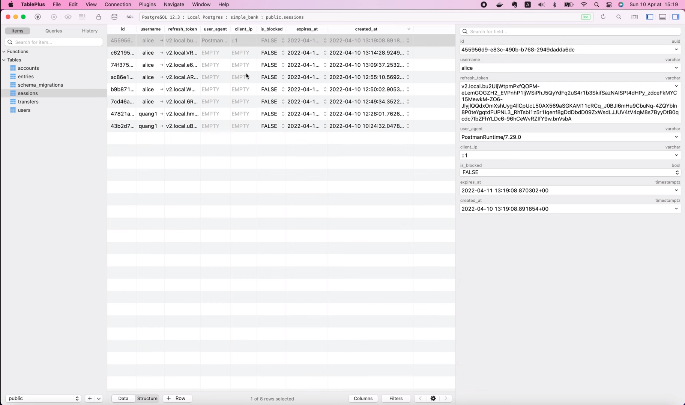
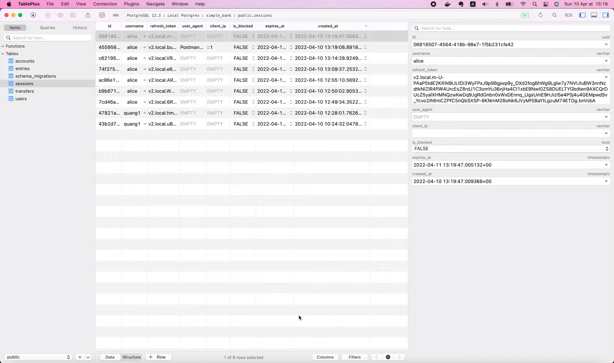
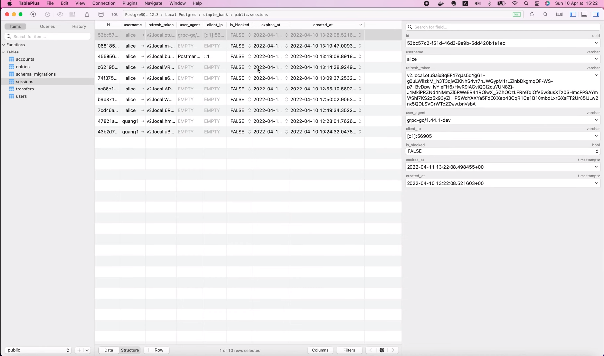
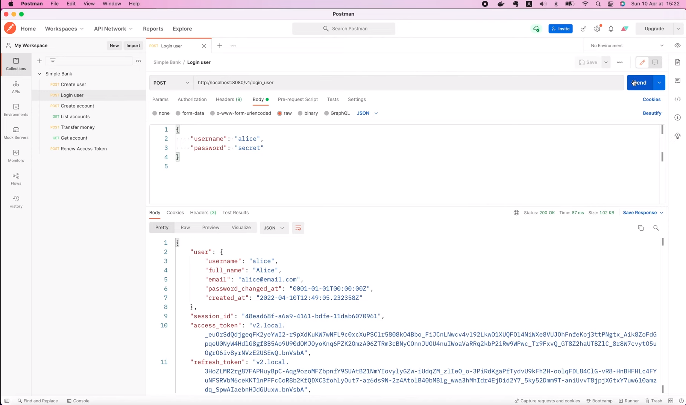

# How to extract info from gRPC metadata

[Original video](https://www.youtube.com/watch?v=Sno10WQ21Zs)

Hello everyone, welcome back to the backend master class! In
this lecture, we will learn about gRPC metadata and how to work
with it. Metadata is just some information about a particular 
RPC call, in the form of a list of key-value pairs. It lets the
client provide some extra information associated with the call 
to the server and vice versa. If you still remember, in the
previous lectures, we've implemented the login user API, and in
this API, we're creating a session and storing some useful 
information in the database.

However, for now, if we look at the record, you can see that
the `user_agent` and `client_ip` fields are still empty.


That's because in our RPC login user handler, we're not getting
and saving the correct values. We're just passing in empty
strings at the moment.

So today, let's learn how to fill them with real metadata!

But, first, let me remind you that we're using gRPC gateway, so
the requests coming to this handler function can be from both
a gRPC client (such as Evans CLI), as well as an HTTP client
(such as Postman).


And therefore, the metadata that they send can be stored in 
different formats. Alright, now I'm gonna create a new file:
`metadata.go` inside the `gapi` package. Then in this file, 
I'm gonna add a new method to our server struct, let's call
it `extractMetadata`. This function will take a context 
object as input, because all the gRPC metadata will be 
stored in this context, and it will return a Metadata
object as output. 

```go
func (server *Server) extractMetadata(ctx context.Context) *Metadata {

}
```

I'm gonna define the `Metadata` struct up here.

```go
type Metadata struct {
	UserAgent string
	ClientIP  string
}
```

This struct will keep track of all metadata we want to 
extract from the context. For now, we only need 2 fields,
1 for user agent, and 1 for the client's IP address.

Alright, with this struct, we can now create a new metadata
object and return it.

We will learn how to fill its content in a moment.

```go
func (server *Server) extractMetadata(ctx context.Context) *Metadata {
	mtdt := &Metadata{}
	return mtdt
}
```

But first, let's go back to the RPC login user. Here, just 
before creating a session, we will call 
`server.extractMetadata()`, and pass in the context, that we
receive from the input argument of the `LoginUser` method.
Then, we just replace this empty string with `mtdt.UserAgent`
and this one with `mtdt.ClientIP`.

```go
mtdt := server.extractMetadata(ctx)
session, err := server.store.CreateSession(ctx, db.CreateSessionParams{
    ID:           refreshPayload.ID,
    Username:     user.Username,
    RefreshToken: refreshToken,
    UserAgent:    mtdt.UserAgent,
    ClientIp:     mtdt.ClientIP,
    IsBlocked:    false,
    ExpiresAt:    refreshPayload.ExpiredAt,
})
```

And that's it for the session info. Now let's go back
to the `extractMetadata()` function to get the correct 
values from the context!

In order to do that, we have to call 
`metadata.FromIncomingContext()` and pass in the input 
context object.

```go
metadata.FromIncomingContext(ctx)
```

Here, `metadata` is a subpackage of gRPC that provides
functions to work with metadata. This function will 
return 2 outputs: a `metadata.MD` object and a boolean.
So let's store them in 2 variables: `md` and `ok`. The
`ok` boolean variable will tell us if the metadata is
successfully retrieved or not.

```go
if md, ok := metadata.FromIncomingContext(ctx); ok {
    
}
```

If it is, we will print out the context of the `md` 
object to see what's inside.

```go
if md, ok := metadata.FromIncomingContext(ctx); ok {
    log.Printf("md: %+v\n", md)
}
```

Alright, let's restart the server!

```shell
make server
```

And go back to Postman to send the login request.

```shell
make server
go run main.go
2022/04/10 15:14:24 start gRPC server at [::]:9090
2022/04/10 15:14:24 start HTTP gateway server at [::]:8080
2022/04/10 15:14:28 md: map[grpcgateway-accept:[*/*] grpcgateway-content-type:[application/json] grpcgateway-user-agent:[PostmanRuntime/7.29.0] x-forwarded-for:[::1] x-forwarded-host:[localhost:8080]]
```

Here we can see that `md` is actually a map, where 
the key is a string, and the value is an array of 
strings.

The user agent that we're looking for must be the value
of this `grpcgateway-user-agent` key.

So let's copy it to our code.

I'm gonna store it in a constant named 
`grpcGatewayUserAgentHeader`. Similarly, the client's
IP address will be the value stored with this
`x-forwarded-for` key. So I'm gonna declare another
constant for it: `xForwardedForHeader`.

```go
const (
	grpcGatewayUserAgentHeader = "grpcgateway-user-agent"
	xForwardedForHeader = "x-forwarded-for"
)
```

Now, in the `extractMetadata()` function, let's call
`md.Get()` to get the value of the gRPC gateway user
agent header. It will return an array of strings, 
so I'm gonna store it in the `userAgents` variable.
Then we should check if this array is not empty.
In that case, the user agent value must be the 
first item in the list. So I will set `mddt.UserAgent`
to `userAgents[0]`. The same thing can be done for the
client's IP address. We get the value of the
`xForwardedForHeader`, store it in the `clientIPs` 
array, check if the array is not empty, and set 
`mtdt.ClientIP = clientIPs[0]`.

```go
if md, ok := metadata.FromIncomingContext(ctx); ok {
    log.Printf("md: %+v\n", md)
    if userAgents := md.Get(grpcGatewayUserAgentHeader); len(userAgents) > 0 {
        mtdt.UserAgent = userAgents[0]
    }
    
    if clientIPs := md.Get(xForwardedForHeader); len(clientIPs) > 0 {
        mtdt.ClientIP = clientIPs[0]
    }
}
```

That's basically it. Let's try to restart the
server, and resend the login user API request in 
Postman.

Now, if we look at the session record in TablePlus,
we will see that the `user_agent` and the `client_ip`
fields are no longer empty as before.



They have been filled with the correct values we 
extracted from the gRPC metadata.

So it works! Excellent!

However, keep in mind that, it's just working for
the HTTP client.

How about a gRPC client?

Will it be different if we send a gRPC request 
instead of HTTP?

Well, let's try connecting to the server with Evans
CLI, and call the `LoginUser` RPC. Enter username 
and password to login.

```shell
call LoginUser
username (TYPE_STRING) => alice
password (TYPE_STRING) => secret
{
  "user": {
    "username": "alice",
    "fullName": "Alice",
    "email": "alice@email.com",
    "passwordChangedAt": "0001-01-01T00:00:00Z",
    "createdAt": "2022-04-10T12:49:05.232358Z"
  },
  "sessionId": "dd8af954-6681-4d0f-bc84-1fd4498986ab",
  "accessToken": "v2.local.R2SZJByrnVhie7anzI3Zjhpta8lkVMmQwHCG-uaDgXc7rBiBFqNQR2GcWhOhFvTlvX2SGdpqkDXJ3lJGvuk8d5XJENdZqsjtsEPYq7ojgVTjFG8VbY9p_4ub82frYATOlA0UBrQll7o09Q98ELn-6pl3FIV05nJD_tmcQVtVKSkfqWg6n53w6qUtLYiq-mvRnDPHcSOODJ8Sj8UnpuZ2HBFsuaYYKIPVCiXrcmaMYHduBh5-oxjdWv9BUgpjXAviz-hjgUvX4roY3w3jHA.bnVsbA",
  "refreshToken": "v2.local.vdRZ9VjMuWLn9JuNA3Dws1UH5r5gnz6fTMundXFI8ZlVxMjPzNlgIQSF9eX8ebnTizzlaycciYNMALe5mO9iCuMLaP-1qDDqfq0VZ59WCfjahpr8f06UQi8TXqlCZh4dJtz526Nj7Cg-pGi4trmwFIKNoO3jzSLZb1O68kGfwKW-UfknfUoY2b2mWFBd7TUu2WyES8DVgPm7AX9Lyhl_Im3THbq0jqvercvzNuHjqFRp9odbdLj-NQQqGsexXg95ao6Ujt77f1tY2SzF1w.bnVsbA",
  "accessTokenExpiresAt": "2022-04-10T13:34:47.005092Z",
  "refreshTokenExpiresAt": "2022-04-11T13:19:47.005132Z"
}
```

OK, the session has been created.

Let's check it out in TablePlus!



As you can see here, the `user_agent` and `client_ip`
are still empty. So what we've implemented before 
doesn't work for a gRPC client.

Let's check the logs to find out why.

```shell
make server
go run main.go
2022/04/10 15:19:04 start gRPC server at [::]:9090
2022/04/10 15:19:04 start HTTP gateway server at [::]:8080
2022/04/10 15:19:08 md: map[grpcgateway-accept:[*/*] grpcgateway-content-type:[application/json] grpcgateway-user-agent:[PostmanRuntime/7.28.0] x-forwarded-for:[::1] x-forwarded-host:[localhost:8080]]
2022/04/10 15:19:47 md: map[:authority:[localhost:9090] content-type:[application/grpc] grpc-client:[evans] user-agent:[grpc-go/1.35.0]]
```

Here you can see that the metadata map looks completely 
different from the one above it. It's still a map of 
string to array, but the names of the keys are not the 
same. For example, the user agent key is just 
`user-agent`, not `grpcgateway-user-agent` as before.
So let's copy this key, and declare a new constant for
it in our code. I'm gonna call it just `userAgentHeader`.

```go
const (
	grpcGatewayUserAgentHeader = "grpcgateway-user-agent"
	xForwardedForHeader        = "x-forwarded-for"
	userAgentHeader = "user-agent"
)
```

Then, in the `extractMetadata()` function, I'm gonna
duplicate this chunk of codes,

```go
if userAgents := md.Get(grpcGatewayUserAgentHeader); len(userAgents) > 0 {
    mtdt.UserAgent = userAgents[0]
}
```

and rename the header to `userAgentHeader`.

I'm gonna delete this log as well.

```go
log.Printf("md: %+v\n", md)
```

So that's how we get the user agent.

But it seems there's no field in the metadata that
stores the client's IP address. So how can we get it?

Well, although the gRPC client's IP address is not 
stored in the metadata, it's still stored somewhere
in the context. And we can get it with a different 
subpackage of gRPC called `peer`.

All we have to do is to call `peer.FromContext()`,
and pass in the input context object.

This function will return the peer information,
together with a boolean value to tell us if the info
exists or not. So we check if `ok` is true, then, 
the client's IP address will be stored in the 
`p.Addr` field. We just need to convert it to
string. And that's all!

```go
if p, ok := peer.FromContext(ctx); ok {
    mtdt.ClientIP = p.Addr.String()
}
```

Both user agent and client IP fields have been
extracted. Let's give it a try!

I'm gonna restart the server. Then, in the Evans
client console, let's call Login User RPC again.
Enter username and password.

```shell
call LoginUser
username (TYPE_STRING) => alice
password (TYPE_STRING) => secret
{
  "user": {
    "username": "alice",
    "fullName": "Alice",
    "email": "alice@email.com",
    "passwordChangedAt": "0001-01-01T00:00:00Z",
    "createdAt": "2022-04-10T12:49:05.232358Z"
  },
  "sessionId": "235c7b64-2b8e-4cd5-bfe7-4847545ebf01",
  "accessToken": "v2.local.G_Y2a5bPuRezLTSJ0A3CAnzbFhfUyEOwC--5LVOBfUzGBkVq9Of1C4PxXP5PuIU7QYb-KGvpjxxtyY6Vs3s6rDEPmjid9TulZqofjFFoPioa4gEL2S9BcEBPR_-RrFB3nM6nuW2oLVCdkoELzgxNP3C_q5nyHivTBVMuN9tzjnQd2WRKttZdq23_f8yotRfezpTtr9rVvC2NslhH4DAOEBjTZcHBarlR_cW9YdH9pHiL1R3Y55_sBxsHK_NJdqBrke9jwECrxcnnUqUeQQ.bnVsbA",
  "refreshToken": "v2.local.kwHY8Kscvi0fBw2fdantlGbYkAfnEnw0eq5gn89RZeQE6lv9WuhOHh4ITY4kvFqwcC_F1hoY_DJ4IeikN3tFPnn0TjSjgPYjF91amZyX4hkeuMzQFLWuwZlFJy1mvKKGcMYTeHaTc9kb2OMeFTDhi9-11_TblAt7Z5JOpJdn-jLkk12OoeMiY14uPKjmRW8JW4RhtreDbtE5GWDK2wIhYC89E7NfmdeVJnN5tgjJlP5W_Twr1kdh2ogZWAHTkyAbJFw5DyQPdZv0WnKU-g.bnVsbA",
  "accessTokenExpiresAt": "2022-04-10T13:37:08.498218Z",
  "refreshTokenExpiresAt": "2022-04-11T13:22:08.498455Z"
}
```

OK, the request is successful. This time, if we look
at the session record, we will see that the `user_agent`
and `client_ip` have been filled with the correct values.



So now, our code can extract that information from all 
requests, whether it comes from a gRPC client or an 
HTTP client. You can verify it again by sending an 
HTTP request in Postman.



It's still successful, and we have all the metadata 
info stored in the `session` table.

Pretty awesome, isn't it?

And that brings us to the end of this lecture. We've
learned how to extract some useful information from
the metadata of the gRPC context. I hope it's
interesting and useful for you.

And by th way, I've just created a Discord channel for Tech 
School.

Don't forget to join it to cha with me and other students.

Thanks a lot for watching! Happy learning, and see you 
in the next lecture!