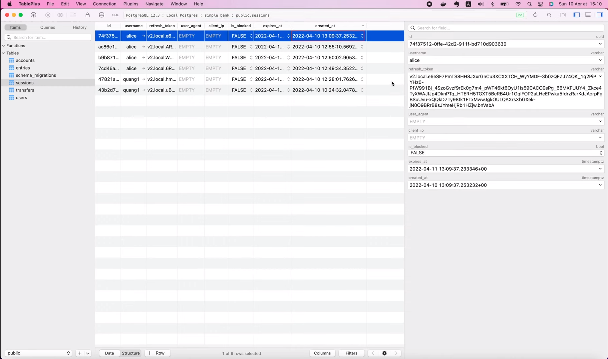
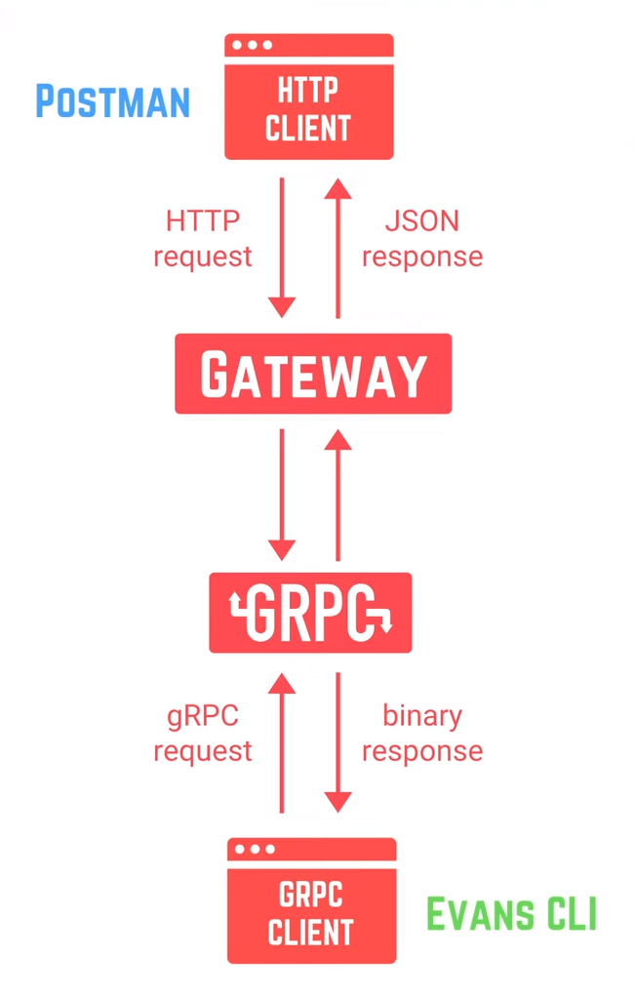
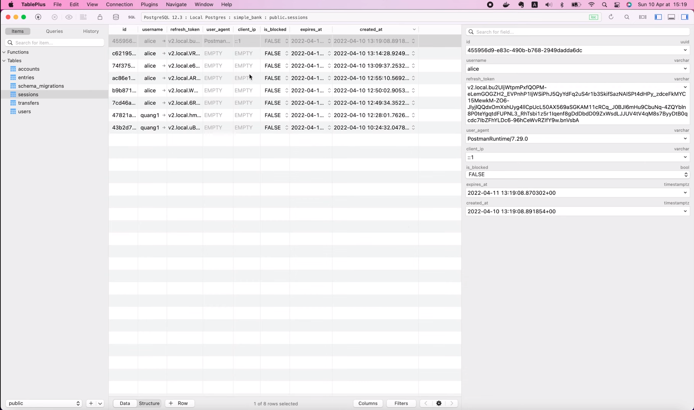
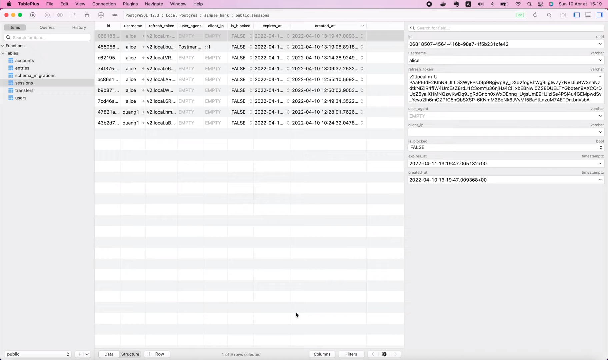
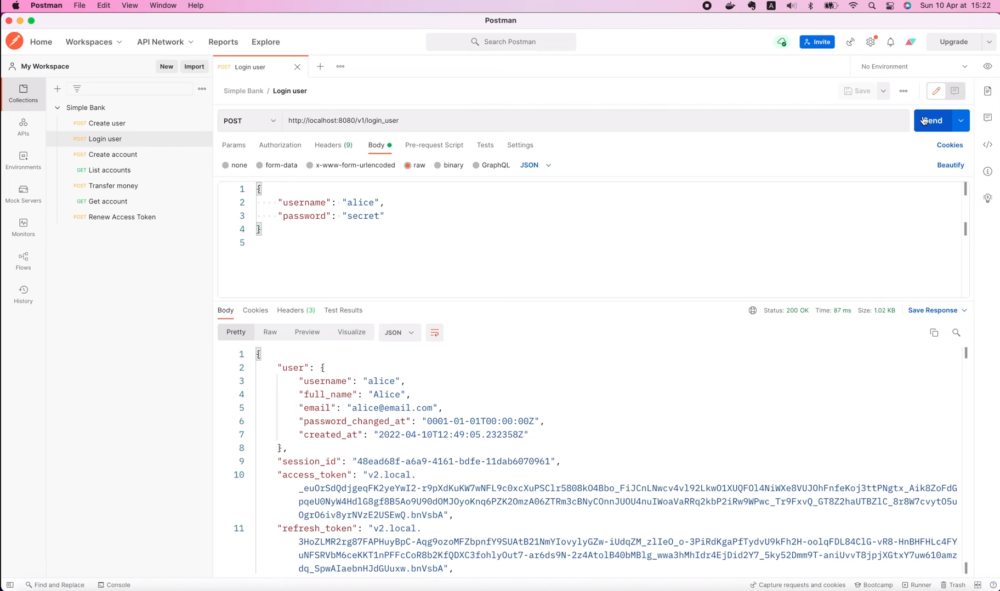

# Как извлечь информацию из gRPC метаданных

[Оригинал](https://www.youtube.com/watch?v=Sno10WQ21Zs)

Всем привет, рад вас снова видеть на мастер-классе по бэкенду! На этой
лекции мы узнаем о gRPC метаданных и о том, как с ними работать.
Метаданные — это просто некая информация о конкретном RPC вызове в виде 
списка пар ключ-значение. Они позволяют клиенту предоставлять некоторую 
дополнительную информацию, связанную с вызовом на сервере, и наоборот.
Если вы ещё помните, на предыдущих лекциях мы реализовали API для входа 
пользователя в систему, и там мы создаем сессию и сохраняем некоторую 
полезную информацию в базе данных.

Однако, на данный момент, если мы посмотрим на запись, то увидим, что до 
сих пор поля `user_agent` и `client_ip` всё ещё не заполнены.



Это связано с тем, что в нашем RPC обработчике входа в систему мы не 
получаем и не сохраняем правильные значения. На данный момент мы
просто передаём пустые строки.

Итак, сегодня давайте научимся заполнять их реальными метаданными!

## Извлекаем `user_agent` и `client_ip` из метаданных

Но, прежде, позвольте напомнить вам, что мы используем gRPC шлюз, поэтому 
запросы, поступающие в эту функцию-обработчик могут быть как от gRPC 
клиента (например, Evans CLI), так и от HTTP клиента (например, Postman).



И поэтому метаданные, которые они отправляют, могут храниться в разных 
форматах. Поэтому сейчас я создам новый файл: `metadata.go` внутри 
пакета `gapi`. Затем в этом файле я добавлю новый метод в структуру 
нашего сервера, назовем его `extractMetadata`. Эта функция будет 
принимать объект контекста в качестве входных данных, поскольку все
gRPC метаданные будут храниться в этом контексте, и она будет 
возвращать объект `Metadata` в качестве результата.

```go
func (server *Server) extractMetadata(ctx context.Context) *Metadata {

}
```

Я определю структуру `Metadata` выше в этом же файле.

```go
type Metadata struct {
	UserAgent string
	ClientIP  string
}
```

Эта структура будет хранить все метаданные, которые мы хотим извлечь 
из контекста. На данный момент нам нужно только два поля, одно для 
агента, который использует пользователь, и одно для IP-адреса клиента.

Итак, теперь с помощью этой структуры мы можем создать новый объект 
метаданных и вернуть его.

Мы узнаем как его заполнить чуть позже.

```go
func (server *Server) extractMetadata(ctx context.Context) *Metadata {
	mtdt := &Metadata{}
	return mtdt
}
```

Но сначала давайте вернёмся к RPC `LoginUser`. Здесь, непосредственно
перед созданием сессии, мы вызовем `server.extractMetadata()` и 
передадим контекст, который мы получаем из входного аргумента 
метода `LoginUser`. Затем мы просто заменяем первую пустую строку на 
`mtdt.UserAgent`, а вторую — на `mtdt.ClientIP`.

```go
mtdt := server.extractMetadata(ctx)
session, err := server.store.CreateSession(ctx, db.CreateSessionParams{
    ID:           refreshPayload.ID,
    Username:     user.Username,
    RefreshToken: refreshToken,
    UserAgent:    mtdt.UserAgent,
    ClientIp:     mtdt.ClientIP,
    IsBlocked:    false,
    ExpiresAt:    refreshPayload.ExpiredAt,
})
```

Это всё, что нужно изменить для сохранения информации о сессии. 
Теперь вернёмся к функции `extractMetadata()`, чтобы получить 
правильные значения из контекста!

Для этого мы должны вызвать `metadata.FromIncomingContext()` и 
передать в неё объект контекста, являющийся аргументом `extractMetadata`.

```go
metadata.FromIncomingContext(ctx)
```

Здесь `metadata` — это подпакет gRPC, предоставляющий функции 
для работы с метаданными. Эта функция вернет два значения:
объект `metadata.MD` и логическое значение. Итак, давайте сохраним 
их в двух переменных: `md` и `ok`. Логическая переменная `ok` сообщит 
нам, успешно ли извлечены метаданные или нет.

```go
if md, ok := metadata.FromIncomingContext(ctx); ok {
    
}
```

Если да, мы выведем в лог содержимое объекта `md`, чтобы увидеть, 
что внутри.

```go
if md, ok := metadata.FromIncomingContext(ctx); ok {
    log.Printf("md: %+v\n", md)
}
```

Итак, давайте перезапустим сервер!

```shell
make server
```

И вернёмся в Postman, чтобы отправить запрос на вход в систему.

```shell
make server
go run main.go
2022/04/10 15:14:24 start gRPC server at [::]:9090
2022/04/10 15:14:24 start HTTP gateway server at [::]:8080
2022/04/10 15:14:28 md: map[grpcgateway-accept:[*/*] grpcgateway-content-type:[application/json] grpcgateway-user-agent:[PostmanRuntime/7.29.0] x-forwarded-for:[::1] x-forwarded-host:[localhost:8080]]
```

Здесь мы видим, что `md` на самом деле является картой, где ключом 
является строка, а значением является массив строк.

Агент пользователя, который мы ищем, должен быть значением этого 
ключа `grpcgateway-user-agent`.

Поэтому давайте скопируем его в наш код.

Я сохраню ключ в константе, которую назову `grpcGatewayUserAgentHeader`.
По аналогии IP-адрес клиента — это значение, сохраненное в карте
с помощью ключа `x-forwarded-for`. Поэтому я объявлю для него ещё 
одну константу: `xForwardedForHeader`.

```go
const (
	grpcGatewayUserAgentHeader = "grpcgateway-user-agent"
	xForwardedForHeader = "x-forwarded-for"
)
```

Теперь в функции `extractMetadata()` вызовем `md.Get()`, чтобы
получить значение заголовка агента пользователя gRPC шлюза. Он вернёт
массив строк, поэтому я сохраню его в переменной `userAgents`.
Затем мы должны проверить, не пуст ли этот массив. Если нет, то
значение агента пользователя должно быть первым элементом в списке.
Поэтому я присвою `mddt.UserAgent` значение `userAgents[0]`. То же 
самое можно сделать для IP-адреса клиента. Мы получаем значение 
`xForwardedForHeader`, сохраняем его в массиве `clientIPs`, 
проверяем, не пуст ли массив и присваиваем `mtdt.ClientIP = clientIPs[0]`.

```go
if md, ok := metadata.FromIncomingContext(ctx); ok {
    log.Printf("md: %+v\n", md)
    if userAgents := md.Get(grpcGatewayUserAgentHeader); len(userAgents) > 0 {
        mtdt.UserAgent = userAgents[0]
    }
    
    if clientIPs := md.Get(xForwardedForHeader); len(clientIPs) > 0 {
        mtdt.ClientIP = clientIPs[0]
    }
}
```

На этом по сути всё. Давайте попробуем перезапустить сервер и повторно 
отправить запрос к API для входа пользователя в систему через Postman.

Теперь если открыть таблицу с сессиями в TablePlus и найти соответствующую
запись, то мы увидим, что поля `user_agent` и `client_ip` теперь не 
пустые, какими они были до этого.



Они были заполнены правильными значениями, извлеченными из gRPC 
метаданных.

Так что всё работает как надо! Превосходно!

Однако помните, что работать это будет только для HTTP клиентов.

А если мы используем gRPC клиент?

Что произойдёт если мы отправим gRPC запрос вместо HTTP?

Что ж, давайте попробуем подключиться к серверу с помощью Evans CLI
и вызвать RPC `LoginUser`. Введите имя пользователя и пароль для входа.

```shell
call LoginUser
username (TYPE_STRING) => alice
password (TYPE_STRING) => secret
{
  "user": {
    "username": "alice",
    "fullName": "Alice",
    "email": "alice@email.com",
    "passwordChangedAt": "0001-01-01T00:00:00Z",
    "createdAt": "2022-04-10T12:49:05.232358Z"
  },
  "sessionId": "dd8af954-6681-4d0f-bc84-1fd4498986ab",
  "accessToken": "v2.local.R2SZJByrnVhie7anzI3Zjhpta8lkVMmQwHCG-uaDgXc7rBiBFqNQR2GcWhOhFvTlvX2SGdpqkDXJ3lJGvuk8d5XJENdZqsjtsEPYq7ojgVTjFG8VbY9p_4ub82frYATOlA0UBrQll7o09Q98ELn-6pl3FIV05nJD_tmcQVtVKSkfqWg6n53w6qUtLYiq-mvRnDPHcSOODJ8Sj8UnpuZ2HBFsuaYYKIPVCiXrcmaMYHduBh5-oxjdWv9BUgpjXAviz-hjgUvX4roY3w3jHA.bnVsbA",
  "refreshToken": "v2.local.vdRZ9VjMuWLn9JuNA3Dws1UH5r5gnz6fTMundXFI8ZlVxMjPzNlgIQSF9eX8ebnTizzlaycciYNMALe5mO9iCuMLaP-1qDDqfq0VZ59WCfjahpr8f06UQi8TXqlCZh4dJtz526Nj7Cg-pGi4trmwFIKNoO3jzSLZb1O68kGfwKW-UfknfUoY2b2mWFBd7TUu2WyES8DVgPm7AX9Lyhl_Im3THbq0jqvercvzNuHjqFRp9odbdLj-NQQqGsexXg95ao6Ujt77f1tY2SzF1w.bnVsbA",
  "accessTokenExpiresAt": "2022-04-10T13:34:47.005092Z",
  "refreshTokenExpiresAt": "2022-04-11T13:19:47.005132Z"
}
```

Итак, сессия была создана.

Давайте просмотрим запись о ней в TablePlus!



Как видите поля `user_agent` и `client_ip` по-прежнему пустые.
Таким образом, то, что мы реализовали ранее, не работает для
gRPC клиента.

Давайте просмотрим логи, чтобы понять почему.

```shell
make server
go run main.go
2022/04/10 15:19:04 start gRPC server at [::]:9090
2022/04/10 15:19:04 start HTTP gateway server at [::]:8080
2022/04/10 15:19:08 md: map[grpcgateway-accept:[*/*] grpcgateway-content-type:[application/json] grpcgateway-user-agent:[PostmanRuntime/7.28.0] x-forwarded-for:[::1] x-forwarded-host:[localhost:8080]]
2022/04/10 15:19:47 md: map[:authority:[localhost:9090] content-type:[application/grpc] grpc-client:[evans] user-agent:[grpc-go/1.35.0]]
```

В них вы увидите, что карта метаданных выглядит совершенно иначе, чем 
та, что выше её. Это по-прежнему карта, где ключ — строка, а значение —
массив строк, но имена ключей не совпадают. Например, ключ для
агента пользователя просто `user-agent`, а не `grpcgateway-user-agent`
как раньше. Итак, давайте скопируем этот ключ и объявим для него новую 
константу в нашем коде. Я назову его просто `userAgentHeader`.

```go
const (
	grpcGatewayUserAgentHeader = "grpcgateway-user-agent"
	xForwardedForHeader        = "x-forwarded-for"
	userAgentHeader = "user-agent"
)
```

Затем в функции `extractMetadata()` я продублирую этот фрагмент кода

```go
if userAgents := md.Get(grpcGatewayUserAgentHeader); len(userAgents) > 0 {
    mtdt.UserAgent = userAgents[0]
}
```

и переименую заголовок на `userAgentHeader`.

Я также удалю этот лог.

```go
log.Printf("md: %+v\n", md)
```

Вот как мы получаем агента пользователя.

Но, кажется, в метаданных нет поля, в котором хранится IP-адрес 
клиента. Итак, как мы можем его получить?

Что ж, хотя IP-адрес клиента gRPC не хранится в метаданных, он все 
же хранится где-то в контексте. И мы можем получить его с помощью 
другого подпакета gRPC, который называется `peer`.

Всё, что нам нужно сделать, это вызвать `peer.FromContext()` и 
передать на вход объект контекста, являющийся аргументом `extractMetadata`.

Эта функция вернет информацию об одноранговом узле вместе с 
логическим значением, сообщающим существует ли эта информация или нет.
Итак, мы проверяем равен ли `ok` `true`, тогда IP-адрес клиента будет 
сохранен в поле `p.Addr`. Нам просто нужно преобразовать его в 
строку. И на этом всё!

```go
if p, ok := peer.FromContext(ctx); ok {
    mtdt.ClientIP = p.Addr.String()
}
```

Поля агента пользователя и IP-адреса клиента для таблицы извлечены. 
Давайте протестируем правильность написанного кода!

## Тестируем код с помощью Evans и Postman

Я перезапущу сервер. Затем в консоли клиента Evans давайте снова 
вызовем RPC для входа в систему. Введите имя пользователя и пароль.

```shell
call LoginUser
username (TYPE_STRING) => alice
password (TYPE_STRING) => secret
{
  "user": {
    "username": "alice",
    "fullName": "Alice",
    "email": "alice@email.com",
    "passwordChangedAt": "0001-01-01T00:00:00Z",
    "createdAt": "2022-04-10T12:49:05.232358Z"
  },
  "sessionId": "235c7b64-2b8e-4cd5-bfe7-4847545ebf01",
  "accessToken": "v2.local.G_Y2a5bPuRezLTSJ0A3CAnzbFhfUyEOwC--5LVOBfUzGBkVq9Of1C4PxXP5PuIU7QYb-KGvpjxxtyY6Vs3s6rDEPmjid9TulZqofjFFoPioa4gEL2S9BcEBPR_-RrFB3nM6nuW2oLVCdkoELzgxNP3C_q5nyHivTBVMuN9tzjnQd2WRKttZdq23_f8yotRfezpTtr9rVvC2NslhH4DAOEBjTZcHBarlR_cW9YdH9pHiL1R3Y55_sBxsHK_NJdqBrke9jwECrxcnnUqUeQQ.bnVsbA",
  "refreshToken": "v2.local.kwHY8Kscvi0fBw2fdantlGbYkAfnEnw0eq5gn89RZeQE6lv9WuhOHh4ITY4kvFqwcC_F1hoY_DJ4IeikN3tFPnn0TjSjgPYjF91amZyX4hkeuMzQFLWuwZlFJy1mvKKGcMYTeHaTc9kb2OMeFTDhi9-11_TblAt7Z5JOpJdn-jLkk12OoeMiY14uPKjmRW8JW4RhtreDbtE5GWDK2wIhYC89E7NfmdeVJnN5tgjJlP5W_Twr1kdh2ogZWAHTkyAbJFw5DyQPdZv0WnKU-g.bnVsbA",
  "accessTokenExpiresAt": "2022-04-10T13:37:08.498218Z",
  "refreshTokenExpiresAt": "2022-04-11T13:22:08.498455Z"
}
```

ОК, запрос выполнен успешно. На этот раз, если мы посмотрим на запись
сессии в базе, то мы увидим, что `user_agent` и `client_ip` были 
заполнены правильными значениями.


Итак, теперь наш код может извлекать эту информацию из всех
запросов, независимо от того поступают они от gRPC или HTTP
клиента. Вы можете убедиться в этом ещё раз отправив HTTP-запрос
в Postman.



Он всё ещё успешно выполнен и вся информация из метаданных
сохранена в таблице `session`.

Довольно круто, не так ли?

И на этом закончим эту лекцию. Мы научились извлекать некоторую 
полезную информацию из метаданных gRPC контекста. Надеюсь изложенный 
материал был интересным и приобретенные знания будут вам полезны.

И, кстати, я только что создал Discord-канал для Tech School.

Не забудьте присоединиться к нему, чтобы пообщаться со мной и 
другими учащимися.


Большое спасибо за время, потраченное на чтение! Желаю Вам получать
удовольствие от обучения и увидимся на следующей лекции!