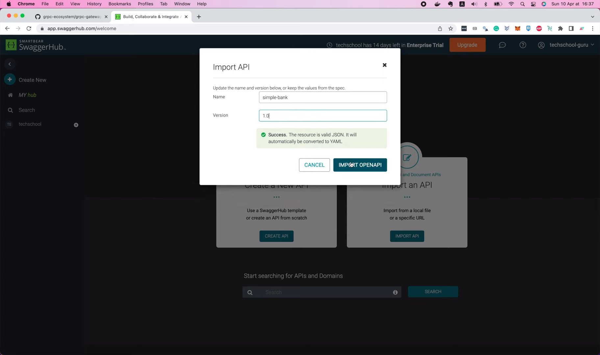
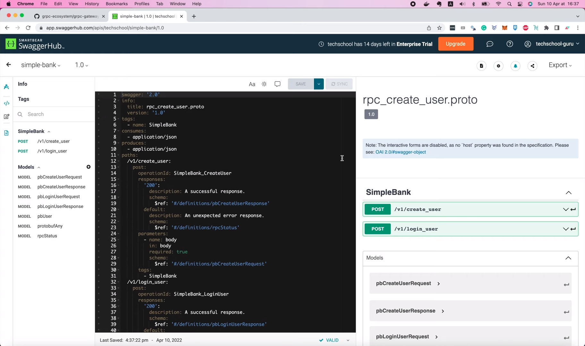
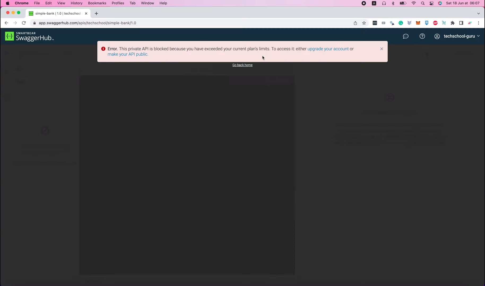
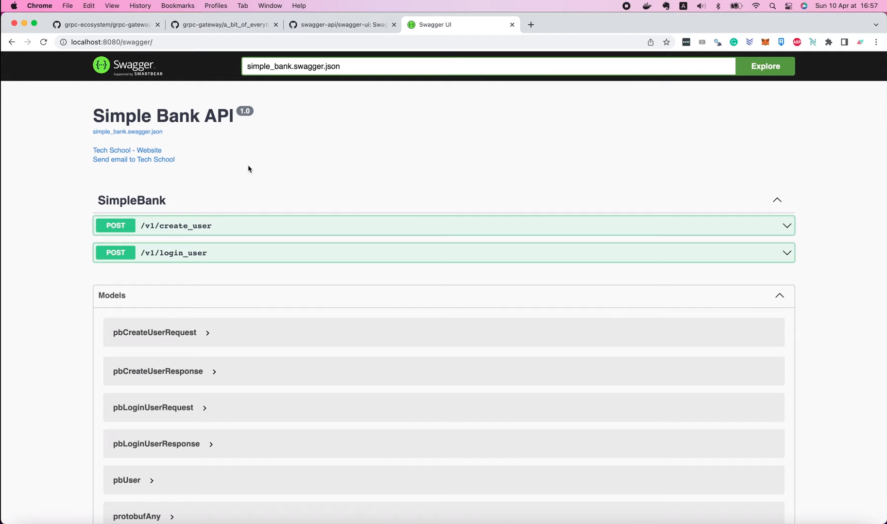

# Automatic generate & serve Swagger docs from Go server

Hello guys, welcome to the backend master class!

In this lecture, we will learn how to generate API documentation
for the gRPC gateway server that we've implemented before. It's 
actually pretty simple.

On the gRPC gateway documentation page, let's search for OpenAPI. OpenAPI
is a standard technical specification to describe a RESTful web service.

In this section, we will find the instructions to automatically 
generate OPenAPI docs using the same protobuf definitions we wrote
in previous lectures.


As we've already installed the `protoc-gen-openapiv2` in lecture 43, we
don't have to do it again and just go ahead to use it. If you're using
`buf`, you can update your `buf.gen.yaml` like in this example.

```yaml
version: v1
plugins:
  - name: go
    out: gen/go
    opt:
      - paths=source_relative
  - name: go-grpc
    out: gen/go
    opt:
      - paths=source_relative
  - name: grpc-gateway
    out: gen/go
    opt:
      - paths=source_relative
  - name: openapiv2
    out: gen/openapiv2
```

In our case, we don't use `buf`, but we're using `protoc` instead. So
here's how we're gonna update our `protoc` command.

```shell
protoc -I . --openapiv2_out ./gen/openapiv2 \
    --openapiv2_opt logtostderr=true \
    your/service/v1/your_service.proto
```

First, we have to add the `openapiv2_out` option to specify the output
folder of the docs. I'm gonna create a new folder called `swagger` inside
the `doc` folder, and pass in the path: `doc/swagger` here.

```makefile
proto:
	rm -f pb/*.go
	protoc --proto_path=proto --go_out=pb --go_opt=paths=source_relative \
        --go-grpc_out=pb --go-grpc_opt=paths=source_relative \
        --grpc-gateway_out=pb --grpc-gateway_opt=paths=source_relative \
        --openapiv2_out=doc/swagger \
        proto/*.proto
```
And that would be enough to generate the docs. Let's open the terminal
and run 

```shell
make proto
```

Alright, now if we look into the `swagger` folder, we will see that
several JSON files have been generated. Each file corresponds to 1 
proto file we wrote in the `proto` folder.

Although we can keep them as separate files like this, I think it's
more convenient to merge them all together into 1 single JSON file.
The reason is that it's much easier to upload to swagger hub later.

So how can we do that?

Well, first, I'm gonna add a command here to remove all existing
swagger JSON files before running `protoc` to regenerate.

```makefile
proto:
	rm -f pb/*.go
	rm -f doc/swagger/*.swagger.json
	protoc --proto_path=proto --go_out=pb --go_opt=paths=source_relative \
        --go-grpc_out=pb --go-grpc_opt=paths=source_relative \
        --grpc-gateway_out=pb --grpc-gateway_opt=paths=source_relative \
        --openapiv2_out=doc/swagger \
        proto/*.proto
```

Then, we can add an `openapiv2` option to the command to tell `protoc`
that we want to merge all JSON files together. To find out the name
of the option, we will run this help command in the terminal:

```shell
protoc-gen-openapiv2 --help
```

It is a bit long, so let's search for `merge`.

```shell
protoc-gen-openapiv2 --help
Usage of protoc-gen-openapiv2:
  -allow_delete_body
        unless set, HTTP DELETE methods may not have a body
  -allow_merge
        if set, generation one OpenAPI file out of multiple protos
```

Here it is, if this `allow_merge` option is set, the output will just be 1 
single OpenAPI JSON file. So let's go ahead and set this `allow_merge` to
true in our `protoc` command.

```makefile
proto:
	rm -f pb/*.go
	rm -f doc/swagger/*.swagger.json
	protoc --proto_path=proto --go_out=pb --go_opt=paths=source_relative \
        --go-grpc_out=pb --go-grpc_opt=paths=source_relative \
        --grpc-gateway_out=pb --grpc-gateway_opt=paths=source_relative \
        --openapiv2_out=doc/swagger --openapiv2_opt=allow_merge=true \
        proto/*.proto
```

Additionally, we can also set the name of the output file using this
`merge_file_name` option.

```shell
  -merge_file_name string
        target OpenAPI file name prefix after merge (default "apidocs")
```

So here I'm gonna put a comma to separate the 2 options, and set 
`merge_file_name` equals to `simple_bank`.

```makefile
proto:
	rm -f pb/*.go
	rm -f doc/swagger/*.swagger.json
	protoc --proto_path=proto --go_out=pb --go_opt=paths=source_relative \
        --go-grpc_out=pb --go-grpc_opt=paths=source_relative \
        --grpc-gateway_out=pb --grpc-gateway_opt=paths=source_relative \
        --openapiv2_out=doc/swagger --openapiv2_opt=allow_merge=true,merge_file_name=simple_bank \
        proto/*.proto
```

That's basically it!

Now let's run

```shell
make proto
```

again to regenerate the docs.

This time, if we look inside the `swagger` folder, we will find that there's
only 1 single file named `simple_bank.swagger.json`. This file contains all
the descriptions of our simple bank service's APIs. So now, if we want to
share it with the team or other front-end developers, we can upload it to 
Swagger Hub.

You can go to [swagger.io](https://swagger.io/) and create a free account.
Once you've logged in, you can easily import your API docs by clicking 
on this button `Import API`, then select the JSON file that `protoc` has 
just generated. And click `Upload File`.


Next, we have the option to set the name and version of the API. I'm gonna
call it `simple-bank`. And its version, let's say 1.0. Then click `Import 
OpenAPI`.



Then voila, the documentation is successfully imported.



We can see that right now it has 2 APIs to create and login users.

As the owner of the docs, you can use this page to update the documentation
whenever you want.

When you want to share it with other people, just click this `View 
Documentation` button, and it will bring you to the page for 
read-only access.


That's the page that you can share with you team members or other
front-end developers.

OK, so now you know how to generate and share your API documentation.

Next, I'm gonna show you how to update it with some custom annotations.

Before, you've seen that I have to enter the name and version of the 
docs manually. Can we somehow have it automatically generated? The answer
is yes!

As you can see here, the JSON file that we uploaded has been converted
into this YAML format and at the top, there's some info about the title and 
version of the API.


```yaml
swagger: '2.0'
info:
  title: rpc_create_user.proto
  version: '1.0'
tags:
  - name: SimpleBank
```

We can add some special annotations to our proto definition so that this 
info can be automatically generated by `protoc`. Let's go back to the
[grpc-gateway GitHub page](https://github.com/grpc-ecosystem/grpc-gateway), 
and open this [a_bit_of_everything.proto](https://github.com/grpc-ecosystem/grpc-gateway/blob/master/examples/internal/proto/examplepb/a_bit_of_everything.proto) 
file.

In this file, we will see an example of how to add the info section to the
top of the proto file as OpenAPI swagger option. There's a lot of info we
can add in this section, but I'm just gonna copy a small part of it for 
this demo.

Now let's go back to our code, and open the `service_simple_bank.proto` file.
I will paste it to the top, right here before the service `SimpleBank` 
statement. Alright, let's move this import up here,

```protobuf
import "google/api/annotations.proto";
import "rpc_create_user.proto";
import "rpc_login_user.proto";
import "protoc-gen-openapiv2/options/annotations.proto";
```

and add a curly bracket to close up this option.

```protobuf
option (grpc.gateway.protoc_gen_openapiv2.options.openapiv2_swagger) = {
  info: {
    title: "A Bit of Everything";
    version: "1.0";
    contact: {
      name: "gRPC-Gateway project";
      url: "https://github.com/grpc-ecosystem/grpc-gateway";
      email: "none@example.com";
    };
    license: {
      name: "BSD 3-Clause License";
      url: "https://github.com/grpc-ecosystem/grpc-gateway/blob/master/LICENSE.txt";
    };
    extensions: {
      key: "x-something-something";
      value {
        string_value: "yadda";
      }
    }
  };
}
```

OK, now we can change the title to "SimpleBank API", let's keep version 1.0
for now. I'm gonna change the contact name to `Tech School`, the URL will
be the GitHub page of Tech School, and the email will be 
`techscholl.guru@gmail.com`. I will remove the lisence and extensions 
because we don't need them at the moment. And finally, we have to add a 
semicolon at the end of the option.

```protobuf
option (grpc.gateway.protoc_gen_openapiv2.options.openapiv2_swagger) = {
  info: {
    title: "SimpleBank API";
    version: "1.0";
    contact: {
      name: "Tech School";
      url: "https://github.com/techschool";
      email: "techschool.guru@gmail.com";
    };
  };
};
```

Now you will see that the import annotations command is showing some
errors. That's because this proto file doesn't exist in our project. To
add it, we must go back to the [grpc-gateway GitHub page](https://github.com/grpc-ecosystem/grpc-gateway)
and look into this `protoc-gen-openapiv2`, then `options` folder. Here
we will see the `annotations.proto` file, and the `openapiv2.proto` file,
which should be copied over to our project. So, I'm gonna copy this
repo's clone URL, then open the terminal, and run this git command to
clone the repo to my local machine.

```shell
git clone git@github.com:grpc-ecosystem/grpc-gateway.git
```

Now, let's `cd` into the `grpc-gateway` project,

```shell
cd grpc-gateway
```

move into the `protoc-gen-openapiv2` folder,

```shell
cd protoc-gen-openapiv2
```

and final `cd` into the `options` folder.

```shell
cd options
```

Now before copying the proto files over, we will have to prepare the exact
same folder structure for our project.

So in the `simplebank` project, I'm gonna run `mkdir -p proto/` and paste
in the path to the `options` folder.

```shell
mkdir -p proto/protoc-gen-openapiv2/options
```

OK, now go back to the `grpc-gateway` project. Here we can see the list
of proto files we must copy.

```shell
ls -l
total 368
-rw-r--r-- 1 quangpham staff   1067 Apr 10 16:44 BUILD.bazel
-rw-r--r-- 1 quangpham staff  13802 Apr 10 16:44 annotations.pb.go
-rw-r--r-- 1 quangpham staff   1760 Apr 10 16:44 annotations.proto
-rw-r--r-- 1 quangpham staff    798 Apr 10 16:44 annotations.swagger.json
-rw-r--r-- 1 quangpham staff 124863 Apr 10 16:44 openapiv2.pb.go
-rw-r--r-- 1 quangpham staff  25439 Apr 10 16:44 openapiv2.proto
-rw-r--r-- 1 quangpham staff    796 Apr 10 16:44 openapiv2.swagger.json
```

Let's run 

```shell
cp *.proto
```

to copy all of the proto files to the `options` folder inside our `simplebank`
project.

```shell
cp *.proto ~/Projects/techschool/simplebank/proto/protoc-gen-openapiv2/options
```

And now, when we get back to Visual Studio Code, we will see that the 
error is gone. That's because the compiler has found the proto files
it needs in this `protoc-gen-openapiv2/options` folder. Excellent!

Now, let's run 

```shell
make proto 
```

in the terminal to regenerate the docs.

This time, in the `simple_bank.swagger.json` file, we can see that the info
section has all the information that we've specified in the `protobuf` 
definition.

```json
{
  "swagger": "2.0",
  "info": {
    "title": "SimpleBank API",
    "version": "1.0",
    "contact": {
      "name": "Tech School",
      "url": "https://github.com/techschool",
      "email": "techschool.guru@gmail.com"
    }
  }
}
```

Pretty awesome, isn't it?

Now to update the doc on Swagger Hub, we just need to copy the new content
of this file, then go back here,


delete all the old YAML, and paste in the new JSON. Swagger Hub will ask
if you want to convert your JSON to YAML or not. Let's click `OK` to
agree.


Then voilà, the documentation has been updated. I'm gonna click `Save` to
save it.


And then click this `View Documentation` button


to open the read-only version of the docs.


This time, we will see some metadata info at the top of the page, 
exactly as we specified in the `protobuf` definition.

Using Swagger Hub is very easy and convenient, we can create & update the 
documentation page with just a few clicks. However, it only offers you 14 days
trial period with full access, where you can create private API docs. After 
14 days, you will either have to pay or make your API public.



And besides, having to copy the JSON manually over like what we did is 
pretty annoying. So is there any better option? Can the documentation web 
page be updated automatically as well? Not just the JSON content? Well, yes!

Lucky for us, there's an existing project called [swagger-ui](https://github.com/swagger-api/swagger-ui).
It's a react-based web app that helps us create the same beautiful 
documentation page just like the one we see on Swagger Hub. But it's 
completely free, and all we need to do is to embed it in our backend web 
server. There are actually 3 options here, you can use the full `swagger-ui`
package for a traditional single-page app, or just use the `swagger-ui-dist`
for serving Swagger UI from server side, or you can also use the 
`swagger-ui-react` package if you want to embed it in your react front-end
web page.

In our case, we just want to serve Swagger UI from server side, so let's 
go with the second option: using the compiled `dist` package.

First, I'm gonna clone this repository to my local machine.

```shell
git clone git@github.com:swagger-api/swagger-ui.git
```

Then `cd` to the `swagger-ui` folder. If we look into the `dist` folder,
we will see that it has all the necessary components, such as the HTML,
CSS and Javascript codes for the documentation page. So I'm gonna copy
all of them to our project, and store them inside the `swagger` folder,
the same location as the generated JSON file.

```shell
cp -r dist/* ~/Projects/techschool/simplebank/doc/swagger
```

Alright, now let's go back to Visual Studio Code. We can see all the files
in this `swagger` folder. The most important one, that we need to pay
attention to, is the `swagger-initializer.js` file.

In this file, you will find a URL field that points to the `swagger.json`
file.

```js
window.onload = function() {
  //<editor-fold desc="Changeable Configuration Block">

  // the following lines will be replaced by docker/configurator, when it runs in a docker-container
  window.ui = SwaggerUIBundle({
    url: "https://petstore.swagger.io/v2/swagger.json",
    dom_id: '#swagger-ui',
    deepLinking: true,
    presets: [
      SwaggerUIBundle.presets.apis,
      SwaggerUIStandalonePreset
    ],
    plugins: [
      SwaggerUIBundle.plugins.DownloadUrl
    ],
    layout: "StandaloneLayout"
  });

  //</editor-fold>
};
```

As you might have guessed, we have to change this file to our own swagger
JSON file that `protoc` generated before.

```js
window.onload = function() {
  //<editor-fold desc="Changeable Configuration Block">

  // the following lines will be replaced by docker/configurator, when it runs in a docker-container
  window.ui = SwaggerUIBundle({
    url: "simple_bank.swagger.json",
    dom_id: '#swagger-ui',
    deepLinking: true,
    presets: [
      SwaggerUIBundle.presets.apis,
      SwaggerUIStandalonePreset
    ],
    plugins: [
      SwaggerUIBundle.plugins.DownloadUrl
    ],
    layout: "StandaloneLayout"
  });

  //</editor-fold>
};
```

OK, next step, we will have to update our server code a bit to serve this 
whole `swagger` folder as static resources.

So let's open the `main.go` file. We will add some more codes to the 
`runGatewayServer()` function here, after creating the HTTP `mux` and 
register the `grpcMux`. I'm gonna create a new file server by calling
`http.FileServer()` function and pass in an `http.Dir()` object,
because we want to serve the whole directory. The path to this directory
should be `./doc/swagger`. Now, we will create a new HTTP handler for
this file server. In this case, I want the documentation files to be
served under the route that starts with "swagger" prefix. But because of
this, I will have to strip the prefix of the URL to remove that "swagger"
prefix before passing the request to the static file server. Hence, you 
see this `http.StripPrefix()` function call here.

Alright, let's try to run the server in the terminal.

```shell
make server
```

And open the browser and go to [localhost:8080/swagger](http://localhost:8080/swagger).

Oops, we've got an error with a message: "Not Found". Let's go back to 
the code to see what's wrong.

Ah, OK, I know why! Do you? You can pause the video now to find it on
your own if you like. So, have you managed to spot my bug?

Actually, here, we have to register the new route with the mux we created
above instead of using the default HTTP `ServeMux`. So I'm gonna stop
the current server, and change this `http` to `mux`.

```go
mux.Handle("/swagger/", http.StripPrefix("/swagger/", fs))
```

Then save the file, and go back to the terminal to restart the server.

```shell
make server
```

This time, when we refresh the page, we will see a beautiful Swagger 
documentation page, just like what we've seen on Swagger Hub before.



But this time, it's completely free, since we're serving it ourselves, 
directly from our own backend Golang server. Pretty cool, isn't it?

And that wraps up today's lecture about Swagger documentation. I hope
you're learned something useful and interesting.

Thanks a lot for watching, happy learning, and see you in the next 
lecture!