# Автоматическая генерация и выдача Swagger документации с помощью Go сервера

[Оригинал](https://www.youtube.com/watch?v=Uwkxxee7tvk)

Привет, ребята, рад вас снова видеть на мастер-классе по бэкенду!

На этой лекции мы узнаем как создать API документацию для сервера 
gRPC шлюза, который мы реализовали ранее. Сделать это на самом деле 
довольно просто.

## Как автоматически сгенерировать OpenAPI документацию, используя protobuf определения

На странице документации [gRPC шлюза](https://github.com/grpc-ecosystem/grpc-gateway) 
давайте поищем по ключевому слову `OpenAPI`. OpenAPI — это стандартная 
техническая спецификация для описания RESTful веб-сервисов.

В этом разделе мы найдем инструкции для автоматического генерирования 
OpenAPI документов, используя те же определения protobuf, которые были 
написаны в предыдущих лекциях.

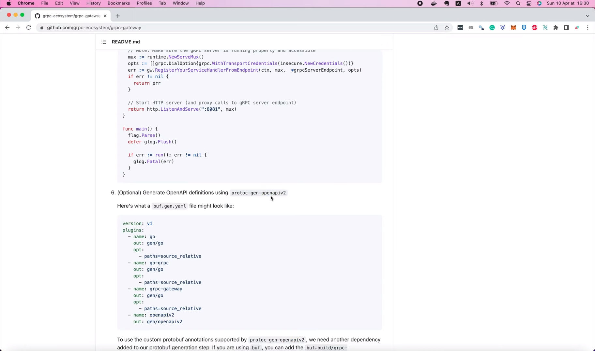

Поскольку мы уже установили `protoc-gen-openapiv2` в лекции 43, нам не нужно
снова это делать, и мы просто используем его. Если вы применяете `buf`, то 
можете обновить `buf.gen.yaml`, как в этом примере.

```yaml
version: v1
plugins:
  - name: go
    out: gen/go
    opt:
      - paths=source_relative
  - name: go-grpc
    out: gen/go
    opt:
      - paths=source_relative
  - name: grpc-gateway
    out: gen/go
    opt:
      - paths=source_relative
  - name: openapiv2
    out: gen/openapiv2
```

В нашем случае мы используем не `buf`, а `protoc`. Поэтому ниже показано 
как мы обновим нашу команду `protoc`.

```shell
protoc -I . --openapiv2_out ./gen/openapiv2 \
    --openapiv2_opt logtostderr=true \
    your/service/v1/your_service.proto
```

Во-первых, мы должны добавить ключ `openapiv2_out`, чтобы указать папку 
куда сгенерировать документацию. Я создам новую папку под названием
`swagger` внутри папки `doc` и здесь напишу `doc/swagger`.

```makefile
proto:
	rm -f pb/*.go
	protoc --proto_path=proto --go_out=pb --go_opt=paths=source_relative \
        --go-grpc_out=pb --go-grpc_opt=paths=source_relative \
        --grpc-gateway_out=pb --grpc-gateway_opt=paths=source_relative \
        --openapiv2_out=doc/swagger \
        proto/*.proto
```

И этого будет достаточно для генерации документации. Откроем терминал и 
выполним

```shell
make proto
```

Хорошо, теперь, если мы заглянем в папку `swagger`, то увидим, что было 
сгенерировано несколько JSON файлов. Каждый файл соответствует одному
`proto` файлу, созданному нами в папке `proto`.

Хотя мы можем оставить их как есть, в виде отдельных файлов, я думаю
что будет удобнее объединить их в один JSON файл. Причина в том, что
позднее будет гораздо проще загрузить его на Swagger Hub.

Итак, как мы можем это сделать?

## Объединяем несколько JSON файлов в один

Итак, во-первых, я собираюсь добавить сюда команду, чтобы удалить все 
существующие Swagger JSON файлы перед запуском `protoc` для регенерации.

```makefile
proto:
	rm -f pb/*.go
	rm -f doc/swagger/*.swagger.json
	protoc --proto_path=proto --go_out=pb --go_opt=paths=source_relative \
        --go-grpc_out=pb --go-grpc_opt=paths=source_relative \
        --grpc-gateway_out=pb --grpc-gateway_opt=paths=source_relative \
        --openapiv2_out=doc/swagger \
        proto/*.proto
```

Затем мы можем добавить к команде `openapiv2` ключ, чтобы сообщить
`protoc`, что мы хотим объединить все файлы JSON вместе. Чтобы узнать,
как называется этот ключ, мы запустим следующую команду для вызова 
справочной информации в терминале:

```shell
protoc-gen-openapiv2 --help
```

Она достаточно длинная, поэтому давайте поищем по ключевому слову
`merge`.

```shell
protoc-gen-openapiv2 --help
Usage of protoc-gen-openapiv2:
  -allow_delete_body
        unless set, HTTP DELETE methods may not have a body
  -allow_merge
        if set, generation one OpenAPI file out of multiple protos
```

Вот нужный нам ключ, если этот параметр `allow_merge` равен `true`, то на 
выходе мы получим единственный OpenAPI JSON файл. Итак, давайте зададим
для `allow_merge` значение `true` в нашей команде `protoc`.

```makefile
proto:
	rm -f pb/*.go
	rm -f doc/swagger/*.swagger.json
	protoc --proto_path=proto --go_out=pb --go_opt=paths=source_relative \
        --go-grpc_out=pb --go-grpc_opt=paths=source_relative \
        --grpc-gateway_out=pb --grpc-gateway_opt=paths=source_relative \
        --openapiv2_out=doc/swagger --openapiv2_opt=allow_merge=true \
        proto/*.proto
```

Кроме того, мы также можем задать название для результирующего файла, 
используя следующий ключ `merge_file_name`.

```shell
  -merge_file_name string
        target OpenAPI file name prefix after merge (default "apidocs")
```

Поэтому здесь я поставлю запятую, чтобы разделить два ключа и задам для
`merge_file_name` значение `simple_bank`.

```makefile
proto:
	rm -f pb/*.go
	rm -f doc/swagger/*.swagger.json
	protoc --proto_path=proto --go_out=pb --go_opt=paths=source_relative \
        --go-grpc_out=pb --go-grpc_opt=paths=source_relative \
        --grpc-gateway_out=pb --grpc-gateway_opt=paths=source_relative \
        --openapiv2_out=doc/swagger --openapiv2_opt=allow_merge=true,merge_file_name=simple_bank \
        proto/*.proto
```

На этом по сути всё!

Теперь давайте снова запустим

```shell
make proto
```

чтобы повторно сгенерировать документацию.

На этот раз, если мы заглянем в папку `swagger`, то увидим, что там 
находится единственный файл под названием `simple_bank.swagger.json`.
Этот файл содержит описания всех API нашего простого банковского сервиса.
Итак, теперь, если мы хотим поделиться им с командой или другими 
разработчиками интерфейса, мы можем загрузить его в Swagger Hub.

## Загружаем `swagger` JSON файл в Swagger Hub

Вы можете перейти по адресу [swagger.io](https://swagger.io/) и создать 
бесплатную учетную запись. После того как вы вошли в систему, вы можете 
легко импортировать API документацию, с помощью этой кнопки `Import API`,
выбрав JSON файл, который только что сгенерировал `protoc`, и нажав
`Upload File`.

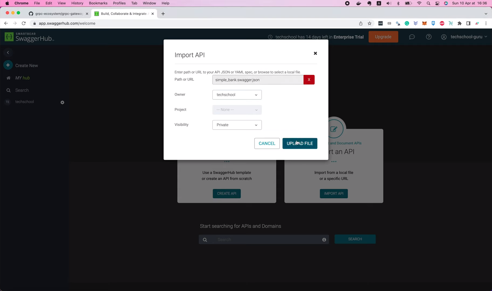

Далее у нас есть возможность задать название и версию API. Я назову его
`simple-bank`. И в качестве версии выберу `1.0`. Затем нажмите `Import
OpenAPI`.

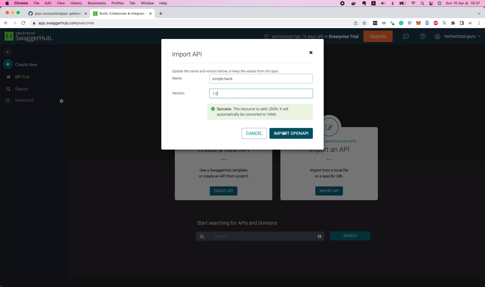

И, вуаля, документация успешно импортирована.

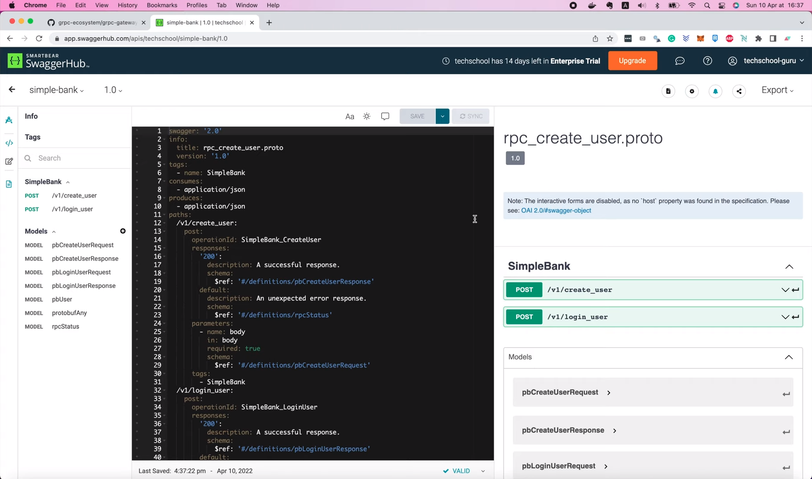

Мы видим, что прямо сейчас в ней есть 2 API для создания и входа 
пользователей в систему.

Как владельцы документации, вы можете обновить документацию в любое время,
используя эту страницу.

Если вы хотите поделиться ею с кем-то, просто нажмите на эту кнопку `View
Documentation` и вы попадете на страницу с доступом только для чтения.

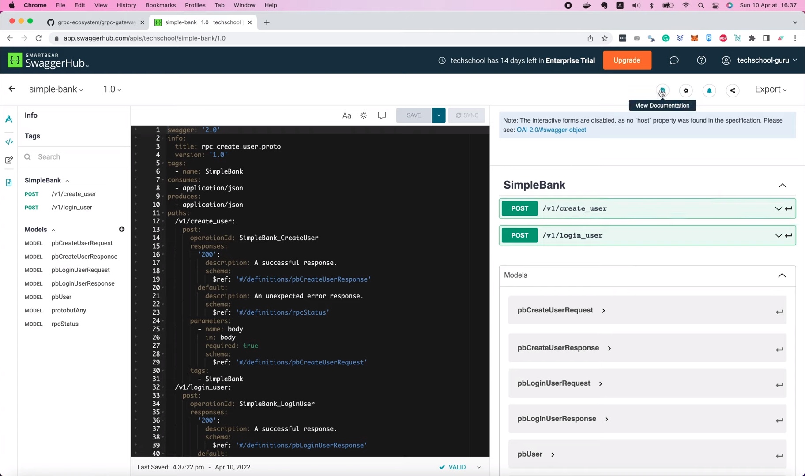

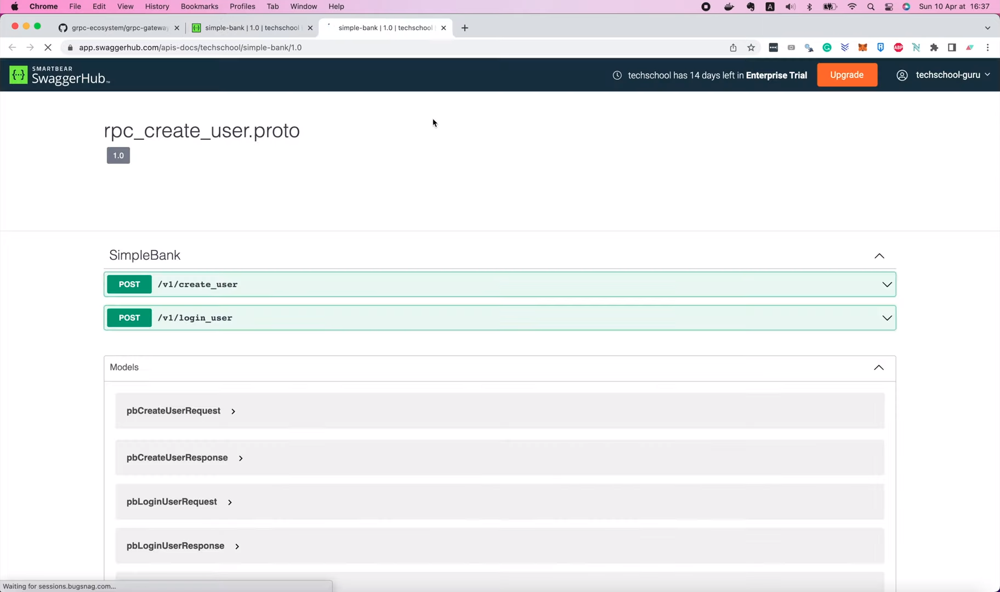

Это страница, которой вы можете поделиться с членами вашей команды или 
другими фронтенд разработчиками

Итак, теперь вы знаете, как сгенерировать и поделиться вашей документацией 
к API.

Далее я покажу вам, как обновить его с помощью некоторых 
пользовательских аннотаций.

Выше вы видели, что мне пришлось ввести название и версию документации
вручную. Можем ли мы каким-то образом сгенерировать его автоматически?
Ответ — да!

Как видно на рисунке ниже, JSON файл, который мы загрузили, был преобразован
в YAML формат, а в вверху приведена некая информация о названии и версии 
API.

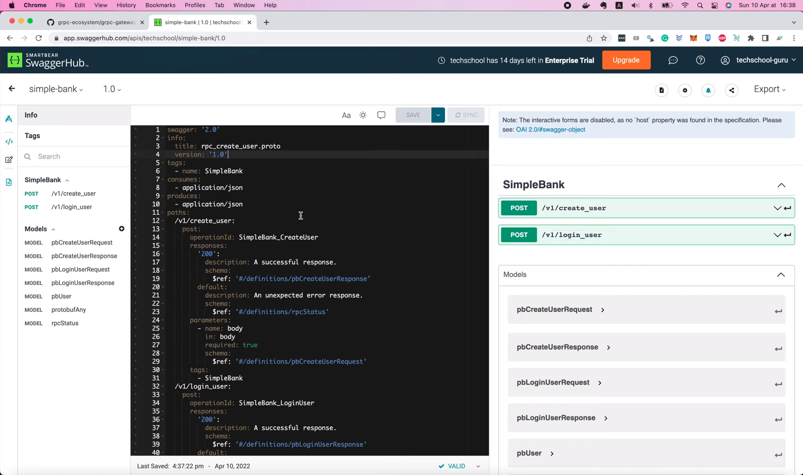

```yaml
swagger: '2.0'
info:
  title: rpc_create_user.proto
  version: '1.0'
tags:
  - name: SimpleBank
```

Мы можем добавить определённую специальную аннотацию к нашему `proto`
определению, чтобы эта информация могла автоматически генерироваться 
`protoc`. Вернемся на [страницу GitHub grpc-gateway](https://github.com/grpc-ecosystem/grpc-gateway)
и откроем этот файл [a_bit_of_everything.proto](https://github.com/grpc-ecosystem/grpc-gateway/blob/master/examples/internal/proto/examplepb/a_bit_of_everything.proto).

В этом файле мы увидим пример того, как добавить информационный раздел в 
верхнюю часть `proto` файла в качестве опции OpenAPI Swagger. В этот раздел
можно добавить много информации, но я просто скопирую небольшую часть для
демонстрационных целей.

Теперь давайте вернемся к нашему коду и откроем файл 
`service_simple_bank.proto`. Я вставлю фрагмент в начало файла, 
непосредственно перед определением сервиса `SimpleBank`. Итак, давайте 
переместим этот импорт сюда,

```protobuf
import "google/api/annotations.proto";
import "rpc_create_user.proto";
import "rpc_login_user.proto";
import "protoc-gen-openapiv2/options/annotations.proto";
```

и добавим фигурную скобку, чтобы закрыть эту опцию.

```protobuf
option (grpc.gateway.protoc_gen_openapiv2.options.openapiv2_swagger) = {
  info: {
    title: "A Bit of Everything";
    version: "1.0";
    contact: {
      name: "gRPC-Gateway project";
      url: "https://github.com/grpc-ecosystem/grpc-gateway";
      email: "none@example.com";
    };
    license: {
      name: "BSD 3-Clause License";
      url: "https://github.com/grpc-ecosystem/grpc-gateway/blob/master/LICENSE.txt";
    };
    extensions: {
      key: "x-something-something";
      value {
        string_value: "yadda";
      }
    }
  };
}
```

Итак, теперь мы можем изменить название на «SimpleBank API», давайте 
пока оставим версию 1.0. Я изменю контакт для связи на `Tech School`,
URL-адресом будет GitHub страница Tech School, а электронную почту поменяю
на `techscholl.guru@gmail.com`. Также удалим информацию о лицензии и 
расширениях, поскольку в данный момент она нам не нужна. И, наконец, мы 
должны добавить точку с запятой в конце опции.

```protobuf
option (grpc.gateway.protoc_gen_openapiv2.options.openapiv2_swagger) = {
  info: {
    title: "SimpleBank API";
    version: "1.0";
    contact: {
      name: "Tech School";
      url: "https://github.com/techschool";
      email: "techschool.guru@gmail.com";
    };
  };
};
```

После этого вы увидите, что команда импорта аннотаций приводит к некоторым
ошибкам. Они связаны с тем, что этого `proto` файла не существует в 
нашем проекте. Чтобы добавить его, мы должны вернуться на [страницу 
GitHub grpc-gateway](https://github.com/grpc-ecosystem/grpc-gateway)
и войти в эту папку `protoc-gen-openapiv2`, а затем в `options`. Здесь мы 
увидим файл `annotations.proto` и файл `openapiv2.proto`, которые нужно 
скопировать в наш проект. Итак, я собираюсь скопировать URL-адрес для
клонирования этого репозитория, затем открыть терминал и запустить следующую
Git команду, чтобы клонировать репозиторий на мою локальную машину.

```shell
git clone git@github.com:grpc-ecosystem/grpc-gateway.git
```

Теперь давайте перейдём в проект `grpc-gateway`

```shell
cd grpc-gateway
```

зайдём в папку `protoc-gen-openapiv2`,

```shell
cd protoc-gen-openapiv2
```

и, наконец, в папку `options`.

```shell
cd options
```

Теперь, прежде чем копировать `proto` файлы, нам нужно подготовить точно 
такую же структуру папок для нашего проекта.

Поэтому в проекте `simplebank`, я выполню команду `mkdir -p proto/`, дописав
к ней путь к папке `options`.

```shell
mkdir -p proto/protoc-gen-openapiv2/options
```

Итак, теперь вернитесь к проекту `grpc-gateway`. Здесь ниже показан 
список `proto` файлов, которые мы должны скопировать.

```shell
ls -l
total 368
-rw-r--r-- 1 quangpham staff   1067 Apr 10 16:44 BUILD.bazel
-rw-r--r-- 1 quangpham staff  13802 Apr 10 16:44 annotations.pb.go
-rw-r--r-- 1 quangpham staff   1760 Apr 10 16:44 annotations.proto
-rw-r--r-- 1 quangpham staff    798 Apr 10 16:44 annotations.swagger.json
-rw-r--r-- 1 quangpham staff 124863 Apr 10 16:44 openapiv2.pb.go
-rw-r--r-- 1 quangpham staff  25439 Apr 10 16:44 openapiv2.proto
-rw-r--r-- 1 quangpham staff    796 Apr 10 16:44 openapiv2.swagger.json
```

Давайте выполним 

```shell
cp *.proto
```

чтобы скопировать все `proto` файлы в папку `options` внутри нашего проекта
`simplebank`.

```shell
cp *.proto ~/Projects/techschool/simplebank/proto/protoc-gen-openapiv2/options
```

И теперь, когда мы вернёмся в Visual Studio Code, то увидим, что ошибка
пропала. Это означает, что компилятор нашел необходимые ему `proto` файлы в 
папке `protoc-gen-openapiv2/options`. Превосходно!

Теперь давайте выполним

```shell
make proto 
```

в терминале, чтобы повторно сгенерировать документацию.

На этот раз в файле `simple_bank.swagger.json` мы видим, что в информационном
разделе содержатся вся данные, которые мы указали в определении `protobuf`.

```json
{
  "swagger": "2.0",
  "info": {
    "title": "SimpleBank API",
    "version": "1.0",
    "contact": {
      "name": "Tech School",
      "url": "https://github.com/techschool",
      "email": "techschool.guru@gmail.com"
    }
  }
}
```

Довольно круто, не так ли?

Теперь, чтобы обновить документацию на Swagger Hub, нам просто нужно
скопировать новое содержимое этого файла, а затем вернуться сюда,

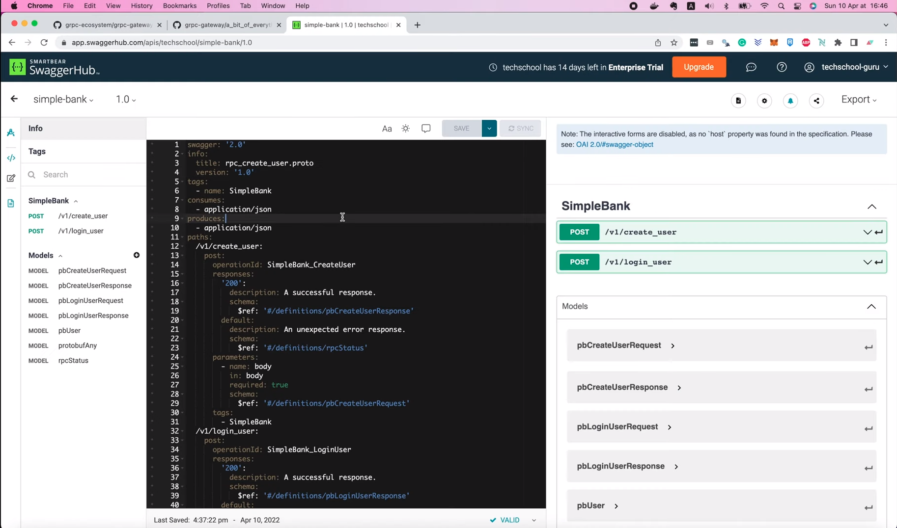

удалить устаревший YAML файл и вставить новый JSON. Swagger Hub спросит, 
хотите ли вы конвертировать JSON в YAML или нет. Нажимаем «ОК», чтобы 
согласиться.

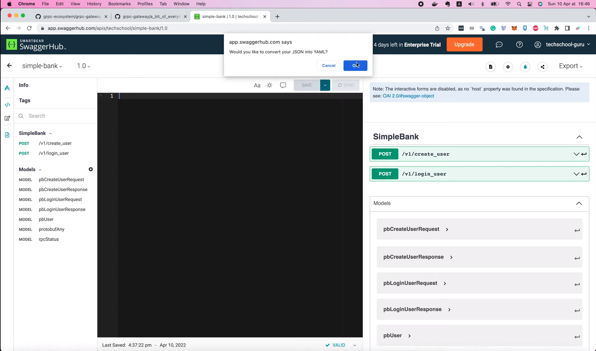

Вуаля и документация обновлена. Я нажму `Save`, чтобы сохранить её. 

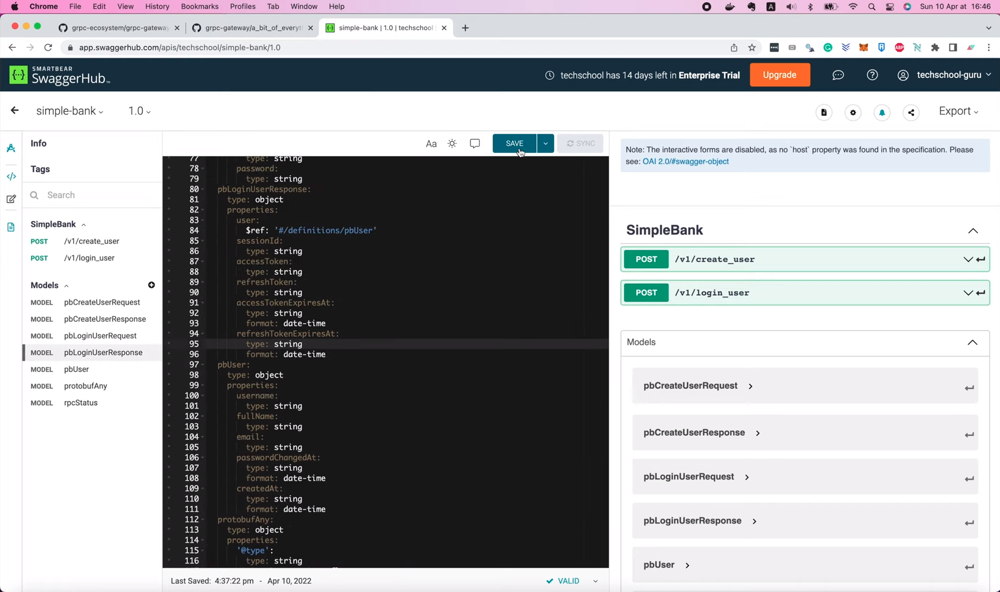

А затем щелкните по этой кнопке `View Documentation`

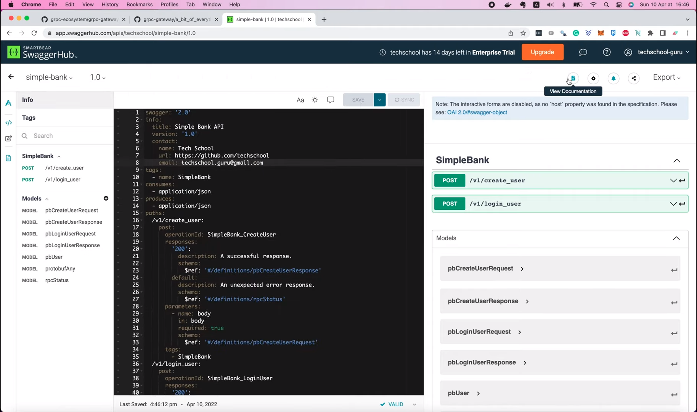

чтобы открыть версию документации только для чтения.

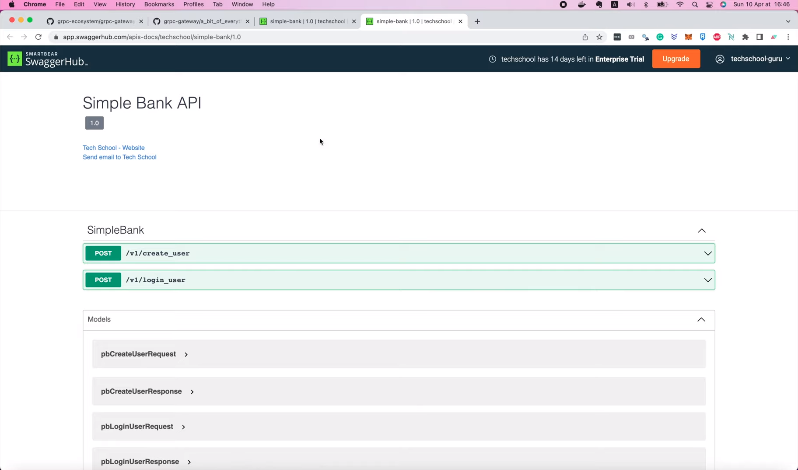

На этот раз мы увидим некоторую информацию о метаданных в верхней части 
страницы, именно ту, которую указали в определении `protobuf`.

Использовать Swagger Hub очень просто и удобно, мы можем создать и обновить 
страницу документации с помощью нескольких щелчков мышкой. Однако он 
предлагает вам только 14-дневный пробный период с полным функционалом, когда 
вы можете создавать API документацию с ограниченным доступом. По истечении 
14 дневного периода вам придется либо заплатить, либо сделать свой API 
общедоступным.

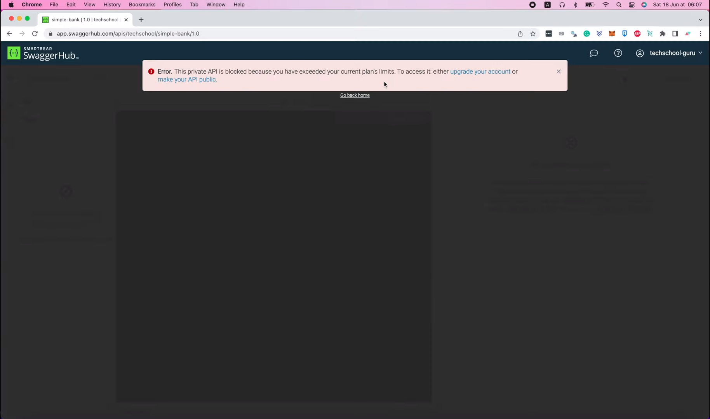

Кроме того, необходимость каждый раз копировать JSON вручную, как мы это 
делали, раздражает. Существует ли альтернатива? Можем ли мы также автоматически
обновлять веб-страницу документации? А не только содержимое JSON? На самом
деле — да!

## Бесплатное веб-приложение на основе React, которое может создавать страницы документации

К счастью уже существует проект под названием [swagger-ui](https://github.com/swagger-api/swagger-ui).
Это веб-приложение на основе React, помогающее нам создать такую же
красивую страницу документации, как ту, которую мы видим на Swagger Hub.
Но оно совершенно бесплатно, и все, что нам нужно сделать, это встроить его 
в наш внутренний веб-сервер. На самом деле существует три варианта: вы можете 
использовать полный пакет `swagger-ui` для традиционного одностраничного 
приложения, или просто использовать `swagger-ui-dist` для формирования и 
выдачи пользовательского интерфейса Swagger сервером или использовать 
пакет `swagger-ui-react`, если вы хотите встроить его на свою React 
веб-страницу.

В нашем случае мы просто хотим, чтобы сервер формировал и выдавал 
пользовательский интерфейс Swagger, поэтому давайте выберем второй 
вариант: использовать скомпилированный пакет `dist`. 

Во-первых, я собираюсь клонировать этот репозиторий на свою локальную машину.

```shell
git clone git@github.com:swagger-api/swagger-ui.git
```

Затем перейдите в папку `swagger-ui`. Если мы заглянем в папку `dist`, то 
увидим, что в ней есть все необходимые компоненты, такие как HTML, CSS и 
Javascript код для страницы документации. Поэтому я скопирую их в наш проект 
и сохраню в папке `swagger`, туда же, где находится сгенерированный JSON 
файл.

```shell
cp -r dist/* ~/Projects/techschool/simplebank/doc/swagger
```

Хорошо, теперь вернемся в Visual Studio Code. Мы видим, появились новые файлы 
в этой папке `swagger`. Самый важный, на который нам нужно обратить 
внимание, это файл `swagger-initializer.js`.

В этом файле вы найдете URL поле, которое указывает на файл `swagger.json`.

```js
window.onload = function() {
  //<editor-fold desc="Changeable Configuration Block">

  // the following lines will be replaced by docker/configurator, when it runs in a docker-container
  window.ui = SwaggerUIBundle({
    url: "https://petstore.swagger.io/v2/swagger.json",
    dom_id: '#swagger-ui',
    deepLinking: true,
    presets: [
      SwaggerUIBundle.presets.apis,
      SwaggerUIStandalonePreset
    ],
    plugins: [
      SwaggerUIBundle.plugins.DownloadUrl
    ],
    layout: "StandaloneLayout"
  });

  //</editor-fold>
};
```

Как вы могли догадаться, мы должны изменить этот файл на наш собственный
Swagger JSON-файл, который ранее был сгенерирован `protoc`.

```js
window.onload = function() {
  //<editor-fold desc="Changeable Configuration Block">

  // the following lines will be replaced by docker/configurator, when it runs in a docker-container
  window.ui = SwaggerUIBundle({
    url: "simple_bank.swagger.json",
    dom_id: '#swagger-ui',
    deepLinking: true,
    presets: [
      SwaggerUIBundle.presets.apis,
      SwaggerUIStandalonePreset
    ],
    plugins: [
      SwaggerUIBundle.plugins.DownloadUrl
    ],
    layout: "StandaloneLayout"
  });

  //</editor-fold>
};
```

Теперь следующий шаг, нам нужно будет немного обновить код нашего 
сервера, чтобы вся эта папка `swagger` отдавалась как статический ресурс.

Итак, давайте откроем файл `main.go`. Мы добавим новый код в функцию 
`runGatewayServer()` сразу после создания HTTP-мультиплексора и регистрации
`grpcMux`. Я создам новый файловый сервер, вызвав функцию `http.FileServer()`
и передав объект `http.Dir()`, потому что мы хотим отдавать весь каталог.
Путь к этому каталогу должен быть равен `./doc/swagger`. Теперь мы создадим 
новый HTTP обработчик для этого файлового сервера. В этом случае я хочу, чтобы
файлы документации отдавались по пути, который начинается с префикса
"swagger". Но из-за этого мне придется обрезать префикс URL-адреса,
чтобы удалить этот префикс "swagger", прежде чем передавать запрос на 
статический файловый сервер. Поэтому тут используется вызов функции
`http.StripPrefix()`.

Итак, попробуем запустить сервер в терминале.

```shell
make server
```

И откроем браузер и перейдём на страницу [localhost:8080/swagger](http://localhost:8080/swagger).

К сожалению, у нас возникла ошибка с сообщением: "Not Found" («Страница не 
найдена»). Вернемся к коду, чтобы увидеть, что не так.

А, кажется, я нашёл причину! А Вы? Вы можете приостановить видео, чтобы
попытаться найти её самостоятельно, если хотите. Итак, вам удалось обнаружить
мою ошибку?

На самом деле, здесь мы должны зарегистрировать новый маршрут с 
мультиплексором, который мы создали выше, вместо использования HTTP 
`ServeMux` по умолчанию. Поэтому я остановлю текущий сервер и изменю тут
`http` на `mux`.

```go
mux.Handle("/swagger/", http.StripPrefix("/swagger/", fs))
```

Затем сохраните файл и вернитесь в терминал, чтобы перезапустить сервер.

```shell
make server
```

На этот раз, когда мы обновим страницу, мы увидим красивую страницу 
документации Swagger, точно такую же, какую мы видели на Swagger Hub 
раньше.

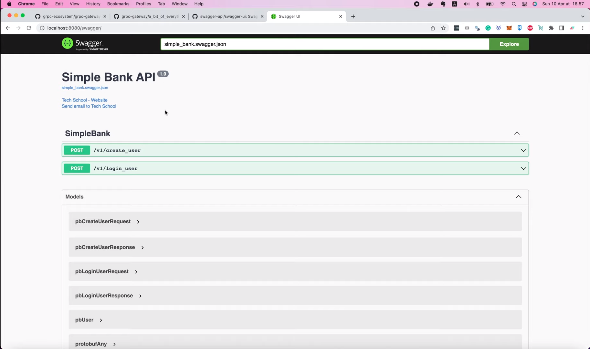

Но на этот раз она доступна совершенно бесплатно, так как мы отдаём её сами,
непосредственно с нашего внутреннего Golang сервера. Довольно круто, не 
правда ли?

И на этом мы завершаем сегодняшнюю лекцию о Swagger документации. Я надеюсь,
что вы узнали из неё что-то полезное и интересное для себя.

Большое спасибо за время, потраченное на чтение, желаю Вам получать
удовольствие от обучения и до встречи на следующей лекции!