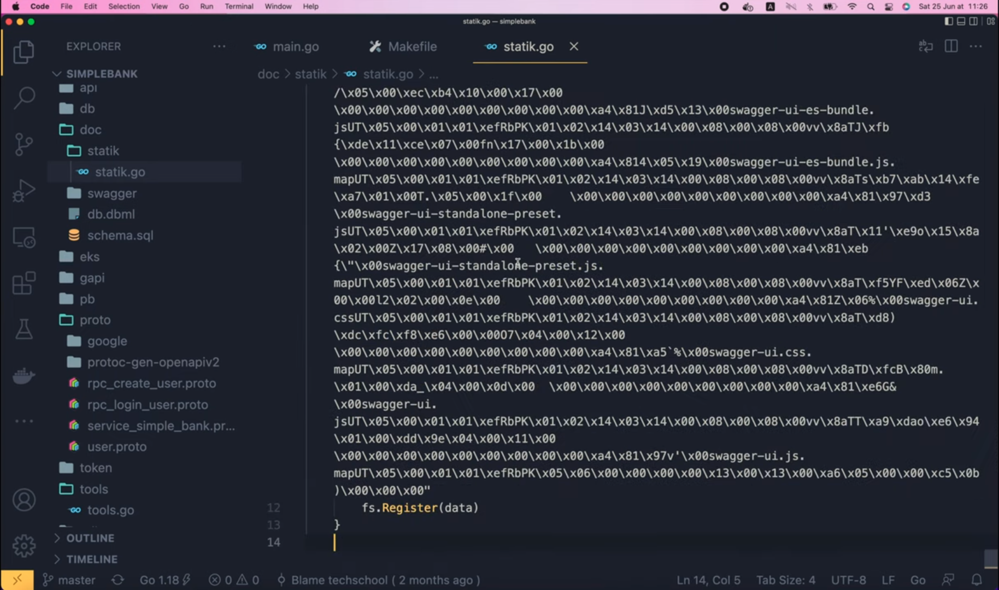
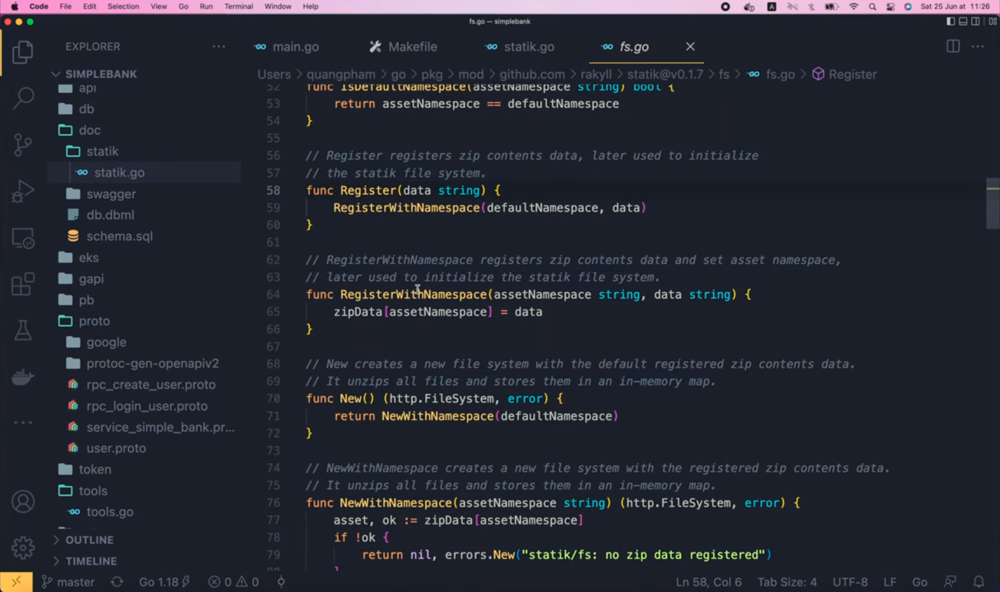
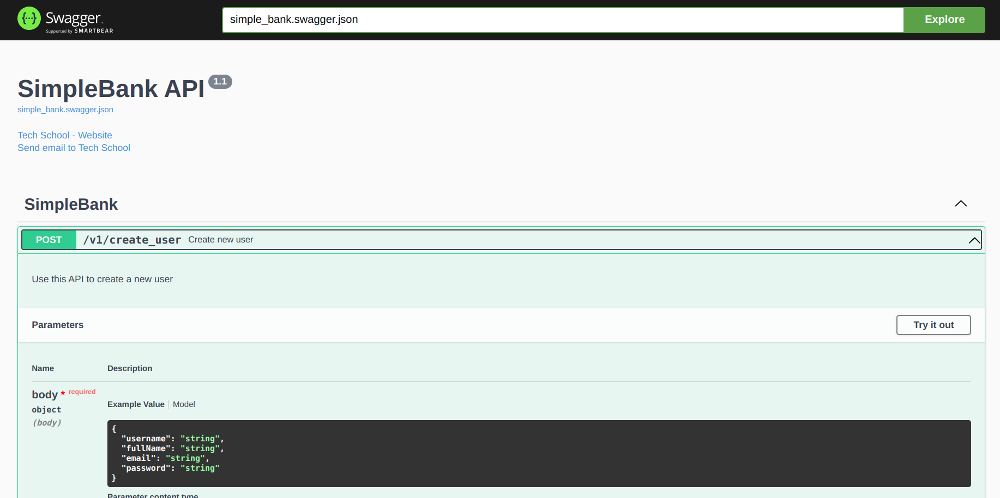

# Embed static frontend files inside Golang backend server's binary

[Original video](https://www.youtube.com/watch?v=xNgOIm86N5Q)

Hello guys, welcome back to the backend master class!

In the [previous lecture](part45-eng.md), we're learned how to generate 
Swagger documentation and serve it directly from our Golang backend web 
server. However, for now, we're serving the whole `swagger` folder with all the 
static files inside it. This is not a problem, but we will have to change
the Dockerfile, copy all those static files into the final Docker image for
deployment. It's a bit annoying for me because our backend image will end
up containing too many frontend files while it just has 1 single binary
file of the backend server.

## Include all static frontend files into the binary backend server

> One of the most anticipated features of Go 1.16 is the support for embedding 
> files and folders into the application binary at compile-time without using 
> an external tool. This feature is also known as `go:embed`, and it gets its 
> name from the compiler directive that makes this functionality 
> possible: `//go:embed`. So you can [use this directive](https://blog.carlmjohnson.net/post/2021/how-to-use-go-embed/)
> instead of method described in lecture.

Now, what if I tell you we can include all static frontend files into the
same binary backend server as well? Yes, we can do it using a special tool
called `statik`. `statik` allows you to embed a directory of static files
into your Go executable binary to be later served from an HTTP file 
server. In fact, this is a very good idea, especially when we just want to
serve our frontend code, which was developed by a Javascript framework 
like React or Vue, because it just makes deploying the frontend page much
simpler. Everything will be included in just 1 single binary file, so we
don't even have to change our Dockerfile. And besides, since all static files
are included in the backend binary, they will all be loaded into the memory
of the server, which, has a special effect, that makes serving those static
files much faster than having to read them from disk. OK, that sounds pretty
awesome, but how to do it? Well, first, we have to install the `statik` 
command line tool. I'm gonna copy this package URL, and paste it to the 
import lists inside the `tools.go` file of our project.

```go
import (
	_ "github.com/grpc-ecosystem/grpc-gateway/v2/protoc-gen-grpc-gateway"
	_ "github.com/grpc-ecosystem/grpc-gateway/v2/protoc-gen-openapiv2"
	_ "github.com/rakyll/statik"
	_ "google.golang.org/grpc/cmd/protoc-gen-go-grpc"
	_ "google.golang.org/protobuf/cmd/protoc-gen-go"
)
```

Then let's open the terminal and run `go mod tidy`. `go mod` will help us
select the latest version of the tool, and download it to our local 
machine.

OK, now let's run `go install` to install `statik` command line tool.

```shell
go install github.com/rakyll/statik
```

We can verify if it's installed successfully by running 

```shell
statik -help
```

There are several options we can use to customize the input and output
of the static files. The 2 most important options are the source directory
of the asset, and the destination directory of the generated Go package. 
You can also specify the namespace where the assets will be loaded. It's
simply a key that uniquely identifies the static asset. You will need to 
use it if you want to serve multiple assets on the same server. For 
example, you can use one namespace for the Swagger doc, and another 
namespace for the frontend page. If you don't specify a namespace, the
asset will be registered in the default one. Alright, now I'm gonna update
the `make proto` command to generate static binary package every time
we regenerate the Swagger documentation. It's simply `statik` followed by
the source directory, which, in our case, is `./doc/swagger`. Then the
destination output folder is `./doc`. I'm not gonna specify the namespace
because we just have 1 static folder to serve at the moment.

```makefile
proto:
	rm -f pb/*.go
	rm -f doc/swagger/*.swagger.json
	protoc --proto_path=proto --go_out=pb --go_opt=paths=source_relative \
        --go-grpc_out=pb --go-grpc_opt=paths=source_relative \
        --grpc-gateway_out=pb --grpc-gateway_opt=paths=source_relative \
        --openapiv2_out=doc/swagger --openapiv2_opt=allow_merge=true,merge_file_name=simple_bank \
        proto/*.proto
	statik -src=./doc/swagger -dest=./doc
```

So let's run

```shell
make proto
```

in the terminal.

OK, the command runs successfully. So now, if we go back to Visual Studio
Code, and look into the `doc` folder, we will see that a new folder called
"statik" has been generated. And inside this folder, there's a `statik.go`
file. You can open this file to see its content, but I'm pretty sure you
can't understand most of the codes in this file, unless you're a robot :D,
because 99% content of this file is binary code, which is the result of
compilling all the static files inside the `swagger` folder. Of course,
these's still 1% you can understand here: which is, the binary code 
is written inside the `init()` function. It's a special function in Go,
that would get executed automatically whenever its package is imported. 
And if you scroll all the way down, you will see that it simply calls a
function to register the binary data. If you press Command (Ctrl) and click
on this `Register` function,



it will bring you to the underlying codes of the `statik` library. Here 
you can see that it simply registers the data under the default namespace.



And in the `RegisterWithNamespace()` function, which takes a namespace and
data as input, it just stores the input data in the `zipData` map, with
the key being the namespace.

Later, when we want to load the data, we will have to call this `New()`
function, which, in fact, will load the data from the default namespace.
As you can see here, it just makes a call to the `NewWithNamespace()`
function. Note that, if you generate binary codes to a custom namespace,
you will have to call this function directly with your own namespace. You
can easily see that it simply takes the binary data from the `zipData` map,
and then builds an HTTP file system object for us to serve the assets.

Alright, now it's time to get back to our code and learn how to use it.

In the `runGatewayServer()` function, here, instead of creating a file 
server to serve the `swagger` folder, we will create a static file server
by calling `fs.New()`. This `fs` package is a subpackage of `statik` and
the `New()` function is the one we've just seen a moment ago, which
loads data from the default namespace. If you use a custom namespace, you
should call the `NewWithNamespace()` function instead of `New()`. This 
function will return a file system object and an error. If error is not 
`nil`, we write a fatal log saying "cannot create statik file system". 
Otherwise, all the static assets have been loaded into `statikFS` variable.
So all we have to do is to serve them.

```go
statikFS, err := fs.New()
if err != nil {
    log.Fatal("cannot create statik fs")
}
```

Now, to make the code cleaner and easier to read, I'm gonna move this
`http.StripPrefix()` function call up here and store its output in a 
new variable called `swaggerHandler`. And here, instead of passing in
the old `fs`, we will create a new one with `http.FileServer()`, and pass
in the `statikFS` file system object that we've loaded above.

```go
swaggerHandler := http.StripPrefix("/swagger/", http.FileServer(statikFS))
```

Finally, the `swaggerHandler` will be used to register the route. And 
that's basically it! Pretty simple, right?

Now, let's start the server and test it out!

```shell
make server
go run main.go
2022/04/10 17:04:50 cannot create statik fs
exit status 1
make: *** [server] Error 1
```

Oops, we've got an error: "cannot create statik fs". But we don't know the
reason why. So let's get back to the code, and add the original error to
the end of this message.

```go
if err != nil {
    log.Fatal("cannot create statik fs:", err)
}
```

Now if we run the server again, we will see the real error, which is: "no 
zip data registered".

```shell
make server
go run main.go
2022/04/10 17:04:50 cannot create statik fs:statik/fs: no zip data registered
exit status 1
make: *** [server] Error 1
```

Can you guess why we get this error? Well, that's because I forgot to
import the generated `statik` package, so the `init()` function doesn't 
get called, thus there's no data registered in the `zipData` map. That's
why we can't load it. In order to fix this, we have to add a blank
import at the top of the `main.go` file as it's a subpackage of our 
`backendBankExample` package. I'm gonna copy the full simple bank package 
name, paste it here, in the import list, and add "/doc/statik" suffix at 
the end.

```go
"github.com/MaksimDzhangirov/backendBankExample/api"
db "github.com/MaksimDzhangirov/backendBankExample/db/sqlc"
_ "github.com/MaksimDzhangirov/backendBankExample/doc/statik"
```

This will point to the `statik` package inside the `doc` folder, which
has been generated for us before. OK, now let's save the file, then go 
back to the terminal and restart the server.

Now if we open the browser and refresh the Swagger page, it will work
just like before. But this time, the page is served directly from the
server's memory instead of the hard drive. And as a bonus of that, the
page will load much faster compared to before.

Alright, before we finish, I'm gonna show you how to update the 
documentation page to include some more useful information for the
reader. I want to add a summary and description to each of the APIs
to describe what it will be used for.

So, if you open the [a_bit_of_everything.proto](https://github.com/grpc-ecosystem/grpc-gateway/blob/master/examples/internal/proto/examplepb/a_bit_of_everything.proto)
file, and search for "summary", you will find this option inside one of
the sample APIs, where we can provide some custom summary and description,
and even add some more details about the response status code and schema.

```protobuf
option (grpc.gateway.protoc_gen_openapiv2.options.openapiv2_operation) = {
  description: "Description Echo";
  summary: "Summary: Echo rpc";
  tags: "echo rpc";
  external_docs: {
    url: "https://github.com/grpc-ecosystem/grpc-gateway";
    description: "Find out more Echo";
  }
  responses: {
    key: "200"
    value: {
      examples: {
        key: "application/json"
        value: "{\"value\": \"the input value\"}"
      }
    }
  }
  responses: {
    key: "503";
    value: {
      description: "Returned when the resource is temporarily unavailable.";
      extensions: {
        key: "x-number";
        value {
          number_value: 100;
        }
      }
    }
  }
  responses: {
    // Overwrites global definition.
    key: "404";
    value: {
      description: "Returned when the resource does not exist.";
      schema: {
        json_schema: {
          type: INTEGER;
        }
      }
    }
  }
};
```

For this demo, I'm just gonna add the summary and description, so let's
copy them. And open the `service_simple_bank.proto` file in our project.
I'm gonna paste it to the `CreateUser` RPC. Then, let's change the 
description to "Use this API to create a new user" and the summary to 
"Create new user".

```protobuf
rpc CreateUser(CreateUserRequest) returns (CreateUserResponse) {
  option (google.api.http) = {
    post: "/v1/create_user"
    body: "*"
  };
  option (grpc.gateway.protoc_gen_openapiv2.options.openapiv2_operation) = {
    description: "Use this API to create a new user";
    summary: "Create new user";
  };
}
```

Similarly, let's copy this option to the `LoginUser` RPC as well. Then
change the description to "Use this API to login user and get access
token & refresh token" and change its summary to "Login user".

```protobuf
rpc LoginUser(LoginUserRequest) returns (LoginUserResponse) {
  option (google.api.http) = {
    post: "/v1/login_user"
    body: "*"
  };
  option (grpc.gateway.protoc_gen_openapiv2.options.openapiv2_operation) = {
    description: "Use this API to login user and get access token & refresh token";
    summary: "Login user";
  };
}
```

OK, now before regenerating the code, let's say I want to bump our API 
version to 1.1,

```protobuf
option (grpc.gateway.protoc_gen_openapiv2.options.openapiv2_swagger) = {
  info: {
    title: "SimpleBank API";
    version: "1.1";
    contact: {
      name: "Tech School";
      url: "https://github.com/techschool";
      email: "techschool.guru@gmail.com";
    };
  };
};
```

then save it, go back to the terminal, and run 

```shell
make proto
rm -f pb/*.go
rm -f doc/swagger/*.swagger.json
protoc --proto_path=proto --go_out=pb --go_opt=paths=source_relative \
        --go-grpc_out=pb --go-grpc_opt=paths=source_relative \
        --grpc-gateway_out=pb --grpc-gateway_opt=paths=source_relative \
        --openapiv2_out=doc/swagger --openapiv2_opt=allow_merge=true,merge_file_name=simple_bank \
        proto/*.proto
statik -src=./doc/swagger -dest=./doc
```

to regenerate the documentation page.

Now let's start the server.

```shell
make server
```

This time, if we refresh the browser, we will see that the summary and
description have been added to each of the APIs on the documentation
page. And its version has changed to 1.1 as well.



Pretty awesome, isn't it?

And that brings us to the end of this lecture. We've learned an amazing 
way to include all the static frontend files into 1 single binary
executable file of the backend server.

This way, your frontend page can be easily deployed to production, no
matter if it is written in React, Vue, or any other frameworks.

I hope the video is interesting and useful for you. Thanks a lot for
watching, happy learning, and see you in the next lecture!