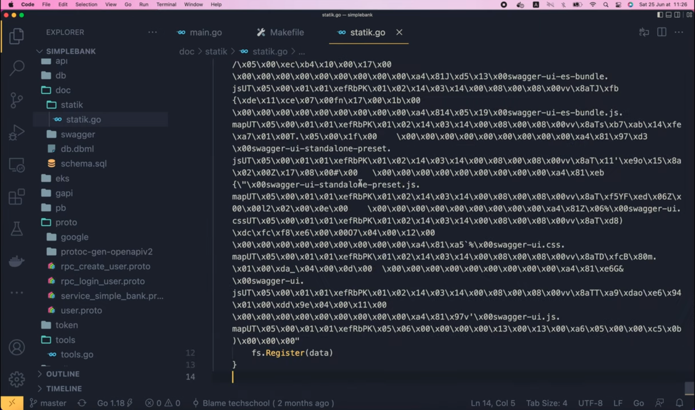
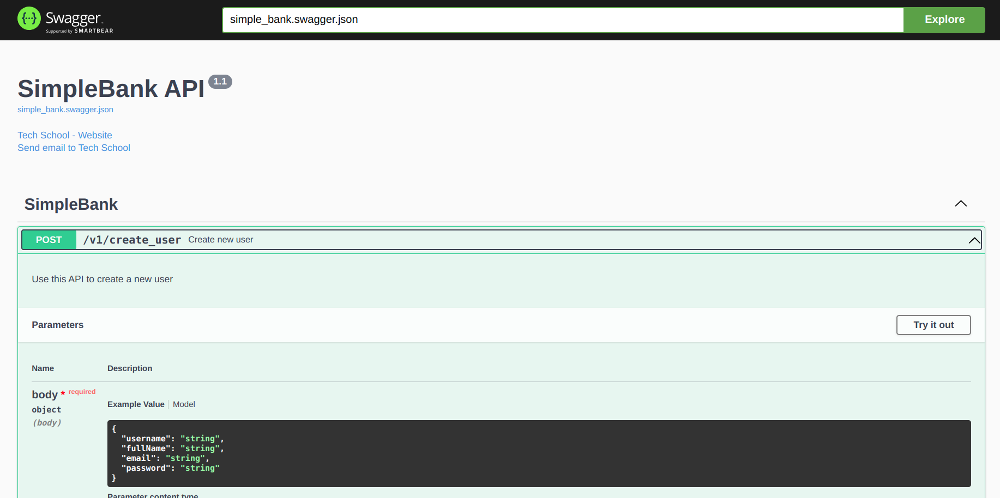

# Встраиваем статические фронтенд файлы в двоичный файл Golang сервера

[Оригинал](https://www.youtube.com/watch?v=xNgOIm86N5Q)

Привет, ребята, рад вас снова видеть на мастер-классе по бэкенду!

На [предыдущей лекции](part45-eng.md) мы узнали как сгенерировать Swagger
документацию и отдавать её непосредственно с нашего Golang веб-сервера.
Однако на данный момент мы отдаём всю папку `swagger` со всеми статическими 
файлами внутри неё. Это не проблема, но нам придется изменить Dockerfile, 
скопировав все эти статические файлы в окончательный образ Docker для 
развертывания. Это немного раздражает, поскольку наш образ для бекэнда в 
конечном итоге будет содержать слишком много фронтэнд файлов, в то же
время храня только один двоичный файл сервера.

## Добавляем все статические фронтэнд файлы в двоичный файл сервера

> Одной из наиболее ожидаемых функций Go 1.16 является поддержка 
> встраивания файлов и папок в двоичный файл приложения во время компиляции 
> без использования внешних инструментариев. Эта функция также известна 
> как `go:embed`, и она получила свое название от директивы компилятора, 
> которая делает возможным этот функционал: `//go:embed`. Таким образом, 
> вы можете [использовать эту директиву](https://blog.carlmjohnson.net/post/2021/how-to-use-go-embed/)
> вместо метода, описанного в лекции.

А что, если я скажу вам, что мы можем добавить все статические фронтэнд 
файлы в двоичный файл сервера? Мы можем сделать это с помощью специального 
инструмента под названием `statik`. `statik` позволяет вам встроить каталог 
статических файлов в ваш исполняемый двоичный файл Go, чтобы позже отдавать
его с файлового HTTP сервера. На самом деле, это очень хорошая идея, 
особенно когда мы просто хотим отдавать наш фронтэнд код, созданный с 
помощью Javascript фреймворка, такого как React или Vue, поскольку это
сильно упрощает развертывание фронтэнд страниц. Всё будет включено всего 
в один двоичный файл, поэтому нам даже не придется менять наш Dockerfile.
И кроме того, поскольку все статические файлы включены в двоичный файл,
все они будут загружены в память сервера. Это приводят к особому эффекту,
а именно отдача этих статических файлов происходит намного быстрее, чем
их чтение с диска. Хорошо, звучит довольно круто, но как это сделать?
Ну, во-первых, мы должны установить инструмент командной строки `statik`.
Я скопирую этот URL-адрес пакета (`github.com/rakyll/statik`) и вставлю 
его в список импорта внутри файла `tools.go` нашего проекта.

```go
import (
	_ "github.com/grpc-ecosystem/grpc-gateway/v2/protoc-gen-grpc-gateway"
	_ "github.com/grpc-ecosystem/grpc-gateway/v2/protoc-gen-openapiv2"
	_ "github.com/rakyll/statik"
	_ "google.golang.org/grpc/cmd/protoc-gen-go-grpc"
	_ "google.golang.org/protobuf/cmd/protoc-gen-go"
)
```

Затем давайте откроем терминал и выполним `go mod tidy`. `go mod` поможет 
нам выбрать последнюю версию инструмента и загрузить ее на наш локальный 
компьютер.

Хорошо, теперь давайте запустим `go install`, чтобы установить инструмент 
командной строки `statik`.

```shell
go install github.com/rakyll/statik
```

Мы можем проверить, успешно ли он установлен, запустив

```shell
statik -help
```

Существует несколько параметров, которые мы можем использовать для 
настройки статических файлов. Двумя наиболее важными являются исходный 
каталог с файлами и каталог, куда будет сгенерирован Go пакет. Вы также 
можете указать пространство имен, в которое будут загружены файлы. Это 
просто ключ, который однозначно идентифицирует статический ресурс. Вам 
нужно будет использовать его, если вы хотите отдавать несколько ресурсов 
на одном сервере. Например, вы можете использовать одно пространство имен 
для Swagger документации и другое пространство имен для фронтэнд страницы.
Если вы не укажете пространство имен, ресурс будет зарегистрирован в 
пространстве имен по умолчанию. Итак, теперь я обновлю команду `make proto`,
чтобы она генерировала статический двоичный пакет каждый раз, когда мы 
заново генерируем Swagger документацию. Для этого достаточно прописать
`statik`, за которым следует каталог с исходными файлами, в нашем случае
это `./doc/swagger`. Затем пропишите папку, куда будет сгенерирован 
результат — `./doc`. Я не буду указывать пространство имен, потому что 
на данный момент мы используем только одну статическую папку.

```makefile
proto:
	rm -f pb/*.go
	rm -f doc/swagger/*.swagger.json
	protoc --proto_path=proto --go_out=pb --go_opt=paths=source_relative \
        --go-grpc_out=pb --go-grpc_opt=paths=source_relative \
        --grpc-gateway_out=pb --grpc-gateway_opt=paths=source_relative \
        --openapiv2_out=doc/swagger --openapiv2_opt=allow_merge=true,merge_file_name=simple_bank \
        proto/*.proto
	statik -src=./doc/swagger -dest=./doc
```

Итак, давайте запустим

```shell
make proto
```

в терминале.

OK, команда успешно выполнилась. Итак, теперь, если мы вернемся в Visual 
Studio Code и заглянем в папку `doc`, то увидим, что была создана новая 
папка под названием "statik". И внутри этой папки находится файл `statik.go`.
Вы можете открыть этот файл, чтобы увидеть его содержимое, но я уверен, 
что вы не сможете понять большую часть кода в этом файле, если только вы не 
робот :D, потому что 99% его содержимого представляет собой двоичный код, 
который является результатом компиляции всех статических файлов внутри 
папки `swagger`. Конечно ещё присутствует 1%, который вы сможете понять:
поскольку двоичный код написан внутри функции `init()`. Это специальная 
функция в Go, которая будет выполняться автоматически при импорте пакета.
И если вы прокрутите до конца, то увидите, что она просто вызывает 
функцию для регистрации двоичных данных. Если вы зажмёте Command (Ctrl)
и щелкнете по этой функции `Register`,



то перенесетесь в соответствующий код библиотеки `statik`. Там вы увидите, 
что он просто регистрирует данные в пространстве имен по умолчанию.


А функция `RegisterWithNamespace()`, которая принимает пространство имен и 
данные на вход, просто сохраняет входные данные в карте `zipData`, где 
ключом является пространство имен.

Позже, когда мы захотим загрузить данные, нам нужно будет вызвать эту 
функцию `New()`, показанную выше на рисунке, которая фактически загрузит 
данные из пространства имен по умолчанию. Как видно на рисунке, она просто 
вызывает функцию `NewWithNamespace()`. Обратите внимание, что если вы 
генерируете двоичный код для своего, пользовательского пространства имен,
вам придется вызывать эту функцию напрямую с вашим собственным 
пространством имен. Легко увидеть, что она просто берет двоичные данные из
карты `zipData`, а затем создает для нас объект файловой системы HTTP для
выдачи ресурсов.

Хорошо, теперь пришло время вернуться к нашему коду и научиться 
использовать этот объект.

В функции `runGatewayServer()` вместо создания файлового сервера для отдачи
папки `swagger`, мы создадим статический файловый сервер, вызвав `fs.New()`.
Этот пакет `fs` является подпакетом `statik`, а функция `New()` — это та, 
которую мы только что видели, она загружает данные из пространства имен 
по умолчанию. Если вы используете пользовательское пространство имен, вы 
должны вызывать функцию `NewWithNamespace()` вместо `New()`. Эта функция 
вернет объект файловой системы и ошибку. Если ошибка не `nil`, мы пишем 
сообщение в лог о том, что "cannot create statik file system" ("невозможно 
создать файловую систему statik") и завершаем работу приложения. В противном 
случае все статические ресурсы загружаются в переменную `statikFS`.
Так что всё, что нам нужно сделать, это отдать их.

```go
statikFS, err := fs.New()
if err != nil {
    log.Fatal("cannot create statik fs")
}
```

Теперь, чтобы сделать код чище и чтобы его было проще читать, я перенесу 
этот вызов `http.StripPrefix()` выше и сохраню его результат в новой
переменной под названием `swaggerHandler`. И здесь, вместо передачи
старой переменной `fs`, мы создадим новую с помощью `http.FileServer()`
и передадим объект файловой системы `statikFS`, который мы загрузили
выше.

```go
swaggerHandler := http.StripPrefix("/swagger/", http.FileServer(statikFS))
```

Наконец, `swaggerHandler` будет использоваться для регистрации маршрута.
И на этом по сути всё! Довольно просто, правда?

Теперь давайте запустим сервер и протестируем его!

```shell
make server
go run main.go
2022/04/10 17:04:50 cannot create statik fs
exit status 1
make: *** [server] Error 1
```

ой, произошла ошибка: "cannot create statik fs" («невозможно создать файловую 
систему statik»). Итак, вернёмся к коду и добавим возникшую ошибку в конец 
этого сообщения.

```go
if err != nil {
    log.Fatal("cannot create statik fs:", err)
}
```

Теперь, если мы снова запустим сервер, то увидим настоящую ошибку: "no
zip data registered" («zip данные не зарегистрированы»).

```shell
make server
go run main.go
2022/04/10 17:04:50 cannot create statik fs:statik/fs: no zip data registered
exit status 1
make: *** [server] Error 1
```

Догадались ли вы, почему мы получаем эту ошибку? Всё потому, что
я забыл импортировать сгенерированный пакет `statik`, поэтому функция 
`init()` не вызывается, и в карте `zipData` нет зарегистрированных данных.
Вот почему мы не можем их загрузить. Чтобы исправить это, мы должны добавить 
пустой импорт вверху файла `main.go`. Этот пакет является подпакетом нашего
пакета `backendBankExample`. Я скопирую полное название пакета, вставлю его
сюда, в список импортов, и добавлю суффикс "/doc/statik" в конце.

```go
"github.com/MaksimDzhangirov/backendBankExample/api"
db "github.com/MaksimDzhangirov/backendBankExample/db/sqlc"
_ "github.com/MaksimDzhangirov/backendBankExample/doc/statik"
```

Он будет указывать на пакет `statik` внутри папки `doc`, который был 
сгенерирован ранее. Хорошо, теперь давайте сохраним файл, затем вернемся в
терминал и перезапустим сервер.

Теперь, если мы откроем браузер и обновим страницу документации Swagger, 
она будет работать так же, как и раньше. Но на этот раз страница 
отдаётся непосредственно из памяти сервера, а не с жесткого диска.
И в качестве бонуса благодаря этому страница будет загружаться 
намного быстрее, чем раньше.

Хорошо, прежде чем мы закончим, я покажу вам, как обновить страницу 
документации, чтобы добавить в неё дополнительную полезную информацию для 
читателя. Я хочу добавить краткое и полное описание для каждого из API, 
чтобы рассказать, для чего он будет использоваться.

Итак, если вы откроете файл [a_bit_of_everything.proto](https://github.com/grpc-ecosystem/grpc-gateway/blob/master/examples/internal/proto/examplepb/a_bit_of_everything.proto)
и выполните поиск по слову "summary", то найдёте эту опцию в одном из 
примеров API, где мы можем предоставить некоторую пользовательское краткое
и полное описание и даже добавить некоторые дополнительные сведения о коде 
состояния ответа и схеме.

```protobuf
option (grpc.gateway.protoc_gen_openapiv2.options.openapiv2_operation) = {
  description: "Description Echo";
  summary: "Summary: Echo rpc";
  tags: "echo rpc";
  external_docs: {
    url: "https://github.com/grpc-ecosystem/grpc-gateway";
    description: "Find out more Echo";
  }
  responses: {
    key: "200"
    value: {
      examples: {
        key: "application/json"
        value: "{\"value\": \"the input value\"}"
      }
    }
  }
  responses: {
    key: "503";
    value: {
      description: "Returned when the resource is temporarily unavailable.";
      extensions: {
        key: "x-number";
        value {
          number_value: 100;
        }
      }
    }
  }
  responses: {
    // Overwrites global definition.
    key: "404";
    value: {
      description: "Returned when the resource does not exist.";
      schema: {
        json_schema: {
          type: INTEGER;
        }
      }
    }
  }
};
```

Для демонстрационных целей, я просто добавлю краткое и полное описание,
так что давайте скопируем их. И откроем файл `service_simple_bank.proto`
в нашем проекте. Я вставлю их в `CreateUser` RPC. Итак, давайте изменим
поле `description` на "Use this API to create a new user" («Используйте этот 
API для создания нового пользователя»), а `summary` — на "Create new user" 
(«Создаёт нового пользователя»).

```protobuf
rpc CreateUser(CreateUserRequest) returns (CreateUserResponse) {
  option (google.api.http) = {
    post: "/v1/create_user"
    body: "*"
  };
  option (grpc.gateway.protoc_gen_openapiv2.options.openapiv2_operation) = {
    description: "Use this API to create a new user";
    summary: "Create new user";
  };
}
```

Точно так же давайте скопируем эти поля и в `LoginUser` RPC. Затем измените
`description` на "Use this API to login user and get access token & refresh 
token" («Используйте этот API для входа пользователя в систему и 
получения токена доступа и refresh токена»), а `summary` — на "Login user"
(«Позволяет войти пользователю в систему»).

```protobuf
rpc LoginUser(LoginUserRequest) returns (LoginUserResponse) {
  option (google.api.http) = {
    post: "/v1/login_user"
    body: "*"
  };
  option (grpc.gateway.protoc_gen_openapiv2.options.openapiv2_operation) = {
    description: "Use this API to login user and get access token & refresh token";
    summary: "Login user";
  };
}
```

Хорошо, теперь, прежде чем повторно сгенерировать код, предположим, что я 
хочу повысить версию нашего API до 1.1,

```protobuf
option (grpc.gateway.protoc_gen_openapiv2.options.openapiv2_swagger) = {
  info: {
    title: "SimpleBank API";
    version: "1.1";
    contact: {
      name: "Tech School";
      url: "https://github.com/techschool";
      email: "techschool.guru@gmail.com";
    };
  };
};
```

затем сохраните файл, вернитесь в терминал и выполните

```shell
make proto
rm -f pb/*.go
rm -f doc/swagger/*.swagger.json
protoc --proto_path=proto --go_out=pb --go_opt=paths=source_relative \
        --go-grpc_out=pb --go-grpc_opt=paths=source_relative \
        --grpc-gateway_out=pb --grpc-gateway_opt=paths=source_relative \
        --openapiv2_out=doc/swagger --openapiv2_opt=allow_merge=true,merge_file_name=simple_bank \
        proto/*.proto
statik -src=./doc/swagger -dest=./doc
```

чтобы повторно сгенерировать страницу документации.

Теперь давайте запустим сервер.

```shell
make server
```

На этот раз, если мы обновим браузер, то увидим, что кратное и полное 
описание были добавлены к каждому из API на странице документации. И его
версия тоже изменилась на 1.1.



Довольно круто, не так ли?

И на этом закончим нашу лекцию. Мы узнали о превосходном способе добавить
все статические фронтэнд файлы в один двоичный исполняемый файл сервера.

Таким образом, ваша фронтэнд страница может быть легко развернута в 
продакшен среде, независимо от того, написана ли она на React, Vue или 
любом другом фреймворке.

Я надеюсь, что лекция была интересной и приобретенные знания будут вам 
полезны. Большое спасибо за время, потраченное на чтение, желаю вам 
получать удовольствие от обучения и до встречи на следующей лекции!