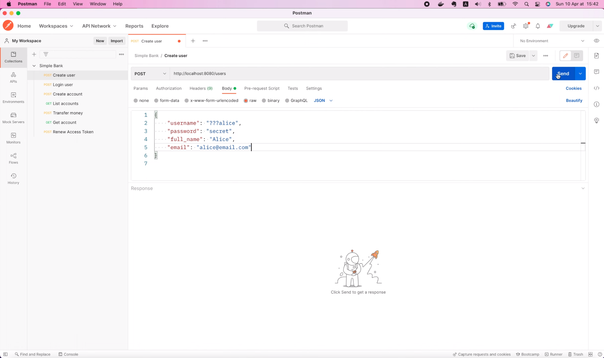
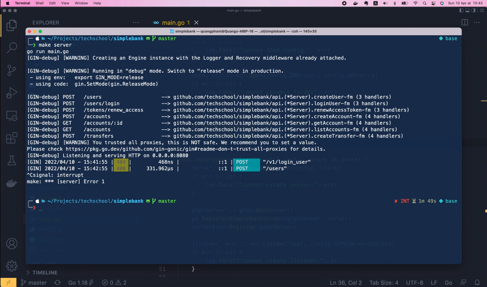
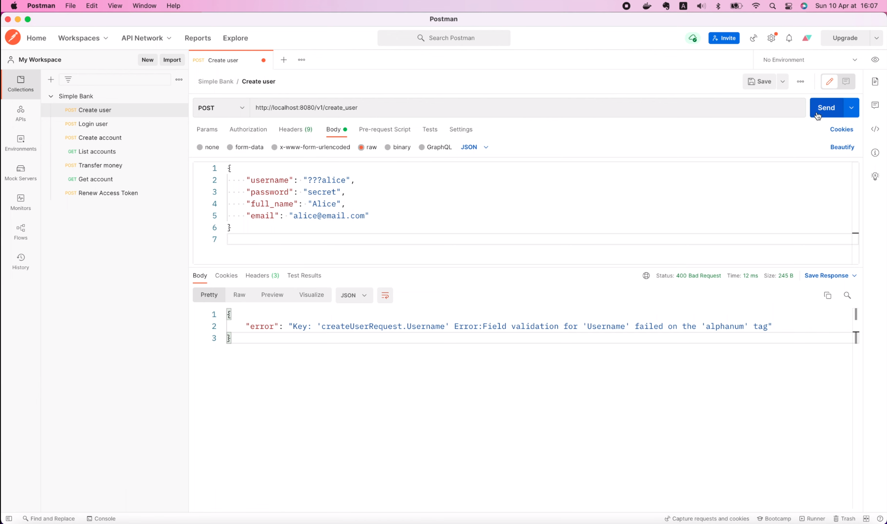
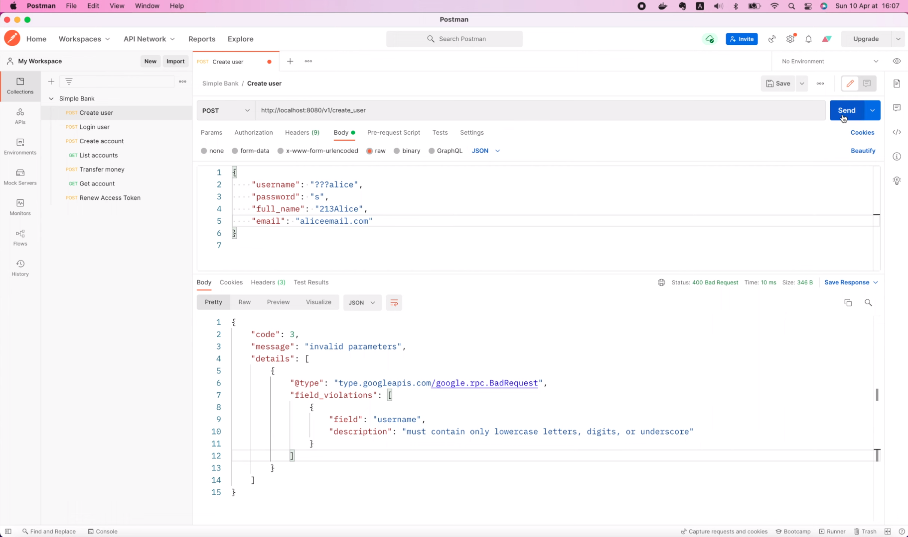

# Validate gRPC parameters and send human/machine friendly response

[Original video](https://www.youtube.com/watch?v=CxZ9hMtmZtc)

Hello guys, welcome back to the backend master class!

In previous lectures, we've learned how to implement the `CreateUser` and
`LoginUser` API using gRPC. We also learned how to use gRPC gateway to
serve both gRPC and HTTP requests. However, there's something still missing!
We haven't written any codes to validate the input parameters of the 
request. If you still remember, before, when we implemented the API using
Gin, we used the `binding` tag to specify the valid format of the params,
because Gin uses the `validator v10` package under the hood to validate the
input data. But now, as we've switched to gRPC, this package is no longer
suitable. I'm not saying we can't use it anymore, but let me show you why 
I don't like the way this package does with the error response. I'm gonna
head over to the `main.go` file, and in the `main()` function, I will 
comment out these 2 statements that run gRPC server and gateway server. 
Then, let's call the function to `runGinServer()` instead.

```go
func main() {
	...
	
    store := db.NewStore(conn)
    // go runGatewayServer(config, store)
    // runGrpcServer(config, store)
    runGinServer(config, store)
}
```

OK, now I'm gonna save this file, and open the terminal to start the Gin
server.

```shell
make server
```

Then in Postman, let's try calling `CreateUser` API with an invalid
username. Note that the path we used in the Gin server is different. It's
just `/users` instead of `/v1/users`. OK, let's send the request!



As you can see, we've got a 400 Bad Request status code, but the error 
message looks pretty bad.


Although it still tells us that the `username` is invalid, the message 
doesn't look very human-friendly. And it's not computer-friendly either.
Because, if the frontend code wants to know which field is invalid, it 
has to perform text analysis on the error message. So this error response
should be improved to provide the invalid field name, as well as a more 
user-friendly message. And that's exactly what we're gonna do in this video.
OK, but first, let me revert all the changes we made to the request as well
as the codes. And stop the Gin server.



## Validate gRPC parameters in CreateUser method

Alright, now let's go back to the code, and open the `rpc_create_user.go`
file inside the `gapi` folder. In this `CreateUser` method, there's a 
request object that gRPC has parsed and provided to us. It contains all 
the fields that we need to validate, such as username, full name, email, 
and password. To keep our code clean, I will create a separate package
for input data validation.

Let's call it "val". And inside this folder, I'm gonna create a 
`validator.go` file. First, we will write a general function to check
if a string has an appropriate length or not. Let's call it `ValidateString`.
It should take a value string and the min length and max length as input
arguments. And it will return an error if the string value doesn't 
satisfy the length constraint.

```go
package val

func ValidateString(value string, minLength int, maxLength int) error {

}
```

In this function, let's compute the length of the string and store it in 
variable `n`. If `n` is smaller than min length, or greater than max length, 
we will return an error saying that it must contain between min length and 
max length characters. Else, we just return nil, meaning that the input 
string is valid.

```go
func ValidateString(value string, minLength int, maxLength int) error {
	n := len(value)
	if n < minLength || n > maxLength {
		return fmt.Errorf("must contain from %d-%d characters", minLength, maxLength)
	}
	return nil
}
```

Next, let's write a function to validate the input username. It will take the
value string as input and will return an error if it is invalid. First, we 
will check the length of the username. Let's say we want it to have at 
least 3 and at most 100 characters. For this purpose, I use the 
`ValidateString()` function we've just written above. If that function 
returns a not `nil` error, we simply return it.

```go
func ValidateUsername(value string) error {
	if err := ValidateString(value, 3, 100); err != nil {
		return err
	}

}
```

Otherwise, we will further check the username's format using regular 
expressions. Suppose that we only allow the username to contain lowercase 
letters, digits, or underscores. So at the top of the file, I will declare 
a variable called `isValidUsername` and call the `regexp.MustCompile` 
function to define its format using regular expressions. The caret character 
marks the beginning of the string, then a pair of square brackets to list 
all possible characters we want to have in the string, so let's put `a-z`, 
`0-9`, and an underscore inside it. Then right next to the square bracket, we 
will use the plus character. This means that any character inside the square 
bracket can appear one or more times in the string. Finally, the dollar 
character marks the end of the string.

```go
var (
	isValidUsername = regexp.MustCompile(`^[a-z0-9_]+$`)
)
```

OK, so this will create a regular expression object, but in order to check
if it matches the input string or not, we will have to call its 
`MatchString` function. Now the `isValidUsername` variable has become a 
function.

```go
var (
	isValidUsername = regexp.MustCompile(`^[a-z0-9_]+$`).MatchString
)
```

So we can just call it here, with the input string value. If the value is 
not valid, we simply return an error saying that it must contain only 
letters, digits, or underscores. Else, the username must be valid, so we
return `nil` to the caller.

```go
func ValidateUsername(value string) error {
	...
	if !isValidUsername(value) {
		return fmt.Errorf("must contain only letters, digits, or underscore")
	}
	return nil
}
```

Alright, now, in a similar way, we're gonna implement the `ValidatePassword`
function. It also takes a string value as input and returns an error. Let's
say we just want the password to have at least 6 and at most 100 characters,
and it can contain any characters the users want. So here we only need to 
return the output of the `ValidateString()` function.

```go
func ValidatePassword(value string) error {
	return ValidateString(value, 6, 100)
}
```

Next, let's add another function to validate an email address. First, we 
also check the length of the input email, let's say between 3 and 200 
characters. Then to make sure that the input string is a valid email
address, we will use the built-in `mail` package of Go. I'm gonna call
`mail.ParseAddress()` function, and pass in the input value. This function
will return the parsed mail address and an error, but we only care about 
the error, so I will use an underscore as a placeholder for the address.
Then we will check if the error is not `nil`. If that's the case, we will
return an error with a message saying the input string is not a valid
email address. Otherwise, we simply return `nil`.

```go
func ValidateEmail(value string) error {
	if err := ValidateString(value, 3, 200); err != nil {
		return err
	}
	if _, err := mail.ParseAddress(value); err != nil {
		return fmt.Errorf("is not a valid email address")
	}
	return nil
}
```

OK, the last validation function we're gonna implement is to validate 
user's full name. It would be very similar to the `ValidateUsername` 
function, so I'm just gonna duplicate it, and change the name to 
`ValidateFullName()`. Let's keep the length checking the same, but we have
to add a new regular expression because the requirement for full name is
different from that of username.

```go
func ValidateFullName(value string) error {
    if err := ValidateString(value, 3, 100); err != nil {
        return err
    }
}
```

So I'm gonna duplicate the regex and change its name to `isValidFullName`.
Let's say we want the full name to contain both lowe case and upper case 
letters, and some spaces. In Go, we use the double backslashes followed by 
an `s` to represent any space character. OK, now go back to the 
`validateFullName` function. Here we should call `isValidFullName()`
instead. And the error message should be changed to "must contain only
letters or spaces".

```go
var (
    isValidFullName = regexp.MustCompile(`^[a-zA-Z\\s]+$`).MatchString
)
func ValidateFullName(value string) error {
	if err := ValidateString(value, 3, 100); err != nil {
		return err
	}
	if !isValidFullName(value) {
		return fmt.Errorf("must contain only letters or spaces")
	}
	return nil
}
```

And in the `ValidateUsername` function, we should say "lowercase letters" 
to make it clearer.

```go
func ValidateUsername(value string) error {
	...
	if !isValidUsername(value) {
		return fmt.Errorf("must contain only lowercase letters, digits, or underscore")
	}
	return nil
}
```

Alright, now we have implemented all the validation functions needed for 
the `CreateUser` API.

Let's go back to the `rpc_create_user.go` file to use them. I'm gonna add
a new function to the bottom of the file. Let's call it 
`validateCreateUserRequest()`. This function will take a `CreateUserRequest`
as input, the same argument we got from gRPC in the `CreateUser()` method
above. And it will return a list of errors. In fact, we will use the 
`BadRequest_FieldViolation` error struct from the `error details` package.
And let's turn this into a named return variable called `violations`. 
OK, now what we have to do is to validate each and every field of the 
input request. First, let's call `val.ValidateUsername()` and pass in 
`req.GetUserName()`. This function will return an error. If `err` is not
`nil`, we will have to create a new field violation error object and add
it to the violations result list. We will have to provide some data to this
`FieldViolation` struct: the violated field name, which is "username" in 
this case. And the description, which should be the message stored in the
error object. As this is gonna be used in multiple places, I'm gonna 
refactor it into a separate function.

```go
func validateCreateUserRequest(req *pb.CreateUserRequest) (violations []*errdetails.BadRequest_FieldViolation) {
	if err := val.ValidateUsername(req.GetUsername()); err != nil {
		violations = append(violations, &errdetails.BadRequest_FieldViolation{
			Field:       "username",
			Description: err.Error(),
		})
	}
}
```

So let's create a new file called `error.go` inside the `gapi` package.
In this file, let's define a function called `fieldViolation()`, which
takes a field name and an error as input, and return a 
`BadRequest_FieldViolation` object as output. Then, let's copy this chunk
of code that initializes the object to the new function. After saving the
file, you will see that the `error details` package is imported. It is, in 
fact, a part of the `googleapis/rpc` package.

```go
package gapi

import "google.golang.org/genproto/googleapis/rpc/errdetails"

func fieldViolation(field string, err error) *errdetails.BadRequest_FieldViolation {
	return &errdetails.BadRequest_FieldViolation{
		Field:       "username",
		Description: err.Error(),
	}
}
```

OK, now we can go back to the `CreateUser` method, and call the 
`fieldViolation()` function. But I just notice that I forgot to change
the field name in the implementation of this function. Here, instead of
"username", we must set it to the input field variable.

```go
func fieldViolation(field string, err error) *errdetails.BadRequest_FieldViolation {
	return &errdetails.BadRequest_FieldViolation{
		Field:       field,
		Description: err.Error(),
	}
}
```

OK, so now, when calling the `fieldViolation()` function, we can pass in 
"username" as the field name, and error as the second argument.

```go
func validateCreateUserRequest(req *pb.CreateUserRequest) (violations []*errdetails.BadRequest_FieldViolation) {
	if err := val.ValidateUsername(req.GetUsername()); err != nil {
		violations = append(violations, fieldViolation("username", err))
	}
}
```

Similarly, we can duplicate this chunk of code, and change the function
call to validate the input password: its value should be taken from 
`req.GetPassword()` and in the `fieldViolation()` function call, the field
name should be "password" instead.

```go
func validateCreateUserRequest(req *pb.CreateUserRequest) (violations []*errdetails.BadRequest_FieldViolation) {
    ...

	if err := val.ValidatePassword(req.GetPassword()); err != nil {
		violations = append(violations, fieldViolation("password", err))
	}
}
```

Next, let's add the validation for the "full_name" field in a similar fashion.
Note that here I use "full_name" with an underscore, because it's what we
defined in the `proto` file.

```go
func validateCreateUserRequest(req *pb.CreateUserRequest) (violations []*errdetails.BadRequest_FieldViolation) {
	...

	if err := val.ValidateFullName(req.GetFullName()); err != nil {
		violations = append(violations, fieldViolation("full_name", err))
	}
}
```

This consistency is important to help the frontend client knows exactly 
which field is invalid. Alright, next, let's validate the input email 
address as well. And finally, at the end of the function, we simply return 
the `violations` variable.

```go
func validateCreateUserRequest(req *pb.CreateUserRequest) (violations []*errdetails.BadRequest_FieldViolation) {
    ...

	if err := val.ValidateEmail(req.GetEmail()); err != nil {
		violations = append(violations, fieldViolation("email", err))
	}
	
    return violations
}
```

And that's it! The `validateCreateUserRequest` is completed.

We can now go back to the `CreateUser` method and call it. Of course, we 
will validate the request immediately at the beginning, before doing any 
further processing. If `violations` list is not `nil`, then it means that 
there's at least one invalid parameter. In this case, we must return a 
`Bad Request` status to the client. Let's see how we can form a meaningful
response! The way we should do it is to create a `badRequest` object with 
the field violations data. This object is also already defined in the
`error details` package. We also have to create a new `status` 
object with code `InvalidArgument` and a message saying "invalid 
parameters".

```go
func (server *Server) CreateUser(ctx context.Context, req *pb.CreateUserRequest) (*pb.CreateUserResponse, error) {
	violations := validateCreateUserRequest(req)
	if violations != nil {
		badRequest := &errdetails.BadRequest{FieldViolations: violations}
		statusInvalid := status.New(codes.InvalidArgument, "invalid parameters")
	}
	...
}	
```

Next, we must add more details about those invalid parameters to the 
`statusInvalid` object. To do that, we simply call 
`statusInvalid.WithDetails()` function, and pass in the `badRequest` object 
as input arguments. This function will return a new `status` object with 
more details, and an error. If error is not `nil`, it means that there's 
something wrong with the `badRequest` details. If it's the case, we can 
just ignore it, and return the original `statusInvalid.Err()` without 
details. Of course, the `CreateUserResponse` object should be `nil` in 
this case. Otherwise, we can return the `statusDetails.Err()` with all 
the details about the invalid fields. I know this looks quite complicated 
for error handling, but trust me, it's totally worth it! You will understand 
when you see the result later.

```go
func (server *Server) CreateUser(ctx context.Context, req *pb.CreateUserRequest) (*pb.CreateUserResponse, error) {
	violations := validateCreateUserRequest(req)
	if violations != nil {
		badRequest := &errdetails.BadRequest{FieldViolations: violations}
		statusInvalid := status.New(codes.InvalidArgument, "invalid parameters")

		statusDetails, err := statusInvalid.WithDetails(badRequest)
		if err != nil {
			return nil, statusInvalid.Err()
		}

		return nil, statusDetails.Err()
	}
	...
}
```

Now, let's do a little bit of code refactoring. I'm gonna extract this chunk 
of codes

```go
badRequest := &errdetails.BadRequest{FieldViolations: violations}
statusInvalid := status.New(codes.InvalidArgument, "invalid parameters")

statusDetails, err := statusInvalid.WithDetails(badRequest)
if err != nil {
    return nil, statusInvalid.Err()
}

return nil, statusDetails.Err()
```

into a separate function, so it can be reused in many other places.

Let's write that function in the `error.go` file. I will call it 
`invalidArgumentError()`. It will take a list of field violations object
as input, and will return an error object as output. Then let's paste in
the code we've just copied and save the file. Now, we can remove these `nil`
object from the `return` statement, since this function has only 1 single
output.

```go
func invalidArgumentError(violations []*errdetails.BadRequest_FieldViolation) error {
	badRequest := &errdetails.BadRequest{FieldViolations: violations}
	statusInvalid := status.New(codes.InvalidArgument, "invalid parameters")

	statusDetails, err := statusInvalid.WithDetails(badRequest)
	if err != nil {
		return statusInvalid.Err()
	}
	
	return statusDetails.Err()
}
```

OK, let's go back to the `CreateUser` method. Here, we can now simply 
return `nil`, and call the `invalidArgumentError()` function with the 
`violations` object.

```go
func (server *Server) CreateUser(ctx context.Context, req *pb.CreateUserRequest) (*pb.CreateUserResponse, error) {
	violations := validateCreateUserRequest(req)
	if violations != nil {
		return nil, invalidArgumentError(violations)
	}
	
	...
}
```

And that's basically it!

We've completed the implementation of the input param validation for the
`CreateUser` API. Can you do the same for the `LoginUser` API?

It's time for you to pause the video and try to do it by yourself if you 
like. Then we'll do it together in a moment.

## Validate gRPC parameters in LoginUser method

Alright, did you manage to implement it on your own? First, let's copy
the `validateCreateUserRequest()` function to the `rpc_login_user.go` file
and change its name from `CreateUser` to `LoginUser`. Note that we have to 
change the request type to `LoginUserRequest` as well. And since the login
request only has 2 parameters: username and password, I will keep them, 
and delete all other fields' validation. OK, after saving the file, all 
required packages will be automatically imported.

```go
func validateLoginUserRequest(req *pb.LoginUserRequest) (violations []*errdetails.BadRequest_FieldViolation) {
	if err := val.ValidateUsername(req.GetUsername()); err != nil {
		violations = append(violations, fieldViolation("username", err))
	}

	if err := val.ValidatePassword(req.GetPassword()); err != nil {
		violations = append(violations, fieldViolation("password", err))
	}

	return violations
}
```

And we can now use this new function to validate the request. Let's go 
back to the `CreateUser` method, and copy this chunk of validation codes.

```go
violations := validateCreateUserRequest(req)
if violations != nil {
    return nil, invalidArgumentError(violations)
}
```

Then paste it to the top of the `LoginUser` function. But this time, we 
have to call `validateLoginUserRequest()` function instead.

```go
func (server *Server) LoginUser(ctx context.Context, req *pb.LoginUserRequest) (*pb.LoginUserResponse, error) {
	violations := validateLoginUserRequest(req)
	if violations != nil {
		return nil, invalidArgumentError(violations)
	}
	
	...
}
```

And that's basically it!

Let's open the terminal and start the server!

```shell
make server
```

OK, now I'm gonna resend the `CreateUser` request with an invalid username.



We still get a 400 `Bad Request`, but this time, the JSON body of the
response looks much better! It contains a code, a message "invalid 
parameters", and a list of details about which parameters are invalid. You
can see the field name, as well as a meaningful & human-friendly 
description.


So it's super easy for the frontend to display the error message on the 
right input field. We can try another request with more invalid fields.



Now in the response, we will see all input fields with their own error
description.


Pretty awesome, isn't it?

And that brings us to the end of this lecture. We've learned a good way to 
implement input parameters validation in Go. I hope it was interesting and
useful for you.

Thanks a lot for watching! Happy learning, and see you in the next 
lecture!