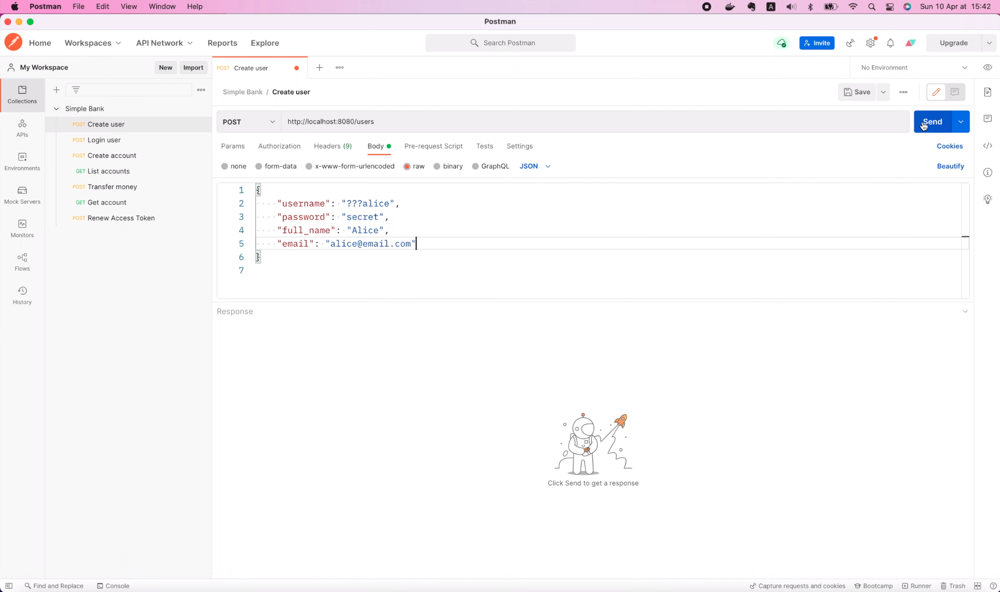
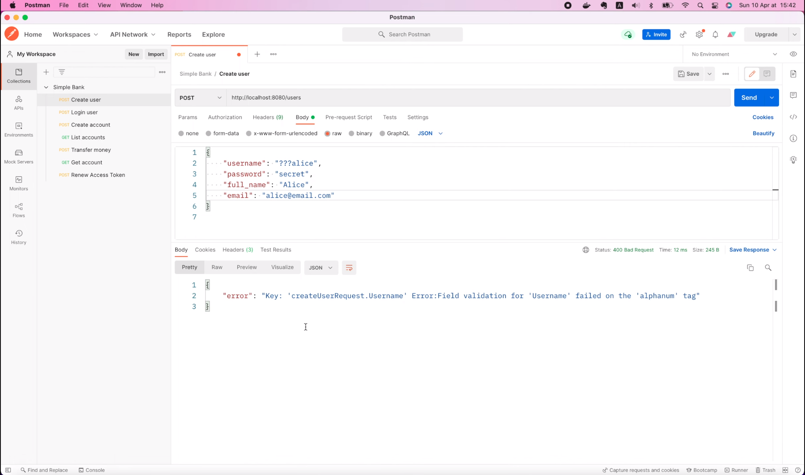
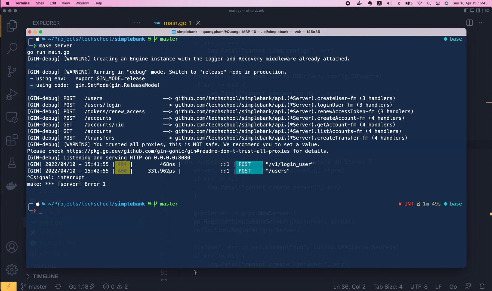
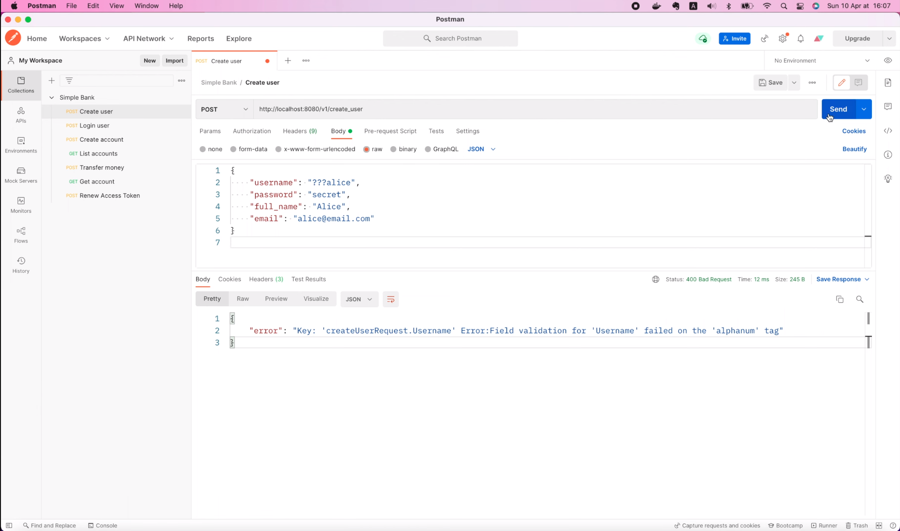
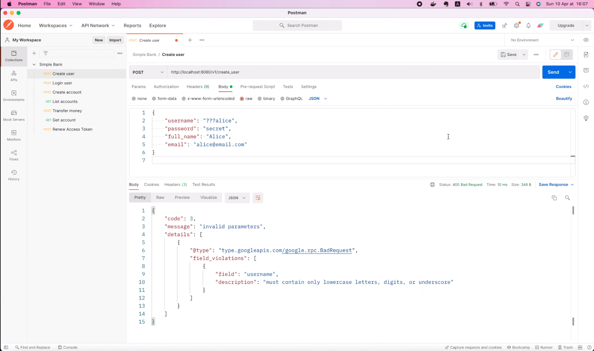
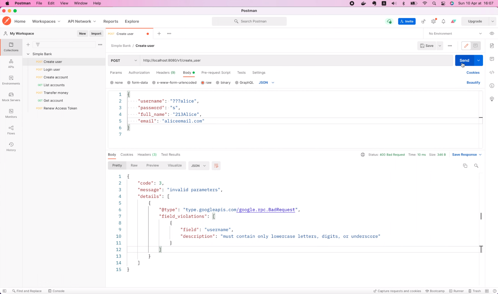
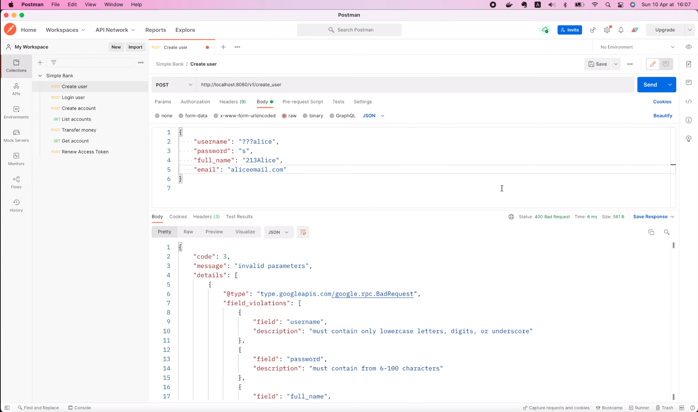

# Проверка gRPC параметров и отправка человека/машинно понятного ответа от сервера

[Original video](https://www.youtube.com/watch?v=CxZ9hMtmZtc)

Привет, ребята, рад вас снова видеть на мастер-классе по бэкенду!

На предыдущих лекциях мы узнали, как реализовать CreateUser и LoginUser
API с помощью gRPC. Мы также узнали, как использовать gRPC шлюз для 
обслуживания gRPC и HTTP запросов. Однако чего-то все же не хватает!
Мы не написали код для проверки входных параметров запроса. Если вы ещё 
помните, раньше, когда мы реализовывали API с помощью Gin, мы использовали
дескриптор `binding`, чтобы указать правильный формат для параметров,
потому что Gin использует под капотом пакет `validator v10` для проверки 
входных данных. Но теперь, когда мы перешли на gRPC, этот пакет уже не 
подходит. Я не говорю, что мы больше не можем его использовать, но 
мне не нравится, как этот пакет выдаёт сообщения об ошибках. Я перейду
в файл `main.go` и в функции `main()` я закомментирую эти два оператора,
которые запускают gRPC сервер и сервер шлюза. Затем давайте вместо этого 
вызовем функцию `runGinServer()`.

```go
func main() {
	...
	
    store := db.NewStore(conn)
    // go runGatewayServer(config, store)
    // runGrpcServer(config, store)
    runGinServer(config, store)
}
```

Хорошо, теперь я сохраню этот файл и открою терминал, чтобы запустить
Gin сервер.

```shell
make server
```

Затем в Postman давайте попробуем вызвать `CreateUser` API с недопустимым 
именем пользователя. Обратите внимание, что путь, который мы использовали
для Gin сервера отличается. Он равен `/users`, а не `/v1/users`. Хорошо, 
давайте отправим запрос!



Как видите мы получили код состояния `400 Bad Request`, но сообщение об 
ошибке сложно назвать хорошим.



Хотя оно по-прежнему сообщает нам, что `username` не прошло проверку, 
сообщение нельзя считать человекопонятным. И машине понять его тоже будет 
сложно. Поскольку, если код фронтэнда хочет знать, в каком поле произошла
ошибка, он должен выполнить текстовый анализ сообщения об ошибке. Поэтому
это сообщение об ошибке следует улучшить, добавив в него название поля,
в котором произошла ошибка, а также более понятное для пользователя 
сообщение. И именно этим мы займёмся на этой лекции. Хорошо, но сначала 
позвольте мне откатить все изменения, которые мы внесли в запрос, а также
в код. И остановим Gin сервер.



## Проверяем gRPC параметры в методе CreateUser

Хорошо, теперь вернемся к коду и откроем файл `rpc_create_user.go` в 
папке `gapi`. В этом методе `CreateUser` есть объект запроса, который gRPC 
проанализировал и предоставил нам. Он содержит все поля, которые нам 
необходимо проверить, а именно имя пользователя, полное имя, адрес 
электронной почты и пароль. Чтобы наш код оставался чистым, я создам 
отдельный пакет для проверки входных данных.

Давайте назовём его "val". И внутри этой папки я создам файл `validator.go`.
Во-первых, мы напишем обобщенную функцию, проверяющую имеет ли переданная 
в неё строка подходящую длину или нет. Назовем его `ValidateString`. Она
должна принимать проверяемую строку, а также минимальную и максимальную 
длину в качестве входных аргументов. И она вернет ошибку, если входная строка
не удовлетворяет ограничениям по длине.

```go
package val

func ValidateString(value string, minLength int, maxLength int) error {

}
```

В этой функции давайте вычислим длину строки и сохраним ее в переменной 
`n`. Если `n` меньше, чем минимальная длина, или больше, чем максимальная 
длина, мы вернем ошибку, сообщающую, что число символов в ней должно быть 
в промежутке от минимальной до максимальной длины. В противном случае мы 
просто возвращаем `nil`, это означает, что входная строка успешно 
прошла проверку.

```go
func ValidateString(value string, minLength int, maxLength int) error {
	n := len(value)
	if n < minLength || n > maxLength {
		return fmt.Errorf("must contain from %d-%d characters", minLength, maxLength)
	}
	return nil
}
```

Затем давайте напишем функцию для проверки введенного имени пользователя.
Она будет принимать проверяемую строку в качестве входных данных и вернет 
ошибку, если она не соответствует критериям. Во-первых, мы проверим длину 
имени пользователя. Допустим, мы хотим, чтобы в нем было не менее 3 и не
более 100 символов. Для этой цели я использую функцию `ValidateString()`, 
которую мы только что написали выше. Если эта функция возвращает ошибку
не равную `nil`, мы просто возвращаем её.

```go
func ValidateUsername(value string) error {
	if err := ValidateString(value, 3, 100); err != nil {
		return err
	}

}
```

В противном случае мы дополнительно проверим формат имени пользователя с 
помощью регулярных выражений. Предположим, что мы разрешаем использовать 
для имени пользователя только строчные буквы, цифры или символы 
подчеркивания. Поэтому в начале файла я объявлю переменную под названием
`isValidUsername` и вызову функцию `regexp.MustCompile`, чтобы определить 
её формат с помощью регулярных выражений. Символ «шляпка» обозначает 
начало строки, затем пара квадратных скобок для перечисления всех возможных 
символов, которые допустимы в строке, поэтому давайте поместим в них
`a-z`, `0-9` и подчеркивание. Затем непосредственно после закрывающейся
квадратной скобки мы используем символ «плюс». Это означает, что любой 
символ внутри квадратных скобок может встречаться в строке один или 
несколько раз. Наконец, символ доллара обозначает конец строки.

```go
var (
	isValidUsername = regexp.MustCompile(`^[a-z0-9_]+$`)
)
```

Итак, это создаст объект регулярного выражения, но чтобы проверить, 
соответствует ли он входной строке или нет, нам нужно будет вызвать его 
функцию `MatchString`. После этого переменная `isValidUsername` станет
функцией.

```go
var (
	isValidUsername = regexp.MustCompile(`^[a-z0-9_]+$`).MatchString
)
```

Так что мы можем просто вызвать её, передав в неё входную строку. 
Если строка не удовлетворяет критериям, мы просто возвращаем ошибку,
сообщающую, что она должна содержать только буквы, цифры или знаки
подчеркивания. В противном случае имя пользователя успешно прошло
проверку, поэтому мы возвращаем `nil` вызывающей стороне.

```go
func ValidateUsername(value string) error {
	...
	if !isValidUsername(value) {
		return fmt.Errorf("must contain only letters, digits, or underscore")
	}
	return nil
}
```

Хорошо, теперь аналогичным образом мы реализуем функцию `ValidatePassword`.
Он также принимает строку в качестве входных данных и возвращает ошибку.
Допустим, мы просто хотим, чтобы пароль содержал не менее 6 и не более 100 
символов, и он может содержать любые символы, которые захотят ввести
пользователи. Так что здесь нам нужно только вернуть результат 
функции `ValidateString()`.

```go
func ValidatePassword(value string) error {
	return ValidateString(value, 6, 100)
}
```

Затем, давайте еще одну функцию для проверки адреса электронной почты. 
Во-первых, мы также проверяем длину адреса электронной почты, поступающего на
вход функции, скажем, от 3 до 200 символов. После этого, чтобы убедиться, что 
входная строка действительно является адресом электронной почты, мы будем 
использовать встроенный Go пакет `mail`. Я вызову функцию 
`mail.ParseAddress()` и передам входное значение. Эта функция вернет 
проанализированный почтовый адрес и ошибку, но нас интересует только 
ошибка, поэтому я буду использовать символ подчеркивания, чтобы указать,
что он не нужен, для адреса. Затем мы проверим, не равна ли ошибка `nil`.
Если не равна, то мы вернём ошибку с сообщением о том, что введенная строка 
не является допустимым адресом электронной почты. В противном случае мы 
просто возвращаем `nil`.

```go
func ValidateEmail(value string) error {
	if err := ValidateString(value, 3, 200); err != nil {
		return err
	}
	if _, err := mail.ParseAddress(value); err != nil {
		return fmt.Errorf("is not a valid email address")
	}
	return nil
}
```

Хорошо, последняя функция проверки, которую мы собираемся реализовать, — это
проверка полного имени и фамилии пользователя. Она будет очень похожа на 
функцию `ValidateUsername`, поэтому я просто продублирую её и изменю 
название на `ValidateFullName()`. Давайте оставим проверку длины без 
изменений, но нам нужно добавить новое регулярное выражение, потому что 
требования к полному имени и фамилии отличаются от требований к имени 
пользователя.

```go
func ValidateFullName(value string) error {
    if err := ValidateString(value, 3, 100); err != nil {
        return err
    }
}
```

Поэтому я продублирую регулярное выражение и изменю его название 
на `isValidFullName`. Допустим, мы хотим, чтобы полное имя и фамилия 
могли содержать как строчные, так и прописные буквы, а также пробелы.
В Go мы используем двойную обратную косую черту, за которой следует `s`,
для обозначения любого символа пробела. Итак, теперь вернёмся к функции
`validateFullName`. Здесь мы должны вместо `isValidUsername()` 
вызвать `isValidFullName()`. И сообщение об ошибке следует изменить на
"must contain only letters or spaces" («должно содержать только буквы или 
пробелы»).

```go
var (
    isValidFullName = regexp.MustCompile(`^[a-zA-Z\\s]+$`).MatchString
)
func ValidateFullName(value string) error {
	if err := ValidateString(value, 3, 100); err != nil {
		return err
	}
	if !isValidFullName(value) {
		return fmt.Errorf("must contain only letters or spaces")
	}
	return nil
}
```

А в функции `ValidateUsername` мы должны дописать "lowercase letters" (
«строчные буквы»), чтобы было понятнее.

```go
func ValidateUsername(value string) error {
	...
	if !isValidUsername(value) {
		return fmt.Errorf("must contain only lowercase letters, digits, or underscore")
	}
	return nil
}
```

Хорошо, теперь мы реализовали все функции проверки, необходимые для 
`CreateUser` API.

Давайте вернемся к файлу `rpc_create_user.go` и воспользуемся ими. Я 
добавлю новую функцию в конец файла. Назовем её 
`validateCreateUserRequest()`. Эта функция примет в качестве входных 
данных `CreateUserRequest`, тот же аргумент, который мы получили от gRPC в 
методе `CreateUser()` выше. И вернет список ошибок. На самом деле мы будем 
использовать структуру для ошибок `BadRequest_FieldViolation` из пакета 
`error details`. И давайте будем использовать именованную переменную для
результата под названием `violations`. Хорошо, теперь нам нужно проверить 
каждое поле входного запроса. Во-первых, давайте вызовем 
`val.ValidateUsername()` и передадим `req.GetUserName()`. Эта функция 
вернет ошибку. Если `err` не `nil`, нам придется создать новый объект ошибки
нарушения правила для поля и добавить его в список нарушений, который 
возвращается функцией. Нам нужно будет предоставить некоторую информацию 
для этой структуре `FieldViolation`: имя поля (`Field`), для которого 
нарушено правило, в данном случае это "username". И описание (`Description`),
которым будет текст сообщения, хранящийся в объекте ошибки. Так как это 
будет использоваться во многих местах, я перенесу этот фрагмент кода в 
отдельную функцию.

```go
func validateCreateUserRequest(req *pb.CreateUserRequest) (violations []*errdetails.BadRequest_FieldViolation) {
	if err := val.ValidateUsername(req.GetUsername()); err != nil {
		violations = append(violations, &errdetails.BadRequest_FieldViolation{
			Field:       "username",
			Description: err.Error(),
		})
	}
}
```

Итак, давайте создадим новый файл с названием `error.go` внутри пакета
`gapi`. Давайте определим в этом файле функцию `fieldViolation()`,
которая принимает имя поля и ошибку в качестве входных данных и возвращает 
объект `BadRequest_FieldViolation` в качестве результата. Затем давайте 
скопируем фрагмент кода, который инициализирует объект, в этой новой функции.
После сохранения файла вы увидите, что был импортирован пакет
`error details`. На самом деле он является частью пакета `googleapis/rpc`.

```go
package gapi

import "google.golang.org/genproto/googleapis/rpc/errdetails"

func fieldViolation(field string, err error) *errdetails.BadRequest_FieldViolation {
	return &errdetails.BadRequest_FieldViolation{
		Field:       "username",
		Description: err.Error(),
	}
}
```

Хорошо, теперь мы можем вернуться к методу `CreateUser` и вызвать функцию 
`fieldViolation()`. Но я только что заметил, что забыл изменить название
поля в реализации этой функции. Здесь вместо "username" мы должны приравнять 
его равным входной переменной `field`.

```go
func fieldViolation(field string, err error) *errdetails.BadRequest_FieldViolation {
	return &errdetails.BadRequest_FieldViolation{
		Field:       field,
		Description: err.Error(),
	}
}
```

Итак, теперь при вызове функции `fieldViolation()` мы можем передать
"username" в качестве названия поля и ошибку в качестве второго аргумента.

```go
func validateCreateUserRequest(req *pb.CreateUserRequest) (violations []*errdetails.BadRequest_FieldViolation) {
	if err := val.ValidateUsername(req.GetUsername()); err != nil {
		violations = append(violations, fieldViolation("username", err))
	}
}
```

По аналогии мы можем продублировать этот фрагмент кода и изменить название
функции на то, которое используется для проверки вводимого пароля: его 
значение должно быть взято из `req.GetPassword()`, а в `fieldViolation()` 
название поля должны быть равно "password", а не "username".

```go
func validateCreateUserRequest(req *pb.CreateUserRequest) (violations []*errdetails.BadRequest_FieldViolation) {
    ...

	if err := val.ValidatePassword(req.GetPassword()); err != nil {
		violations = append(violations, fieldViolation("password", err))
	}
}
```

Затем подобным образом добавим проверку для поля "full_name". Обратите 
внимание, что здесь я использую "full_name" с символом подчеркивания, потому 
что так мы определили его в файле `proto`.

```go
func validateCreateUserRequest(req *pb.CreateUserRequest) (violations []*errdetails.BadRequest_FieldViolation) {
	...

	if err := val.ValidateFullName(req.GetFullName()); err != nil {
		violations = append(violations, fieldViolation("full_name", err))
	}
}
```

Эта согласованность важна, чтобы фронтэнд точно знал, какое поле не прошло
проверку. Хорошо, теперь давайте также проверим введенный адрес электронной 
почты. И, наконец, в конце функции мы просто возвращаем переменную
`violations`.

```go
func validateCreateUserRequest(req *pb.CreateUserRequest) (violations []*errdetails.BadRequest_FieldViolation) {
    ...

	if err := val.ValidateEmail(req.GetEmail()); err != nil {
		violations = append(violations, fieldViolation("email", err))
	}
	
    return violations
}
```

Вот и всё! Функция `validateCreateUserRequest` готова.

Теперь мы можем вернуться к методу CreateUser и вызвать её. Конечно, мы 
проверим запрос сразу же в начале, прежде чем выполнять дальнейшую обработку.
Если список `violations` не `nil`, то это означает, что есть хотя бы один 
параметр, не удовлетворяющий условиям проверки. В этом случае мы должны 
вернуть клиенту статус `Bad Request`. Давайте посмотрим, как мы можем 
сформировать осмысленный ответ! То есть нам нужно создать объект `badRequest`
с информацией о том, в каких полях возникли ошибки. Этот объект также уже 
определен в пакете `error details`. Мы также должны создать новый объект 
`status` с кодом `InvalidArgument` и сообщением о "недопустимых значениях 
параметров".

```go
func (server *Server) CreateUser(ctx context.Context, req *pb.CreateUserRequest) (*pb.CreateUserResponse, error) {
	violations := validateCreateUserRequest(req)
	if violations != nil {
		badRequest := &errdetails.BadRequest{FieldViolations: violations}
		statusInvalid := status.New(codes.InvalidArgument, "invalid parameters")
	}
	...
}	
```

Затем мы должны добавить дополнительную информацию об этих недопустимых 
значениях параметров в объект `statusInvalid`. Для этого мы просто вызываем 
функцию `statusInvalid.WithDetails()` и передаем объект `badRequest` в 
качестве входных аргументов. Эта функция вернет новый объект статуса с более 
подробной информацией и ошибкой. Если ошибка не равна `nil`, это означает, 
что что-то не так с подробной информацией `badRequest`. В этом случае мы 
можем просто проигнорировать ошибку и вернуть оригинал
`statusInvalid.Err()` без подробностей. Конечно при этом объект
`CreateUserResponse` должен быть равен `nil`. В противном случае мы можем 
вернуть `statusDetails.Err()` со всеми подробностями о недопустимых значениях 
полей. Я знаю, что это выглядит довольно сложно для обработки ошибок, но 
поверьте мне, оно того стоит! Вы поймете, когда увидите результат чуть позже.

```go
func (server *Server) CreateUser(ctx context.Context, req *pb.CreateUserRequest) (*pb.CreateUserResponse, error) {
	violations := validateCreateUserRequest(req)
	if violations != nil {
		badRequest := &errdetails.BadRequest{FieldViolations: violations}
		statusInvalid := status.New(codes.InvalidArgument, "invalid parameters")

		statusDetails, err := statusInvalid.WithDetails(badRequest)
		if err != nil {
			return nil, statusInvalid.Err()
		}

		return nil, statusDetails.Err()
	}
	...
}
```

Теперь давайте сделаем небольшой рефакторинг кода. Я собираюсь переместить 
этот кусок кода

```go
badRequest := &errdetails.BadRequest{FieldViolations: violations}
statusInvalid := status.New(codes.InvalidArgument, "invalid parameters")

statusDetails, err := statusInvalid.WithDetails(badRequest)
if err != nil {
    return nil, statusInvalid.Err()
}

return nil, statusDetails.Err()
```

в отдельную функцию, чтобы его можно было повторно использовать во 
многих других местах.

Давайте создадим эту функцию в файле error.go. Я назову её
`invalidArgumentError()`. В качестве входных данных она примет объект со
списком нарушений правил для полей и вернет объект ошибки в качестве 
результата. Затем давайте вставим код, который мы только что скопировали, 
и сохраним файл. Теперь мы можем удалить этот `nil` объект из оператора 
return, так как эта функция возвращает только один результат.

```go
func invalidArgumentError(violations []*errdetails.BadRequest_FieldViolation) error {
	badRequest := &errdetails.BadRequest{FieldViolations: violations}
	statusInvalid := status.New(codes.InvalidArgument, "invalid parameters")

	statusDetails, err := statusInvalid.WithDetails(badRequest)
	if err != nil {
		return statusInvalid.Err()
	}
	
	return statusDetails.Err()
}
```

Хорошо, вернемся к методу `CreateUser`. Теперь мы можем просто вернуть `nil` 
и вызвать функцию `invalidArgumentError()` с объектом `violations`.

```go
func (server *Server) CreateUser(ctx context.Context, req *pb.CreateUserRequest) (*pb.CreateUserResponse, error) {
	violations := validateCreateUserRequest(req)
	if violations != nil {
		return nil, invalidArgumentError(violations)
	}
	
	...
}
```

И на этом по сути всё!

Мы завершили реализацию проверки входных параметров для API `CreateUser`.
Сможете ли вы сделать то же самое для API `LoginUser`?

Пришло время приостановить чтение и попытаться сделать это самостоятельно, 
если хотите. В противном случае мы сделаем это вместе как показано ниже.

## Проверяем gRPC параметры в методе LoginUser

Итак, удалось ли вам реализовать проверку самостоятельно? Во-первых, давайте
скопируем функцию `validateCreateUserRequest()` в файл `rpc_login_user.go`
и изменим её название с `CreateUser` to `LoginUser`. Обратите внимание, что 
мы также должны изменить тип запроса на `LoginUserRequest`. И так как запрос
на вход в систему содержит только два параметра: имя пользователя и пароль, 
я оставлю их и удалю проверку всех остальных полей. ОК, после сохранения 
файла все необходимые пакеты будут импортированы автоматически.

```go
func validateLoginUserRequest(req *pb.LoginUserRequest) (violations []*errdetails.BadRequest_FieldViolation) {
	if err := val.ValidateUsername(req.GetUsername()); err != nil {
		violations = append(violations, fieldViolation("username", err))
	}

	if err := val.ValidatePassword(req.GetPassword()); err != nil {
		violations = append(violations, fieldViolation("password", err))
	}

	return violations
}
```

И теперь мы можем использовать эту новую функцию для проверки запроса.
Давайте вернемся в метод `CreateUser` и скопируем этот фрагмент кода, 
осуществляющий проверку.

```go
violations := validateCreateUserRequest(req)
if violations != nil {
    return nil, invalidArgumentError(violations)
}
```

Затем вставьте его в начале функции `LoginUser`. Но на этот раз мы должны 
вместо `validateCreateUserRequest()` вызвать функцию 
`validateLoginUserRequest()`.

```go
func (server *Server) LoginUser(ctx context.Context, req *pb.LoginUserRequest) (*pb.LoginUserResponse, error) {
	violations := validateLoginUserRequest(req)
	if violations != nil {
		return nil, invalidArgumentError(violations)
	}
	
	...
}
```

И на этом по сути всё!

Давайте откроем терминал и запустим сервер!

```shell
make server
```

Хорошо, теперь я повторно отправлю запрос `CreateUser` с недопустимым 
именем пользователя.



Мы по-прежнему получаем 400 `Bad Request`, но на этот раз тело ответа в 
формате JSON выглядит намного лучше! Оно содержит код, сообщение
"invalid parameters" и список сведений о том какие параметры не прошли
проверку. Здесь вы можете увидеть название поля, а также осмысленное и 
понятное описание.



Таким образом, фронтэнду очень легко отобразить сообщение об ошибке в 
правильном поле для ввода. Мы можем попробовать выполнить другой запрос
с большим количеством полей, содержащих недопустимые значения.



Теперь в ответе мы увидим все эти поля ввода с пользовательским описанием
ошибки.



Довольно круто, не так ли?

И на этом мы закончим эту лекцию. Мы научились реализовывать проверку 
входных параметров в Go. Я надеюсь, что вы узнали из неё что-то полезное 
и интересное для себя.

Большое спасибо за время, потраченное на чтение! Желаю Вам получать
удовольствие от обучения и до встречи на следующей лекции!