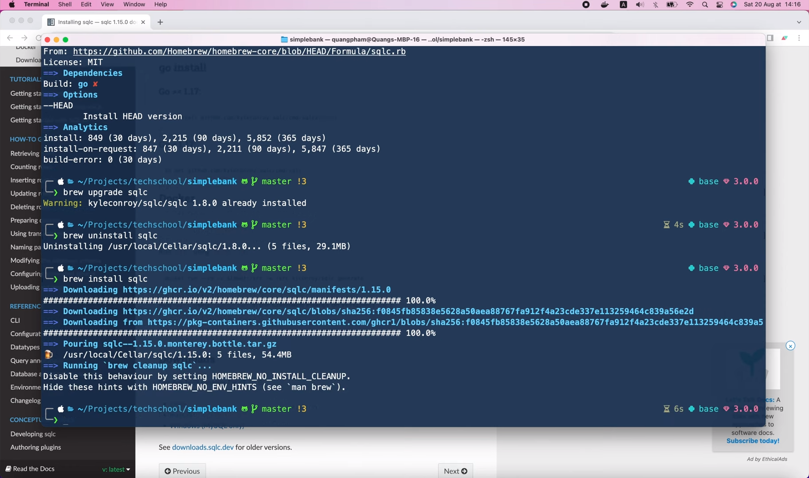
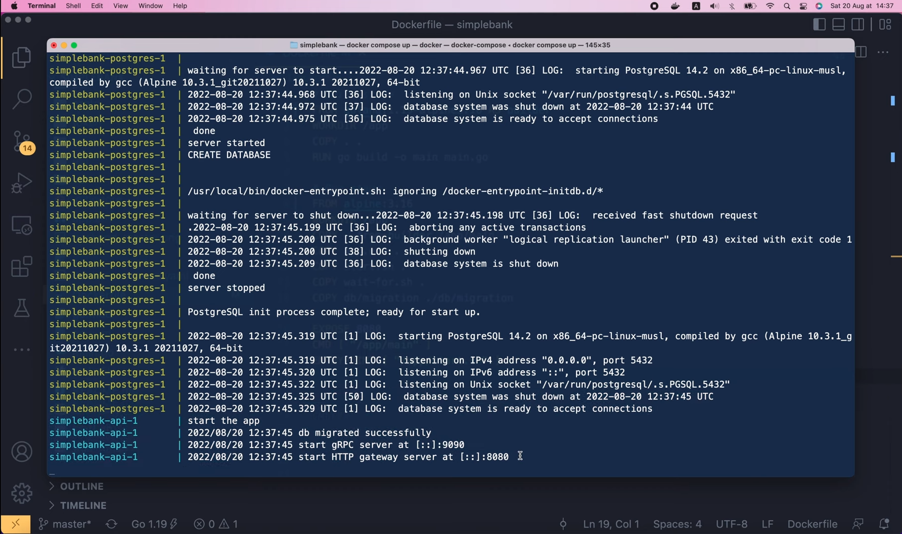

# Partial update DB record with SQLC nullable parameters

[Original video](https://www.youtube.com/watch?v=I2sbw1PzzW0)

Hello guys, welcome to the backend master class. Today, we're gonna learn
how to handle partial updates using SQLC, and along with that, we will 
also learn how to work with nullable fields in Go. OK, let's start!

If you still remember, in lecture 16 of the course, we've added 2 SQL 
queries to create a new user and fetch a user by username.

```postgresql
-- name: CreateUser :one
INSERT INTO users (
    username,
    hashed_password,
    full_name,
    email
) VALUES (
    $1, $2, $3, $4
) RETURNING *;

-- name: GetUser :one
SELECT * FROM users
WHERE username = $1 LIMIT 1;
```

Now, suppose that we want to provide a new query that can update some
of its information, such as password, full name, and email. So I'm gonna
define a new query named UpdateUser, that will return one user record 
after updating it. First, we will write a simple `UPDATE users` query 
to update all fields at once. So, let's set `hash_password` to `$1`, which
means the first argument. Then set `full_name` to `$2`, and `email` to `$3`.
And since we only want to update 1 specific user, let's add a `WHERE 
username = $4` condition. Finally, we use the `RETURNING` statement to 
return the updated user record.

```postgresql
-- name: UpdateUser :one
UPDATE users
SET
    hashed_password = $1,
    full_name = $2,
    email = $3
WHERE
    username = $4
RETURNING *;
```

OK, now we can 

```shell
make sqlc
```

in the terminal to generate Golang code for this new query. Then in Visual 
Studio Code, if we look at the `user.sql.go` file, we will see that a new
`UpdateUser` method has been added, with the 4 input parameters as we 
specified in the SQL query.

```go
type UpdateUserParams struct {
	HashedPassword string `json:"hashed_password"`
	FullName       string `json:"full_name"`
	Email          string `json:"email"`
	Username       string `json:"username"`
}

func (q *Queries) UpdateUser(ctx context.Context, arg UpdateUserParams) (User, error) {
	...
}
```

So it's very easy to update all of these fields at once. But what if we 
just want to update some of the fields? For example, sometimes users 
just want to change the password, or sometimes, they just need to update
the email or full name.

How can we modify our SQL query to allow this behavior? Well, there are
several solutions. The simplest one would be using some boolean
flag parameters to tell the database whether we want to change the field
or not. So here, instead of setting `hash_password` to `$1` I'm 
gonna use a `CASE` statement to specify a branching condition. WHEN
the boolean flag $1 is TRUE, we will set the hashed_password to the second
parameter $2, ELSE when the flag is FALSE, we just set it to the original 
value.

```postgresql
-- name: UpdateUser :one
UPDATE users
SET
    hashed_password = CASE
        WHEN $1 = TRUE THEN $2
        ELSE hashed_password
    END,
    full_name = $2,
    email = $3
WHERE
    username = $4
RETURNING *;
```

So with this change, if we want to change the `hashed_password`, just 
set `$1` to `TRUE`, and specify its new value in `$2`. Or in case we
don't want to change the hashed_password, simply set `$1` to `FALSE`. 
Let's do this for the other 2 fields as well. For `full_name`, when `$3`
is `TRUE`, set it to `$4`, else keep the original `full_name`. And for 
`email`, when `$5` is `TRUE`, set it to `$6`, else keep the original
`email` value. Finally, we have to change the username parameter to `$7`.
And that's basically it.

```postgresql
-- name: UpdateUser :one
UPDATE users
SET
    hashed_password = CASE
        WHEN $1 = TRUE THEN $2
        ELSE hashed_password
    END,
    full_name = CASE
        WHEN $3 = TRUE THEN $4
        ELSE full_name
    END,
    email = CASE
        WHEN $5 = TRUE THEN $6
        ELSE email
    END
WHERE
    username = $7
RETURNING *;
```

We can now run 

```shell
make sqlc
```

again to regenerate the codes.

Alright, let's take a look at the `user.sql.go` file.

```go
type UpdateUserParams struct {
	Column1        interface{} `json:"column_1"`
	HashedPassword string      `json:"hashed_password"`
	Column3        interface{} `json:"column_3"`
	FullName       string      `json:"full_name"`
	Column5        interface{} `json:"column_5"`
	Email          string      `json:"email"`
	Username       string      `json:"username"`
}

func (q *Queries) UpdateUser(ctx context.Context, arg UpdateUserParams) (User, error) {
	...
}
```

As you can see, the `UpdateUserParams` struct has changed. Besides the
original 4 fields, we're now having 3 more flag parameters: `Column1`,
`Column3` and `Column5`. Their names don't look very meaningful. And 
their data types are not boolean as we expected, but they're `interface{}`
instead. So how can we fix these 2 issues?

Well, if we look at sqlc's [documentation page](https://docs.sqlc.dev/en/stable/howto/named_parameters.html), 
there is a section about naming parameters. Here, to avoid the generated 
code to contains some Column fields like this, we can use the `sqlc.arg()` 
function to specify the name of the parameter we want SQLC to generate. And 
we can use this double-colons syntax to tell SQLC the exact data type of 
this parameter.

```sql
-- name: UpsertAuthorName :one
UPDATE author
SET
  name = CASE WHEN sqlc.arg(set_name)::bool
    THEN sqlc.arg(name)::text
    ELSE name
    END
RETURNING *;
```

Moreover, we can simplify the expression by replacing the `sqlc.arg()`
function with a `@` operator like this example.

```sql
-- name: UpsertAuthorName :one
UPDATE author
SET
  name = CASE WHEN @set_name::bool
    THEN @name::text
    ELSE name
    END
RETURNING *;
```

Alright, let's go back to our code. I'm gonna update our SQL query to 
use the named parameters. Here, instead of `$1`, I will use `sqlc.arg()`
function, and pass in the name of the parameter: `set_hashed_password`.
Then use the double-colon, followed by its data type: `boolean`.

```postgresql
-- name: UpdateUser :one
UPDATE users
SET
    hashed_password = CASE
        WHEN sqlc.arg(set_hashed_password)::boolean = TRUE THEN $2
        ELSE hashed_password
    END,
```

Now, to make it simpler, let's replace the `sqlc.arg()` function call 
with the `@` operator.

```postgresql
-- name: UpdateUser :one
UPDATE users
SET
    hashed_password = CASE
        WHEN @set_hashed_password::boolean = TRUE THEN @hashed_password
        ELSE hashed_password
    END,
```

So this parameter becomes `@set_hashed_password`, and this `$2` parameter
becomes `@hashed_password`. Note that the one without `@` operator is the
current value of the `hashed_password` column itself. OK, next I'm gonna
update other parameters in the same way.

This `$3` param will be `@set_full_name`, the `$4` param will be 
`@full_name`, then, the `$5` param will be `@set_email`, and the `$6`
param will be `@email`. Note that if we use the `@` operator, we must 
use it for all parameters.

```postgresql
-- name: UpdateUser :one
UPDATE users
SET
    hashed_password = CASE
        WHEN @set_hashed_password::boolean = TRUE THEN @hashed_password
        ELSE hashed_password
    END,
    full_name = CASE
        WHEN @set_full_name = TRUE THEN @full_name
        ELSE full_name
    END,
    email = CASE
        WHEN @set_email = TRUE THEN @email
        ELSE email
    END
WHERE
    username = $7
RETURNING *;
```

If we mix it with positional parameters, `sqlc` will complain: "query mixes 
positional parameters and named parameters".

```shell
make sqlc
# package db
db/query/user.sql:16:1: query mixes positional parameters ($1) and named parameters (sqlc.arg or @arg)
```

To fix this, let's change `$7` param to `@username`.

```postgresql
-- name: UpdateUser :one
UPDATE users
SET
    hashed_password = CASE
        WHEN @set_hashed_password::boolean = TRUE THEN @hashed_password
        ELSE hashed_password
    END,
    full_name = CASE
        WHEN @set_full_name = TRUE THEN @full_name
        ELSE full_name
    END,
    email = CASE
        WHEN @set_email = TRUE THEN @email
        ELSE email
    END
WHERE
    username = @username
RETURNING *;
```

This time, the 

```shell
make sqlc
```

command will be successful.

And in the `user.sql.go` file, we will see that all fields have a 
meaningful name, just like what we defined in the SQL query.

```go
type UpdateUserParams struct {
	SetHashedPassword bool          `json:"set_hashed_password"`
	HashedPassword    string        `json:"hashed_password"`
	SetFullName       interface{}   `json:"set_full_name"`
	FullName          string        `json:"full_name"`
	SetEmail          interface{}   `json:"set_email"`
	Email             string        `json:"email"`
	Username          string        `json:"username"`
}

func (q *Queries) UpdateUser(ctx context.Context, arg UpdateUserParams) (User, error) {
	...
}
```

The type of the `SetHashedPassword` field is now `boolean`, but the 
`SetFullName` and `SetEmail` still have type `interface{}`. That's because
we forgot to specify the data type for those parameters in the SQL query. 
We have to add `::boolean` to the `@set_full_name` and `@set_email` 
parameters.

```postgresql
-- name: UpdateUser :one
UPDATE users
SET
    hashed_password = CASE
        WHEN @set_hashed_password::boolean = TRUE THEN @hashed_password
        ELSE hashed_password
    END,
    full_name = CASE
        WHEN @set_full_name::boolean = TRUE THEN @full_name
        ELSE full_name
    END,
    email = CASE
        WHEN @set_email::boolean = TRUE THEN @email
        ELSE email
    END
WHERE
    username = @username
RETURNING *;
```

Then save the file, and run

```shell
make sqlc
```

again to regenerate the codes.

This time, all the flag fields have boolean types as expected.

```go
type UpdateUserParams struct {
	SetHashedPassword bool   `json:"set_hashed_password"`
	HashedPassword    string `json:"hashed_password"`
	SetFullName       bool   `json:"set_full_name"`
	FullName          string `json:"full_name"`
	SetEmail          bool   `json:"set_email"`
	Email             string `json:"email"`
	Username          string `json:"username"`
}

func (q *Queries) UpdateUser(ctx context.Context, arg UpdateUserParams) (User, error) {
	...
}
```

Awesome!

So that's the first solution to enable partial updates for our SQL 
query. It's pretty easy to implement, but it also makes the query
and the param struct a bit longer and more complicated than before. 
NOw I'm gonna show you the second approach, which I think, is the
better solution. It involves using [nullable parameters](https://docs.sqlc.dev/en/stable/howto/named_parameters.html#nullable-parameters). 
The idea is similar, but this time, instead of using a separate 
`boolean` flag, we will use the parameter itself. If the parameter 
is `NULL`, then it means do not update the column. We can use the 
`sqlc.narg()` function to tell SQLC compiler that this parameter can
be `NULL`. And when updating the value, we will use a special function
of Postgres called `COALESCE`. This function will return the first 
non-null value in the provided input parameters.

```sql
-- name: UpdateAuthor :one
UPDATE author
SET
 name = coalesce(sqlc.narg('name'), name),
 bio = coalesce(sqlc.narg('bio'), bio)
WHERE id = sqlc.arg('id');
```

So in this example, if the `name` parameter is not null, its value will
be used as the new value for the `name` column. Otherwise, the original
value of the name column will be used.

Alright, let's go back to our `UpdateUser` query. Here, I will replace 
`CASE` statement with COALENSE(), and pass in `sqlc.narg()` function
as the first parameter. The name of this parameter should be 
`hashed_password`. Then, the second param of the `COALESCE` function
should be the original value of the `hashed_password` itself. 

```postgresql
UPDATE users
SET
    hashed_password = COALESCE(sqlc.narg(hashed_password), hashed_password),
```

Just like that, much simpler than before, isn't it? Next, let's do
the same for the full name column. Change this `CASE` to `COALESCE`,
the first argument is `sqlc.narg(full_name)`, and the second argument
is the original `full_name` column's value. Finally, I'm gonna change
the `email` parameter in the same manner. Here it should be `COALESCE(
sqlc.narg(email))` followed by the original `email` column's value. 
Since SQLC doesn't allow mixing named parameter and @ operator, we have 
to change this `@username` to `sqlc.arg(username)` as well. Note that
it's `arg` (not `narg`) because the `username` parameter should not be
`NULL` in any case.

```postgresql
-- name: UpdateUser :one
UPDATE users
SET
    hashed_password = COALESCE(sqlc.narg(hashed_password), hashed_password),
    full_name = COALESCE(sqlc.narg(full_name), full_name),
    email = COALESCE(sqlc.narg(email), email)
WHERE
    username = sqlc.arg(username)
RETURNING *;
```

Alright, now let's run 

```shell
make sqlc
```

to regenerate the codes.

Oh, we got an error: `function "sqlc.narg" does not exist`. I think this
is because my `sqlc` compiler is not up-to-date. Let's check its version
by running

```shell
sqlc version
```

OK, my current `sqlc` version is 1.8. You can check its latest version
on the SQLC's GitHub release page. Or if you use Homebrew to install 
the package, you can check its latest version with

```shell
brew info sqlc
```

OK, so the latest stable version is 1.15. This means, my `sqlc` compiler
is really out of date. So we should update it to the latest version.
You can check out its [documentation page](https://docs.sqlc.dev/en/stable/overview/install.html) 
to know how to do that on your OS. By the way, if you're using Windows,
you should install `sqlc` using Docker instead of the pre-build binary.
Here's the command to generate Go code from SQL query using Docker. For
me, I'm on a Mac, so I will run 

```shell
brew upgrade sqlc
```

to upgrade it to the latest version.

Interesting, we've got a warning: `sqlc 1.8 already installed`. So 
somehow it didn't upgrade `sqlc` to 1.15. I think there must be something
wrong with Homebrew. Let's try uninstall `sqlc` completely by running

```shell
brew uninstall sqlc
```

Then reinstall it with 

```shell
brew install sqlc
```

OK, now we can see that it's installing the latest version 1.15.



Once it's done, let's verify it with 

```shell
sqlc version
v.1.15.0
```

Indeed, the current version is now 1.15.

So now it should be able to understand the `sqlc.narg()` function.
Let's run 

```shell
make sqlc
```

again to see what happens.

```shell
make sqlc
sqlc generate
```

Voilà, there are no more errors this time. And in the generated Golang 
code, we can see that the `UpdateUserParams` has changed.

```go
type UpdateUserParams struct {
	HashedPassword sql.NullString `json:"hashed_password"`
	FullName       sql.NullString `json:"full_name"`
	Email          sql.NullString `json:"email"`
	Username       string         `json:"username"`
}

func (q *Queries) UpdateUser(ctx context.Context, arg UpdateUserParams) (User, error) {
	...
}
```

The type of the `HashedPassword`, `FullName` and `Email` fields is now
`sql.NullString` instead of just `string` as before. It is in fact a
struct with 2 fields: `String` and `Valid`, where `Valid` should be `TRUE`
if the `String` is not `NULL`.

Alright, how about we try to write some tests to really understand how 
to work with this new data type?

In the `user_test.go` file, I'm gonna add a new function to test the 
new `UpdateUser` method. And let's say this time, we only want to 
update the user's full name. First, I'm gonna create an old user by
calling the `createRandomUser()` function. Then let's generate a new
full name with `util.RandomOwner()`. If you're new to the course, you
can go back to watch lecture 5 to understand what these random functions
do. OK, next, let's call `testQueries.UpdateUser()`, pass in a background
context, and a `UpdateUserParams` object. The `Username` should be 
`oldUser.Username`, and now, we want to update the `FullName`. But we
can't just pass in `newFullName` here because its type is `string`, while
the type of the `FullName` field is `sql.NullString`. So we have to 
create a new `sql.NullString{}` object, and as I said before, we need
to specify the `String` and `Valid` value. In this case, the `String`
value should be `newFullName`, and of course, `Valid` should be `TRUE`,
since the string is not `null`. We don't have to specify anything about
the `HashedPassword` and `Email` because by default, their `Valid` field
will be `FALSE`, and thus, they will be treated as `NULL`. OK, now, the
function will return the updated user and an error.

```go
func TestUpdateUserOnlyFullName(t *testing.T) {
	oldUser := createRandomUser(t)

	newFullName := util.RandomOwner()
	updatedUser, err := testQueries.UpdateUser(context.Background(), UpdateUserParams{
		Username: oldUser.Username,
		FullName: sql.NullString{
			String: newFullName,
			Valid:  true,
		},
	})
}
```

We will use the `require.NoError()` function to check that error is `nil`.
And then, we check that the full name of the updated user must not equal
that of the old user. Instead, the updated user's full name should be
equal to the new full name. Next, we have to check that the user's `email`
and `hashed_password` didn't change, since we only update the user's full
name in this case.

```go
func TestUpdateUserOnlyFullName(t *testing.T) {
    ...

	require.NoError(t, err)
	require.NotEqual(t, oldUser.FullName, updatedUser.FullName)
	require.Equal(t, newFullName, updatedUser.FullName)
	require.Equal(t, oldUser.Email, updatedUser.Email)
	require.Equal(t, oldUser.HashedPassword, updatedUser.HashedPassword)
}
```

Alright, now let's run this test!

```shell
=== RUN   TestUpdateUserOnlyFullName
--- PASS: TestUpdateUserOnlyFullName (0.06s)
PASS
```

It passed. Awesome.

Now we can write a similar test to update only the email of the 
user. So I'm gonna duplicate this test, change its name to 
`TestUpdateUserOnlyEmail`, here we have to create a new email with
`util.RandomEmail()` and in this `UpdateUserParams`, I will change
the field to `Email`, and its string value to `newEmail`. 

```go
func TestUpdateUserOnlyEmail(t *testing.T) {
	oldUser := createRandomUser(t)

	newEmail := util.RandomEmail()
	updatedUser, err := testQueries.UpdateUser(context.Background(), UpdateUserParams{
		Username: oldUser.Username,
		Email: sql.NullString{
			String: newEmail,
			Valid:  true,
		},
	})
}
```

Then, we must check that `oldUser.Email` doesn't equal 
`updatedUser.Email`, but the `updatedUser.Email` should be equal
to `newEmail` instead. And this time, the user's full name should
be kept the same.

```go
func TestUpdateUserOnlyEmail(t *testing.T) {
	...

	require.NoError(t, err)
	require.NotEqual(t, oldUser.Email, updatedUser.Email)
	require.Equal(t, newEmail, updatedUser.Email)
	require.Equal(t, oldUser.FullName, updatedUser.FullName)
	require.Equal(t, oldUser.HashedPassword, updatedUser.HashedPassword)
}
```

That's it!

Let's run the test!

```shell
=== RUN   TestUpdateUserOnlyEmail
--- PASS: TestUpdateUserOnlyEmail (0.06s)
PASS
```

It also passed. Excellent!

Can you add the test to update only the user's password on your own?
Now is the time for you to pause the video and try it. It's pretty 
easy, right?

First, we duplicate the function, change its name to 
TestUpdateUserOnlyPassword. Then here, we will create a new password with
`util.RandomString` of 6 characters. And we call `util.HashPassword` to
hash the newly generated password. This function will return a 
`newHashedPassword` and an error. We require the error to be `nil`, 
then, in the `UpdateUserParams`, we will change the field name to
`HashedPassword`, and its string value to `newHashedPassword`.

```go
func TestUpdateUserOnlyPassword(t *testing.T) {
	oldUser := createRandomUser(t)

	newPassword := util.RandomString(6)
	newHashedPassword, err := util.HashPassword(newPassword)
	require.NoError(t, err)

	updatedUser, err := testQueries.UpdateUser(context.Background(), UpdateUserParams{
		Username: oldUser.Username,
		HashedPassword: sql.NullString{
			String: newHashedPassword,
			Valid:  true,
		},
	})
```

Similar to before, we will check that the updated user's hashed 
password must be different from the old one. But it should be equal 
to the `newHashedPassword` value. And finally, both the full name and
email values should be unchanged.

```go
func TestUpdateUserOnlyPassword(t *testing.T) {
    ...

	require.NoError(t, err)
	require.NotEqual(t, oldUser.HashedPassword, updatedUser.HashedPassword)
	require.Equal(t, newHashedPassword, updatedUser.HashedPassword)
	require.Equal(t, oldUser.FullName, updatedUser.FullName)
	require.Equal(t, oldUser.Email, updatedUser.Email)
}
```

OK, I'm gonna run the test.

```shell
=== RUN   TestUpdateUserOnlyPassword
--- PASS: TestUpdateUserOnlyPassword (0.13s)
PASS
```

It also passed. So that's how we test updating each field separately.
Next, we will write a test that updates all 3 fields at the same time!

I'm gonna duplicate the test. Then change its name to 
`TestUpdateUserAllFields`. Next, let's generate a new full name with
`util.RandomOwner()`, and a new email with `util.RandomEmail()`. Then,
in the `UpdateUser` function, I'm gonna add the `FullName` field
as a new `sql.NullString`. Its string value should be `newFullName`, 
and the valid filed should be `TRUE`. Similarly, let's add `Email`
field to the object, and change its value to `newEmail`.

```go
func TestUpdateUserAllFields(t *testing.T) {
	oldUser := createRandomUser(t)

	newFullName := util.RandomOwner()
	newEmail := util.RandomEmail()
	newPassword := util.RandomString(6)
	newHashedPassword, err := util.HashPassword(newPassword)
	require.NoError(t, err)

	updatedUser, err := testQueries.UpdateUser(context.Background(), UpdateUserParams{
		Username: oldUser.Username,
		FullName: sql.NullString{
			String: newFullName,
			Valid: true,
		},
		Email: sql.NullString{
			String: newEmail,
			Valid: true,
		},
		HashedPassword: sql.NullString{
			String: newHashedPassword,
			Valid:  true,
		},
	})
}
```

OK, now for the checking part, I'm gonna copy the 2 require statements
of `HashedPassword`. We must make sure that the old and new users have
different emails. And the updated user's email should be equal to the
new email. Same thing for the full name, the updated user's full name
must not equal the old user's full name. But it should be equal to
the new full name instead.

```go
func TestUpdateUserAllFields(t *testing.T) {
	...

	require.NoError(t, err)
	require.NotEqual(t, oldUser.HashedPassword, updatedUser.HashedPassword)
	require.Equal(t, newHashedPassword, updatedUser.HashedPassword)
	require.NotEqual(t, oldUser.Email, updatedUser.Email)
	require.Equal(t, newEmail, updatedUser.Email)
	require.NotEqual(t, oldUser.FullName, updatedUser.FullName)
	require.Equal(t, newFullName, updatedUser.FullName)
}
```

Alright, let's try to run the test.

```shell
=== RUN   TestUpdateUserAllFields
--- PASS: TestUpdateUserAllFields (0.12s)
PASS
```

It's also passed. Awesome!

And that's all I wanted to show you in this video. We've learned a good 
way to do partial updates with Golang and SQLC using nullable parameters
and COALESCE function in our query.

I hope it was interesting and useful for you. Thanks a lot for watching!
Happy learning and see you in the next lecture!

Hey, before you go, I want to quickly show you a very small thing. 
Recently I've updated the Golang compiler of our project to version 1.19.

```shell
go version
go version go1.19 darwin/amd64
```

To update Go, you just need to open [go.dev](https://go.dev/), go to 
[Downloads page](https://go.dev/dl/), and download the install package 
for your target OS. After installing the new Go compiler version, we
have to update our project to use it. In the `go.mod` file, let's
change the go version to `1.19`.

```
module github.com/MaksimDzhangirov/backendBankExample

go 1.19
```

Then, in the GitHub CI workflow that runs unit tests, I'm gonna change
the go version to 1.19 as well.

```yaml
    steps:

      - name: Set up Go 1.x
        uses: actions/setup-go@v2
        with:
          go-version: ^1.19
        id: go
```

We don't have to change anything in the `deploy` workflow, but we will
have to update the base image in the `Dockerfile`. We can find the 
latest [Golang image](https://hub.docker.com/_/golang) on Docker Hub.
It's version `1.19-alpine3.16`. So, in our `Dockerfile`, I will
update the base Docker image of the build stage to this version.

```dockerfile
# Builds stage
FROM golang:1.19-alpine3.16 AS builder
WORKDIR /app
COPY . .
RUN go build -o main main.go
```

Finally, the base image of the run stage should be changed to `alpine:3.16`
as well.

```dockerfile
# Run stage
FROM alpine3.16
WORKDIR /app
```

Alright, now in the terminal. let's run

```shell
go mod tidy
```

to update the packages, then run 

```shell
make test
```

to run all the unit tests to make sure that nothing breaks.

Finally, we need to test the new Docker image with `docker-compose`.
So I'm gonna stop the current `Postgres` container. And run 

```shell
docker compose up
```

to rebuild all images and start the services.

Voilà, the server has been started successfully.



And that's it! Thanks for reaching the end of the video. Bye, and 
see you soon!