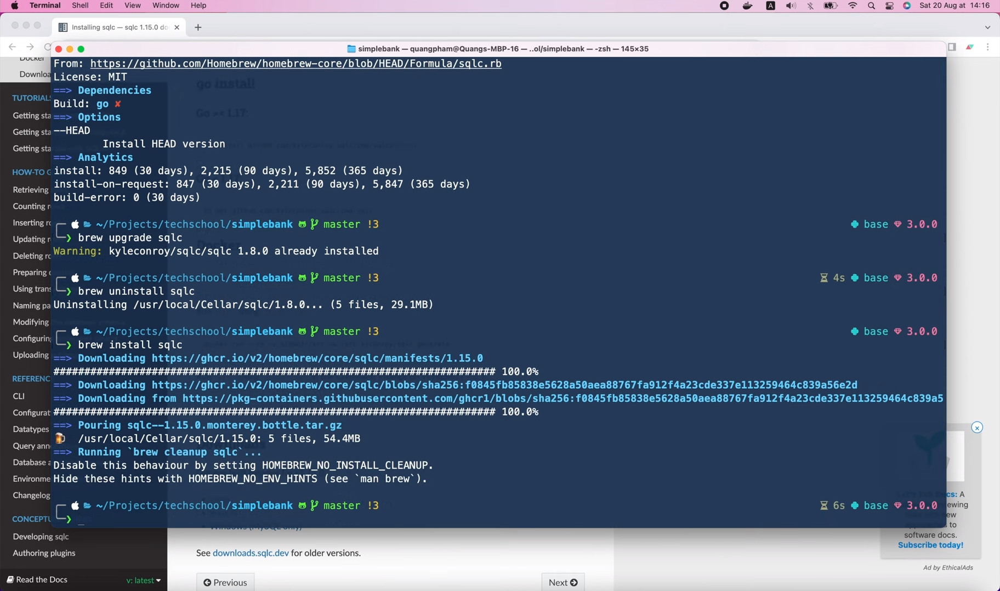
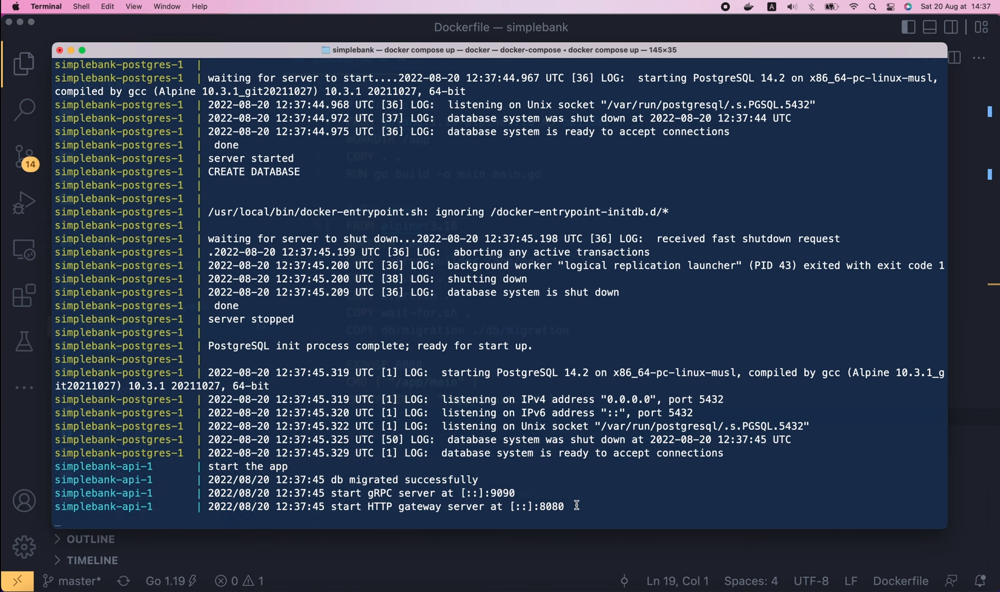

# Частичное обновление записи в БД, используя SQLC параметры, допускающие значение типа NULL

[Оригинал](https://www.youtube.com/watch?v=I2sbw1PzzW0)

Привет, ребята, добро пожаловать на мастер-класс по бэкенду. Сегодня мы 
узнаем, как осуществлять частичное обновление с помощью SQLC, а также
как работать с полями, допускающие значение типа NULL в Go. Хорошо, давайте 
начнем!

## Частичное обновление записи в БД. Первый способ

Если вы всё ещё помните, в лекции 16 курса мы добавили два SQL запроса для 
создания нового пользователя и извлечения пользователя по его `username`.

```postgresql
-- name: CreateUser :one
INSERT INTO users (
    username,
    hashed_password,
    full_name,
    email
) VALUES (
    $1, $2, $3, $4
) RETURNING *;

-- name: GetUser :one
SELECT * FROM users
WHERE username = $1 LIMIT 1;
```

Теперь предположим, что мы хотим создать новый запрос, который может 
обновлять некую информацию о нём, например, пароль, полное имя и фамилию и 
адрес электронной почты. Итак, я определю новый запрос под названием 
`UpdateUser`, который будет возвращать запись о пользователе после её 
обновления. Сначала мы напишем простой запрос `UPDATE users` для 
обновления всех полей сразу. Итак, давайте зададим для `hash_password` 
значение `$1`, что означает первый аргумент. Затем для `full_name`
значение `$2`, а для `email` — `$3`. И поскольку мы хотим обновить данные 
только одного конкретного пользователя давайте добавим условие 
`WHERE username = $4`. Наконец, мы используем оператор `RETURNING`, чтобы 
вернуть обновленную запись пользователя.

```postgresql
-- name: UpdateUser :one
UPDATE users
SET
    hashed_password = $1,
    full_name = $2,
    email = $3
WHERE
    username = $4
RETURNING *;
```

Хорошо, теперь мы можем запустить

```shell
make sqlc
```

в терминале, чтобы сгенерировать код Golang для этого нового запроса. 
Затем в Visual Studio Code, если мы откроем файл `user.sql.go`, то увидим,
что был добавлен новый метод `UpdateUser` с четырьмя входными параметрами, 
как мы указали в SQL запросе.

```go
type UpdateUserParams struct {
	HashedPassword string `json:"hashed_password"`
	FullName       string `json:"full_name"`
	Email          string `json:"email"`
	Username       string `json:"username"`
}

func (q *Queries) UpdateUser(ctx context.Context, arg UpdateUserParams) (User, error) {
	...
}
```

Такимп образом, очень легко обновить все эти поля одновременно. Но что, 
если мы просто хотим обновить только часть из них? Например, иногда 
пользователи просто хотят изменить пароль, а иногда им просто нужно обновить 
адрес электронной почты или полное имя и фамилию.

Как мы можем изменить наш SQL-запрос, чтобы такое поведение стало возможным?
Что ж, существует несколько решений. Простейшим из них было бы использование
некоторого логического параметра-флага, сообщающего базе данных, хотим ли
мы изменить конкретное поле или нет. Итак, здесь, вместо того, чтобы задать
для `hash_password` значение `$1`, я воспользуюсь оператором `CASE`, указав
условие. Когда логический флаг `$1` равен `TRUE`, мы приравняем 
`hashed_password` значению из второго параметра `$2`, в противном случае
когда флаг равен `FALSE`, мы просто оставим его равным исходному значению.

```postgresql
-- name: UpdateUser :one
UPDATE users
SET
    hashed_password = CASE
        WHEN $1 = TRUE THEN $2
        ELSE hashed_password
    END,
    full_name = $2,
    email = $3
WHERE
    username = $4
RETURNING *;
```

Таким образом, после внесения этих изменений, если мы хотим поменять
`hashed_password`, просто приравняйте `$1` к `TRUE` и укажите новое значение
в `$2`. Или, если мы не хотим менять `hashed_password`, просто задайте 
для `$1` значение `FALSE`. Давайте сделаем то же самое и для двух других
полей. Для `full_name`, когда `$3` равно `TRUE`, зададим для него значение
`$4`, в противном случае оставим исходное `full_name`. А для `email`, когда 
`$5` равно `TRUE`, установим его в `$6`, в противном случае оставим 
исходное значение `email`. Наконец, мы должны изменить параметр `username`
на `$7`. И на этом по сути всё.

```postgresql
-- name: UpdateUser :one
UPDATE users
SET
    hashed_password = CASE
        WHEN $1 = TRUE THEN $2
        ELSE hashed_password
    END,
    full_name = CASE
        WHEN $3 = TRUE THEN $4
        ELSE full_name
    END,
    email = CASE
        WHEN $5 = TRUE THEN $6
        ELSE email
    END
WHERE
    username = $7
RETURNING *;
```

Теперь мы можем опять выполнить в терминале 

```shell
make sqlc
```

чтобы повторно сгенерировать код.

Хорошо, давайте откроем файл `user.sql.go`.

```go
type UpdateUserParams struct {
	Column1        interface{} `json:"column_1"`
	HashedPassword string      `json:"hashed_password"`
	Column3        interface{} `json:"column_3"`
	FullName       string      `json:"full_name"`
	Column5        interface{} `json:"column_5"`
	Email          string      `json:"email"`
	Username       string      `json:"username"`
}

func (q *Queries) UpdateUser(ctx context.Context, arg UpdateUserParams) (User, error) {
	...
}
```

Как видите, структура `UpdateUserParams` изменилась. Помимо исходных четырёх 
полей, теперь у нас есть ещё три параметра-флага: `Column1`, `Column3` и 
`Column5`. Их названия ни о чём нам не говорят. А тип данных у них не 
логический, как можно было бы ожидать, а `interface{}`. Итак, как мы можем 
это исправить?

Что ж, если мы посмотрим на [страницу документации](https://docs.sqlc.dev/en/stable/howto/named_parameters.html)
`sqlc`, то там увидим раздел об именовании параметров. Здесь, чтобы 
сгенерированный код не содержал столбцов с названиями `Column`, мы можем
использовать функцию `sqlc.arg()`, чтобы указать необходимое нам название 
параметра, который сгенерирует SQLC. И мы можем использовать этот синтаксис 
с двойным двоеточием, чтобы сообщить SQLC точный тип данных этого параметра.

```sql
-- name: UpsertAuthorName :one
UPDATE author
SET
  name = CASE WHEN sqlc.arg(set_name)::bool
    THEN sqlc.arg(name)::text
    ELSE name
    END
RETURNING *;
```

Более того, мы можем упростить выражение, заменив функцию  `sqlc.arg()` 
оператором `@`, как показано в этом примере.

```sql
-- name: UpsertAuthorName :one
UPDATE author
SET
  name = CASE WHEN @set_name::bool
    THEN @name::text
    ELSE name
    END
RETURNING *;
```

Хорошо, давайте вернёмся к нашему коду. Я обновлю наш SQL-запрос, чтобы
он использовал именованные параметры. Здесь вместо `$1` я воспользуюсь
функцией `sqlc.arg()` и передам название параметра: `set_hashed_password`.
Затем использую двойное двоеточие, за которым следует его тип данных: 
`boolean`.

```postgresql
-- name: UpdateUser :one
UPDATE users
SET
    hashed_password = CASE
        WHEN sqlc.arg(set_hashed_password)::boolean = TRUE THEN $2
        ELSE hashed_password
    END,
```

Теперь, чтобы сделать запрос ещё проще, давайте заменим вызов функции 
`sqlc.arg()` оператором `@`.

```postgresql
-- name: UpdateUser :one
UPDATE users
SET
    hashed_password = CASE
        WHEN @set_hashed_password::boolean = TRUE THEN @hashed_password
        ELSE hashed_password
    END,
```

Таким образом, этот первый параметр становится равным `@set_hashed_password`,
а этот параметр `$2` — `@hashed_password`. Обратите внимание, что 
`hashed_password` без оператора `@` — это значение самого столбца 
`hashed_password`. Хорошо, теперь я обновлю остальные параметры таким
же образом.

Этот параметр `$3` станет равным `@set_full_name`, `$4` — `@full_name`,
затем параметр `$5` — `@set_email`, а `$6` — `@email`. Обратите внимание, 
что если мы используем оператор `@`, мы должны использовать его для всех 
параметров.

```postgresql
-- name: UpdateUser :one
UPDATE users
SET
    hashed_password = CASE
        WHEN @set_hashed_password::boolean = TRUE THEN @hashed_password
        ELSE hashed_password
    END,
    full_name = CASE
        WHEN @set_full_name = TRUE THEN @full_name
        ELSE full_name
    END,
    email = CASE
        WHEN @set_email = TRUE THEN @email
        ELSE email
    END
WHERE
    username = $7
RETURNING *;
```

Если мы смешаем его с позиционными параметрами, `sqlc` выдаст ошибку:
"query mixes positional parameters and named parameters" («в запросе смешаны
позиционные параметры и именованные параметры»).

```shell
make sqlc
# package db
db/query/user.sql:16:1: query mixes positional parameters ($1) and named parameters (sqlc.arg or @arg)
```

Чтобы её исправить, давайте изменим параметр `$7` на `@username`.

```postgresql
-- name: UpdateUser :one
UPDATE users
SET
    hashed_password = CASE
        WHEN @set_hashed_password::boolean = TRUE THEN @hashed_password
        ELSE hashed_password
    END,
    full_name = CASE
        WHEN @set_full_name = TRUE THEN @full_name
        ELSE full_name
    END,
    email = CASE
        WHEN @set_email = TRUE THEN @email
        ELSE email
    END
WHERE
    username = @username
RETURNING *;
```

На этот раз команда

```shell
make sqlc
```

будет успешно выполнена.

А в файле `user.sql.go` мы увидим, что все поля имеют названия, из которых 
понятно их назначение, точно такие же, как мы определили в SQL запросе.

```go
type UpdateUserParams struct {
	SetHashedPassword bool          `json:"set_hashed_password"`
	HashedPassword    string        `json:"hashed_password"`
	SetFullName       interface{}   `json:"set_full_name"`
	FullName          string        `json:"full_name"`
	SetEmail          interface{}   `json:"set_email"`
	Email             string        `json:"email"`
	Username          string        `json:"username"`
}

func (q *Queries) UpdateUser(ctx context.Context, arg UpdateUserParams) (User, error) {
	...
}
```

Тип поля `SetHashedPassword` теперь `boolean`, но `SetFullName` и 
`SetEmail` по-прежнему имеют тип `interface{}`. Это связано с тем, что мы
забыли указать ти п данных для этих параметров в SQL-запросе. Мы должны 
добавить `::boolean` к параметрам `@set_full_name` и `@set_email`.

```postgresql
-- name: UpdateUser :one
UPDATE users
SET
    hashed_password = CASE
        WHEN @set_hashed_password::boolean = TRUE THEN @hashed_password
        ELSE hashed_password
    END,
    full_name = CASE
        WHEN @set_full_name::boolean = TRUE THEN @full_name
        ELSE full_name
    END,
    email = CASE
        WHEN @set_email::boolean = TRUE THEN @email
        ELSE email
    END
WHERE
    username = @username
RETURNING *;
```

Затем сохраните файл и выполните команду

```shell
make sqlc
```

опять, чтобы повторно сгенерировать код.

На этот раз все поля-флаги имеют логический тип, как и ожидалось.

```go
type UpdateUserParams struct {
	SetHashedPassword bool   `json:"set_hashed_password"`
	HashedPassword    string `json:"hashed_password"`
	SetFullName       bool   `json:"set_full_name"`
	FullName          string `json:"full_name"`
	SetEmail          bool   `json:"set_email"`
	Email             string `json:"email"`
	Username          string `json:"username"`
}

func (q *Queries) UpdateUser(ctx context.Context, arg UpdateUserParams) (User, error) {
	...
}
```

Превосходно!

## Частичное обновление записи в БД. Второй способ

Итак, это первый способ, позволяющий реализовать частичное обновление
для нашего SQL-запроса. Его довольно легко реализовать, но это также 
делает запрос и структуру параметров немного длиннее и сложнее, чем раньше.
Теперь я покажу вам второй способ, который, как мне кажется, является 
лучшим решением. Он включает использование [параметров, допускающих значение
типа NULL](https://docs.sqlc.dev/en/stable/howto/named_parameters.html#nullable-parameters).
Идея аналогична, но на этот раз вместо использования отдельного логического 
флага мы будем использовать сам параметр. Если параметр равен `NULL`, это 
означает, что столбец не обновляется. Мы можем использовать функцию 
`sqlc.narg()`, чтобы сообщить компилятору SQLC, что этот параметр может 
быть `NULL`. А при обновлении значения мы будем использовать специальную 
функцию Postgres под названием `COALESCE`. Эта функция вернет первое 
не NULL значение в переданных входных параметрах.

```sql
-- name: UpdateAuthor :one
UPDATE author
SET
 name = coalesce(sqlc.narg('name'), name),
 bio = coalesce(sqlc.narg('bio'), bio)
WHERE id = sqlc.arg('id');
```

Таким образом, в этом примере, если параметр `name` не равен нулю, его 
значение будет использоваться как новое значение для столбца `name`. В 
противном случае будет использоваться исходное значение столбца `name`.

Хорошо, вернемся к нашему запросу `UpdateUser`. Здесь я заменю оператор 
`CASE` на `COALENSE()` и передам функцию `sqlc.narg()` в качестве первого 
параметра. Имя этого параметра должно быть `hashed_password`. Затем вторым 
параметром функции `COALESCE` должно быть исходное значение `hashed_password`.

```postgresql
UPDATE users
SET
    hashed_password = COALESCE(sqlc.narg(hashed_password), hashed_password),
```

Вот так, гораздо проще, чем раньше, не так ли? Далее, давайте сделаем то же 
самое для столбца `full_name`. Измените этот `CASE` на `COALESCE`, первым 
аргументом будет `sqlc.narg(full_name)`, а вторым аргументом будет исходное 
значение столбца `full_name`. Наконец, таким же образом я изменю параметр 
`email`. Здесь должно быть `COALESCE(sqlc.narg(email))`, за которым следует 
исходное значение столбца `email`. Поскольку SQLC не позволяет смешивать 
именованные параметры и оператор `@`, мы также должны изменить тут 
`@username` на `sqlc.arg(username)`. Обратите внимание, что здесь 
используется `arg` (не `narg`), потому что параметр `username` ни в коем 
случае не должен быть равен `NULL`.

```postgresql
-- name: UpdateUser :one
UPDATE users
SET
    hashed_password = COALESCE(sqlc.narg(hashed_password), hashed_password),
    full_name = COALESCE(sqlc.narg(full_name), full_name),
    email = COALESCE(sqlc.narg(email), email)
WHERE
    username = sqlc.arg(username)
RETURNING *;
```

Хорошо, теперь выполните в терминале

```shell
make sqlc
```

чтобы повторно сгенерировать код.

Ой, мы получили ошибку: `function "sqlc.narg" does not exist` (`функции 
"sqlc.narg" не существует`). Я думаю, она связана с тем, что мой компилятор 
`sqlc` устарел. Проверим его версию, запустив

```shell
sqlc version
```

Итак, моя текущая версия `sqlc` — `1.8`. Вы можете узнать его последнюю версию 
на GitHub странице релизов SQLC. Или, если вы используете Homebrew для 
установки пакета, вы можете узнать его последнюю версию с помощью команды

```shell
brew info sqlc
```

Итак, последняя стабильная версия — `1.15`. Это означает, что мой компилятор 
`sqlc` действительно устарел. Поэтому мы должны обновить его до последней 
версии. Вы можете просмотреть его [страницу документации](https://docs.sqlc.dev/en/stable/overview/install.html),
чтобы узнать, как это сделать в вашей ОС. Кстати, если вы используете 
Windows, вам следует установить `sqlc` с помощью Docker, а не с помощью
уже собранного бинарника. Вот команда для генерации Go кода из SQL-запроса 
с помощью Docker.

```shell
docker run --rm -v "%cd%:/src" -w /src kjconroy/sqlc generate
```

Поскольку я используя Mac OS, то мне следует выполнить в терминале

```shell
brew upgrade sqlc
```

чтобы обновить его до последней версии.

Странно, мы получили предупреждение: `sqlc 1.8 already installed` (`sqlc 
1.8 уже установлен`). Таким образом, обновления `sqlc` до версии `1.15` не 
произошло. Я думаю, что что-то не так с Homebrew. Давайте попробуем 
полностью удалить `sqlc`, запустив

```shell
brew uninstall sqlc
```

Затем переустановите его с помощью

```shell
brew install sqlc
```

Хорошо, теперь мы видим, что устанавливается последняя версия `1.15`.



Как только установка будет завершена, давайте проверим версию с помощью 
команды

```shell
sqlc version
v.1.15.0
```

Действительно, текущая версия `sqlc` сейчас `1.15`.

Итак, теперь компилятор должен знать о функции `sqlc.narg()`. 
Давайте опять выполним

```shell
make sqlc
```

чтобы посмотреть, что произойдёт.

```shell
make sqlc
sqlc generate
```

Вуаля, на этот раз ошибок больше нет. И в сгенерированном коде Golang мы 
видим, что `UpdateUserParams` изменился.

```go
type UpdateUserParams struct {
	HashedPassword sql.NullString `json:"hashed_password"`
	FullName       sql.NullString `json:"full_name"`
	Email          sql.NullString `json:"email"`
	Username       string         `json:"username"`
}

func (q *Queries) UpdateUser(ctx context.Context, arg UpdateUserParams) (User, error) {
	...
}
```

Тип полей `HashedPassword`, `FullName` и `Email` теперь равен 
`sql.NullString`, а не просто `string`, как раньше. На самом деле это 
структура с двумя полями: `String` и `Valid`, где `Valid` должно быть
`TRUE`, если `String` не равно `NULL`.

## Пишем тесты

Хорошо, не написать ли нам несколько тестов, чтобы лучше понять как
работать с этим новым типом данных?

В файл `user_test.go` я добавлю новую функцию для тестирования нового 
метода `UpdateUser`. Допустим, на этот раз мы хотим обновить только полное 
имя и фамилию пользователя. Во-первых, я создам пользователя, вызвав 
функцию `createRandomUser()`. Затем сгенерируем новое полное имя и фамилию 
с помощью `util.RandomOwner()`. Если это ваша первая лекция курса, то
можете обратиться и прочитать лекцию 5, чтобы понять, что делают эти 
случайные функции. Хорошо, теперь давайте вызовем 
`testQueries.UpdateUser()`, передадим фоновый контекст и объект 
`UpdateUserParams`. `Username` должно быть равно `oldUser.Username`, 
поскольку сейчас мы хотим обновить `FullName`. Но мы не можем просто 
передать `newFullName` здесь, потому что его тип – `string`, а тип 
поля `FullName` – `sql.NullString`. Итак, мы должны создать новый объект 
`sql.NullString{}`, и, как я уже говорил, нам нужно указать значения для
полей `String` и `Valid`. В этом случае значение `String` должно быть равно
`newFullName`, и, конечно же, `Valid` должно быть `TRUE`, так как
`String` не равна `null`. Нам не нужно ничего указывать для `HashedPassword` 
и `Email`, потому что по умолчанию их поле `Valid` будет `FALSE`, и, таким 
образом, они будут считаться равными `NULL`. Итак, после этого, функция 
вернет обновленного пользователя и ошибку.

```go
func TestUpdateUserOnlyFullName(t *testing.T) {
	oldUser := createRandomUser(t)

	newFullName := util.RandomOwner()
	updatedUser, err := testQueries.UpdateUser(context.Background(), UpdateUserParams{
		Username: oldUser.Username,
		FullName: sql.NullString{
			String: newFullName,
			Valid:  true,
		},
	})
}
```

Мы будем использовать функцию `require.NoError()`, чтобы проверить, равна 
ли ошибка `nil`. А затем проверяем, чтобы обновленное полное имя и фамилия 
пользователя не совпадает со старым именем и фамилией пользователя. Вместо 
этого полное имя и фамилия обновленного пользователя должно совпадать с 
новым полным именем и фамилией. Затем мы должны проверить, что `email` и 
`hashed_password` пользователя не изменились, так как в этом случае мы 
обновляем только полное имя и фамилию пользователя.

```go
func TestUpdateUserOnlyFullName(t *testing.T) {
    ...

	require.NoError(t, err)
	require.NotEqual(t, oldUser.FullName, updatedUser.FullName)
	require.Equal(t, newFullName, updatedUser.FullName)
	require.Equal(t, oldUser.Email, updatedUser.Email)
	require.Equal(t, oldUser.HashedPassword, updatedUser.HashedPassword)
}
```

Хорошо, теперь давайте запустим этот тест!

```shell
=== RUN   TestUpdateUserOnlyFullName
--- PASS: TestUpdateUserOnlyFullName (0.06s)
PASS
```

Он успешно пройден. Превосходно.

Теперь мы можем написать аналогичный тест для обновления только электронной 
почты пользователя. Итак, я продублирую предыдущий тест, изменю его название 
на `TestUpdateUserOnlyEmail`, здесь мы должны создать новый адрес 
электронной почты с помощью `util.RandomEmail()` и в этой структуре 
`UpdateUserParams` я поменяю поле на `Email`, и его строковое значение в 
`newEmail`.

```go
func TestUpdateUserOnlyEmail(t *testing.T) {
	oldUser := createRandomUser(t)

	newEmail := util.RandomEmail()
	updatedUser, err := testQueries.UpdateUser(context.Background(), UpdateUserParams{
		Username: oldUser.Username,
		Email: sql.NullString{
			String: newEmail,
			Valid:  true,
		},
	})
}
```

Затем мы должны проверить, что `oldUser.Email` не равно `updatedUser.Email`, 
но в то же время `updatedUser.Email` должно быть равно `newEmail`. И на этот
раз полное имя и фамилия пользователя должно остаться неизменным.

```go
func TestUpdateUserOnlyEmail(t *testing.T) {
	...

	require.NoError(t, err)
	require.NotEqual(t, oldUser.Email, updatedUser.Email)
	require.Equal(t, newEmail, updatedUser.Email)
	require.Equal(t, oldUser.FullName, updatedUser.FullName)
	require.Equal(t, oldUser.HashedPassword, updatedUser.HashedPassword)
}
```

Вот и всё!

Давайте запустим тест!

```shell
=== RUN   TestUpdateUserOnlyEmail
--- PASS: TestUpdateUserOnlyEmail (0.06s)
PASS
```

Он также успешно пройден. Превосходно!

Сможете ли вы самостоятельно добавить тест для обновления только пароля 
пользователя? Сейчас самое время приостановить чтение лекции и попробовать.
Написать такой тест довольно просто, не так ли?

Сначала дублируем предыдущую функцию, меняем её название на
`TestUpdateUserOnlyPassword`. Затем в ней мы создадим новый пароль с 
помощью `util.RandomString` из 6 символов. И мы вызываем `util.HashPassword`,
чтобы захешировать вновь сгенерированный пароль. Эта функция вернет 
`newHashedPassword` и ошибку. Мы проверяем, что ошибка равна `nil`,
затем в `UpdateUserParams` мы изменим название поля на `HashedPassword`, а 
его строковое значение на `newHashedPassword`.

```go
func TestUpdateUserOnlyPassword(t *testing.T) {
	oldUser := createRandomUser(t)

	newPassword := util.RandomString(6)
	newHashedPassword, err := util.HashPassword(newPassword)
	require.NoError(t, err)

	updatedUser, err := testQueries.UpdateUser(context.Background(), UpdateUserParams{
		Username: oldUser.Username,
		HashedPassword: sql.NullString{
			String: newHashedPassword,
			Valid:  true,
		},
	})
```

Как и раньше, мы проверим, что обновленный захешированный пароль 
пользователя отличается от старого. Но он должен быть равен значению 
`newHashedPassword`. И, наконец, как значение полного имени и фамилии, так 
и значение электронной почты должны остаться неизменными.

```go
func TestUpdateUserOnlyPassword(t *testing.T) {
    ...

	require.NoError(t, err)
	require.NotEqual(t, oldUser.HashedPassword, updatedUser.HashedPassword)
	require.Equal(t, newHashedPassword, updatedUser.HashedPassword)
	require.Equal(t, oldUser.FullName, updatedUser.FullName)
	require.Equal(t, oldUser.Email, updatedUser.Email)
}
```

Хорошо, теперь я запущу тест.

```shell
=== RUN   TestUpdateUserOnlyPassword
--- PASS: TestUpdateUserOnlyPassword (0.13s)
PASS
```

Он также успешно пройден. Вот так можно протестировать обновление каждого
поля по отдельности. После этого, мы напишем тест, который обновляет все три
поля одновременно!

Я продублирую предыдущий тест. Затем изменю его название на
`TestUpdateUserAllFields`. Теперь давайте сгенерируем новое полное имя и 
фамилию с помощью `util.RandomOwner()` и новый адрес электронной почты, 
используя `util.RandomEmail()`. Затем в функции `UpdateUser` я добавлю поле
`FullName` в виде новой структуры `sql.NullString`. Её значение `String` 
должно быть равно `newFullName`, а поле `Valid` — `TRUE`. Точно так же 
давайте добавим в объект поле `Email` и изменим его значение на `newEmail`.

```go
func TestUpdateUserAllFields(t *testing.T) {
	oldUser := createRandomUser(t)

	newFullName := util.RandomOwner()
	newEmail := util.RandomEmail()
	newPassword := util.RandomString(6)
	newHashedPassword, err := util.HashPassword(newPassword)
	require.NoError(t, err)

	updatedUser, err := testQueries.UpdateUser(context.Background(), UpdateUserParams{
		Username: oldUser.Username,
		FullName: sql.NullString{
			String: newFullName,
			Valid: true,
		},
		Email: sql.NullString{
			String: newEmail,
			Valid: true,
		},
		HashedPassword: sql.NullString{
			String: newHashedPassword,
			Valid:  true,
		},
	})
}
```

Хорошо, теперь в часть, где происходит проверка, я продублирую две 
команды `require` для `HashedPassword`. Мы должны убедиться, что пользователя
после обновления изменился адрес электронной почты. И обновленный адрес 
электронной почты пользователя должен совпадать с новым адресом электронной 
почты. То же самое для полного имени и фамилии, обновленное полное имя и 
фамилия пользователя не должны совпадать со старым значением. А вместо этого
оно должно быть равно новому полному имени и фамилии.

```go
func TestUpdateUserAllFields(t *testing.T) {
	...

	require.NoError(t, err)
	require.NotEqual(t, oldUser.HashedPassword, updatedUser.HashedPassword)
	require.Equal(t, newHashedPassword, updatedUser.HashedPassword)
	require.NotEqual(t, oldUser.Email, updatedUser.Email)
	require.Equal(t, newEmail, updatedUser.Email)
	require.NotEqual(t, oldUser.FullName, updatedUser.FullName)
	require.Equal(t, newFullName, updatedUser.FullName)
}
```

Хорошо, попробуем запустить тест.

```shell
=== RUN   TestUpdateUserAllFields
--- PASS: TestUpdateUserAllFields (0.12s)
PASS
```

Он также успешно пройден. Здорово!

Вот и всё, что я хотел вам рассказать на этой лекции. Мы узнали о хорошем 
способе реализации частичных обновлений с помощью с помощью Golang и SQLC, 
используя параметры, допускающие значение типа `NULL`, и функцию `COALESCE` 
в нашем запросе.

Я надеюсь, что вы узнали из лекции что-то полезное и интересное для себя!
Большое спасибо за время, потраченное на чтение! Желаю Вам получать
удовольствие от обучения и до встречи на следующей лекции!

## Обновляем Golang до версии 1.19

Да, и прежде, чем перейди к следующей лекции, я хотел бы вам кое-что 
показать, не слишком углубляясь в подробное описание. Недавно я обновил 
Golang компилятор в нашем проекте до версии 1.19.

```shell
go version
go version go1.19 darwin/amd64
```

Чтобы обновить версию Go, вам просто нужно открыть [go.dev](https://go.dev/),
перейти на [страницу Downloads](https://go.dev/dl/) и загрузить установочный
пакет для вашей конкретной ОС. После установки новой версии компилятора Go 
нам нужно обновить наш проект, чтобы использовать его. В файле `go.mod` 
давайте изменим версию Go на `1.19`.

```
module github.com/MaksimDzhangirov/backendBankExample

go 1.19
```

Затем в рабочем процессе GitHub CI, выполняющем модульные тесты, я также
изменю версию Go на 1.19.

```yaml
    steps:

      - name: Set up Go 1.x
        uses: actions/setup-go@v2
        with:
          go-version: ^1.19
        id: go
```

Нам не нужно ничего менять в рабочем процессе `deploy`, но необходимо
обновить базовый образ в `Dockerfile`. Мы можем использовать последний [образ
Golang](https://hub.docker.com/_/golang) из Docker Hub. Это версия 
`1.19-alpine3.16`. Итак, в нашем `Dockerfile` я обновлю базовый Docker 
образ для этапа сборки до этой версии.

```dockerfile
# Builds stage
FROM golang:1.19-alpine3.16 AS builder
WORKDIR /app
COPY . .
RUN go build -o main main.go
```

Наконец, базовый образ на этапе запуска также следует изменить на
`alpine:3.16`.

```dockerfile
# Run stage
FROM alpine3.16
WORKDIR /app
```

Хорошо, теперь в терминале, давайте запустим

```shell
go mod tidy
```

чтобы обновить пакеты, затем выполним

```shell
make test
```

чтобы запустить все модульные тесты и убедиться, что ничего не сломалось.

Наконец, нам нужно протестировать новый Docker образ с помощью 
`docker-compose`. Итак, я остановлю текущий контейнер Postgres. И выполню

```shell
docker compose up
```

чтобы заново собрать все образы и запустить сервисы.

Вуаля, сервер успешно стартовал.



Вот и всё! Спасибо, что дочитали до конца лекции. До свидания и до скорой 
встречи!