# Build gRPC update API with optional parameters

[Original video](https://www.youtube.com/watch?v=ygqSHIEc8sc)

Hello everyone, welcome back to the backend master class! In this 
lecture, we will learn how to use gRPC's optional parameters to build
an update-user API. As you're seen in the previous video, we can use the
SQLC's `null` argument and `COALESCE` function 

```postgresql
-- name: UpdateUser :one
UPDATE users
SET
    hashed_password = COALESCE(sqlc.narg(hashed_password), hashed_password),
    full_name = COALESCE(sqlc.narg(full_name), full_name),
    email = COALESCE(sqlc.narg(email), email)
WHERE
    username = sqlc.arg(username)
RETURNING *;
```

to partially update some fields of the user record in the database. So 
today, let's write a new gRPC endpoint to allow the front end to update
users' information.

## Creating a new gRPC endpoint

The first step would be writing the `proto` file for this new API. It
would be very similar to the `CreateUser` RPC. So, I'm gonna copy
the content of this `proto` file

```shell
cp proto/rpc_create_user.proto proto/rpc_update_user.proto
```

to a new file called `rpc_update_user.proto`.

Alright, now let's open the new file in Visual Studio Code. In this file,
we will define the request and response messages. I'm gonna change
their names to `UpdateUserRequest` and `UpdateUserResponse`.

Now, for request, its `username` should be a mandatory field, while the 
`full_name`, `email`, and `password` can be optional. The reason is that
users might want to update only 1 or 2 out of those 3 fields. So, how
can we tell `protoc` about this?

Well, since `protobuf` version `3.15`, we can use the `optional` keyword
to tell `protoc` that this field is not mandatory. So let's add it to all
3 optional fields: `full_name`, `email`, and `password`. We can keep the 
response message the same, as it will return the updated user object.

```protobuf
syntax = "proto3";

package pb;

import "user.proto";

option go_package = "github.com/techschool/simplebank/pb";

message UpdateUserRequest {
  string username = 1;
  optional string full_name = 2;
  optional string email = 3;
  optional string password = 4;
}

message UpdateUserResponse {
  User user = 1;
}
```

OK, next, we have to add a new RPC to the `SimpleBank` service. So I'm
gonna open this `service_simple_bank.proto` file, and import the 
`rpc_update_user.proto` file we've just written.

```protobuf
import "rpc_create_user.proto";
import "rpc_update_user.proto";
import "rpc_login_user.proto";
```

Then, inside the `SimpleBank` service, I'm gonna duplicate the RPC
`CreateUser`, change its name to `UpdateUser`, its input to 
`UpdateUserRequest`, and its output to `UpdateUserResponse`.

Now, since we're using gRPC gateway in our server to convert between
gRPC and HTTP requests, I'm gonna change this route to `patch 
/v1/update_user`. And finally, set the correct value for the description 
and summary of the swagger documentation.

```protobuf
rpc UpdateUser(UpdateUserRequest) returns (UpdateUserResponse) {
  option (google.api.http) = {
    patch: "/v1/update_user"
    body: "*"
  };
  option (grpc.gateway.protoc_gen_openapiv2.options.openapiv2_operation) = {
    description: "Use this API to update user";
    summary: "Update user";
  };
}
```

One thing we should do every time we make changes to the service is 
to bump its version. This will help us easily track what version is 
currently running on production.

```protobuf
option (grpc.gateway.protoc_gen_openapiv2.options.openapiv2_swagger) = {
  info: {
    title: "SimpleBank API";
    version: "1.2";
    contact: {
      name: "Tech School";
      url: "https://github.com/techschool";
      email: "techschool.guru@gmail.com";
    };
  };
};
```

Alright, now it's time to generate the code. But first, let's check
the current `protoc` version.

```shell
protoc --version
libprotoc 3.19.4
```

It's `3.19` on my side. You should make sure that your `protoc` 
version is at least `3.15`.

If you're on a Mac, it can be easily updated using the

```shell
brew upgrade protobuf
```

command.

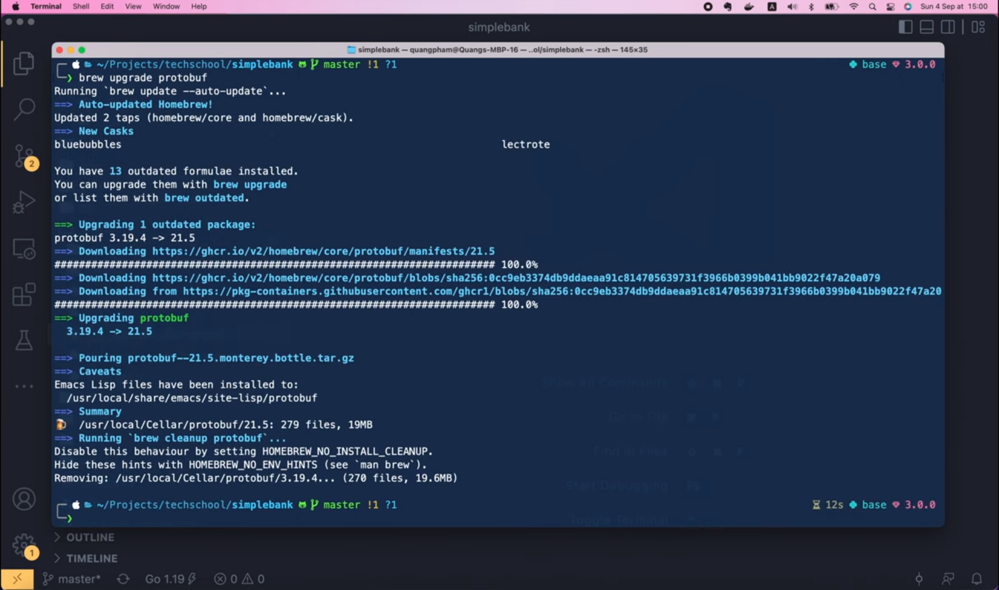

OK, so now my `protoc` has been updated to the latest version: `3.21`.

```shell
protoc --version
libprotoc 3.21.5
```

Let's run

```shell
make proto
```

to generate Golang codes.

Alright, now if we look into the `pb` folder, there's a new file
called `rpc_update_user.pb.go`. It contains the codes that
`protoc` generated for us. You can notice that it has the
`UpdateUserRequest` struct, and in this struct, the type of the
3 optional fields is a pointer to string, not just a normal
string as the mandatory field `Username`.

```go
type UpdateUserRequest struct {
	state         protoimpl.MessageState
	sizeCache     protoimpl.SizeCache
	unknownFields protoimpl.UnknownFields

	Username string  `protobuf:"bytes,1,opt,name=username,proto3" json:"username,omitempty"`
	FullName *string `protobuf:"bytes,2,opt,name=full_name,json=fullName,proto3,oneof" json:"full_name,omitempty"`
	Email    *string `protobuf:"bytes,3,opt,name=email,proto3,oneof" json:"email,omitempty"`
	Password *string `protobuf:"bytes,4,opt,name=password,proto3,oneof" json:"password,omitempty"`
}
```

If we scroll down a bit, we will see some methods of the struct
to get its internal data. For the `Username` it just checks
whether the request `x` is `nil` before returning `x.Username`.

```go
func (x *UpdateUserRequest) GetUsername() string {
	if x != nil {
		return x.Username
	}
	return ""
}
```

But for other optional fields like `FullName`, `Email`, or 
`Password`, besides checking if `x` is `nil`, it also checks
whether the corresponding pointer is `nil` or not. If it's 
not `nil`, then the value stored under the pointer will be 
returned.

```go
func (x *UpdateUserRequest) GetFullName() string {
	if x != nil && x.FullName != nil {
		return *x.FullName
	}
	return ""
}
```

So with this simple check, we will be able to tell whether the 
client wants to change the field's value or not.

OK, now we will learn how to use the generated code to implement
the `UpdateUser` API in our gRPC server.

It should be very similar to the `CreateUser` RPC that we 
implemented in the `gapi` folder.

So let's copy the content of this `rpc_create_user.go` file

```shell
cp gapi/rpc_create_user.go gapi/rpc_update_user.go
```

and rename it to `rpc_update_user.go`.

OK, back to Visual Studio Code.

In this new file, I'm gonna press Command + Shift + L to change
all occurrences of the `CreateUser` word to `UpdateUser`.

We can keep most of the codes the same. First we validate the
update user request. If violations is not `nil`, we return 
an invalid argument error. You can watch lecture 47 to understand
how it's implemented. Then here we're hashing the input password
because we don't want to store its plaintext value in the db. Note
that we don't have to do this if the password is not provided, but
I'll deal with that later. For now, let's see what needs to be 
changed in the `UpdateUserParams` object!

```go
func (server *Server) UpdateUser(ctx context.Context, req *pb.UpdateUserRequest) (*pb.UpdateUserResponse, error) {
	violations := validateUpdateUserRequest(req)
	if violations != nil {
		return nil, invalidArgumentError(violations)
	}

	hashedPassword, err := util.HashPassword(req.GetPassword())
	if err != nil {
		return nil, status.Errorf(codes.Internal, "failed to hash password: %s", err)
	}

	arg := db.UpdateUserParams{
		Username:       req.GetUsername(),
		HashedPassword: hashedPassword,
		FullName:       req.GetFullName(),
		Email:          req.GetEmail(),
	}
	
	...
}
```

Remember that `HashedPassword`, `FullName` and `Email` are all optional,
that's why their data type is not `string`, but `NullString` struct
instead. So I'm gonna delete them, then let's redeclare `FullName` as 
a `sql.NullString` object. Its string value should be set to 
`req.GetFullName()`. And its `Valid` field is only `true` if the
`req.FullName` is not `nil`, which means, its value is really provided
by the client.

```go
func (server *Server) UpdateUser(ctx context.Context, req *pb.UpdateUserRequest) (*pb.UpdateUserResponse, error) {
    ...

	arg := db.UpdateUserParams{
		Username:       req.GetUsername(),
		FullName: sql.NullString{
            String: req.GetFullName(),
            Valid: req.FullName != nil,
        },
	}
	
	...
}
```

Alright, now let's duplicate this chunk of codes, 

```go
FullName: sql.NullString{
    String: req.GetFullName(),
    Valid: req.FullName != nil,
},
```

and change the field name to `Email`, its `String` value to 
`req.GetEmail()` and its `Valid` field to: `req.Email` is not `nil`.

```go
Email: sql.NullString{
    String: req.GetEmail(),
    Valid:  req.Email != nil,
},
```

The last field we have to update is `HashedPassword`. I'm gonna cut
this piece of code from here.

```go
hashedPassword, err := util.HashPassword(req.GetPassword())
if err != nil {
    return nil, status.Errorf(codes.Internal, "failed to hash password: %s", err)
}
```

Then, after declaring the `UpdateUserParams` I'm gonna check if 
`req.Password` is not `nil`. Only in this case, then we will paste
in the code to hash the new input password. And we will set 
`arg.HashedPassword` to a new `sql.NullString` object, whose `String`
value should be the new `hashedPassword`, and `Valid` field should
be `true`, since we already checked that password is not `nil`.

```go
    if req.Password != nil {
		hashedPassword, err := util.HashPassword(req.GetPassword())
		if err != nil {
			return nil, status.Errorf(codes.Internal, "failed to hash password: %s", err)
		}

		arg.HashedPassword = sql.NullString{
			String: hashedPassword,
			Valid:  true,
		}
	}
```

OK, so now the update user argument is ready, we can call 
`server.store.UpdateUser` with that object. If this call returns a not 
`nil` error, we don't have to check if it's `unique_violation` like
in the `CreateUser` API, because in this `UpdateUser` API, we don't 
update the `Username`. But if the `Username` doesn't exist, we will
get a `sql.ErrNoRows` error. In this case, we should return an error 
with status code `NotFound`, and a message saying: "user not found".
If the error is something else, then we just return this internal error:
"failed to update user".

```go
if err != nil {
    if err == sql.ErrNoRows {
        return nil, status.Errorf(codes.NotFound, "user not found")
    }
    return nil, status.Errorf(codes.Internal, "failed to update user: %s", err)
}
```

Finally, when no errors occur, we simply create the `UpdateUserResponse`
object with the updated user record, and return it to the client.

```go
rsp := &pb.UpdateUserResponse{
    User: convertUser(user),
}
return rsp, nil
```

And that should be it for the `UpdateUser` RPC.

But there's one more thing we need to do to make it fully 
complete. That is, improving the way we validate the 
`UpdateUserRequest`, because in this API, there are 3 optional 
fields that can be `nil`. We can keep the `ValidateUsername`
the same, as it's a mandatory field. But for the `Password`,
since it's an optional field, we have to check if `req.Password`
is not `nil` before performing this validation.

```go
if req.Password != nil {
    if err := val.ValidatePassword(req.GetPassword()); err != nil {
        violations = append(violations, fieldViolation("password", err))
    }
}
```

The same thing should be done for the `FullName` and the `Email`
parameter as well.

```go
if req.FullName != nil {
    if err := val.ValidateFullName(req.GetFullName()); err != nil {
        violations = append(violations, fieldViolation("full_name", err))
    }
}

if req.Email != nil {
    if err := val.ValidateEmail(req.GetEmail()); err != nil {
        violations = append(violations, fieldViolation("email", err))
    }
}
```

OK, now I think the API is ready.

Let's open the terminal and start the server.

```shell
make server
```

## Using Postman for testing

As the server is serving both gRPC and HTTP requests, we can 
test it using any gRPC or HTTP client tool. I'm gonna use
Postman to send HTTP requests. And since the `UpdateUser` API
has the same set of parameters as `CreateUser` API, I'm gonna
duplicate this request

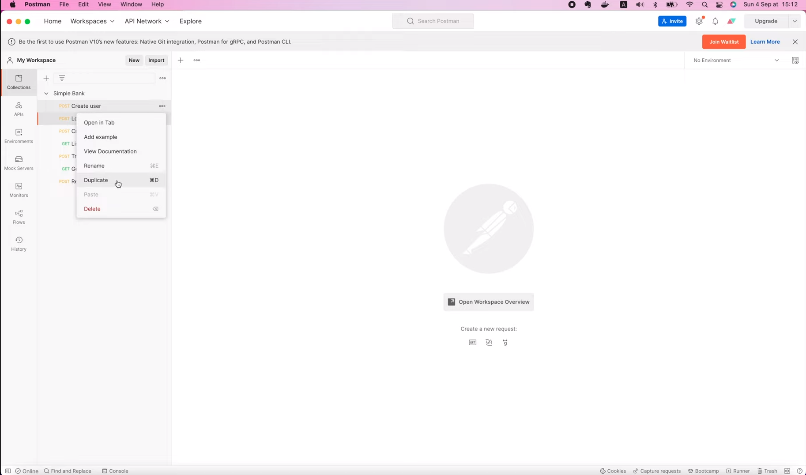

and change its name to `UpdateUser`.

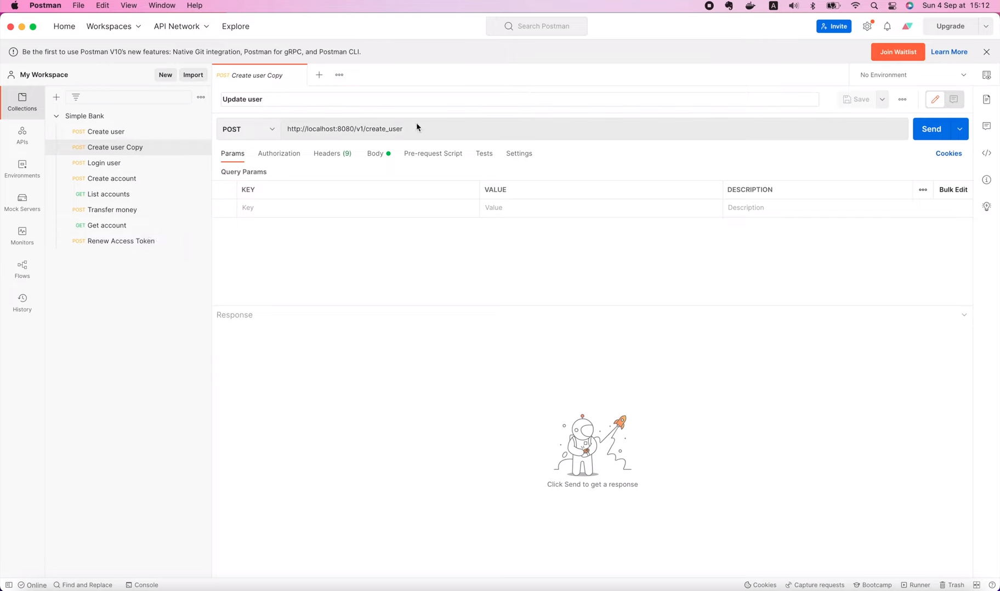

Then, in the body of the request, let's just keep the `username`,
and delete all other fields. Let's try sending this request
which doesn't update anything.

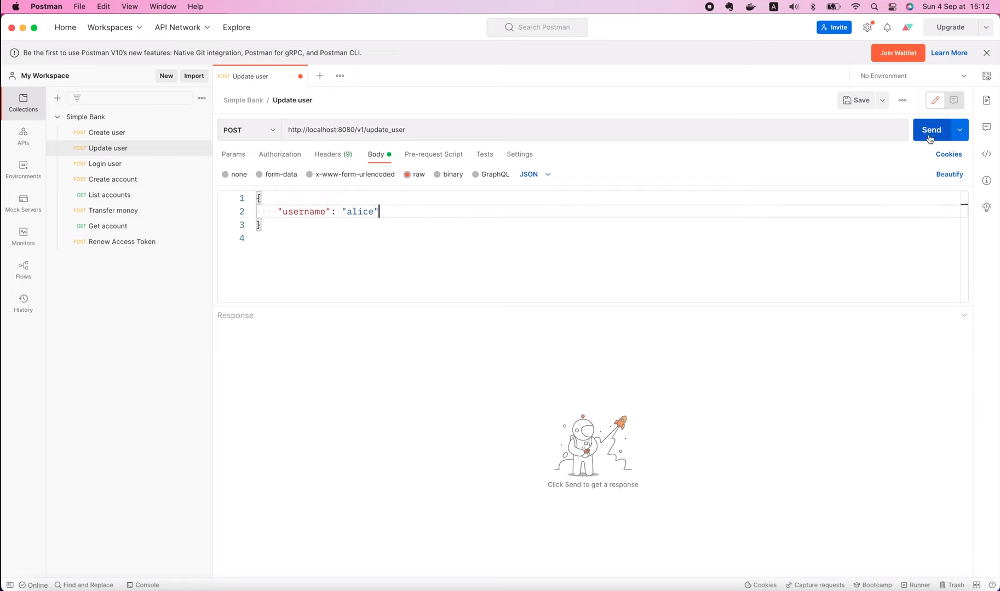

Oops, we've got a `Method Not Allowed` error.

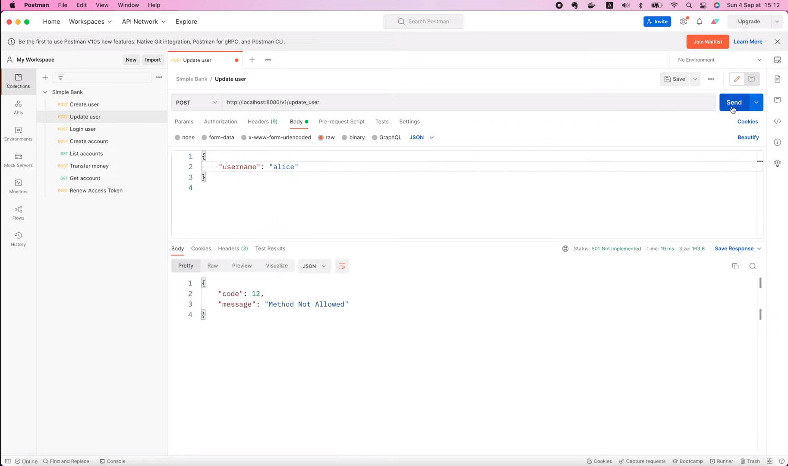

Ah, that's because I forgot to change the method from `POST` to
`PATCH`.

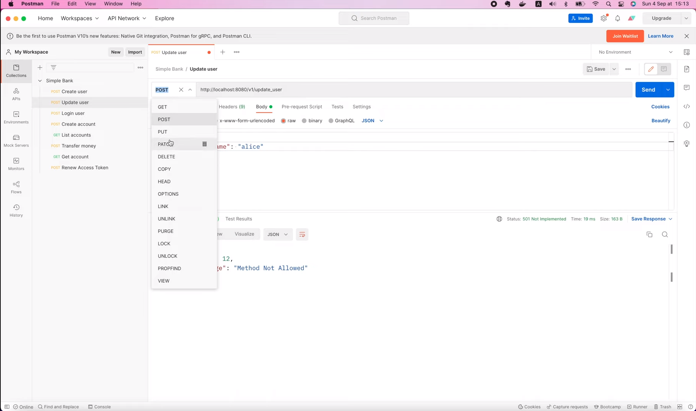

Alright, let's try again!

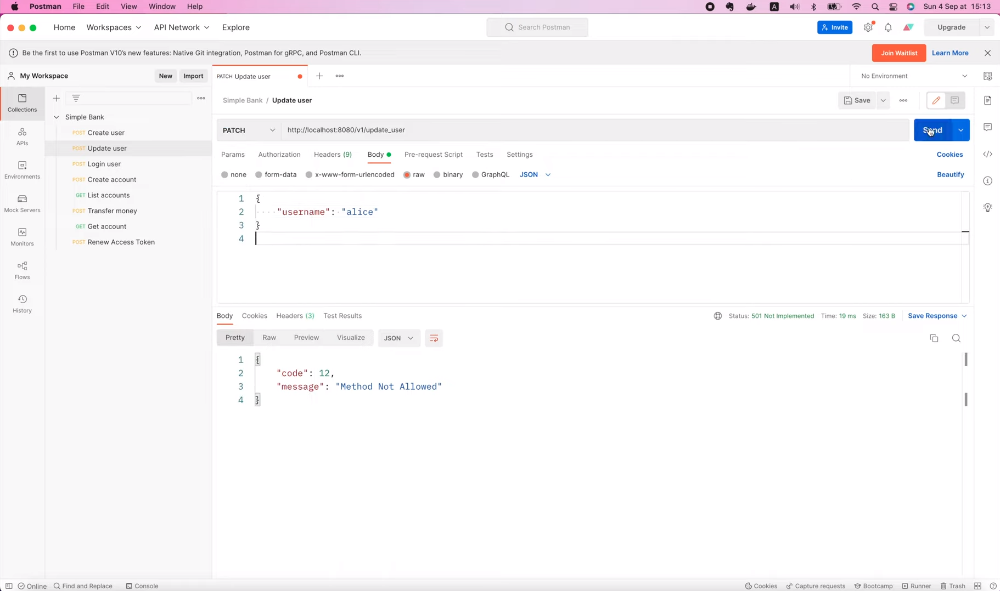

This time, we got another error: `user not found`.

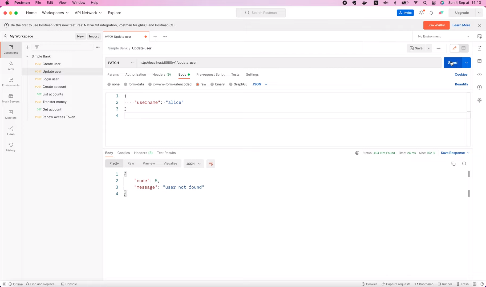

So it seems to be working, but we have to create the user 
`Alice` first. So I'm gonna open the `CreateUser` API, and send 
this request to the server.

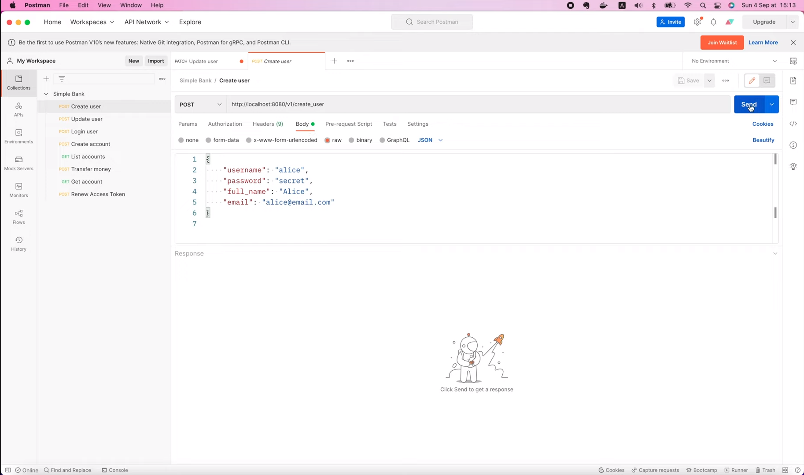

OK, now user `Alice` has been created,

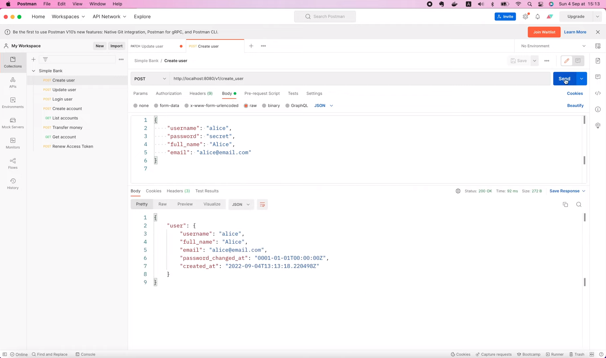

let's go back to the `UpdateUser` API, and send the request
again!

This time, the request is successful, and the user's data 
doesn't change, exactly as we expected.

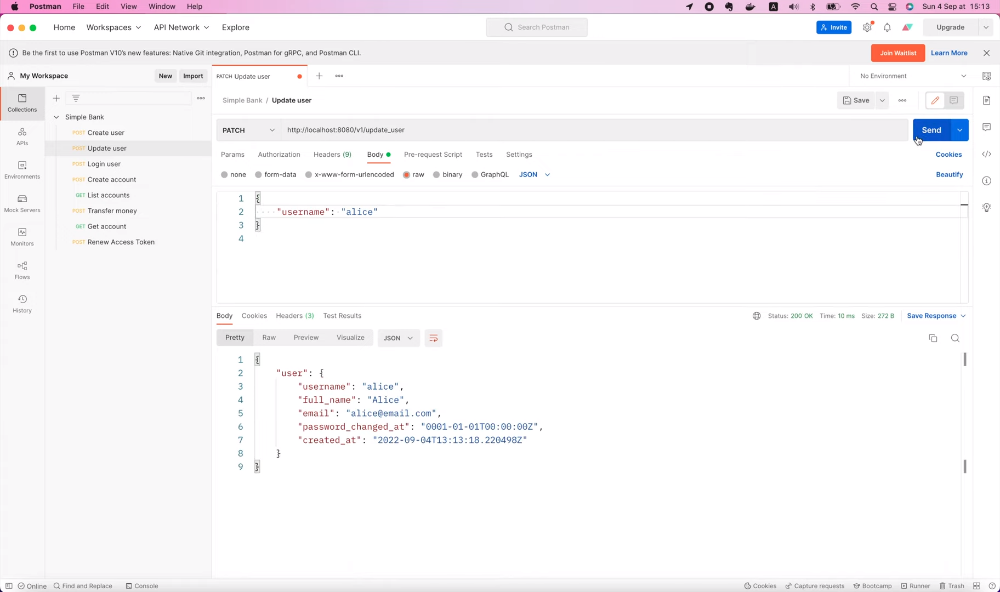

Now, let's try changing the `full_name` of this user to "New 
Alice", and resend the request!

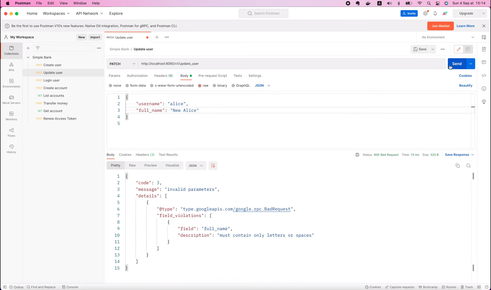

Oops, this time we've got a field violations error: `Full name
must contain only letters or spaces`. This is weird because
it is indeed containing only letters and spaces.

So I guess there's something wrong with our validation code.
Let's go back to the code, and open `ValidateFullName` function.
Then let's see what we have on the `isValidFullName` regular
expression. OK, I see! Here

```go
isValidFullName = regexp.MustCompile(`^[a-zA-Z\\s]+$`).MatchString
```

it should be only a single backslash followed by an `s` to 
represent a space character.

```go
isValidFullName = regexp.MustCompile(`^[a-zA-Z\s]+$`).MatchString
```

Alright, let's save the file, and restart the server.
OK, now back to Postman, and resend the request. This time,
the request is successful, and the user's full name has been 
updated to "New Alice".


All other fields are still the same. So that's the correct
behaviour. Next, let's try to update its email to 
"new_alice@gmail.com" and send the request.


As you can see, only the `email` field got updated this time.
Now, I'm gonna change only the password to "new_secret".

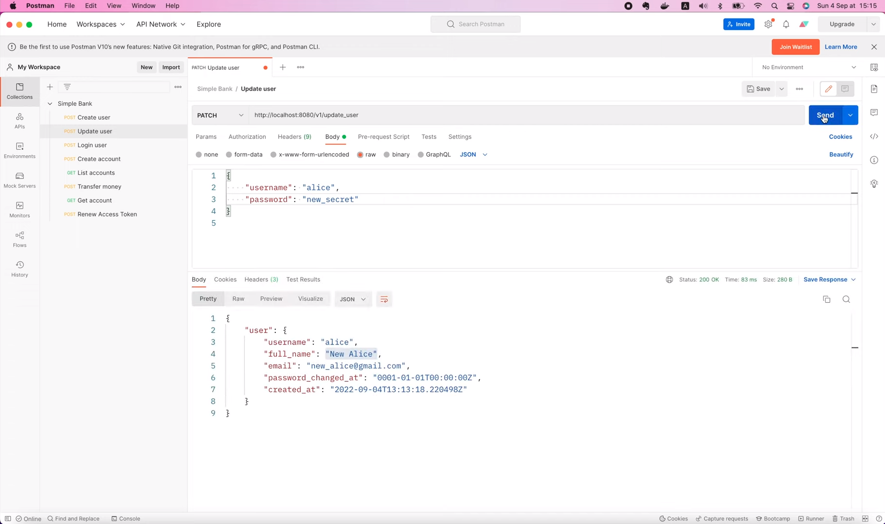

The request is also successful, but we don't know if the password
has been updated or not, since, for security reasons, the API 
doesn't return the value of the `hashed_password` field. And 
this `password_changed_at` field doesn't change either.

This is something we must fix. Whenever the password changes,
we should update the time it changes as well.

So let's get back to the code and fix it! Here in this 
`UpdateUser` handler function, if the password is not `nil`,
we also need to update the `password_changed_at` field.

So we have to change the `UpdateUser` SQL query to include
this field.

Let's open the `user.sql` file! I'm gonna duplicate this set
`hashed_password` statement,

```postgresql
-- name: UpdateUser :one
hashed_password = COALESCE(sqlc.narg(hashed_password), hashed_password),
```

then change the field name to `password_changed_at`. As we've
learned in previous lecture, we can use the `COALESCE` function
together with SQLC's nullable argument to tell the database
whether we want to change the value of this `password_changed_at`
field, or we just want to keep its original value.

```postgresql
-- name: UpdateUser :one
UPDATE users
SET
    hashed_password = COALESCE(sqlc.narg(hashed_password), hashed_password),
    password_changed_at = COALESCE(sqlc.narg(password_changed_at), password_changed_at),
    full_name = COALESCE(sqlc.narg(full_name), full_name),
    email = COALESCE(sqlc.narg(email), email)
WHERE
    username = sqlc.arg(username)
RETURNING *;
```

Alright, now we can save the SQL file, and run 

```shell
make sqlc
```

in the terminal to regenerate Golang code for it.

Note that every time we regenerate SQL codes, we should also 
run 

```shell
make mock
```

to update the mock `Store` as well.

OK, now the new code is generated, let's go back to our 
`UpdateUser` handler function.

Here, after setting `arg.HashedPassword` to the new value,
we should update the `PasswordChangedAt` field as well. 
It's also a nullable field, that's why its type is 
`sql.NullTime`. So, I'm gonna set `arg.PasswordChangedAt`
to a new `sql.NullTime` object, where its `Time` value should
be the current timestamp, and its `Valid` field should be set
to `true`. That's basically it!

```go
if req.Password != nil {
		hashedPassword, err := util.HashPassword(req.GetPassword())
		if err != nil {
			return nil, status.Errorf(codes.Internal, "failed to hash password: %s", err)
		}

		arg.HashedPassword = sql.NullString{
			String: hashedPassword,
			Valid:  true,
		}

		arg.PasswordChangedAt = sql.NullTime{
			Time: time.Now(),
			Valid: true,
		}
	}
```

Let's save the code, and restart the server.

Alright, now let's resend this request in Postman.

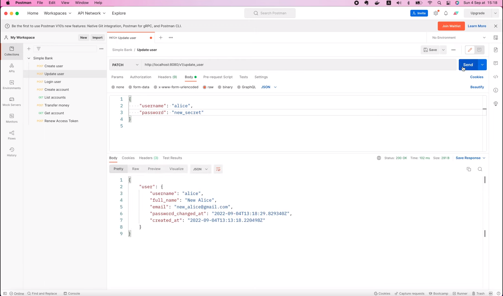

This time, the value of the `password_changed_at` field has
been updated. Excellent!

Now, how about we try to update all 3 fields at the same time?
I'm gonna set the full name to "Alice", the email to 
"alice@gmail.com", and the password to "secret". Then send the
request one more time.


Voilà! You can see that all the fields have been updated to the
new values. Awesome!

So today we've learned how to implement the `UpdateUser` gRPC
API using protocol buffer's optional parameters. However, this
API is not secured yet, so anyone can call it to update any
other user's data.

What we need to do next is, to add an authorization layer
to protect this API, so that only the real owner of the user
can update it. And that's exactly what we're gonna do in the
next video.

I hope you've learned something new and useful today. Thanks 
a lot for watching! Happy learning, and see you in the next
lecture!