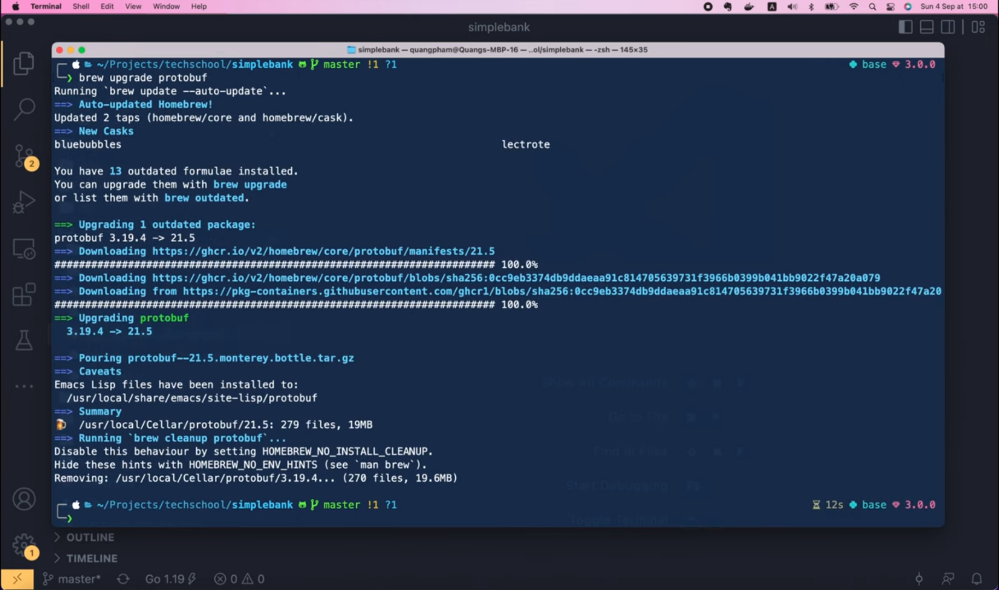
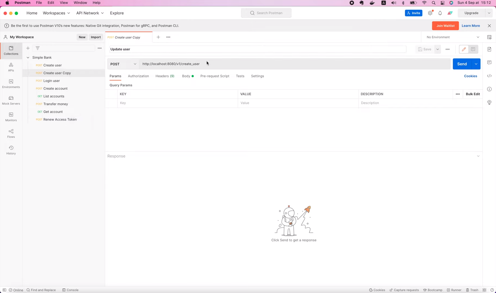
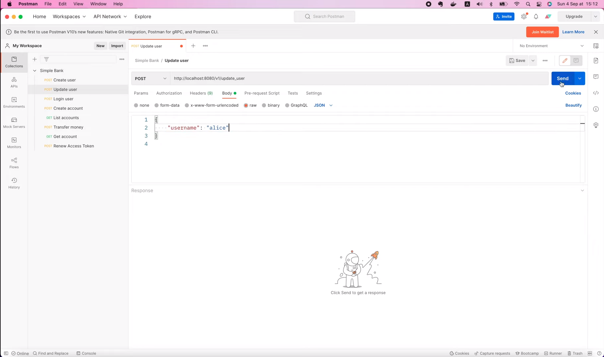
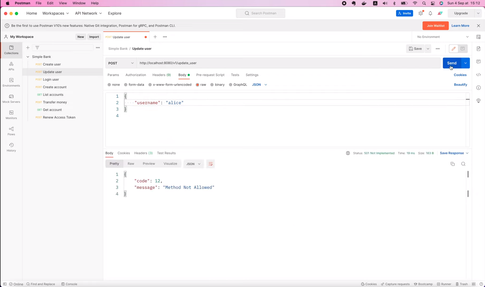
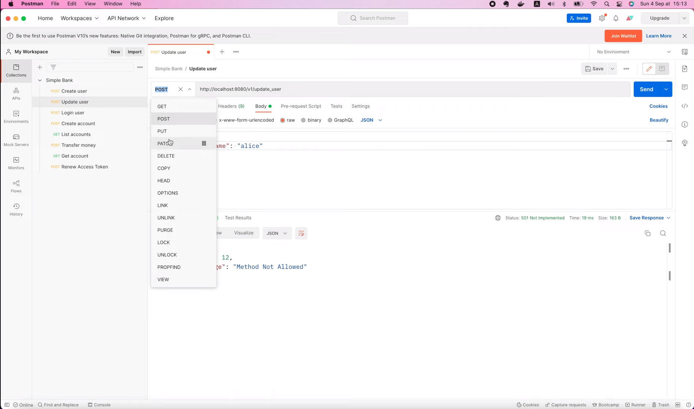
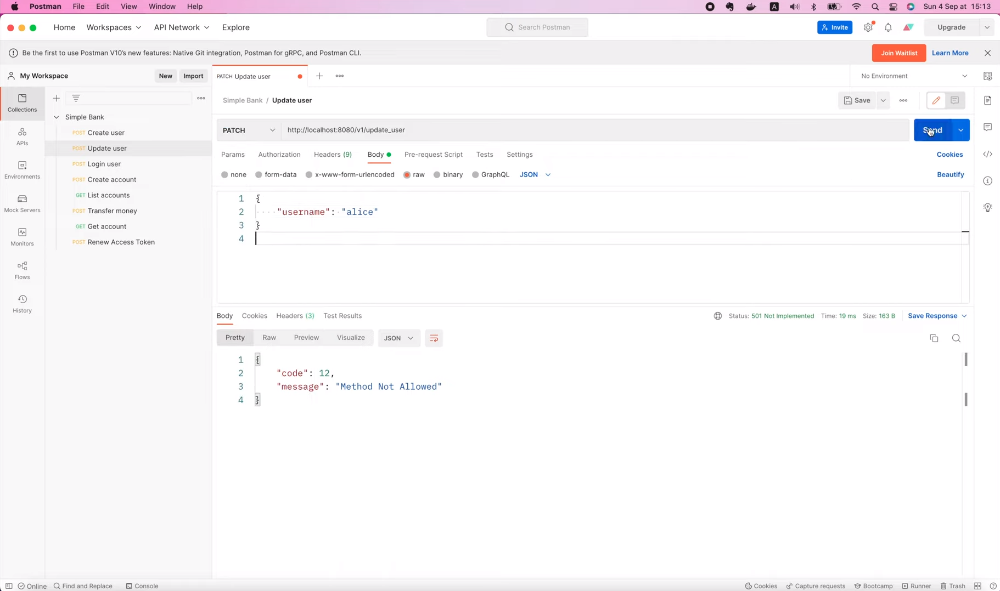
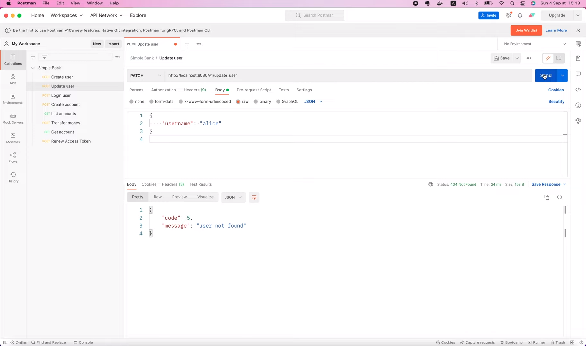
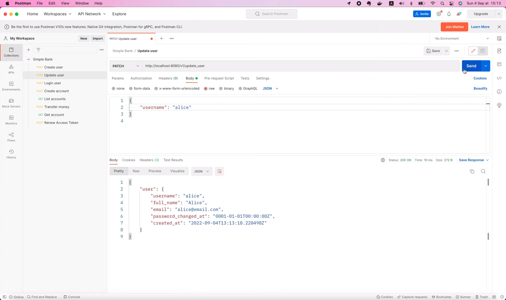
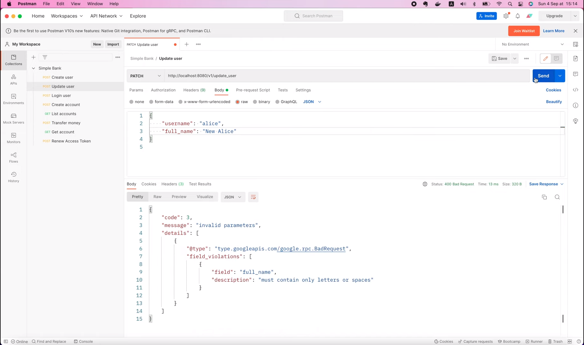
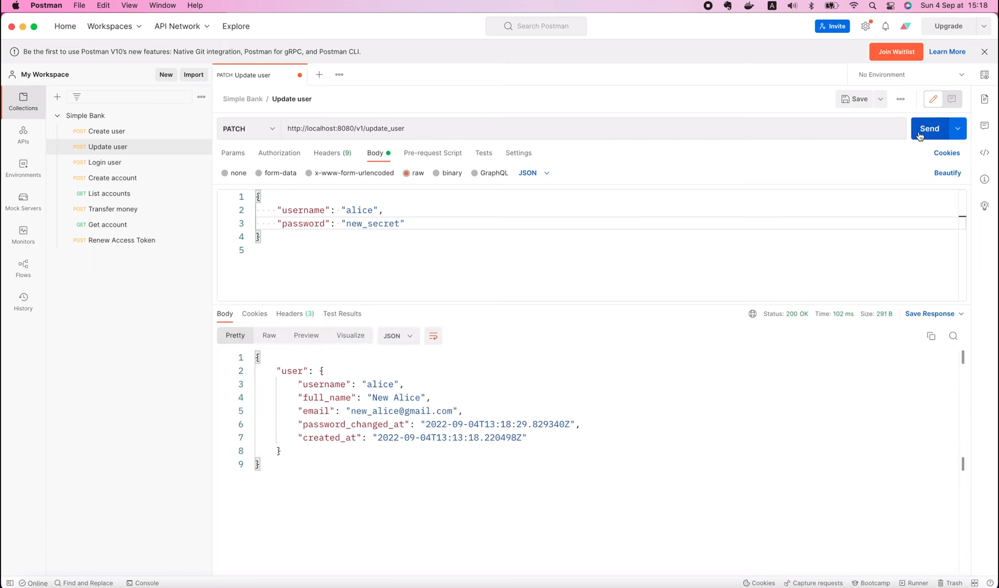

# Создаём gRPC API для обновления параметров пользователя с необязательными параметрами

[Оригинал](https://www.youtube.com/watch?v=ygqSHIEc8sc)

Всем привет, рад вас снова видеть на мастер-классе по бэкенду! На этой
лекции мы узнаем как использовать необязательные gRPC параметры для 
создания API обновления полей пользователя. Как вы уже видели на предыдущей
лекции, мы можем использовать функцию SQLC `narg` с аргументом `null` и 
`COALESCE`.

```postgresql
-- name: UpdateUser :one
UPDATE users
SET
    hashed_password = COALESCE(sqlc.narg(hashed_password), hashed_password),
    full_name = COALESCE(sqlc.narg(full_name), full_name),
    email = COALESCE(sqlc.narg(email), email)
WHERE
    username = sqlc.arg(username)
RETURNING *;
```

для частичного обновления некоторых полей записи о пользователе в базе
данных. Итак, на сегодняшней лекции, давайте реализуем новую gRPC конечную
точку, чтобы фронтэнд мог обновлять информацию о пользователях.

## Создаём новую gRPC конечную точку

Первым шагом будет написание `proto` файла для этого нового API. Он будет
очень похож на `CreateUser` RPC. Итак, я скопирую содержимое этого `proto`
файла 

```shell
cp proto/rpc_create_user.proto proto/rpc_update_user.proto
```

в новый файл под названием `rpc_update_user.proto`.

Хорошо, теперь давайте откроем новый файл в Visual Studio Code. В этом 
файле мы определим сообщения для запроса и ответа. Я изменю их названия 
на `UpdateUserRequest` и `UpdateUserResponse`.

Теперь для запроса его `username` должно быть обязательным полем, а
`full_name`, `email`, и `password` могут быть необязательными. Дело в том,
что пользователи могут захотеть обновить только одно или два из этих
трёх полей. Итак, как мы можем сообщить об этом `protoc`?

Что ж, начиная с версии `protobuf` `3.15`, мы можем использовать ключевое 
слово `optional`, чтобы сообщить `protoc`, что это поле не является 
обязательным. Итак, давайте добавим его для всех трёх необязательных 
полей: `full_name`, `email` и `password`. Мы можем не изменять сообщение
ответа от сервера, так как оно будет возвращать обновленный объект 
пользователя.

```protobuf
syntax = "proto3";

package pb;

import "user.proto";

option go_package = "github.com/techschool/simplebank/pb";

message UpdateUserRequest {
  string username = 1;
  optional string full_name = 2;
  optional string email = 3;
  optional string password = 4;
}

message UpdateUserResponse {
  User user = 1;
}
```

Хорошо, теперь нам нужно добавить новый RPC в сервис `SimpleBank`. 
Поэтому я открою файл `service_simple_bank.proto` и импортирую
`rpc_update_user.proto`, который мы только что создали.

```protobuf
import "rpc_create_user.proto";
import "rpc_update_user.proto";
import "rpc_login_user.proto";
```

Затем внутри сервиса `SimpleBank` я продублирую RPC CreateUser, изменю его
название на `UpdateUser`, входные данные — на `UpdateUserRequest`, а 
результат — на `UpdateUserResponse`.

Теперь, поскольку мы используем gRPC шлюз на нашем сервере для 
преобразования gRPC и HTTP запросов, я изменю этот маршрут на 
`patch /v1/update_user`. И, наконец, зададим соответствующие краткое и 
полное описание для swagger документации.

```protobuf
rpc UpdateUser(UpdateUserRequest) returns (UpdateUserResponse) {
  option (google.api.http) = {
    patch: "/v1/update_user"
    body: "*"
  };
  option (grpc.gateway.protoc_gen_openapiv2.options.openapiv2_operation) = {
    description: "Use this API to update user";
    summary: "Update user";
  };
}
```

Каждый раз, когда мы вносим изменения в сервис, мы должны модифицировать его 
версию. Это поможет нам легко отслеживать, какая версия сейчас работает на 
продакшене.

```protobuf
option (grpc.gateway.protoc_gen_openapiv2.options.openapiv2_swagger) = {
  info: {
    title: "SimpleBank API";
    version: "1.2";
    contact: {
      name: "Tech School";
      url: "https://github.com/techschool";
      email: "techschool.guru@gmail.com";
    };
  };
};
```

Хорошо, теперь можно сгенерировать код. Но сначала давайте проверим 
текущую версию `protoc`. 

```shell
protoc --version
libprotoc 3.19.4
```

У меня она равна `3.19`. Убедитесь, что у вас установлена версия `protoc` не
ниже `3.15`.

Если вы используете Mac, его можно легко обновить с помощью команды

```shell
brew upgrade protobuf
```



Итак, теперь мой `protoc` обновлен до последней версии: `3.21`.

```shell
protoc --version
libprotoc 3.21.5
```

Давайте выполним команду

```shell
make proto
```

чтобы сгенерировать Golang код.

Хорошо, теперь, если мы заглянем в папку `pb`, то увидим, что там появился 
новый файл под названием `rpc_update_user.pb.go`. Он содержит код, 
сгенерированный для нас `protoc`. Обратите внимание, на структуру 
`UpdateUserRequest`, и в ней тип трёх необязательных полей — это
указатель на строку, а не просто обычная строка как для обязательного 
поля `Username`.

```go
type UpdateUserRequest struct {
	state         protoimpl.MessageState
	sizeCache     protoimpl.SizeCache
	unknownFields protoimpl.UnknownFields

	Username string  `protobuf:"bytes,1,opt,name=username,proto3" json:"username,omitempty"`
	FullName *string `protobuf:"bytes,2,opt,name=full_name,json=fullName,proto3,oneof" json:"full_name,omitempty"`
	Email    *string `protobuf:"bytes,3,opt,name=email,proto3,oneof" json:"email,omitempty"`
	Password *string `protobuf:"bytes,4,opt,name=password,proto3,oneof" json:"password,omitempty"`
}
```

Если мы прокрутим немного вниз, мы увидим некоторые методы структуры 
для получения ее внутренних данных. Для `Username` он просто проверяет, 
не равен ли запрос `x` `nil`, прежде чем вернуть `x.Username`.

```go
func (x *UpdateUserRequest) GetUsername() string {
	if x != nil {
		return x.Username
	}
	return ""
}
```

Но для других необязательных полей, таких как `FullName`, `Email` или 
`Password`, помимо проверки `x` на `nil`, он также проверяет, 
равен ли соответствующий указатель `nil` или нет. Если нет, то будет 
возвращено значение, хранящееся в указателе.

```go
func (x *UpdateUserRequest) GetFullName() string {
	if x != nil && x.FullName != nil {
		return *x.FullName
	}
	return ""
}
```

Таким образом, с помощью такой простой проверки мы сможем определить, 
хочет ли клиент изменить значение поля или нет.

Хорошо, теперь давайте узнаем, как использовать сгенерированный код для 
реализации `UpdateUser` API на нашем gRPC сервере.

Он должен быть очень похож на RPC CreateUser, который мы реализовали в 
папке `gapi`.

Итак, давайте скопируем содержимое этого файла `rpc_create_user.go`

```shell
cp gapi/rpc_create_user.go gapi/rpc_update_user.go
```

и переименуем его в `rpc_update_user.go`.

Хорошо, вернемся в Visual Studio Code.

В этом новом файле я нажму Command + Shift + L, чтобы заменить все найденные 
слова `CreateUser` на `UpdateUser`.

Мы можем не изменять большую часть кода. Сначала мы проверяем на наличие 
ошибок запрос на обновление данных пользователя. Если найденные нарушения
правил не равны `nil`, то мы возвращаем ошибку о недопустимом значении
аргумента. Вы можете посмотреть лекцию 47, чтобы понять, как это 
реализовано. Затем здесь мы хешируем входной пароль, потому что не хотим
хранить его значение в открытом виде в БД. Обратите внимание, что нам не 
нужно делать этого, если пароль не указан, но я займусь этим случаем позже.
А пока посмотрим, что нужно изменить в объекте `UpdateUserParams`!

```go
func (server *Server) UpdateUser(ctx context.Context, req *pb.UpdateUserRequest) (*pb.UpdateUserResponse, error) {
	violations := validateUpdateUserRequest(req)
	if violations != nil {
		return nil, invalidArgumentError(violations)
	}

	hashedPassword, err := util.HashPassword(req.GetPassword())
	if err != nil {
		return nil, status.Errorf(codes.Internal, "failed to hash password: %s", err)
	}

	arg := db.UpdateUserParams{
		Username:       req.GetUsername(),
		HashedPassword: hashedPassword,
		FullName:       req.GetFullName(),
		Email:          req.GetEmail(),
	}
	
	...
}
```

Вспомните, что `HashedPassword`, `FullName` и `Email` являются 
необязательными, поэтому их тип данных не `string`, а структура `NullString`.
Итак, я их удалю, а затем давайте переобъявим `FullName` как объект 
`sql.NullString`. Его строковое значение должно быть задано равным 
`req.GetFullName()`. И его поле `Valid` должно быть равно `true` только в 
том случае, если `req.FullName` не равно `nil`, то есть значение `FullName`
действительно было передано клиентом.

```go
func (server *Server) UpdateUser(ctx context.Context, req *pb.UpdateUserRequest) (*pb.UpdateUserResponse, error) {
    ...

	arg := db.UpdateUserParams{
		Username:       req.GetUsername(),
		FullName: sql.NullString{
            String: req.GetFullName(),
            Valid: req.FullName != nil,
        },
	}
	
	...
}
```

Хорошо, теперь давайте продублируем этот фрагмент кода,

```go
FullName: sql.NullString{
    String: req.GetFullName(),
    Valid: req.FullName != nil,
},
```

и измените название поля на `Email`, его значение `String` на
`req.GetEmail()` и поле `Valid` на: `req.Email` не равно `nil`.

```go
Email: sql.NullString{
    String: req.GetEmail(),
    Valid:  req.Email != nil,
},
```

Последнее поле, которое мы должны обновить, это `HashedPassword`. Я 
вырежу этот фрагмент кода отсюда.

```go
hashedPassword, err := util.HashPassword(req.GetPassword())
if err != nil {
    return nil, status.Errorf(codes.Internal, "failed to hash password: %s", err)
}
```

Затем, после объявления `UpdateUserParams`, я проверю, не равен ли 
`req.Password` `nil`. Только в этом случае мы вставим код для хеширования 
нового входного пароля. И мы присвоим `arg.HashedPassword` значение
объекта `sql.NullString`, в котором `String` должно быть равно новому 
`hashedPassword`, а поле `Valid` должно быть `true`, так как мы уже 
проверили, что пароль не `nil`.

```go
    if req.Password != nil {
		hashedPassword, err := util.HashPassword(req.GetPassword())
		if err != nil {
			return nil, status.Errorf(codes.Internal, "failed to hash password: %s", err)
		}

		arg.HashedPassword = sql.NullString{
			String: hashedPassword,
			Valid:  true,
		}
	}
```

Итак, теперь когда аргумент для обновления параметров пользователя готов,
мы можем вызвать `server.store.UpdateUser`, используя этот объект. Если
этот вызов возвращает не `nil` ошибку, нам не нужно проверять равна ли 
она `unique_violation`, как в `CreateUser` API, поскольку в этом `UpdateUser`
API, мы не обновляем `Username`. Но если переданного `Username` не 
существует в таблице, мы получим ошибку `sql.ErrNoRows`. В этом случае мы
должны вернуть ошибку с кодом состояния `NotFound` и сообщением, гласящим:
"user not found" («пользователь не найден»). Если произошла какая-нибудь 
другая ошибка, то мы просто возвращаем следующую внутреннюю ошибку: "failed 
to update user" («не удалось обновить пользователя»).

```go
if err != nil {
    if err == sql.ErrNoRows {
        return nil, status.Errorf(codes.NotFound, "user not found")
    }
    return nil, status.Errorf(codes.Internal, "failed to update user: %s", err)
}
```

Наконец, когда ошибок не возникает, мы просто создаем объект 
`UpdateUserResponse` с обновленной записью о пользователе и возвращаем 
его клиенту.

```go
rsp := &pb.UpdateUserResponse{
    User: convertUser(user),
}
return rsp, nil
```

И этого должно быть достаточно для `UpdateUser` RPC.

Но на самом деле мы должно сделать ещё кое-что. А именно улучшить 
способ проверки `UpdateUserRequest`, поскольку в этом API есть 3 
необязательных поля, которые могут быть `nil`. Мы можем не менять 
`ValidateUsername`, так как это обязательное поле. Но для `Password`, 
поскольку это необязательное поле, мы должны проверить, не равен 
ли `req.Password` `nil` перед выполнением этой проверки.

```go
if req.Password != nil {
    if err := val.ValidatePassword(req.GetPassword()); err != nil {
        violations = append(violations, fieldViolation("password", err))
    }
}
```

То же самое нужно сделать для параметров `FullName` и `Email`.

```go
if req.FullName != nil {
    if err := val.ValidateFullName(req.GetFullName()); err != nil {
        violations = append(violations, fieldViolation("full_name", err))
    }
}

if req.Email != nil {
    if err := val.ValidateEmail(req.GetEmail()); err != nil {
        violations = append(violations, fieldViolation("email", err))
    }
}
```

Хорошо, теперь я думаю, что API готово к использованию.

Давайте откроем терминал и запустим сервер.

```shell
make server
```

## Используем Postman для тестирования

Поскольку сервер может обслуживать как gRPC, так и HTTP запросы, мы
можем протестировать его с помощью любого gRPC или HTTP клиента. Я 
буду использовать Postman для отправки HTTP-запросов. А так как 
`UpdateUser` API имеет тот же набор параметров, что и `CreateUser` API, 
я продублирую этот запрос


и изменю его название на `UpdateUser`.



Затем в теле запроса давайте оставим `username` и удалим все 
остальные поля. Попробуем отправить этот запрос, который ничего не 
обновляет.



Ой, мы получили ошибку `Method Not Allowed`.



Она возникла, потому что я забыл изменить метод с `POST` на `PATCH`.



Хорошо, попробуем еще раз!



На этот раз мы получили другую ошибку: `user not found` («пользователь не
найден»).



Вроде бы API работает, но сначала нам нужно создать пользователя `Alice`.
Итак, я открою API CreateUser и отправлю следующий запрос на сервер.


OK, теперь когда пользователь `Alice` был создан,


давайте вернёмся к `UpdateUser` API и отправим запрос ещё раз!

На этот раз запрос успешно выполнен, и данные пользователя не изменились, 
как мы и ожидали.



Теперь давайте попробуем изменить `full_name` этого пользователя на
"New Alice" и повторно отправим запрос!



На этот раз возникла ошибка нарушения правил для поля: `Full name
must contain only letters or spaces` («Полное имя и фамилия должно содержать
только буквы или пробелы»). Странно, потому что оно на самом деле
содержит только буквы и пробелы.

Итак, я предполагаю, что что-то не так с нашим кодом проверки. Давайте
вернемся к коду и откроем функцию `ValidateFullName`. Затем обратим 
внимание на регулярное выражение `isValidFullName`. О, я понял в чём дело!
Здесь

```go
isValidFullName = regexp.MustCompile(`^[a-zA-Z\\s]+$`).MatchString
```

должна быть только одна обратная косая черта, за которой следует `s` 
для обозначения любого пробельного символа.

```go
isValidFullName = regexp.MustCompile(`^[a-zA-Z\s]+$`).MatchString
```

Хорошо, давайте сохраним файл и перезапустим сервер. OK, теперь вернёмся
в Postman и повторно отправим запрос. На этот раз запрос выполнен 
успешно и полное имя и фамилия пользователя было изменено на "New Alice".


Все остальные поля не изменились. И это правильное поведение. Далее 
попробуем обновить почту пользователя на "new_alice@gmail.com" и 
отправим запрос.


Как видите, на этот раз обновилось только поле `email`. Теперь я изменю 
только пароль на "new_secret".


Запрос также выполнен успешно, но мы не знаем, был ли обновлен пароль или 
нет, так как из соображений безопасности API не возвращает значение 
поля `hashed_password`. И поле `password_changed_at` тоже не изменилось.

Это необходимо исправить. Всякий раз, когда пароль меняется, мы также 
должны обновлять время его изменения.

Итак, давайте вернёмся к коду и исправим это! Здесь, в этой 
функции-обработчике `UpdateUser`, если пароль не `nil`, нам также нужно 
обновить поле `password_changed_at`.

Поэтому нам нужно изменить SQL-запрос `UpdateUser`, чтобы добавить 
это поле.

Давайте откроем файл `user.sql`! Я скопирую эту команду для присваивания 
нового значения `hashed_password`

```postgresql
-- name: UpdateUser :one
hashed_password = COALESCE(sqlc.narg(hashed_password), hashed_password),
```

затем изменю название поля на `password_changed_at`. Как мы узнали из
предыдущей лекции, можно использовать функцию `COALESCE` вместе с 
аргументом SQLC, допускающим значение типа NULL, чтобы сообщить базе 
данных, хотим ли мы изменить значение этого поля `password_changed_at`, 
или просто сохранить его исходное значение.

```postgresql
-- name: UpdateUser :one
UPDATE users
SET
    hashed_password = COALESCE(sqlc.narg(hashed_password), hashed_password),
    password_changed_at = COALESCE(sqlc.narg(password_changed_at), password_changed_at),
    full_name = COALESCE(sqlc.narg(full_name), full_name),
    email = COALESCE(sqlc.narg(email), email)
WHERE
    username = sqlc.arg(username)
RETURNING *;
```

Хорошо, теперь мы можем сохранить SQL файл и выполнить

```shell
make sqlc
```

в терминале, чтобы повторно сгенерировать Golang код для запроса.

Обратите внимание, что каждый раз, когда мы повторно генерируем SQL код, 
мы также должны выполнять команду

```shell
make mock
```

чтобы также обновить имитацию `Store`.

Хорошо, теперь новый код сгенерирован, давайте вернемся к нашей 
функции-обработчику `UpdateUser`.

Здесь, после того как мы задали новое значение для `arg.HashedPassword`, мы
также должны обновить поле `PasswordChangedAt`. Это также поле, допускающее 
значение NULL, поэтому его тип — `sql.NullTime`. Итак, я присвою
`arg.PasswordChangedAt` значение объекта `sql.NullTime`, у которого
поле `Time` будет равно текущей метки времени, а `Valid` — `true`. Это
по сути всё что нужно сделать!

```go
if req.Password != nil {
		hashedPassword, err := util.HashPassword(req.GetPassword())
		if err != nil {
			return nil, status.Errorf(codes.Internal, "failed to hash password: %s", err)
		}

		arg.HashedPassword = sql.NullString{
			String: hashedPassword,
			Valid:  true,
		}

		arg.PasswordChangedAt = sql.NullTime{
			Time: time.Now(),
			Valid: true,
		}
	}
```

Давайте сохраним код и перезапустим сервер.

Хорошо, теперь давайте повторно отправим этот запрос в Postman.



На этот раз значение поля password_changed_at было обновлено. Превосходно!

Теперь, что произойдёт, если мы попытаемся обновить все три поля 
одновременно? Я задам значение для полного имени и фамилии — "Alice", адреса 
электронной почты — "alice@gmail.com" и пароля — "secret". Затем отправьте 
запрос еще раз.


Вуаля! Как видите значения всех полей были обновлены. Потрясающе!

Итак, сегодня мы узнали, как реализовать gRPC `UpdateUser` API, используя 
необязательные параметры protocol buffer. Однако этот API еще не защищен, 
поэтому кто угодно может его вызвать для обновления данных любого другого
пользователя.

Поэтому следующим шагом будет добавление слоя авторизации для защиты этого 
API, чтобы только настоящий владелец учётной записи мог обновлять её. И 
именно этим мы займёмся на следующей лекции.

Я надеюсь, что вы узнали из сегодняшней лекции что-то новое и полезное для 
себя. Большое спасибо за время, потраченное на чтение! Желаю Вам получать
удовольствие от обучения и до встречи на следующей лекции!
