# Add authorization to protect gRPC API

[Original video](https://www.youtube.com/watch?v=_jqNs3d99ps)

Hello everyone, welcome back to the backend master class! In the
previous lecture, we implemented the `UpdateUser` RPC, however, 
it's not secure yet, so anyone can call the API to change the 
data of any other user. So today, let's learn how to add an
authorization layer to protect this API, and make sure that only
the user owner can change its information.

## Add an authorization layer

Alright, let's start by creating a new file called 
`authorization.go` inside the `gapi` package. In this file,
I'm gonna add a new method to the `Server` struct. Let's 
call it `authorizeUser()`. This function will take a context
object as input, and will return a `token.Payload` and an error
object as output.

```go
package gapi

import (
	"context"
	"github.com/MaksimDzhangirov/backendBankExample/token"
)

func (server *Server) authorizeUser(ctx context.Context) (*token.Payload, error) {
	
}
```

If you still remember, a `token.Payload` is an object that we 
used to create the access token.

```go
type Payload struct {
	ID        uuid.UUID `json:"id"`
	Username  string    `json:"username"`
	IssuedAt  time.Time `json:"issued_at"`
	ExpiredAt time.Time `json:"expired_at"`
}
```

It contains some information about the user, such as the username,
and the expiration time of the token. So, in this function, we
will verify the access token to make sure it's valid. And if it 
is, we will return the token payload to the RPC handler, to
let it know which user is calling the API. Normally the access
token will be sent by the client inside the metadata, so first,
we have to call `metadata.FromIncomingContext()` to get the 
data stored inside the context. This function will return a 
metadata object, and a boolean `ok`. If it's not OK, then it
means the metadata is not provided. In this case, we just
return a `nil` payload, and an error: "missing metadata".

```go
func (server *Server) authorizeUser(ctx context.Context) (*token.Payload, error) {
	md, ok := metadata.FromIncomingContext(ctx)
	if !ok {
		return nil, fmt.Errorf("missing metadata")
	}
}
```

What we're doing now is, in fact, pretty similar to what we've
done in lecture 44, where we fetch the client's user agent and
IP address from the metadata. So, we can use the `md.Get()` 
function to get a specific header value stored inside the 
metadata. As a general rule, the access token should be sent 
via the `Authorization` header. Therefore, I'm gonna define a 
constant for it at the top of this file.

```go
const (
	authorizationHeader = "authorization"
)
```

Then, here, let's call `md.Get()` to get the value of the 
`Authorization` header. Note that this function returns an array
of strings, so let's store it inside the `values` variable.

```go
func (server *Server) authorizeUser(ctx context.Context) (*token.Payload, error) {
	md, ok := metadata.FromIncomingContext(ctx)
	if !ok {
		return nil, fmt.Errorf("missing metadata")
	}

    values := md.Get(authorizationHeader)
}
```

And we should check if this array is empty or not. If the 
length of values is 0, we return `nil` payload, and an error
saying "missing authorization header". Otherwise, the auth header
will be the first item of the array.

```go
func (server *Server) authorizeUser(ctx context.Context) (*token.Payload, error) {
	...

	values := md.Get(authorizationHeader)
	if len(values) == 0 {
		return nil, fmt.Errorf("missing authorization header")
	}

	authHeader := values[0]
}
```

As we've learned in lecture 22, the authorization header's 
value should be a string with prefix `Bearer` followed by a 
space, and the access token. Here, `Bearer` is the 
authorization type, and access token is the authorization
data. The reason we use this format is,the server might
support multiple types of authorization schemes.

Alright, so in order to get the token, we have to split this 
auth header by spaces. The standard `strings` package already
provided the `Fields` function for this purpose. We expect the
output fields array to have 2 items, 1 containing the `Bearer`
string, and 1 containing the access token. So if its length 
is less than 2, we return an error: "Invalid authorization 
header format". Else, the first field is gonna be the 
authorization type. I will convert it to lowercase to make it
easier to compare.

```go
func (server *Server) authorizeUser(ctx context.Context) (*token.Payload, error) {
	...

	authHeader := values[0]
	fields := strings.Fields(authHeader)
	if len(fields) < 2 {
		return nil, fmt.Errorf("invalid authorization header format")
	}
	
	authType := strings.ToLower(fields[0])
	
}
```

Let's say our server only supports `Bearer` token type for now.
So I'm gonna define a constant for it at the top,

```go
const (
	authorizationHeader = "authorization"
	authorizationBearer = "bearer"
)
```

then here, if auth types is not `bearer`, we simply return an 
error saying "unsupported authorization type".

```go
func (server *Server) authorizeUser(ctx context.Context) (*token.Payload, error) {
	...

	authType := strings.ToLower(fields[0])
	if authType != authorizationBearer {
		return nil, fmt.Errorf("unsupported authorization type: %s", authType)
	}
}
```

Otherwise, the access token should be the second item in the 
array. We're gonna verify it by calling 
`server.tokenMaker.VerifyToken()`. This function will return
a token payload and an error. If error is not `nil`, we will 
return a `nil` payload and an error with the message "invalid
access token". Finally, if everything goes well, we just 
return the payload and a `nil` error.

```go
func (server *Server) authorizeUser(ctx context.Context) (*token.Payload, error) {
	...

	accessToken := fields[1]
	payload, err := server.tokenMaker.VerifyToken(accessToken)
	if err != nil {
		return nil, fmt.Errorf("invalid access token: %s", err)
	}

    return payload, nil
}
```

To recall, the `VerifyToken` method is part of the `TokenMaker`
interface, and we've learned how to implement it using JWT
and PASETO in lecture 19 and 20 of the course. It's pretty
simple! We just decrypt the token string with the symmetric
key to get back the payload. If it fails to decrypt then the 
provided token is invalid. Otherwise, the `payload.Valid()`
is called to check whether the token has expired or not.

```go
func (maker *PasetoMaker) VerifyToken(token string) (*Payload, error) {
	payload := &Payload{}

	err := maker.paseto.Decrypt(token, maker.symmetricKey, payload, nil)
	if err != nil {
		return nil, ErrInvalidToken
	}

	err = payload.Valid()
	if err != nil {
		return nil, err
	}

	return payload, nil
}
```

Alright, now the `authorizedUser()` method is ready, we can go
back to the RPC `UpdateUser` handler to use it. At the top of
the function, let's call `server.authorizedUser()` with the
input context and save the output to the `authPayload` and 
error variables. If error is not `nil`, we should return an 
error with an unauthenticated status code to the client.

```go
func (server *Server) UpdateUser(ctx context.Context, req *pb.UpdateUserRequest) (*pb.UpdateUserResponse, error) {
	authPayload, err := server.authorizeUser(ctx)
	if err != nil {
		
	}
	
	...
}
```

Just like what we did for the invalid argument error, I'm gonna 
define a separate function for the unauthenticated error
since it's gonna be reused repeatedly in many places. This
function will take an error as its input argument, and also
return an error as output. But the output error is gonna be
transformed to include a gRPC status code `Unauthenticated`, 
as well as an "unauthorized" message.

```go
func unauthenticatedError(err error) error {
	return status.Errorf(codes.Unauthenticated, "unauthorized: %s", err)
}
```

OK, with this function in place, now we can simply return a 
`nil` payload and unauthenticated error here.

```go
func (server *Server) UpdateUser(ctx context.Context, req *pb.UpdateUserRequest) (*pb.UpdateUserResponse, error) {
	authPayload, err := server.authorizeUser(ctx)
	if err != nil {
        return nil, unauthenticatedError(err)
	}
	
	...
}
```

You can notice that the auth payload is not used yet. For
now, if the user doesn't provide an access token, or if the 
provided token is invalid or expired, the rest of the codes
will not be executed, and the client will get an `Unauthenticated`
status code.

However, it doesn't stop 1 user from using their own access 
token to update the information of other users. This is when
the auth payload comes into play! So, after validating the 
request parameters, we will check if `authPayload.Username` 
is the same as the `Username` provided in the request or not.
If they are different, we will return a `nil` payload, an 
error with `PermissionDenied` status code and a message saying
"cannot update other user's info".

```go
func (server *Server) UpdateUser(ctx context.Context, req *pb.UpdateUserRequest) (*pb.UpdateUserResponse, error) {
	...
	
	if authPayload.Username != req.GetUsername() {
        return nil, status.Errorf(codes.PermissionDenied, "cannot update other user's info")
    }
	
	...
}
```

Alright, now the `UpdateUser` API is fully protected. You can 
also implement this authorization logic using a gRPC interceptor,
but if you do that, it won't work for the HTTP gateway, and you
will have to implement a separate HTTP middleware as well.

However, in our case, since we implement this logic inside the 
RPC handler method, it will work out of the box for both 
gRPC & HTTP gateway server. 

Let's try to run the server and test it!

```shell
make server
```

## Testing HTTP server

OK, both gRPC and HTTP gateway server is ready to serve 
requests on different ports. First, I'm gonna test the 
HTTP server. Here's the `UpdateUser` request we added to 
Postman in the last lecture.

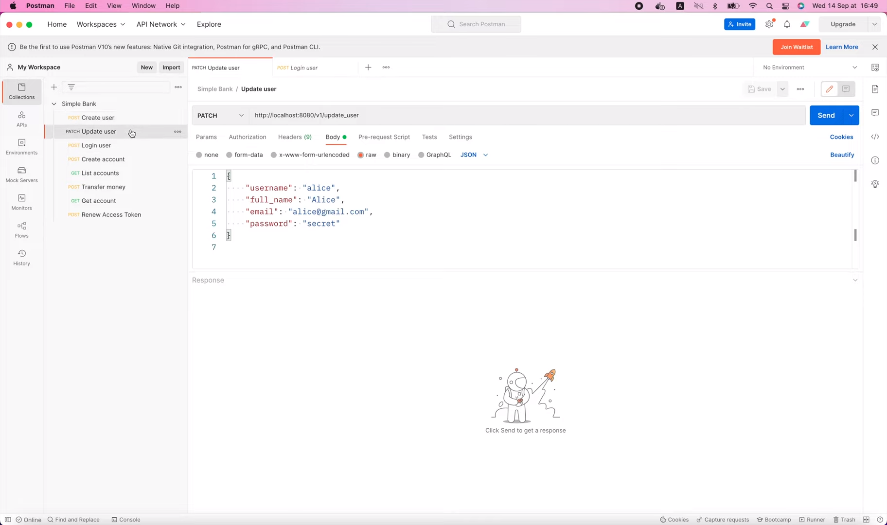

I'm gonna change the full name field to "New Alice" and send
this request with no authorization header.

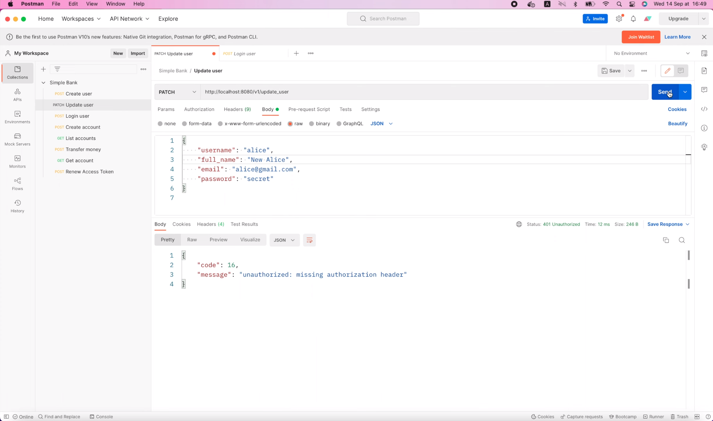

As you can see, we've got a 401 `Unauthorized` status code,
with a message saying: "unauthorized, missing authorization 
header". So we have to add the bearer access token to the 
header of this request.

Let's open the `Authorization` tab, and select `Bearer Token`
as authorization type.

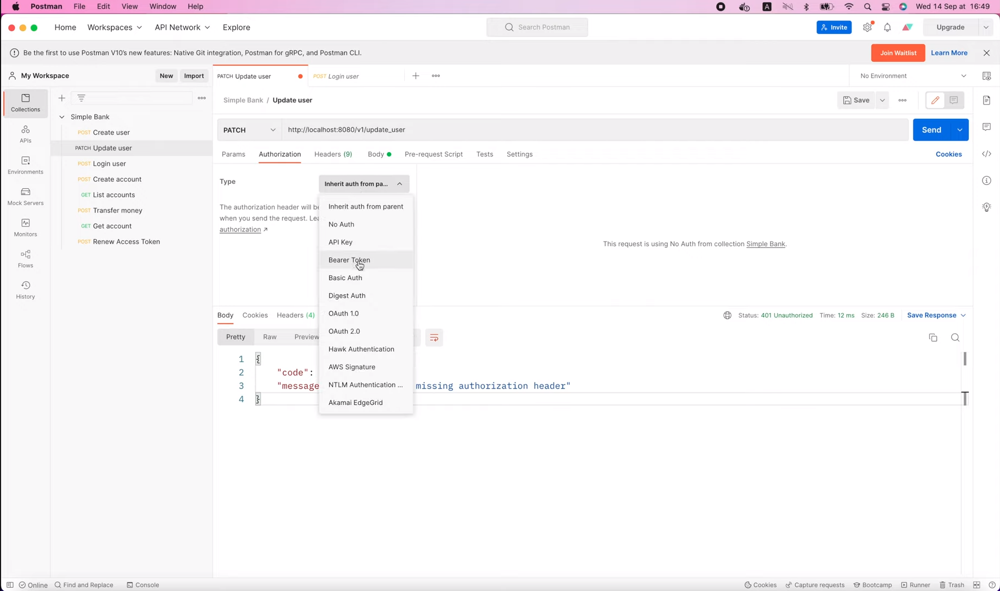

Then, we can put the access token inside this `Token` input box.
Let's temporarily set it to "abc" for now.


Then, in the `Headers` tab, we will see a new `Authorization` 
header show up, with the value "Bearer abc".

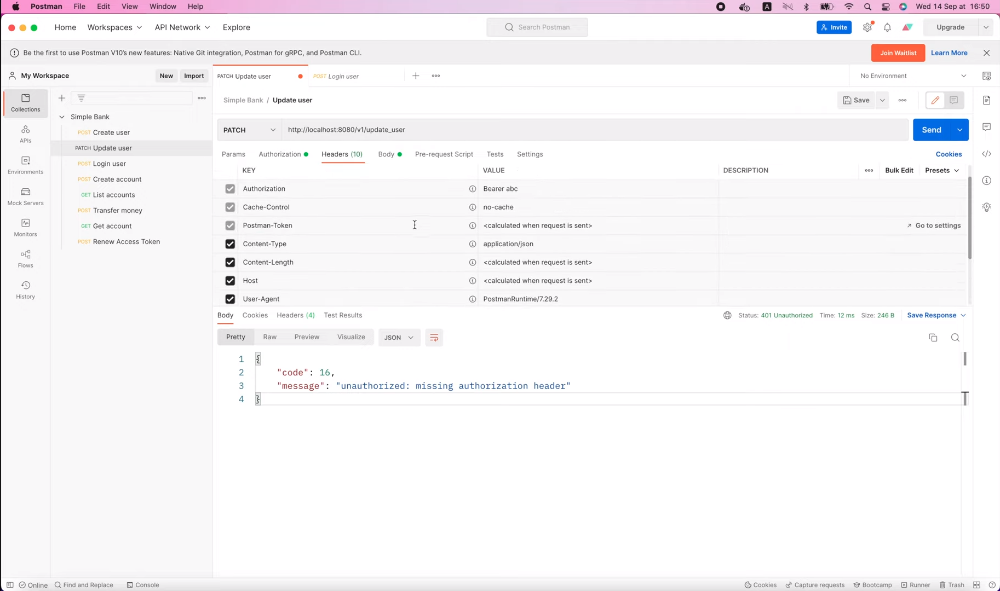

So now you know why we have the authorization header constant 
like this

```go
const (
	authorizationHeader = "authorization"
)
```

in the code.

Note that it doesn't matter if you use lowercase or uppercase
for the header name, because internally, gRPC will convert
it to lowercase.

```go
func (md MD) Get(k string) []string {
	k = strings.ToLower(k)
	return md[k]
}
```

OK, now let's try sending this request with an invalid token.


Voilà! This time, we still got 401 `Unauthorized` status code,
but with a different message: "invalid access token".

In order to get a valid access token, we have to call the 
login user API. Then copy this value of the access token from
the response body


and paste it to the `Token` input box of the `Authorization` 
header.

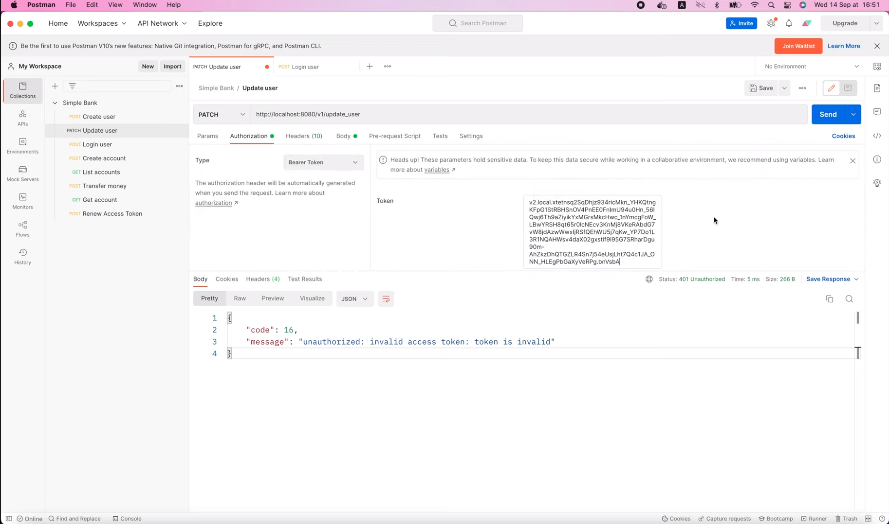

Now, if we resend the request, we will get a successful response.


The full name has been updated to "New Alice" as we expected.

So the HTTP API is working perfectly!

However, it's quite inconvenient to test the API if we have to 
copy the access token over every time we relogin or refresh it.
A better way to do this is to use the `Collection variables` 
feature of Postman.

So, in the `LoginUser` API, let's open the `Tests` tab.

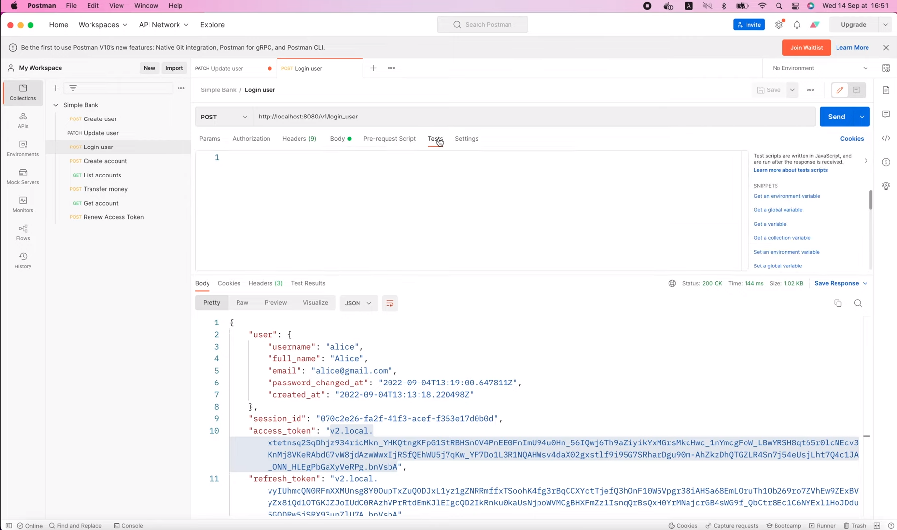

It's where we can write some scripts to test the response of the 
API. There are several examples of the test scripts here, I'm 
gonna select this test to check status code is 200.

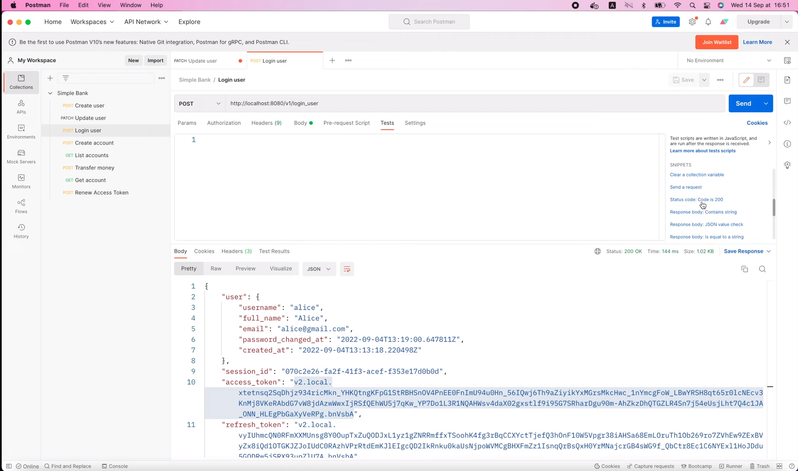

It will add this small piece of code to the test, 

```js
pm.test("Status code is 200", function () {
    pm.response.to.have.status(200)
})
```

which will verify that the request is successful. Now let's
try to add some more code to get the access token from the 
response and add it to the collection variables.

First, we will call `JSON.parse()` to parse the response
body. Then we use the `pm.collectionValues.set()` function
to set the access token's value to `jsonData.access_token`.
Note that this field name must match the one we received
in the response body.

```js
var jsonData = JSON.parse(responseBody);
pm.collectionVariables.set("access_token", jsonData.access_token)
```

OK, let's resend the request. It's successful.


And we can check the test result in this tab.

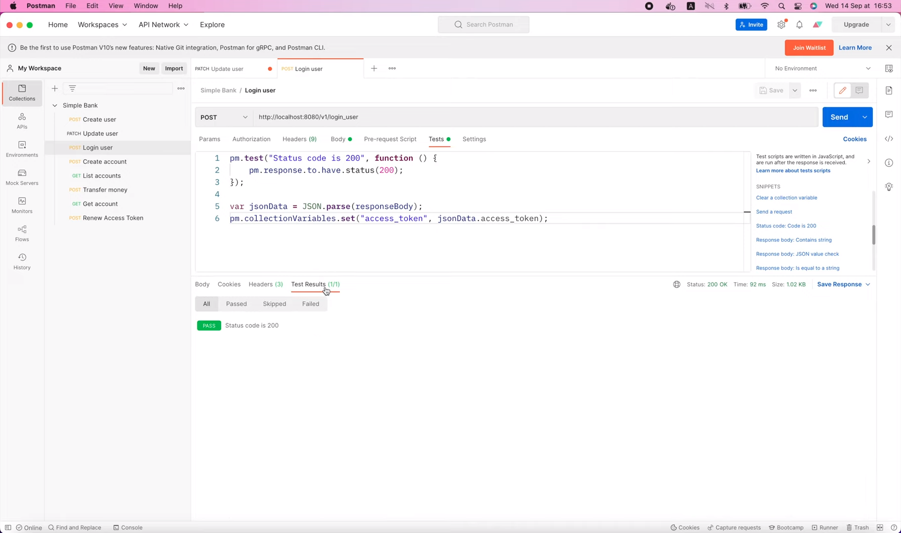

It passed. So now, if we click on the collection name, and open
its `Variables` list, we will see there's a new variable named 
"access_token", and its current value is one we've got in the 
login user's response.


Now, we can use this variable in the `UpdateUser` API. Just 
replace this hard-coded value with the `access_token` variable.
We can refer to it using a pair of double curly brackets like
this.


OK, now let's try updating the `email` to "new_alice@gmail.com"
and resend the request.

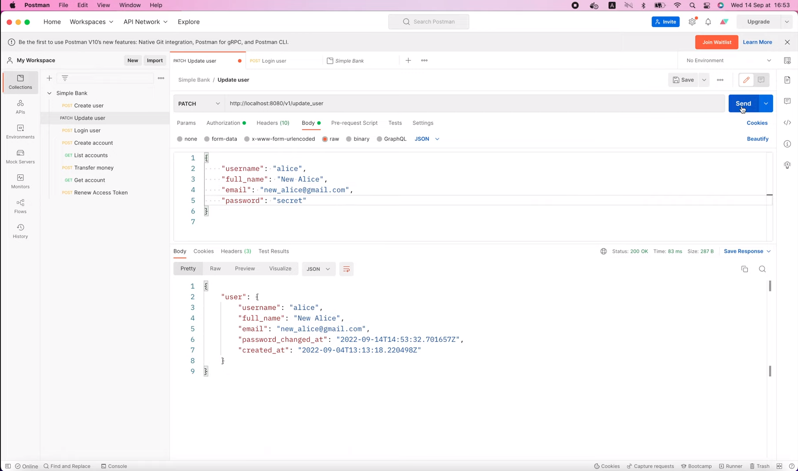

It's successful! Excellent.

So the HTTP gateway server is working properly.

## Testing gRPC API 

How about gRPC?

We can also test gRPC API with Postman, although it's still
a BETA feature at the time I record this video.

To use it, we just have to click on this `New` button on
the left-hand side menu, next to `My Workspace` and select
`gRPC Request`.

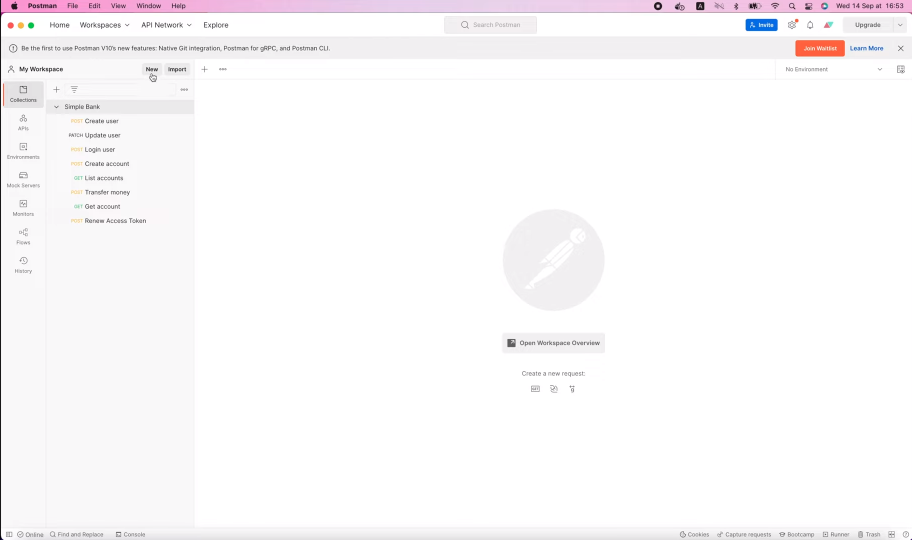

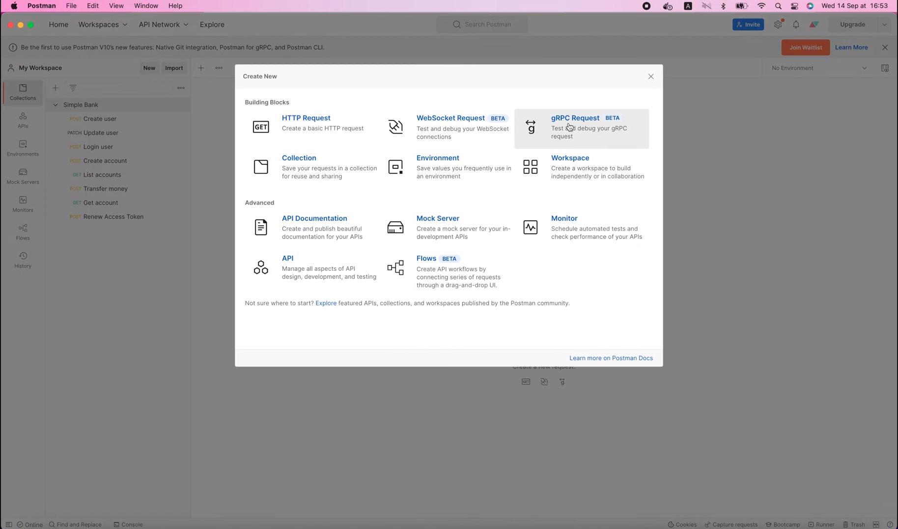

The first thing we need to do is to enter the URL of the 
gRPC server. As you've seen in the logs, our local gRPC 
server is running on port `9090`. So I'm gonna put 
`localhost:9090` here.


After doing so, all available RPCs on the server will show 
up in the method box.


Let's try the `LoginUser` RPC first. In the message input box,
we can write a normal JSON object, so let's set username to
"alice", and password to "secret". Then click this "Invoke"
button to send the request.

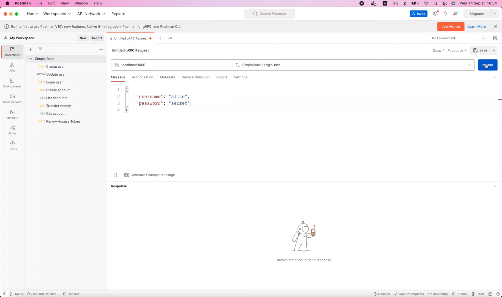

Voilà, the request is successful. And we can see all the returned
data in the response. It looks pretty similar to the body of the
HTTP request, except for some timestamp fields. 

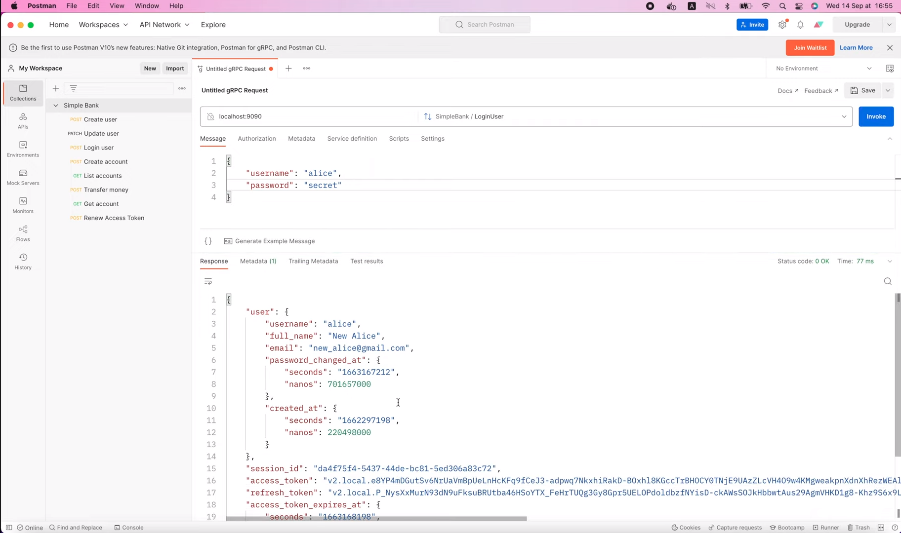

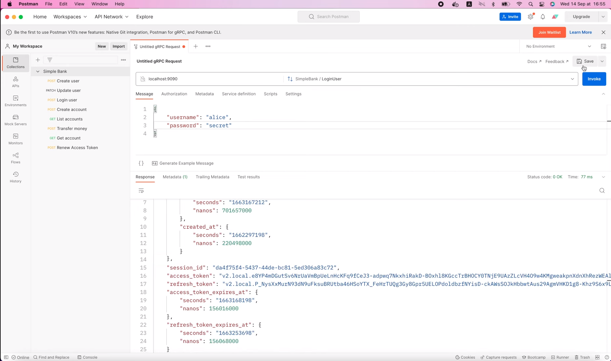

OK, now let's copy the access token. And let's save this request
with this name: "Login User RPC". We can't store this request
in the `Simple Bank` collection because that collection is for
HTTP requests only. So I'm gonna create a new collection called
Simple Bank gRPC.

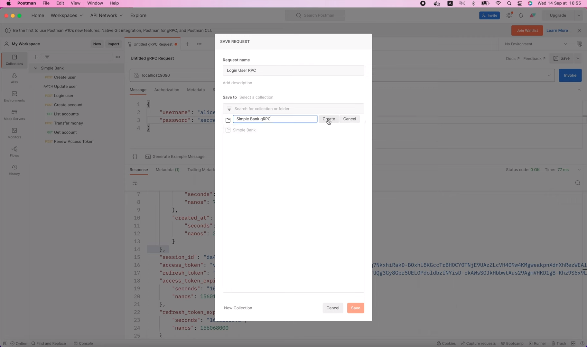

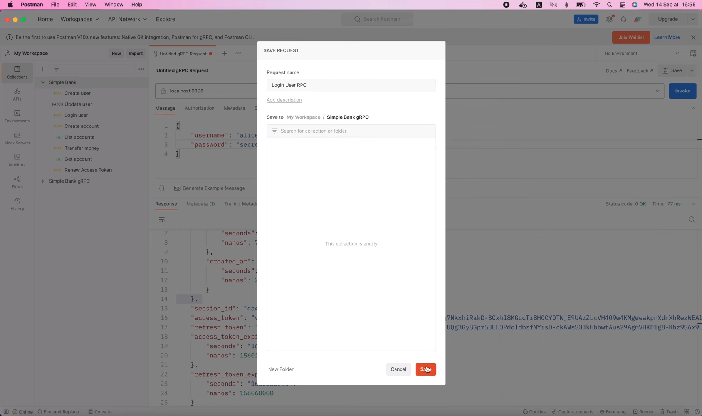

Alright, now the new collection has been created with the Logic
User RPC.

To create a new request, we can click this button and select
"Add Request", then `gRPC request`.

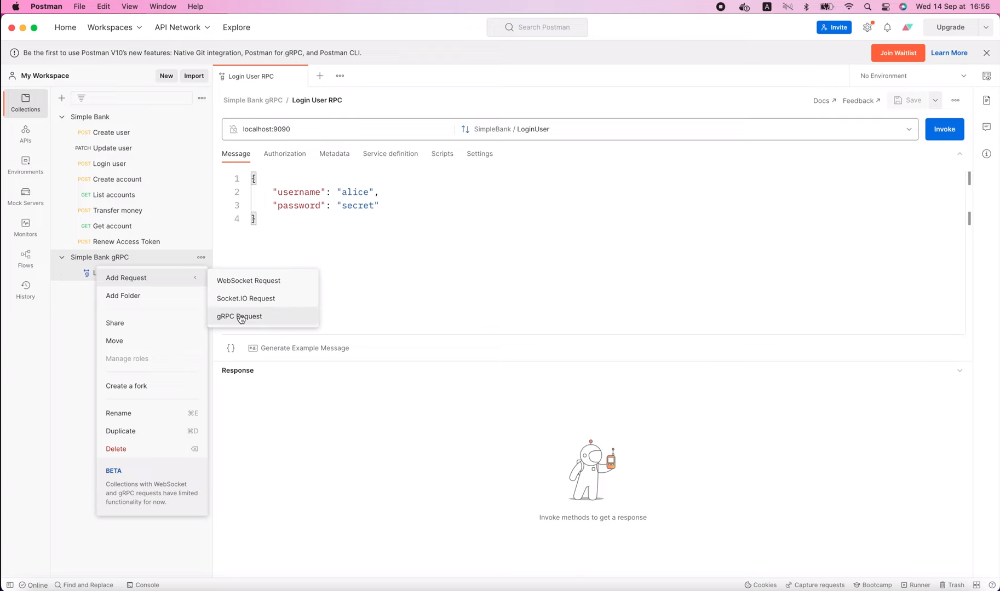

I'm gonna rename it to "Update User RPC", then change the server
URL to `localhost:9090` and select the `UpdateUser` method.


Next, in the message, let's try changing the username to "alice",
and full name to "Alice" as well.

If we invoke the method now, we will get an error message saying
"missing authorization header" and the status code is 
`16 Unauthenticated`.

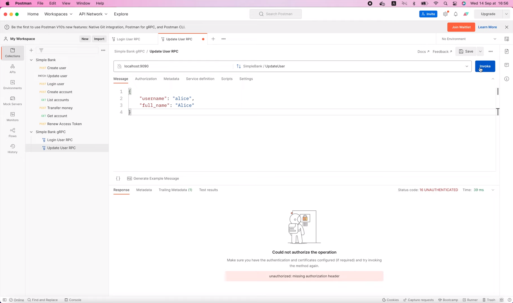

To fix this, let's open the `Metadata` tab, and add a new key:
`Authorization` with the value: `Bearer abc`. Let's test this
invalid token to see what happens.


We still got `16 Unauthenticated`, but the message is now "token
is invalid". So it seems to be working well. Now I'm gonna 
paste in the valid access token we got from Login User RPC
before and invoke the method one more time.


this time, the request is successful, and full name have been
updated. Exactly as we wanted. WE can also add email to the 
message to change it to `alice@gmail.com` and resend the request.


Then voila, the email has been updated to the new value.

And that brings us to the end of this video. today we've 
successfully added the authorization layer to the gRPC server
to protect our Update User API.

I hope you find it interesting and useful. Thanks a lot for
watching! Happy learning, and see you in the next lecture.